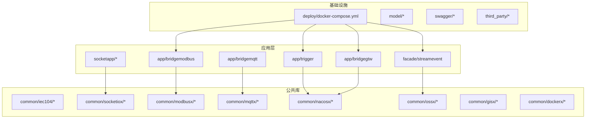
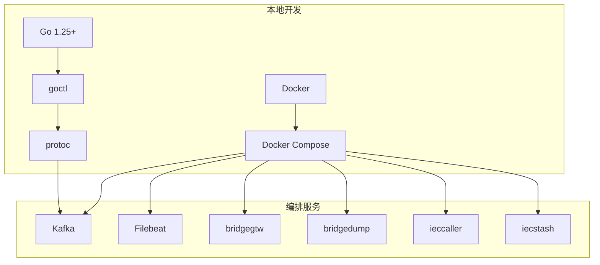
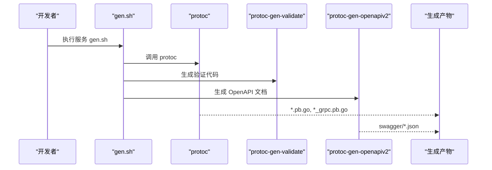
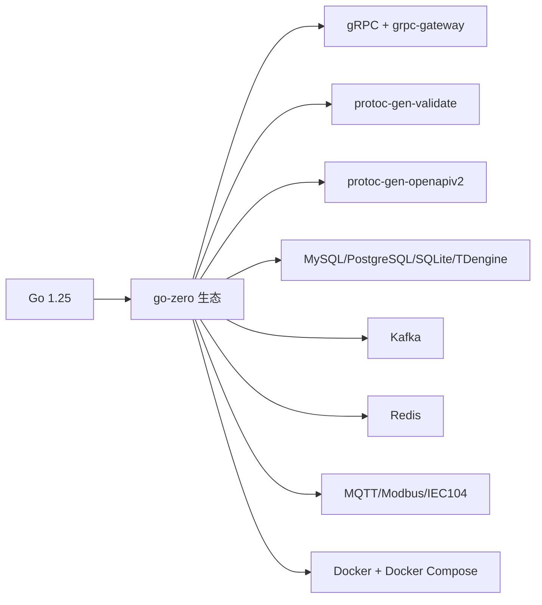

# 开发环境搭建

<cite>
**本文引用的文件**
- [go.mod](file://go.mod)
- [README.md](file://README.md)
- [deploy/docker-compose.yml](file://deploy/docker-compose.yml)
- [app/trigger/gen.sh](file://app/trigger/gen.sh)
- [third_party/gen.sh](file://third_party/gen.sh)
- [.trae/skills/dev-environment/SKILL.md](file://.trae/skills/dev-environment/SKILL.md)
- [app/trigger/etc/trigger.yaml](file://app/trigger/etc/trigger.yaml)
- [util/config.yaml](file://util/config.yaml)
- [app/bridgemodbus/deploy.sh](file://app/bridgemodbus/deploy.sh)
- [app/xfusionmock/deploy.sh](file://app/xfusionmock/deploy.sh)
- [socketapp/socketgtw/deploy.sh](file://socketapp/socketgtw/deploy.sh)
</cite>

## 目录
1. [简介](#简介)
2. [项目结构](#项目结构)
3. [核心组件](#核心组件)
4. [架构总览](#架构总览)
5. [详细组件分析](#详细组件分析)
6. [依赖分析](#依赖分析)
7. [性能考虑](#性能考虑)
8. [故障排查指南](#故障排查指南)
9. [结论](#结论)
10. [附录](#附录)

## 简介
本指南面向零基础到有经验的 Go 开发者，帮助你在本地快速搭建 zero-service 的开发环境。内容涵盖：
- Go 语言版本与 GOPATH/工作区设置
- go-zero 框架、Protocol Buffers、Docker/Docker Compose 的安装与配置
- 项目克隆、依赖安装与首次运行
- 代码生成、调试与常用开发工具链
- 常见环境问题排查与解决方案

## 项目结构
zero-service 是一个基于 go-zero 的微服务脚手架，采用多模块组织方式，核心目录包括：
- app/*：各微服务（如 trigger、bridgemodbus、bridgegtw、streamevent 等）
- common/*：公共组件库（如 IEC104、SocketIO、Modbus、MQTT、Nacos、OSS、GIS、Docker 封装等）
- model/*：数据库模型与 SQL 脚本
- deploy/*：Docker Compose 编排
- swagger/*：各服务的 Swagger 文档
- third_party/*：第三方 Proto 定义与生成工具
- util/*：运维与工具脚本
- gtw/、facade/、socketapp/：网关、对外接口层与实时通信模块

图表来源
- [README.md:61-108](file://README.md#L61-L108)
- [deploy/docker-compose.yml:1-110](file://deploy/docker-compose.yml#L1-L110)

章节来源
- [README.md:59-108](file://README.md#L59-L108)

## 核心组件
- go-zero 微服务框架：项目使用 goctl 生成 RPC/HTTP 代码，统一 gRPC + grpc-gateway 的接口风格。
- Protocol Buffers：通过 protoc 与 go-protobuf、grpc-gateway、protoc-gen-validate、protoc-gen-openapiv2 等插件生成 Go 代码与 Swagger 文档。
- Docker/Docker Compose：提供 Kafka、Filebeat、ieccaller、bridgegtw、bridgedump 等服务的一键编排。
- 代码生成：每个服务提供 gen.sh，一键生成 .pb.go、.grpc.pb.go、zrpc 代码与 Swagger。

章节来源
- [README.md:207-225](file://README.md#L207-L225)
- [app/trigger/gen.sh:1-19](file://app/trigger/gen.sh#L1-L19)
- [third_party/gen.sh:1-37](file://third_party/gen.sh#L1-L37)

## 架构总览
下图展示开发环境中的核心依赖与服务关系，便于理解本地启动顺序与依赖关系。

图表来源
- [README.md:226-252](file://README.md#L226-L252)
- [deploy/docker-compose.yml:1-110](file://deploy/docker-compose.yml#L1-L110)

## 详细组件分析

### 1) Go 语言开发环境
- 版本要求：项目明确使用 Go 1.25。
- 工作区与 GOPATH：推荐使用 Go Modules（无需 GOPATH），通过 go mod tidy 管理依赖。
- IDE 配置：推荐使用 GoLand；.trae 技能文档中提供了 GoLand、终端增强工具与 PATH 配置示例。

章节来源
- [go.mod:3](file://go.mod#L3)
- [.trae/skills/dev-environment/SKILL.md:10-23](file://.trae/skills/dev-environment/SKILL.md#L10-L23)

### 2) go-zero 与代码生成
- goctl：用于生成 RPC/HTTP 代码与 zrpc 客户端/服务端框架。
- 代码生成流程：在服务目录执行 gen.sh，即可生成 pb、grpc、zrpc 以及 Swagger 文档。
- 第三方 proto：third_party/gen.sh 生成扩展 proto 与错误码 proto。

图表来源
- [app/trigger/gen.sh:4-18](file://app/trigger/gen.sh#L4-L18)
- [third_party/gen.sh:12-36](file://third_party/gen.sh#L12-L36)

章节来源
- [README.md:273-287](file://README.md#L273-L287)
- [app/trigger/gen.sh:1-19](file://app/trigger/gen.sh#L1-L19)
- [third_party/gen.sh:1-37](file://third_party/gen.sh#L1-L37)

### 3) Protocol Buffers 编译器
- 项目使用 protoc 与多种插件：go、go-grpc、validate、openapiv2。
- 插件安装：建议通过包管理器或官方渠道安装 protoc 与插件，并确保 PATH 中可找到。

章节来源
- [app/trigger/gen.sh:4-18](file://app/trigger/gen.sh#L4-L18)
- [third_party/gen.sh:12-36](file://third_party/gen.sh#L12-L36)
- [.trae/skills/dev-environment/SKILL.md:50-63](file://.trae/skills/dev-environment/SKILL.md#L50-L63)

### 4) Docker 与 Docker Compose
- Docker：用于构建与运行服务镜像。
- Docker Compose：一键启动 Kafka、Filebeat、bridgegtw、bridgedump、ieccaller、iecstash 等服务。
- 端口与卷：根据 compose 文件映射端口与日志卷，注意宿主机路径与权限。

章节来源
- [README.md:300-318](file://README.md#L300-L318)
- [deploy/docker-compose.yml:1-110](file://deploy/docker-compose.yml#L1-L110)

### 5) 项目克隆、依赖安装与首次运行
- 克隆与初始化
  - git clone 项目
  - 进入项目根目录，执行 go mod tidy
- 启动单服务
  - 进入 app/{service}，执行 go run {service}.go -f etc/{service}.yaml
- 使用 Docker Compose
  - 进入 deploy，执行 docker-compose up -d

章节来源
- [README.md:234-252](file://README.md#L234-L252)

### 6) 开发工具链配置
- 终端与 IDE
  - GoLand、zsh + starship、fzf、zoxide 等
  - PATH 中包含 go/bin、自定义 docker 工具等
- 工具链版本
  - go、goctl、protoc、docker、自定义 depu 工具

章节来源
- [.trae/skills/dev-environment/SKILL.md:10-63](file://.trae/skills/dev-environment/SKILL.md#L10-L63)

### 7) 配置文件与运行参数
- 服务配置：各服务的 etc/{service}.yaml 包含监听地址、日志、Redis、数据库、Nacos 等配置项。
- 示例：trigger.yaml 展示了日志、Redis、DB、StreamEventConf 等关键配置。

章节来源
- [app/trigger/etc/trigger.yaml:1-38](file://app/trigger/etc/trigger.yaml#L1-L38)

### 8) 部署脚本与 CI/CD 流程
- 服务独立部署脚本：bridgemodbus、xfusionmock、socketgtw 等均提供 deploy.sh，支持本地构建镜像与远程部署。
- 环境变量：脚本通过 env/{env}.env 注入 REMOTE_*、IMAGE_NAME、SERVICE_NAME 等变量。

章节来源
- [app/bridgemodbus/deploy.sh:1-50](file://app/bridgemodbus/deploy.sh#L1-L50)
- [app/xfusionmock/deploy.sh:1-50](file://app/xfusionmock/deploy.sh#L1-L50)
- [socketapp/socketgtw/deploy.sh:1-50](file://socketapp/socketgtw/deploy.sh#L1-L50)
- [util/config.yaml:1-26](file://util/config.yaml#L1-L26)

## 依赖分析
- 语言与框架
  - Go 1.25
  - go-zero 与相关生态（grpc-gateway、protoc-gen-validate、protoc-gen-openapiv2）
- 数据库与中间件
  - MySQL、PostgreSQL、SQLite、TDengine（通过驱动与 ORM）
  - Kafka（消息队列）、Redis（任务队列与缓存）
- 协议与通信
  - gRPC + grpc-gateway、MQTT、Modbus、IEC 104
- 容器与编排
  - Docker、Docker Compose

图表来源
- [go.mod:5-62](file://go.mod#L5-L62)
- [README.md:207-225](file://README.md#L207-L225)

章节来源
- [go.mod:5-62](file://go.mod#L5-L62)
- [README.md:207-225](file://README.md#L207-L225)

## 性能考虑
- 代码生成与缓存：首次生成耗时较长，建议在本地缓存生成产物，避免重复生成。
- Docker 资源限制：compose 文件中对部分服务设置了内存限制，可根据宿主机资源调整。
- 日志与持久化：日志卷映射到宿主机，注意磁盘空间与日志轮转策略。

章节来源
- [deploy/docker-compose.yml:54-109](file://deploy/docker-compose.yml#L54-L109)

## 故障排查指南
- 依赖安装失败
  - 确认 go.mod 中 go 版本与本地一致（Go 1.25）
  - 执行 go mod tidy，清理并重新下载依赖
- protoc 插件缺失
  - 安装 protoc 与插件（go、go-grpc、validate、openapiv2），确保 PATH 可找到
- Docker/Compose 启动异常
  - 检查端口占用与防火墙
  - 确认卷挂载路径存在且权限正确
- 服务无法连接 Redis/DB
  - 校验 etc/{service}.yaml 中的连接串与密码
  - 若使用 Docker Compose，请确认容器网络与服务名解析
- 生成代码报错
  - 检查 gen.sh 的 proto_path 与第三方 proto 路径
  - 清理旧生成产物后重试

章节来源
- [go.mod:3](file://go.mod#L3)
- [app/trigger/gen.sh:4-18](file://app/trigger/gen.sh#L4-L18)
- [third_party/gen.sh:6-36](file://third_party/gen.sh#L6-L36)
- [deploy/docker-compose.yml:13-52](file://deploy/docker-compose.yml#L13-L52)
- [app/trigger/etc/trigger.yaml:19-37](file://app/trigger/etc/trigger.yaml#L19-L37)

## 结论
按照本指南完成 Go、go-zero、protoc、Docker/Compose 的安装与配置，并通过 gen.sh 与 docker-compose 快速启动核心服务，即可进入开发与调试阶段。遇到问题时，优先检查版本匹配、PATH、端口与卷挂载、配置文件连通性等常见因素。

## 附录

### A. 快速操作清单
- 安装 Go 1.25、goctl、protoc、Docker、Docker Compose
- 克隆项目并执行 go mod tidy
- 生成代码：在服务目录执行 gen.sh
- 启动服务：单服务 go run 或 docker-compose up -d
- 修改配置：编辑 etc/{service}.yaml

章节来源
- [README.md:226-252](file://README.md#L226-L252)
- [app/trigger/gen.sh:1-19](file://app/trigger/gen.sh#L1-L19)