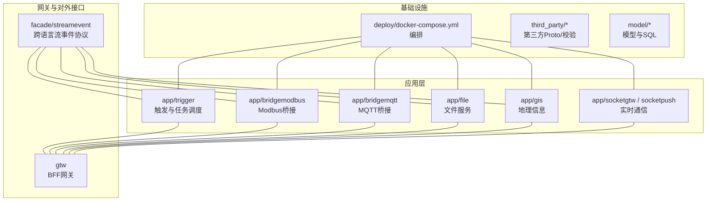
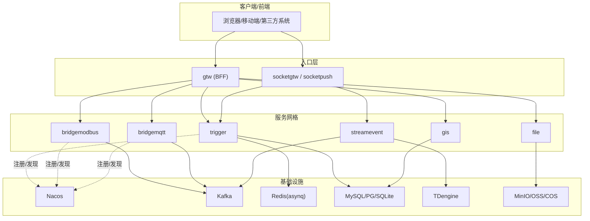
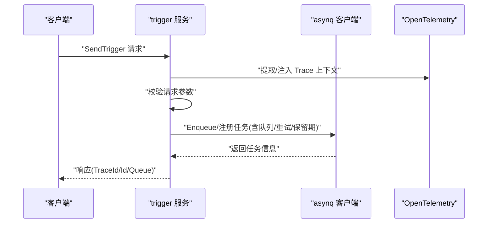
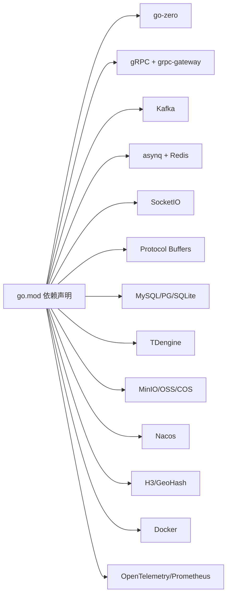
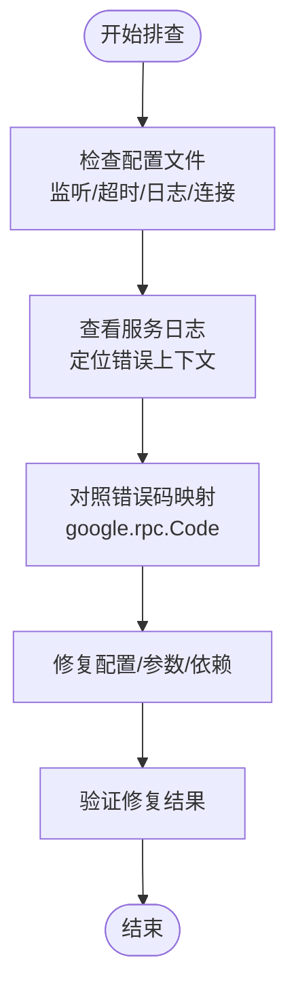

# 开发规范

<cite>
**本文引用的文件**
- [README.md](file://README.md)
- [code.md](file://code.md)
- [go.mod](file://go.mod)
- [buf.yaml](file://third_party/buf.yaml)
- [app/trigger/etc/trigger.yaml](file://app/trigger/etc/trigger.yaml)
- [app/trigger/internal/config/config.go](file://app/trigger/internal/config/config.go)
- [app/trigger/internal/logic/sendtriggerlogic.go](file://app/trigger/internal/logic/sendtriggerlogic.go)
- [common/Interceptor/rpcserver/loggerInterceptor.go](file://common/Interceptor/rpcserver/loggerInterceptor.go)
- [deploy/docker-compose.yml](file://deploy/docker-compose.yml)
- [model/genModel.sh](file://model/genModel.sh)
- [util/Taskfile.yml](file://util/Taskfile.yml)
</cite>

## 目录
1. [引言](#引言)
2. [项目结构](#项目结构)
3. [核心组件](#核心组件)
4. [架构总览](#架构总览)
5. [详细组件分析](#详细组件分析)
6. [依赖分析](#依赖分析)
7. [性能考虑](#性能考虑)
8. [故障排查指南](#故障排查指南)
9. [结论](#结论)
10. [附录](#附录)

## 引言
本开发规范旨在为 zero-service 项目提供统一的代码风格、审查标准、Git 工作流、文档编写与代码质量工具使用指南，确保多协议接入、异步任务调度、实时通信等复杂场景下的工程一致性与可维护性。

## 项目结构
- 采用按功能域划分的多服务微架构，核心服务集中在 app/ 目录，公共能力沉淀在 common/，对外统一入口在 gtw/ 与 facade/，部署编排在 deploy/，模型生成在 model/，第三方协议在 third_party/，工具集在 util/。
- README.md 提供了总体架构、模块职责与快速开始指引；各服务均遵循 go-zero 生成的目录结构：etc/ 配置、internal/ 内部实现（config、logic、server、svc、types）、Dockerfile、gen.sh 代码生成脚本、以及 swagger 文档输出。

图表来源
- [README.md:59-108](file://README.md#L59-L108)
- [deploy/docker-compose.yml:1-110](file://deploy/docker-compose.yml#L1-L110)

章节来源
- [README.md:59-108](file://README.md#L59-L108)

## 核心组件
- 触发与任务调度（trigger）：基于 asynq 的分布式任务队列与自研计划任务引擎，支持 HTTP/gRPC 回调、定时/延时任务、重试与生命周期管理。
- 实时通信（socketapp）：SocketIO 网关与推送服务，支持房间管理、广播、单播、MQTT 桥接与 Token 鉴权。
- 协议桥接（bridge*）：Modbus/TCP、MQTT、HTTP 等协议桥接到内部 gRPC 服务。
- 文件服务（file）：分片流上传、OSS 集成与视频流捕获。
- 地理信息（gis）：H3/GeoHash/围栏/坐标转换。
- BFF 网关（gtw）：统一入口，聚合 gRPC 与 grpc-gateway HTTP 访问。
- 对外接口层（facade/streamevent）：跨语言流数据事件协议，统一 IEC104、MQTT、WebSocket、Kafka 等消息入口。

章节来源
- [README.md:110-206](file://README.md#L110-L206)

## 架构总览
- 服务间通过 gRPC 通信，部分服务通过 grpc-gateway 提供 HTTP 访问。
- 消息队列采用 Kafka，任务队列采用 Redis + asynq，服务注册与发现采用 Nacos。
- 数据层支持 MySQL/PostgreSQL/SQLite 与 TDengine，对象存储支持 MinIO/阿里OSS/腾讯COS。

图表来源
- [README.md:15-51](file://README.md#L15-L51)
- [go.mod:5-62](file://go.mod#L5-L62)

章节来源
- [README.md:15-51](file://README.md#L15-L51)
- [go.mod:5-62](file://go.mod#L5-L62)

## 详细组件分析

### 触发与任务调度（trigger）组件
- 配置结构：包含服务监听、日志、Nacos 注册、Redis、数据库、GracePeriod、StreamEventConf 等字段，体现 go-zero 配置风格与可选增强。
- 业务逻辑：发送触发任务时注入 OpenTelemetry 上下文、校验请求、根据触发时间或延迟参数选择 Enqueue 或 Scheduler 注册，并返回 TraceId、任务 ID、队列等信息。
- 错误处理：对无效触发时间、序列化失败、入队错误进行返回；拦截器中记录 RPC 服务端错误。

图表来源
- [app/trigger/internal/logic/sendtriggerlogic.go:37-104](file://app/trigger/internal/logic/sendtriggerlogic.go#L37-L104)
- [common/Interceptor/rpcserver/loggerInterceptor.go:12-44](file://common/Interceptor/rpcserver/loggerInterceptor.go#L12-L44)

章节来源
- [app/trigger/etc/trigger.yaml:1-37](file://app/trigger/etc/trigger.yaml#L1-L37)
- [app/trigger/internal/config/config.go:9-27](file://app/trigger/internal/config/config.go#L9-L27)
- [app/trigger/internal/logic/sendtriggerlogic.go:37-104](file://app/trigger/internal/logic/sendtriggerlogic.go#L37-L104)
- [common/Interceptor/rpcserver/loggerInterceptor.go:12-44](file://common/Interceptor/rpcserver/loggerInterceptor.go#L12-L44)

### 实时通信（socketapp）组件
- 网关与推送服务协同：网关负责连接管理、房间与消息路由，推送服务负责 Token 生成/验证与 gRPC 推送接口。
- 能力涵盖：房间加入/离开/广播、单播/批量推送、会话剔除、MQTT 桥接、统计信息推送与错误检测。

章节来源
- [README.md:156-173](file://README.md#L156-L173)

### 协议桥接（bridge*）组件
- Modbus/TCP、MQTT、HTTP 等协议桥接到内部 gRPC 服务，便于统一治理与扩展。
- 支持配置化与可插拔的协议适配器。

章节来源
- [README.md:174-188](file://README.md#L174-L188)

### 文件服务（file）与地理信息（gis）
- 文件服务：分片流上传、OSS 集成、视频流捕获。
- 地理信息：H3/GeoHash/围栏/坐标转换，支撑空间分析与可视化。

章节来源
- [README.md:176-180](file://README.md#L176-L180)

### BFF 网关（gtw）与对外接口层（facade/streamevent）
- BFF 网关：统一 API 入口，聚合 gRPC 与 grpc-gateway HTTP 访问，支持 JWT、微信支付回调、短信验证码、CORS。
- 对外接口层：跨语言流数据事件协议，统一 IEC104、MQTT、WebSocket、Kafka 等消息入口。

章节来源
- [README.md:189-206](file://README.md#L189-L206)

## 依赖分析
- 技术栈：go-zero 微服务框架、gRPC + grpc-gateway + Protocol Buffers、Kafka、asynq + Redis、SocketIO、IEC 104/Modbus/MQTT、MySQL/PostgreSQL/SQLite、TDengine、MinIO/OSS/COS、Nacos、H3/GeoHash、Docker、OpenTelemetry/Prometheus。
- 依赖管理：go.mod 中集中声明，部分包通过 replace 指定 fork 版本，确保兼容性与稳定性。

图表来源
- [go.mod:5-62](file://go.mod#L5-L62)

章节来源
- [go.mod:5-62](file://go.mod#L5-L62)

## 性能考虑
- 任务队列与重试：合理设置 asynq 队列优先级、最大重试次数与保留期，避免热点任务阻塞。
- 数据库与日志：禁用冗余 SQL 日志（DisableStmtLog），控制日志级别与路径，减少 IO 压力。
- 网络与超时：为 gRPC 设置合理的 Timeout 与 GracePeriod，避免长尾请求拖垮服务。
- 缓存与连接池：利用 go-zero 的连接池与缓存配置，结合 Redis 集群提升吞吐。

章节来源
- [app/trigger/etc/trigger.yaml:24-37](file://app/trigger/etc/trigger.yaml#L24-L37)
- [app/trigger/internal/config/config.go:24-27](file://app/trigger/internal/config/config.go#L24-L27)

## 故障排查指南
- 错误码映射：遵循 google.rpc.Code 标准，HTTP 与 gRPC 错误码映射清晰，便于统一诊断。
- RPC 拦截器：服务端拦截器从 metadata 注入用户与追踪上下文，并在错误时记录日志，有助于定位问题。
- 配置检查：核对 etc/*.yaml 中的监听地址、超时、日志路径、Redis/Kafka/DB/Nacos 等连接信息。
- 模型生成：使用 model/genModel.sh 生成模型时注意数据库连接参数与表名，确保生成目录与包名一致。

图表来源
- [code.md:1-66](file://code.md#L1-L66)
- [common/Interceptor/rpcserver/loggerInterceptor.go:12-44](file://common/Interceptor/rpcserver/loggerInterceptor.go#L12-L44)
- [app/trigger/etc/trigger.yaml:1-37](file://app/trigger/etc/trigger.yaml#L1-L37)

章节来源
- [code.md:1-66](file://code.md#L1-L66)
- [common/Interceptor/rpcserver/loggerInterceptor.go:12-44](file://common/Interceptor/rpcserver/loggerInterceptor.go#L12-L44)
- [app/trigger/etc/trigger.yaml:1-37](file://app/trigger/etc/trigger.yaml#L1-L37)

## 结论
通过统一的开发规范与工具链，zero-service 能够在多协议接入、异步任务调度与实时通信等复杂场景下保持工程一致性、可维护性与可扩展性。建议团队严格遵循本文规范，持续完善文档与自动化流程。

## 附录

### 代码风格规范
- 变量命名
  - go-zero 生成代码遵循 gozero 风格（如 model 生成脚本中的 style=gozero），字段与包名保持一致。
  - 配置结构字段采用驼峰命名，布尔开关使用 IsXxx/HasXxx 等语义明确的前缀。
- 函数命名
  - 业务逻辑函数以动词开头，如 SendTrigger、CreatePod、ReadHoldingRegisters 等，保持简洁明确。
  - 服务方法遵循 gRPC 惯例，首字母大写，动宾结构。
- 注释规范
  - 包注释与导出类型/函数注释遵循 GoDoc 规范，说明用途、参数、返回值与注意事项。
  - 关键流程（如任务入队、参数校验、错误处理）添加简要注释，便于回溯。
- 文件组织结构
  - 服务目录遵循 go-zero 生成模板：etc/、internal/（config、logic、server、svc、types）、Dockerfile、gen.sh、swagger。
  - 公共组件放入 common/，按功能域拆分（如 asynqx、nacosx、mqttx 等）。

章节来源
- [model/genModel.sh:24](file://model/genModel.sh#L24)
- [app/trigger/internal/config/config.go:9-27](file://app/trigger/internal/config/config.go#L9-L27)
- [app/trigger/internal/logic/sendtriggerlogic.go:37-104](file://app/trigger/internal/logic/sendtriggerlogic.go#L37-L104)

### 代码审查标准
- Pull Request 模板
  - 标题：简明描述变更内容（如“feat: 添加任务重试策略”）。
  - 摘要：说明背景、改动范围、影响面与测试要点。
  - 代码审查清单
    - 是否遵循代码风格与文件组织规范？
    - 配置项是否齐全且默认值合理？（如超时、日志、Redis/Kafka/DB/Nacos）
    - 错误处理是否完整？是否符合 google.rpc.Code 映射？
    - 是否新增或更新了 Swagger 文档？
    - 是否补充单元测试或集成测试？
    - 是否更新了部署编排（docker-compose）或环境变量？
- 合并要求
  - 至少一名 reviewer 通过。
  - CI 通过，无严重或阻断性告警。
  - 文档与注释同步更新。

章节来源
- [code.md:1-66](file://code.md#L1-L66)
- [README.md:262-298](file://README.md#L262-L298)

### Git 工作流程规范
- 分支命名约定
  - feature/功能点描述
  - fix/问题修复
  - hotfix/紧急修复
  - refactor/重构
  - docs/文档更新
- 提交信息格式
  - type(scope): subject
  - 示例：feat(trigger): 增加定时任务调度能力
- 版本标签管理
  - 采用语义化版本（SemVer），发布前在 README 或 CHANGELOG 中记录变更摘要。

章节来源
- [README.md:262-298](file://README.md#L262-L298)

### 文档编写规范
- API 文档
  - gRPC 接口定义位于 app/*/ *.proto，Swagger 文档位于 swagger/ 目录，随服务更新同步生成。
- 架构文档
  - README.md 提供总体架构与模块职责，docs/ 目录存放专题文档（如 IEC104、Trigger、SocketIO）。
- 技术文档
  - common/ 与 third_party/ 下的组件文档应与实现同步更新，便于复用与演进。

章节来源
- [README.md:288-298](file://README.md#L288-L298)
- [swagger/trigger.swagger.json](file://swagger/trigger.swagger.json)
- [swagger/podengine.swagger.json](file://swagger/podengine.swagger.json)
- [swagger/streamevent.swagger.json](file://swagger/streamevent.swagger.json)

### 代码质量工具使用指南
- 静态分析
  - 使用 go vet、golangci-lint（建议在 CI 中配置）进行静态检查，关注竞态、未使用变量、复杂度等。
- 代码格式化
  - 使用 gofmt/goimports 统一格式，结合 IDE 钩子在保存时自动格式化。
- 协议与校验
  - buf.yaml 配置了 lint 与 breaking 检查，确保 proto 变更可追踪且不破坏兼容。
- 安全扫描
  - 使用 govulncheck 或企业级 SAST 工具定期扫描依赖漏洞，结合 go.mod 的替换与依赖版本升级策略。

章节来源
- [buf.yaml:1-12](file://third_party/buf.yaml#L1-L12)

### 开发与运行规范
- 快速启动
  - 使用 go run 启动单服务，或使用 docker-compose 启动编排环境。
- 配置管理
  - 各服务配置位于 app/{service}/etc/，默认日志路径与级别可在配置中调整。
- 模型生成
  - 使用 model/genModel.sh 生成模型，注意数据库连接参数与表名，生成后迁移至对应服务 model 目录并修正包名。

章节来源
- [README.md:242-261](file://README.md#L242-L261)
- [app/trigger/etc/trigger.yaml:1-37](file://app/trigger/etc/trigger.yaml#L1-L37)
- [model/genModel.sh:1-25](file://model/genModel.sh#L1-L25)

### 部署与运维规范
- Docker Compose
  - deploy/docker-compose.yml 提供 Kafka、Filebeat、ieccaller、bridgegtw、bridgedump 等核心服务编排，支持主机网络与持久化卷。
- 环境变量与镜像标签
  - 通过环境变量 MAIN_TAG 控制镜像版本，结合 REGISTER 指定镜像仓库。
- 任务编排
  - util/Taskfile.yml 提供任务编排入口，建议在 CI 中统一执行构建与测试任务。

章节来源
- [deploy/docker-compose.yml:1-110](file://deploy/docker-compose.yml#L1-L110)
- [util/Taskfile.yml:1-33](file://util/Taskfile.yml#L1-L33)