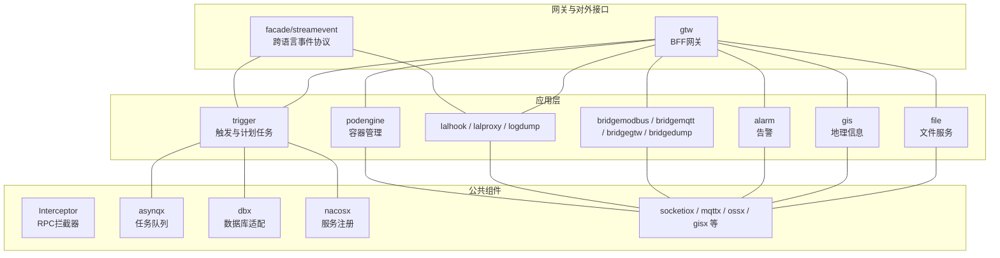
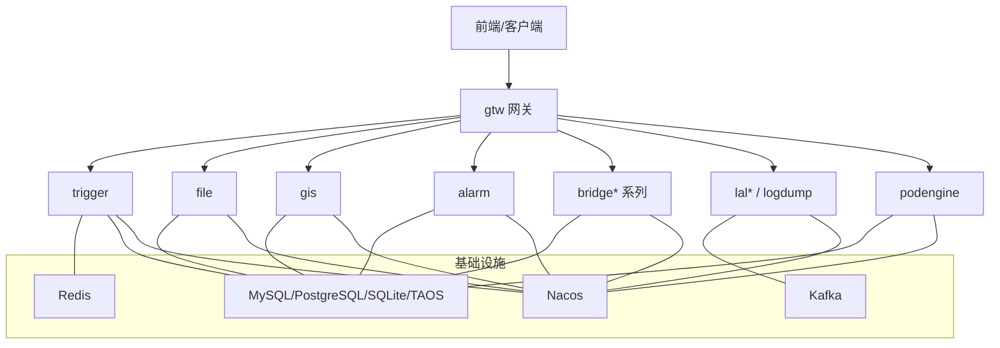
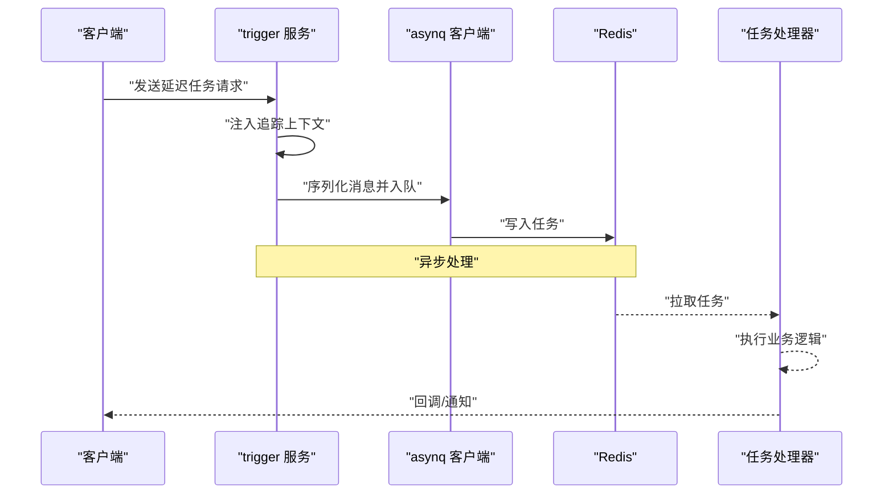
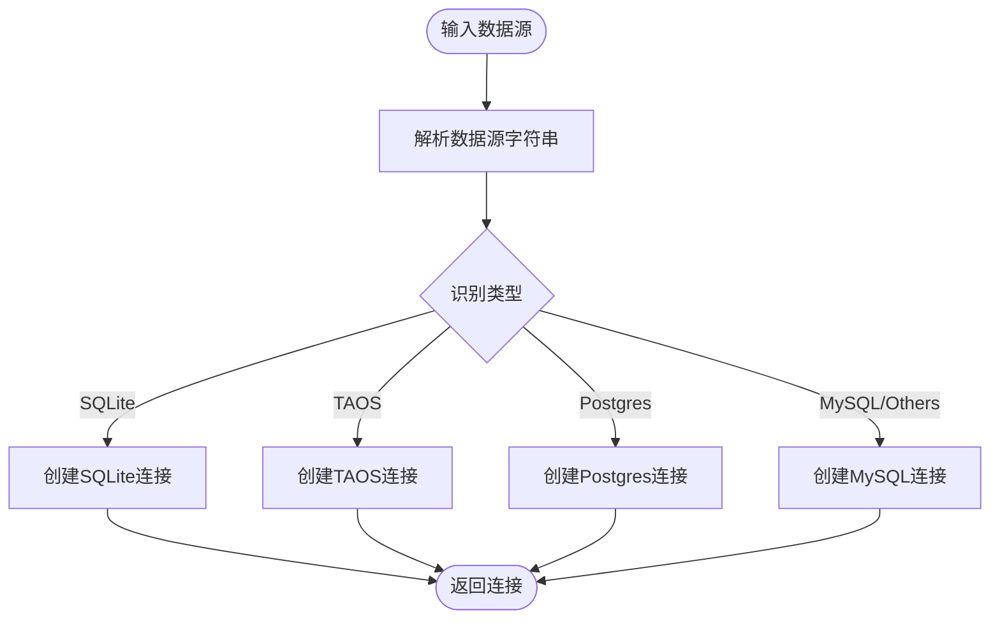
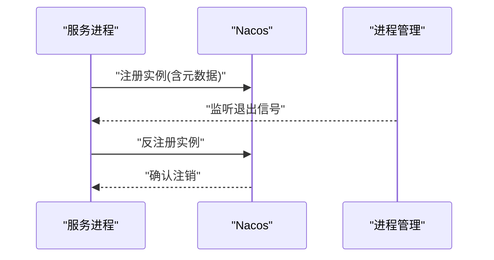
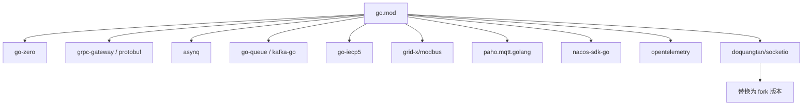

# 最佳实践

<cite>
**本文引用的文件**   
- [README.md](file://README.md)
- [go.mod](file://go.mod)
- [code.md](file://code.md)
- [app/trigger/etc/trigger.yaml](file://app/trigger/etc/trigger.yaml)
- [app/trigger/trigger.go](file://app/trigger/trigger.go)
- [app/trigger/internal/config/config.go](file://app/trigger/internal/config/config.go)
- [common/Interceptor/rpcserver/loggerInterceptor.go](file://common/Interceptor/rpcserver/loggerInterceptor.go)
- [common/ctxdata/ctxData.go](file://common/ctxdata/ctxData.go)
- [common/dbx/dbx.go](file://common/dbx/dbx.go)
- [common/asynqx/asynqClient.go](file://common/asynqx/asynqClient.go)
- [zerorpc/internal/logic/senddelaytasklogic.go](file://zerorpc/internal/logic/senddelaytasklogic.go)
- [common/nacosx/register.go](file://common/nacosx/register.go)
- [deploy/docker-compose.yml](file://deploy/docker-compose.yml)
</cite>

## 目录
1. [简介](#简介)
2. [项目结构](#项目结构)
3. [核心组件](#核心组件)
4. [架构总览](#架构总览)
5. [详细组件分析](#详细组件分析)
6. [依赖分析](#依赖分析)
7. [性能考量](#性能考量)
8. [故障排查指南](#故障排查指南)
9. [结论](#结论)
10. [附录](#附录)

## 简介
本指南面向Zero-Service项目的开发者与运维人员，系统总结项目在开发过程中的最佳实践与设计原则，涵盖代码规范、架构设计、性能优化与安全考虑；阐述“约定优于配置”的工程化理念（目录结构、命名规范、配置管理等）；介绍常用设计模式与架构模式在项目中的落地（如CQRS、事件驱动、微服务拆分原则）；并通过具体文件路径与流程图示例，帮助团队在日常开发中高效应用这些实践。

## 项目结构
Zero-Service采用go-zero微服务脚手架，围绕物联网数采、异步任务调度、实时通信等场景构建，形成清晰的模块化结构：
- 应用层（app/）：每个子目录代表一个独立的微服务，包含proto定义、配置、内部逻辑、服务与上下文等
- 公共组件（common/）：拦截器、协议扩展、任务队列、数据库适配、Nacos注册、SocketIO封装等
- 模型与SQL（model/）：数据库模型与迁移脚本
- 网关（gtw/）与对外接口（facade/streamevent/）：统一入口与跨语言事件协议
- 部署（deploy/）：Docker Compose编排
- 文档与Swagger：架构图、协议文档与API文档

图表来源
- [README.md:59-108](file://README.md#L59-L108)
- [app/trigger/trigger.go:34-88](file://app/trigger/trigger.go#L34-L88)

章节来源
- [README.md:59-108](file://README.md#L59-L108)

## 核心组件
- 配置管理：服务均通过etc/下的YAML配置文件集中管理，支持日志、Redis、数据库、Nacos、超时与优雅停机等关键参数
- RPC与拦截器：统一使用gRPC + grpc-gateway，服务端通过拦截器注入上下文与日志
- 数据库适配：dbx根据数据源自动识别MySQL/PostgreSQL/SQLite/TAOS，并提供goqu方言与日志桥接
- 任务队列：asynqClient封装生产者与追踪，结合OpenTelemetry进行跨服务链路追踪
- 服务注册：nacosx提供注册与注销，支持优雅停机
- 错误码规范：遵循google.rpc.Code，HTTP与gRPC映射明确

章节来源
- [app/trigger/etc/trigger.yaml:1-37](file://app/trigger/etc/trigger.yaml#L1-L37)
- [app/trigger/internal/config/config.go:9-27](file://app/trigger/internal/config/config.go#L9-L27)
- [common/Interceptor/rpcserver/loggerInterceptor.go:12-44](file://common/Interceptor/rpcserver/loggerInterceptor.go#L12-L44)
- [common/dbx/dbx.go:31-64](file://common/dbx/dbx.go#L31-L64)
- [common/asynqx/asynqClient.go:17-30](file://common/asynqx/asynqClient.go#L17-L30)
- [common/nacosx/register.go:21-76](file://common/nacosx/register.go#L21-L76)
- [code.md:1-66](file://code.md#L1-L66)

## 架构总览
系统采用微服务网格架构，BFF网关统一入口，各领域服务通过gRPC/HTTP交互，配合Kafka/Redis/数据库与外部协议栈（IEC104/Modbus/MQTT）协同工作。

图表来源
- [README.md:15-51](file://README.md#L15-L51)
- [deploy/docker-compose.yml:4-109](file://deploy/docker-compose.yml#L4-L109)

## 详细组件分析

### 触发与计划任务服务（trigger）最佳实践
- 配置优先：通过etc/trigger.yaml集中管理日志、Redis、数据库、Nacos与优雅停机周期
- 优雅停机：利用GracePeriod控制退出等待时间，避免任务中断
- 服务注册：可选Nacos注册，支持健康检查与元数据
- 拦截器：统一注入用户与追踪上下文，便于日志与链路追踪
- 任务队列：结合asynq与OpenTelemetry，确保任务生产与消费的可观测性

图表来源
- [app/trigger/trigger.go:46-84](file://app/trigger/trigger.go#L46-L84)
- [zerorpc/internal/logic/senddelaytasklogic.go:33-52](file://zerorpc/internal/logic/senddelaytasklogic.go#L33-L52)
- [common/asynqx/asynqClient.go:25-30](file://common/asynqx/asynqClient.go#L25-L30)
- [common/ctxdata/ctxData.go:26-40](file://common/ctxdata/ctxData.go#L26-L40)

章节来源
- [app/trigger/etc/trigger.yaml:1-37](file://app/trigger/etc/trigger.yaml#L1-L37)
- [app/trigger/trigger.go:34-88](file://app/trigger/trigger.go#L34-L88)
- [common/Interceptor/rpcserver/loggerInterceptor.go:12-44](file://common/Interceptor/rpcserver/loggerInterceptor.go#L12-L44)
- [common/asynqx/asynqClient.go:17-30](file://common/asynqx/asynqClient.go#L17-L30)
- [zerorpc/internal/logic/senddelaytasklogic.go:33-52](file://zerorpc/internal/logic/senddelaytasklogic.go#L33-L52)

### 数据库适配与查询（dbx）最佳实践
- 自动识别：根据数据源字符串自动判断数据库类型（MySQL/PostgreSQL/SQLite/TAOS）
- 统一封装：提供New与NewQoqu工厂方法，屏蔽底层差异
- 日志桥接：goqu日志输出统一到logx，便于集中管理
- 事务适配：通过SqlConnAdapter适配原生sql.DB，支持Begin/BeginTx等

图表来源
- [common/dbx/dbx.go:31-64](file://common/dbx/dbx.go#L31-L64)
- [common/dbx/dbx.go:106-138](file://common/dbx/dbx.go#L106-L138)

章节来源
- [common/dbx/dbx.go:31-64](file://common/dbx/dbx.go#L31-L64)
- [common/dbx/dbx.go:106-138](file://common/dbx/dbx.go#L106-L138)

### 服务注册与优雅停机（nacosx）
- 注册：根据listenOn解析主机与端口，注册到Nacos并携带元数据
- 注销：进程退出时自动反注册，避免悬挂实例
- 环境适配：支持Pod IP与本地回环地址的自动切换

图表来源
- [common/nacosx/register.go:21-76](file://common/nacosx/register.go#L21-L76)

章节来源
- [common/nacosx/register.go:21-76](file://common/nacosx/register.go#L21-L76)

### 错误码与日志拦截（约定优于配置）
- 错误码：统一遵循google.rpc.Code，HTTP与gRPC映射清晰，便于前后端一致处理
- 日志拦截：服务端拦截器从metadata提取用户与追踪信息，注入上下文并记录错误

章节来源
- [code.md:1-66](file://code.md#L1-L66)
- [common/Interceptor/rpcserver/loggerInterceptor.go:12-44](file://common/Interceptor/rpcserver/loggerInterceptor.go#L12-L44)

## 依赖分析
- 技术栈：go-zero作为微服务框架，gRPC + grpc-gateway + Protocol Buffers，Kafka/Redis，IEC104/Modbus/MQTT，TDengine/MySQL/PostgreSQL/SQLite，Nacos，OpenTelemetry/Prometheus等
- 依赖替换：对socket.io的fork版本进行替换，确保兼容性与可控性

图表来源
- [go.mod:5-62](file://go.mod#L5-L62)
- [go.mod:244-245](file://go.mod#L244-L245)

章节来源
- [go.mod:5-62](file://go.mod#L5-L62)
- [go.mod:244-245](file://go.mod#L244-L245)

## 性能考量
- 任务队列：Redis存储，支持定时/延时任务与回调，建议合理设置重试策略与保留周期
- 数据库：根据数据源自动选择最优驱动，建议在高并发场景下开启连接池与慢查询日志
- 网络：BFF网关聚合gRPC服务，减少客户端与后端的连接数；服务间通过gRPC短连接+复用提升吞吐
- 监控：OpenTelemetry链路追踪与Prometheus指标采集，建议为关键路径打点并设置告警阈值
- 容器：Docker Compose默认启用Kafka/Filebeat等核心组件，建议按环境调整资源限制与持久化卷

## 故障排查指南
- 配置问题：检查etc/*.yaml是否正确挂载与权限，确认日志路径、Redis/DB/Nacos连通性
- 任务失败：查看asynq队列状态与重试历史，结合OpenTelemetry追踪定位异常
- 服务注册：确认Nacos地址与凭证，检查反注册是否正常触发
- 数据库连接：核对数据源字符串与驱动，关注连接池与超时设置
- 网关异常：启用grpc-gateway反射仅限开发/测试环境，生产禁用以降低风险

章节来源
- [app/trigger/etc/trigger.yaml:1-37](file://app/trigger/etc/trigger.yaml#L1-L37)
- [common/nacosx/register.go:21-76](file://common/nacosx/register.go#L21-L76)
- [common/dbx/dbx.go:31-64](file://common/dbx/dbx.go#L31-L64)
- [app/trigger/trigger.go:49-51](file://app/trigger/trigger.go#L49-L51)

## 结论
Zero-Service通过go-zero构建了高内聚、低耦合的微服务体系，结合约定优于配置的理念，实现了快速开发与稳定运维。建议团队在新增服务时严格遵循现有目录与命名约定，统一使用拦截器与错误码规范，充分利用公共组件与任务队列能力，持续完善监控与可观测性，确保系统在复杂工业场景下的可靠性与可扩展性。

## 附录

### 约定优于配置清单
- 目录结构：每个服务在app/*/下保持一致的目录层级（etc/internal/logic/handler/server/svc/types等）
- 命名规范：服务入口文件命名为{service}.go，配置文件为etc/{service}.yaml，proto文件为{service}.proto
- 配置管理：所有运行时参数集中在etc/*.yaml，避免硬编码
- 错误处理：统一使用google.rpc.Code，错误消息与详细信息规范化
- 日志与追踪：服务端拦截器统一注入上下文，OpenTelemetry贯穿任务生产与消费

章节来源
- [README.md:262-286](file://README.md#L262-L286)
- [code.md:1-66](file://code.md#L1-L66)
- [common/Interceptor/rpcserver/loggerInterceptor.go:12-44](file://common/Interceptor/rpcserver/loggerInterceptor.go#L12-L44)