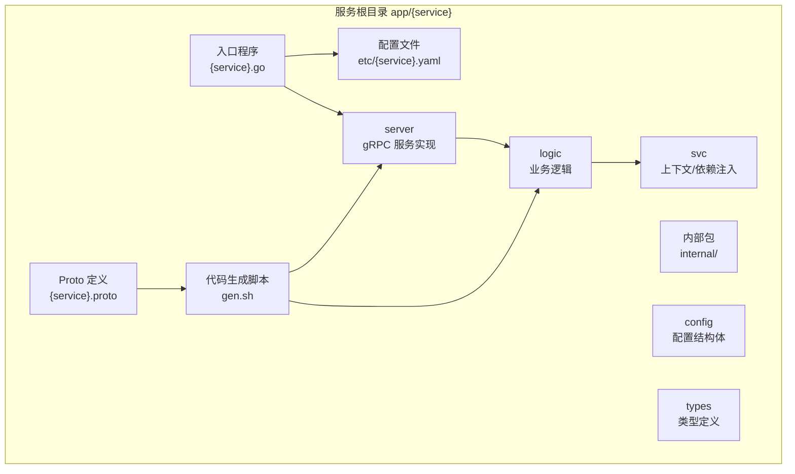
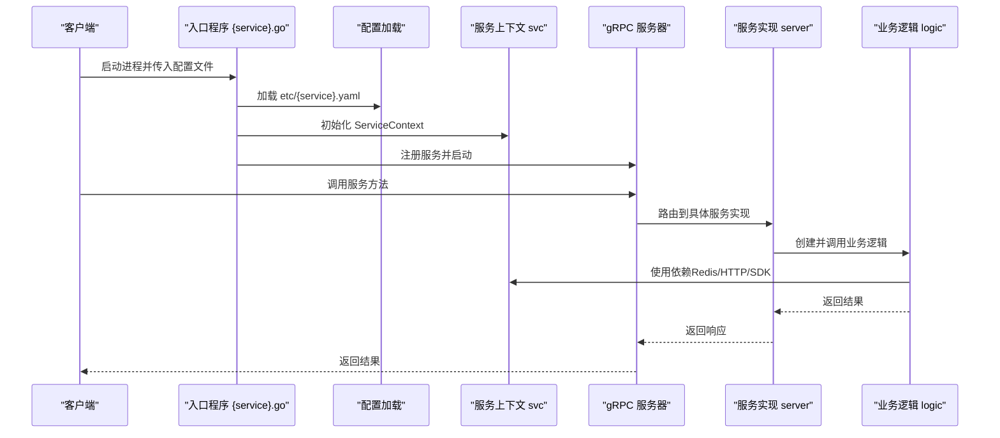
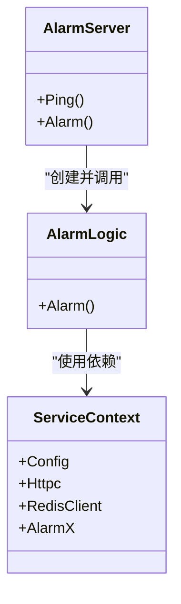
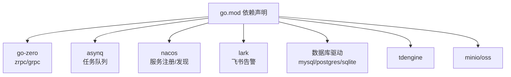

# 服务开发流程

<cite>
**本文引用的文件**
- [README.md](file://README.md)
- [go.mod](file://go.mod)
- [alarm.go](file://app/alarm/alarm.go)
- [alarm.yaml](file://app/alarm/etc/alarm.yaml)
- [alarm.proto](file://app/alarm/alarm.proto)
- [gen.sh](file://app/alarm/gen.sh)
- [config.go](file://app/alarm/internal/config/config.go)
- [alarmserver.go](file://app/alarm/internal/server/alarmserver.go)
- [servicecontext.go](file://app/alarm/internal/svc/servicecontext.go)
- [alarmlogic.go](file://app/alarm/internal/logic/alarmlogic.go)
- [bridgemodbus.go](file://app/bridgemodbus/bridgemodbus.go)
- [bridgemqtt.go](file://app/bridgemqtt/bridgemqtt.go)
- [zerorpc.go](file://zerorpc/zerorpc.go)
- [manage.sh](file://util/manage.sh)
- [gen.sh](file://third_party/gen.sh)
</cite>

## 目录
1. [简介](#简介)
2. [项目结构](#项目结构)
3. [核心组件](#核心组件)
4. [架构总览](#架构总览)
5. [详细组件分析](#详细组件分析)
6. [依赖分析](#依赖分析)
7. [性能考虑](#性能考虑)
8. [故障排查指南](#故障排查指南)
9. [结论](#结论)
10. [附录](#附录)

## 简介
本文件面向在 Zero-Service 项目中新增微服务的开发者，提供从零开始的完整开发流程说明。内容涵盖服务目录结构创建、Proto 文件定义规范、代码生成工具使用、业务逻辑实现步骤、配置文件编写与入口程序启动，并结合仓库中的现有服务示例进行实操指导。文档同时总结最佳实践、常见错误规避与调试技巧，帮助快速、稳定地交付高质量微服务。

## 项目结构
Zero-Service 采用“按服务分目录”的组织方式，核心微服务集中于 app/ 目录，每个服务通常包含以下层次：
- 顶层入口程序：app/{service}/{service}.go
- 配置文件：app/{service}/etc/{service}.yaml
- Proto 定义：app/{service}/{service}.proto
- 代码生成脚本：app/{service}/gen.sh
- 代码结构：internal/config、internal/server、internal/logic、internal/svc、internal/types 等
- 可选：Dockerfile、部署脚本、API 文档等

图表来源
- [alarm.go:1-44](file://app/alarm/alarm.go#L1-L44)
- [alarm.yaml:1-26](file://app/alarm/etc/alarm.yaml#L1-L26)
- [alarm.proto:1-34](file://app/alarm/alarm.proto#L1-L34)
- [gen.sh:1-4](file://app/alarm/gen.sh#L1-L4)
- [alarmserver.go:1-35](file://app/alarm/internal/server/alarmserver.go#L1-L35)
- [config.go:1-16](file://app/alarm/internal/config/config.go#L1-L16)
- [servicecontext.go:1-33](file://app/alarm/internal/svc/servicecontext.go#L1-L33)
- [alarmlogic.go:1-184](file://app/alarm/internal/logic/alarmlogic.go#L1-L184)

章节来源
- [README.md:59-108](file://README.md#L59-L108)
- [alarm.go:1-44](file://app/alarm/alarm.go#L1-L44)
- [alarm.yaml:1-26](file://app/alarm/etc/alarm.yaml#L1-L26)
- [alarm.proto:1-34](file://app/alarm/alarm.proto#L1-L34)
- [gen.sh:1-4](file://app/alarm/gen.sh#L1-L4)

## 核心组件
- 入口程序：负责解析命令行参数、加载配置、初始化服务上下文、注册 gRPC 服务并启动服务。
- 配置模块：定义服务配置结构体，包含运行参数、日志、Redis、第三方服务等。
- gRPC 服务实现：将 proto 中定义的方法映射到 logic 层，作为服务端入口。
- 业务逻辑：具体实现业务规则，调用 svc 中的依赖（如 Redis、HTTP 客户端、第三方 SDK 等）。
- 服务上下文：集中管理依赖注入，如 Redis、HTTP 客户端、第三方 SDK 客户端等。
- 代码生成：通过 goctl protoc 生成 pb.go、grpc.pb.go、zrpc 适配代码，减少样板代码。

章节来源
- [alarm.go:19-43](file://app/alarm/alarm.go#L19-L43)
- [config.go:5-15](file://app/alarm/internal/config/config.go#L5-L15)
- [alarmserver.go:15-34](file://app/alarm/internal/server/alarmserver.go#L15-L34)
- [servicecontext.go:13-32](file://app/alarm/internal/svc/servicecontext.go#L13-L32)
- [alarmlogic.go:17-63](file://app/alarm/internal/logic/alarmlogic.go#L17-L63)

## 架构总览
下图展示了典型的 gRPC 微服务在 Zero-Service 中的启动与调用路径，以及与公共组件的交互。

图表来源
- [alarm.go:21-42](file://app/alarm/alarm.go#L21-L42)
- [servicecontext.go:20-31](file://app/alarm/internal/svc/servicecontext.go#L20-L31)
- [alarmserver.go:26-34](file://app/alarm/internal/server/alarmserver.go#L26-L34)
- [alarmlogic.go:31-63](file://app/alarm/internal/logic/alarmlogic.go#L31-L63)

## 详细组件分析

### 1. 新增服务的完整开发流程
- 步骤一：创建服务目录
  - 在 app/ 下创建 {service} 目录，建议使用小写英文命名，避免特殊字符。
  - 在 {service}/etc/ 下准备配置文件模板。
- 步骤二：定义 Proto 接口
  - 在 {service}/{service}.proto 中声明 package、消息体、服务与方法。
  - 注意 go_package 选项，确保生成的 go 包路径符合预期。
- 步骤三：生成代码框架
  - 在 {service}/gen.sh 中调用 goctl protoc，生成 pb.go、grpc.pb.go、zrpc 适配代码。
  - 执行 ./gen.sh 生成代码后，检查 internal/server、internal/logic 是否已生成或需要补充。
- 步骤四：实现业务逻辑
  - 在 internal/logic 中实现具体方法，调用 svc 中的依赖。
  - 保持逻辑层无状态、可测试，尽量将外部依赖抽象为接口。
- 步骤五：编写配置文件
  - 在 etc/{service}.yaml 中配置服务监听、日志、Redis、第三方服务等。
  - 参考现有服务的配置风格，字段命名与层级保持一致。
- 步骤六：编写入口程序
  - 在 {service}/{service}.go 中解析 -f 参数、加载配置、初始化 svc、注册服务并启动。
  - 如需服务注册/发现，参考 bridgemodbus/bridgemqtt 的注册逻辑。
- 步骤七：本地调试与验证
  - 使用 go run {service}.go -f etc/{service}.yaml 启动服务。
  - 使用 grpcurl 或客户端工具验证接口。
- 步骤八：可选：添加拦截器与链路追踪
  - 可复用 common/Interceptor/rpcserver 中的日志拦截器。
  - 可参考 zerorpc 的任务调度与服务组启动方式。

章节来源
- [README.md:262-281](file://README.md#L262-L281)
- [alarm.proto:1-34](file://app/alarm/alarm.proto#L1-L34)
- [gen.sh:1-4](file://app/alarm/gen.sh#L1-L4)
- [alarm.yaml:1-26](file://app/alarm/etc/alarm.yaml#L1-L26)
- [alarm.go:19-43](file://app/alarm/alarm.go#L19-L43)
- [bridgemodbus.go:46-63](file://app/bridgemodbus/bridgemodbus.go#L46-L63)
- [bridgemqtt.go:46-63](file://app/bridgemqtt/bridgemqtt.go#L46-L63)
- [zerorpc.go:45-57](file://zerorpc/zerorpc.go#L45-L57)

### 2. 目录命名约定与文件组织结构
- 目录命名：小写英文，单词之间不使用连字符或下划线，避免与 go 包名冲突。
- 文件组织：
  - {service}.go：入口程序
  - etc/{service}.yaml：配置文件
  - {service}.proto：接口定义
  - gen.sh：代码生成脚本
  - internal/config：配置结构体
  - internal/server：gRPC 服务实现
  - internal/logic：业务逻辑
  - internal/svc：服务上下文/依赖注入
  - internal/types：类型定义（如有）

章节来源
- [alarm.go:1-44](file://app/alarm/alarm.go#L1-L44)
- [alarm.yaml:1-26](file://app/alarm/etc/alarm.yaml#L1-L26)
- [alarm.proto:1-34](file://app/alarm/alarm.proto#L1-L34)
- [config.go:1-16](file://app/alarm/internal/config/config.go#L1-L16)
- [alarmserver.go:1-35](file://app/alarm/internal/server/alarmserver.go#L1-L35)
- [servicecontext.go:1-33](file://app/alarm/internal/svc/servicecontext.go#L1-L33)
- [alarmlogic.go:1-184](file://app/alarm/internal/logic/alarmlogic.go#L1-L184)

### 3. Proto 文件定义规范
- package 与 go_package：确保 go_package 与目录结构匹配，便于生成正确的 go 包路径。
- 消息体设计：字段使用小驼峰命名；消息体尽量简洁，避免过深嵌套。
- 服务与方法：方法命名采用动词+名词，返回值统一使用 Res 结尾的消息体。
- 示例参考：alarm.proto 展示了最小可用的 Req/Res 与服务定义。

章节来源
- [alarm.proto:1-34](file://app/alarm/alarm.proto#L1-L34)

### 4. 代码生成工具使用
- 生成命令：在服务目录执行 ./gen.sh，内部调用 goctl protoc，生成 pb.go、grpc.pb.go、zrpc 适配代码。
- 输出位置：生成文件位于 {service}/{service}/ 目录下，与 go_package 一致。
- 依赖：确保已安装 goctl 并正确配置 protoc。

章节来源
- [gen.sh:1-4](file://app/alarm/gen.sh#L1-L4)
- [gen.sh:1-37](file://third_party/gen.sh#L1-L37)

### 5. 业务逻辑实现步骤
- 逻辑层职责：实现具体业务规则，避免直接访问底层依赖。
- 依赖注入：通过 svc.ServiceContext 获取 Redis、HTTP 客户端、第三方 SDK 等。
- 错误处理：返回标准错误码，必要时记录日志并返回可读错误信息。
- 示例参考：alarmlogic 实现了告警发送与聊天会话处理，展示了如何组合配置与依赖。

章节来源
- [alarmlogic.go:31-63](file://app/alarm/internal/logic/alarmlogic.go#L31-L63)
- [servicecontext.go:13-32](file://app/alarm/internal/svc/servicecontext.go#L13-L32)

### 6. 配置文件编写
- 字段建议：Name、ListenOn、Mode、Log、Redis、Telemetry（可选）、第三方服务配置块等。
- 参考：alarm.yaml 展示了基础配置项与注释风格，可据此扩展自定义字段。
- 环境区分：通过 Mode 字段区分 dev/test/prod，影响日志编码与反射注册等行为。

章节来源
- [alarm.yaml:1-26](file://app/alarm/etc/alarm.yaml#L1-L26)
- [config.go:5-15](file://app/alarm/internal/config/config.go#L5-L15)

### 7. 入口程序启动
- 命令行参数：使用 -f 指定配置文件路径。
- 服务注册：通过 zrpc.MustNewServer 注册服务实现。
- 开发模式：DevMode/TestMode 下可启用 gRPC 反射，便于调试。
- 可选注册：如需服务注册/发现，可参考 bridgemodbus/bridgemqtt 的注册逻辑。
- 可选拦截器：可添加日志拦截器，统一记录请求与响应。

章节来源
- [alarm.go:19-43](file://app/alarm/alarm.go#L19-L43)
- [bridgemodbus.go:38-63](file://app/bridgemodbus/bridgemodbus.go#L38-L63)
- [bridgemqtt.go:39-63](file://app/bridgemqtt/bridgemqtt.go#L39-L63)
- [zerorpc.go:37-57](file://zerorpc/zerorpc.go#L37-L57)

### 8. 生成后的代码结构分析
- server 层：将 proto 方法映射到 logic，保持薄层职责。
- logic 层：实现业务，调用 svc 依赖。
- svc 层：集中管理 Redis、HTTP 客户端、第三方 SDK 客户端等。
- config 层：定义配置结构体，承载运行期配置。

图表来源
- [alarmserver.go:15-34](file://app/alarm/internal/server/alarmserver.go#L15-L34)
- [alarmlogic.go:17-29](file://app/alarm/internal/logic/alarmlogic.go#L17-L29)
- [servicecontext.go:13-32](file://app/alarm/internal/svc/servicecontext.go#L13-L32)

章节来源
- [alarmserver.go:1-35](file://app/alarm/internal/server/alarmserver.go#L1-L35)
- [alarmlogic.go:1-184](file://app/alarm/internal/logic/alarmlogic.go#L1-L184)
- [servicecontext.go:1-33](file://app/alarm/internal/svc/servicecontext.go#L1-L33)

### 9. 完整开发示例：从零创建 alarm 服务
- 创建目录与文件
  - app/alarm/{alarm.go, alarm.yaml, alarm.proto, gen.sh}
  - app/alarm/internal/{config, server, logic, svc, types}
- 定义接口
  - 在 alarm.proto 中声明 Req/Res 与服务方法。
- 生成代码
  - 执行 ./gen.sh，生成 pb.go、grpc.pb.go、zrpc 适配代码。
- 实现逻辑
  - 在 internal/logic 中实现业务方法，调用 svc 依赖。
- 编写配置
  - 在 etc/alarm.yaml 中配置监听地址、日志、Redis、第三方服务等。
- 编写入口
  - 在 alarm.go 中解析配置、初始化 svc、注册服务并启动。
- 启动验证
  - 使用 go run alarm.go -f etc/alarm.yaml 启动服务，使用 grpcurl 验证接口。

章节来源
- [alarm.go:19-43](file://app/alarm/alarm.go#L19-L43)
- [alarm.yaml:1-26](file://app/alarm/etc/alarm.yaml#L1-L26)
- [alarm.proto:1-34](file://app/alarm/alarm.proto#L1-L34)
- [gen.sh:1-4](file://app/alarm/gen.sh#L1-L4)
- [alarmlogic.go:31-63](file://app/alarm/internal/logic/alarmlogic.go#L31-L63)

### 10. 最佳实践
- 目录与命名：小写英文，清晰分层，避免与 go 包名冲突。
- Proto 设计：消息体简洁、方法语义明确、go_package 与目录一致。
- 代码生成：统一使用 gen.sh，确保生成产物在 {service}/{service}/ 目录。
- 依赖注入：svc 集中管理 Redis、HTTP、第三方 SDK，logic 仅关注业务。
- 配置管理：按环境区分 Mode，合理拆分配置块，避免硬编码。
- 启动流程：入口程序统一解析 -f，加载配置，注册服务，按需启用反射与拦截器。
- 可观测性：按需开启 Telemetry、日志级别与输出格式。

章节来源
- [alarm.go:19-43](file://app/alarm/alarm.go#L19-L43)
- [alarm.yaml:1-26](file://app/alarm/etc/alarm.yaml#L1-L26)
- [alarm.proto:1-34](file://app/alarm/alarm.proto#L1-L34)
- [servicecontext.go:13-32](file://app/alarm/internal/svc/servicecontext.go#L13-L32)
- [alarmlogic.go:31-63](file://app/alarm/internal/logic/alarmlogic.go#L31-L63)

### 11. 常见错误与规避
- 未安装 goctl 或 protoc：确保已安装并配置 PATH，生成命令方可成功。
- go_package 与目录不一致：导致生成代码导入失败，应与目录结构保持一致。
- 配置文件路径错误：入口程序通过 -f 指定，若路径错误会导致无法加载配置。
- 未注册服务：必须在入口程序中通过 zrpc 注册服务实现，否则客户端无法调用。
- 依赖未注入：svc 未初始化 Redis/HTTP/SDK，logic 调用时报空指针或连接失败。
- 未启用反射：开发阶段需要反射便于调试，注意 DevMode/TestMode 的判断。

章节来源
- [gen.sh:1-4](file://app/alarm/gen.sh#L1-L4)
- [alarm.go:32-38](file://app/alarm/alarm.go#L32-L38)
- [servicecontext.go:20-31](file://app/alarm/internal/svc/servicecontext.go#L20-L31)

### 12. 调试技巧
- 启动参数：使用 -f 指定配置文件，便于切换不同环境配置。
- 反射调试：在 DevMode/TestMode 下启用 gRPC 反射，使用 grpcurl 列出服务与方法。
- 日志与拦截器：添加日志拦截器，统一记录请求与响应，便于定位问题。
- 服务注册：如需注册/发现，参考 bridgemodbus/bridgemqtt 的注册逻辑，确认端口与元数据。
- 任务调度：如涉及 asynq 任务，参考 zerorpc 的服务组启动方式，确保任务服务器与调度器正常运行。

章节来源
- [alarm.go:35-37](file://app/alarm/alarm.go#L35-L37)
- [bridgemodbus.go:46-63](file://app/bridgemodbus/bridgemodbus.go#L46-L63)
- [bridgemqtt.go:46-63](file://app/bridgemqtt/bridgemqtt.go#L46-L63)
- [zerorpc.go:45-57](file://zerorpc/zerorpc.go#L45-L57)

## 依赖分析
- 语言与框架：Go 1.25+，go-zero 作为微服务框架，gRPC 作为 RPC 传输层。
- 依赖管理：go.mod 中声明了 go-zero、grpc、asynq、nacos、lark、mysql/postgres/sqlite、tdengine、minio 等依赖。
- 生成工具：goctl 用于生成 gRPC 与 zrpc 代码，third_party/gen.sh 用于生成第三方 proto。

图表来源
- [go.mod:5-62](file://go.mod#L5-L62)

章节来源
- [go.mod:1-245](file://go.mod#L1-L245)

## 性能考虑
- 服务并发：利用 go-zero 的并发模型，合理拆分逻辑层，避免阻塞。
- 依赖连接池：Redis、数据库连接使用连接池，避免频繁创建销毁。
- 序列化与反序列化：尽量减少大对象传输，优化消息体大小。
- 任务队列：使用 asynq 进行异步任务处理，避免同步阻塞。
- 监控与追踪：按需开启 Telemetry，收集关键指标与链路追踪数据。

## 故障排查指南
- 启动失败：检查 -f 指定的配置文件是否存在且格式正确。
- 无法连接 Redis：核对 etc/{service}.yaml 中的 Redis 配置，确认网络可达。
- gRPC 调用失败：确认服务已注册、端口正确、客户端与服务端版本一致。
- 任务调度异常：检查 asynq 服务器与 Redis 连接，确认任务服务器与调度器已启动。
- 服务注册失败：核对 Nacos 配置与元数据，确认端口提取与注册参数正确。

章节来源
- [alarm.yaml:8-11](file://app/alarm/etc/alarm.yaml#L8-L11)
- [bridgemodbus.go:46-63](file://app/bridgemodbus/bridgemodbus.go#L46-L63)
- [bridgemqtt.go:46-63](file://app/bridgemqtt/bridgemqtt.go#L46-L63)
- [zerorpc.go:45-57](file://zerorpc/zerorpc.go#L45-L57)

## 结论
通过遵循上述流程与最佳实践，开发者可以高效地在 Zero-Service 中新增微服务。关键在于规范的目录与文件组织、严谨的 Proto 设计、稳定的代码生成与依赖注入、完善的配置与入口程序，以及必要的调试与可观测性手段。结合现有服务示例，可快速落地并验证新服务的功能与性能。

## 附录
- 一键管理服务：util/manage.sh 提供对多个服务的统一管理命令，便于批量启动/停止/重启。
- 第三方 Proto 生成：third_party/gen.sh 展示了如何生成第三方 proto 并整理输出目录。

章节来源
- [manage.sh:1-35](file://util/manage.sh#L1-L35)
- [gen.sh:1-37](file://third_party/gen.sh#L1-L37)