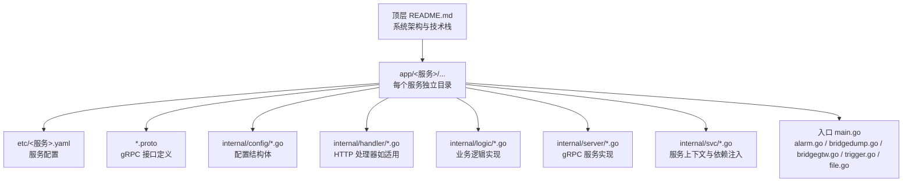
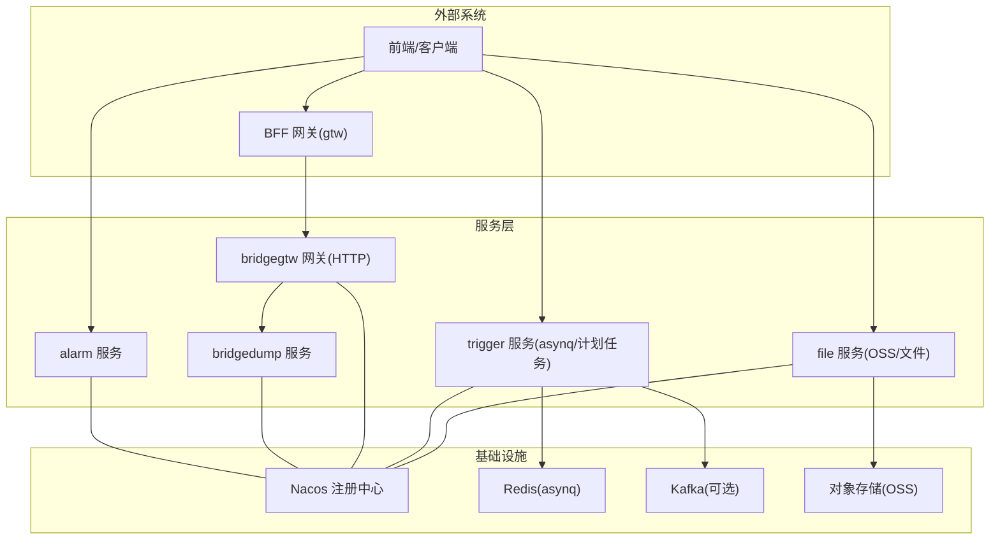
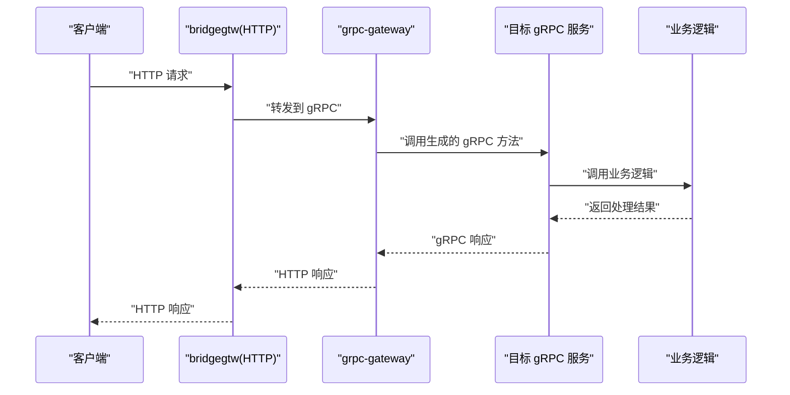
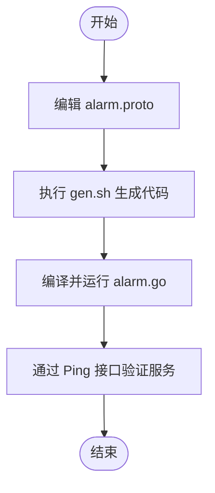
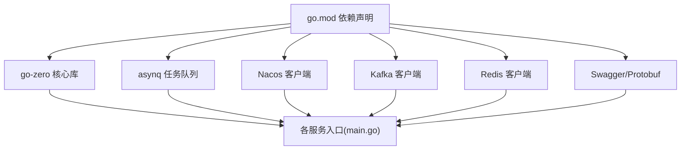

# 服务开发流程

<cite>
**本文引用的文件**
- [README.md](file://README.md)
- [go.mod](file://go.mod)
- [app/alarm/etc/alarm.yaml](file://app/alarm/etc/alarm.yaml)
- [app/bridgedump/etc/bridgedump.yaml](file://app/bridgedump/etc/bridgedump.yaml)
- [app/bridgegtw/etc/bridgegtw.yaml](file://app/bridgegtw/etc/bridgegtw.yaml)
- [app/alarm/alarm.proto](file://app/alarm/alarm.proto)
- [app/bridgedump/bridgedump.proto](file://app/bridgedump/bridgedump.proto)
- [app/trigger/trigger.proto](file://app/trigger/trigger.proto)
- [app/file/file.proto](file://app/file/file.proto)
- [app/bridgegtw/bridgegtw.api](file://app/bridgegtw/bridgegtw.api)
- [app/alarm/alarm.go](file://app/alarm/alarm.go)
- [app/bridgedump/bridgedump.go](file://app/bridgedump/bridgedump.go)
- [app/bridgegtw/bridgegtw.go](file://app/bridgegtw/bridgegtw.go)
- [app/trigger/trigger.go](file://app/trigger/trigger.go)
- [app/file/file.go](file://app/file/file.go)
</cite>

## 目录
1. [简介](#简介)
2. [项目结构](#项目结构)
3. [核心组件](#核心组件)
4. [架构总览](#架构总览)
5. [详细组件分析](#详细组件分析)
6. [依赖分析](#依赖分析)
7. [性能考虑](#性能考虑)
8. [故障排查指南](#故障排查指南)
9. [结论](#结论)
10. [附录](#附录)

## 简介
本文件面向基于 go-zero 的微服务开发，围绕“零服务”仓库给出一套标准化的服务开发流程，涵盖 Protocol Buffers 接口定义、代码生成、业务逻辑实现、配置文件设置与启动验证；解释内部目录结构（internal/config、internal/handler、internal/logic、internal/svc 等）职责；提供服务模板使用方法（复制现有服务作为新服务基础）；介绍服务间通信方式（gRPC 调用、HTTP 转发、消息队列集成）；并总结最佳实践与常见陷阱。

## 项目结构
- 顶层采用多服务并行的 monorepo 结构，核心服务集中在 app/ 目录下，如 alarm、bridgedump、bridgegtw、trigger、file 等。
- 每个服务通常包含：
  - etc/：服务配置文件（YAML）
  - internal/：内部实现，包含 config、handler、logic、server、svc 等子目录
  - *.proto：gRPC 接口定义
  - gen.sh：代码生成脚本
  - 入口文件：如 alarm.go、bridgedump.go、bridgegtw.go、trigger.go、file.go
- 顶层 README.md 提供了系统架构、核心服务与技术栈概览，便于快速理解整体布局。

章节来源
- [README.md:59-108](file://README.md#L59-L108)

## 核心组件
- go-zero 微服务框架：提供 RPC、HTTP、网关、任务队列、服务注册与发现等能力。
- gRPC + grpc-gateway：统一的跨语言 API 定义与 HTTP 访问能力。
- asynq + Redis：分布式任务队列与计划任务调度。
- Nacos：服务注册与发现。
- Kafka：消息中间件（部分服务使用）。
- Swagger：API 文档输出（swagger/ 目录）。

章节来源
- [README.md:207-225](file://README.md#L207-L225)
- [go.mod:5-62](file://go.mod#L5-L62)

## 架构总览
下图展示典型服务在系统中的位置与交互关系（以 alarm、bridgedump、bridgegtw、trigger、file 为例）：

图表来源
- [README.md:15-51](file://README.md#L15-L51)
- [app/bridgegtw/etc/bridgegtw.yaml:25-40](file://app/bridgegtw/etc/bridgegtw.yaml#L25-L40)
- [app/trigger/trigger.go:54-71](file://app/trigger/trigger.go#L54-L71)

## 详细组件分析

### 目录结构与职责
- internal/config：存放服务配置结构体与加载逻辑，通常包含 RPC/HTTP 监听、日志、Redis、Kafka、Nacos 等配置项。
- internal/handler：HTTP 服务的处理器集合，负责 REST API 的路由与请求转发。
- internal/logic：业务逻辑实现，封装具体业务操作，被 handler 或 server 调用。
- internal/server：gRPC 服务实现，绑定 *.pb.go 中生成的服务接口。
- internal/svc：服务上下文，集中管理依赖（数据库、缓存、消息队列、第三方 SDK 等），供 logic/server 使用。
- etc/：服务 YAML 配置文件，包含监听地址、日志级别、Redis/Kafka/Nacos 等连接信息。
- *.proto：服务的接口定义，驱动代码生成（含 grpc-gateway、Swagger）。
- 入口 main.go：解析配置、初始化上下文、注册服务、启动 RPC/HTTP 网关。

章节来源
- [README.md:262-272](file://README.md#L262-L272)
- [app/alarm/etc/alarm.yaml:1-26](file://app/alarm/etc/alarm.yaml#L1-L26)
- [app/bridgedump/etc/bridgedump.yaml:1-10](file://app/bridgedump/etc/bridgedump.yaml#L1-L10)
- [app/bridgegtw/etc/bridgegtw.yaml:1-40](file://app/bridgegtw/etc/bridgegtw.yaml#L1-L40)

### Protocol Buffers 接口定义与代码生成
- 在 app/{service}/{service}.proto 中定义服务接口与消息结构。
- 通过 gen.sh 生成：
  - gRPC 服务桩代码（server 实现）
  - grpc-gateway HTTP 映射
  - Swagger 文档（swagger/ 目录）
- 生成后的代码通常位于 app/{service}/{service}/ 目录中，包含 *_grpc.pb.go、*_pb.go、*_gw.pb.go 等。

章节来源
- [README.md:273-287](file://README.md#L273-L287)
- [app/alarm/alarm.proto:1-34](file://app/alarm/alarm.proto#L1-L34)
- [app/bridgedump/bridgedump.proto:1-124](file://app/bridgedump/bridgedump.proto#L1-L124)
- [app/trigger/trigger.proto:1-106](file://app/trigger/trigger.proto#L1-L106)
- [app/file/file.proto:1-287](file://app/file/file.proto#L1-L287)

### 业务逻辑实现与服务上下文
- 在 internal/logic 中实现业务逻辑，调用 internal/svc 中的依赖（如数据库、缓存、消息队列）。
- internal/svc.NewServiceContext(c) 将配置注入到服务上下文中，供 server 与 logic 使用。
- internal/server 绑定生成的 gRPC 服务接口，将请求转发至 logic 层处理。

章节来源
- [app/alarm/alarm.go:30-38](file://app/alarm/alarm.go#L30-L38)
- [app/bridgedump/bridgedump.go:32-40](file://app/bridgedump/bridgedump.go#L32-L40)
- [app/file/file.go:37-45](file://app/file/file.go#L37-L45)

### 配置文件设置与启动验证
- 各服务的配置文件位于 app/{service}/etc/{service}.yaml。
- 启动命令示例：
  - go run {service}.go -f etc/{service}.yaml
- 启动后可通过 gRPC/HTTP 接口进行验证（如 Ping 接口）。

章节来源
- [README.md:242-252](file://README.md#L242-L252)
- [app/alarm/etc/alarm.yaml:1-26](file://app/alarm/etc/alarm.yaml#L1-L26)
- [app/bridgedump/etc/bridgedump.yaml:1-10](file://app/bridgedump/etc/bridgedump.yaml#L1-L10)
- [app/bridgegtw/etc/bridgegtw.yaml:1-40](file://app/bridgegtw/etc/bridgegtw.yaml#L1-L40)

### 服务模板使用方法（复制现有服务）
- 在 app/ 下创建新服务目录，复制现有服务（如 alarm、file、trigger）的目录结构与文件作为模板。
- 修改：
  - *.proto：更新服务名、消息结构与 RPC 方法
  - gen.sh：确保生成目标与模块路径正确
  - etc/{service}.yaml：调整监听地址、日志、Redis/Kafka/Nacos 等配置
  - 入口 main.go：注册新服务与拦截器
- 重新生成代码并实现 internal/logic 与 internal/server。

章节来源
- [README.md:264-272](file://README.md#L264-L272)

### 服务间通信方式
- gRPC 调用：服务间直接通过生成的 gRPC 客户端调用，支持拦截器、日志与链路追踪。
- HTTP 转发：bridgegtw 通过 grpc-gateway 将 HTTP 请求转发到 gRPC 服务，支持路由映射与上游配置。
- 消息队列集成：trigger 服务使用 asynq + Redis 进行任务队列与计划任务调度；部分服务使用 Kafka 进行消息推送。

图表来源
- [app/bridgegtw/etc/bridgegtw.yaml:25-40](file://app/bridgegtw/etc/bridgegtw.yaml#L25-L40)
- [app/bridgegtw/bridgegtw.api:17-21](file://app/bridgegtw/bridgegtw.api#L17-L21)

章节来源
- [README.md:189-196](file://README.md#L189-L196)
- [app/trigger/trigger.go:72-84](file://app/trigger/trigger.go#L72-L84)

### 代码生成流程（以 alarm 为例）

图表来源
- [README.md:273-281](file://README.md#L273-L281)
- [app/alarm/alarm.proto:1-34](file://app/alarm/alarm.proto#L1-L34)
- [app/alarm/alarm.go:21-43](file://app/alarm/alarm.go#L21-L43)

## 依赖分析
- go.mod 声明了 go-zero 生态（zrpc、rest、gateway、queue、x）、grpc-gateway、asynq、Nacos、Kafka、Redis、TDengine、OSS 等依赖。
- 各服务通过入口文件引入拦截器、Nacos 注册、任务调度器等，形成统一的启动与依赖注入模式。

图表来源
- [go.mod:5-62](file://go.mod#L5-L62)
- [app/trigger/trigger.go:54-84](file://app/trigger/trigger.go#L54-L84)
- [app/file/file.go:46-64](file://app/file/file.go#L46-L64)

章节来源
- [go.mod:5-62](file://go.mod#L5-L62)
- [app/trigger/trigger.go:54-84](file://app/trigger/trigger.go#L54-L84)
- [app/file/file.go:46-64](file://app/file/file.go#L46-L64)

## 性能考虑
- 合理设置日志级别与输出模式，避免生产环境过多 I/O。
- 使用连接池与超时控制，避免阻塞与资源泄露。
- 对高频 RPC 接口进行压测与限流，结合 grpc-gateway 的并发控制。
- 任务队列（asynq）合理划分队列与重试策略，避免堆积。
- 使用 Nacos 与健康检查，保障服务可用性与弹性伸缩。

## 故障排查指南
- 启动失败：检查 etc/{service}.yaml 的监听地址、端口是否被占用；确认 Redis/Kafka/Nacos 可达。
- gRPC 调用异常：确认服务注册与发现是否正常；查看拦截器日志；验证 proto 生成是否一致。
- HTTP 转发问题：核对 bridgegtw 的 Upstreams 与 Mappings 配置；确认 grpc-gateway 映射路径与方法。
- 任务队列堆积：检查 asynq 的队列信息与任务状态；优化重试策略与超时时间。
- Swagger 文档缺失：确认 gen.sh 是否执行成功；检查 swagger 输出目录。

章节来源
- [app/bridgegtw/etc/bridgegtw.yaml:12-40](file://app/bridgegtw/etc/bridgegtw.yaml#L12-L40)
- [app/trigger/trigger.go:72-84](file://app/trigger/trigger.go#L72-L84)

## 结论
通过遵循上述流程与最佳实践，可以在 zero-service 项目中高效地新增与维护基于 go-zero 的微服务。重点在于清晰的目录结构、规范的接口定义、完善的配置管理与统一的启动与依赖注入模式，并结合拦截器、注册中心与任务队列实现高可用与高性能。

## 附录

### 常用命令与路径
- 生成代码：进入服务目录执行 gen.sh
- 启动服务：go run {service}.go -f etc/{service}.yaml
- 配置文件：app/{service}/etc/{service}.yaml
- 接口定义：app/{service}/{service}.proto
- HTTP API：app/{service}/{service}.api（如 bridgegtw.api）

章节来源
- [README.md:242-252](file://README.md#L242-L252)
- [README.md:273-287](file://README.md#L273-L287)
- [app/bridgegtw/bridgegtw.api:1-23](file://app/bridgegtw/bridgegtw.api#L1-L23)