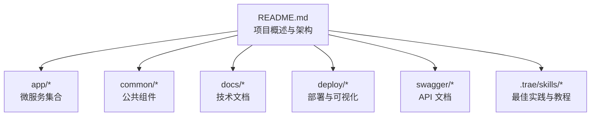
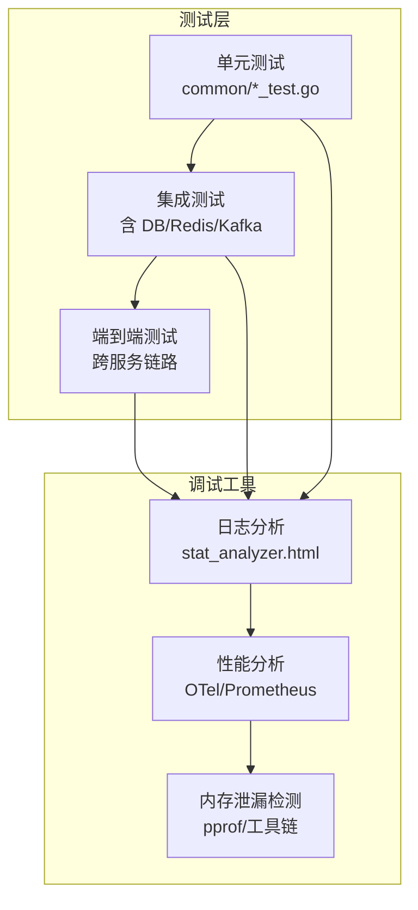
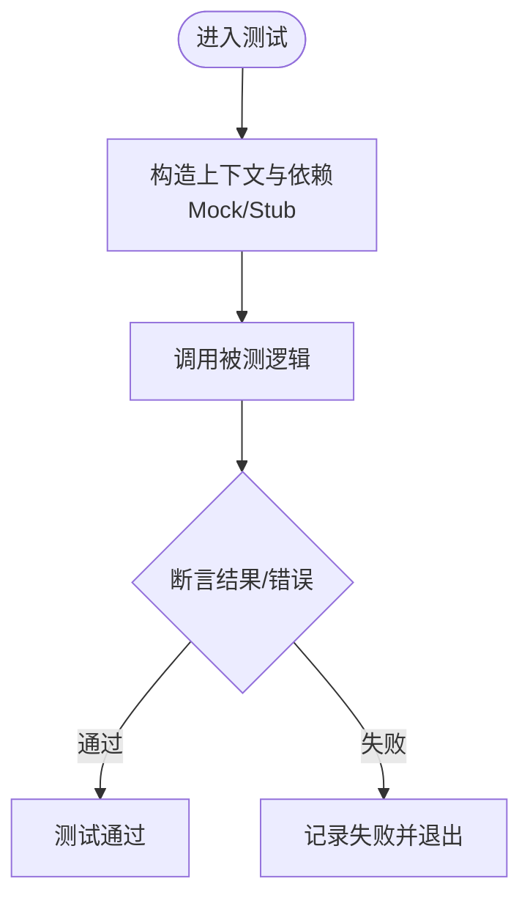
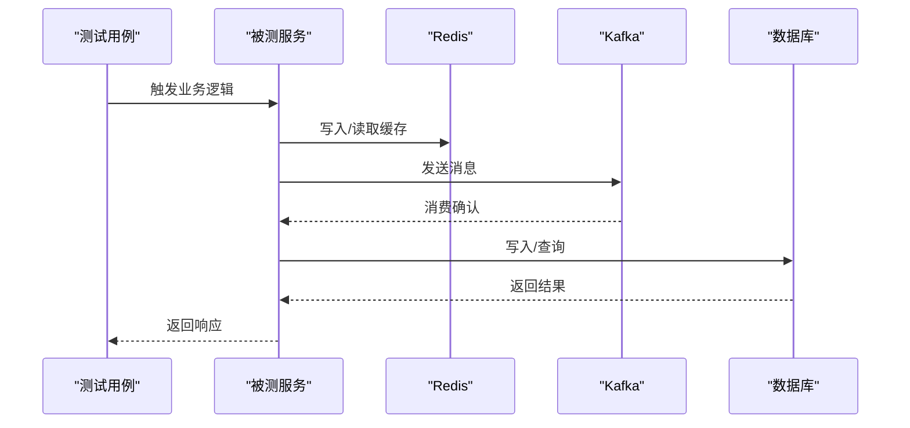
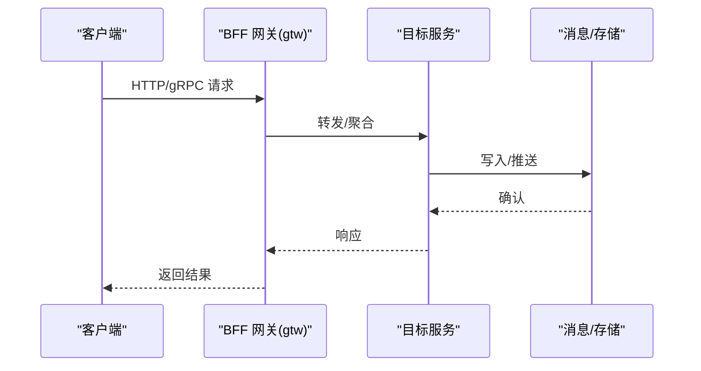
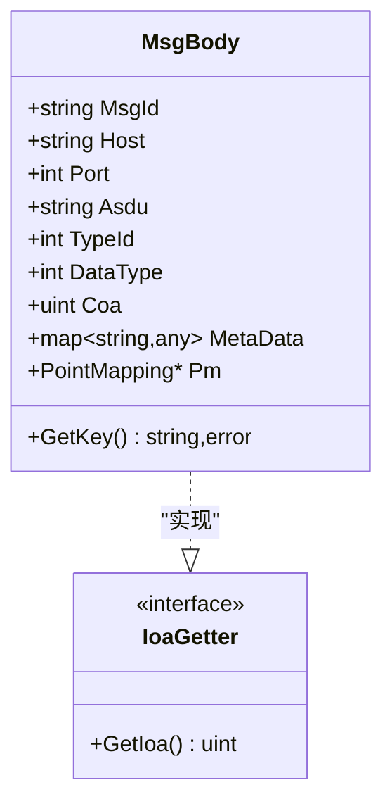
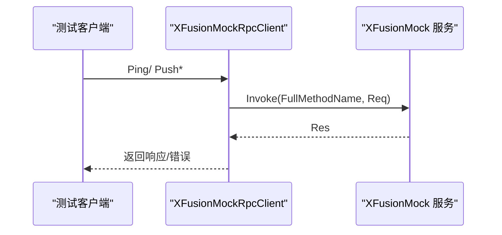
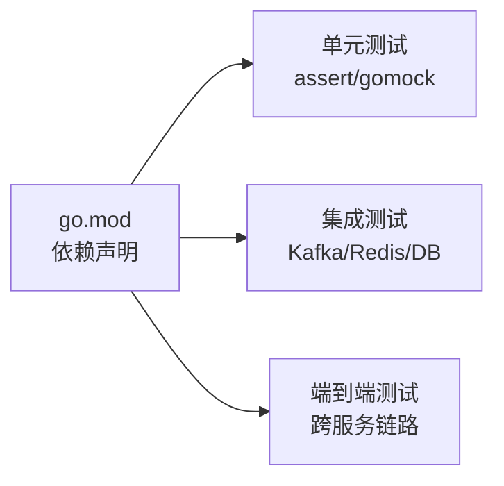
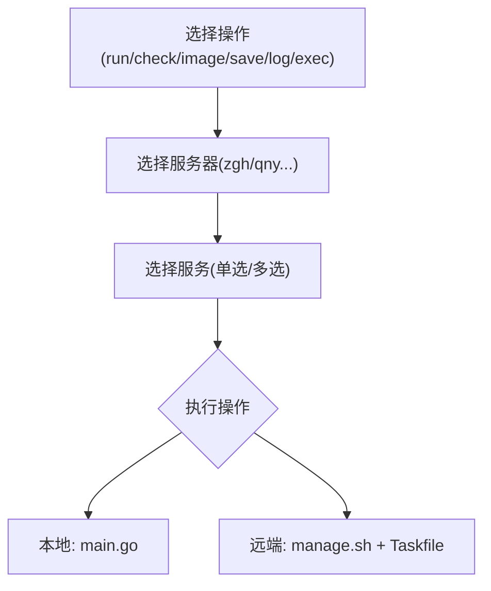

# 测试与调试策略

<cite>
**本文引用的文件**
- [README.md](file://README.md)
- [go.mod](file://go.mod)
- [common/antsx/antsx_test.go](file://common/antsx/antsx_test.go)
- [.trae/skills/zero-skills/best-practices/overview.md](file://.trae/skills/zero-skills/best-practices/overview.md)
- [util/manage.sh](file://util/manage.sh)
- [util/main.go](file://util/main.go)
- [util/config.yaml](file://util/config.yaml)
- [deploy/stat_analyzer.html](file://deploy/stat_analyzer.html)
- [common/iec104/types/types.go](file://common/iec104/types/types.go)
- [app/xfusionmock/xfusionmock/xfusionmock_grpc.pb.go](file://app/xfusionmock/xfusionmock/xfusionmock_grpc.pb.go)
</cite>

## 目录
1. [引言](#引言)
2. [项目结构](#项目结构)
3. [核心组件](#核心组件)
4. [架构总览](#架构总览)
5. [详细组件分析](#详细组件分析)
6. [依赖分析](#依赖分析)
7. [性能考虑](#性能考虑)
8. [故障排查指南](#故障排查指南)
9. [结论](#结论)
10. [附录](#附录)

## 引言
本策略文档面向 zero-service 项目，系统化阐述测试与调试方法论，覆盖单元测试、集成测试与端到端测试的组织方式；给出测试文件命名规范、测试数据准备与断言编写要点；提供日志分析、性能分析与内存泄漏检测的实践；并介绍服务管理工具的使用方法与常见问题排查流程（网络、数据库、消息队列）。

## 项目结构
- 项目采用多服务微架构，核心服务分布在 app/ 目录下，公共组件集中在 common/，文档与示例在 docs/ 与 .trae/skills/zero-skills/ 中，部署与可视化在 deploy/ 与 swagger/。
- README.md 提供了整体架构、快速开始、开发指南与部署说明，是理解测试与调试上下文的关键入口。

**章节来源**
- [README.md:15-51](file://README.md#L15-L51)
- [README.md:59-108](file://README.md#L59-L108)

## 核心组件
- 测试基础设施与示例
  - 单元测试示例：common/antsx/antsx_test.go 展示了 Promise 风格的异步任务链式处理与错误捕获，体现了测试中对并发与错误路径的覆盖。
  - 最佳实践：.trae/skills/zero-skills/best-practices/overview.md 提供了单元测试、集成测试与依赖 Mock 的模板与范式。
- 测试运行与管理
  - 通过 go test 命令在各服务目录运行测试；结合 go.mod 的依赖声明与 go 1.25+ 要求，确保测试环境一致。
- 调试工具与可视化
  - deploy/stat_analyzer.html 提供日志解析与统计面板，便于定位性能与异常。
  - README.md 中的快速开始与配置说明为调试提供基础。

**章节来源**
- [common/antsx/antsx_test.go:1-108](file://common/antsx/antsx_test.go#L1-L108)
- [.trae/skills/zero-skills/best-practices/overview.md:283-424](file://.trae/skills/zero-skills/best-practices/overview.md#L283-L424)
- [go.mod:1-245](file://go.mod#L1-L245)
- [README.md:226-261](file://README.md#L226-L261)

## 架构总览
- 测试与调试贯穿三层：单元测试（单模块/单逻辑）、集成测试（含数据库/缓存/消息中间件）、端到端测试（跨服务链路）。
- 调试工具链：日志分析（结构化日志与 stat_analyzer.html）、性能分析（OpenTelemetry/Prometheus）、内存泄漏检测（pprof/Go 工具链）。

## 详细组件分析

### 单元测试组织与实践
- 命名规范
  - 使用 *_test.go 结尾，放置于被测包同目录，便于 go test 发现。
- 断言与错误处理
  - 使用 testify/assert 进行断言；对错误路径使用 errors.Is 或自定义错误类型匹配。
  - 示例参考：common/antsx/antsx_test.go 中对成功与失败路径的断言与 Catch 回调验证。
- 依赖注入与 Mock
  - 使用 gomock 为外部依赖建模，通过 ServiceContext 注入 Mock 实例，隔离外部系统。
  - 参考最佳实践中的 Mock 依赖章节。

**章节来源**
- [common/antsx/antsx_test.go:12-79](file://common/antsx/antsx_test.go#L12-L79)
- [.trae/skills/zero-skills/best-practices/overview.md:283-354](file://.trae/skills/zero-skills/best-practices/overview.md#L283-L354)
- [.trae/skills/zero-skills/best-practices/overview.md:392-424](file://.trae/skills/zero-skills/best-practices/overview.md#L392-L424)

### 集成测试组织与实践
- 测试数据准备
  - 使用最小化测试数据库（如 SQLite 或测试实例），在测试前初始化必要表结构与种子数据，测试后清理。
- 依赖服务
  - Redis（任务队列/缓存）、Kafka（消息队列）、MySQL/PostgreSQL/TDengine（时序/关系数据库）。
- 断言策略
  - 验证数据库写入、缓存命中、消息投递与消费、RPC 调用链路完整性。

**章节来源**
- [.trae/skills/zero-skills/best-practices/overview.md:357-390](file://.trae/skills/zero-skills/best-practices/overview.md#L357-L390)

### 端到端测试组织与实践
- 覆盖场景
  - IEC 104 数采链路：ieccaller -> Kafka -> iecstash -> streamevent -> TDengine。
  - SocketIO 实时链路：socketgtw -> socketpush -> MQ/DB。
  - 文件服务：分片上传 -> OSS。
- 测试策略
  - 使用 gRPC/HTTP 客户端直接调用服务，校验跨服务一致性与可观测性。
  - 结合 Swagger 文档与 proto 定义，确保接口契约一致。

**章节来源**
- [README.md:112-131](file://README.md#L112-L131)
- [README.md:156-172](file://README.md#L156-L172)
- [README.md:189-205](file://README.md#L189-L205)

### 测试数据与模型
- IEC 104 类型与消息体定义位于 common/iec104/types/types.go，包含多种 ASDU 信息体结构，可用于构造测试数据与断言。
- 建议在测试中构造符合 IEC 104 标准的消息体，覆盖 GetKey、GetIoa 等关键方法的行为。

**图表来源**
- [common/iec104/types/types.go:11-58](file://common/iec104/types/types.go#L11-L58)

**章节来源**
- [common/iec104/types/types.go:1-323](file://common/iec104/types/types.go#L1-L323)

### gRPC 接口与客户端测试
- 通过 app/xfusionmock/xfusionmock/xfusionmock_grpc.pb.go 可知服务接口定义，测试中可直接使用生成的客户端发起调用，验证 Ping/Push 系列接口行为。
- 建议针对每个接口编写正反用例，覆盖超时、鉴权、参数校验与错误码映射。

**图表来源**
- [app/xfusionmock/xfusionmock/xfusionmock_grpc.pb.go:30-58](file://app/xfusionmock/xfusionmock/xfusionmock_grpc.pb.go#L30-L58)

**章节来源**
- [app/xfusionmock/xfusionmock/xfusionmock_grpc.pb.go:30-58](file://app/xfusionmock/xfusionmock/xfusionmock_grpc.pb.go#L30-L58)

## 依赖分析
- 测试相关依赖
  - testify/assert 用于断言；gomock 用于依赖 Mock；go.uber.org/mock 作为替代选择。
  - go.mod 中声明了大量运行期依赖，测试环境需保持版本一致。
- 服务间依赖
  - Kafka/Redis/数据库为多数服务的共同依赖，测试时应隔离这些外部系统或使用容器化测试环境。

**图表来源**
- [go.mod:5-62](file://go.mod#L5-L62)

**章节来源**
- [go.mod:1-245](file://go.mod#L1-L245)

## 性能考虑
- 日志与指标
  - 使用 OpenTelemetry/Prometheus 收集服务指标；通过 deploy/stat_analyzer.html 解析日志并统计内存、QPS、丢弃等指标。
- 性能分析
  - 利用 pprof 与 Go 工具链进行 CPU/内存剖析；结合服务配置与限流/降载策略评估系统瓶颈。
- 并发与资源
  - 单元测试中注意并发安全与上下文超时；集成测试中控制并发度避免资源争用。

**章节来源**
- [README.md:226-226](file://README.md#L226-L226)
- [deploy/stat_analyzer.html:862-1072](file://deploy/stat_analyzer.html#L862-L1072)

## 故障排查指南

### 服务管理工具使用
- 命令行工具
  - util/main.go 提供交互式服务运行、检查、镜像、保存、日志、执行等操作，适合本地联调与运维。
  - util/manage.sh 提供批量服务启停脚本，支持 restart/up/stop/start 与服务名过滤。
  - util/config.yaml 定义远端服务器与服务清单，便于远程管理。

**章节来源**
- [util/main.go:67-194](file://util/main.go#L67-L194)
- [util/manage.sh:1-35](file://util/manage.sh#L1-L35)
- [util/config.yaml:1-26](file://util/config.yaml#L1-L26)

### 网络连接问题
- 排查步骤
  - 检查服务监听地址与端口配置；验证 gRPC/HTTP 网关连通性；使用 grpcurl 或 Swagger 测试接口。
  - 关注防火墙与容器网络；确认 DNS/Nacos 注册是否正常。
- 建议
  - 在测试中使用短超时与重试策略，区分瞬时网络抖动与持续性故障。

### 数据库连接问题
- 排查步骤
  - 校验连接串、用户名密码、数据库实例可达性；对比测试数据库与生产配置差异。
  - 集成测试中优先使用内存数据库或容器化测试实例，减少环境干扰。
- 建议
  - 使用连接池参数（最大空闲/活跃连接、连接超时）与健康检查接口。

### 消息队列问题
- 排查步骤
  - Kafka：确认主题存在、分区与副本状态、消费者组偏移；检查生产/消费速率与延迟。
  - Redis：确认连接、键空间大小、慢查询日志；验证任务队列与缓存键命名规范。
- 建议
  - 在测试中使用本地或容器化 Kafka/Redis，确保可重复性与隔离性。

## 结论
本策略文档提供了 zero-service 的测试与调试方法论：以单元测试为基础、集成测试为支撑、端到端测试为闭环，并结合日志分析、性能分析与内存泄漏检测工具，形成完整的质量保障体系。配合服务管理工具与标准化排查流程，可显著提升问题定位效率与系统稳定性。

## 附录

### 测试文件命名与放置规范
- 单元测试：*_test.go，与被测包同目录。
- 集成测试：建议在服务 internal/test 或单独 test 目录，按模块划分。
- 端到端测试：建议在根目录 e2e 或独立仓库，复用 Swagger/proto 定义。

### 常用断言与错误处理
- 断言：assert.NoError/assert.Equal/assert.Contains 等。
- 错误：errors.Is 匹配预定义错误；fmt.Errorf 包裹上下文；自定义错误类型统一返回。

### 性能与内存分析清单
- 指标：CPU、内存、QPS、丢弃、响应时间分位数。
- 工具：pprof、OTel Exporter、Prometheus/Grafana。
- 建议：在测试与压测中固定并发与数据规模，记录基线并对比回归。