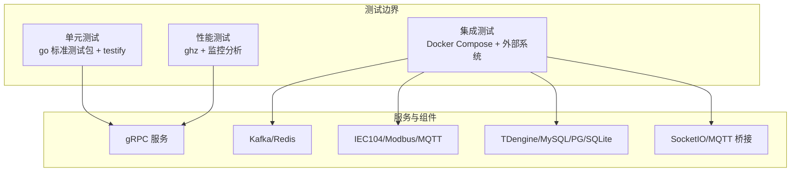
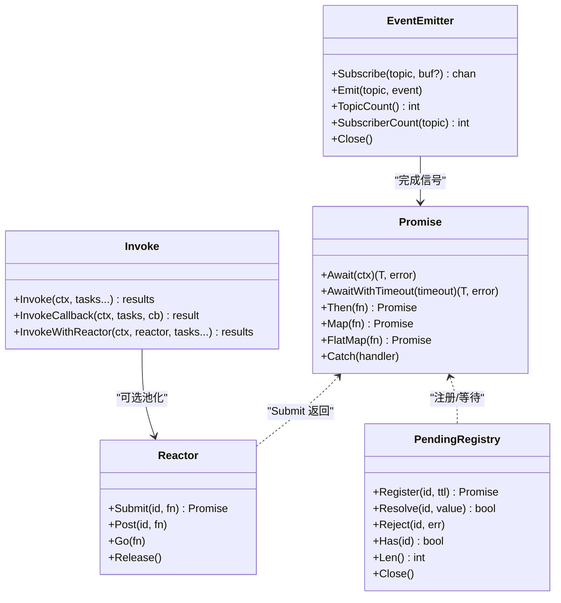
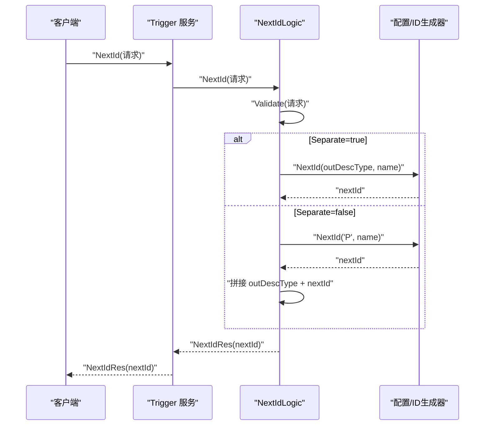
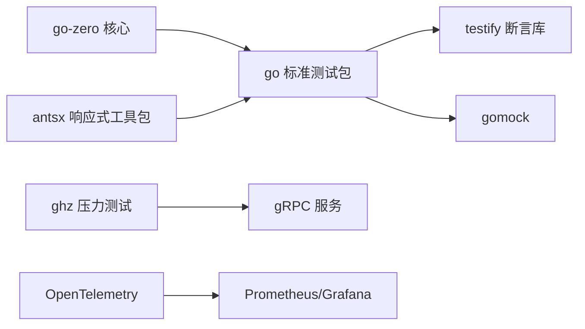

# 测试策略

<cite>
**本文引用的文件**
- [go.mod](file://go.mod)
- [README.md](file://README.md)
- [common/antsx/README.md](file://common/antsx/README.md)
- [common/antsx/antsx_test.go](file://common/antsx/antsx_test.go)
- [common/antsx/invoke_test.go](file://common/antsx/invoke_test.go)
- [common/antsx/pending_test.go](file://common/antsx/pending_test.go)
- [.trae/skills/zero-skills/best-practices/overview.md](file://.trae/skills/zero-skills/best-practices/overview.md)
- [app/bridgemodbus/zgh_start.sh](file://app/bridgemodbus/zgh_start.sh)
- [util/Taskfile.yml](file://util/Taskfile.yml)
- [util/Taskfile-docker.yml](file://util/Taskfile-docker.yml)
- [util/Taskfile-135.yml](file://util/Taskfile-135.yml)
- [deploy/stat_analyzer.html](file://deploy/stat_analyzer.html)
- [app/trigger/internal/logic/nextidlogic.go](file://app/trigger/internal/logic/nextidlogic.go)
- [app/trigger/trigger/trigger.pb.go](file://app/trigger/trigger/trigger.pb.go)
- [app/xfusionmock/xfusionmock/xfusionmock.pb.go](file://app/xfusionmock/xfusionmock/xfusionmock.pb.go)
- [app/xfusionmock/xfusionmock/xfusionmock_grpc.pb.go](file://app/xfusionmock/xfusionmock/xfusionmock_grpc.pb.go)
</cite>

## 目录
1. [引言](#引言)
2. [项目结构](#项目结构)
3. [核心组件](#核心组件)
4. [架构总览](#架构总览)
5. [详细组件分析](#详细组件分析)
6. [依赖分析](#依赖分析)
7. [性能考虑](#性能考虑)
8. [故障排查指南](#故障排查指南)
9. [结论](#结论)
10. [附录](#附录)

## 引言
本测试策略文档面向 Zero-Service 项目，围绕单元测试、集成测试与性能测试制定系统化的实施方法。项目采用 go-zero 微服务框架，结合 gRPC、Kafka、asynq、SocketIO、MQTT、Modbus、IEC 104 等技术栈，测试策略将覆盖：
- 单元测试：以 go 标准测试包为主，配合 testify 断言库；对公共组件（如 antsx）进行并发与错误恢复验证。
- 集成测试：数据库与外部系统（Kafka、Redis、MQTT、TDengine 等）交互验证；通过 Docker Compose 启动测试环境。
- 性能测试：使用 ghz 进行 gRPC 压力测试，结合系统监控与可视化分析工具评估吞吐与延迟。

## 项目结构
项目采用按功能域划分的服务化组织方式，核心服务包括 trigger（异步任务调度）、file（文件服务）、gis（地理信息）、alarm（告警）、podengine（容器管理）、bridgemodbus/bridgemqtt/bridgegtw/bridgedump（协议桥接）、lalhook/lalproxy/logdump（流媒体与日志）、socketapp（SocketIO 实时通信）、gtw（BFF 网关）、facade/streamevent（对外接口层）等。公共组件（common）提供协议、消息队列、任务队列、数据库、地理信息、MQTT、SocketIO、工具等能力。

```mermaid
graph TB
subgraph "应用层"
TR["trigger 服务"]
FI["file 服务"]
GI["gis 服务"]
AL["alarm 服务"]
PE["podengine 服务"]
BM["bridgemodbus 服务"]
BT["bridgemqtt 服务"]
BG["bridgegtw 服务"]
BD["bridgedump 服务"]
LH["lalhook 服务"]
LP["lalproxy 服务"]
LD["logdump 服务"]
SG["socketgtw 服务"]
SP["socketpush 服务"]
GW["gtw 网关"]
SE["streamevent 对外接口"]
end
subgraph "公共组件(common)"
AX["antsx 响应式工具包"]
MQ["asynqx 任务队列"]
DB["dbx 数据库扩展"]
MO["modbusx Modbus 扩展"]
MT["mqttx MQTT 扩展"]
SO["ossx 对象存储"]
GI2["gisx 地理信息"]
SX["socketiox SocketIO 封装"]
NX["nacosx 服务注册/发现"]
TX["tool 工具函数"]
end
TR --> MQ
BM --> MO
BT --> MT
FI --> SO
GI --> GI2
SG --> SX
GW --> MT
GW --> MO
SE --> GI2
AX --> SX
```

图表来源
- [README.md:59-108](file://README.md#L59-L108)

章节来源
- [README.md:59-108](file://README.md#L59-L108)

## 核心组件
- antsx 响应式工具包：提供 Promise、Reactor、PendingRegistry、EventEmitter、Invoke 等能力，用于并发编排、请求-响应匹配、事件发布订阅与超时控制。其测试覆盖了链式调用、并发组合、超时、panic recovery、请求-响应匹配等关键场景。
- asynqx 任务队列：基于 asynq 的分布式任务队列，支持 Redis 存储、定时/延时任务、回调、重试与生命周期管理。
- dbx：多数据库支持（MySQL/PostgreSQL/SQLite），提供 SQL 构建与执行能力。
- modbusx/mqttx：Modbus/TCP RTU 与 MQTT 协议扩展。
- ossx：对象存储（MinIO/阿里 OSS/腾讯 COS）封装。
- socketiox：SocketIO 服务器封装，支持房间管理、广播、MQTT 桥接与鉴权。
- tool：通用工具函数集合。

章节来源
- [common/antsx/README.md:1-360](file://common/antsx/README.md#L1-L360)
- [go.mod:1-62](file://go.mod#L1-L62)

## 架构总览
测试策略与系统架构的耦合点主要体现在：
- gRPC API：服务通过 .proto 定义接口，测试应覆盖请求/响应结构、错误码映射与边界条件。
- 消息队列：Kafka/Redis 作为任务与事件通道，测试需验证消息序列化、分区、偏移与消费幂等。
- 协议栈：IEC 104、Modbus、MQTT 等协议的解析与转发，测试需覆盖协议字段、报文长度、校验与异常分支。
- 实时通信：SocketIO 的连接、房间、广播、MQTT 桥接，测试需验证并发连接、消息投递与断线重连。
- 数据落库：TDengine/MySQL/PostgreSQL/SQLite，测试需覆盖写入路径、索引与查询性能。

图表来源
- [README.md:15-51](file://README.md#L15-L51)
- [go.mod:1-62](file://go.mod#L1-L62)

## 详细组件分析

### antsx 响应式工具包测试
- Promise 链式调用与错误捕获：验证 Then/Map/FlatMap 的链式组合、错误传播与 Catch 回调。
- 并发组合：PromiseAll（任一失败快速失败）、PromiseRace（竞争最快结果）、AwaitWithTimeout（超时控制）。
- Reactor 池化执行：Submit/Post/Goroutine 提交，带 ID 去重与 panic recovery。
- PendingRegistry 请求-响应匹配：注册、Resolve/Reject、TTL 过期、并发 Resolve、RequestReply 便捷封装。
- EventEmitter 发布订阅：Topic 订阅、消息投递、慢消费者丢弃、统计查询。
- Invoke 并行流程编排：单任务超时与整体超时、InvokeCallback 聚合变换、InvokeWithReactor 池化执行。

图表来源
- [common/antsx/README.md:22-360](file://common/antsx/README.md#L22-L360)
- [common/antsx/antsx_test.go:1-459](file://common/antsx/antsx_test.go#L1-L459)
- [common/antsx/invoke_test.go:1-306](file://common/antsx/invoke_test.go#L1-L306)
- [common/antsx/pending_test.go:1-343](file://common/antsx/pending_test.go#L1-L343)

章节来源
- [common/antsx/README.md:1-360](file://common/antsx/README.md#L1-L360)
- [common/antsx/antsx_test.go:1-459](file://common/antsx/antsx_test.go#L1-L459)
- [common/antsx/invoke_test.go:1-306](file://common/antsx/invoke_test.go#L1-L306)
- [common/antsx/pending_test.go:1-343](file://common/antsx/pending_test.go#L1-L343)

### 触发器（Trigger）服务测试要点
- NextId 逻辑：根据 Separate 参数生成不同维度的 ID，并进行参数校验与错误处理。
- gRPC 接口：基于 .proto 的请求/响应结构，结合 Validate 校验与错误码映射。
- 任务生命周期：异步任务的创建、调度、回调、重试、归档与删除。

图表来源
- [app/trigger/internal/logic/nextidlogic.go:27-48](file://app/trigger/internal/logic/nextidlogic.go#L27-L48)
- [app/trigger/trigger/trigger.pb.go:6951-7004](file://app/trigger/trigger/trigger.pb.go#L6951-L7004)

章节来源
- [app/trigger/internal/logic/nextidlogic.go:1-48](file://app/trigger/internal/logic/nextidlogic.go#L1-L48)
- [app/trigger/trigger/trigger.pb.go:6951-7004](file://app/trigger/trigger/trigger.pb.go#L6951-L7004)

### 协议桥接服务测试要点
- bridgemodbus：针对 Modbus 读写操作（如 ReadCoils、ReadHoldingRegisters）进行压力测试，使用 ghz 生成 HTML 报告。
- bridgemqtt：验证消息发布/订阅、带追踪的推送与 gRPC 集成。
- bridgegtw：验证 HTTP 代理转发、多后端负载均衡与路由规则。
- bridgedump：验证文件生成、Filebeat 集成与 Kafka 分类发送。

章节来源
- [app/bridgemodbus/zgh_start.sh:1-23](file://app/bridgemodbus/zgh_start.sh#L1-L23)

### 实时通信（SocketIO）测试要点
- 连接管理：并发连接、心跳、断线重连。
- 房间管理：加入/离开/广播、全局广播。
- MQTT 桥接：Topic 映射到 SocketIO Room，事件映射配置。
- 推送接口：Token 生成/验证、单播/批量推送、后端服务调用入口。

章节来源
- [README.md:156-173](file://README.md#L156-L173)

### 文件服务（file）测试要点
- 分片流上传：断点续传、并发上传、进度上报。
- 对象存储：MinIO/阿里 OSS/腾讯 COS 的兼容性与错误处理。
- 视频流捕获：输入源切换、编码参数、输出格式。

章节来源
- [README.md:174-188](file://README.md#L174-L188)

### 地理信息（gis）测试要点
- H3/GeoHash 编解码：精度与边界值测试。
- 电子围栏：围栏生成、点位检测、半径查询。
- 坐标系转换：WGS84/GCJ02/BD09 的互转与误差范围。

章节来源
- [README.md:174-188](file://README.md#L174-L188)

### 告警（alarm）测试要点
- 多级告警：P0-P3 的触发条件与抑制逻辑。
- 通知集成：钉钉/飞书的消息模板与发送成功率。

章节来源
- [README.md:174-188](file://README.md#L174-L188)

### 容器管理（podengine）测试要点
- Docker 容器生命周期：创建、启动、停止、重启、删除。
- 资源统计：CPU/内存/网络/存储的采集与阈值告警。
- 镜像管理：拉取、删除、标签管理。

章节来源
- [README.md:174-188](file://README.md#L174-L188)

### BFF 网关（gtw）测试要点
- gRPC 服务聚合：grpc-gateway 提供 HTTP 访问。
- 认证与授权：JWT、微信支付回调、短信验证码。
- 跨域支持：CORS 配置与预检请求处理。

章节来源
- [README.md:189-196](file://README.md#L189-L196)

### 对外接口层（facade/streamevent）测试要点
- 跨语言流数据事件协议：MQTT/WebSocket/Kafka 消息接收与推送。
- IEC 104 ASDU 消息：PushChunkAsdu 的数据完整性与顺序。
- 计划任务事件：事件处理与通知。

章节来源
- [README.md:197-205](file://README.md#L197-L205)

## 依赖分析
测试框架与第三方库选择：
- 单元测试：go 标准测试包 + testify 断言库（在最佳实践文档中有示例）。
- Mock：go.uber.org/mock/gomock（在最佳实践文档中有示例）。
- 并发与错误恢复：antsx（项目内部响应式工具包，测试覆盖全面）。
- 性能测试：ghz（在 bridgemodbus 中已有使用示例）。
- 监控与可视化：OpenTelemetry/Prometheus/Grafana（在 README 的监控追踪部分提及）。

图表来源
- [.trae/skills/zero-skills/best-practices/overview.md:283-424](file://.trae/skills/zero-skills/best-practices/overview.md#L283-L424)
- [common/antsx/README.md:1-360](file://common/antsx/README.md#L1-L360)
- [app/bridgemodbus/zgh_start.sh:1-23](file://app/bridgemodbus/zgh_start.sh#L1-L23)
- [README.md:223-224](file://README.md#L223-L224)

章节来源
- [.trae/skills/zero-skills/best-practices/overview.md:283-424](file://.trae/skills/zero-skills/best-practices/overview.md#L283-L424)
- [common/antsx/README.md:1-360](file://common/antsx/README.md#L1-L360)
- [app/bridgemodbus/zgh_start.sh:1-23](file://app/bridgemodbus/zgh_start.sh#L1-L23)
- [README.md:223-224](file://README.md#L223-L224)

## 性能考虑
- 压力测试：使用 ghz 对 gRPC 接口进行高并发压测，设置合理的并发数、RPS、持续时间与超时，生成 HTML 报告以便分析。
- 监控指标：结合 OpenTelemetry 与 Prometheus/Grafana，关注 CPU、内存、GC、QPS、响应时间、限流与缓存命中率等指标。
- 资源瓶颈定位：通过监控面板与日志分析，识别数据库、消息队列、网络与协议栈的瓶颈。

章节来源
- [app/bridgemodbus/zgh_start.sh:1-23](file://app/bridgemodbus/zgh_start.sh#L1-L23)
- [deploy/stat_analyzer.html:1145-1174](file://deploy/stat_analyzer.html#L1145-L1174)
- [README.md:223-224](file://README.md#L223-L224)

## 故障排查指南
- 单元测试失败：检查断言条件、上下文超时、panic recovery 是否生效。
- 集成测试失败：确认 Docker Compose 服务是否就绪、Kafka/Redis/数据库连接参数、协议端口与配置文件。
- 性能测试异常：核对 ghz 命令参数、目标服务监听地址、网络连通性与防火墙策略。
- 监控数据缺失：检查 OpenTelemetry exporter 配置、Prometheus 抓取间隔与 Grafana 数据源。

章节来源
- [util/Taskfile.yml:1-33](file://util/Taskfile.yml#L1-L33)
- [util/Taskfile-docker.yml:1-37](file://util/Taskfile-docker.yml#L1-L37)
- [util/Taskfile-135.yml:1-37](file://util/Taskfile-135.yml#L1-L37)

## 结论
本测试策略以 go-zero 为基础，结合项目丰富的协议与组件，构建了覆盖单元、集成与性能的三层测试体系。通过 antsx 的并发与错误恢复能力、ghz 的压力测试、以及 Docker Compose 的集成环境，能够有效保障系统的稳定性、性能与可维护性。建议在 CI 中引入覆盖率统计与报告生成，持续提升测试质量。

## 附录

### 测试用例设计原则
- 边界条件测试：空值、零值、最大最小值、空集合、空字符串。
- 异常情况处理：网络中断、超时、权限不足、参数非法、上游服务不可用。
- 并发安全性验证：竞态条件、死锁、资源泄漏、goroutine 泄漏。
- 可观测性：日志级别、Span 标签、Metrics 指标、告警阈值。

### 测试覆盖率要求
- 单元测试：核心逻辑与公共组件覆盖率不低于 80%。
- 集成测试：关键路径与外部依赖交互覆盖率不低于 70%。
- 性能测试：关键接口在目标 QPS 下的 P95/P99 延迟与错误率满足 SLA。

### 持续集成配置
- 任务编排：使用 Taskfile 管理本地与远程 Docker Compose 操作。
- 远程部署：通过 SSH 执行 docker compose 命令，支持重启、启动、停止、更新。
- CI 集成：在 CI 中执行 go test、覆盖率收集、ghz 压测与报告生成。

章节来源
- [util/Taskfile.yml:1-33](file://util/Taskfile.yml#L1-L33)
- [util/Taskfile-docker.yml:1-37](file://util/Taskfile-docker.yml#L1-L37)
- [util/Taskfile-135.yml:1-37](file://util/Taskfile-135.yml#L1-L37)