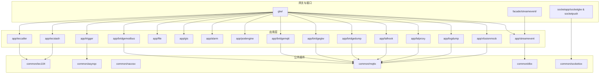
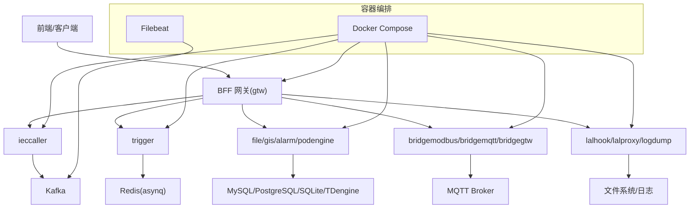
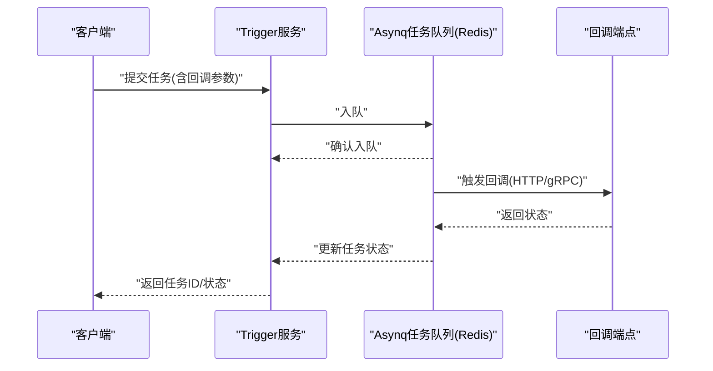
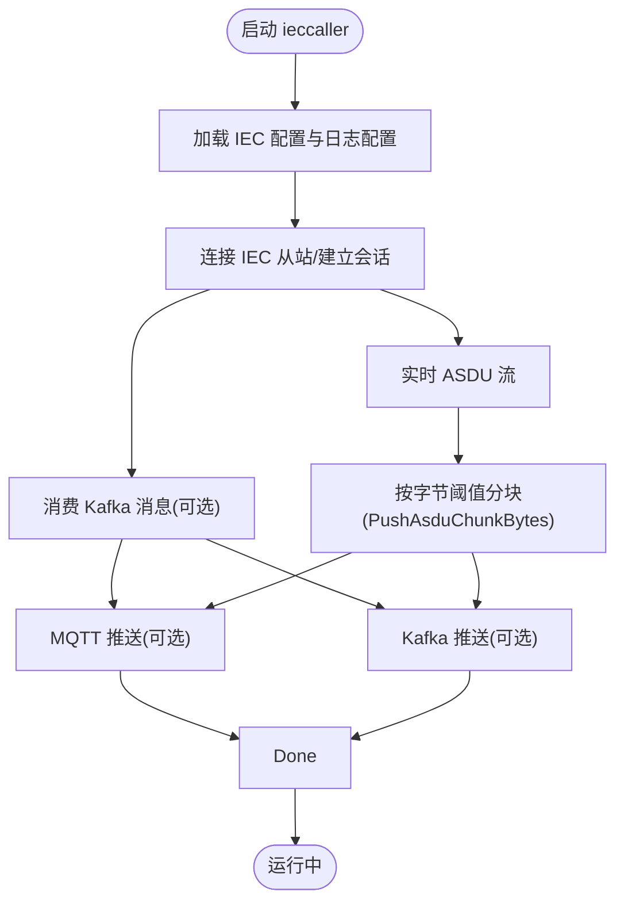
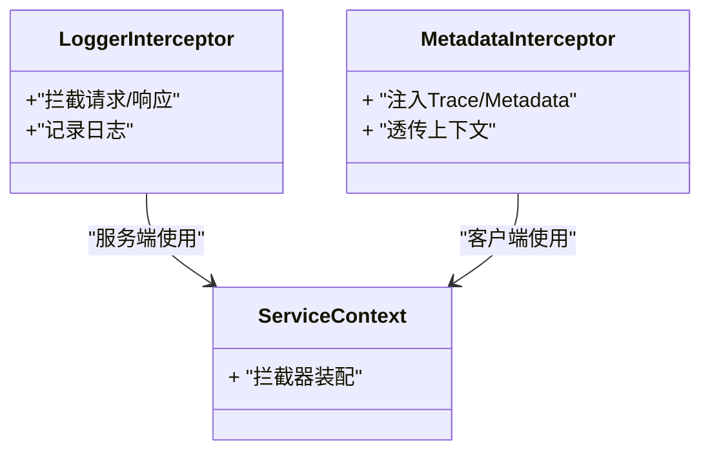
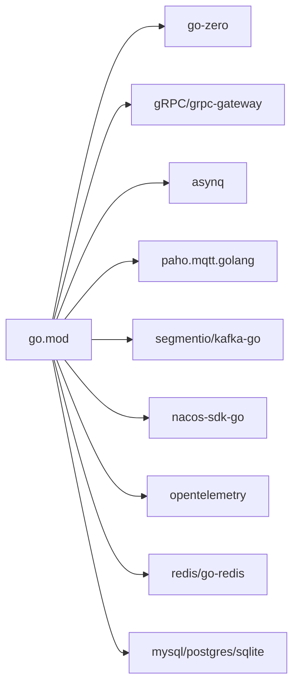

# 调试与性能分析

<cite>
**本文引用的文件**
- [README.md](file://README.md)
- [go.mod](file://go.mod)
- [deploy/docker-compose.yml](file://deploy/docker-compose.yml)
- [deploy/filebeat/conf/filebeat.yml](file://deploy/filebeat/conf/filebeat.yml)
- [app/trigger/etc/trigger.yaml](file://app/trigger/etc/trigger.yaml)
- [app/ieccaller/etc/ieccaller.yaml](file://app/ieccaller/etc/ieccaller.yaml)
- [app/bridgedump/etc/bridgedump.yaml](file://app/bridgedump/etc/bridgedump.yaml)
- [util/manage.sh](file://util/manage.sh)
- [common/Interceptor/rpcserver/loggerInterceptor.go](file://common/Interceptor/rpcserver/loggerInterceptor.go)
- [common/Interceptor/rpcclient/metadataInterceptor.go](file://common/Interceptor/rpcclient/metadataInterceptor.go)
- [common/dbx/dbx.go](file://common/dbx/dbx.go)
- [common/nacosx/register.go](file://common/nacosx/register.go)
- [common/nacosx/resolver.go](file://common/nacosx/resolver.go)
- [common/mqttx/message.go](file://common/mqttx/message.go)
- [common/mqttx/trace.go](file://common/mqttx/trace.go)
- [common/iec104/client/clientmanager.go](file://common/iec104/client/clientmanager.go)
- [common/iec104/client/core.go](file://common/iec104/client/core.go)
- [common/iec104/server/iecServer.go](file://common/iec104/server/iecServer.go)
- [common/iec104/util/util.go](file://common/iec104/util/util.go)
- [common/asynqx/asynqClient.go](file://common/asynqx/asynqClient.go)
- [common/asynqx/asynqTaskServer.go](file://common/asynqx/asynqTaskServer.go)
- [common/asynqx/asynqSchedulerServer.go](file://common/asynqx/asynqSchedulerServer.go)
- [socketapp/socketgtw/internal/config/config.go](file://socketapp/socketgtw/internal/config/config.go)
- [socketapp/socketpush/internal/config/config.go](file://socketapp/socketpush/internal/config/config.go)
- [facade/streamevent/etc/streamevent.yaml](file://facade/streamevent/etc/streamevent.yaml)
- [zerorpc/etc/zerorpc.yaml](file://zerorpc/etc/zerorpc.yaml)
- [zerorpc/internal/config/config.go](file://zerorpc/internal/config/config.go)
- [zerorpc/internal/logic/pinglogic.go](file://zerorpc/internal/logic/pinglogic.go)
- [zerorpc/internal/logic/generatetokenlogic.go](file://zerorpc/internal/logic/generatetokenlogic.go)
- [zerorpc/internal/logic/senddelaytasklogic.go](file://zerorpc/internal/logic/senddelaytasklogic.go)
- [zerorpc/internal/logic/forwardtasklogic.go](file://zerorpc/internal/logic/forwardtasklogic.go)
- [zerorpc/internal/logic/loginlogic.go](file://zerorpc/internal/logic/loginlogic.go)
- [zerorpc/internal/logic/getuserinfologic.go](file://zerorpc/internal/logic/getuserinfologic.go)
- [zerorpc/internal/logic/edituserinfologic.go](file://zerorpc/internal/logic/edituserinfologic.go)
- [zerorpc/internal/logic/sendsmsverifycodelogic.go](file://zerorpc/internal/logic/sendsmsverifycodelogic.go)
- [zerorpc/internal/logic/wxpayjsapilogic.go](file://zerorpc/internal/logic/wxpayjsapilogic.go)
- [zerorpc/internal/logic/getregionlistlogic.go](file://zerorpc/internal/logic/getregionlistlogic.go)
- [zerorpc/internal/logic/miniprogramloginlogic.go](file://zerorpc/internal/logic/miniprogramloginlogic.go)
- [zerorpc/internal/logic/pinglogic.go](file://zerorpc/internal/logic/pinglogic.go)
- [zerorpc/internal/server/zerorpcserver.go](file://zerorpc/internal/server/zerorpcserver.go)
- [zerorpc/internal/task/scheduler/...](file://zerorpc/internal/task/scheduler/)
- [zerorpc/internal/task/deferdelaytask.go](file://zerorpc/internal/task/deferdelaytask.go)
- [zerorpc/internal/task/deferforwardtask.go](file://zerorpc/internal/task/deferforwardtask.go)
- [zerorpc/internal/task/routes.go](file://zerorpc/internal/task/routes.go)
- [zerorpc/internal/svc/servicecontext.go](file://zerorpc/internal/svc/servicecontext.go)
- [zerorpc/zerorpc/zerorpc.pb.go](file://zerorpc/zerorpc/zerorpc.pb.go)
- [zerorpc/zerorpc/zerorpc_grpc.pb.go](file://zerorpc/zerorpc/zerorpc_grpc.pb.go)
- [zerorpc/zerorpc.go](file://zerorpc/zerorpc.go)
- [zerorpc/zerorpc.proto](file://zerorpc/zerorpc.proto)
- [zerorpc/gen.sh](file://zerorpc/gen.sh)
- [zerorpc/deploy.sh](file://zerorpc/deploy.sh)
- [zerorpc/Dockerfile](file://zerorpc/Dockerfile)
- [util/dockeru/pod-enter-app.sh](file://util/dockeru/pod-enter-app.sh)
- [util/dockeru/pod-log-app.sh](file://util/dockeru/pod-log-app.sh)
</cite>

## 目录
1. [简介](#简介)
2. [项目结构](#项目结构)
3. [核心组件](#核心组件)
4. [架构总览](#架构总览)
5. [详细组件分析](#详细组件分析)
6. [依赖分析](#依赖分析)
7. [性能考量](#性能考量)
8. [故障排查指南](#故障排查指南)
9. [结论](#结论)
10. [附录](#附录)

## 简介
本指南面向Zero-Service项目的开发者与运维人员，聚焦于开发与生产环境下的调试与性能分析方法。内容涵盖：
- IDE配置与断点调试、日志分析、远程调试
- Go应用性能分析工具（pprof、trace）的实际使用
- Docker容器环境下的调试（容器进入、日志查看、进程分析）
- 常见问题诊断（性能瓶颈、内存泄漏、并发问题）
- 生产环境调试的安全注意事项与最佳实践

## 项目结构
项目采用go-zero微服务架构，围绕多协议接入（IEC 104、Modbus、MQTT）、异步任务调度（asynq）、实时通信（SocketIO）、容器管理（Docker）等能力组织模块。核心服务分布于app/目录，公共组件位于common/，BFF网关在gtw/，对外接口层在facade/，实时通信在socketapp/。

图表来源
- [README.md:59-108](file://README.md#L59-L108)

章节来源
- [README.md:59-108](file://README.md#L59-L108)

## 核心组件
- 触发与任务调度（Trigger）：基于asynq的分布式任务队列与自研计划任务引擎，支持定时/延时任务、回调、重试与生命周期管理。
- IEC 104 数采平台：ieccaller（主站）、iecstash（合并）、streamevent（落库），形成“IEC 104 从站 -> ieccaller -> Kafka -> iecstash -> streamevent -> TDengine”的链路。
- 实时通信（SocketIO）：socketgtw（连接/房间/路由/鉴权）、socketpush（Token/推送）。
- 协议桥接：Modbus、MQTT、HTTP代理、LAL流媒体、日志导出等。
- 容器管理：基于Docker SDK的Pod抽象与生命周期管理。
- 公共组件：拦截器（gRPC日志/元数据）、数据库扩展、Nacos服务发现、MQTT扩展、地理信息、asynq扩展等。

章节来源
- [README.md:110-225](file://README.md#L110-L225)

## 架构总览
下图展示系统在开发与生产环境中的典型交互：BFF网关聚合gRPC/HTTP，服务间通过gRPC与消息队列（Kafka）交互，任务队列（Redis）支撑异步任务，容器编排（Docker Compose）提供本地快速启动。

图表来源
- [README.md:15-51](file://README.md#L15-L51)
- [deploy/docker-compose.yml:1-110](file://deploy/docker-compose.yml#L1-L110)
- [deploy/filebeat/conf/filebeat.yml:1-122](file://deploy/filebeat/conf/filebeat.yml#L1-L122)

## 详细组件分析

### 触发与任务调度（Trigger）
- 配置要点：日志路径、级别、保留天数；Nacos注册开关与服务名；Redis连接与DB配置；StreamEvent回调端点与超时。
- 调试建议：
  - 使用gRPC客户端或grpcurl验证回调端点连通性与响应。
  - 通过Redis可视化工具检查任务队列状态与重试次数。
  - 在逻辑层添加关键路径日志，结合拦截器输出请求上下文。
- 性能关注：任务批处理大小、回调非阻塞配置、GracePeriod设置对吞吐的影响。

图表来源
- [app/trigger/etc/trigger.yaml:1-37](file://app/trigger/etc/trigger.yaml#L1-L37)
- [common/asynqx/asynqClient.go](file://common/asynqx/asynqClient.go)
- [common/asynqx/asynqTaskServer.go](file://common/asynqx/asynqTaskServer.go)
- [common/asynqx/asynqSchedulerServer.go](file://common/asynqx/asynqSchedulerServer.go)

章节来源
- [app/trigger/etc/trigger.yaml:1-37](file://app/trigger/etc/trigger.yaml#L1-L37)
- [common/asynqx/asynqClient.go](file://common/asynqx/asynqClient.go)
- [common/asynqx/asynqTaskServer.go](file://common/asynqx/asynqTaskServer.go)
- [common/asynqx/asynqSchedulerServer.go](file://common/asynqx/asynqSchedulerServer.go)

### IEC 104 数采平台
- 配置要点：部署模式、日志级别、Nacos注册、IEC从站Host/Port、总召唤/累计量召唤周期、Kafka/MQTT推送Topic、数据库开关、PushAsduChunkBytes、GracePeriod。
- 调试建议：
  - 通过iecServer与clientmanager的握手/心跳日志定位连接异常。
  - 结合MQTT客户端与Kafka消费者验证消息是否正确推送。
  - 利用util/dockeru/pod-enter-app.sh进入容器，抓取/分析日志。
- 性能关注：TaskConcurrency、PushAsduChunkBytes、广播组与非阻塞推送策略。

图表来源
- [app/ieccaller/etc/ieccaller.yaml:1-79](file://app/ieccaller/etc/ieccaller.yaml#L1-L79)
- [common/iec104/client/clientmanager.go](file://common/iec104/client/clientmanager.go)
- [common/iec104/client/core.go](file://common/iec104/client/core.go)
- [common/iec104/server/iecServer.go](file://common/iec104/server/iecServer.go)
- [common/iec104/util/util.go](file://common/iec104/util/util.go)

章节来源
- [app/ieccaller/etc/ieccaller.yaml:1-79](file://app/ieccaller/etc/ieccaller.yaml#L1-L79)
- [common/iec104/client/clientmanager.go](file://common/iec104/client/clientmanager.go)
- [common/iec104/client/core.go](file://common/iec104/client/core.go)
- [common/iec104/server/iecServer.go](file://common/iec104/server/iecServer.go)
- [common/iec104/util/util.go](file://common/iec104/util/util.go)

### 实时通信（SocketIO）
- 配置要点：BFF网关与SocketIO服务的鉴权、房间管理、消息路由、MQTT桥接。
- 调试建议：
  - 使用WebSocket/SSE客户端验证连接与消息推送。
  - 在socketgtw与socketpush的逻辑层添加关键事件日志。
  - 结合MQTT桥接配置，验证Topic到Room的映射。
- 性能关注：房间数量、消息广播规模、会话剔除与元数据清理。

章节来源
- [socketapp/socketgtw/internal/config/config.go](file://socketapp/socketgtw/internal/config/config.go)
- [socketapp/socketpush/internal/config/config.go](file://socketapp/socketpush/internal/config/config.go)

### 协议桥接与文件/日志服务
- bridgemodbus/bridgemqtt/bridgegtw/bridgedump/lalhook/lalproxy/logdump等服务均提供独立配置与日志路径，便于容器化调试与问题定位。
- 调试建议：
  - 通过容器日志与Filebeat采集，核对Kafka/文件系统输出。
  - 使用Docker网络模式host简化端口映射与连通性测试。

章节来源
- [app/bridgedump/etc/bridgedump.yaml:1-10](file://app/bridgedump/etc/bridgedump.yaml#L1-L10)
- [deploy/docker-compose.yml:54-100](file://deploy/docker-compose.yml#L54-L100)
- [deploy/filebeat/conf/filebeat.yml:1-122](file://deploy/filebeat/conf/filebeat.yml#L1-L122)

### gRPC拦截器与日志
- 服务端拦截器：记录请求上下文、耗时、错误码，辅助定位慢调用与异常。
- 客户端拦截器：注入Trace/Metadata，便于跨服务链路追踪。

图表来源
- [common/Interceptor/rpcserver/loggerInterceptor.go](file://common/Interceptor/rpcserver/loggerInterceptor.go)
- [common/Interceptor/rpcclient/metadataInterceptor.go](file://common/Interceptor/rpcclient/metadataInterceptor.go)

章节来源
- [common/Interceptor/rpcserver/loggerInterceptor.go](file://common/Interceptor/rpcserver/loggerInterceptor.go)
- [common/Interceptor/rpcclient/metadataInterceptor.go](file://common/Interceptor/rpcclient/metadataInterceptor.go)

### 数据库与连接池
- dbx提供数据库扩展与SQL执行封装，建议开启关键SQL日志以便定位慢查询。
- 配置项DisableStmtLog可用于控制SQL日志输出级别。

章节来源
- [common/dbx/dbx.go](file://common/dbx/dbx.go)
- [app/ieccaller/etc/ieccaller.yaml:68-70](file://app/ieccaller/etc/ieccaller.yaml#L68-L70)
- [app/trigger/etc/trigger.yaml:25-28](file://app/trigger/etc/trigger.yaml#L25-L28)

### 服务发现与注册（Nacos）
- register.go与resolver.go负责服务注册与解析，调试时可验证服务名、命名空间、端点连通性。

章节来源
- [common/nacosx/register.go](file://common/nacosx/register.go)
- [common/nacosx/resolver.go](file://common/nacosx/resolver.go)

### MQTT扩展与追踪
- message.go与trace.go提供消息封装与追踪能力，便于跨服务消息链路分析。

章节来源
- [common/mqttx/message.go](file://common/mqttx/message.go)
- [common/mqttx/trace.go](file://common/mqttx/trace.go)

## 依赖分析
- 技术栈与依赖：go-zero、gRPC、grpc-gateway、Kafka、asynq、SocketIO、IEC 104/Modbus/MQTT、Nacos、TDengine、OpenTelemetry/Prometheus等。
- 关键外部依赖与版本在go.mod中声明，确保一致性与可复现性。

图表来源
- [go.mod:5-62](file://go.mod#L5-L62)

章节来源
- [go.mod:5-62](file://go.mod#L5-L62)

## 性能考量
- pprof与trace
  - 在服务入口启用pprof与trace导出，结合火焰图与执行跟踪定位热点与阻塞点。
  - 建议在开发环境开启，生产环境谨慎开启并限制访问范围。
- 并发与资源
  - IEC 104的TaskConcurrency、MQTT批量推送、Kafka分块大小（PushAsduChunkBytes）直接影响吞吐与延迟。
  - Redis连接池与任务重试策略需平衡可靠性与资源占用。
- 监控与可观测性
  - OpenTelemetry与Prometheus集成，结合Grafana仪表盘观察关键指标（QPS、P95/P99、内存、goroutine数、GC暂停时间）。
- 日志与追踪
  - 使用拦截器与统一日志配置，确保关键路径可追踪；避免过度打印导致I/O瓶颈。

章节来源
- [README.md:223-224](file://README.md#L223-L224)
- [app/ieccaller/etc/ieccaller.yaml:34-34](file://app/ieccaller/etc/ieccaller.yaml#L34-L34)
- [app/ieccaller/etc/ieccaller.yaml:78-78](file://app/ieccaller/etc/ieccaller.yaml#L78-L78)
- [app/trigger/etc/trigger.yaml:19-24](file://app/trigger/etc/trigger.yaml#L19-L24)

## 故障排查指南

### 开发环境调试
- IDE配置与断点调试
  - 使用GoLand/VSCode等IDE设置断点于关键逻辑入口（如pinglogic、generatetokenlogic等），结合gRPC/HTTP请求触发。
  - 在拦截器中设置条件断点，过滤慢请求或错误请求。
- 日志分析
  - 检查etc/*.yaml中的日志路径与级别，确保info及以上级别日志输出。
  - 使用grep/ripgrep在日志目录中检索关键字（如错误码、超时、panic）。
- 远程调试
  - 通过Docker网络模式host或端口映射暴露服务，使用本地IDE附加或远程调试工具连接容器内的进程。

章节来源
- [zerorpc/internal/logic/pinglogic.go](file://zerorpc/internal/logic/pinglogic.go)
- [zerorpc/internal/logic/generatetokenlogic.go](file://zerorpc/internal/logic/generatetokenlogic.go)
- [zerorpc/internal/logic/senddelaytasklogic.go](file://zerorpc/internal/logic/senddelaytasklogic.go)
- [zerorpc/internal/logic/forwardtasklogic.go](file://zerorpc/internal/logic/forwardtasklogic.go)
- [zerorpc/internal/logic/loginlogic.go](file://zerorpc/internal/logic/loginlogic.go)
- [zerorpc/internal/logic/getuserinfologic.go](file://zerorpc/internal/logic/getuserinfologic.go)
- [zerorpc/internal/logic/edituserinfologic.go](file://zerorpc/internal/logic/edituserinfologic.go)
- [zerorpc/internal/logic/sendsmsverifycodelogic.go](file://zerorpc/internal/logic/sendsmsverifycodelogic.go)
- [zerorpc/internal/logic/wxpayjsapilogic.go](file://zerorpc/internal/logic/wxpayjsapilogic.go)
- [zerorpc/internal/logic/getregionlistlogic.go](file://zerorpc/internal/logic/getregionlistlogic.go)
- [zerorpc/internal/logic/miniprogramloginlogic.go](file://zerorpc/internal/logic/miniprogramloginlogic.go)
- [zerorpc/internal/logic/pinglogic.go](file://zerorpc/internal/logic/pinglogic.go)
- [zerorpc/internal/server/zerorpcserver.go](file://zerorpc/internal/server/zerorpcserver.go)
- [zerorpc/internal/svc/servicecontext.go](file://zerorpc/internal/svc/servicecontext.go)

### Docker容器环境调试
- 容器进入
  - 使用util/dockeru/pod-enter-app.sh进入目标服务容器，检查进程、端口监听与日志文件。
- 日志查看
  - 通过docker logs或容器内日志目录查看服务日志；结合Filebeat将日志输出至Kafka便于集中分析。
- 进程分析
  - 在容器内使用top/htop、strace、perf等工具定位CPU/IO瓶颈；必要时启用pprof进行采样。

章节来源
- [util/dockeru/pod-enter-app.sh](file://util/dockeru/pod-enter-app.sh)
- [util/dockeru/pod-log-app.sh](file://util/dockeru/pod-log-app.sh)
- [deploy/docker-compose.yml:54-100](file://deploy/docker-compose.yml#L54-L100)
- [deploy/filebeat/conf/filebeat.yml:1-122](file://deploy/filebeat/conf/filebeat.yml#L1-L122)

### 常见问题诊断
- 性能瓶颈定位
  - 使用pprof CPU/heap/profile采样，结合火焰图识别热点函数；检查慢SQL与阻塞I/O。
  - 关注gRPC/HTTP延迟分布、队列积压与回调失败率。
- 内存泄漏检测
  - 使用pprof heap采样与heap profile对比，定位未释放的对象；检查大对象缓存与通道泄漏。
- 并发问题排查
  - 检查竞态条件（使用go run -race）、死锁（goroutine转储）、上下文取消与超时传播。
- 配置与连通性
  - 核对Nacos服务名/命名空间、Redis/Kafka/MQTT/Broker端点；使用grpcurl验证gRPC端点。

章节来源
- [go.mod:52-62](file://go.mod#L52-L62)
- [app/trigger/etc/trigger.yaml:11-18](file://app/trigger/etc/trigger.yaml#L11-L18)
- [app/ieccaller/etc/ieccaller.yaml:35-57](file://app/ieccaller/etc/ieccaller.yaml#L35-L57)
- [zerorpc/etc/zerorpc.yaml](file://zerorpc/etc/zerorpc.yaml)

### 生产环境调试安全注意事项
- 严格限制pprof/trace访问源；仅允许内网或VPN访问。
- 不在生产环境开启过细的日志级别；避免敏感信息泄露。
- 使用只读账户访问数据库与消息队列；最小权限原则。
- 在变更前做好回滚预案与灰度发布。

## 结论
通过合理的IDE调试、日志与拦截器配置、容器化调试手段以及pprof/trace等性能分析工具，可在开发与生产环境中高效定位问题并优化系统性能。结合Nacos、Kafka、Redis等基础设施的可观测性建设，可进一步提升系统的稳定性与可维护性。

## 附录

### 配置文件与常用命令索引
- 服务配置示例
  - Trigger: [app/trigger/etc/trigger.yaml:1-37](file://app/trigger/etc/trigger.yaml#L1-L37)
  - IEC 104: [app/ieccaller/etc/ieccaller.yaml:1-79](file://app/ieccaller/etc/ieccaller.yaml#L1-L79)
  - BridgeDump: [app/bridgedump/etc/bridgedump.yaml:1-10](file://app/bridgedump/etc/bridgedump.yaml#L1-L10)
  - Streamevent: [facade/streamevent/etc/streamevent.yaml](file://facade/streamevent/etc/streamevent.yaml)
  - Zerorpc: [zerorpc/etc/zerorpc.yaml](file://zerorpc/etc/zerorpc.yaml)
- 容器编排与日志
  - Docker Compose: [deploy/docker-compose.yml:1-110](file://deploy/docker-compose.yml#L1-L110)
  - Filebeat: [deploy/filebeat/conf/filebeat.yml:1-122](file://deploy/filebeat/conf/filebeat.yml#L1-L122)
- 容器调试脚本
  - [util/manage.sh:1-35](file://util/manage.sh#L1-L35)
  - [util/dockeru/pod-enter-app.sh](file://util/dockeru/pod-enter-app.sh)
  - [util/dockeru/pod-log-app.sh](file://util/dockeru/pod-log-app.sh)