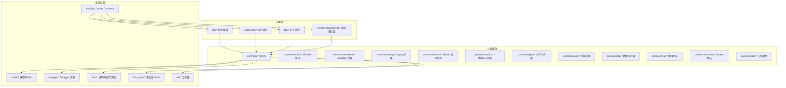
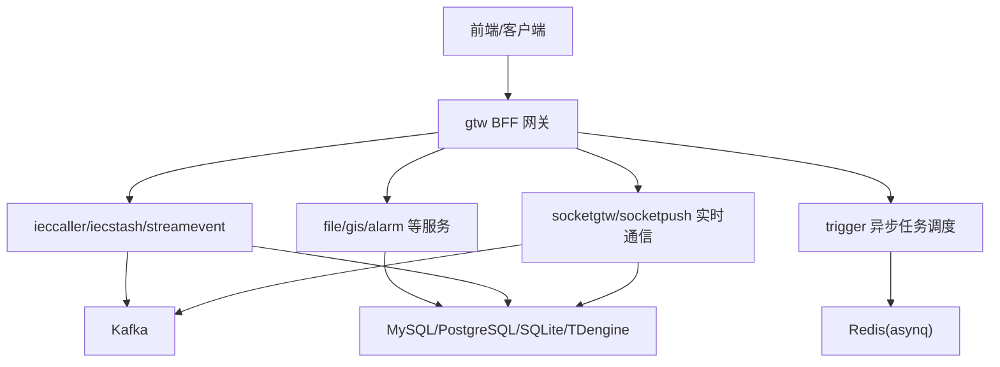
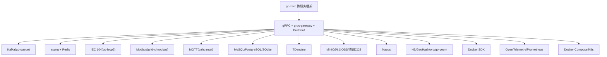

# 贡献指南

<cite>
**本文引用的文件**
- [README.md](file://README.md)
- [code.md](file://code.md)
- [go.mod](file://go.mod)
- [docs/trigger.md](file://docs/trigger.md)
- [common/nacosx/README.md](file://common/nacosx/README.md)
- [.trae/skills/zero-skills/README.md](file://.trae/skills/zero-skills/README.md)
- [.trae/skills/zero-skills/getting-started/README.md](file://.trae/skills/zero-skills/getting-started/README.md)
- [.trae/skills/zero-skills/examples/demo-project/README.md](file://.trae/skills/zero-skills/examples/demo-project/README.md)
- [deploy/docker-compose.yml](file://deploy/docker-compose.yml)
</cite>

## 目录
1. [简介](#简介)
2. [项目结构](#项目结构)
3. [核心组件](#核心组件)
4. [架构总览](#架构总览)
5. [详细组件分析](#详细组件分析)
6. [依赖分析](#依赖分析)
7. [性能考虑](#性能考虑)
8. [故障排查指南](#故障排查指南)
9. [结论](#结论)
10. [附录](#附录)

## 简介
本指南面向希望参与 zero-service 项目的贡献者，提供从 Fork 仓库、创建分支、提交代码、创建 Pull Request 的完整流程；建立行为准则与沟通礼仪；给出新贡献者的入门路径（理解架构、定位贡献点、与维护者沟通）；介绍治理结构与决策流程；以及贡献认可机制（贡献者列表、里程碑庆祝、社区活动参与方式）。  
项目基于 go-zero 微服务框架，覆盖 IEC 104 数采、Modbus/MQTT 桥接、异步任务调度、实时通信、容器管理、地理信息、BFF 网关等场景，提供开箱即用的多协议接入与高性能数据处理能力。

章节来源
- [README.md:1-350](file://README.md#L1-L350)

## 项目结构
zero-service 采用按领域/功能划分的服务化组织方式，核心目录如下：
- app/：核心微服务集合（如 trigger、file、alarm、bridgemodbus、bridgemqtt、bridgegtw、lalhook、lalproxy、logdump、socketapp、gtw、facade/streamevent 等）
- common/：公共组件库（如 iec104、socketiox、asynqx、nacosx、modbusx、mqttx、ossx、dbx、gisx、dockerx、imagex、tool、Interceptor 等）
- model/：数据库模型与 SQL 脚本
- deploy/：Docker Compose 编排配置
- docs/：架构与使用文档
- swagger/：Swagger API 文档
- third_party/：第三方 Proto 定义
- util/：工具集
- .trae/skills/zero-skills/：AI 辅助开发技能包（Claude/Cursor/Copilot/Windsurf）

图表来源
- [README.md:59-108](file://README.md#L59-L108)
- [go.mod:5-62](file://go.mod#L5-L62)

章节来源
- [README.md:59-108](file://README.md#L59-L108)
- [go.mod:1-245](file://go.mod#L1-L245)

## 核心组件
- IEC 104 数采平台：ieccaller（主站）、iecstash（数据合并）、streamevent（数据落库），形成 Kafka/MQTT/gRPC 三通道推送链路。
- Trigger 异步任务调度：基于 asynq 的分布式任务队列与自研计划任务引擎，支持 HTTP/gRPC 回调、状态机与重试策略。
- SocketIO 实时通信：socketgtw（连接/房间/路由）、socketpush（Token/gRPC 推送），支持 MQTT 桥接与追踪。
- BFF 网关（gtw）：统一 HTTP/gRPC 聚合入口，含 JWT 认证、文件上传/下载、微信支付回调、CORS。
- 外部接口层（facade/streamevent）：跨语言流数据事件协议，支持 IEC 104、MQTT/WebSocket/Kafka 消息接收与推送。
- 公共组件：Nacos 服务注册/发现、Modbus/MQTT/IEC104 协议扩展、对象存储、数据库扩展、地理信息、Docker 封装、工具库等。

章节来源
- [README.md:110-206](file://README.md#L110-L206)
- [docs/trigger.md:1-284](file://docs/trigger.md#L1-L284)

## 架构总览
系统采用“BFF 网关 + 多 gRPC 服务 + 消息中间件/数据库”的分层架构。前端/客户端通过 gtw/BFF 聚合访问后端服务；服务间通过 gRPC 通信；异步任务通过 asynq + Redis；计划任务通过数据库扫描与回调；数据落库统一经 facade/streamevent 适配多协议。

图表来源
- [README.md:15-51](file://README.md#L15-L51)
- [README.md:110-206](file://README.md#L110-L206)
- [docs/trigger.md:14-70](file://docs/trigger.md#L14-L70)

章节来源
- [README.md:15-51](file://README.md#L15-L51)
- [README.md:110-206](file://README.md#L110-L206)
- [docs/trigger.md:14-70](file://docs/trigger.md#L14-L70)

## 详细组件分析

### 贡献流程（Fork → 分支 → 提交 → PR）
- Fork 仓库：在 GitHub 上 Fork 仓库到个人账号。
- 本地初始化：
  - 克隆仓库到本地
  - 运行依赖整理命令（如 go mod tidy）
- 新建分支：
  - 基于主分支创建特性分支（建议使用清晰语义的命名，如 feature/add-doc 或 fix/issue-xxx）
- 提交代码：
  - 遵循项目风格与规范（详见“行为准则与沟通礼仪”）
  - 提交信息清晰描述变更目的与影响
- 创建 Pull Request：
  - 在 GitHub 上创建 PR，填写模板中的必要信息（变更内容、动机、测试情况、影响范围）
  - 等待审查与讨论，按反馈进行修改
- 合并与清理：
  - PR 合并后清理本地与远程分支

章节来源
- [README.md:226-281](file://README.md#L226-L281)

### 行为准则与沟通礼仪
- 沟通礼貌与尊重：使用友好、专业的语言，避免人身攻击，聚焦问题本身。
- 问题报告（Issue）：
  - 提供清晰标题、复现步骤、期望与实际结果、环境信息（Go 版本、依赖版本、操作系统）
  - 如涉及安全问题，请私下联系维护者，不要公开披露
- 功能请求（Feature Request）：
  - 描述背景、目标、收益与可能的影响
  - 若涉及破坏性变更，提前讨论与评估
- 代码评审（PR）：
  - 保持 PR 粒度小、主题单一，便于评审
  - 提供必要的测试与文档更新
  - 及时响应评审意见

章节来源
- [README.md:226-281](file://README.md#L226-L281)

### 新贡献者入门指导
- 理解项目架构：
  - 通过 README 的系统架构图与项目结构概览快速建立整体认知
  - 阅读 docs/trigger.md 等专题文档，掌握关键子系统的职责与交互
- 定位合适的贡献点：
  - 从自身技术栈与兴趣出发（如 IEC104、Modbus、MQTT、实时通信、任务调度、容器管理、地理信息等）
  - 查看各服务的 etc/ 配置与 proto 接口，理解其职责边界
- 与维护者沟通：
  - 优先在 Issue 中提出问题或建议，并 @ 相关维护者
  - 对于重大改动，建议先开 Discussion 或在 Issue 中充分讨论
- 开发环境准备：
  - 按 README 的“快速开始”准备环境与依赖
  - 使用 deploy/docker-compose.yml 启动核心服务进行联调

章节来源
- [README.md:15-108](file://README.md#L15-L108)
- [docs/trigger.md:1-284](file://docs/trigger.md#L1-L284)
- [deploy/docker-compose.yml](file://deploy/docker-compose.yml)

### 治理结构与决策流程
- 项目治理：
  - 由维护团队负责代码质量、版本规划与发布节奏
  - 重大变更通过 Issue 讨论与 PR 审查，必要时进行投票或共识达成
- 技术讨论与投票：
  - 建议在 Issue 中开启技术讨论，收集多方意见
  - 对于需要决策的议题，维护者有权做出最终裁决
- 透明与可追溯：
  - 所有讨论与决策尽量在 Issue/PR 中记录，便于回溯

章节来源
- [README.md:15-108](file://README.md#L15-L108)

### 贡献认可机制
- 贡献者列表：在项目文档中列出主要贡献者与维护者
- 里程碑庆祝：在重要版本发布时进行社区公告与庆祝
- 社区活动：鼓励参与线上/线下分享、技术交流与培训
- 贡献者徽章：在 README 或文档中标注贡献者头像与链接（如有）

章节来源
- [README.md:337-349](file://README.md#L337-L349)

### 错误码规范与一致性
- 项目遵循 google.rpc.Code 错误码标准，HTTP 与 gRPC 错误码映射关系明确
- 建议在新增服务或修改接口时，统一使用该规范，确保前后端一致

章节来源
- [code.md:1-66](file://code.md#L1-L66)

### 服务注册与发现（Nacos）
- 服务端通过 NacosConfig 注册服务，客户端通过 Target 指向 Nacos 地址
- 建议在 PR 中新增或调整配置时，补充 Nacos 相关说明与示例

章节来源
- [common/nacosx/README.md:1-65](file://common/nacosx/README.md#L1-L65)

### AI 辅助开发（zero-skills）
- 通过 .trae/skills/zero-skills 提供 Claude/Cursor/Copilot/Windsurf 的集成指南与最佳实践
- 建议在贡献前阅读 Getting Started 与 Pattern Guides，提升开发效率与一致性

章节来源
- [.trae/skills/zero-skills/README.md:1-229](file://.trae/skills/zero-skills/README.md#L1-L229)
- [.trae/skills/zero-skills/getting-started/README.md:1-129](file://.trae/skills/zero-skills/getting-started/README.md#L1-L129)
- [.trae/skills/zero-skills/examples/demo-project/README.md:1-255](file://.trae/skills/zero-skills/examples/demo-project/README.md#L1-L255)

## 依赖分析
- 框架与 RPC：go-zero、grpc-gateway、Protocol Buffers
- 消息与任务：Kafka（go-queue）、asynq + Redis
- 协议扩展：IEC 104（go-iecp5）、Modbus（grid-x/modbus）、MQTT（paho.mqtt）
- 数据库与时序：MySQL/PostgreSQL/SQLite、TDengine
- 对象存储：MinIO、阿里 OSS、腾讯 COS
- 服务发现：Nacos
- 地理计算：H3、GeoHash、orb、go-geom
- 容器管理：Docker SDK
- 监控追踪：OpenTelemetry、Prometheus
- 编排：Docker Compose、Kubernetes（可选）

图表来源
- [go.mod:5-62](file://go.mod#L5-L62)
- [README.md:207-225](file://README.md#L207-L225)

章节来源
- [go.mod:1-245](file://go.mod#L1-L245)
- [README.md:207-225](file://README.md#L207-L225)

## 性能考虑
- 任务调度：asynq 的并发与队列权重需结合业务峰值合理配置；Redis 集群部署保障高可用
- 计划任务：数据库扫表频率与乐观锁/分布式锁配合，避免重复执行与抖动
- 实时通信：SocketIO 房间与广播策略需结合业务规模选择合适的连接与消息路由策略
- 协议处理：IEC 104/Modbus/MQTT 的并发与缓冲区大小需按设备数量与上报频率调优
- 存储与网络：对象存储与数据库的连接池、超时与重试策略需与 SLA 对齐

## 故障排查指南
- 触发任务异常：
  - 检查 asynq Worker 是否正常运行、Redis 连接是否可达
  - 通过 Trigger 的任务管理 API 查询任务状态与历史统计
- 计划任务卡住：
  - 检查 ExecItem 的 next_trigger_time 与状态机流转
  - 核对 CronService 扫表日志与数据库索引
- 实时通信异常：
  - 检查 socketgtw/socketpush 的连接与房间管理日志
  - 关注 MQTT 桥接配置与事件映射
- 文件/对象存储问题：
  - 校验 OSS 配置与签名 URL 生成流程
- 网关与认证：
  - 检查 gtw 的 JWT 与 CORS 配置

章节来源
- [docs/trigger.md:40-176](file://docs/trigger.md#L40-L176)

## 结论
通过本指南，贡献者可以快速上手 zero-service 的开发与贡献流程，理解项目架构与关键组件，遵循行为准则与沟通礼仪，定位合适的贡献点并与维护者高效协作。我们鼓励各类贡献（代码、文档、测试、设计、运维等），共同推动项目演进与生态繁荣。

## 附录
- 快速开始与安装：参考 README 的“快速开始”与“安装/启动/配置”
- 代码生成：各服务目录下的 gen.sh 用于生成代码框架
- Swagger 文档：swagger/ 目录下提供各服务的 API 文档
- Docker 编排：deploy/docker-compose.yml 提供一键启动核心服务

章节来源
- [README.md:226-294](file://README.md#L226-L294)
- [deploy/docker-compose.yml](file://deploy/docker-compose.yml)