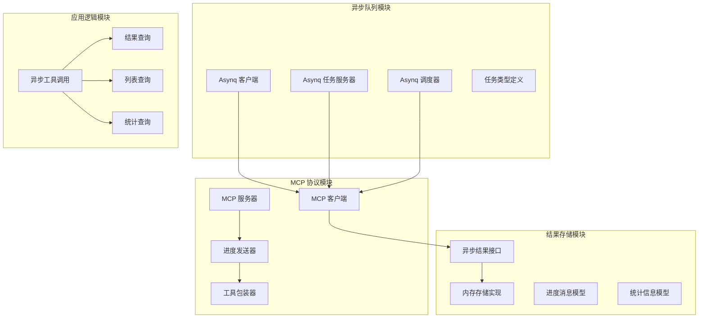
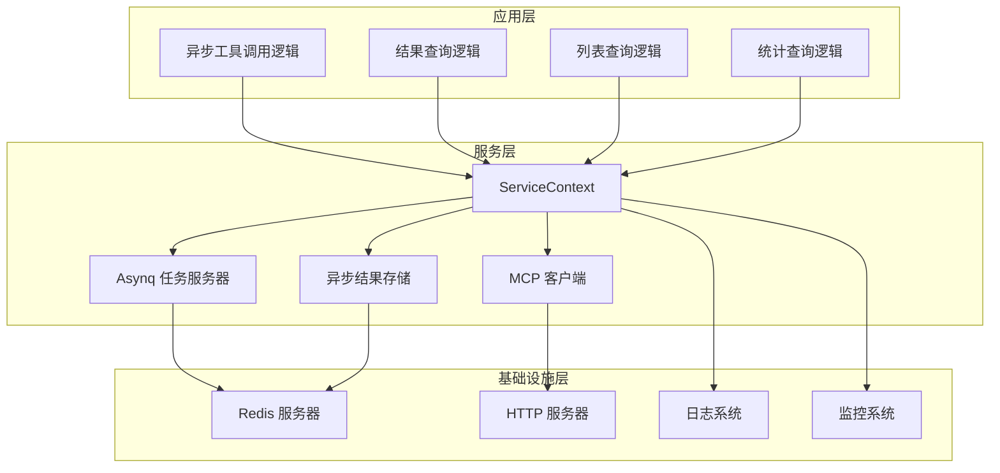
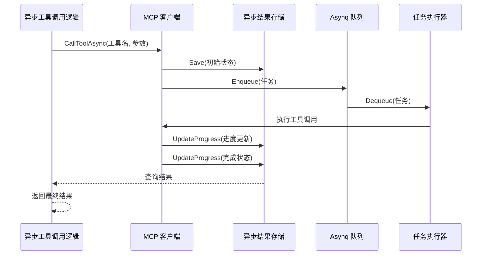
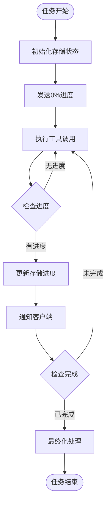
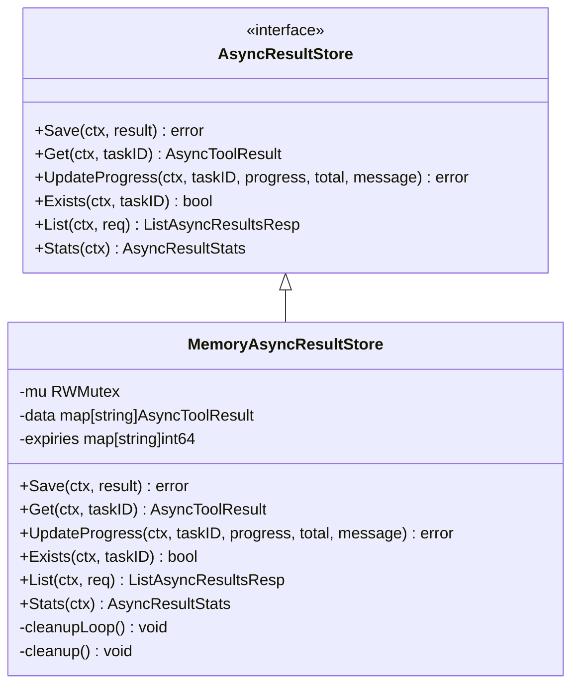
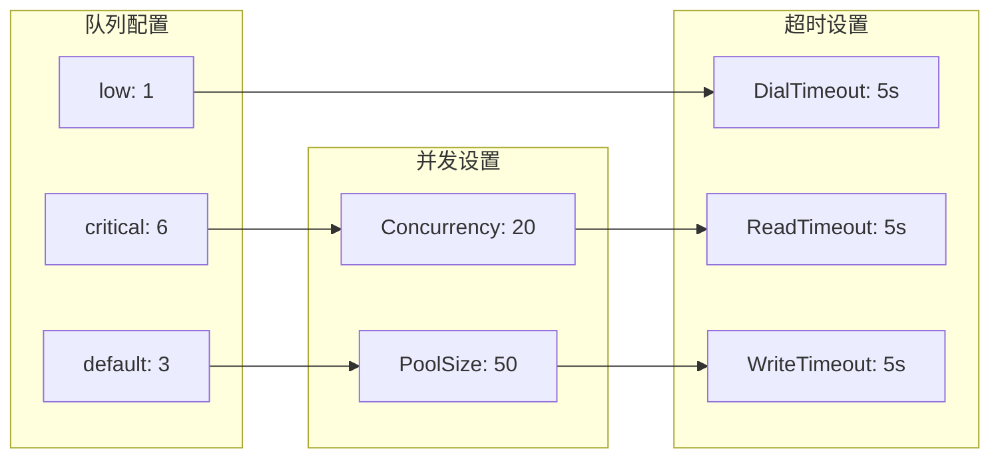
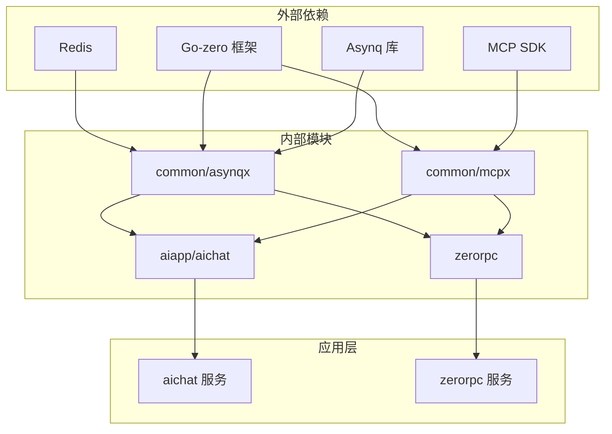

# 异步结果处理系统

<cite>
**本文档引用的文件**
- [asynqClient.go](file://common/asynqx/asynqClient.go)
- [asynqTaskServer.go](file://common/asynqx/asynqTaskServer.go)
- [asynqSchedulerServer.go](file://common/asynqx/asynqSchedulerServer.go)
- [tasktype.go](file://common/asynqx/tasktype.go)
- [async_result.go](file://common/mcpx/async_result.go)
- [memory_handler.go](file://common/mcpx/memory_handler.go)
- [client.go](file://common/mcpx/client.go)
- [server.go](file://common/mcpx/server.go)
- [wrapper.go](file://common/mcpx/wrapper.go)
- [asynctoolresultlogic.go](file://aiapp/aichat/internal/logic/asynctoolresultlogic.go)
- [listasyncresultslogic.go](file://aiapp/aichat/internal/logic/listasyncresultslogic.go)
- [asyncresultstatslogic.go](file://aiapp/aichat/internal/logic/asyncresultstatslogic.go)
- [asynctoolcalllogic.go](file://aiapp/aichat/internal/logic/asynctoolcalllogic.go)
- [aichat.yaml](file://aiapp/aichat/etc/aichat.yaml)
- [servicecontext.go](file://zerorpc/internal/svc/servicecontext.go)
</cite>

## 目录
1. [简介](#简介)
2. [项目结构](#项目结构)
3. [核心组件](#核心组件)
4. [架构概览](#架构概览)
5. [详细组件分析](#详细组件分析)
6. [依赖关系分析](#依赖关系分析)
7. [性能考虑](#性能考虑)
8. [故障排除指南](#故障排除指南)
9. [结论](#结论)

## 简介

异步结果处理系统是一个基于 Go-zero 框架构建的分布式异步任务处理解决方案。该系统结合了 Asynq 任务队列和 MCP（Model Context Protocol）协议，提供了完整的异步任务生命周期管理、进度跟踪、结果存储和状态监控功能。

系统主要特点包括：
- 基于 Redis 的高性能任务队列
- 支持延迟任务和定时任务调度
- MCP 协议的异步工具调用
- 实时进度跟踪和通知
- 多种存储后端支持（内存、Redis、MySQL）
- 完整的监控和统计功能

## 项目结构

异步结果处理系统采用模块化设计，主要分为以下几个核心模块：

**图表来源**
- [asynqClient.go:17-23](file://common/asynqx/asynqClient.go#L17-L23)
- [client.go:25-58](file://common/mcpx/client.go#L25-L58)
- [async_result.go:28-44](file://common/mcpx/async_result.go#L28-L44)

**章节来源**
- [asynqClient.go:1-31](file://common/asynqx/asynqClient.go#L1-L31)
- [asynqTaskServer.go:1-87](file://common/asynqx/asynqTaskServer.go#L1-L87)
- [asynqSchedulerServer.go:1-62](file://common/asynqx/asynqSchedulerServer.go#L1-L62)
- [client.go:1-200](file://common/mcpx/client.go#L1-L200)

## 核心组件

### Asynq 异步队列系统

Asynq 是一个基于 Redis 的异步任务队列系统，提供了以下核心功能：

#### AsynqClient
负责创建和管理 Asynq 客户端实例，支持任务生产者功能。

#### AsynqServer
Asynq 任务服务器，负责消费和执行队列中的任务。

#### AsynqScheduler
任务调度器，支持 Cron 表达式和延迟任务。

**章节来源**
- [asynqClient.go:17-31](file://common/asynqx/asynqClient.go#L17-L31)
- [asynqTaskServer.go:39-64](file://common/asynqx/asynqTaskServer.go#L39-L64)
- [asynqSchedulerServer.go:32-52](file://common/asynqx/asynqSchedulerServer.go#L32-L52)

### MCP 协议集成

MCP（Model Context Protocol）协议提供了标准化的 AI 工具调用接口。

#### MCP 客户端
支持多服务器连接管理、工具发现、进度通知等功能。

#### MCP 服务器
提供认证中间件包装，支持 SSE 和 Streamable 传输协议。

#### 进度发送器
实现基于事件发射器的进度通知机制。

**章节来源**
- [client.go:25-58](file://common/mcpx/client.go#L25-L58)
- [server.go:31-38](file://common/mcpx/server.go#L31-L38)
- [wrapper.go:34-45](file://common/mcpx/wrapper.go#L34-L45)

### 异步结果存储

系统提供了灵活的结果存储接口，支持多种存储后端：

#### AsyncResultStore 接口
定义了异步结果的标准操作接口。

#### MemoryAsyncResultStore
内存存储实现，支持 TTL 过期清理和分页查询。

#### AsyncToolResult 模型
定义了异步工具调用的完整结果结构。

**章节来源**
- [async_result.go:28-44](file://common/mcpx/async_result.go#L28-L44)
- [memory_handler.go:13-31](file://common/mcpx/memory_handler.go#L13-L31)
- [async_result.go:14-26](file://common/mcpx/async_result.go#L14-L26)

## 架构概览

系统采用分层架构设计，实现了清晰的关注点分离：

**图表来源**
- [servicecontext.go:19-33](file://zerorpc/internal/svc/servicecontext.go#L19-L33)
- [asynqTaskServer.go:28-37](file://common/asynqx/asynqTaskServer.go#L28-L37)
- [client.go:140-201](file://common/mcpx/client.go#L140-L201)

## 详细组件分析

### 异步工具调用流程

系统的核心工作流程是异步工具调用，以下是完整的处理序列：

**图表来源**
- [asynctoolcalllogic.go:26-63](file://aiapp/aichat/internal/logic/asynctoolcalllogic.go#L26-L63)
- [client.go:776-800](file://common/mcpx/client.go#L776-L800)
- [memory_handler.go:56-83](file://common/mcpx/memory_handler.go#L56-L83)

**章节来源**
- [asynctoolcalllogic.go:26-63](file://aiapp/aichat/internal/logic/asynctoolcalllogic.go#L26-L63)
- [client.go:776-800](file://common/mcpx/client.go#L776-L800)
- [memory_handler.go:56-83](file://common/mcpx/memory_handler.go#L56-L83)

### 进度跟踪机制

系统实现了多层次的进度跟踪机制：

**图表来源**
- [wrapper.go:238-253](file://common/mcpx/wrapper.go#L238-L253)
- [memory_handler.go:98-133](file://common/mcpx/memory_handler.go#L98-L133)

**章节来源**
- [wrapper.go:238-253](file://common/mcpx/wrapper.go#L238-L253)
- [memory_handler.go:98-133](file://common/mcpx/memory_handler.go#L98-L133)

### 存储后端实现

系统支持多种存储后端，以下是内存存储的实现细节：

**图表来源**
- [async_result.go:28-44](file://common/mcpx/async_result.go#L28-L44)
- [memory_handler.go:13-31](file://common/mcpx/memory_handler.go#L13-L31)

**章节来源**
- [async_result.go:28-44](file://common/mcpx/async_result.go#L28-L44)
- [memory_handler.go:13-31](file://common/mcpx/memory_handler.go#L13-L31)

### 任务队列配置

Asynq 任务队列提供了灵活的配置选项：

**图表来源**
- [asynqTaskServer.go:56-62](file://common/asynqx/asynqTaskServer.go#L56-L62)

**章节来源**
- [asynqTaskServer.go:56-62](file://common/asynqx/asynqTaskServer.go#L56-L62)

## 依赖关系分析

系统采用了清晰的依赖层次结构：

**图表来源**
- [servicecontext.go:19-33](file://zerorpc/internal/svc/servicecontext.go#L19-L33)
- [aichat.yaml:8-17](file://aiapp/aichat/etc/aichat.yaml#L8-L17)

**章节来源**
- [servicecontext.go:19-33](file://zerorpc/internal/svc/servicecontext.go#L19-L33)
- [aichat.yaml:8-17](file://aiapp/aichat/etc/aichat.yaml#L8-L17)

## 性能考虑

系统在设计时充分考虑了性能优化：

### 缓存策略
- 内存存储支持 TTL 过期清理
- 进度事件使用事件发射器减少内存占用
- 连接池配置优化 Redis 连接性能

### 并发控制
- Asynq 服务器支持并发任务执行
- MCP 客户端使用 goroutine 池管理异步操作
- 进度通知采用异步事件处理

### 监控指标
- 内置性能指标收集
- 任务执行时间统计
- 错误率监控

## 故障排除指南

### 常见问题及解决方案

#### 任务无法执行
1. 检查 Redis 连接配置
2. 验证 Asynq 服务器状态
3. 查看任务队列是否正常

#### 进度通知丢失
1. 确认 MCP 客户端连接状态
2. 检查进度事件发射器配置
3. 验证客户端订阅状态

#### 结果存储异常
1. 检查存储后端连接
2. 验证数据序列化格式
3. 查看存储权限配置

**章节来源**
- [asynqTaskServer.go:28-37](file://common/asynqx/asynqTaskServer.go#L28-L37)
- [client.go:418-424](file://common/mcpx/client.go#L418-L424)

## 结论

异步结果处理系统是一个功能完整、架构清晰的分布式异步任务处理解决方案。系统通过集成 Asynq 任务队列和 MCP 协议，提供了强大的异步处理能力和灵活的结果存储机制。

主要优势包括：
- 模块化设计，易于扩展和维护
- 多种存储后端支持，适应不同场景需求
- 完善的监控和统计功能
- 标准化的 MCP 协议支持
- 高性能的 Redis 基础设施

该系统适用于需要处理长时间运行任务、提供实时进度反馈和复杂结果管理的应用场景。