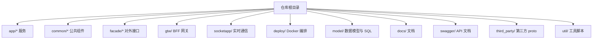
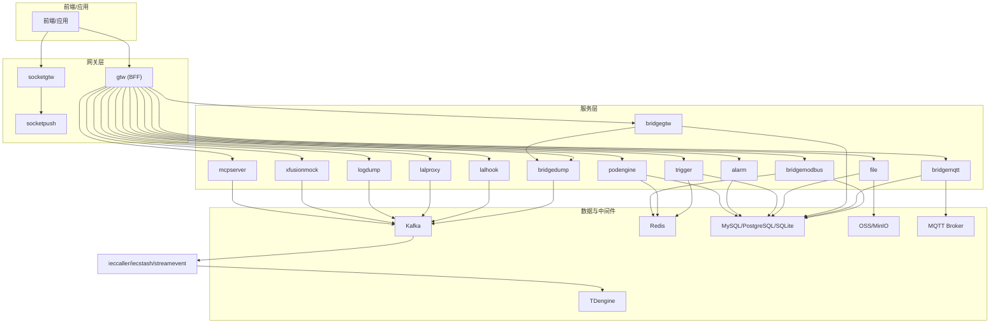
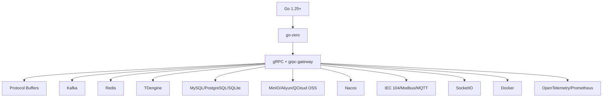

# 快速开始

<cite>
**本文引用的文件**   
- [README.md](file://README.md)
- [go.mod](file://go.mod)
- [deploy/docker-compose.yml](file://deploy/docker-compose.yml)
- [app/trigger/etc/trigger.yaml](file://app/trigger/etc/trigger.yaml)
- [app/bridgegtw/etc/bridgegtw.yaml](file://app/bridgegtw/etc/bridgegtw.yaml)
- [app/bridgemodbus/etc/bridgemodbus.yaml](file://app/bridgemodbus/etc/bridgemodbus.yaml)
- [facade/streamevent/etc/streamevent.yaml](file://facade/streamevent/etc/streamevent.yaml)
- [zerorpc/etc/zerorpc.yaml](file://zerorpc/etc/zerorpc.yaml)
- [util/manage.sh](file://util/manage.sh)
- [util/Taskfile.yml](file://util/Taskfile.yml)
- [app/ieccaller/deploy.sh](file://app/ieccaller/deploy.sh)
</cite>

## 目录
1. [简介](#简介)
2. [项目结构](#项目结构)
3. [核心组件](#核心组件)
4. [架构总览](#架构总览)
5. [详细组件分析](#详细组件分析)
6. [依赖分析](#依赖分析)
7. [性能考虑](#性能考虑)
8. [故障排查指南](#故障排查指南)
9. [结论](#结论)
10. [附录](#附录)

## 简介
本指南面向希望快速搭建并运行 zero-service 的开发者，提供从环境准备、依赖安装、单服务与多服务启动、Docker Compose 一键部署，到常见问题排查的完整路径。项目基于 go-zero 微服务框架，覆盖 IEC 104 数采、异步任务调度、实时通信、容器管理、地理信息、协议桥接等场景。

## 项目结构
- 顶层采用多模块微服务组织方式，核心服务集中在 app/ 目录，公共组件在 common/，对外接口在 facade/，BFF 网关在 gtw/，实时通信在 socketapp/。
- 部署编排在 deploy/，包含 docker-compose.yml；各服务目录提供独立 Dockerfile 与部署脚本。
- 依赖管理使用 go.mod，Go 版本要求为 1.25+。

章节来源
- [README.md:59-108](file://README.md#L59-L108)

## 核心组件
- 触发与调度（trigger）：基于 asynq 的分布式任务队列与计划任务引擎，支持 Redis 存储、HTTP/gRPC 回调、状态机与生命周期管理。
- 数采平台（ieccaller/iecstash/streamevent）：IEC 104 主站、Kafka 消费与合并、gRPC 落库至 TDengine。
- 实时通信（socketgtw/socketpush）：SocketIO 网关与推送服务，支持房间、广播、MQTT 桥接与 Token 鉴权。
- 协议桥接（bridgemodbus/bridgemqtt/bridgegtw/bridgedump）：Modbus/TCP RTU、MQTT、HTTP 代理与文件生成。
- 文件服务（file）：分片流上传与 OSS 集成。
- 地理信息（gis）：H3/GeoHash/围栏/坐标转换。
- 容器管理（podengine）：Docker 容器生命周期与资源统计。
- BFF 网关（gtw）：统一 API 入口，聚合 gRPC 并提供 grpc-gateway HTTP 访问。
- 对外接口（facade/streamevent）：跨语言流数据事件协议，支持多协议消息聚合。

章节来源
- [README.md:110-206](file://README.md#L110-L206)

## 架构总览
系统采用“BFF 网关 + 多 gRPC 服务 + 消息中间件”的架构，IEC 104 数采平台通过 Kafka/MQTT/gRPC 三通道并行推送，最终落库至 TDengine。实时通信通过 SocketIO 网关与推送服务实现。

图表来源
- [README.md:15-51](file://README.md#L15-L51)
- [README.md:112-131](file://README.md#L112-L131)

## 详细组件分析

### 环境与依赖要求
- Go 版本：1.25+（go.mod 中声明）
- 可选依赖：Redis、Kafka、MySQL/PostgreSQL、TDengine、Docker
- 依赖安装：执行 go mod tidy 安装项目依赖

章节来源
- [README.md:226-241](file://README.md#L226-L241)
- [go.mod:3](file://go.mod#L3)

### 单服务启动（以 trigger 为例）
- 进入服务目录，使用 go run 启动，指定配置文件路径
- 配置项示例：Redis 连接、数据库连接、Nacos 注册、超时与日志级别等

章节来源
- [README.md:242-252](file://README.md#L242-L252)
- [app/trigger/etc/trigger.yaml:1-38](file://app/trigger/etc/trigger.yaml#L1-L38)

### 多服务启动与编排
- 使用 Docker Compose 一键启动核心服务（Kafka、Filebeat、ieccaller、bridgegtw、bridgedump），并提供可视化界面 Kafdrop
- 可按需修改 docker-compose.yml 中的镜像与端口映射

章节来源
- [README.md:300-318](file://README.md#L300-L318)
- [deploy/docker-compose.yml:1-110](file://deploy/docker-compose.yml#L1-L110)

### 配置文件修改方法
- 各服务配置位于 app/{service}/etc/{service}.yaml
- 常见配置项：服务监听地址与端口、Redis/Kafka/数据库连接、Nacos 服务注册、协议特定参数（如 IEC 从站列表、MQTT Broker）

章节来源
- [README.md:254-261](file://README.md#L254-L261)
- [app/bridgegtw/etc/bridgegtw.yaml:1-40](file://app/bridgegtw/etc/bridgegtw.yaml#L1-L40)
- [app/bridgemodbus/etc/bridgemodbus.yaml:1-26](file://app/bridgemodbus/etc/bridgemodbus.yaml#L1-L26)
- [facade/streamevent/etc/streamevent.yaml:1-28](file://facade/streamevent/etc/streamevent.yaml#L1-L28)
- [zerorpc/etc/zerorpc.yaml:1-39](file://zerorpc/etc/zerorpc.yaml#L1-L39)

### Docker Compose 一键部署
- 进入 deploy 目录，执行 docker-compose up -d 启动
- 支持可视化 Kafka 界面 Kafdrop（端口 39000）
- 容器网络模式采用 host，便于服务间直连与调试

章节来源
- [README.md:300-318](file://README.md#L300-L318)
- [deploy/docker-compose.yml:101-110](file://deploy/docker-compose.yml#L101-L110)

### 服务独立构建与部署
- 各服务目录提供 Dockerfile，支持独立构建镜像
- 部署脚本（如 app/ieccaller/deploy.sh）可实现本地构建、打包、上传与远端部署的流水线

章节来源
- [README.md:312-318](file://README.md#L312-L318)
- [app/ieccaller/deploy.sh:1-175](file://app/ieccaller/deploy.sh#L1-L175)

### 工具脚本与任务编排
- util/manage.sh：统一入口脚本，支持 restart/up/stop/start 命令，可对指定服务或全部服务进行操作
- util/Taskfile.yml：任务编排入口，可结合 manage.sh 执行批量操作

章节来源
- [util/manage.sh:1-35](file://util/manage.sh#L1-L35)
- [util/Taskfile.yml:1-33](file://util/Taskfile.yml#L1-L33)

## 依赖分析
- 语言与框架：Go 1.25+、go-zero
- RPC 与协议：gRPC + grpc-gateway + Protocol Buffers
- 消息队列：Kafka（go-queue）
- 任务队列：asynq + Redis
- 实时通信：SocketIO（fork 版）
- 工业协议：IEC 60870-5-104（go-iecp5）、Modbus（grid-x/modbus）、MQTT（eclipse/paho.mqtt.golang）
- 数据库：MySQL/PostgreSQL/SQLite（关系库），TDengine（时序库）
- 对象存储：MinIO/阿里 OSS/腾讯 COS
- 服务发现：Nacos
- 地理计算：H3（uber/h3-go）、GeoHash、orb、go-geom
- 容器管理：Docker SDK
- 监控追踪：OpenTelemetry/Prometheus
- 容器编排：Docker Compose/Kubernetes（可选）

图表来源
- [go.mod:5-62](file://go.mod#L5-L62)
- [README.md:207-225](file://README.md#L207-L225)

章节来源
- [go.mod:1-245](file://go.mod#L1-L245)
- [README.md:207-225](file://README.md#L207-L225)

## 性能考虑
- 任务队列与缓存：合理设置 Redis 连接池与超时，避免阻塞与抖动
- Kafka：分区数与副本策略影响吞吐与容错，建议根据数据量与延迟需求调整
- 数据库：关系库与时序库分离，索引与分区策略优化查询性能
- 容器资源：限制内存与 CPU，避免资源争抢
- 网络模式：host 模式降低网络开销，但需注意端口冲突与安全策略

## 故障排查指南
- 启动失败（端口占用）
  - 现象：服务无法绑定端口
  - 处理：检查 docker-compose.yml 与各服务配置中的端口映射，释放被占用端口
- 依赖连接异常
  - Redis：确认主机、端口、密码与类型配置正确
  - Kafka：确认 advertised.listeners 与容器网络可达性
  - 数据库：确认连接串、用户名、密码与网络连通性
- 日志定位
  - 各服务日志路径在配置文件中定义，建议开启 debug 级别辅助排查
- 网关路由问题
  - bridgegtw 的上游映射与 gRPC 路径需与实际服务一致
- Docker 部署问题
  - 使用 manage.sh 统一命令入口，确认服务名与 compose 文件路径
  - 若远端部署，检查 SSH 凭据与远端目录权限

章节来源
- [app/trigger/etc/trigger.yaml:19-38](file://app/trigger/etc/trigger.yaml#L19-L38)
- [app/bridgegtw/etc/bridgegtw.yaml:12-40](file://app/bridgegtw/etc/bridgegtw.yaml#L12-L40)
- [deploy/docker-compose.yml:13-27](file://deploy/docker-compose.yml#L13-L27)
- [util/manage.sh:1-35](file://util/manage.sh#L1-L35)

## 结论
通过本指南，您可以在本地快速完成环境准备、依赖安装与单/多服务启动，并借助 Docker Compose 一键部署核心组件。遇到问题时，可依据配置文件与日志进行定位，结合工具脚本与任务编排提升运维效率。建议在生产环境中进一步完善监控、限流与灰度发布策略。

## 附录
- 快速命令摘要
  - 依赖安装：go mod tidy
  - 单服务启动：go run {service}.go -f etc/{service}.yaml
  - Docker Compose 启动：cd deploy && docker-compose up -d
  - 统一运维：sh manage.sh up 或 sh manage.sh start
- 常用配置参考
  - trigger：Redis、数据库、Nacos、超时与日志
  - streamevent：TDengine 数据源、SQLite、中间件统计忽略
  - bridgegtw：上游 gRPC 映射、HTTP 路由
  - bridgemodbus：Modbus 地址、数据库连接、Nacos 注册