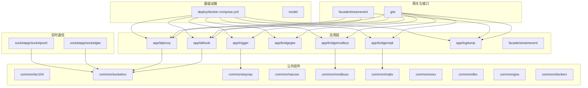
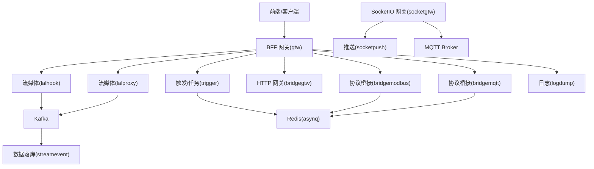
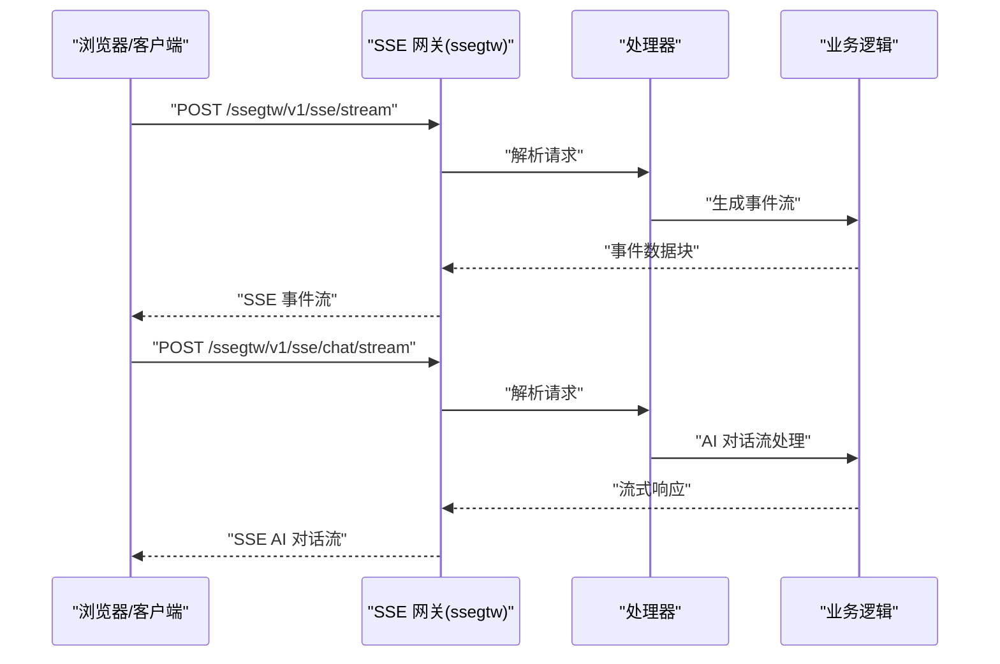
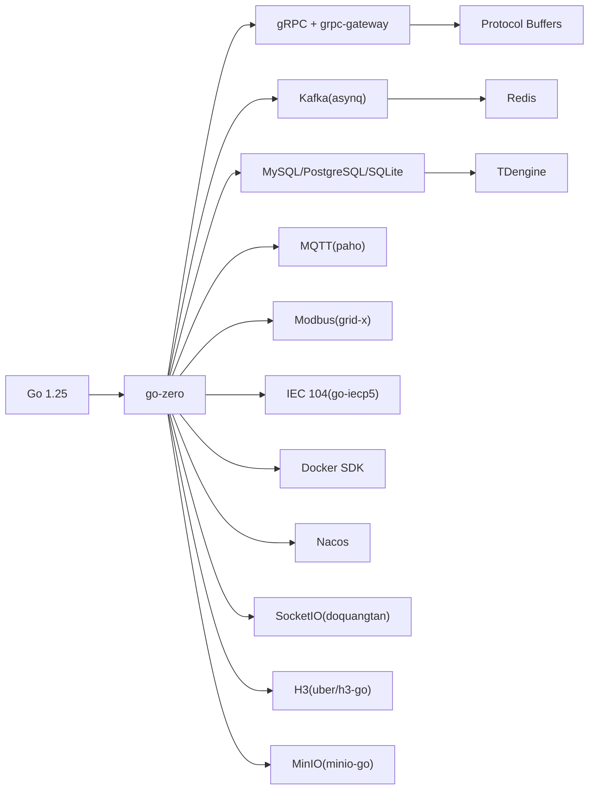

# 快速开始

<cite>
**本文引用的文件**
- [README.md](file://README.md)
- [go.mod](file://go.mod)
- [deploy/docker-compose.yml](file://deploy/docker-compose.yml)
- [aiapp/ssegtw/etc/ssegtw.yaml](file://aiapp/ssegtw/etc/ssegtw.yaml)
- [aiapp/ssegtw/ssegtw.go](file://aiapp/ssegtw/ssegtw.go)
- [aiapp/ssegtw/ssegtw.api](file://aiapp/ssegtw/ssegtw.api)
- [aiapp/ssegtw/sse_demo.html](file://aiapp/ssegtw/sse_demo.html)
- [aiapp/ssegtw/deploy.sh](file://aiapp/ssegtw/deploy.sh)
- [aiapp/ssegtw/gen.sh](file://aiapp/ssegtw/gen.sh)
- [util/manage.sh](file://util/manage.sh)
- [util/Taskfile.yml](file://util/Taskfile.yml)
- [.trae/skills/dev-environment/SKILL.md](file://.trae/skills/dev-environment/SKILL.md)
- [zerorpc/etc/zerorpc.yaml](file://zerorpc/etc/zerorpc.yaml)
</cite>

## 目录
1. [简介](#简介)
2. [项目结构](#项目结构)
3. [核心组件](#核心组件)
4. [架构总览](#架构总览)
5. [详细组件分析](#详细组件分析)
6. [依赖分析](#依赖分析)
7. [性能考虑](#性能考虑)
8. [故障排查指南](#故障排查指南)
9. [结论](#结论)
10. [附录](#附录)

## 简介
本指南面向首次接触 Zero-Service 的开发者，提供从环境准备、依赖安装、服务启动到开发调试的全流程说明，并给出 Docker Compose 一键部署方案与常见问题排查建议。项目基于 go-zero 微服务框架，覆盖 IEC 104 数采、异步任务调度、实时通信、协议桥接、容器管理、地理信息、BFF 网关等能力。

## 项目结构
- 根目录包含应用模块、公共组件、模型、部署编排、文档与工具等。
- 关键目录说明：
  - app：核心微服务集合（如 trigger、file、alarm、podengine、bridgemodbus、bridgemqtt、bridgegtw、lalhook、lalproxy、logdump、streamevent 等）
  - socketapp：实时通信模块（socketgtw、socketpush）
  - gtw：BFF 网关
  - facade：对外接口层（streamevent）
  - common：公共组件库（协议、队列、数据库、容器、工具等）
  - model：数据库模型与 SQL 脚本
  - deploy：Docker Compose 编排
  - docs/swagger/third_party：文档与 API 定义
  - util：工具脚本与任务编排
  - aiapp：示例应用（如 SSE 网关）

**图表来源**
- [README.md:59-108](file://README.md#L59-L108)
- [deploy/docker-compose.yml:1-110](file://deploy/docker-compose.yml#L1-L110)

**章节来源**
- [README.md:59-108](file://README.md#L59-L108)

## 核心组件
- IEC 104 数采平台：ieccaller（主站）、iecstash（数据合并）、streamevent（数据落库），支持 Kafka/MQTT/gRPC 三协议推送与 TDengine 存储。
- 异步任务调度：基于 asynq + Redis，支持 HTTP/gRPC 回调与计划任务管理。
- 实时通信：SocketIO 网关与推送服务，支持房间、广播、MQTT 桥接与 Token 鉴权。
- 协议桥接：Modbus/TCP/RTU、MQTT、HTTP 网关。
- 文件服务：分片流上传与 OSS 集成。
- 地理信息：H3/GeoHash/围栏/坐标转换。
- BFF 网关：统一入口，聚合 gRPC 并提供 grpc-gateway HTTP 访问。
- 容器管理：Docker 容器生命周期管理与 Pod 抽象。

**章节来源**
- [README.md:110-225](file://README.md#L110-L225)

## 架构总览
下图展示典型运行时拓扑：前端/客户端通过 BFF 网关访问各微服务；实时通信由 SocketIO 网关与推送服务支撑；IEC 104 数采链路经 Kafka/MQTT/gRPC 传递至数据落库服务；任务队列由 Redis 驱动。

**图表来源**
- [README.md:15-51](file://README.md#L15-L51)
- [README.md:110-225](file://README.md#L110-L225)

## 详细组件分析

### 环境要求与前置条件
- 语言与框架
  - Go 1.25+
  - go-zero 微服务框架
- 核心依赖
  - Redis（任务队列与缓存）
  - 可选：Kafka、MySQL、PostgreSQL、TDengine、Docker
- 服务发现与注册
  - Nacos（部分服务支持）
- 监控与可观测性
  - OpenTelemetry、Prometheus、Grafana（可选）

**章节来源**
- [README.md:226-233](file://README.md#L226-L233)
- [go.mod:3](file://go.mod#L3)

### 安装与启动

#### 1) 克隆与依赖安装
- 克隆仓库并初始化依赖
  - git clone + go mod tidy
- 代码生成
  - 在服务目录执行 gen.sh 生成 API/逻辑框架

**章节来源**
- [README.md:234-241](file://README.md#L234-L241)
- [README.md:273-281](file://README.md#L273-L281)

#### 2) 单服务启动（以 trigger 为例）
- 进入服务目录，使用配置文件启动
  - go run trigger.go -f etc/trigger.yaml

**章节来源**
- [README.md:242-252](file://README.md#L242-L252)

#### 3) Docker Compose 一键启动
- 进入 deploy 目录，启动编排
  - docker-compose up -d
- 默认包含：Kafka、Filebeat、ieccaller、bridgegtw、bridgedump、kafdrop

**章节来源**
- [README.md:300-318](file://README.md#L300-L318)
- [deploy/docker-compose.yml:1-110](file://deploy/docker-compose.yml#L1-L110)

#### 4) 部署脚本与远程部署
- 服务提供 deploy.sh，支持本地构建镜像、tar 导出、远程上传与 docker-compose 启动
- util/manage.sh 与 util/Taskfile.yml 提供统一的批量管理入口

**章节来源**
- [aiapp/ssegtw/deploy.sh:1-170](file://aiapp/ssegtw/deploy.sh#L1-L170)
- [util/manage.sh:1-35](file://util/manage.sh#L1-L35)
- [util/Taskfile.yml:1-33](file://util/Taskfile.yml#L1-L33)

### 配置说明
- 各服务配置位于 app/{service}/etc/ 目录
- 常见配置项
  - 服务监听地址与端口
  - Redis/Kafka/数据库连接
  - Nacos 服务注册
  - 协议特定配置（IEC 104 从站列表、MQTT Broker 等）

**章节来源**
- [README.md:254-261](file://README.md#L254-L261)

### 开发环境最佳实践
- IDE 与编辑器
  - 推荐使用 GoLand/VSCode + Go 插件
- 调试工具
  - 使用 go run + 配置文件启动单服务进行调试
  - 使用 Swagger 文档辅助 API 调试
- 常用开发命令
  - 代码生成：./gen.sh
  - 数据模型生成：model/genModel.sh / genPgModel.sh / genModelSql.sh
  - 任务编排：task start-docker / task up-docker / task stop-docker

**章节来源**
- [README.md:262-298](file://README.md#L262-L298)
- [.trae/skills/dev-environment/SKILL.md:142-200](file://.trae/skills/dev-environment/SKILL.md#L142-L200)

### Hello World 示例：SSE 网关
- 服务入口与配置
  - 入口文件：aiapp/ssegtw/ssegtw.go
  - 配置文件：aiapp/ssegtw/etc/ssegtw.yaml
  - API 定义：aiapp/ssegtw/ssegtw.api
- 启动与验证
  - 使用配置文件启动服务
  - 使用内置 HTML 测试页面（sse_demo.html）验证 SSE 事件流与 AI 对话流
- 部署
  - 通过 deploy.sh 构建镜像并远程部署

**图表来源**
- [aiapp/ssegtw/ssegtw.go:26-59](file://aiapp/ssegtw/ssegtw.go#L26-L59)
- [aiapp/ssegtw/ssegtw.api:18-38](file://aiapp/ssegtw/ssegtw.api#L18-L38)

**章节来源**
- [aiapp/ssegtw/ssegtw.go:1-60](file://aiapp/ssegtw/ssegtw.go#L1-L60)
- [aiapp/ssegtw/etc/ssegtw.yaml:1-14](file://aiapp/ssegtw/etc/ssegtw.yaml#L1-L14)
- [aiapp/ssegtw/ssegtw.api:1-40](file://aiapp/ssegtw/ssegtw.api#L1-L40)
- [aiapp/ssegtw/sse_demo.html:1-665](file://aiapp/ssegtw/sse_demo.html#L1-L665)
- [aiapp/ssegtw/deploy.sh:1-170](file://aiapp/ssegtw/deploy.sh#L1-L170)

## 依赖分析
- 语言与框架
  - Go 1.25.0（go.mod）
- RPC 与协议
  - gRPC + grpc-gateway + Protocol Buffers
  - IEC 104（go-iecp5）、Modbus（grid-x/modbus）、MQTT（eclipse/paho.mqtt.golang）
- 消息与任务
  - Kafka（segmentio/kafka-go）、asynq（hibiken/asynq）+ Redis
- 数据库与对象存储
  - MySQL（go-sql-driver/mysql）、PostgreSQL（lib/pq）、SQLite（modernc.org/sqlite）、TDengine（taosdata/driver-go）
  - 对象存储：MinIO（minio/minio-go）
- 实时通信与地理信息
  - SocketIO（doquangtan/socketio）、H3（uber/h3-go）、GeoHash（mmcloughlin/geohash）
- 容器与服务发现
  - Docker SDK（docker/docker）、Nacos（nacos-group/nacos-sdk-go）
- 监控与可观测性
  - OpenTelemetry、Prometheus（可选）

**图表来源**
- [go.mod:5-62](file://go.mod#L5-L62)
- [README.md:207-225](file://README.md#L207-L225)

**章节来源**
- [go.mod:1-245](file://go.mod#L1-L245)
- [README.md:207-225](file://README.md#L207-L225)

## 性能考虑
- 任务队列与并发
  - asynq + Redis 提供分布式任务队列，合理设置队列与重试策略
- 数据库优化
  - 使用连接池、索引与分区表，针对 TDengine 的时序数据特性优化写入
- 网络与协议
  - IEC 104 多从站并行通信时注意网络带宽与延迟
- 缓存与热点
  - Redis 缓存热点数据，避免重复计算
- 监控与告警
  - 结合 OpenTelemetry/Prometheus/Grafana 建立指标与告警

[本节为通用建议，无需特定文件引用]

## 故障排查指南
- 环境版本不匹配
  - 确认 Go 版本满足 1.25+ 要求
- 依赖服务不可达
  - Redis/Kafka/数据库连接失败时，检查配置文件与网络连通性
- 任务无法执行
  - 检查 Redis 可用性与 asynq 配置
- 服务启动失败
  - 查看日志输出与配置文件路径是否正确
- Docker 部署异常
  - 使用 docker-compose logs 查看容器日志；确认镜像标签与远程部署脚本参数

**章节来源**
- [README.md:226-233](file://README.md#L226-L233)
- [zerorpc/etc/zerorpc.yaml:13-39](file://zerorpc/etc/zerorpc.yaml#L13-L39)

## 结论
通过本快速开始指南，您已完成环境准备、依赖安装、单服务与 Docker Compose 启动，并掌握了开发调试与部署的基本流程。建议结合 SSE 网关示例快速验证环境，随后逐步引入 IEC 104 数采、实时通信与任务调度等核心能力。

[本节为总结，无需特定文件引用]

## 附录

### 常用命令速查
- 代码生成：在服务目录执行 ./gen.sh
- 数据模型：model/genModel.sh / genPgModel.sh / genModelSql.sh
- 启动单服务：go run *.go -f etc/*.yaml
- Docker Compose：docker-compose up -d
- 远程部署：aiapp/ssegtw/deploy.sh dev

**章节来源**
- [README.md:273-281](file://README.md#L273-L281)
- [README.md:300-318](file://README.md#L300-L318)
- [aiapp/ssegtw/deploy.sh:1-170](file://aiapp/ssegtw/deploy.sh#L1-L170)