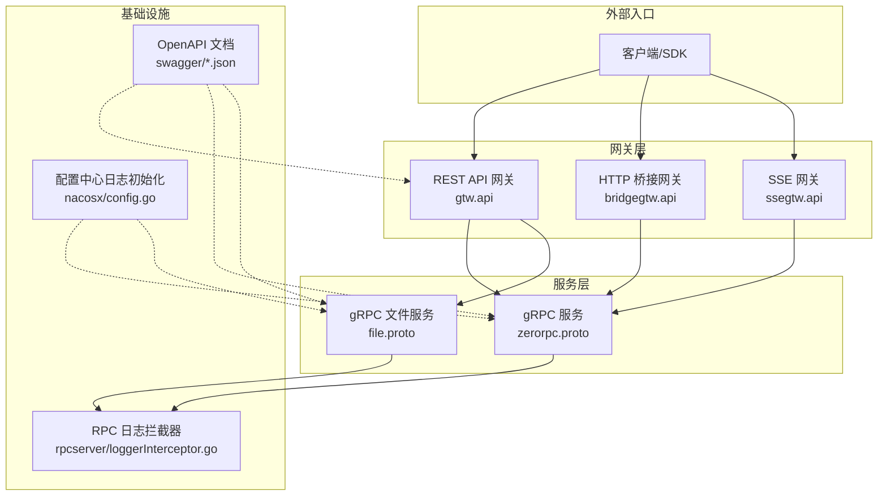
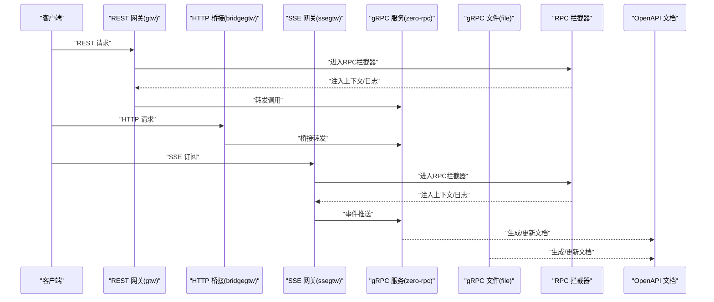
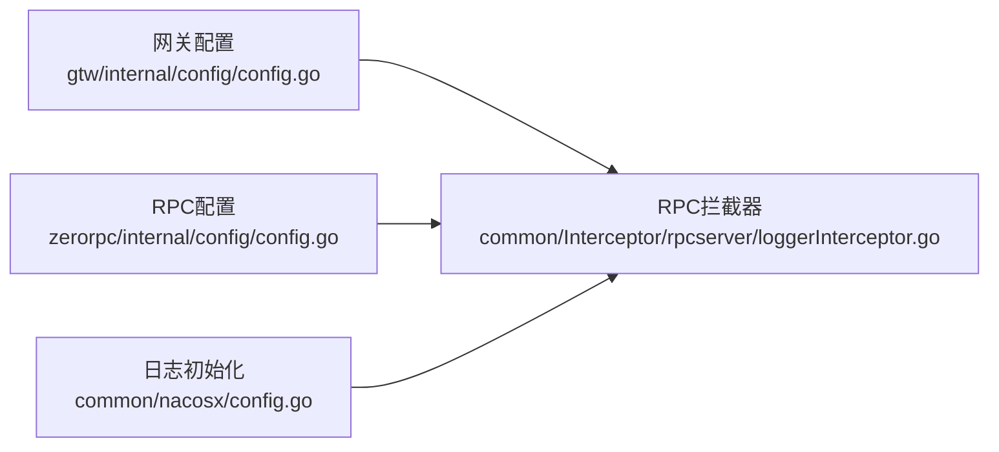

# API设计原则

<cite>
**本文引用的文件**
- [gtw.api](file://gtw/gtw.api)
- [zerorpc.proto](file://zerorpc/zerorpc.proto)
- [ssegtw.api](file://aiapp/ssegtw/ssegtw.api)
- [lalproxy.swagger.json](file://swagger/lalproxy.swagger.json)
- [streamevent.swagger.json](file://swagger/streamevent.swagger.json)
- [file.proto](file://app/file/file.proto)
- [bridgegtw.api](file://app/bridgegtw/bridgegtw.api)
- [config.go](file://common/nacosx/config.go)
- [config.go](file://zerorpc/internal/config/config.go)
- [config.go](file://gtw/internal/config/config.go)
- [edituserinfologic.go](file://zerorpc/internal/logic/edituserinfologic.go)
- [putfilelogic.go](file://app/file/internal/logic/putfilelogic.go)
- [ssestreamhandler.go](file://aiapp/ssegtw/internal/handler/sse/ssestreamhandler.go)
- [loggerInterceptor.go](file://common/Interceptor/rpcserver/loggerInterceptor.go)
</cite>

## 目录
1. [引言](#引言)
2. [项目结构](#项目结构)
3. [核心组件](#核心组件)
4. [架构总览](#架构总览)
5. [详细组件分析](#详细组件分析)
6. [依赖关系分析](#依赖关系分析)
7. [性能考虑](#性能考虑)
8. [故障排查指南](#故障排查指南)
9. [结论](#结论)
10. [附录](#附录)

## 引言
本指南面向Zero-Service的API设计与实现，系统化总结RESTful API、gRPC接口与混合架构的设计原则与最佳实践。结合仓库中的真实接口定义与实现，给出URL设计、HTTP方法选择、参数命名、响应格式、版本管理、安全设计、性能优化、测试方法、文档生成与监控日志等全链路指导。

## 项目结构
本项目采用“多服务+多协议”的分层架构：前端通过REST API网关统一接入，内部以gRPC微服务为主，部分场景引入Server-Sent Events（SSE）进行实时推送；同时提供OpenAPI/Swagger文档与拦截器、配置中心等基础设施支撑。

图表来源
- [gtw.api:16-123](file://gtw/gtw.api#L16-L123)
- [bridgegtw.api:13-23](file://app/bridgegtw/bridgegtw.api#L13-L23)
- [ssegtw.api:14-38](file://aiapp/ssegtw/ssegtw.api#L14-L38)
- [zerorpc.proto:140-167](file://zerorpc/zerorpc.proto#L140-L167)
- [file.proto:270-287](file://app/file/file.proto#L270-L287)
- [loggerInterceptor.go:12-44](file://common/Interceptor/rpcserver/loggerInterceptor.go#L12-L44)
- [config.go:15-37](file://common/nacosx/config.go#L15-L37)
- [lalproxy.swagger.json:1-50](file://swagger/lalproxy.swagger.json#L1-L50)
- [streamevent.swagger.json:1-50](file://swagger/streamevent.swagger.json#L1-L50)

章节来源
- [gtw.api:1-123](file://gtw/gtw.api#L1-L123)
- [bridgegtw.api:1-23](file://app/bridgegtw/bridgegtw.api#L1-L23)
- [ssegtw.api:1-40](file://aiapp/ssegtw/ssegtw.api#L1-L40)
- [zerorpc.proto:1-167](file://zerorpc/zerorpc.proto#L1-L167)
- [file.proto:1-287](file://app/file/file.proto#L1-L287)
- [lalproxy.swagger.json:1-50](file://swagger/lalproxy.swagger.json#L1-L50)
- [streamevent.swagger.json:1-50](file://swagger/streamevent.swagger.json#L1-L50)
- [config.go:1-38](file://common/nacosx/config.go#L1-L38)

## 核心组件
- REST API 网关（gtw.api）
  - 提供统一前缀、分组与鉴权声明，覆盖通用、用户、支付、文件等业务域。
  - 关键点：@server(prefix/group/jwt)、GET/POST路由、请求/响应模型。
- gRPC 服务（zerorpc.proto、file.proto）
  - 使用Protocol Buffers定义消息与服务，支持流式与非流式调用。
  - 关键点：消息字段命名、服务方法语义、流式RPC标注。
- SSE 网关（ssegtw.api）
  - 通过SSE实现事件推送，配合路由扩展启用SSE能力。
- OpenAPI/Swagger 文档
  - 以JSON形式提供基础文档骨架，便于集成工具链生成交互式文档。
- RPC拦截器与配置
  - RPC服务端拦截器注入上下文信息（如用户ID、租户、追踪ID），配置中心日志初始化。

章节来源
- [gtw.api:16-123](file://gtw/gtw.api#L16-L123)
- [zerorpc.proto:140-167](file://zerorpc/zerorpc.proto#L140-L167)
- [file.proto:270-287](file://app/file/file.proto#L270-L287)
- [ssegtw.api:14-38](file://aiapp/ssegtw/ssegtw.api#L14-L38)
- [lalproxy.swagger.json:1-50](file://swagger/lalproxy.swagger.json#L1-L50)
- [streamevent.swagger.json:1-50](file://swagger/streamevent.swagger.json#L1-L50)
- [loggerInterceptor.go:12-44](file://common/Interceptor/rpcserver/loggerInterceptor.go#L12-L44)
- [config.go:15-37](file://common/nacosx/config.go#L15-L37)

## 架构总览
下图展示从客户端到服务端的关键交互路径，以及文档与监控的集成位置。

图表来源
- [gtw.api:16-123](file://gtw/gtw.api#L16-L123)
- [bridgegtw.api:13-23](file://app/bridgegtw/bridgegtw.api#L13-L23)
- [ssegtw.api:14-38](file://aiapp/ssegtw/ssegtw.api#L14-L38)
- [zerorpc.proto:140-167](file://zerorpc/zerorpc.proto#L140-L167)
- [file.proto:270-287](file://app/file/file.proto#L270-L287)
- [loggerInterceptor.go:12-44](file://common/Interceptor/rpcserver/loggerInterceptor.go#L12-L44)
- [lalproxy.swagger.json:1-50](file://swagger/lalproxy.swagger.json#L1-L50)
- [streamevent.swagger.json:1-50](file://swagger/streamevent.swagger.json#L1-L50)

## 详细组件分析

### RESTful 设计（网关层）
- URL 设计
  - 使用前缀区分版本与模块，如 gtw/v1、app/user/v1、app/common/v1、file/v1。
  - 路径采用名词复数与层级清晰表达资源与动作。
- HTTP 方法选择
  - GET：幂等查询（如 /ping、/getCurrentUser）。
  - POST：创建/触发/提交（如 /login、/sendSMSVerifyCode、/forward、/uploadFile）。
- 参数命名与请求体
  - 请求参数遵循驼峰或下划线风格，保持一致性；复杂参数使用结构体封装。
- 响应格式标准化
  - 返回类型明确，统一包装结构（如 PingReply、LoginReply 等）。
- 鉴权与超时
  - @server(jwt) 声明鉴权；@server(timeout) 控制长耗时操作超时。

章节来源
- [gtw.api:16-123](file://gtw/gtw.api#L16-L123)

### gRPC 接口设计（服务层）
- 消息与服务定义
  - 使用 proto3 语法，消息字段有序号，服务方法语义清晰。
  - 流式RPC通过 stream 关键字标注，如 PutChunkFile(stream)、PutStreamFile(stream)。
- 参数与返回
  - 请求/响应消息命名规范，避免歧义；嵌套对象用于复合数据。
- 错误处理
  - gRPC 使用状态码与错误消息，结合拦截器记录异常。

章节来源
- [zerorpc.proto:1-167](file://zerorpc/zerorpc.proto#L1-L167)
- [file.proto:1-287](file://app/file/file.proto#L1-L287)

### 混合API架构（REST + gRPC + SSE）
- 网关统一入口
  - REST 网关负责鉴权、路由与协议转换；gRPC 服务专注内部高吞吐调用。
- SSE 实时场景
  - SSE 网关用于事件推送，适合长连接、低延迟场景。
- HTTP 桥接
  - bridgegtw.api 提供简单HTTP路由，便于快速接入。

章节来源
- [bridgegtw.api:13-23](file://app/bridgegtw/bridgegtw.api#L13-L23)
- [ssegtw.api:14-38](file://aiapp/ssegtw/ssegtw.api#L14-L38)
- [gtw.api:16-123](file://gtw/gtw.api#L16-L123)

### 接口规范制定方法
- URL 设计
  - 使用前缀区分版本与模块；路径层级清晰，避免动词化。
- HTTP 方法
  - GET/POST/PUT/DELETE 明确语义；幂等优先使用 GET/PUT/DELETE。
- 参数命名
  - 统一使用驼峰或下划线风格，避免混用；复杂参数结构化。
- 响应格式
  - 成功/失败统一包装；错误码与消息明确可追踪。

章节来源
- [gtw.api:16-123](file://gtw/gtw.api#L16-L123)
- [zerorpc.proto:1-167](file://zerorpc/zerorpc.proto#L1-L167)
- [file.proto:1-287](file://app/file/file.proto#L1-L287)

### API版本管理策略
- 版本号约定
  - 采用前缀 /v1、/v2 表达版本；不同模块可独立演进。
- 向后兼容性
  - 新增字段保持默认值；不破坏旧字段语义；弃用字段保留但标记废弃。
- 废弃处理流程
  - 先标记废弃，提供迁移指引，设定过渡期，最终移除。

章节来源
- [gtw.api:8-14](file://gtw/gtw.api#L8-L14)
- [bridgegtw.api:13-16](file://app/bridgegtw/bridgegtw.api#L13-L16)
- [ssegtw.api:14-17](file://aiapp/ssegtw/ssegtw.api#L14-L17)

### API文档生成与维护
- Swagger/OpenAPI
  - 以 JSON 形式提供基础文档骨架，便于工具链解析与生成交互式文档。
- 自动化生成
  - 结合项目脚本与工具链，基于 proto 或 API 描述自动生成文档。
- 文档维护
  - 与接口变更同步迭代；确保示例、参数与返回一致。

章节来源
- [lalproxy.swagger.json:1-50](file://swagger/lalproxy.swagger.json#L1-L50)
- [streamevent.swagger.json:1-50](file://swagger/streamevent.swagger.json#L1-L50)

### API安全设计
- 认证授权
  - 网关层通过 JWT 鉴权；服务间调用可通过元数据传递令牌。
- 数据加密
  - 敏感数据在传输与存储中加密；文件服务支持签名URL限时访问。
- 访问控制
  - 基于角色/租户维度的权限校验；限制敏感操作的调用范围。
- 防攻击措施
  - 限流、熔断、黑白名单、输入校验与日志审计。

章节来源
- [gtw.api:69-70](file://gtw/gtw.api#L69-L70)
- [file.proto:164-174](file://app/file/file.proto#L164-L174)
- [loggerInterceptor.go:12-44](file://common/Interceptor/rpcserver/loggerInterceptor.go#L12-L44)

### 性能优化建议
- 缓存策略
  - 对热点查询结果进行缓存；合理设置TTL与失效策略。
- 限流控制
  - 在网关与服务端分别实施限流，防止雪崩。
- 压缩传输
  - 开启gzip/deflate压缩，降低带宽占用。
- 并发处理
  - gRPC 多路复用；SSE 长连接池化；异步任务队列解耦。

章节来源
- [config.go:17-20](file://gtw/internal/config/config.go#L17-L20)
- [config.go:8-24](file://zerorpc/internal/config/config.go#L8-L24)

### API测试方法
- 单元测试
  - 针对逻辑层函数进行隔离测试，模拟依赖与边界条件。
- 集成测试
  - 端到端验证网关到服务的完整链路；覆盖鉴权、流式与错误分支。
- 性能测试
  - 基于压测工具对关键接口施加负载，评估QPS、P95/P99时延与资源占用。

章节来源
- [edituserinfologic.go:27-48](file://zerorpc/internal/logic/edituserinfologic.go#L27-L48)
- [putfilelogic.go:33-77](file://app/file/internal/logic/putfilelogic.go#L33-L77)

### 具体API设计案例
- 用户管理
  - 登录/小程序登录/获取用户信息/编辑用户信息等，均通过 gRPC 提供稳定契约。
- 文件服务
  - 上传/分片上传/流式上传/签名URL/文件统计等，覆盖多种上传场景。
- 实时通信
  - SSE 网关提供事件流与AI对话流，适用于低延迟推送。

章节来源
- [zerorpc.proto:74-113](file://zerorpc/zerorpc.proto#L74-L113)
- [file.proto:176-225](file://app/file/file.proto#L176-L225)
- [ssegtw.api:24-38](file://aiapp/ssegtw/ssegtw.api#L24-L38)

### 监控与日志记录最佳实践
- RPC拦截器
  - 在拦截器中注入用户ID、租户、追踪ID等上下文，并记录错误日志。
- 配置中心日志初始化
  - 统一日志级别与输出，便于集中检索与告警。
- 文档与可观测性
  - OpenAPI 文档作为契约基线，结合链路追踪与指标采集完善监控体系。

章节来源
- [loggerInterceptor.go:12-44](file://common/Interceptor/rpcserver/loggerInterceptor.go#L12-L44)
- [config.go:15-37](file://common/nacosx/config.go#L15-L37)

## 依赖关系分析
- 网关依赖
  - REST 网关依赖 gRPC 客户端配置，统一转发至各业务服务。
- 服务依赖
  - gRPC 服务依赖拦截器、配置中心与数据库/缓存。
- 文档依赖
  - OpenAPI 文档与服务契约保持一致，便于生成与维护。

图表来源
- [config.go:8-20](file://gtw/internal/config/config.go#L8-L20)
- [config.go:8-24](file://zerorpc/internal/config/config.go#L8-L24)
- [config.go:15-37](file://common/nacosx/config.go#L15-L37)
- [loggerInterceptor.go:12-44](file://common/Interceptor/rpcserver/loggerInterceptor.go#L12-L44)

章节来源
- [config.go:1-21](file://gtw/internal/config/config.go#L1-L21)
- [config.go:1-25](file://zerorpc/internal/config/config.go#L1-L25)
- [config.go:1-38](file://common/nacosx/config.go#L1-L38)
- [loggerInterceptor.go:1-45](file://common/Interceptor/rpcserver/loggerInterceptor.go#L1-L45)

## 性能考虑
- 传输层
  - 启用压缩与HTTP/2多路复用；SSE 长连接池化。
- 服务层
  - 合理拆分服务，避免单点瓶颈；对热点接口增加缓存。
- 网关层
  - 在网关实施限流与熔断；对慢依赖设置超时与降级。

## 故障排查指南
- RPC拦截器错误日志
  - 拦截器在发生错误时记录详细上下文，便于定位问题。
- 配置中心日志
  - 统一日志级别与输出目录，便于集中检索。
- 文档一致性
  - 若接口行为与文档不符，优先修正契约或文档，确保一致性。

章节来源
- [loggerInterceptor.go:39-42](file://common/Interceptor/rpcserver/loggerInterceptor.go#L39-L42)
- [config.go:24-37](file://common/nacosx/config.go#L24-L37)

## 结论
本指南基于Zero-Service的真实实现，总结了RESTful、gRPC与SSE的混合架构设计原则与落地实践。通过统一的URL设计、严谨的契约定义、完善的文档与监控体系，以及安全与性能优化策略，可有效提升系统的可维护性与可扩展性。

## 附录
- 示例接口路径参考
  - 用户登录：[gtw.api:52-64](file://gtw/gtw.api#L52-L64)
  - 文件上传：[file.proto:279-281](file://app/file/file.proto#L279-L281)
  - SSE 事件流：[ssegtw.api:24-38](file://aiapp/ssegtw/ssegtw.api#L24-L38)
- Handler与逻辑层
  - 用户信息编辑逻辑：[edituserinfologic.go:27-48](file://zerorpc/internal/logic/edituserinfologic.go#L27-L48)
  - 文件上传逻辑：[putfilelogic.go:33-77](file://app/file/internal/logic/putfilelogic.go#L33-L77)
  - SSE 流处理器：[ssestreamhandler.go:17-32](file://aiapp/ssegtw/internal/handler/sse/ssestreamhandler.go#L17-L32)