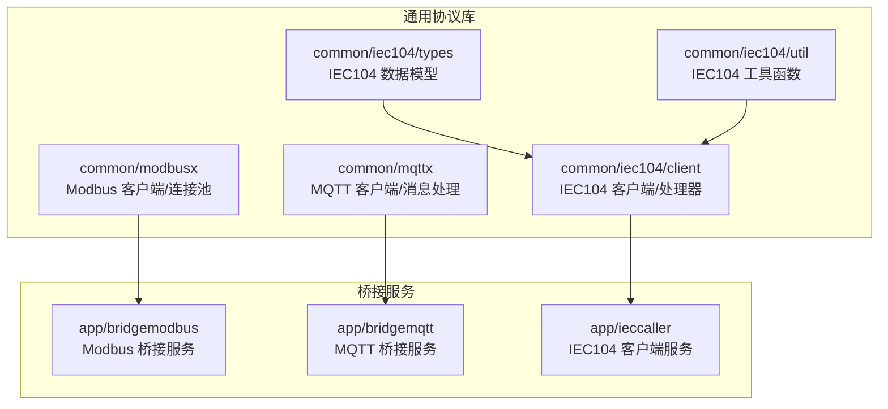
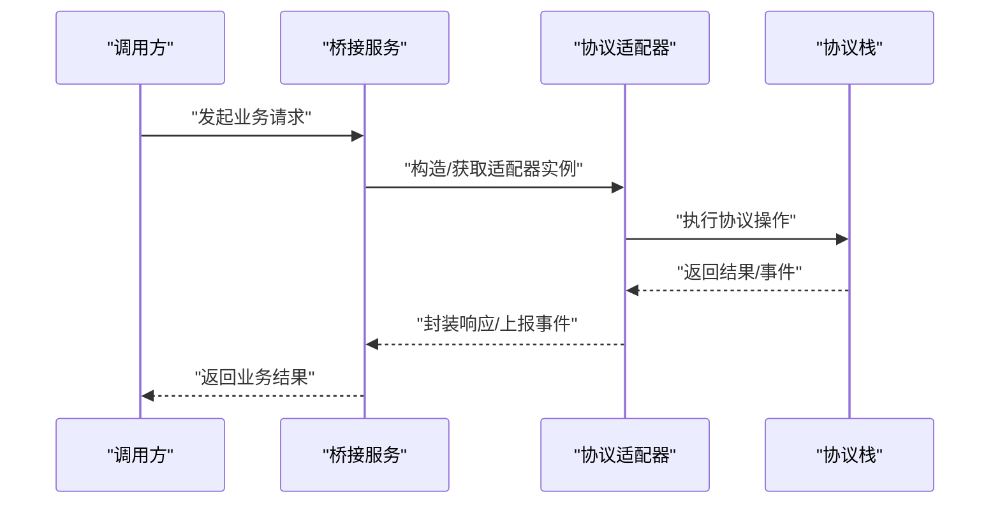
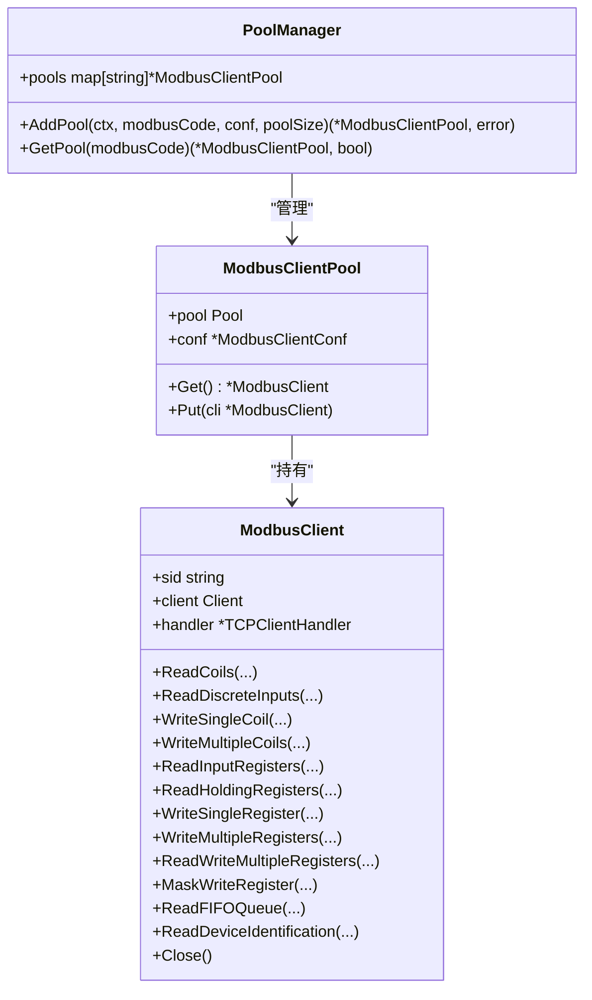
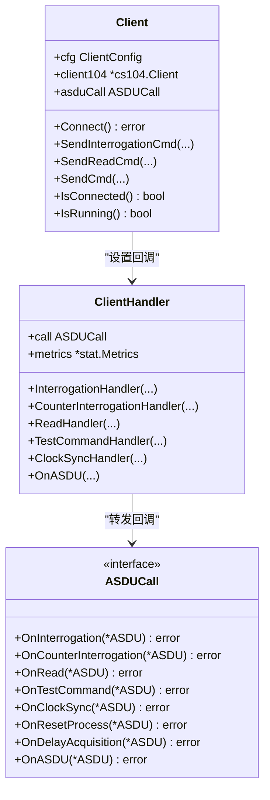
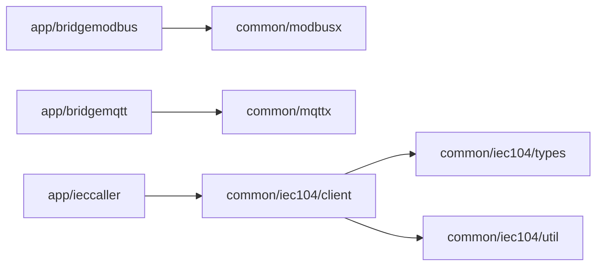

# 协议扩展开发

<cite>
**本文引用的文件**
- [common/modbusx/client.go](file://common/modbusx/client.go)
- [common/modbusx/config.go](file://common/modbusx/config.go)
- [common/mqttx/mqttx.go](file://common/mqttx/mqttx.go)
- [common/mqttx/message.go](file://common/mqttx/message.go)
- [common/iec104/types/types.go](file://common/iec104/types/types.go)
- [common/iec104/client/interface.go](file://common/iec104/client/interface.go)
- [common/iec104/client/core.go](file://common/iec104/client/core.go)
- [common/iec104/client/handle.go](file://common/iec104/client/handle.go)
- [common/iec104/util/util.go](file://common/iec104/util/util.go)
- [app/bridgemodbus/internal/config/config.go](file://app/bridgemodbus/internal/config/config.go)
- [app/bridgemodbus/bridgemodbus.go](file://app/bridgemodbus/bridgemodbus.go)
- [app/bridgemqtt/bridgemqtt.go](file://app/bridgemqtt/bridgemqtt.go)
- [app/ieccaller/ieccaller.go](file://app/ieccaller/ieccaller.go)
</cite>

## 目录
1. [简介](#简介)
2. [项目结构](#项目结构)
3. [核心组件](#核心组件)
4. [架构总览](#架构总览)
5. [详细组件分析](#详细组件分析)
6. [依赖分析](#依赖分析)
7. [性能考虑](#性能考虑)
8. [故障排查指南](#故障排查指南)
9. [结论](#结论)
10. [附录](#附录)

## 简介
本指南面向在 Zero-Service 基础上进行工业通信协议扩展的开发者，系统讲解如何新增 Modbus、IEC104、MQTT 等协议支持。内容涵盖协议适配器设计模式（解析器、数据转换器、通信控制器）、协议抽象层设计原则（统一接口、错误处理、状态管理）、开发流程（协议分析、接口设计、实现编码、测试验证）、协议差异处理（数据格式转换、编码解码、协议映射），并提供性能优化、并发安全与资源管理的最佳实践。

## 项目结构
Zero-Service 采用多模块、多服务的微服务架构，协议扩展以“通用协议库 + 业务桥接服务”的方式组织：
- 通用协议库位于 common/*，封装协议客户端、配置、工具与类型定义
- 业务桥接服务位于 app/*，负责服务编排、配置加载、gRPC 服务注册与生命周期管理
- 通过 go-zero RPC 框架提供统一的服务治理能力（日志、拦截器、注册中心）



**图表来源**
- [common/modbusx/client.go:1-218](file://common/modbusx/client.go#L1-L218)
- [common/modbusx/config.go:1-125](file://common/modbusx/config.go#L1-L125)
- [common/mqttx/mqttx.go:1-389](file://common/mqttx/mqttx.go#L1-L389)
- [common/mqttx/message.go:1-30](file://common/mqttx/message.go#L1-L30)
- [common/iec104/types/types.go:1-323](file://common/iec104/types/types.go#L1-L323)
- [common/iec104/client/core.go:1-446](file://common/iec104/client/core.go#L1-L446)
- [common/iec104/client/handle.go:32-82](file://common/iec104/client/handle.go#L32-L82)
- [common/iec104/util/util.go:1-242](file://common/iec104/util/util.go#L1-L242)
- [app/bridgemodbus/bridgemodbus.go:1-71](file://app/bridgemodbus/bridgemodbus.go#L1-L71)
- [app/bridgemqtt/bridgemqtt.go:1-72](file://app/bridgemqtt/bridgemqtt.go#L1-L72)
- [app/ieccaller/ieccaller.go:1-123](file://app/ieccaller/ieccaller.go#L1-L123)

**章节来源**
- [app/bridgemodbus/bridgemodbus.go:1-71](file://app/bridgemodbus/bridgemodbus.go#L1-L71)
- [app/bridgemqtt/bridgemqtt.go:1-72](file://app/bridgemqtt/bridgemqtt.go#L1-L72)
- [app/ieccaller/ieccaller.go:1-123](file://app/ieccaller/ieccaller.go#L1-L123)

## 核心组件
- Modbus 适配器
  - ModbusClient：封装底层 modbus.Client，提供统一的读写操作与 TLS 支持
  - ModbusClientPool：连接池，支持并发安全与资源回收
  - PoolManager：多连接池管理器，按 modbusCode 维度隔离与复用
- MQTT 适配器
  - Client：封装 paho.mqtt.golang，提供连接、订阅、发布、追踪与指标
  - ConsumeHandler 接口与默认处理器，支持主题到事件的映射
- IEC104 适配器
  - Client：封装 go-iecp5，提供命令发送、连接事件、ASDU 回调
  - ClientHandler：ASDU 回调适配器，将底层回调转为接口调用
  - types：IEC104 报文结构与点映射模型
  - util：质量描述符处理、规一化转换、主题模板生成

**章节来源**
- [common/modbusx/client.go:20-143](file://common/modbusx/client.go#L20-L143)
- [common/modbusx/config.go:32-125](file://common/modbusx/config.go#L32-L125)
- [common/mqttx/mqttx.go:76-178](file://common/mqttx/mqttx.go#L76-L178)
- [common/mqttx/message.go:3-30](file://common/mqttx/message.go#L3-L30)
- [common/iec104/client/interface.go:5-71](file://common/iec104/client/interface.go#L5-L71)
- [common/iec104/client/core.go:48-117](file://common/iec104/client/core.go#L48-L117)
- [common/iec104/client/handle.go:32-82](file://common/iec104/client/handle.go#L32-L82)
- [common/iec104/types/types.go:11-323](file://common/iec104/types/types.go#L11-L323)
- [common/iec104/util/util.go:13-242](file://common/iec104/util/util.go#L13-L242)

## 架构总览
协议扩展遵循“协议抽象层 + 业务桥接层”的分层设计：
- 协议抽象层：提供统一接口、错误处理、状态管理与资源管理
- 业务桥接层：加载配置、注册服务、编排协议客户端、处理业务逻辑



[本图为概念性流程图，不直接映射具体源码文件]

## 详细组件分析

### Modbus 扩展组件
- 设计要点
  - 适配器封装：对底层 modbus.Client 的薄封装，暴露统一读写方法
  - 连接池：基于 syncx.Pool 实现连接复用，带最大空闲时间与自动销毁
  - 配置管理：集中配置 ModbusClientConf，支持 TLS、超时、重连参数
  - 日志与追踪：自定义 ModbusLogger，携带会话标识与地址摘要
- 开发流程
  - 协议分析：确定功能码与数据区段
  - 接口设计：在适配器中新增对应方法签名
  - 实现编码：调用底层库，处理返回值与错误
  - 测试验证：单元测试覆盖典型场景与边界条件
- 差异处理
  - 功能码映射：将业务语义映射到底层功能码
  - 数据格式转换：字节序、寄存器组合、标度化/规一化转换
  - 编码解码：根据设备手册实现打包/解包
- 并发与资源
  - 使用连接池避免频繁建连
  - 合理设置超时与空闲回收，防止资源泄露



**图表来源**
- [common/modbusx/client.go:20-143](file://common/modbusx/client.go#L20-L143)
- [common/modbusx/config.go:63-125](file://common/modbusx/config.go#L63-L125)

**章节来源**
- [common/modbusx/client.go:20-218](file://common/modbusx/client.go#L20-L218)
- [common/modbusx/config.go:32-125](file://common/modbusx/config.go#L32-L125)

### MQTT 扩展组件
- 设计要点
  - 客户端生命周期：连接、自动重连、断线恢复订阅
  - 主题路由：ConsumeHandler 接口与默认处理器，支持通配符与模板
  - 指标与追踪：集成 OpenTelemetry 与统计指标
  - 消息封装：Message 结构支持 payload 与 headers
- 开发流程
  - 协议分析：确认 Broker、QoS、认证方式与主题规范
  - 接口设计：定义 ConsumeHandler 与消息封装结构
  - 实现编码：注册处理器、订阅主题、发布消息
  - 测试验证：模拟断线重连、空 payload、无处理器等边界
- 差异处理
  - 主题映射：EventMapping 将主题映射到事件名
  - 负载封装：Message.Payload 与 headers 字段承载上下文
  - QoS 管理：校验与默认化 QoS 值
- 并发与资源
  - 并发安全：RWMutex 保护处理器与订阅状态
  - 资源回收：关闭连接时清空订阅集合

```mermaid
classDiagram
class Client {
+cfg MqttConfig
+client mqtt.Client
+handlers map[string][]ConsumeHandler
+subscribed map[string]struct{}
+AddHandler(topic, handler) error
+Subscribe(topic) error
+Publish(ctx, topic, payload) error
+Close()
}
class Message {
+Topic string
+Payload []byte
+Headers map[string]string
+GetHeader(key) string
+SetHeader(key, val)
}
class ConsumeHandler {
<<interface>>
+Consume(ctx, payload, topic, topicTemplate) error
}
Client --> ConsumeHandler : "维护处理器列表"
Client --> Message : "封装负载"
```

**图表来源**
- [common/mqttx/mqttx.go:76-178](file://common/mqttx/mqttx.go#L76-L178)
- [common/mqttx/message.go:3-30](file://common/mqttx/message.go#L3-L30)

**章节来源**
- [common/mqttx/mqttx.go:76-389](file://common/mqttx/mqttx.go#L76-L389)
- [common/mqttx/message.go:3-30](file://common/mqttx/message.go#L3-L30)

### IEC104 扩展组件
- 设计要点
  - 客户端：封装 go-iecp5，提供命令发送、连接事件回调、自动重连
  - 回调适配：ClientHandler 将底层 ASDU 回调转为接口调用
  - 数据模型：MsgBody、PointMapping、各类 ASDU 信息体结构
  - 工具函数：质量描述符判断、规一化/浮点互转、主题模板生成
- 开发流程
  - 协议分析：理解 ASDU 类型、信息对象地址、品质描述符
  - 接口设计：实现 ASDUCall 接口，定义业务回调
  - 实现编码：在 ClientHandler 中转发底层回调；在业务侧处理数据
  - 测试验证：模拟连接事件、ASDU 解析、主题生成
- 差异处理
  - ASDU 映射：将 TypeId 映射到具体信息体结构
  - 时间戳与时标：处理带时标与不带时标的 ASDU
  - 主题生成：利用模板变量与 util.GenerateTopic 生成目标主题
- 并发与资源
  - 原子状态：running 标识运行状态
  - 连接事件：连接/断开/服务器主动激活事件驱动



**图表来源**
- [common/iec104/client/core.go:48-117](file://common/iec104/client/core.go#L48-L117)
- [common/iec104/client/handle.go:32-82](file://common/iec104/client/handle.go#L32-L82)
- [common/iec104/client/interface.go:5-71](file://common/iec104/client/interface.go#L5-L71)

**章节来源**
- [common/iec104/client/core.go:19-446](file://common/iec104/client/core.go#L19-L446)
- [common/iec104/client/handle.go:32-82](file://common/iec104/client/handle.go#L32-L82)
- [common/iec104/client/interface.go:5-71](file://common/iec104/client/interface.go#L5-L71)
- [common/iec104/types/types.go:11-323](file://common/iec104/types/types.go#L11-L323)
- [common/iec104/util/util.go:13-242](file://common/iec104/util/util.go#L13-L242)

### 协议抽象层设计原则
- 统一接口定义
  - Modbus：统一读写方法，屏蔽底层功能码差异
  - MQTT：统一订阅/发布/处理器注册接口
  - IEC104：统一命令发送与 ASDU 回调接口
- 错误处理机制
  - 明确错误返回与包装，便于上层识别与降级
  - 断线/超时/协议异常的分类处理与重试策略
- 状态管理
  - 连接状态原子化标记，事件回调驱动状态变更
  - 订阅状态与处理器列表的并发安全保护

**章节来源**
- [common/modbusx/client.go:94-143](file://common/modbusx/client.go#L94-L143)
- [common/mqttx/mqttx.go:148-178](file://common/mqttx/mqttx.go#L148-L178)
- [common/iec104/client/core.go:120-147](file://common/iec104/client/core.go#L120-L147)

### 协议扩展开发流程
- 协议分析
  - 确定报文格式、地址/IOA、功能码/TypeID、时间戳与时标
  - 明确质量描述符与异常标志
- 接口设计
  - 定义适配器接口与配置结构
  - 设计错误类型与状态枚举
- 实现编码
  - 实现协议解析与数据转换
  - 实现通信控制器（连接、订阅、发送）
- 测试验证
  - 单元测试覆盖正常/异常路径
  - 集成测试覆盖断线重连、并发访问

[本节为流程性说明，不直接分析具体文件]

### 协议差异处理
- 数据格式转换
  - Modbus：寄存器/线圈字节序、标度化/规一化转换
  - IEC104：Normalize 与 float32 互转、质量描述符解析
- 编码解码
  - 按设备手册实现打包/解包，确保 IOA 与 CoA 一致
- 协议映射
  - IEC104：TypeId → 信息体结构映射，主题模板变量替换

**章节来源**
- [common/iec104/util/util.go:177-188](file://common/iec104/util/util.go#L177-L188)

### 扩展示例：新增一个工业协议支持
以下以“伪协议”为例，展示扩展示例的步骤与关键点（不包含具体代码内容）：
- 客户端实现
  - 定义配置结构与客户端结构体
  - 实现连接、读写、订阅、发布等方法
  - 提供 MustNewClient 与 NewClient 工厂方法
- 配置管理
  - 在 app/*/internal/config/config.go 中引入协议配置
  - 在 etc/*.yaml 中添加配置项
- 异常处理
  - 明确错误类型与返回值
  - 在桥接服务中捕获并记录错误
- 服务编排
  - 在 main.go 中加载配置、创建服务上下文
  - 注册 gRPC 服务并启动

[本节为示例性说明，不直接分析具体文件]

## 依赖分析
- 模块耦合
  - 通用协议库彼此独立，通过 app/* 桥接
  - 桥接服务依赖通用协议库与 go-zero RPC 框架
- 外部依赖
  - Modbus：github.com/grid-x/modbus
  - MQTT：github.com/eclipse/paho.mqtt.golang
  - IEC104：github.com/wendy512/go-iecp5
- 循环依赖
  - 通过接口与回调避免循环依赖



**图表来源**
- [app/bridgemodbus/bridgemodbus.go:36-44](file://app/bridgemodbus/bridgemodbus.go#L36-L44)
- [app/bridgemqtt/bridgemqtt.go:36-44](file://app/bridgemqtt/bridgemqtt.go#L36-L44)
- [app/ieccaller/ieccaller.go:53-59](file://app/ieccaller/ieccaller.go#L53-L59)

**章节来源**
- [app/bridgemodbus/bridgemodbus.go:36-44](file://app/bridgemodbus/bridgemodbus.go#L36-L44)
- [app/bridgemqtt/bridgemqtt.go:36-44](file://app/bridgemqtt/bridgemqtt.go#L36-L44)
- [app/ieccaller/ieccaller.go:53-59](file://app/ieccaller/ieccaller.go#L53-L59)

## 性能考虑
- 连接复用
  - 使用连接池减少握手开销，合理设置池大小与空闲回收
- 并发安全
  - 对共享状态使用 RWMutex 或原子布尔值
- 超时与背压
  - 为网络操作设置合理超时，避免阻塞
- 指标与追踪
  - 集成统计指标与链路追踪，定位性能瓶颈
- 资源管理
  - 在关闭时释放连接、取消订阅、清理缓存

[本节提供通用指导，不直接分析具体文件]

## 故障排查指南
- Modbus
  - TLS 证书加载失败：检查证书/密钥/CA 文件路径与权限
  - 连接超时/空闲断开：调整 Timeout、IdleTimeout、ConnectDelay
  - 功能码错误：核对设备手册与适配器方法映射
- MQTT
  - 连接失败：检查 Broker 地址、用户名密码、QoS 合法性
  - 订阅失败：确认主题合法性与自动订阅开关
  - 处理器异常：捕获 panic 并记录堆栈
- IEC104
  - 连接事件异常：关注连接/断开/服务器主动激活事件
  - ASDU 解析失败：检查 TypeId 与信息体结构一致性
  - 主题生成错误：检查模板变量与非法字符

**章节来源**
- [common/modbusx/client.go:107-143](file://common/modbusx/client.go#L107-L143)
- [common/mqttx/mqttx.go:148-178](file://common/mqttx/mqttx.go#L148-L178)
- [common/iec104/client/core.go:120-147](file://common/iec104/client/core.go#L120-L147)
- [common/iec104/util/util.go:197-242](file://common/iec104/util/util.go#L197-L242)

## 结论
通过在 Zero-Service 上构建协议抽象层与桥接服务，可以高效地扩展新的工业通信协议。建议遵循统一接口、错误处理与状态管理的原则，结合连接池、并发安全与资源管理的最佳实践，确保协议扩展的稳定性与可维护性。

## 附录
- 配置参考
  - Modbus：在 app/*/internal/config/config.go 中引入 ModbusClientConf，并在 etc/*.yaml 中配置
  - MQTT：在 etc/*.yaml 中配置 Broker、ClientID、QoS、用户名密码、订阅主题与事件映射
  - IEC104：在 etc/*.yaml 中配置 Host、Port、自动重连与元数据

**章节来源**
- [app/bridgemodbus/internal/config/config.go:9-25](file://app/bridgemodbus/internal/config/config.go#L9-L25)
- [common/mqttx/mqttx.go:52-64](file://common/mqttx/mqttx.go#L52-L64)
- [common/iec104/client/core.go:19-37](file://common/iec104/client/core.go#L19-L37)