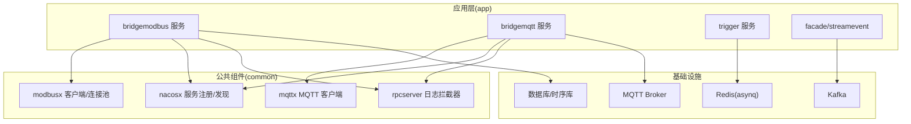
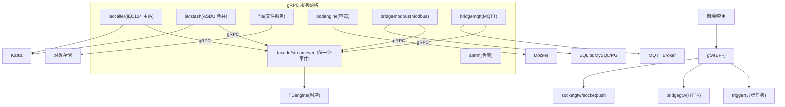
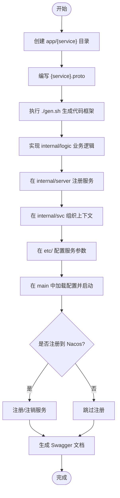
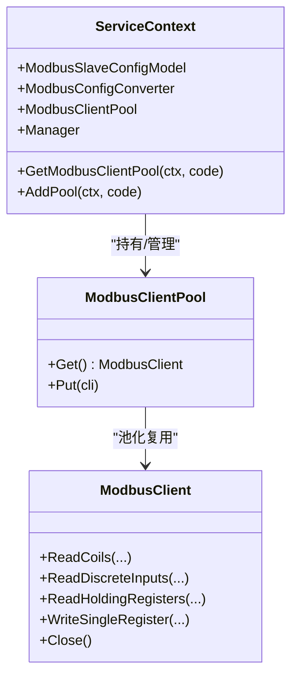
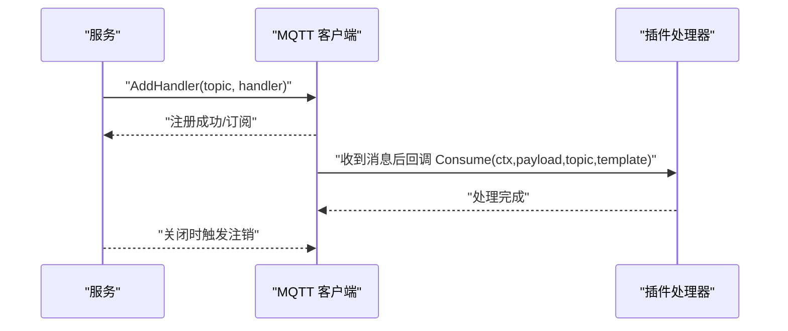
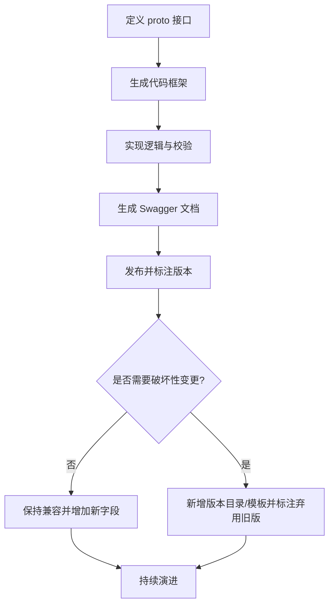
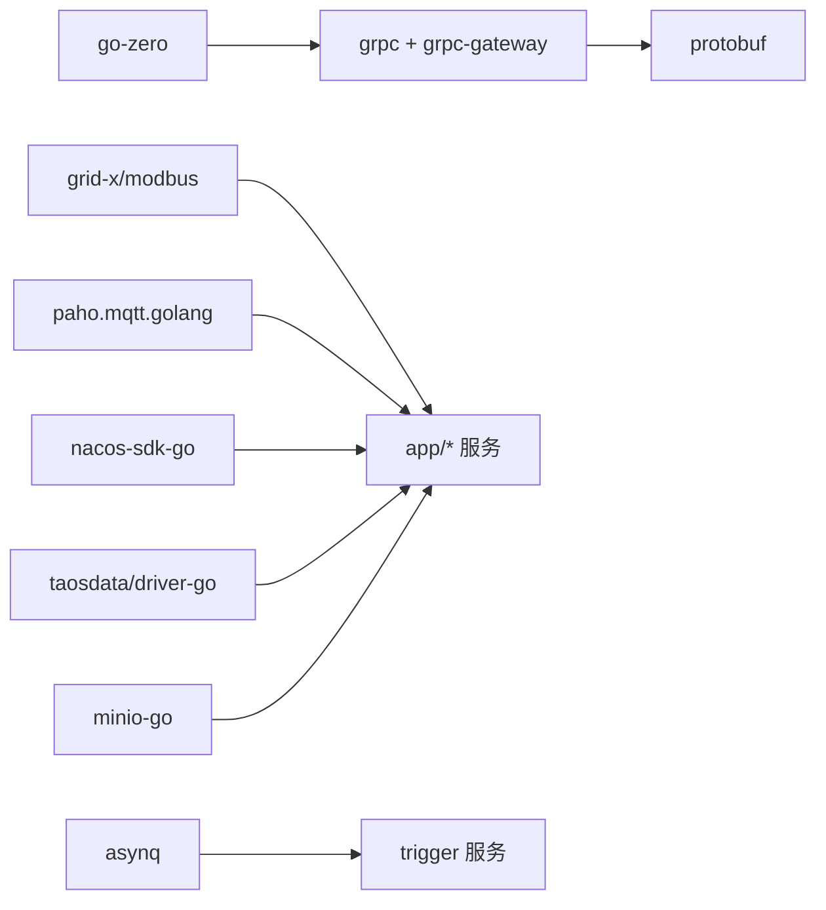

# 扩展开发

<cite>
**本文引用的文件**
- [README.md](file://README.md)
- [go.mod](file://go.mod)
- [code.md](file://code.md)
- [bridgemodbus.go](file://app/bridgemodbus/bridgemodbus.go)
- [config.go](file://app/bridgemodbus/internal/config/config.go)
- [servicecontext.go](file://app/bridgemodbus/internal/svc/servicecontext.go)
- [bridgemodbusserver.go](file://app/bridgemodbus/internal/server/bridgemodbusserver.go)
- [client.go](file://common/modbusx/client.go)
- [mqttx.go](file://common/mqttx/mqttx.go)
- [loggerInterceptor.go](file://common/Interceptor/rpcserver/loggerInterceptor.go)
- [register.go](file://common/nacosx/register.go)
- [config.go](file://app/trigger/internal/config/config.go)
- [extproto.proto](file://third_party/extproto.proto)
</cite>

## 目录
1. [简介](#简介)
2. [项目结构](#项目结构)
3. [核心组件](#核心组件)
4. [架构总览](#架构总览)
5. [详细组件分析](#详细组件分析)
6. [依赖分析](#依赖分析)
7. [性能考量](#性能考量)
8. [故障排查指南](#故障排查指南)
9. [结论](#结论)
10. [附录](#附录)

## 简介
本指南面向希望在 Zero-Service 基础上进行扩展开发的工程师，系统讲解新服务开发流程、协议扩展方法、插件机制、API 设计原则、第三方集成、最佳实践以及贡献流程。项目采用 go-zero 微服务框架，覆盖 IEC 104、Modbus、MQTT、gRPC、HTTP 等工业与物联网协议，提供数采平台、异步任务调度、实时通信、容器管理、地理信息、BFF 网关等能力。

## 项目结构
- app/：核心微服务集合，每个服务以独立子目录组织，包含 proto 定义、配置 etc/、入口 main、内部逻辑 internal/ 等。
- common/：公共组件库，涵盖协议扩展（modbusx、mqttx）、任务队列（asynqx）、服务注册（nacosx）、数据库扩展（dbx）、GIS、Docker、图像处理、拦截器等。
- model/：数据库模型与 SQL 脚本，提供模型生成脚本。
- deploy/：Docker Compose 编排与部署样例。
- docs/swagger/third_party：文档、Swagger API 文档与第三方 Proto 定义。
- facade/：对外统一接口层（如 streamevent）。
- socketapp/：SocketIO 实时通信相关服务。
- gtw/：BFF 网关，聚合 gRPC 并提供 grpc-gateway HTTP 访问。
- util/：工具集与脚本。

**图表来源**
- [bridgemodbus.go:1-71](file://app/bridgemodbus/bridgemodbus.go#L1-L71)
- [client.go:1-218](file://common/modbusx/client.go#L1-L218)
- [mqttx.go:1-389](file://common/mqttx/mqttx.go#L1-L389)
- [loggerInterceptor.go:1-45](file://common/Interceptor/rpcserver/loggerInterceptor.go#L1-L45)
- [register.go:1-99](file://common/nacosx/register.go#L1-L99)

**章节来源**
- [README.md: 59-108:59-108](file://README.md#L59-L108)

## 核心组件
- gRPC 与 grpc-gateway：统一的 RPC 与 HTTP 接口，服务通过 zrpc 启动，开发时以 .proto 定义 API，运行 gen.sh 生成代码框架。
- 协议扩展：common/modbusx、common/mqttx 提供 Modbus/TCP、MQTT 客户端封装与连接池、事件映射、自动重连、可观测性等能力。
- 服务注册与发现：common/nacosx 提供注册/注销、优雅停机、环境 IP 解析等。
- 拦截器：common/Interceptor/rpcserver/loggerInterceptor 提供 RPC 请求上下文注入与错误日志记录。
- 异步任务：基于 asynq 的分布式任务队列，trigger 服务提供回调与计划任务管理。
- 实时通信：socketapp 下的 socketgtw 与 socketpush 提供 SocketIO 网关与推送。
- BFF 网关：gtw 聚合 gRPC 并提供 HTTP 访问，支持 JWT、CORS、文件上传等。

**章节来源**
- [README.md: 110-225:110-225](file://README.md#L110-L225)
- [go.mod: 5-62:5-62](file://go.mod#L5-L62)

## 架构总览
下图展示了 Zero-Service 的整体架构与服务交互关系，突出 gRPC 服务网格、MQTT、Kafka、Redis、数据库与时序库之间的协作。

**图表来源**
- [README.md: 15-51:15-51](file://README.md#L15-L51)
- [README.md: 112-206:112-206](file://README.md#L112-L206)

## 详细组件分析

### 新服务开发流程（从零到一）
- 创建服务目录与 proto 定义：在 app/{service} 下新建服务目录，编写 {service}.proto。
- 生成代码框架：进入服务目录执行 ./gen.sh，生成 handler/logic/server/svc/types 等骨架。
- 实现业务逻辑：在 internal/logic 中实现具体业务；在 internal/server 注册服务；在 internal/svc 组织上下文与依赖。
- 配置与启动：在 etc/ 下准备配置文件；在入口 main 中加载配置、注册拦截器、启动服务；可选注册到 Nacos。
- Swagger 文档：生成 swagger/{service}.swagger.json 用于 API 文档与联调。

**章节来源**
- [README.md: 262-287:262-287](file://README.md#L262-L287)

### 协议扩展：Modbus 与 MQTT
- Modbus 扩展（bridgemodbus）：通过 common/modbusx 提供客户端封装、连接池、日志与 TLS 支持；服务通过 ServiceContext 管理默认与按设备码动态创建的连接池。
- MQTT 扩展（bridgemqtt）：通过 common/mqttx 提供客户端封装、自动重连、订阅恢复、事件映射、OpenTelemetry 追踪与指标统计。

**图表来源**
- [client.go:20-218](file://common/modbusx/client.go#L20-L218)
- [servicecontext.go:14-81](file://app/bridgemodbus/internal/svc/servicecontext.go#L14-L81)

**章节来源**
- [client.go: 106-178:106-178](file://common/modbusx/client.go#L106-L178)
- [servicecontext.go: 22-81:22-81](file://app/bridgemodbus/internal/svc/servicecontext.go#L22-L81)

### 插件开发机制与动态加载
- 插件接口设计：建议以接口抽象（如 ConsumeHandler）定义插件契约，便于替换与扩展。
- 动态加载：可在服务启动阶段根据配置动态注册处理器（如 AddHandler），实现按需启用。
- 生命周期管理：利用进程关闭钩子（AddShutdownListener）与服务注册/注销（Nacos）实现优雅启停。

**图表来源**
- [mqttx.go: 180-307:180-307](file://common/mqttx/mqttx.go#L180-L307)
- [register.go: 21-76:21-76](file://common/nacosx/register.go#L21-L76)

**章节来源**
- [mqttx.go: 33-43:33-43](file://common/mqttx/mqttx.go#L33-L43)
- [register.go: 21-76:21-76](file://common/nacosx/register.go#L21-L76)

### API 设计原则与版本管理
- 接口规范：以 .proto 定义服务与消息，统一字段命名与枚举，避免破坏性变更。
- 版本管理：通过目录版本（如 1.7.1、1.9.x）与模板分组管理不同版本的模型生成模板，确保向前兼容。
- 向后兼容：遵循 google.rpc.Code 错误码映射，HTTP 与 gRPC 错误码一致，便于客户端处理。
- 性能考虑：gRPC 优先，必要时使用 grpc-gateway 提供 HTTP 访问；对高频接口采用连接池与批量处理。

**章节来源**
- [README.md: 288-298:288-298](file://README.md#L288-L298)
- [code.md: 1-66:1-66](file://code.md#L1-L66)

### 第三方集成方法
- 外部系统对接：通过 gRPC 与 grpc-gateway 提供统一入口；对于非 gRPC 系统，可通过 BFF 网关或 facade/streamevent 提供适配。
- 数据格式转换：在 common 中提供工具模块（如 bytex、copierx、tool），在 logic 层进行结构转换与校验。
- 同步策略：结合 asynq 任务队列与 Kafka 消息总线，实现最终一致性与幂等处理。

**章节来源**
- [README.md: 189-206:189-206](file://README.md#L189-L206)
- [go.mod: 17-47:17-47](file://go.mod#L17-L47)

### 基于现有组件开发新功能模块
- 以 bridgemodbus 为例：在 app/ 下创建新服务，参考其目录结构与启动流程；在 common 中复用 modbusx/mqttx 等组件；通过 ServiceContext 组织依赖与连接池；在 main 中注册拦截器与 Nacos。
- 业务应用：在 internal/logic 中实现具体业务；在 internal/handler/routes.go（如适用）中暴露 HTTP 路由；在 etc/ 下维护配置；通过 ./gen.sh 生成代码骨架。

**章节来源**
- [bridgemodbus.go: 27-70:27-70](file://app/bridgemodbus/bridgemodbus.go#L27-L70)
- [config.go:9-25](file://app/bridgemodbus/internal/config/config.go#L9-L25)
- [bridgemodbusserver.go: 26-151:26-151](file://app/bridgemodbus/internal/server/bridgemodbusserver.go#L26-L151)

## 依赖分析
- 框架与 RPC：go-zero、grpc、grpc-gateway、protobuf。
- 协议与中间件：paho.mqtt.golang、grid-x/modbus、kafka-go、asynq、nacos-sdk-go。
- 数据库与时序：mysql/postgres/sqlite、tdengine、minio。
- 观测性：OpenTelemetry、Prometheus、zap。

**图表来源**
- [go.mod: 5-62:5-62](file://go.mod#L5-L62)

**章节来源**
- [go.mod: 5-62:5-62](file://go.mod#L5-L62)

## 性能考量
- 连接池与复用：Modbus/TCP 使用连接池减少握手开销；MQTT 客户端自动重连与订阅恢复降低断链影响。
- 批量处理：Kafka 消费与 gRPC 推送采用批量策略，提升吞吐。
- 超时与重试：合理设置超时与重试策略，避免雪崩；对高频接口进行限流与熔断。
- 监控与追踪：开启 OpenTelemetry 与指标统计，定位瓶颈。

[本节为通用指导，无需特定文件引用]

## 故障排查指南
- gRPC 错误码映射：参考 google.rpc.Code，确保 HTTP 与 gRPC 错误一致，便于客户端统一处理。
- RPC 日志拦截：通过 rpcserver 日志拦截器注入用户信息与 TraceId，便于问题定位。
- 服务注册/注销：确认 Nacos 注册参数与环境变量，关注优雅停机时的注销日志。
- Modbus 连接问题：检查连接池大小、超时配置、TLS 证书与 CA；查看自定义日志输出。

**章节来源**
- [code.md: 1-66:1-66](file://code.md#L1-L66)
- [loggerInterceptor.go: 12-44:12-44](file://common/Interceptor/rpcserver/loggerInterceptor.go#L12-L44)
- [register.go: 21-76:21-76](file://common/nacosx/register.go#L21-L76)
- [client.go: 106-143:106-143](file://common/modbusx/client.go#L106-L143)

## 结论
通过统一的 go-zero 框架、完善的公共组件与清晰的服务边界，Zero-Service 为工业与物联网场景提供了可扩展的微服务基座。开发者可按本文流程快速新增服务、扩展协议、集成第三方系统，并遵循 API 设计与版本管理原则，确保系统的稳定性与演进能力。

[本节为总结，无需特定文件引用]

## 附录

### 新增服务步骤（摘要）
- 在 app/ 下创建服务目录。
- 编写 .proto 定义服务接口。
- 执行 ./gen.sh 生成代码框架。
- 在 internal/logic 实现业务逻辑。
- 在 etc/ 创建配置文件。
- 在入口 main 启动服务，可选注册到 Nacos。
- 生成 Swagger 文档并发布。

**章节来源**
- [README.md: 262-287:262-287](file://README.md#L262-L287)

### 协议适配器开发要点
- 抽象协议客户端：封装连接、超时、TLS、日志与可观测性。
- 连接池管理：按设备码动态创建与复用连接池，避免频繁握手。
- 事件映射与路由：支持主题到事件的映射与默认事件处理。
- 优雅启停：自动重连、订阅恢复、进程关闭时清理资源。

**章节来源**
- [client.go: 145-191:145-191](file://common/modbusx/client.go#L145-L191)
- [mqttx.go: 180-307:180-307](file://common/mqttx/mqttx.go#L180-L307)

### 插件接口设计与生命周期
- 接口契约：以接口抽象（如 ConsumeHandler）定义插件行为。
- 动态注册：根据配置在运行时注册处理器。
- 生命周期：利用进程关闭钩子与服务注册/注销实现优雅启停。

**章节来源**
- [mqttx.go: 33-43:33-43](file://common/mqttx/mqttx.go#L33-L43)
- [register.go: 21-76:21-76](file://common/nacosx/register.go#L21-L76)

### API 设计与版本管理
- 以 .proto 为中心定义接口，生成代码与 Swagger 文档。
- 版本化模板与目录，避免破坏性变更。
- 统一错误码映射，保障前后端一致体验。

**章节来源**
- [README.md: 288-298:288-298](file://README.md#L288-L298)
- [code.md: 1-66:1-66](file://code.md#L1-L66)

### 第三方集成与同步策略
- 通过 gRPC/HTTP 提供统一入口，配合 BFF 网关与 facade/streamevent。
- 使用 asynq 与 Kafka 实现最终一致性与幂等处理。
- 在 logic 层进行数据格式转换与校验。

**章节来源**
- [README.md: 189-206:189-206](file://README.md#L189-L206)
- [go.mod: 17-47:17-47](file://go.mod#L17-L47)

### 最佳实践
- 代码质量：统一错误码、日志与拦截器；按层组织代码（handler/logic/server/svc/types）。
- 测试策略：单元测试覆盖关键逻辑，集成测试覆盖协议适配与消息流。
- 文档编写：维护 README、Swagger 文档与变更说明。
- 版本控制：遵循语义化版本与变更日志，避免破坏性变更。

[本节为通用指导，无需特定文件引用]

### 贡献流程
- 提交规范：遵循仓库内的提交信息风格与变更日志格式。
- Pull Request 审查：在 PR 中说明变更内容、影响范围与测试情况。
- 发布流程：通过 CI/CD 进行构建与部署，必要时更新 Swagger 与文档。

[本节为通用指导，无需特定文件引用]