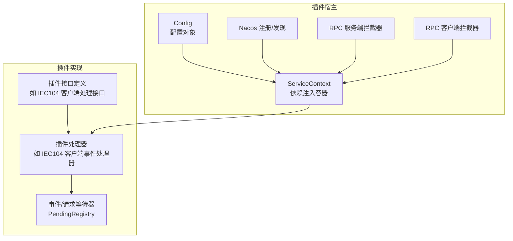
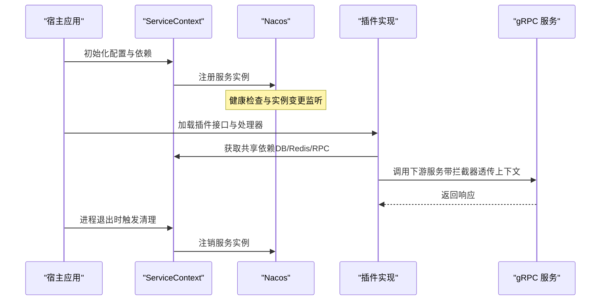
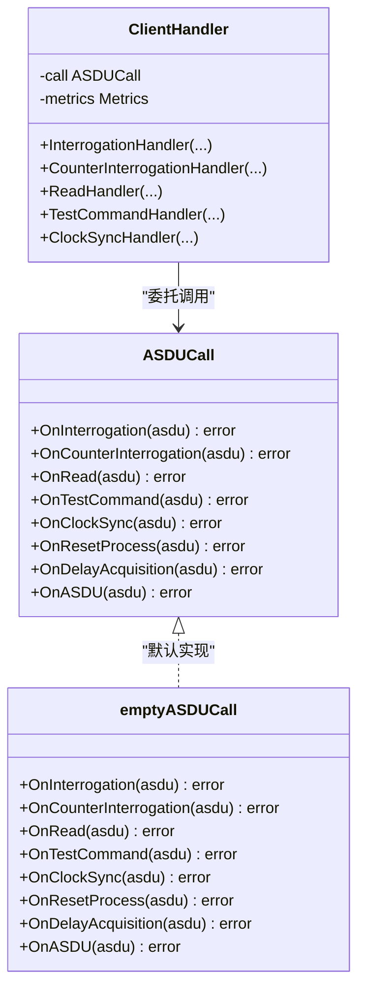
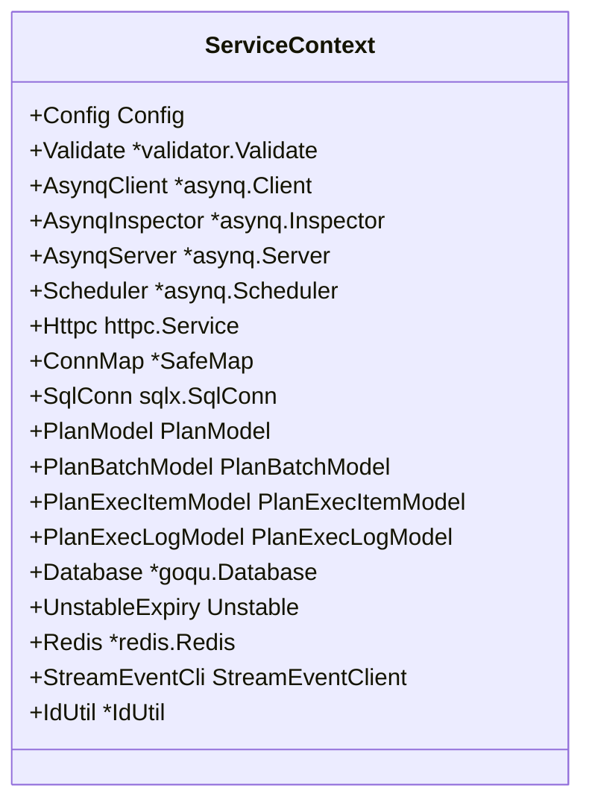
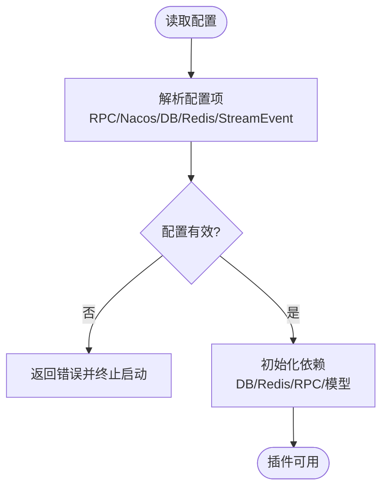
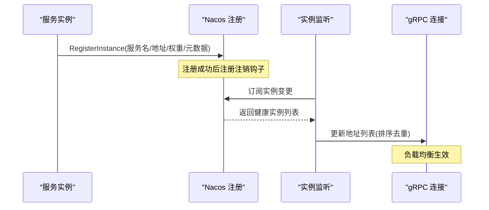
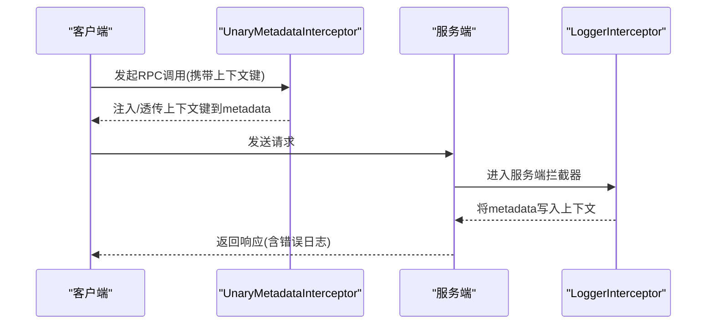
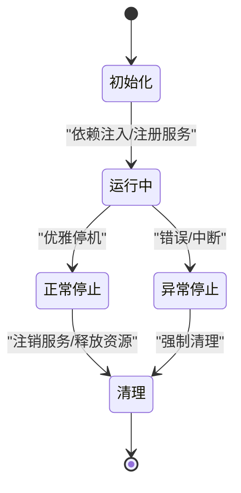
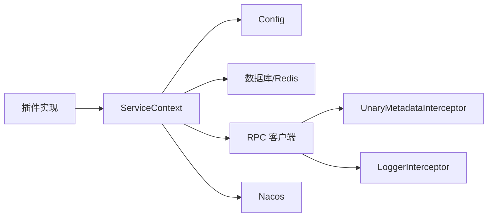

# 插件开发

<cite>
**本文引用的文件**   
- [README.md](file://README.md)
- [go.mod](file://go.mod)
- [loggerInterceptor.go](file://common/Interceptor/rpcserver/loggerInterceptor.go)
- [metadataInterceptor.go](file://common/Interceptor/rpcclient/metadataInterceptor.go)
- [ctxData.go](file://common/ctxdata/ctxData.go)
- [register.go](file://common/nacosx/register.go)
- [resolver.go](file://common/nacosx/resolver.go)
- [servicecontext.go](file://app/trigger/internal/svc/servicecontext.go)
- [config.go](file://app/trigger/internal/config/config.go)
- [interface.go](file://common/iec104/client/interface.go)
- [handle.go](file://common/iec104/client/handle.go)
- [pending.go](file://common/antsx/pending.go)
- [pending_test.go](file://common/antsx/pending_test.go)
- [rest-api-patterns.md](file://.trae/skills/zero-skills/references/rest-api-patterns.md)
</cite>

## 目录
1. [简介](#简介)
2. [项目结构](#项目结构)
3. [核心组件](#核心组件)
4. [架构总览](#架构总览)
5. [组件详解](#组件详解)
6. [依赖关系分析](#依赖关系分析)
7. [性能考量](#性能考量)
8. [故障排查指南](#故障排查指南)
9. [结论](#结论)
10. [附录](#附录)

## 简介
本技术文档面向Zero-Service的插件开发者，系统阐述插件系统的架构设计与开发方法，涵盖插件接口定义、动态加载机制与生命周期管理；解释插件开发的核心概念，包括插件注册、依赖注入、配置管理与事件处理；说明插件与主系统的集成方式，包括服务发现、通信协议与数据交换；给出最佳实践、调试技巧、性能监控与安全考虑，并提供可落地的插件开发示例与测试验证路径。

## 项目结构
Zero-Service采用go-zero微服务框架，围绕gRPC/HTTP聚合、消息队列、任务调度、协议适配与实时通信等能力构建。插件开发应遵循以下组织方式：
- 插件接口定义：在公共模块中抽象插件能力，例如协议适配接口、事件处理接口等
- 插件注册与发现：通过Nacos进行服务注册与解析，实现插件的动态发现与负载均衡
- 依赖注入：在ServiceContext中集中初始化插件所需的共享资源（数据库、缓存、RPC客户端等）
- 生命周期管理：在插件启动时完成初始化，在进程退出时完成清理
- 通信协议：统一使用gRPC，配合拦截器传递上下文与追踪信息
- 配置管理：通过配置文件与环境变量驱动插件行为

**图表来源**
- [servicecontext.go:29-89](file://app/trigger/internal/svc/servicecontext.go#L29-L89)
- [config.go:9-27](file://app/trigger/internal/config/config.go#L9-L27)
- [register.go:21-76](file://common/nacosx/register.go#L21-L76)
- [loggerInterceptor.go:12-44](file://common/Interceptor/rpcserver/loggerInterceptor.go#L12-L44)
- [metadataInterceptor.go:11-32](file://common/Interceptor/rpcclient/metadataInterceptor.go#L11-L32)
- [interface.go:5-23](file://common/iec104/client/interface.go#L5-L23)
- [handle.go:34-82](file://common/iec104/client/handle.go#L34-L82)
- [pending.go:169-183](file://common/antsx/pending.go#L169-L183)

**章节来源**
- [README.md:1-350](file://README.md#L1-L350)
- [go.mod:1-245](file://go.mod#L1-L245)

## 核心组件
- 服务上下文（ServiceContext）：集中管理数据库、缓存、RPC客户端、任务队列、模型与工具实例，作为插件依赖注入的根容器
- 配置（Config）：承载RPC服务端、注册中心、数据库、Redis、流事件客户端等配置
- 拦截器（LoggerInterceptor、UnaryMetadataInterceptor）：在gRPC请求链路中注入与透传上下文信息（用户ID、授权、追踪ID等）
- 服务注册与发现（Nacos）：服务注册、注销与实例变更监听，支持健康检查与负载均衡
- 插件接口与处理器：以协议适配为例，定义插件接口与事件处理器，结合等待器实现请求-响应配对
- 请求等待器（PendingRegistry）：为请求分配唯一ID并等待响应，支持超时与清理

**章节来源**
- [servicecontext.go:29-89](file://app/trigger/internal/svc/servicecontext.go#L29-L89)
- [config.go:9-27](file://app/trigger/internal/config/config.go#L9-L27)
- [loggerInterceptor.go:12-44](file://common/Interceptor/rpcserver/loggerInterceptor.go#L12-L44)
- [metadataInterceptor.go:11-32](file://common/Interceptor/rpcclient/metadataInterceptor.go#L11-L32)
- [register.go:21-76](file://common/nacosx/register.go#L21-L76)
- [resolver.go:38-65](file://common/nacosx/resolver.go#L38-L65)
- [interface.go:5-23](file://common/iec104/client/interface.go#L5-L23)
- [handle.go:34-82](file://common/iec104/client/handle.go#L34-L82)
- [pending.go:169-183](file://common/antsx/pending.go#L169-L183)

## 架构总览
插件系统围绕“接口抽象—注册发现—依赖注入—生命周期管理—通信协议”展开，形成松耦合、可扩展的插件生态。

**图表来源**
- [servicecontext.go:50-89](file://app/trigger/internal/svc/servicecontext.go#L50-L89)
- [register.go:21-76](file://common/nacosx/register.go#L21-L76)
- [resolver.go:38-65](file://common/nacosx/resolver.go#L38-L65)
- [loggerInterceptor.go:12-44](file://common/Interceptor/rpcserver/loggerInterceptor.go#L12-L44)
- [metadataInterceptor.go:11-32](file://common/Interceptor/rpcclient/metadataInterceptor.go#L11-L32)

## 组件详解

### 插件接口定义与事件处理
- 插件接口：以IEC104客户端为例，定义ASDUCall接口，提供多种ASDU事件回调方法，便于插件按需实现
- 事件处理器：ClientHandler封装各类ASDU事件处理，统一记录耗时指标，调用插件接口实现
- 默认空实现：避免空指针，允许插件仅覆盖所需回调

**图表来源**
- [interface.go:5-55](file://common/iec104/client/interface.go#L5-L55)
- [handle.go:34-82](file://common/iec104/client/handle.go#L34-L82)

**章节来源**
- [interface.go:5-55](file://common/iec104/client/interface.go#L5-L55)
- [handle.go:34-82](file://common/iec104/client/handle.go#L34-L82)

### 依赖注入与服务上下文
- ServiceContext集中管理所有共享资源：数据库连接、SQL查询构建器、Redis、任务队列客户端、模型、HTTP客户端、流事件RPC客户端等
- 通过NewServiceContext按配置初始化，确保插件在运行时可直接获取所需依赖
- 可扩展：新增插件只需在ServiceContext中添加对应字段并在初始化时赋值

**图表来源**
- [servicecontext.go:29-48](file://app/trigger/internal/svc/servicecontext.go#L29-L48)

**章节来源**
- [servicecontext.go:29-89](file://app/trigger/internal/svc/servicecontext.go#L29-L89)

### 配置管理
- Config定义了RPC服务端配置、Nacos注册配置、数据库连接串、RedisDB索引、禁用SQL语句日志、优雅停机时长以及流事件RPC客户端配置
- 插件通过Config读取注册中心与下游服务地址，实现动态配置驱动

**图表来源**
- [config.go:9-27](file://app/trigger/internal/config/config.go#L9-L27)

**章节来源**
- [config.go:9-27](file://app/trigger/internal/config/config.go#L9-L27)

### 服务注册与发现
- 注册：服务启动时向Nacos注册实例，包含权重、健康状态、集群与分组信息，并在进程退出时自动注销
- 解析：监听实例变更，提取健康gRPC实例，排序后更新连接池，保证负载均衡与高可用

**图表来源**
- [register.go:21-76](file://common/nacosx/register.go#L21-L76)
- [resolver.go:38-65](file://common/nacosx/resolver.go#L38-L65)

**章节来源**
- [register.go:21-76](file://common/nacosx/register.go#L21-L76)
- [resolver.go:38-65](file://common/nacosx/resolver.go#L38-L65)

### 通信协议与上下文传递
- gRPC拦截器：服务端拦截器从metadata读取用户ID、用户名、部门编码、授权与追踪ID，写入上下文；客户端拦截器将上下文中的这些键回传至下游
- 上下文键：统一定义在ctxData中，确保跨服务一致传递

**图表来源**
- [metadataInterceptor.go:11-32](file://common/Interceptor/rpcclient/metadataInterceptor.go#L11-L32)
- [loggerInterceptor.go:12-44](file://common/Interceptor/rpcserver/loggerInterceptor.go#L12-L44)
- [ctxData.go:9-24](file://common/ctxdata/ctxData.go#L9-L24)

**章节来源**
- [metadataInterceptor.go:11-32](file://common/Interceptor/rpcclient/metadataInterceptor.go#L11-L32)
- [loggerInterceptor.go:12-44](file://common/Interceptor/rpcserver/loggerInterceptor.go#L12-L44)
- [ctxData.go:9-24](file://common/ctxdata/ctxData.go#L9-L24)

### 生命周期管理
- 初始化：在ServiceContext中完成依赖初始化；插件在启动阶段注册自身接口与处理器
- 运行时：通过拦截器与上下文保持一致性；通过PendingRegistry实现请求-响应配对与超时控制
- 卸载清理：利用进程关闭钩子触发Nacos注销与资源释放

**图表来源**
- [servicecontext.go:50-89](file://app/trigger/internal/svc/servicecontext.go#L50-L89)
- [register.go:59-73](file://common/nacosx/register.go#L59-L73)
- [pending.go:169-183](file://common/antsx/pending.go#L169-L183)

**章节来源**
- [servicecontext.go:50-89](file://app/trigger/internal/svc/servicecontext.go#L50-L89)
- [register.go:59-73](file://common/nacosx/register.go#L59-L73)
- [pending.go:169-183](file://common/antsx/pending.go#L169-L183)

### 插件开发最佳实践
- 接口设计原则：以最小职责接口为核心，提供默认空实现，避免强耦合
- 依赖注入：集中在ServiceContext中初始化，插件只读取不重复初始化
- 配置管理：通过Config统一读取，支持环境变量与配置文件
- 事件处理：使用PendingRegistry实现请求-响应配对，支持超时与清理
- 错误处理：在服务端拦截器中统一记录错误日志，便于追踪
- 性能优化：统一指标埋点（如ASDU事件耗时），避免阻塞操作，合理使用连接池与缓存

**章节来源**
- [interface.go:5-55](file://common/iec104/client/interface.go#L5-L55)
- [handle.go:34-82](file://common/iec104/client/handle.go#L34-L82)
- [pending.go:169-183](file://common/antsx/pending.go#L169-L183)
- [loggerInterceptor.go:12-44](file://common/Interceptor/rpcserver/loggerInterceptor.go#L12-L44)
- [rest-api-patterns.md:382-419](file://.trae/skills/zero-skills/references/rest-api-patterns.md#L382-L419)

## 依赖关系分析
- 插件实现依赖ServiceContext提供的共享资源
- ServiceContext依赖配置与外部中间件（数据库、Redis、RPC客户端）
- Nacos提供服务注册与解析，支撑插件的动态发现与负载均衡
- 拦截器贯穿gRPC全链路，保障上下文与追踪的一致性

**图表来源**
- [servicecontext.go:29-89](file://app/trigger/internal/svc/servicecontext.go#L29-L89)
- [config.go:9-27](file://app/trigger/internal/config/config.go#L9-L27)
- [register.go:21-76](file://common/nacosx/register.go#L21-L76)
- [metadataInterceptor.go:11-32](file://common/Interceptor/rpcclient/metadataInterceptor.go#L11-L32)
- [loggerInterceptor.go:12-44](file://common/Interceptor/rpcserver/loggerInterceptor.go#L12-L44)

**章节来源**
- [servicecontext.go:29-89](file://app/trigger/internal/svc/servicecontext.go#L29-L89)
- [config.go:9-27](file://app/trigger/internal/config/config.go#L9-L27)
- [register.go:21-76](file://common/nacosx/register.go#L21-L76)
- [metadataInterceptor.go:11-32](file://common/Interceptor/rpcclient/metadataInterceptor.go#L11-L32)
- [loggerInterceptor.go:12-44](file://common/Interceptor/rpcserver/loggerInterceptor.go#L12-L44)

## 性能考量
- 指标埋点：在事件处理器中记录耗时，便于定位慢调用
- 连接池与缓存：统一在ServiceContext中初始化，减少插件重复创建
- 超时控制：PendingRegistry支持默认TTL与覆盖TTL，避免悬挂请求
- gRPC配置：设置最大消息大小与拦截器，提升吞吐与稳定性

**章节来源**
- [handle.go:34-82](file://common/iec104/client/handle.go#L34-L82)
- [pending.go:169-183](file://common/antsx/pending.go#L169-L183)
- [servicecontext.go:79-87](file://app/trigger/internal/svc/servicecontext.go#L79-L87)

## 故障排查指南
- 错误日志：服务端拦截器统一记录错误，便于快速定位
- 超时问题：检查PendingRegistry的默认TTL与覆盖TTL，确认sendFn是否成功发送
- 注册异常：确认Nacos注册参数（服务名、集群、分组、权重、健康状态）
- 上下文缺失：检查客户端拦截器是否正确注入上下文键，服务端拦截器是否正确读取

**章节来源**
- [loggerInterceptor.go:40-42](file://common/Interceptor/rpcserver/loggerInterceptor.go#L40-L42)
- [pending_test.go:314-342](file://common/antsx/pending_test.go#L314-L342)
- [register.go:40-73](file://common/nacosx/register.go#L40-L73)
- [metadataInterceptor.go:11-32](file://common/Interceptor/rpcclient/metadataInterceptor.go#L11-L32)

## 结论
Zero-Service的插件体系以go-zero为基础，通过清晰的接口抽象、完善的依赖注入、统一的通信协议与服务发现机制，实现了插件的可插拔与可扩展。遵循本文的最佳实践与流程，开发者可快速构建稳定、可观测、易维护的插件。

## 附录

### 插件开发完整示例（步骤说明）
- 定义插件接口：参考ASDUCall接口，按需声明回调方法
- 实现插件处理器：参考ClientHandler，封装事件处理并记录耗时
- 注册与注入：在ServiceContext中添加插件所需依赖，并在初始化时完成注册
- 配置与启动：通过Config读取Nacos与下游服务配置，启动服务并注册到Nacos
- 事件等待：使用PendingRegistry实现请求-响应配对，设置合理TTL
- 测试验证：编写单元测试，验证超时、覆盖TTL与错误路径

**章节来源**
- [interface.go:5-55](file://common/iec104/client/interface.go#L5-L55)
- [handle.go:34-82](file://common/iec104/client/handle.go#L34-L82)
- [servicecontext.go:50-89](file://app/trigger/internal/svc/servicecontext.go#L50-L89)
- [config.go:9-27](file://app/trigger/internal/config/config.go#L9-L27)
- [register.go:21-76](file://common/nacosx/register.go#L21-L76)
- [pending.go:169-183](file://common/antsx/pending.go#L169-L183)
- [pending_test.go:314-342](file://common/antsx/pending_test.go#L314-L342)