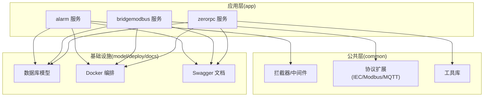
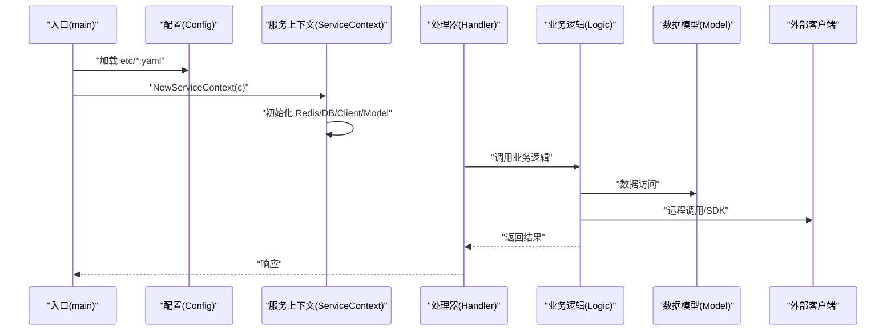
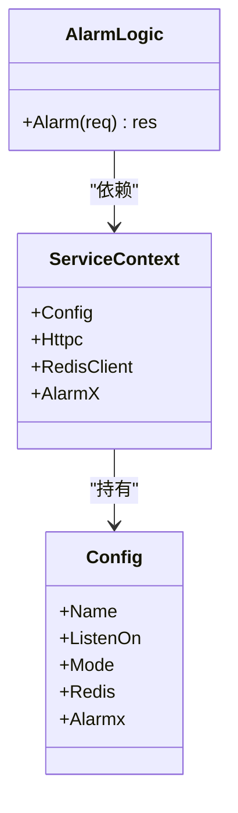
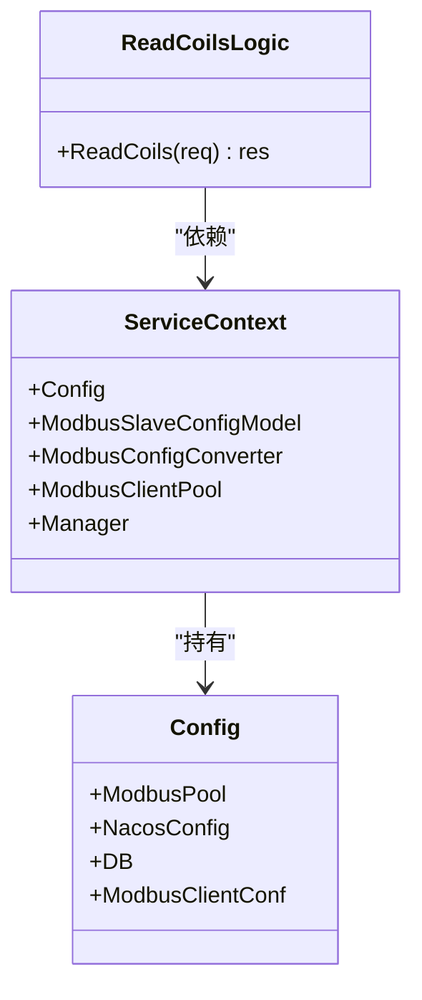
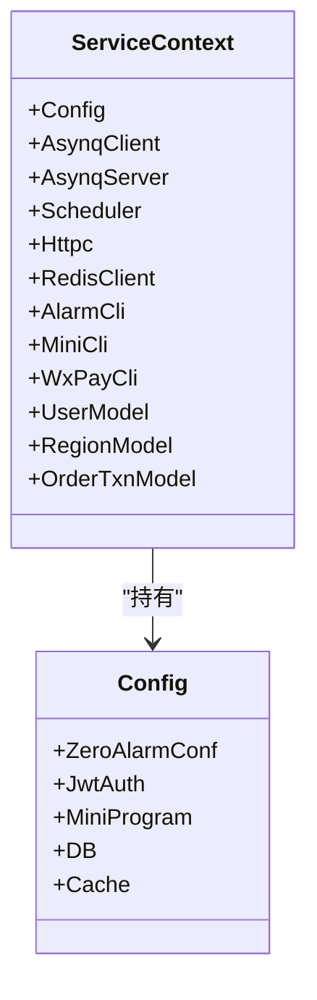
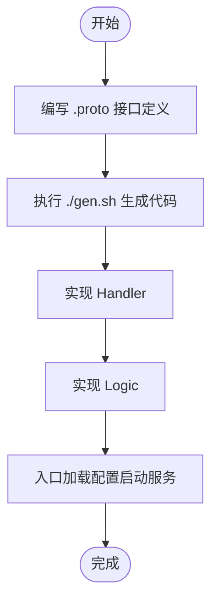
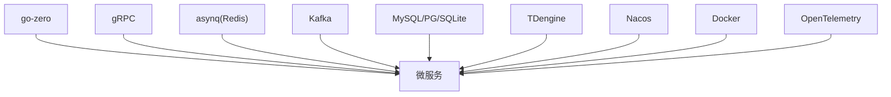

# 新服务开发

<cite>
**本文引用的文件**
- [README.md](file://README.md)
- [go.mod](file://go.mod)
- [app/alarm/etc/alarm.yaml](file://app/alarm/etc/alarm.yaml)
- [app/bridgemodbus/etc/bridgemodbus.yaml](file://app/bridgemodbus/etc/bridgemodbus.yaml)
- [zerorpc/etc/zerorpc.yaml](file://zerorpc/etc/zerorpc.yaml)
- [app/alarm/internal/svc/servicecontext.go](file://app/alarm/internal/svc/servicecontext.go)
- [app/bridgemodbus/internal/svc/servicecontext.go](file://app/bridgemodbus/internal/svc/servicecontext.go)
- [zerorpc/internal/svc/servicecontext.go](file://zerorpc/internal/svc/servicecontext.go)
- [app/alarm/alarm.proto](file://app/alarm/alarm.proto)
- [app/bridgemodbus/bridgemodbus.proto](file://app/bridgemodbus/bridgemodbus.proto)
- [app/alarm/internal/config/config.go](file://app/alarm/internal/config/config.go)
- [app/bridgemodbus/internal/config/config.go](file://app/bridgemodbus/internal/config/config.go)
- [zerorpc/internal/config/config.go](file://zerorpc/internal/config/config.go)
- [app/alarm/internal/logic/alarmlogic.go](file://app/alarm/internal/logic/alarmlogic.go)
- [app/bridgemodbus/internal/logic/readcoilslogic.go](file://app/bridgemodbus/internal/logic/readcoilslogic.go)
</cite>

## 目录
1. [简介](#简介)
2. [项目结构](#项目结构)
3. [核心组件](#核心组件)
4. [架构总览](#架构总览)
5. [详细组件分析](#详细组件分析)
6. [依赖分析](#依赖分析)
7. [性能考虑](#性能考虑)
8. [故障排查指南](#故障排查指南)
9. [结论](#结论)
10. [附录](#附录)

## 简介
本指南面向基于 go-zero 的 Zero-Service 微服务开发，提供从零开始创建新服务的完整流程与最佳实践。内容涵盖项目初始化、目录结构设计、配置文件编写、代码生成、服务模板使用、三层架构（Handler-Logic-Model）、依赖注入与服务上下文、gRPC 接口定义与实现、配置管理（YAML 结构、环境变量替换、动态配置更新）、测试方法、性能优化与部署注意事项。文中所有技术细节均来自仓库现有实现，确保可操作与可落地。

## 项目结构
Zero-Service 采用多模块微服务组织方式，核心目录如下：
- app/：核心微服务集合，每个服务包含 etc/ 配置、internal/ 代码、proto 文件与生成脚本
- common/：公共组件库（拦截器、协议扩展、工具等）
- model/：数据库模型与 SQL 脚本
- deploy/：Docker Compose 编排
- docs/swagger/third_party/：文档、Swagger 与第三方 proto
- zerorpc/gtw/facade/socketapp 等：网关、对外接口层与实时通信模块

图表来源
- [README.md:59-108](file://README.md#L59-L108)

章节来源
- [README.md:59-108](file://README.md#L59-L108)

## 核心组件
- 服务上下文（ServiceContext）：集中注入配置、客户端、模型与连接池，作为依赖注入容器
- 配置（Config）：基于 go-zero 的 zrpc.RpcServerConf 扩展，支持 Redis、DB、缓存、JWT、小程序等
- 三层架构（Handler-Logic-Model）：Handler 负责请求进入与响应返回；Logic 实现业务；Model 负责数据访问
- gRPC 服务：以 proto 定义接口，通过 gen.sh 生成代码框架
- 公共组件：拦截器、协议扩展、任务队列、服务注册与发现等

章节来源
- [app/alarm/internal/svc/servicecontext.go:13-32](file://app/alarm/internal/svc/servicecontext.go#L13-L32)
- [app/bridgemodbus/internal/svc/servicecontext.go:14-32](file://app/bridgemodbus/internal/svc/servicecontext.go#L14-L32)
- [zerorpc/internal/svc/servicecontext.go:19-33](file://zerorpc/internal/svc/servicecontext.go#L19-L33)
- [app/alarm/internal/config/config.go:5-15](file://app/alarm/internal/config/config.go#L5-L15)
- [app/bridgemodbus/internal/config/config.go:9-25](file://app/bridgemodbus/internal/config/config.go#L9-L25)
- [zerorpc/internal/config/config.go:8-24](file://zerorpc/internal/config/config.go#L8-L24)

## 架构总览
下图展示了服务启动与依赖注入的关键流程：入口 main 加载配置，构造 ServiceContext，再由 Handler 调用 Logic，Logic 使用 Model/Client 完成业务。

图表来源
- [app/alarm/internal/svc/servicecontext.go:20-32](file://app/alarm/internal/svc/servicecontext.go#L20-L32)
- [app/bridgemodbus/internal/svc/servicecontext.go:22-32](file://app/bridgemodbus/internal/svc/servicecontext.go#L22-L32)
- [zerorpc/internal/svc/servicecontext.go:35-101](file://zerorpc/internal/svc/servicecontext.go#L35-L101)

## 详细组件分析

### 组件A：Alarm 服务（gRPC 告警服务）
- 三层架构
  - Handler：接收 gRPC 请求，调用 Logic
  - Logic：实现告警发送与会话管理
  - Model：可扩展用户/区域/订单等模型（当前未在 Alarm 中使用）
- 依赖注入
  - ServiceContext 注入 Redis、AlarmX SDK、httpc
- 配置
  - etc/alarm.yaml：服务名、监听地址、日志、Redis、告警配置（飞书/钉钉）
- gRPC 接口
  - alarm.proto：Ping、Alarm

图表来源
- [app/alarm/internal/svc/servicecontext.go:13-32](file://app/alarm/internal/svc/servicecontext.go#L13-L32)
- [app/alarm/internal/logic/alarmlogic.go:17-63](file://app/alarm/internal/logic/alarmlogic.go#L17-L63)
- [app/alarm/internal/config/config.go:5-15](file://app/alarm/internal/config/config.go#L5-L15)

章节来源
- [app/alarm/etc/alarm.yaml:1-26](file://app/alarm/etc/alarm.yaml#L1-L26)
- [app/alarm/alarm.proto:30-33](file://app/alarm/alarm.proto#L30-L33)
- [app/alarm/internal/logic/alarmlogic.go:31-63](file://app/alarm/internal/logic/alarmlogic.go#L31-L63)

### 组件B：BridgeModbus 服务（gRPC Modbus 协议桥接）
- 三层架构
  - Handler：路由 gRPC 请求
  - Logic：封装 Modbus 读写与设备识别等操作
  - Model：ModbusSlaveConfigModel 等
- 依赖注入
  - ServiceContext 注入 ModbusClientPool、PoolManager、Model、配置
- 配置
  - etc/bridgemodbus.yaml：日志、Redis、DB、Modbus 客户端与连接池参数、Nacos 注册
- gRPC 接口
  - bridgemodbus.proto：配置管理、Bit/16位寄存器读写、设备识别、十进制转寄存器等

图表来源
- [app/bridgemodbus/internal/svc/servicecontext.go:14-32](file://app/bridgemodbus/internal/svc/servicecontext.go#L14-L32)
- [app/bridgemodbus/internal/logic/readcoilslogic.go:12-43](file://app/bridgemodbus/internal/logic/readcoilslogic.go#L12-L43)
- [app/bridgemodbus/etc/bridgemodbus.yaml:1-26](file://app/bridgemodbus/etc/bridgemodbus.yaml#L1-L26)

章节来源
- [app/bridgemodbus/etc/bridgemodbus.yaml:1-26](file://app/bridgemodbus/etc/bridgemodbus.yaml#L1-L26)
- [app/bridgemodbus/bridgemodbus.proto:10-83](file://app/bridgemodbus/bridgemodbus.proto#L10-L83)
- [app/bridgemodbus/internal/logic/readcoilslogic.go:27-43](file://app/bridgemodbus/internal/logic/readcoilslogic.go#L27-L43)

### 组件C：Zerorpc 服务（综合 RPC 服务）
- 三层架构
  - Handler：聚合用户、区域、订单等业务
  - Logic：结合 asynq 任务队列、微信小程序/支付、告警客户端
  - Model：UserModel、RegionModel、OrderTxnModel
- 依赖注入
  - ServiceContext 注入 Asynq 客户端/服务端/Scheduler、Redis、微信 SDK、Alarm 客户端、DB 模型
- 配置
  - etc/zerorpc.yaml：服务名、监听、Redis、DB、JWT、小程序、告警客户端

图表来源
- [zerorpc/internal/svc/servicecontext.go:19-101](file://zerorpc/internal/svc/servicecontext.go#L19-L101)
- [zerorpc/etc/zerorpc.yaml:1-39](file://zerorpc/etc/zerorpc.yaml#L1-L39)

章节来源
- [zerorpc/etc/zerorpc.yaml:1-39](file://zerorpc/etc/zerorpc.yaml#L1-L39)
- [zerorpc/internal/svc/servicecontext.go:35-101](file://zerorpc/internal/svc/servicecontext.go#L35-L101)

### gRPC 接口定义与实现流程
- 定义 proto：在服务根目录编写 .proto 文件，声明 service 与 message
- 生成代码：在服务目录执行 gen.sh，生成 pb.go、grpc.pb.go、gateway 等
- 实现 Handler/Logic：在 internal/handler 与 internal/logic 中实现业务
- 启动服务：入口文件加载 etc/*.yaml 并启动

图表来源
- [README.md:262-281](file://README.md#L262-L281)
- [app/alarm/alarm.proto:1-34](file://app/alarm/alarm.proto#L1-L34)
- [app/bridgemodbus/bridgemodbus.proto:1-355](file://app/bridgemodbus/bridgemodbus.proto#L1-L355)

章节来源
- [README.md:262-281](file://README.md#L262-L281)

### 服务模板与目录结构
- 模板使用：在 app/ 下创建新服务目录，复制已有服务的 etc、internal、proto 与 gen.sh 作为模板
- 目录约定
  - etc/：YAML 配置
  - internal/config/：Config 结构体
  - internal/svc/：ServiceContext 依赖注入
  - internal/handler/：gRPC/HTTP 处理器
  - internal/logic/：业务逻辑
  - *.proto：接口定义
  - gen.sh：代码生成脚本
- 入口文件：服务根目录的 main.go，加载配置并启动

章节来源
- [README.md:264-271](file://README.md#L264-L271)

### 配置管理（YAML 结构、环境变量替换、动态更新）
- YAML 结构
  - 通用字段：Name、ListenOn、Mode、Log、Timeout
  - 专用字段：Redis、DB、Cache、JwtAuth、MiniProgram、Alarmx、ModbusClientConf、NacosConfig 等
- 环境变量替换
  - go-zero 支持在 YAML 中使用环境变量占位符进行替换（参考 go-zero 文档）
- 动态配置更新
  - 建议通过配置中心（如 Nacos）与服务注册发现配合，实现配置热更新与灰度发布

章节来源
- [app/alarm/etc/alarm.yaml:1-26](file://app/alarm/etc/alarm.yaml#L1-L26)
- [app/bridgemodbus/etc/bridgemodbus.yaml:1-26](file://app/bridgemodbus/etc/bridgemodbus.yaml#L1-L26)
- [zerorpc/etc/zerorpc.yaml:1-39](file://zerorpc/etc/zerorpc.yaml#L1-L39)

### 三层架构模式（Handler-Logic-Model）
- Handler：负责请求进入、参数校验、调用 Logic、返回响应
- Logic：实现具体业务规则，组合 Model 与外部客户端
- Model：封装数据访问与业务实体，支持多数据库类型

章节来源
- [app/alarm/internal/logic/alarmlogic.go:17-63](file://app/alarm/internal/logic/alarmlogic.go#L17-L63)
- [app/bridgemodbus/internal/logic/readcoilslogic.go:12-43](file://app/bridgemodbus/internal/logic/readcoilslogic.go#L12-L43)

### 依赖注入与服务上下文
- ServiceContext 作为依赖容器，集中初始化 Redis、DB、Client、Model、SDK 等
- 通过 NewServiceContext(c) 构造，避免在 Handler/Logic 中重复初始化
- 可扩展 AddPool/Manager 等工厂方法，按需创建连接池或管理器

章节来源
- [app/alarm/internal/svc/servicecontext.go:20-32](file://app/alarm/internal/svc/servicecontext.go#L20-L32)
- [app/bridgemodbus/internal/svc/servicecontext.go:22-81](file://app/bridgemodbus/internal/svc/servicecontext.go#L22-L81)
- [zerorpc/internal/svc/servicecontext.go:35-101](file://zerorpc/internal/svc/servicecontext.go#L35-L101)

### 完整开发示例（Alarm 服务）
- 步骤
  - 在 app/ 下创建 alarm 目录，复制 etc、internal、proto 与 gen.sh
  - 编写 alarm.proto，定义 Ping/Alarm 接口
  - 执行 ./gen.sh 生成代码
  - 在 internal/logic 中实现 Alarm 方法
  - 在 etc/ 下编写 alarm.yaml
  - 在入口文件中加载配置并启动
- 关键文件路径
  - [app/alarm/alarm.proto](file://app/alarm/alarm.proto)
  - [app/alarm/etc/alarm.yaml](file://app/alarm/etc/alarm.yaml)
  - [app/alarm/internal/logic/alarmlogic.go](file://app/alarm/internal/logic/alarmlogic.go)
  - [app/alarm/internal/svc/servicecontext.go](file://app/alarm/internal/svc/servicecontext.go)

章节来源
- [README.md:264-271](file://README.md#L264-L271)
- [app/alarm/alarm.proto:30-33](file://app/alarm/alarm.proto#L30-L33)
- [app/alarm/etc/alarm.yaml:1-26](file://app/alarm/etc/alarm.yaml#L1-L26)
- [app/alarm/internal/logic/alarmlogic.go:31-63](file://app/alarm/internal/logic/alarmlogic.go#L31-L63)

## 依赖分析
- 技术栈
  - 微服务框架：go-zero
  - RPC：gRPC + grpc-gateway + Protocol Buffers
  - 消息队列：Kafka（go-queue）
  - 任务队列：asynq + Redis
  - 实时通信：SocketIO（fork）
  - 工业协议：IEC 104、Modbus、MQTT
  - 数据库：MySQL/PostgreSQL/SQLite、TDengine
  - 对象存储：MinIO/阿里OSS/腾讯COS
  - 服务发现：Nacos
  - 容器管理：Docker SDK
  - 监控追踪：OpenTelemetry/Prometheus
- 依赖关系
  - 各服务依赖 common 公共组件
  - 服务之间通过 gRPC 互调
  - 任务队列与消息队列贯穿多个服务

图表来源
- [go.mod:5-62](file://go.mod#L5-L62)

章节来源
- [go.mod:5-62](file://go.mod#L5-L62)
- [README.md:207-224](file://README.md#L207-L224)

## 性能考虑
- 连接池与并发
  - Modbus/DB/Redis 使用连接池，合理设置池大小与超时
  - 通过 ServiceContext 管理连接池，避免重复创建
- 序列化与传输
  - gRPC 默认使用 Protobuf，高效且跨语言
  - 合理拆分接口，避免大对象传输
- 缓存策略
  - 使用 Redis 缓存热点数据，降低 DB 压力
  - 配置 Cache 与过期策略
- 异步任务
  - 使用 asynq 执行耗时任务，避免阻塞请求
  - 设置重试、归档与生命周期管理
- 监控与追踪
  - 集成 OpenTelemetry，输出到 Prometheus/Grafana
  - 关键路径打点与日志分级

## 故障排查指南
- 配置问题
  - 检查 etc/*.yaml 字段是否正确，特别是 DB/Redis/JWT/Nacos
  - 确认环境变量替换是否生效
- 连接问题
  - Redis/DB/Modbus 客户端初始化失败：检查连接串与权限
  - Modbus 连接池：确认 PoolManager/AddPool/GetModbusClientPool 调用链
- gRPC 调用
  - 客户端连接：确认 zrpc.MustNewClient 与服务名一致
  - 参数校验：Logic 层对入参进行必要校验
- 日志与追踪
  - 查看日志级别与输出位置，定位异常
  - 使用 OpenTelemetry 追踪请求链路

章节来源
- [app/bridgemodbus/internal/svc/servicecontext.go:34-80](file://app/bridgemodbus/internal/svc/servicecontext.go#L34-L80)
- [zerorpc/internal/svc/servicecontext.go:94-96](file://zerorpc/internal/svc/servicecontext.go#L94-L96)

## 结论
通过复用现有服务模板与公共组件，结合 go-zero 的三层架构与依赖注入机制，可以高效地在 Zero-Service 中创建新微服务。遵循本文的目录结构、配置管理、gRPC 设计与性能优化建议，能够快速交付稳定、可观测、易维护的工业级微服务。

## 附录
- 快速启动
  - 进入服务目录，执行 ./gen.sh 生成代码
  - 编写 etc/*.yaml，启动服务
- 部署
  - 使用 Docker Compose 或单服务 Dockerfile 构建镜像
  - 与 Nacos、Kafka、Redis、DB、TDengine 等基础设施配合

章节来源
- [README.md:242-252](file://README.md#L242-L252)
- [README.md:300-318](file://README.md#L300-L318)