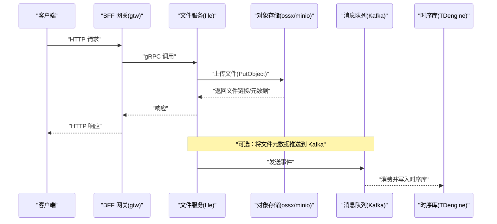
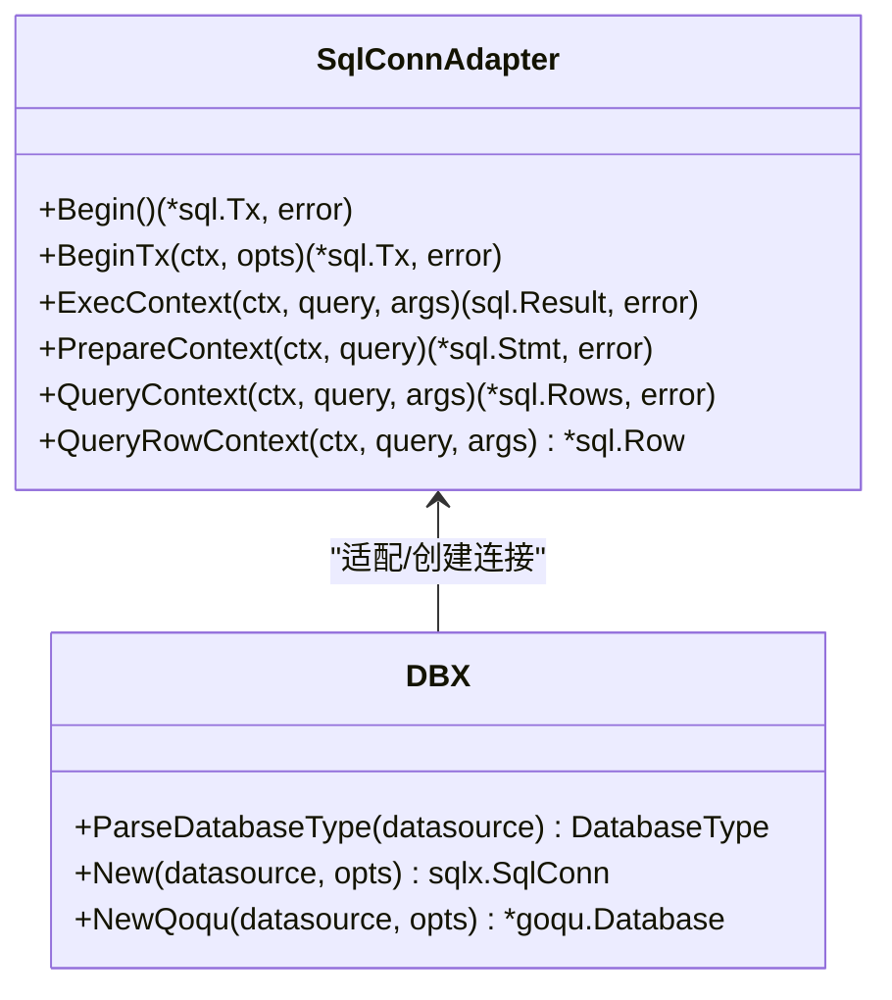
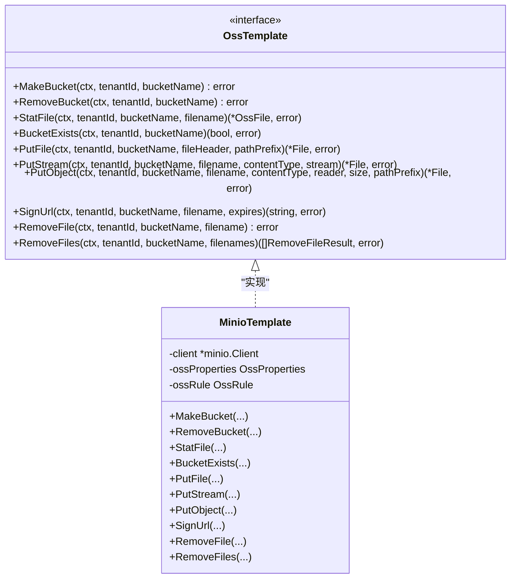
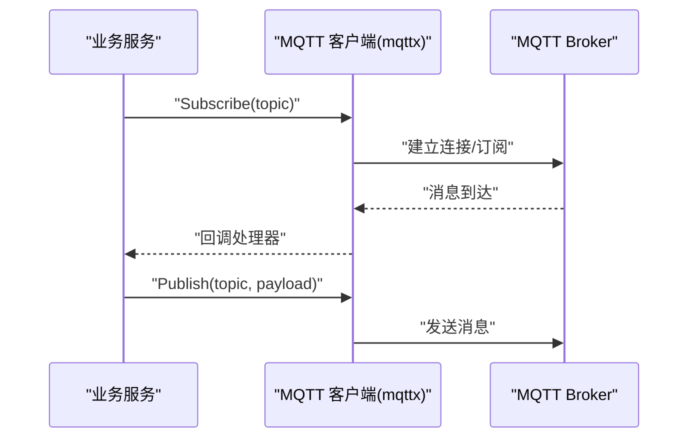
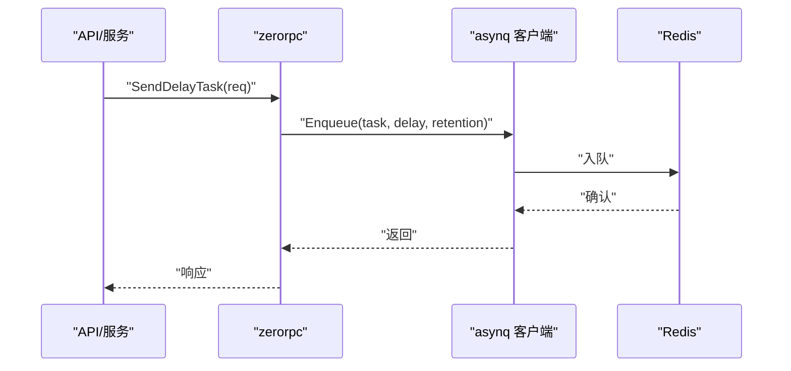
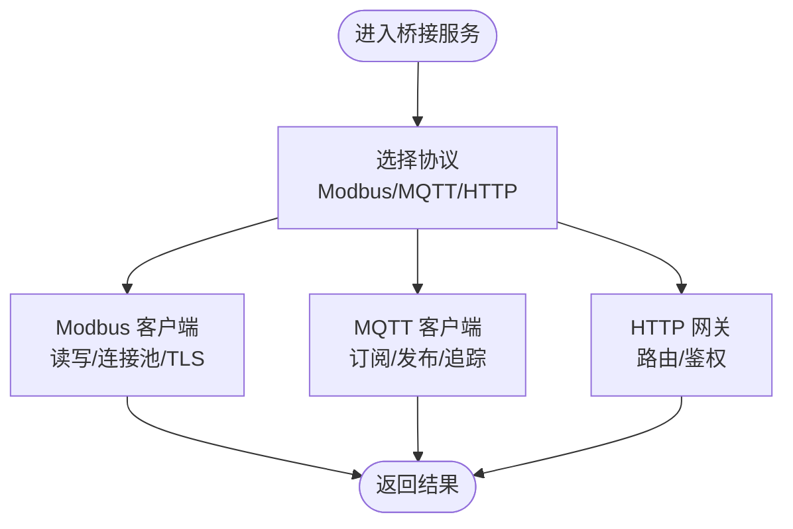
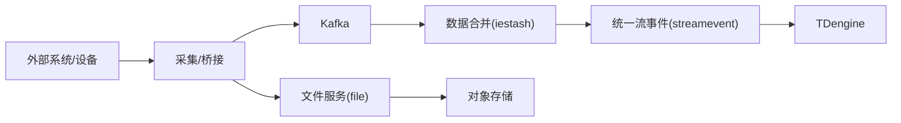
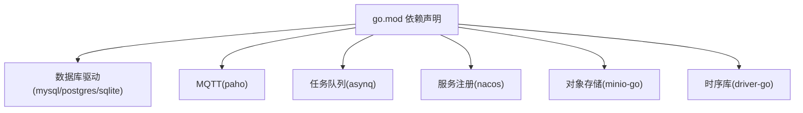

# 第三方系统集成

<cite>
**本文引用的文件**
- [README.md](file://README.md)
- [go.mod](file://go.mod)
- [common/dbx/dbx.go](file://common/dbx/dbx.go)
- [common/ossx/ossx.go](file://common/ossx/ossx.go)
- [common/ossx/minio_oss.go](file://common/ossx/minio_oss.go)
- [common/mqttx/mqttx.go](file://common/mqttx/mqttx.go)
- [common/asynqx/asynqClient.go](file://common/asynqx/asynqClient.go)
- [common/nacosx/register.go](file://common/nacosx/register.go)
- [common/modbusx/client.go](file://common/modbusx/client.go)
- [app/file/internal/logic/putfilelogic.go](file://app/file/internal/logic/putfilelogic.go)
- [zerorpc/internal/logic/senddelaytasklogic.go](file://zerorpc/internal/logic/senddelaytasklogic.go)
- [app/trigger/etc/trigger.yaml](file://app/trigger/etc/trigger.yaml)
- [app/file/etc/file.yaml](file://app/file/etc/file.yaml)
</cite>

## 目录
1. [简介](#简介)
2. [项目结构](#项目结构)
3. [核心组件](#核心组件)
4. [架构总览](#架构总览)
5. [详细组件分析](#详细组件分析)
6. [依赖分析](#依赖分析)
7. [性能考量](#性能考量)
8. [故障排查指南](#故障排查指南)
9. [结论](#结论)
10. [附录](#附录)

## 简介
本指南面向希望将外部系统与 Zero-Service 架构进行集成的工程师，系统讲解数据库、消息队列、对象存储与容器/协议网关等第三方系统的对接方法。文档围绕适配器模式、网关设计与数据同步策略展开，覆盖连接管理、事务处理、错误重试与超时控制，并提供 JSON/XML 转换、二进制数据处理与编码解码的实践建议。最后给出集成测试、性能监控与安全（认证授权、数据加密、访问控制）的最佳实践。

## 项目结构
Zero-Service 采用 go-zero 微服务框架，结合 gRPC、HTTP、MQTT、Kafka、Redis 等基础设施，形成“网关 + 微服务 + 中间件”的整体架构。公共组件库 common 提供数据库、对象存储、MQTT、任务队列、Modbus、Nacos 等适配层；应用层 app 提供具体业务服务；facade 提供跨语言统一接口；deploy 提供容器编排。

```mermaid
graph TB
subgraph "网关层"
Gtw["BFF 网关(gtw)"]
BridgeGtw["HTTP 桥接网关(bridgegtw)"]
end
subgraph "实时通信"
SocketGtw["SocketIO 网关(socketgtw)"]
SocketPush["SocketIO 推送(socketpush)"]
end
subgraph "核心服务(app)"
Trigger["异步任务(trigger)"]
File["文件服务(file)"]
Alarm["告警(alarm)"]
PodEngine["容器管理(podengine)"]
BridgeModbus["Modbus 桥接(bridgemodbus)"]
BridgeMqtt["MQTT 桥接(bridgemqtt)"]
Streamevent["流事件(streamevent)"]
end
subgraph "公共组件(common)"
DBX["数据库(dbx)"]
OSSX["对象存储(ossx)"]
MQT TX["MQTT(mqttx)"]
ASYNQX["任务队列(asynqx)"]
MODBUSX["Modbus(modbusx)"]
NACOSX["服务注册(nacosx)"]
end
subgraph "中间件"
Kafka["Kafka"]
Redis["Redis"]
TDengine["TDengine"]
MinIO["MinIO"]
end
Gtw --> Trigger
Gtw --> File
Gtw --> Streamevent
BridgeGtw --> Streamevent
SocketGtw --> SocketPush
Trigger --> ASYNQX
File --> OSSX
Streamevent --> Kafka
Streamevent --> TDengine
BridgeModbus --> MODBUSX
BridgeMqtt --> MQT TX
Trigger --> Redis
File --> MinIO
NACOSX --> Trigger
NACOSX --> File
```

图表来源
- [README.md:15-51](file://README.md#L15-L51)
- [README.md:109-108](file://README.md#L109-L108)

章节来源
- [README.md:15-51](file://README.md#L15-L51)
- [README.md:109-108](file://README.md#L109-L108)

## 核心组件
- 数据库适配与事务：dbx 提供多数据库类型识别与连接创建，并封装 sqlx.SqlConn 适配器，支持 Begin/BeginTx/ExecContext/QueryContext 等事务与查询操作。
- 对象存储适配：ossx 定义统一模板接口，minio_oss 实现 MinIO 客户端，支持桶管理、文件上传/下载签名、批量删除等。
- MQTT 客户端：mqttx 提供连接、订阅、发布、默认处理器、链路追踪与指标统计。
- 任务队列：asynqx 封装 asynq 客户端与 Inspector，提供生产者 Span 与任务类型属性。
- Modbus 客户端：modbusx 提供 TCP 客户端封装、连接池、TLS 支持与日志。
- 服务注册：nacosx 提供服务注册与注销，支持环境 IP 解析与优雅停机。
- 文件服务集成：file 服务通过 ossx.Template 选择租户维度的存储模板，完成文件上传与 EXIF 元数据提取。

章节来源
- [common/dbx/dbx.go:46-104](file://common/dbx/dbx.go#L46-L104)
- [common/ossx/ossx.go:28-151](file://common/ossx/ossx.go#L28-L151)
- [common/ossx/minio_oss.go:20-243](file://common/ossx/minio_oss.go#L20-L243)
- [common/mqttx/mqttx.go:76-389](file://common/mqttx/mqttx.go#L76-L389)
- [common/asynqx/asynqClient.go:17-31](file://common/asynqx/asynqClient.go#L17-L31)
- [common/modbusx/client.go:106-218](file://common/modbusx/client.go#L106-L218)
- [common/nacosx/register.go:21-99](file://common/nacosx/register.go#L21-L99)
- [app/file/internal/logic/putfilelogic.go:33-77](file://app/file/internal/logic/putfilelogic.go#L33-L77)

## 架构总览
以下序列图展示了典型的数据入库与消息推送路径，体现“适配器 + 网关 + 中间件”的集成思路：



图表来源
- [README.md:189-206](file://README.md#L189-L206)
- [app/file/etc/file.yaml:17-23](file://app/file/etc/file.yaml#L17-L23)

章节来源
- [README.md:189-206](file://README.md#L189-L206)
- [app/file/etc/file.yaml:17-23](file://app/file/etc/file.yaml#L17-L23)

## 详细组件分析

### 数据库集成（适配器模式与事务）
- 适配器模式：dbx.SqlConnAdapter 将 sqlx.SqlConn 适配为标准 sql.DB，统一执行 ExecContext/QueryContext/PrepareContext 等。
- 事务处理：支持 Begin/BeginTx，便于在业务逻辑中包裹原子操作。
- 多数据库支持：ParseDatabaseType 根据数据源字符串自动识别类型，分别创建 MySQL、PostgreSQL、SQLite、TDengine 连接。
- ORM 集成：NewQoqu 基于适配器创建 goqu.Database，支持日志输出与方言注册。



图表来源
- [common/dbx/dbx.go:66-138](file://common/dbx/dbx.go#L66-L138)

章节来源
- [common/dbx/dbx.go:46-138](file://common/dbx/dbx.go#L46-L138)

### 对象存储集成（适配器与模板）
- 统一接口：OssTemplate 定义桶管理、文件上传/删除、签名、批量删除等方法。
- 模板实现：minio_oss 实现 MinIO 客户端，支持桶存在性检查、对象统计、预签名 URL、批量删除。
- 租户隔离：OssRule 支持租户前缀与固定文件名策略，保障多租户隔离。
- 服务集成：file 服务通过 ossx.Template 获取模板，结合数据库配置动态选择存储实例。



图表来源
- [common/ossx/ossx.go:28-151](file://common/ossx/ossx.go#L28-L151)
- [common/ossx/minio_oss.go:20-243](file://common/ossx/minio_oss.go#L20-L243)

章节来源
- [common/ossx/ossx.go:28-151](file://common/ossx/ossx.go#L28-L151)
- [common/ossx/minio_oss.go:20-243](file://common/ossx/minio_oss.go#L20-L243)
- [app/file/internal/logic/putfilelogic.go:33-77](file://app/file/internal/logic/putfilelogic.go#L33-L77)

### 消息队列集成（MQTT）
- 客户端生命周期：NewClient 自动重连、心跳、超时控制；OnConnect/onConnectionLost 回调处理。
- 订阅与恢复：AddHandler/AddHandlerFunc 注册处理器；RestoreSubscriptions 在重连后恢复订阅。
- 发布与追踪：Publish 支持超时与 OTel 追踪；消息携带 Trace 上下文。
- 指标统计：内部使用 stat.Metrics 记录处理耗时。



图表来源
- [common/mqttx/mqttx.go:98-255](file://common/mqttx/mqttx.go#L98-L255)

章节来源
- [common/mqttx/mqttx.go:76-389](file://common/mqttx/mqttx.go#L76-L389)

### 任务队列集成（asynq + Redis）
- 生产者追踪：StartAsynqProducerSpan 为任务生产注入 OTel 上下文。
- 任务入队：SendDelayTaskLogic 将业务载荷序列化为 JSON，设置处理时间与保留周期。
- 监控与治理：asynq Inspector 可用于查看任务状态与统计。



图表来源
- [zerorpc/internal/logic/senddelaytasklogic.go:32-52](file://zerorpc/internal/logic/senddelaytasklogic.go#L32-L52)
- [common/asynqx/asynqClient.go:25-30](file://common/asynqx/asynqClient.go#L25-L30)

章节来源
- [zerorpc/internal/logic/senddelaytasklogic.go:32-52](file://zerorpc/internal/logic/senddelaytasklogic.go#L32-L52)
- [common/asynqx/asynqClient.go:17-31](file://common/asynqx/asynqClient.go#L17-L31)

### 协议网关与桥接（Modbus/MQTT/HTTP）
- Modbus：modbusx 提供 TCP 客户端封装、连接池、TLS、超时与日志，支持线圈/寄存器读写与设备标识读取。
- MQTT：mqttx 提供统一客户端，支持事件映射、默认处理器与追踪。
- HTTP：bridgegtw 提供最小化 HTTP 网关示例，可扩展为多后端路由与鉴权。



图表来源
- [common/modbusx/client.go:106-218](file://common/modbusx/client.go#L106-L218)
- [common/mqttx/mqttx.go:98-178](file://common/mqttx/mqttx.go#L98-L178)
- [README.md:182-185](file://README.md#L182-L185)

章节来源
- [common/modbusx/client.go:106-218](file://common/modbusx/client.go#L106-L218)
- [common/mqttx/mqttx.go:76-389](file://common/mqttx/mqttx.go#L76-L389)
- [README.md:182-185](file://README.md#L182-L185)

### 数据同步策略
- Kafka 消费与合并：IEC 104 数据经 Kafka 消费后合并，再通过 streamevent 写入 TDengine。
- 任务驱动：trigger 服务通过 asynq 分布式队列实现延迟/定时任务，支持回调与重试。
- 文件落库：file 服务上传完成后，可选将元数据推送到 Kafka，由下游服务落库。



图表来源
- [README.md:112-127](file://README.md#L112-L127)

章节来源
- [README.md:112-127](file://README.md#L112-L127)

## 依赖分析
- 技术栈与集成点：go.mod 展示了数据库驱动、MQTT 客户端、asynq、Nacos、MinIO、TDengine 驱动等依赖，支撑数据库、消息队列、对象存储与服务注册等集成。
- 组件耦合：公共组件通过接口抽象（如 OssTemplate、ConsumeHandler）降低对具体实现的耦合；服务通过 gRPC 与网关交互，避免直接依赖。



图表来源
- [go.mod:5-62](file://go.mod#L5-L62)

章节来源
- [go.mod:5-62](file://go.mod#L5-L62)

## 性能考量
- 连接池与复用：Modbus 客户端池与 asynq 客户端均支持连接复用与生命周期管理，减少频繁创建销毁带来的开销。
- 超时与背压：MQTT 客户端提供超时配置；asynq 任务具备重试与保留策略；数据库适配器支持上下文超时。
- 指标与追踪：MQTT 与 asynq 均内置指标与 OTel 追踪，便于定位性能瓶颈。
- I/O 优化：对象存储上传采用流式读取与缓冲，避免大文件内存占用。

章节来源
- [common/modbusx/client.go:154-191](file://common/modbusx/client.go#L154-L191)
- [common/asynqx/asynqClient.go:25-30](file://common/asynqx/asynqClient.go#L25-L30)
- [common/mqttx/mqttx.go:112-178](file://common/mqttx/mqttx.go#L112-L178)
- [common/ossx/minio_oss.go:96-148](file://common/ossx/minio_oss.go#L96-L148)

## 故障排查指南
- 连接失败
  - MQTT：检查 Broker 地址、用户名/密码、KeepAlive/Timeout；关注 OnConnectionLost 回调与重连机制。
  - Modbus：确认地址、Slave、超时与 TLS 配置；查看 ModbusLogger 输出。
  - 数据库：核对 ParseDatabaseType 识别是否正确；检查连接串格式。
- 任务异常
  - asynq：通过 Inspector 查看任务状态；检查 Redis 连接与任务保留周期。
- 对象存储
  - MinIO：验证 Endpoint/AccessKey/SecretKey；检查桶权限与对象签名 URL 参数。
- 服务注册
  - Nacos：确认命名空间、服务名、权重与健康状态；关注优雅停机注销。

章节来源
- [common/mqttx/mqttx.go:148-178](file://common/mqttx/mqttx.go#L148-L178)
- [common/modbusx/client.go:107-143](file://common/modbusx/client.go#L107-L143)
- [common/dbx/dbx.go:31-64](file://common/dbx/dbx.go#L31-L64)
- [common/asynqx/asynqClient.go:21-23](file://common/asynqx/asynqClient.go#L21-L23)
- [common/ossx/minio_oss.go:214-235](file://common/ossx/minio_oss.go#L214-L235)
- [common/nacosx/register.go:21-76](file://common/nacosx/register.go#L21-L76)

## 结论
通过适配器模式与统一接口抽象，Zero-Service 能够以较低成本集成数据库、MQTT、对象存储与任务队列等第三方系统。结合网关设计与数据同步策略，可在保证性能与可观测性的前提下，实现稳定可靠的跨系统协作。

## 附录

### 集成场景与最佳实践
- 数据源集成
  - 使用 dbx.New 与 ParseDatabaseType 自动识别数据库类型；在事务边界使用 Begin/BeginTx 包裹。
  - 对于 TDengine，使用 goqu 方言与适配器统一查询。
- 服务依赖集成
  - 通过 asynq 客户端与 Inspector 实现任务编排与治理；在生产者侧注入 OTel 上下文。
- 外部 API 调用
  - 使用 bridgegtw 作为 HTTP 网关，结合鉴权与路由规则；必要时引入 grpc-gateway 提供 HTTP 访问。

章节来源
- [common/dbx/dbx.go:46-138](file://common/dbx/dbx.go#L46-L138)
- [common/asynqx/asynqClient.go:17-31](file://common/asynqx/asynqClient.go#L17-L31)
- [README.md:189-196](file://README.md#L189-L196)

### 关键技术点清单
- 连接管理：客户端池化、自动重连、超时控制、TLS 支持。
- 事务处理：Begin/BeginTx、回滚与提交策略。
- 错误重试：MQTT/Modbus/对象存储均具备重试与退避策略。
- 超时控制：统一的超时配置与上下文取消。
- 数据格式转换：文件上传时 Content-Type 检测与 EXIF 元数据提取；MQTT 消息可携带 Trace 上下文。
- 协议适配：MQTT 事件映射、Modbus 功能码封装、HTTP 网关路由。

章节来源
- [common/mqttx/mqttx.go:112-178](file://common/mqttx/mqttx.go#L112-L178)
- [common/modbusx/client.go:107-143](file://common/modbusx/client.go#L107-L143)
- [app/file/internal/logic/putfilelogic.go:66-73](file://app/file/internal/logic/putfilelogic.go#L66-L73)

### 集成测试方法
- 单元测试：针对 OssTemplate/MinioTemplate 的上传/删除/签名等方法编写断言。
- 集成测试：启动 Redis/Kafka/MinIO/DB，运行服务端点，验证端到端流程。
- 压力测试：对 asynq 任务队列与 MQTT 订阅/发布进行并发压测，观察延迟与吞吐。

章节来源
- [app/file/etc/file.yaml:17-23](file://app/file/etc/file.yaml#L17-L23)
- [app/trigger/etc/trigger.yaml:19-37](file://app/trigger/etc/trigger.yaml#L19-L37)

### 性能监控与可观测性
- 指标：MQTT 客户端内部使用 stat.Metrics；asynq 生产者 Span 记录任务生产轨迹。
- 追踪：OTel Tracer 为 MQTT/任务队列注入与提取上下文。
- 日志：dbx/mqttx/modbusx 均提供结构化日志字段，便于检索。

章节来源
- [common/mqttx/mqttx.go:258-307](file://common/mqttx/mqttx.go#L258-L307)
- [common/asynqx/asynqClient.go:25-30](file://common/asynqx/asynqClient.go#L25-L30)
- [common/dbx/dbx.go:140-146](file://common/dbx/dbx.go#L140-L146)

### 安全考虑
- 认证授权
  - JWT：BFF 网关支持 JWT 认证与微信支付回调。
  - OAuth：可扩展为 OIDC/JWT 验证。
- 数据加密
  - Modbus/TLS：客户端支持证书与 CA 校验。
  - HTTPS：对象存储与网关建议使用 HTTPS。
- 访问控制
  - Nacos：服务注册与发现，配合命名空间与元数据实现访问控制。
  - 网关：路由与鉴权策略，限制无效请求与暴力尝试。

章节来源
- [README.md:189-196](file://README.md#L189-L196)
- [common/modbusx/client.go:109-134](file://common/modbusx/client.go#L109-L134)
- [common/nacosx/register.go:41-73](file://common/nacosx/register.go#L41-L73)