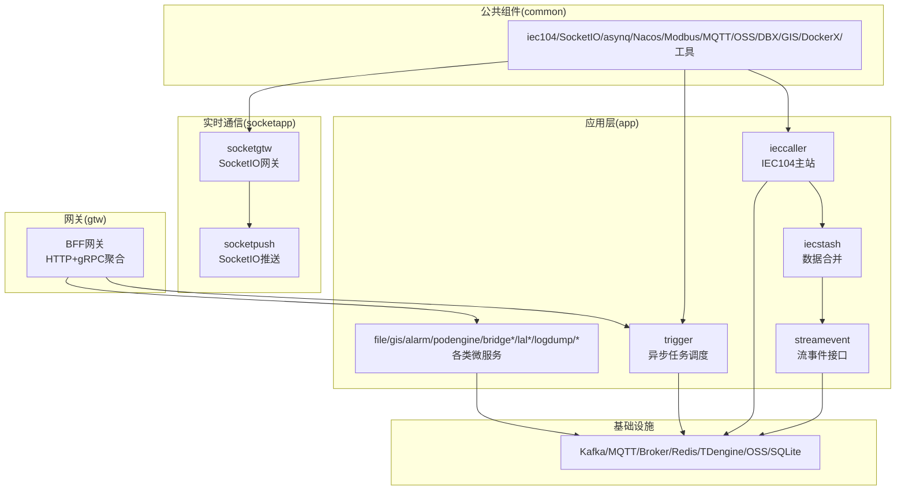
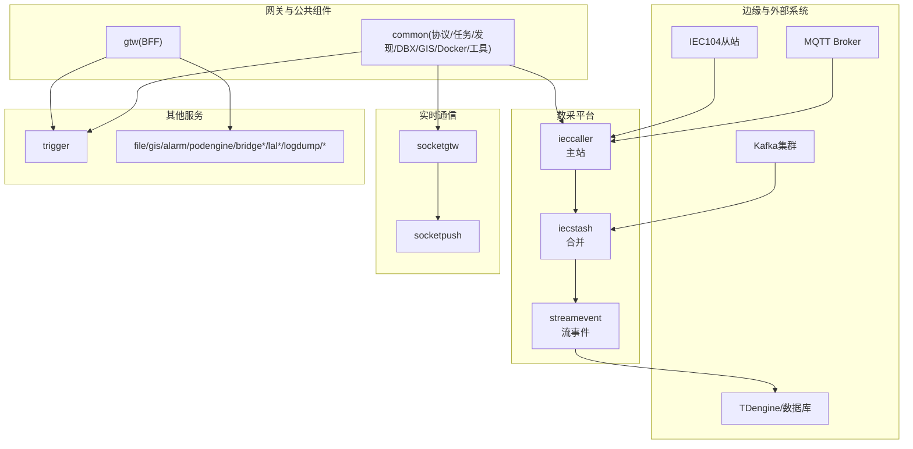
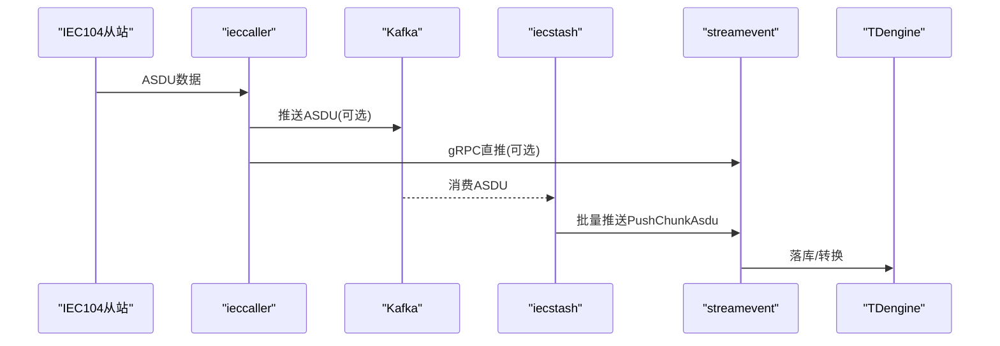
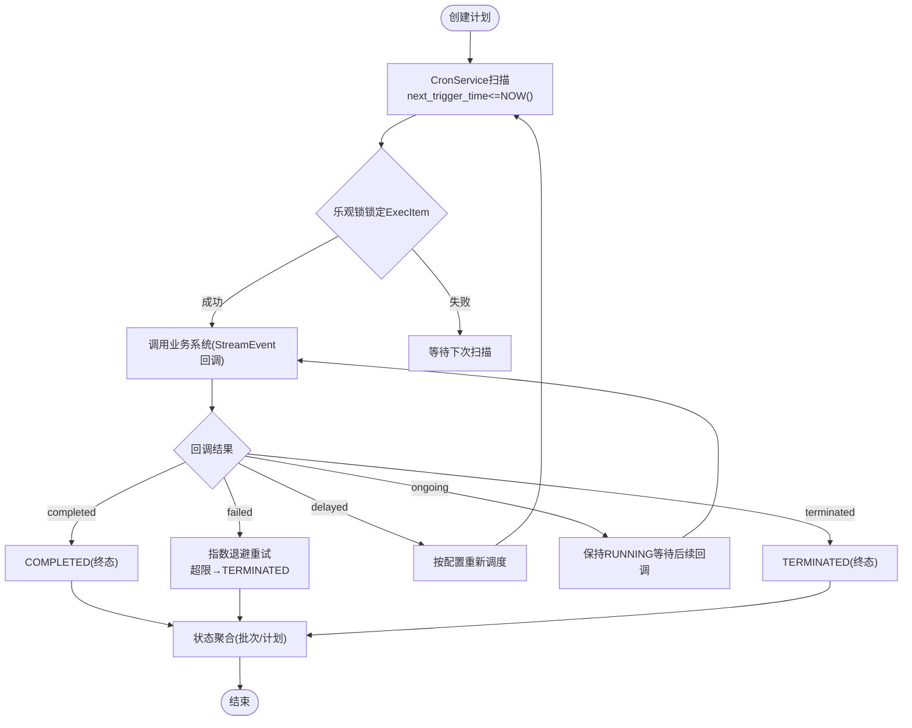

# 项目贡献流程

<cite>
**本文引用的文件**
- [README.md](file://README.md)
- [code.md](file://code.md)
- [go.mod](file://go.mod)
- [.gitignore](file://.gitignore)
- [docs/iec104.md](file://docs/iec104.md)
- [docs/trigger.md](file://docs/trigger.md)
- [common/antsx/README.md](file://common/antsx/README.md)
- [.trae/skills/dev-environment/SKILL.md](file://.trae/skills/dev-environment/SKILL.md)
- [.trae/skills/zero-skills/best-practices/overview.md](file://.trae/skills/zero-skills/best-practices/overview.md)
- [.trae/skills/zero-skills/getting-started/copilot-guide.md](file://.trae/skills/zero-skills/getting-started/copilot-guide.md)
- [.trae/skills/zero-skills/getting-started/windsurf-guide.md](file://.trae/skills/zero-skills/getting-started/windsurf-guide.md)
- [util/Taskfile.yml](file://util/Taskfile.yml)
- [util/manage.sh](file://util/manage.sh)
- [app/xfusionmock/deploy.sh](file://app/xfusionmock/deploy.sh)
- [app/gis/deploy.sh](file://app/gis/deploy.sh)
- [socketapp/socketgtw/deploy.sh](file://socketapp/socketgtw/deploy.sh)
</cite>

## 目录
1. [简介](#简介)
2. [项目结构](#项目结构)
3. [核心组件](#核心组件)
4. [架构总览](#架构总览)
5. [详细组件分析](#详细组件分析)
6. [依赖分析](#依赖分析)
7. [性能考虑](#性能考虑)
8. [故障排查指南](#故障排查指南)
9. [结论](#结论)
10. [附录](#附录)

## 简介
本指南面向Zero-Service项目的贡献者，提供从开发环境搭建、代码提交规范、Pull Request审查与合并、测试策略、版本控制、发布流程到社区参与的完整流程说明。项目基于go-zero微服务框架，覆盖工业协议接入、异步任务调度、实时通信、容器管理、地理信息、BFF网关等能力，适合对物联网、工业自动化、实时数据处理感兴趣的开发者。

## 项目结构
项目采用go-zero标准三层架构（Handler-Logic-Model）组织服务代码，并通过Protocol Buffers定义gRPC接口，结合Swagger生成API文档。公共组件集中在common目录，模型与SQL脚本在model目录，部署相关在deploy目录，文档在docs目录，工具脚本在util目录。

图表来源
- [README.md:110-188](file://README.md#L110-L188)
- [docs/iec104.md:3-328](file://docs/iec104.md#L3-L328)
- [docs/trigger.md:1-284](file://docs/trigger.md#L1-L284)

章节来源
- [README.md:59-108](file://README.md#L59-L108)

## 核心组件
- IEC104数采平台：ieccaller（主站）、iecstash（合并）、streamevent（落库/跨语言协议）。
- 异步任务调度：trigger（基于asynq的分布式任务队列 + 计划任务引擎）。
- 实时通信：socketgtw（连接/房间/路由）、socketpush（Token/gRPC推送）。
- 文件/地理/告警/容器/协议桥接/流媒体/日志等服务。
- BFF网关：统一HTTP/gRPC入口，聚合后端服务。
- 公共组件：协议栈、任务队列、服务发现、数据库扩展、GIS、Docker、工具库等。

章节来源
- [README.md:110-188](file://README.md#L110-L188)
- [docs/iec104.md:3-328](file://docs/iec104.md#L3-L328)
- [docs/trigger.md:1-284](file://docs/trigger.md#L1-L284)

## 架构总览
下图展示了系统的高层架构与数据流，强调IEC104主站、数据合并、流事件落库以及实时通信、文件、地理、容器、协议桥接等服务之间的协作关系。

图表来源
- [README.md:15-51](file://README.md#L15-L51)
- [docs/iec104.md:14-328](file://docs/iec104.md#L14-L328)
- [docs/trigger.md:14-284](file://docs/trigger.md#L14-L284)

## 详细组件分析

### IEC104数采平台
- ieccaller：与多个IEC104从站并行通信，支持Kafka/MQTT/gRPC三协议推送；支持集群广播同步命令；弱校验推送模式；点位配置管理。
- iecstash：消费Kafka消息，按阈值聚合后批量转发至streamevent。
- streamevent：统一流事件协议（跨语言gRPC），接收MQTT/WS/Kafka/Socket上行消息，处理计划任务事件，对接TDengine。

图表来源
- [docs/iec104.md:14-328](file://docs/iec104.md#L14-L328)

章节来源
- [docs/iec104.md:38-328](file://docs/iec104.md#L38-L328)

### 异步任务调度（Trigger）
- 异步任务：基于asynq的分布式队列，支持HTTP/gRPC回调、自动重试、队列权重、历史统计。
- 计划任务：自研数据库扫描引擎，Plan-Batch-ExecItem三级模型，状态机驱动，分布式锁防重，回调结果聚合。

图表来源
- [docs/trigger.md:70-284](file://docs/trigger.md#L70-L284)

章节来源
- [docs/trigger.md:14-284](file://docs/trigger.md#L14-L284)

### 实时通信（SocketIO）
- socketgtw：连接管理、房间管理、消息路由、Token认证。
- socketpush：Token生成/验证、gRPC推送接口、后端服务调用入口。
- 支持MQTT桥接、统计信息推送、房间负载检测。

章节来源
- [README.md:156-173](file://README.md#L156-L173)

### 公共组件（antsx响应式工具包）
- Promise链式调用、并发组合（PromiseAll/PromiseRace）、Reactor池调度、PendingRegistry请求-响应匹配、EventEmitter发布/订阅、Invoke并行流程编排。
- 适用于高并发、异步编排、请求匹配与流式事件处理。

章节来源
- [common/antsx/README.md:1-360](file://common/antsx/README.md#L1-L360)

## 依赖分析
- 语言与框架：Go 1.25+，go-zero微服务框架。
- RPC与协议：gRPC + grpc-gateway + Protocol Buffers，Swagger文档生成。
- 消息队列：Kafka（go-queue）。
- 任务队列：asynq + Redis。
- 实时通信：SocketIO（fork版）。
- 工业协议：IEC 60870-5-104（go-iecp5）、Modbus（grid-x/modbus）、MQTT（paho.mqtt）。
- 数据库：MySQL/PostgreSQL/SQLite、TDengine。
- 对象存储：MinIO/阿里OSS/腾讯COS。
- 服务发现：Nacos。
- 地理计算：H3（uber/h3-go）、GeoHash、orb/go-geom。
- 容器管理：Docker SDK。
- 监控追踪：OpenTelemetry/Prometheus。
- 容器编排：Docker Compose/Kubernetes（可选）。

章节来源
- [go.mod:1-245](file://go.mod#L1-L245)

## 性能考虑
- IEC104主站：并发连接与任务并发度、弱校验推送减少不必要的数据传输。
- 数据合并：按字节数阈值聚合（默认1MB），降低下游压力。
- 异步任务：队列权重（critical/default/low）、指数退避重试、Redis分布式锁。
- 实时通信：房间管理、广播推送、MQTT桥接，注意慢消费者丢弃策略。
- 容器管理：Pod抽象、资源统计、镜像管理，避免资源争用。
- 数据库：多库支持、索引优化、批量写入。

## 故障排查指南
- 错误码规范：遵循google.rpc.Code映射，HTTP与gRPC错误码一致，便于统一处理与日志追踪。
- 常见问题定位：查看服务日志、Kafka/Redis/TDengine状态、容器健康检查、网络连通性。
- 配置校验：确认各服务配置文件（etc/*.yaml）中的端口、连接串、服务发现、协议参数正确。
- 依赖更新：使用提供的脚本或工具更新依赖，避免版本冲突。

章节来源
- [code.md:1-66](file://code.md#L1-L66)

## 结论
本指南提供了从开发环境到贡献发布的全流程说明，结合项目现有文档与脚本，帮助贡献者快速上手并高质量交付代码。建议在提交前完成本地测试、遵循代码风格与注释规范，并通过PR审查流程确保代码质量与可维护性。

## 附录

### 开发环境搭建
- 环境要求：Go 1.25+、Redis、可选Kafka/MySQL/PostgreSQL/TDengine/Docker。
- 依赖安装：go mod tidy。
- 代码生成：在服务目录执行gen.sh生成gRPC/HTTP代码框架。
- 启动服务：进入服务目录，使用go run启动或通过Docker Compose一键启动。
- 配置文件：各服务配置位于app/{service}/etc/，包含监听地址、数据库/缓存/消息队列连接、服务发现等。

章节来源
- [README.md:226-261](file://README.md#L226-L261)

### 代码提交规范与PR审查
- 分支策略：建议采用feature/fix/hotfix分支命名，合并前确保通过CI与测试。
- 提交信息：简明描述变更目的与影响，引用相关Issue。
- PR要求：包含变更说明、测试用例、影响范围评估；至少一名维护者审查通过后合并。
- 代码风格：遵循go-zero三层架构（Handler-Logic-Model），文件命名规范，注释清晰，错误处理统一。
- 文档更新：新增或变更API需同步更新Swagger与相关文档。

章节来源
- [.trae/skills/zero-skills/best-practices/overview.md:1-58](file://.trae/skills/zero-skills/best-practices/overview.md#L1-L58)
- [.trae/skills/zero-skills/best-practices/overview.md:357-424](file://.trae/skills/zero-skills/best-practices/overview.md#L357-L424)

### 测试策略
- 单元测试：针对逻辑层与工具库，使用Go标准测试框架，Mock依赖与数据库。
- 集成测试：使用真实数据库连接，验证模型与业务流程。
- 端到端测试：通过Docker Compose启动最小化服务集合，验证跨服务调用与数据流。

章节来源
- [.trae/skills/zero-skills/best-practices/overview.md:357-424](file://.trae/skills/zero-skills/best-practices/overview.md#L357-L424)

### 版本控制流程
- 分支管理：develop/main，feature/fix/hotfix命名规范；hotfix直接合并至main并打标签。
- 标签发布：遵循语义化版本，变更日志维护在docs或CHANGELOG中。
- 变更日志：记录重大变更、破坏性更新、修复与新增功能，便于回溯与升级。

### 发布流程
- 本地构建：在服务目录执行go build生成Linux二进制。
- Docker镜像：使用Dockerfile构建镜像，支持多平台（amd64/arm64）。
- 镜像导出与部署：通过脚本导出为tar文件，传输至目标服务器后load并compose启动。
- 自动化：可结合Taskfile与manage.sh实现批量服务启停与编排。

章节来源
- [.trae/skills/dev-environment/SKILL.md:142-191](file://.trae/skills/dev-environment/SKILL.md#L142-L191)
- [app/xfusionmock/deploy.sh:1-50](file://app/xfusionmock/deploy.sh#L1-L50)
- [app/gis/deploy.sh:1-46](file://app/gis/deploy.sh#L1-L46)
- [socketapp/socketgtw/deploy.sh:1-50](file://socketapp/socketgtw/deploy.sh#L1-L50)
- [util/Taskfile.yml:1-33](file://util/Taskfile.yml#L1-L33)
- [util/manage.sh:1-35](file://util/manage.sh#L1-L35)

### 贡献者指南
- Issue报告：描述现象、期望行为、复现步骤、环境信息与日志片段。
- 功能请求：说明背景、收益、技术方案与兼容性影响。
- Bug修复：提供最小复现、定位分析、修复方案与测试验证。
- 代码审查：关注架构一致性、性能影响、可测试性与可维护性；及时响应反馈并迭代修改。

### 社区参与
- 讨论参与：在Issues/PR评论区积极沟通，提供上下文与建议。
- 文档改进：补充API文档、架构说明、最佳实践与FAQ。
- 工具开发：完善脚手架、代码生成器、部署与监控工具，提升团队效率。