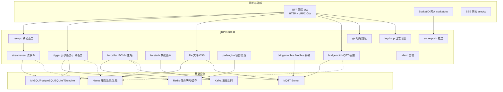
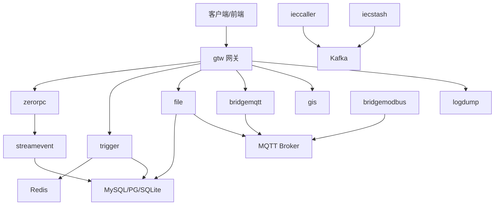
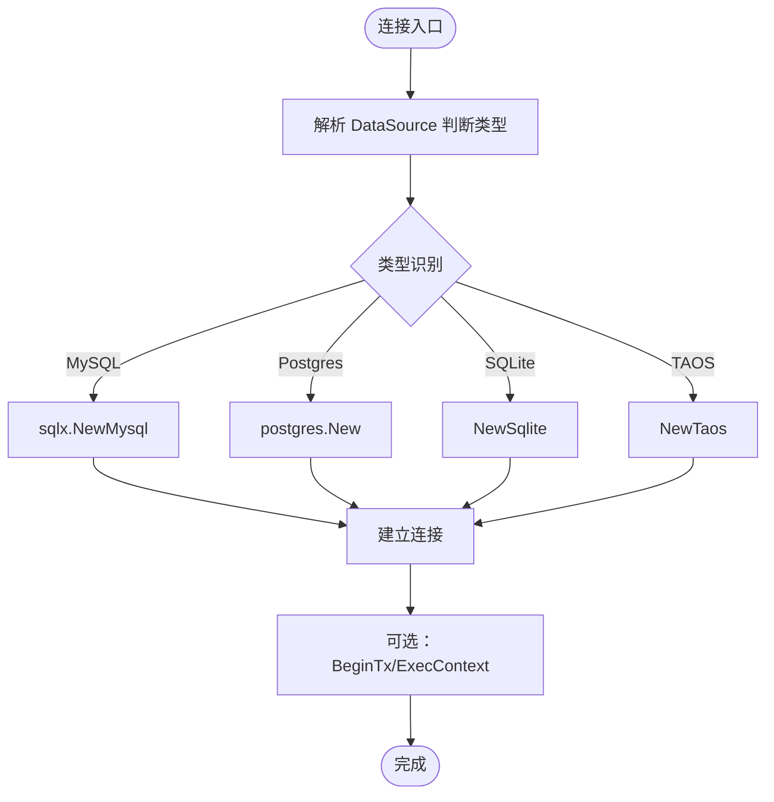
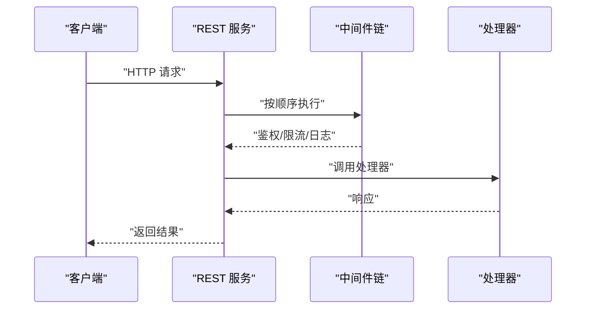
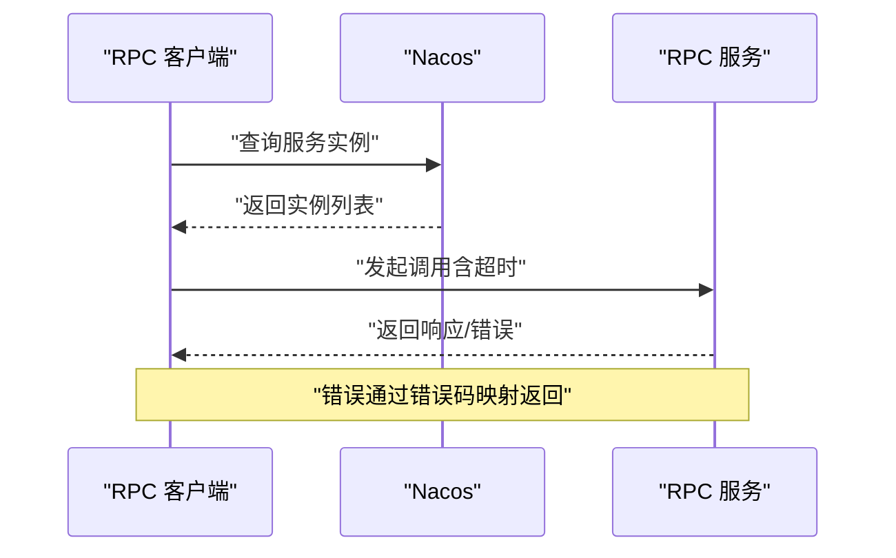
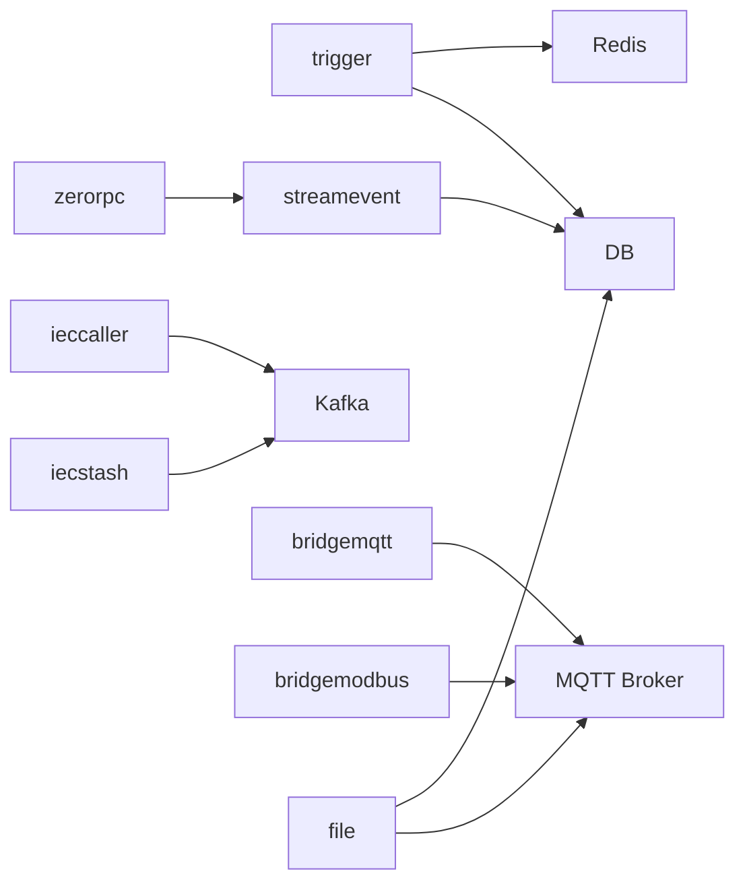

# 常见问题诊断

<cite>
**本文引用的文件**
- [README.md](file://README.md)
- [common-issues.md](file://.trae/skills/zero-skills/troubleshooting/common-issues.md)
- [rest-api-patterns.md](file://.trae/skills/zero-skills/references/rest-api-patterns.md)
- [overview.md](file://.trae/skills/zero-skills/best-practices/overview.md)
- [trigger.yaml](file://app/trigger/etc/trigger.yaml)
- [ieccaller.yaml](file://app/ieccaller/etc/ieccaller.yaml)
- [bridgemqtt.yaml](file://app/bridgemqtt/etc/bridgemqtt.yaml)
- [file.yaml](file://app/file/etc/file.yaml)
- [loggerInterceptor.go](file://common/Interceptor/rpcserver/loggerInterceptor.go)
- [dbx.go](file://common/dbx/dbx.go)
- [errorutil.go](file://common/tool/errorutil.go)
- [service-ports.md](file://docs/service-ports.md)
- [config.go](file://common/nacosx/config.go)
- [register.go](file://common/nacosx/register.go)
</cite>

## 目录
1. [简介](#简介)
2. [项目结构](#项目结构)
3. [核心组件](#核心组件)
4. [架构总览](#架构总览)
5. [详细组件分析](#详细组件分析)
6. [依赖分析](#依赖分析)
7. [性能考虑](#性能考虑)
8. [故障排查指南](#故障排查指南)
9. [结论](#结论)
10. [附录](#附录)

## 简介
本指南聚焦于 Zero-Service 在开发与运维过程中的常见问题，覆盖安装与环境、代码生成、运行时启动、数据库与缓存连接、API 请求、RPC 服务、中间件与配置等维度。针对每类问题，提供症状描述、根因分析步骤与可复现的操作修复路径，帮助快速定位与解决。

## 项目结构
- 服务采用 go-zero 微服务体系，分为多协议接入（IEC104/Modbus/MQTT/gRPC/HTTP）、异步任务调度（asynq/Redis）、实时通信（SocketIO）、容器管理（Docker）、地理信息（H3/GeoHash）、BFF 网关（gtw）等模块。
- 服务通过 Nacos 进行服务注册与发现，支持 gRPC 与 HTTP（grpc-gateway）双栈访问。
- 配置集中于各服务 etc 目录下的 YAML 文件，典型包含服务监听、Redis/Kafka/数据库、Nacos、协议配置等。

图表来源
- [README.md:15-51](file://README.md#L15-L51)
- [service-ports.md:1-35](file://docs/service-ports.md#L1-L35)

章节来源
- [README.md:59-108](file://README.md#L59-L108)
- [service-ports.md:1-35](file://docs/service-ports.md#L1-L35)

## 核心组件
- 中间件与拦截器：gRPC 服务端拦截器负责提取上下文头并记录错误；REST 中间件链用于鉴权、限流、CORS 等。
- 数据库适配：自动识别 MySQL/PostgreSQL/SQLite/TAOS 并建立连接，提供事务与查询适配器。
- 错误码映射：基于第三方扩展枚举将业务错误映射为 HTTP/GRPC 错误码。
- 服务注册与发现：Nacos 客户端初始化与注销，支持监听 IP 自动推断。

章节来源
- [loggerInterceptor.go:12-44](file://common/Interceptor/rpcserver/loggerInterceptor.go#L12-L44)
- [rest-api-patterns.md:197-262](file://.trae/skills/zero-skills/references/rest-api-patterns.md#L197-L262)
- [dbx.go:31-64](file://common/dbx/dbx.go#L31-L64)
- [errorutil.go:12-59](file://common/tool/errorutil.go#L12-L59)
- [config.go:15-37](file://common/nacosx/config.go#L15-L37)
- [register.go:54-98](file://common/nacosx/register.go#L54-L98)

## 架构总览
- 网关层（gtw）聚合多个后端 gRPC 服务，并通过 grpc-gateway 提供 HTTP 访问。
- 数采平台（ieccaller/iecstash/streamevent）通过 Kafka/MQTT/gRPC 多通道推送与落库。
- 任务调度（trigger）基于 asynq + Redis，支持 HTTP/gRPC 回调。
- 实时通信（socketgtw/socketpush）结合 SocketIO 与 MQTT 桥接。
- 配置与端口：各服务在 etc 下集中配置，端口清单见文档。

图表来源
- [README.md:110-206](file://README.md#L110-L206)
- [service-ports.md:14-35](file://docs/service-ports.md#L14-L35)

## 详细组件分析

### 安装与环境问题
- 症状
  - 执行 goctl 命令提示“未找到”或版本不匹配
  - go mod tidy 失败或依赖版本冲突
- 根因分析
  - PATH 未包含 goctl 安装路径
  - goctl 版本与 go-zero 不兼容
  - 依赖锁定与本地缓存导致版本不一致
- 修复步骤
  - 确认 goctl 安装与 PATH 设置
  - 使用与项目一致的 goctl 版本
  - 清理 go 缓存与依赖锁文件后重新 go mod tidy
  - 如需升级依赖，先更新 go.mod 再执行 go mod tidy

章节来源
- [README.md:226-241](file://README.md#L226-L241)

### 代码生成问题（API/RPC）
- 症状
  - 执行 gen.sh 后生成失败或缺少文件
  - 生成的 API/RPC 代码无法编译
- 根因分析
  - 未正确安装或配置 goctl 与插件
  - .api/.proto 文件语法错误或字段缺失
  - 生成脚本路径或权限问题
- 修复步骤
  - 检查 goctl 与模板版本
  - 逐项核对 .api/.proto 定义，确保字段与注解正确
  - 在服务目录执行 ./gen.sh 并观察输出
  - 若缺少模板，检查 1.7.1/1.9.x/model 目录是否存在

章节来源
- [README.md:273-287](file://README.md#L273-L287)

### 运行时问题（服务启动失败/端口占用）
- 症状
  - 服务启动报错：端口被占用、监听失败
  - 启动后立即退出或无日志
- 根因分析
  - ListenOn 配置与宿主端口冲突
  - 依赖服务（Redis/Kafka/DB/Nacos）未就绪
  - 配置文件路径或权限问题
- 修复步骤
  - 修改 etc/*.yaml 中的 ListenOn 端口
  - 使用 netstat/lsof 检查端口占用并释放
  - 确认依赖服务可达与凭据正确
  - 使用 -f 指定配置文件路径启动
  - 查看日志目录与权限

章节来源
- [trigger.yaml:1-37](file://app/trigger/etc/trigger.yaml#L1-L37)
- [ieccaller.yaml:1-79](file://app/ieccaller/etc/ieccaller.yaml#L1-L79)
- [bridgemqtt.yaml:1-48](file://app/bridgemqtt/etc/bridgemqtt.yaml#L1-L48)
- [file.yaml:1-23](file://app/file/etc/file.yaml#L1-L23)
- [service-ports.md:1-35](file://docs/service-ports.md#L1-L35)

### 数据库连接问题
- 症状
  - 连接超时、凭证错误、驱动不匹配
  - 查询/事务异常
- 根因分析
  - DataSource 字符串格式错误或参数缺失
  - 数据库类型识别失败（未正确识别 MySQL/PG/SQLite/TAOS）
  - 网络连通性或防火墙限制
- 修复步骤
  - 校验 DataSource 格式与参数（字符集、时区、超时）
  - 使用 dbx.New 自动识别数据库类型，必要时显式指定
  - 通过 NewQoqu 验证连接与方言注册
  - 检查网络连通与防火墙策略

图表来源
- [dbx.go:31-64](file://common/dbx/dbx.go#L31-L64)
- [dbx.go:112-138](file://common/dbx/dbx.go#L112-L138)

章节来源
- [dbx.go:31-64](file://common/dbx/dbx.go#L31-L64)
- [dbx.go:112-138](file://common/dbx/dbx.go#L112-L138)

### Redis 连接问题
- 症状
  - 连接失败、认证失败、超时
- 根因分析
  - Host/Password/DBIndex 配置错误
  - Redis 未启动或网络不可达
- 修复步骤
  - 校验 etc/*.yaml 中 Redis 配置
  - 使用 redis-cli 验证连通性与认证
  - 检查 Redis 集群/密码/ACL 策略

章节来源
- [trigger.yaml:19-24](file://app/trigger/etc/trigger.yaml#L19-L24)

### API 请求问题（404/请求体解析/路径参数）
- 症状
  - 返回 404 或 400
  - 路径参数无法绑定
- 根因分析
  - 路由未注册或前缀不匹配
  - 中间件顺序导致上下文丢失
  - 参数名与定义不一致
- 修复步骤
  - 确认 API 注解与生成路由一致
  - 控制中间件顺序：鉴权优先，再日志/限流
  - 使用 chain.New 显式控制中间件执行顺序
  - 校验路径参数命名与类型

图表来源
- [rest-api-patterns.md:197-262](file://.trae/skills/zero-skills/references/rest-api-patterns.md#L197-L262)

章节来源
- [rest-api-patterns.md:197-262](file://.trae/skills/zero-skills/references/rest-api-patterns.md#L197-L262)

### RPC 服务问题（服务发现/超时/状态码）
- 症状
  - 服务无法发现、调用超时、状态码异常
- 根因分析
  - Nacos 配置错误或服务未注册
  - 超时设置过小或网络抖动
  - 错误码未正确映射至 HTTP/GRPC
- 修复步骤
  - 校验 Nacos Host/Port/用户名/密码/命名空间
  - 使用 register.go 的注册与注销流程确认服务状态
  - 调整 Timeout 与 GracePeriod
  - 使用 errorutil 将业务错误映射为标准 HTTP/GRPC 状态

图表来源
- [config.go:15-37](file://common/nacosx/config.go#L15-L37)
- [register.go:54-98](file://common/nacosx/register.go#L54-L98)
- [errorutil.go:12-59](file://common/tool/errorutil.go#L12-L59)

章节来源
- [config.go:15-37](file://common/nacosx/config.go#L15-L37)
- [register.go:54-98](file://common/nacosx/register.go#L54-L98)
- [errorutil.go:12-59](file://common/tool/errorutil.go#L12-L59)

### 中间件问题（未应用/执行顺序错误）
- 症状
  - 鉴权未生效、日志未记录、上下文丢失
- 根因分析
  - 中间件未注册或注册顺序错误
  - 路由组未正确挂载中间件
- 修复步骤
  - 使用 WithMiddlewares 显式挂载中间件
  - 使用 chain.New 控制执行顺序：鉴权 → 限流 → 日志
  - 确保中间件在路由注册阶段已装配

章节来源
- [rest-api-patterns.md:545-621](file://.trae/skills/zero-skills/troubleshooting/common-issues.md#L545-L621)
- [rest-api-patterns.md:197-262](file://.trae/skills/zero-skills/references/rest-api-patterns.md#L197-L262)

### 配置问题（配置加载/验证失败）
- 症状
  - 配置为空、字段缺失、加载失败
- 根因分析
  - 配置文件路径错误或权限不足
  - 字段拼写错误或类型不匹配
- 修复步骤
  - 使用 -f 指定 etc/*.yaml
  - 校验字段与类型，参考各服务示例配置
  - 启动时打印配置以验证加载成功

章节来源
- [trigger.yaml:1-37](file://app/trigger/etc/trigger.yaml#L1-L37)
- [ieccaller.yaml:1-79](file://app/ieccaller/etc/ieccaller.yaml#L1-L79)
- [bridgemqtt.yaml:1-48](file://app/bridgemqtt/etc/bridgemqtt.yaml#L1-L48)
- [file.yaml:1-23](file://app/file/etc/file.yaml#L1-L23)

## 依赖分析
- 服务间耦合
  - trigger 依赖 Redis 与 DB；streamevent 依赖 DB；ieccaller/iecstash 依赖 Kafka；bridgemqtt/bridgemodbus 依赖 MQTT Broker。
- 外部依赖
  - Nacos 用于服务注册与发现；Kafka/MQTT/Redis/DB 为基础设施。
- 配置耦合
  - 各服务通过 etc/*.yaml 集中配置，端口与依赖均在此处声明。

图表来源
- [README.md:110-206](file://README.md#L110-L206)
- [service-ports.md:14-35](file://docs/service-ports.md#L14-L35)

章节来源
- [README.md:110-206](file://README.md#L110-L206)
- [service-ports.md:14-35](file://docs/service-ports.md#L14-L35)

## 性能考虑
- 任务调度与并发
  - asynq 任务并发与重试策略需结合业务峰值评估
- 数据库与查询
  - 使用 goqu 与适配器优化批量写入与事务边界
- 网络与超时
  - 为 Kafka/MQTT/DB/Redis 设置合理超时与重试
- 日志与可观测性
  - gRPC 拦截器记录错误上下文，便于定位慢调用与失败原因

## 故障排查指南

### 安装与环境
- 症状：goctl 未找到或版本不匹配
- 步骤
  - 确认 PATH 包含 goctl 安装路径
  - 使用 goctl --version 校验版本
  - 清理缓存后重新 go mod tidy

章节来源
- [README.md:226-241](file://README.md#L226-L241)

### 代码生成
- 症状：gen.sh 失败或生成文件缺失
- 步骤
  - 检查 goctl 与模板版本
  - 校验 .api/.proto 语法
  - 在服务目录执行 ./gen.sh 并查看输出

章节来源
- [README.md:273-287](file://README.md#L273-L287)

### 启动与端口
- 症状：启动失败或端口占用
- 步骤
  - 修改 etc/*.yaml 的 ListenOn
  - 检查端口占用并释放
  - 确认依赖服务可达与凭据正确

章节来源
- [trigger.yaml:1-37](file://app/trigger/etc/trigger.yaml#L1-L37)
- [service-ports.md:1-35](file://docs/service-ports.md#L1-L35)

### 数据库
- 症状：连接失败/事务异常
- 步骤
  - 校验 DataSource 格式与参数
  - 使用 dbx.New 自动识别类型
  - 通过 NewQoqu 验证连接

章节来源
- [dbx.go:31-64](file://common/dbx/dbx.go#L31-L64)
- [dbx.go:112-138](file://common/dbx/dbx.go#L112-L138)

### Redis
- 症状：连接/认证失败
- 步骤
  - 校验 etc/*.yaml 中 Redis 配置
  - 使用 redis-cli 验证连通性与认证

章节来源
- [trigger.yaml:19-24](file://app/trigger/etc/trigger.yaml#L19-L24)

### API 请求
- 症状：404/400/路径参数无效
- 步骤
  - 校验路由与前缀
  - 控制中间件顺序：鉴权 → 限流 → 日志
  - 使用 chain.New 显式控制顺序

章节来源
- [rest-api-patterns.md:545-621](file://.trae/skills/zero-skills/troubleshooting/common-issues.md#L545-L621)
- [rest-api-patterns.md:197-262](file://.trae/skills/zero-skills/references/rest-api-patterns.md#L197-L262)

### RPC 服务
- 症状：服务发现失败/超时/状态码异常
- 步骤
  - 校验 Nacos 配置与注册状态
  - 调整超时与优雅退出时间
  - 使用错误码映射工具统一返回

章节来源
- [config.go:15-37](file://common/nacosx/config.go#L15-L37)
- [register.go:54-98](file://common/nacosx/register.go#L54-L98)
- [errorutil.go:12-59](file://common/tool/errorutil.go#L12-L59)

### 中间件
- 症状：未生效/上下文丢失
- 步骤
  - 使用 WithMiddlewares 显式挂载
  - 使用 chain.New 控制执行顺序

章节来源
- [rest-api-patterns.md:545-621](file://.trae/skills/zero-skills/troubleshooting/common-issues.md#L545-L621)
- [rest-api-patterns.md:197-262](file://.trae/skills/zero-skills/references/rest-api-patterns.md#L197-L262)

### 配置
- 症状：配置为空/加载失败
- 步骤
  - 使用 -f 指定 etc/*.yaml
  - 校验字段与类型，参考示例配置

章节来源
- [trigger.yaml:1-37](file://app/trigger/etc/trigger.yaml#L1-L37)
- [ieccaller.yaml:1-79](file://app/ieccaller/etc/ieccaller.yaml#L1-L79)
- [bridgemqtt.yaml:1-48](file://app/bridgemqtt/etc/bridgemqtt.yaml#L1-L48)
- [file.yaml:1-23](file://app/file/etc/file.yaml#L1-L23)

## 结论
通过标准化的配置、严格的中间件顺序、完善的错误码映射与服务发现机制，Zero-Service 能够在复杂工业场景中稳定运行。建议在开发与运维中遵循本指南的诊断流程，优先从配置与依赖入手，逐步深入到中间件与错误处理层面，以最短路径定位并解决问题。

## 附录
- 端口清单与服务对应关系可参考服务端口文档
- 各服务示例配置文件位于 app/*/etc/ 目录

章节来源
- [service-ports.md:1-35](file://docs/service-ports.md#L1-L35)