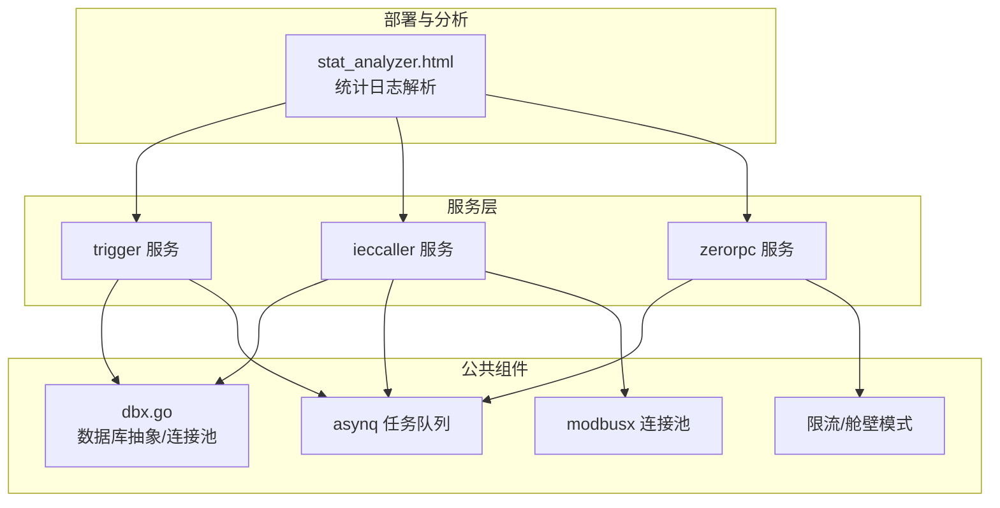
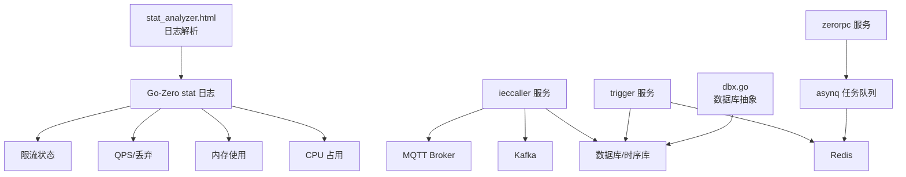
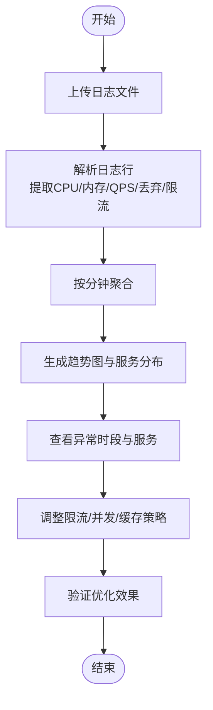
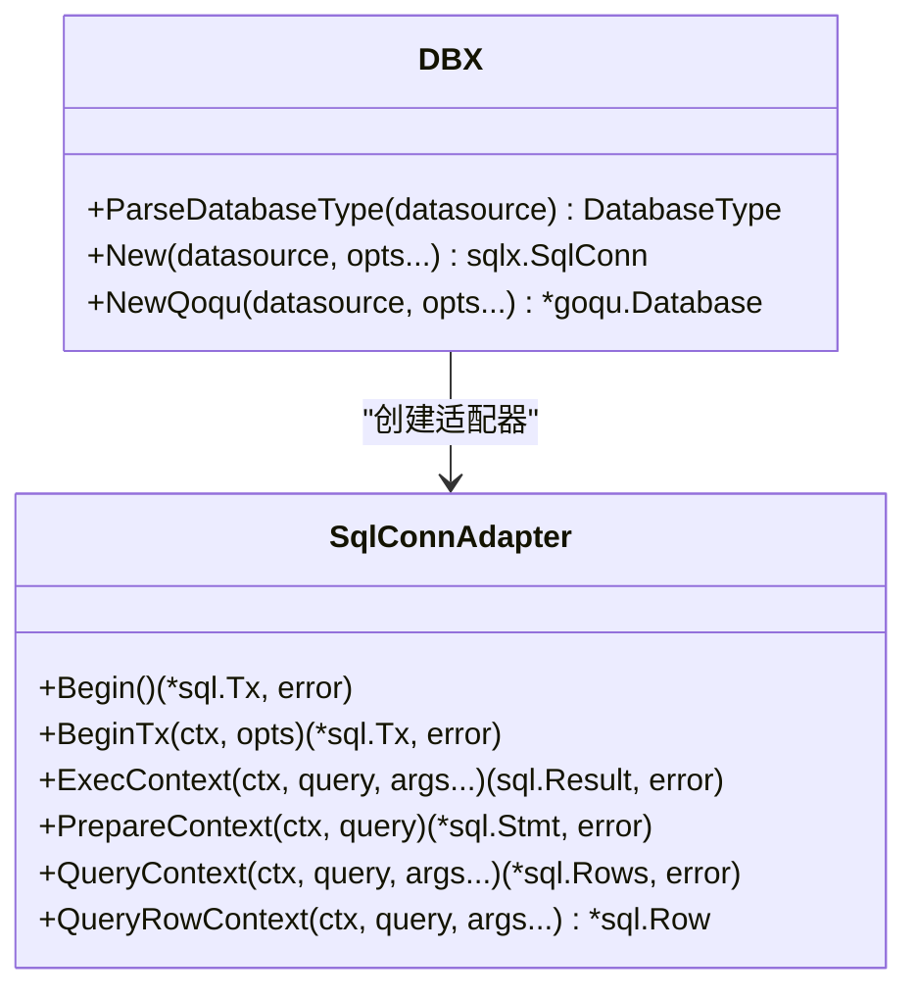
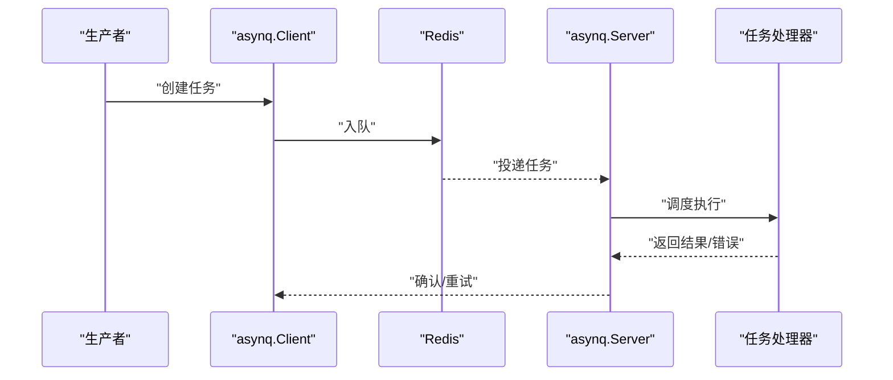
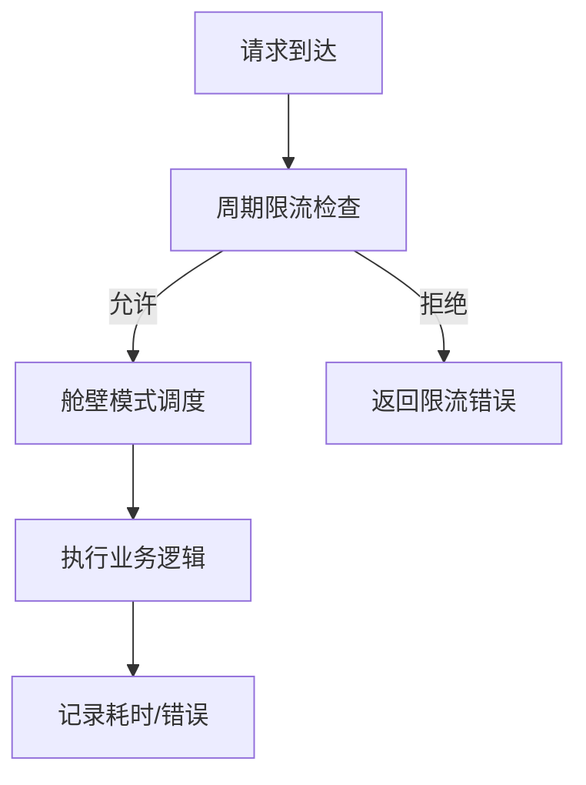
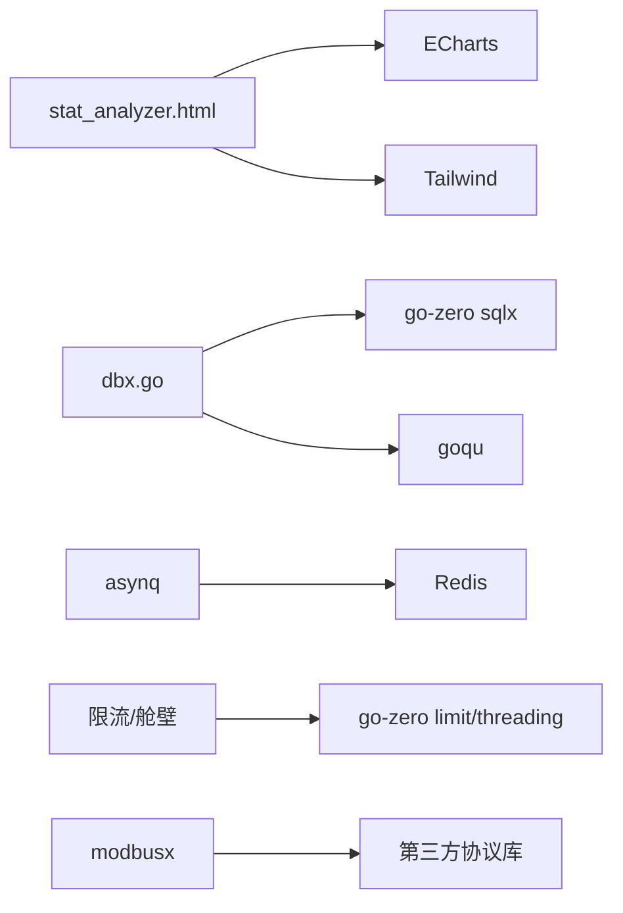

# 性能问题排查

<cite>
**本文引用的文件**
- [README.md](file://README.md)
- [deploy/stat_analyzer.html](file://deploy/stat_analyzer.html)
- [common/dbx/dbx.go](file://common/dbx/dbx.go)
- [zerorpc/internal/config/config.go](file://zerorpc/internal/config/config.go)
- [app/trigger/etc/trigger.yaml](file://app/trigger/etc/trigger.yaml)
- [app/ieccaller/etc/ieccaller.yaml](file://app/ieccaller/etc/ieccaller.yaml)
- [common/asynqx/asynqTaskServer.go](file://common/asynqx/asynqTaskServer.go)
- [common/asynqx/asynqClient.go](file://common/asynqx/asynqClient.go)
- [zerorpc/internal/svc/asynqTaskServer.go](file://zerorpc/internal/svc/asynqTaskServer.go)
- [zerorpc/internal/svc/asynqClient.go](file://zerorpc/internal/svc/asynqClient.go)
- [.trae/skills/zero-skills/references/database-patterns.md](file://.trae/skills/zero-skills/references/database-patterns.md)
- [.trae/skills/zero-skills/references/resilience-patterns.md](file://.trae/skills/zero-skills/references/resilience-patterns.md)
- [common/modbusx/config.go](file://common/modbusx/config.go)
- [model/planexeclogmodel_gen.go](file://model/planexeclogmodel_gen.go)
</cite>

## 目录
1. [简介](#简介)
2. [项目结构](#项目结构)
3. [核心组件](#核心组件)
4. [架构总览](#架构总览)
5. [详细组件分析](#详细组件分析)
6. [依赖分析](#依赖分析)
7. [性能考量](#性能考量)
8. [故障排查指南](#故障排查指南)
9. [结论](#结论)
10. [附录](#附录)

## 简介
本指南面向Zero-Service在生产环境中的性能问题排查，聚焦CPU使用率、内存泄漏、数据库查询、网络延迟、并发与限流等关键领域。结合项目内置的统计日志解析工具与常见最佳实践，提供可落地的定位方法、优化策略与验证手段。

## 项目结构
- 采用go-zero微服务框架，服务以“app/”目录下的独立服务为主，辅以“common/”公共组件库、“deploy/”部署与分析工具、“model/”数据模型与SQL脚本。
- 关键性能相关能力：
  - 统计日志解析工具：deploy/stat_analyzer.html，用于解析Go-Zero stat日志并可视化CPU、内存、QPS、丢弃、限流等指标。
  - 数据库抽象与连接池：common/dbx/dbx.go，统一适配MySQL/PostgreSQL/SQLite/TAOS，并提供连接池适配器。
  - 任务队列：asynq（common/asynqx、zerorpc/internal/svc），支持队列分区、并发控制、中间件与可观测性。
  - 并发与限流：resilience-patterns.md中的周期限流与舱壁模式示例。
  - 协议与桥接：IEC104、Modbus、MQTT等，涉及网络延迟与并发控制要点。

**章节来源**
- [README.md: 59-108:59-108](file://README.md#L59-L108)
- [deploy/stat_analyzer.html: 1-120:1-120](file://deploy/stat_analyzer.html#L1-L120)

## 核心组件
- 统计日志解析工具：支持解析CPU、内存、QPS、丢弃、限流等指标，提供趋势图与服务分布，便于快速定位异常时段与服务。
- 数据库抽象与连接池：自动识别数据库类型，提供统一适配器与goqu方言注册，便于在不同数据库间切换与优化。
- 任务队列（asynq）：支持队列分区、并发度、超时与中间件，便于在高并发场景下进行资源隔离与性能调优。
- 并发与限流：周期限流与舱壁模式，防止突发流量导致资源耗尽。
- 协议桥接与并发：Modbus连接池管理，避免连接泄漏与抖动。

**章节来源**
- [deploy/stat_analyzer.html: 278-377:278-377](file://deploy/stat_analyzer.html#L278-L377)
- [common/dbx/dbx.go: 46-64:46-64](file://common/dbx/dbx.go#L46-L64)
- [.trae/skills/zero-skills/references/resilience-patterns.md: 207-294:207-294](file://.trae/skills/zero-skills/references/resilience-patterns.md#L207-L294)
- [common/modbusx/config.go: 78-124:78-124](file://common/modbusx/config.go#L78-L124)

## 架构总览
下图展示与性能排查直接相关的组件与数据流：

**图表来源**
- [deploy/stat_analyzer.html: 278-377:278-377](file://deploy/stat_analyzer.html#L278-L377)
- [app/ieccaller/etc/ieccaller.yaml: 35-57:35-57](file://app/ieccaller/etc/ieccaller.yaml#L35-L57)
- [app/trigger/etc/trigger.yaml: 19-37:19-37](file://app/trigger/etc/trigger.yaml#L19-L37)

## 详细组件分析

### 组件A：统计日志解析与可视化（stat_analyzer.html）
- 能力概述
  - 解析CPU、内存、QPS、丢弃、限流等指标，按分钟聚合，生成趋势图与服务分布。
  - 支持拖拽上传、分页表格、排序、全屏表格、图表全屏查看等交互。
- 性能指标解读
  - CPU占用：峰值越高，越易触发限流或上下文切换开销上升。
  - 实时内存/系统内存：持续升高可能指示内存泄漏或缓存未清理。
  - QPS与丢弃：丢弃数上升通常意味着限流或上游压力过大。
  - 限流状态：shedding_stat显示是否进入限流阶段。
- 优化策略
  - 结合CPU与丢弃趋势，评估限流阈值与并发配置。
  - 观察内存曲线，配合GC次数与分配量，定位泄漏点。
  - 按服务筛选，对比不同服务的QPS与响应时间分布。

**图表来源**
- [deploy/stat_analyzer.html: 773-800:773-800](file://deploy/stat_analyzer.html#L773-L800)
- [deploy/stat_analyzer.html: 862-941:862-941](file://deploy/stat_analyzer.html#L862-L941)
- [deploy/stat_analyzer.html: 1033-1072:1033-1072](file://deploy/stat_analyzer.html#L1033-L1072)

**章节来源**
- [deploy/stat_analyzer.html: 174-194:174-194](file://deploy/stat_analyzer.html#L174-L194)
- [deploy/stat_analyzer.html: 278-377:278-377](file://deploy/stat_analyzer.html#L278-L377)
- [deploy/stat_analyzer.html: 862-941:862-941](file://deploy/stat_analyzer.html#L862-L941)

### 组件B：数据库抽象与连接池（dbx.go）
- 能力概述
  - 自动识别数据库类型（MySQL/PostgreSQL/SQLite/TAOS），并创建对应连接。
  - 提供SqlConnAdapter适配器，暴露Begin/ExecContext/QueryContext等常用方法。
  - 注册goqu方言，便于SQL构造与日志输出。
- 性能要点
  - 连接池参数直接影响数据库吞吐与延迟：MaxOpenConns、MaxIdleConns、ConnMaxLifetime。
  - 不同数据库的方言与驱动特性不同，需按库优化SQL与索引。
- 优化建议
  - 在服务初始化处显式设置连接池参数，避免默认值不适应生产负载。
  - 使用builder模式（如model/planexeclogmodel_gen.go）减少拼接SQL带来的开销与错误。

**图表来源**
- [common/dbx/dbx.go: 66-104:66-104](file://common/dbx/dbx.go#L66-L104)
- [common/dbx/dbx.go: 112-138:112-138](file://common/dbx/dbx.go#L112-L138)
- [model/planexeclogmodel_gen.go: 410-485:410-485](file://model/planexeclogmodel_gen.go#L410-L485)

**章节来源**
- [common/dbx/dbx.go: 31-64:31-64](file://common/dbx/dbx.go#L31-L64)
- [common/dbx/dbx.go: 112-138:112-138](file://common/dbx/dbx.go#L112-L138)
- [.trae/skills/zero-skills/references/database-patterns.md: 448-480:448-480](file://.trae/skills/zero-skills/references/database-patterns.md#L448-L480)
- [model/planexeclogmodel_gen.go: 410-485:410-485](file://model/planexeclogmodel_gen.go#L410-L485)

### 组件C：任务队列（asynq）与并发控制
- 能力概述
  - 支持队列分区（critical/default/low）、并发度、超时与中间件。
  - 提供生产者/消费者Span埋点，便于链路追踪。
- 性能要点
  - 队列分区用于资源隔离；并发度决定同时处理的任务数。
  - 中间件可用于限流、日志与降级。
- 优化建议
  - 根据任务类型划分队列优先级，避免低优先级任务阻塞高优先级。
  - 通过中间件统计处理耗时与失败率，及时发现慢任务。

**图表来源**
- [common/asynqx/asynqTaskServer.go: 39-64:39-64](file://common/asynqx/asynqTaskServer.go#L39-L64)
- [common/asynqx/asynqClient.go: 17-30:17-30](file://common/asynqx/asynqClient.go#L17-L30)
- [zerorpc/internal/svc/asynqTaskServer.go: 35-58:35-58](file://zerorpc/internal/svc/asynqTaskServer.go#L35-L58)
- [zerorpc/internal/svc/asynqClient.go: 18-27:18-27](file://zerorpc/internal/svc/asynqClient.go#L18-L27)

**章节来源**
- [common/asynqx/asynqTaskServer.go: 39-64:39-64](file://common/asynqx/asynqTaskServer.go#L39-L64)
- [common/asynqx/asynqClient.go: 17-30:17-30](file://common/asynqx/asynqClient.go#L17-L30)
- [zerorpc/internal/svc/asynqTaskServer.go: 35-74:35-74](file://zerorpc/internal/svc/asynqTaskServer.go#L35-L74)
- [zerorpc/internal/svc/asynqClient.go: 18-27:18-27](file://zerorpc/internal/svc/asynqClient.go#L18-L27)

### 组件D：并发与限流（周期限流/舱壁模式）
- 能力概述
  - 周期限流：按时间窗口限制请求数，适合保护下游。
  - 舱壁模式：通过工作池限制并发，避免资源耗尽。
- 性能要点
  - 限流阈值与窗口需结合历史峰值与SLA设定。
  - 舱壁大小与任务粒度匹配，避免过小导致排队过长，过大导致资源争用。
- 优化建议
  - 为不同用户/IP/接口维度分别设置限流。
  - 对批处理任务采用舱壁模式，避免一次性并发过高。

**图表来源**
- [.trae/skills/zero-skills/references/resilience-patterns.md: 207-254:207-254](file://.trae/skills/zero-skills/references/resilience-patterns.md#L207-L254)
- [.trae/skills/zero-skills/references/resilience-patterns.md: 491-517:491-517](file://.trae/skills/zero-skills/references/resilience-patterns.md#L491-L517)

**章节来源**
- [.trae/skills/zero-skills/references/resilience-patterns.md: 207-294:207-294](file://.trae/skills/zero-skills/references/resilience-patterns.md#L207-L294)
- [.trae/skills/zero-skills/references/resilience-patterns.md: 491-517:491-517](file://.trae/skills/zero-skills/references/resilience-patterns.md#L491-L517)

### 组件E：协议桥接与并发（Modbus）
- 能力概述
  - PoolManager按modbusCode维护连接池，支持新增、获取与复用，避免重复创建与泄漏。
- 性能要点
  - 连接池大小需结合设备并发访问与RTU/RTU延迟设定。
  - 通过日志观察是否存在重复创建或长时间占用未释放。
- 优化建议
  - 为不同设备组设置独立池，避免相互影响。
  - 定期巡检池状态，清理异常连接。

**章节来源**
- [common/modbusx/config.go: 78-124:78-124](file://common/modbusx/config.go#L78-L124)

## 依赖分析
- 统计日志解析工具依赖浏览器端ECharts与Tailwind，运行时无需后端依赖。
- 数据库抽象依赖go-zero的sqlx与goqu，以及各数据库驱动。
- 任务队列依赖Redis，服务端与客户端均通过asynq封装。
- 并发与限流依赖go-zero的limit与threading包。
- 协议桥接依赖第三方协议库（如IEC104、Modbus、MQTT）。

**图表来源**
- [deploy/stat_analyzer.html: 7-11:7-11](file://deploy/stat_analyzer.html#L7-L11)
- [common/dbx/dbx.go: 8-20:8-20](file://common/dbx/dbx.go#L8-L20)
- [common/asynqx/asynqTaskServer.go: 39-64:39-64](file://common/asynqx/asynqTaskServer.go#L39-L64)
- [.trae/skills/zero-skills/references/resilience-patterns.md: 207-294:207-294](file://.trae/skills/zero-skills/references/resilience-patterns.md#L207-L294)
- [common/modbusx/config.go: 78-124:78-124](file://common/modbusx/config.go#L78-L124)

**章节来源**
- [deploy/stat_analyzer.html: 7-11:7-11](file://deploy/stat_analyzer.html#L7-L11)
- [common/dbx/dbx.go: 8-20:8-20](file://common/dbx/dbx.go#L8-L20)
- [common/asynqx/asynqTaskServer.go: 39-64:39-64](file://common/asynqx/asynqTaskServer.go#L39-L64)
- [.trae/skills/zero-skills/references/resilience-patterns.md: 207-294:207-294](file://.trae/skills/zero-skills/references/resilience-patterns.md#L207-L294)
- [common/modbusx/config.go: 78-124:78-124](file://common/modbusx/config.go#L78-L124)

## 性能考量
- CPU使用率
  - 通过stat_analyzer的CPU趋势图识别峰值时段，结合限流状态判断是否需要扩容或限流阈值调整。
- 内存使用
  - 持续升高的Alloc/TotalAlloc与频繁GC次数提示内存增长或泄漏，需结合goroutine/连接泄漏排查。
- 数据库查询
  - 使用builder模式与合适的索引，避免全表扫描；合理设置连接池参数。
- 网络延迟
  - IEC104/Modbus/MQTT等协议需关注RTU/设备响应延迟与Broker/Redis延迟。
- 并发与限流
  - 通过asynq队列分区与并发度、周期限流与舱壁模式，实现资源隔离与削峰填谷。

[本节为通用指导，无需具体文件分析]

## 故障排查指南

### CPU使用率异常
- 步骤
  - 使用stat_analyzer定位CPU峰值时段与对应服务。
  - 检查该时段的QPS与丢弃数，判断是否因限流或热点请求导致。
  - 结合任务队列并发度与队列分区，评估是否需要提升并发或增加队列。
- 依据
  - [deploy/stat_analyzer.html: 278-377:278-377](file://deploy/stat_analyzer.html#L278-L377)
  - [common/asynqx/asynqTaskServer.go: 39-64:39-64](file://common/asynqx/asynqTaskServer.go#L39-L64)

**章节来源**
- [deploy/stat_analyzer.html: 278-377:278-377](file://deploy/stat_analyzer.html#L278-L377)
- [common/asynqx/asynqTaskServer.go: 39-64:39-64](file://common/asynqx/asynqTaskServer.go#L39-L64)

### 高内存使用/内存泄漏
- 步骤
  - 查看Alloc/Sys与GC次数趋势，若持续上升且无下降，可能存在泄漏。
  - 结合goroutine/连接泄漏排查：检查数据库连接、Redis连接、MQTT/Modbus连接是否正确关闭。
  - 使用连接池适配器确保底层连接被回收。
- 依据
  - [deploy/stat_analyzer.html: 914-941:914-941](file://deploy/stat_analyzer.html#L914-L941)
  - [common/dbx/dbx.go: 66-104:66-104](file://common/dbx/dbx.go#L66-L104)
  - [common/modbusx/config.go: 78-124:78-124](file://common/modbusx/config.go#L78-L124)

**章节来源**
- [deploy/stat_analyzer.html: 914-941:914-941](file://deploy/stat_analyzer.html#L914-L941)
- [common/dbx/dbx.go: 66-104:66-104](file://common/dbx/dbx.go#L66-L104)
- [common/modbusx/config.go: 78-124:78-124](file://common/modbusx/config.go#L78-L124)

### 数据库慢查询
- 步骤
  - 使用builder模式（如planexeclogmodel_gen.go）生成SQL，避免字符串拼接。
  - 检查连接池参数（MaxOpenConns/MaxIdleConns/ConnMaxLifetime）是否合理。
  - 针对高频查询建立合适索引，避免全表扫描。
- 依据
  - [model/planexeclogmodel_gen.go: 410-485:410-485](file://model/planexeclogmodel_gen.go#L410-L485)
  - [.trae/skills/zero-skills/references/database-patterns.md: 448-480:448-480](file://.trae/skills/zero-skills/references/database-patterns.md#L448-L480)

**章节来源**
- [model/planexeclogmodel_gen.go: 410-485:410-485](file://model/planexeclogmodel_gen.go#L410-L485)
- [.trae/skills/zero-skills/references/database-patterns.md: 448-480:448-480](file://.trae/skills/zero-skills/references/database-patterns.md#L448-L480)

### 网络延迟排查（IEC104/Modbus/MQTT）
- 步骤
  - IEC104/Modbus：检查设备响应时间、协议栈并发（TaskConcurrency）、连接池大小。
  - MQTT：检查Broker延迟、QoS与Topic数量。
- 依据
  - [app/ieccaller/etc/ieccaller.yaml: 35-79:35-79](file://app/ieccaller/etc/ieccaller.yaml#L35-L79)
  - [common/modbusx/config.go: 78-124:78-124](file://common/modbusx/config.go#L78-L124)

**章节来源**
- [app/ieccaller/etc/ieccaller.yaml: 35-79:35-79](file://app/ieccaller/etc/ieccaller.yaml#L35-L79)
- [common/modbusx/config.go: 78-124:78-124](file://common/modbusx/config.go#L78-L124)

### 并发与限流问题
- 步骤
  - 使用周期限流保护下游，按用户/IP/接口维度设置阈值。
  - 对批处理采用舱壁模式，限制并发worker数量。
  - 通过asynq队列分区与并发度，隔离高/低优先级任务。
- 依据
  - [.trae/skills/zero-skills/references/resilience-patterns.md: 207-294:207-294](file://.trae/skills/zero-skills/references/resilience-patterns.md#L207-L294)
  - [.trae/skills/zero-skills/references/resilience-patterns.md: 491-517:491-517](file://.trae/skills/zero-skills/references/resilience-patterns.md#L491-L517)
  - [common/asynqx/asynqTaskServer.go: 39-64:39-64](file://common/asynqx/asynqTaskServer.go#L39-L64)

**章节来源**
- [.trae/skills/zero-skills/references/resilience-patterns.md: 207-294:207-294](file://.trae/skills/zero-skills/references/resilience-patterns.md#L207-L294)
- [.trae/skills/zero-skills/references/resilience-patterns.md: 491-517:491-517](file://.trae/skills/zero-skills/references/resilience-patterns.md#L491-L517)
- [common/asynqx/asynqTaskServer.go: 39-64:39-64](file://common/asynqx/asynqTaskServer.go#L39-L64)

### 性能监控指标解读与优化策略
- 关键指标
  - 响应时间：Avg/Median/P90/P99/P999，用于评估尾延迟。
  - 吞吐量：QPS，反映系统承载能力。
  - 错误率：结合丢弃与异常，评估稳定性。
  - 限流状态：shedding_stat，判断是否触发限流。
- 优化策略
  - 通过stat_analyzer对比不同服务的指标差异，定位瓶颈服务。
  - 调整限流阈值、并发度与队列分区，观察指标变化。
- 依据
  - [deploy/stat_analyzer.html: 1145-1174:1145-1174](file://deploy/stat_analyzer.html#L1145-L1174)
  - [deploy/stat_analyzer.html: 1200-1307:1200-1307](file://deploy/stat_analyzer.html#L1200-L1307)

**章节来源**
- [deploy/stat_analyzer.html: 1145-1174:1145-1174](file://deploy/stat_analyzer.html#L1145-L1174)
- [deploy/stat_analyzer.html: 1200-1307:1200-1307](file://deploy/stat_analyzer.html#L1200-L1307)

### 实际案例：诊断流程与优化验证
- 诊断流程
  - 采集stat日志 → 使用stat_analyzer解析 → 定位异常时段与服务 → 检查数据库/网络/并发配置 → 调整限流/队列/连接池 → 再次采集与对比。
- 优化验证
  - 对比优化前后CPU/内存/QPS/丢弃与限流状态的变化，确认改善。
- 依据
  - [deploy/stat_analyzer.html: 174-194:174-194](file://deploy/stat_analyzer.html#L174-L194)
  - [deploy/stat_analyzer.html: 278-377:278-377](file://deploy/stat_analyzer.html#L278-L377)

**章节来源**
- [deploy/stat_analyzer.html: 174-194:174-194](file://deploy/stat_analyzer.html#L174-L194)
- [deploy/stat_analyzer.html: 278-377:278-377](file://deploy/stat_analyzer.html#L278-L377)

## 结论
通过stat_analyzer的可视化分析、dbx的连接池与SQL构造、asynq的任务队列与并发控制、以及周期限流与舱壁模式，可以系统性地定位并解决Zero-Service的性能问题。建议在生产环境中持续采集stat日志，定期回顾关键指标，结合配置优化形成闭环。

[本节为总结，无需具体文件分析]

## 附录
- 配置参考
  - trigger服务：Redis、DB、StreamEventConf等。
  - ieccaller服务：Kafka、MQTT、IEC从站并发等。
- 依据
  - [app/trigger/etc/trigger.yaml: 19-37:19-37](file://app/trigger/etc/trigger.yaml#L19-L37)
  - [app/ieccaller/etc/ieccaller.yaml: 35-79:35-79](file://app/ieccaller/etc/ieccaller.yaml#L35-L79)
  - [zerorpc/internal/config/config.go: 8-24:8-24](file://zerorpc/internal/config/config.go#L8-L24)

**章节来源**
- [app/trigger/etc/trigger.yaml: 19-37:19-37](file://app/trigger/etc/trigger.yaml#L19-L37)
- [app/ieccaller/etc/ieccaller.yaml: 35-79:35-79](file://app/ieccaller/etc/ieccaller.yaml#L35-L79)
- [zerorpc/internal/config/config.go: 8-24:8-24](file://zerorpc/internal/config/config.go#L8-L24)