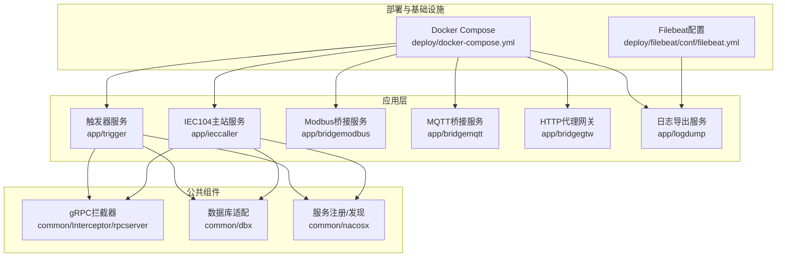
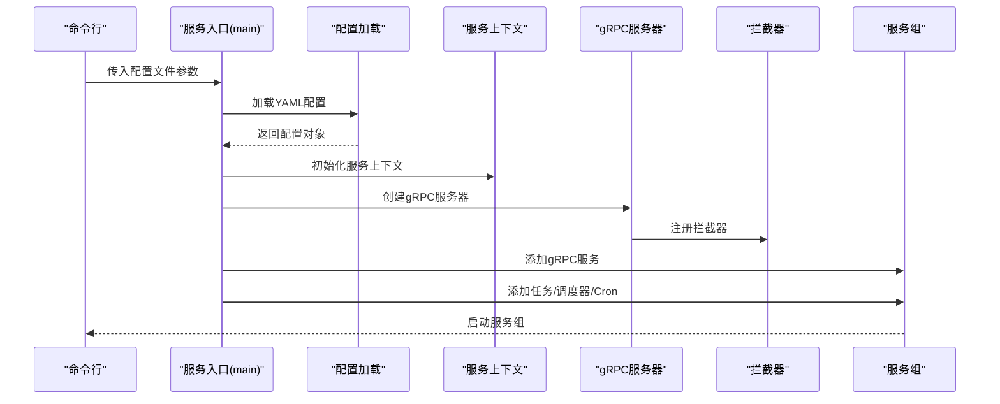
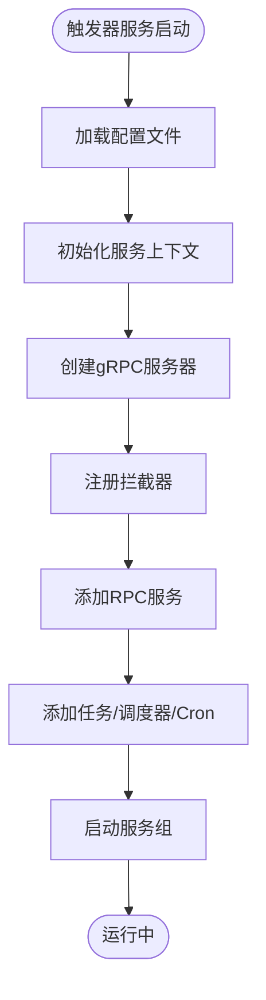
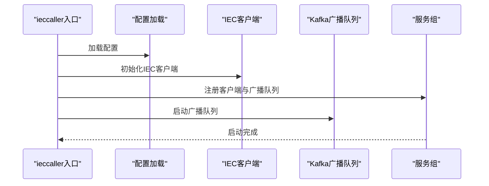
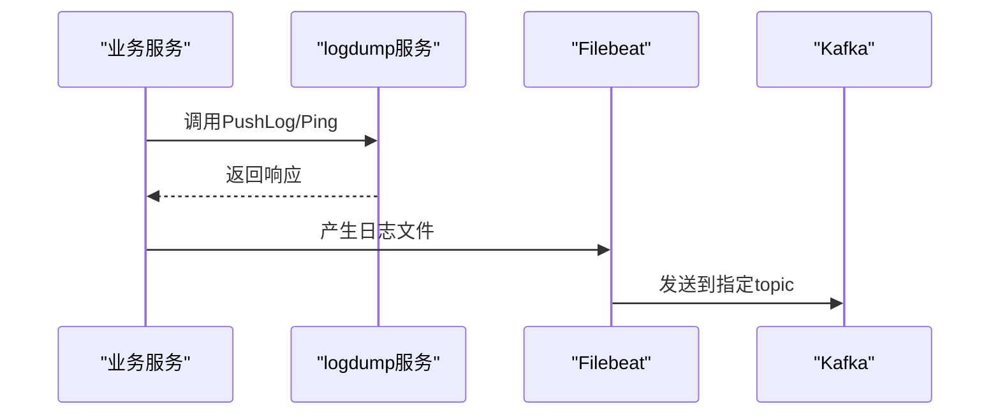
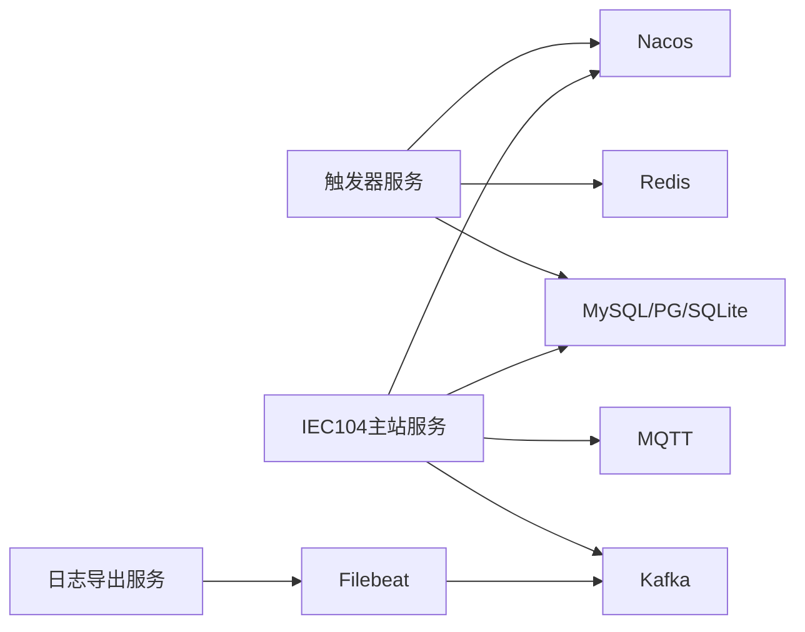

# 故障排查

<cite>
**本文引用的文件**   
- [README.md](file://README.md)
- [.trae/skills/zero-skills/troubleshooting/common-issues.md](file://.trae/skills/zero-skills/troubleshooting/common-issues.md)
- [deploy/docker-compose.yml](file://deploy/docker-compose.yml)
- [deploy/filebeat/conf/filebeat.yml](file://deploy/filebeat/conf/filebeat.yml)
- [app/trigger/etc/trigger.yaml](file://app/trigger/etc/trigger.yaml)
- [app/ieccaller/etc/ieccaller.yaml](file://app/ieccaller/etc/ieccaller.yaml)
- [app/trigger/trigger.go](file://app/trigger/trigger.go)
- [app/ieccaller/ieccaller.go](file://app/ieccaller/ieccaller.go)
- [common/Interceptor/rpcserver/loggerInterceptor.go](file://common/Interceptor/rpcserver/loggerInterceptor.go)
- [common/dbx/dbx.go](file://common/dbx/dbx.go)
- [app/logdump/logdump/logdump_grpc.pb.go](file://app/logdump/logdump/logdump_grpc.pb.go)
- [deploy/stat_analyzer.html](file://deploy/stat_analyzer.html)
</cite>

## 目录
1. [简介](#简介)
2. [项目结构](#项目结构)
3. [核心组件](#核心组件)
4. [架构总览](#架构总览)
5. [详细组件分析](#详细组件分析)
6. [依赖分析](#依赖分析)
7. [性能考虑](#性能考虑)
8. [故障排查指南](#故障排查指南)
9. [结论](#结论)
10. [附录](#附录)

## 简介
本指南面向Zero-Service项目使用者与运维人员，围绕服务启动失败、连接超时、数据不一致、性能瓶颈等常见问题，提供系统化的诊断流程与解决方案；同时涵盖日志分析方法、性能定位手段、系统监控与告警配置、调试工具使用以及不同环境下的排查策略，并给出问题报告模板与社区支持渠道。

## 项目结构
Zero-Service采用go-zero微服务架构，围绕BFF网关、实时通信、协议桥接、任务调度、地理信息、容器管理等模块组织服务；部署通过Docker Compose编排，结合Kafka、Filebeat、Nacos等基础设施支撑数据流与可观测性。

图表来源
- [deploy/docker-compose.yml:1-110](file://deploy/docker-compose.yml#L1-L110)
- [app/trigger/trigger.go:1-89](file://app/trigger/trigger.go#L1-L89)
- [app/ieccaller/ieccaller.go:1-123](file://app/ieccaller/ieccaller.go#L1-L123)
- [common/Interceptor/rpcserver/loggerInterceptor.go:1-45](file://common/Interceptor/rpcserver/loggerInterceptor.go#L1-L45)
- [common/dbx/dbx.go:1-155](file://common/dbx/dbx.go#L1-L155)

章节来源
- [README.md:15-108](file://README.md#L15-L108)
- [deploy/docker-compose.yml:1-110](file://deploy/docker-compose.yml#L1-L110)

## 核心组件
- 触发器服务（Trigger）：基于asynq的任务调度与计划任务引擎，支持HTTP/gRPC回调、分布式锁、状态机与历史统计。
- IEC104主站服务（ieccaller）：多从站并行通信、Kafka/MQTT/gRPC三协议推送、内嵌SQLite动态配置。
- 日志导出服务（logdump）：提供gRPC接口用于接收与导出日志，便于集中化日志采集与分析。
- gRPC拦截器（LoggerInterceptor）：统一注入用户上下文与TraceId，并记录RPC错误，辅助问题定位。
- 数据库适配（dbx）：自动识别MySQL/PostgreSQL/SQLite/TAOS数据源并建立连接，支持SQL与ORM操作。

章节来源
- [README.md:110-155](file://README.md#L110-L155)
- [app/trigger/etc/trigger.yaml:1-37](file://app/trigger/etc/trigger.yaml#L1-L37)
- [app/ieccaller/etc/ieccaller.yaml:1-79](file://app/ieccaller/etc/ieccaller.yaml#L1-L79)
- [common/Interceptor/rpcserver/loggerInterceptor.go:1-45](file://common/Interceptor/rpcserver/loggerInterceptor.go#L1-L45)
- [common/dbx/dbx.go:1-155](file://common/dbx/dbx.go#L1-L155)

## 架构总览
下图展示服务启动与关键依赖关系，包括配置加载、服务注册、拦截器注入与服务组启动流程。

图表来源
- [app/trigger/trigger.go:34-88](file://app/trigger/trigger.go#L34-L88)
- [app/ieccaller/ieccaller.go:42-122](file://app/ieccaller/ieccaller.go#L42-L122)
- [common/Interceptor/rpcserver/loggerInterceptor.go:12-44](file://common/Interceptor/rpcserver/loggerInterceptor.go#L12-L44)

## 详细组件分析

### 触发器服务（Trigger）故障排查
- 启动失败
  - 检查端口占用与配置文件路径是否正确，参考常见问题中的“端口占用”与“配置未加载”排查步骤。
  - 确认Redis与数据库连接正常，必要时调整超时与凭据。
- 连接超时
  - 增大客户端超时或在调用侧传递带超时的context。
- 数据不一致
  - 核对事务回滚逻辑，确保错误被返回以触发回滚。
- 性能瓶颈
  - 关注goroutine泄漏与连接池并发限制，避免无限循环与未停止的ticker。

图表来源
- [app/trigger/trigger.go:34-88](file://app/trigger/trigger.go#L34-L88)

章节来源
- [.trae/skills/zero-skills/troubleshooting/common-issues.md:113-131](file://.trae/skills/zero-skills/troubleshooting/common-issues.md#L113-L131)
- [.trae/skills/zero-skills/troubleshooting/common-issues.md:171-211](file://.trae/skills/zero-skills/troubleshooting/common-issues.md#L171-L211)
- [.trae/skills/zero-skills/troubleshooting/common-issues.md:494-531](file://.trae/skills/zero-skills/troubleshooting/common-issues.md#L494-L531)
- [.trae/skills/zero-skills/troubleshooting/common-issues.md:678-724](file://.trae/skills/zero-skills/troubleshooting/common-issues.md#L678-L724)

### IEC104主站服务（ieccaller）故障排查
- 启动失败
  - 检查IEC从站地址、端口与定时任务配置；确认Kafka/MQTT/数据库连接参数正确。
- 连接超时
  - 调整超时时间或在调用侧传递带超时的context。
- 数据不一致
  - 核对ASDU推送与Kafka广播配置，确保批次大小与GracePeriod合理。
- 性能瓶颈
  - 控制并发与批处理大小，避免过多协程导致资源争用。

图表来源
- [app/ieccaller/ieccaller.go:42-122](file://app/ieccaller/ieccaller.go#L42-L122)
- [app/ieccaller/etc/ieccaller.yaml:22-79](file://app/ieccaller/etc/ieccaller.yaml#L22-L79)

章节来源
- [app/ieccaller/etc/ieccaller.yaml:1-79](file://app/ieccaller/etc/ieccaller.yaml#L1-L79)
- [.trae/skills/zero-skills/troubleshooting/common-issues.md:362-395](file://.trae/skills/zero-skills/troubleshooting/common-issues.md#L362-L395)

### 日志导出服务（logdump）与日志采集
- gRPC接口
  - 服务定义包含Ping与PushLog方法，若未实现将返回未实现错误，应检查服务实现与注册。
- 日志采集
  - Filebeat配置监听指定目录的JSON文件，按topic动态写入Kafka；可通过调整扫描频率、忽略旧文件与清理策略优化性能。

图表来源
- [app/logdump/logdump/logdump_grpc.pb.go:107-141](file://app/logdump/logdump/logdump_grpc.pb.go#L107-L141)
- [deploy/filebeat/conf/filebeat.yml:1-122](file://deploy/filebeat/conf/filebeat.yml#L1-L122)

章节来源
- [app/logdump/logdump/logdump_grpc.pb.go:80-161](file://app/logdump/logdump/logdump_grpc.pb.go#L80-L161)
- [deploy/filebeat/conf/filebeat.yml:1-122](file://deploy/filebeat/conf/filebeat.yml#L1-L122)

## 依赖分析
- 配置与环境
  - 各服务通过etc目录下的YAML配置文件进行初始化，包含日志、Redis、Kafka、数据库、Nacos等关键依赖。
- 服务注册与发现
  - 通过Nacos进行服务注册与发现，便于跨服务调用与负载均衡。
- 数据库适配
  - dbx根据数据源URL自动识别数据库类型并建立连接，减少手工配置错误。

图表来源
- [app/trigger/etc/trigger.yaml:19-37](file://app/trigger/etc/trigger.yaml#L19-L37)
- [app/ieccaller/etc/ieccaller.yaml:35-79](file://app/ieccaller/etc/ieccaller.yaml#L35-L79)
- [deploy/docker-compose.yml:5-110](file://deploy/docker-compose.yml#L5-L110)
- [common/dbx/dbx.go:31-64](file://common/dbx/dbx.go#L31-L64)

章节来源
- [app/trigger/etc/trigger.yaml:1-37](file://app/trigger/etc/trigger.yaml#L1-L37)
- [app/ieccaller/etc/ieccaller.yaml:1-79](file://app/ieccaller/etc/ieccaller.yaml#L1-L79)
- [deploy/docker-compose.yml:1-110](file://deploy/docker-compose.yml#L1-L110)
- [common/dbx/dbx.go:1-155](file://common/dbx/dbx.go#L1-L155)

## 性能考虑
- CPU使用率分析
  - 使用pprof或系统工具观察热点函数与阻塞点，结合日志中的耗时统计定位慢调用。
- 内存泄漏检测
  - 关注goroutine泄漏与未释放的资源，确保循环ticker与通道读写在上下文取消时退出。
- 数据库查询优化
  - 为高频查询添加索引，使用分页与缓存降低压力；避免一次性加载全量数据。
- 网络延迟排查
  - 检查Kafka/MQTT/Redis连接参数与超时设置，必要时增大连接数与消费者数量。

章节来源
- [.trae/skills/zero-skills/troubleshooting/common-issues.md:678-762](file://.trae/skills/zero-skills/troubleshooting/common-issues.md#L678-L762)

## 故障排查指南

### 服务启动失败
- 端口占用
  - 使用系统工具查找占用进程并释放，或在配置中更换端口。
- 配置未加载
  - 确认配置文件路径与权限，使用绝对路径或显式相对路径。
- 依赖未就绪
  - 检查Redis/Kafka/数据库连通性与认证信息。

章节来源
- [.trae/skills/zero-skills/troubleshooting/common-issues.md:113-131](file://.trae/skills/zero-skills/troubleshooting/common-issues.md#L113-L131)
- [.trae/skills/zero-skills/troubleshooting/common-issues.md:613-636](file://.trae/skills/zero-skills/troubleshooting/common-issues.md#L613-L636)

### 连接超时
- gRPC超时
  - 在客户端增大超时或在调用侧传递带超时的context。
- 中间件/拦截器
  - 确保拦截器链顺序正确，避免中间件阻塞导致超时。

章节来源
- [.trae/skills/zero-skills/troubleshooting/common-issues.md:362-395](file://.trae/skills/zero-skills/troubleshooting/common-issues.md#L362-L395)
- [common/Interceptor/rpcserver/loggerInterceptor.go:12-44](file://common/Interceptor/rpcserver/loggerInterceptor.go#L12-L44)

### 数据不一致
- 事务回滚
  - 确保错误被返回以触发回滚，避免静默提交。
- 缓存一致性
  - 更新后主动清理缓存键，避免脏读。

章节来源
- [.trae/skills/zero-skills/troubleshooting/common-issues.md:494-531](file://.trae/skills/zero-skills/troubleshooting/common-issues.md#L494-L531)
- [.trae/skills/zero-skills/troubleshooting/common-issues.md:463-493](file://.trae/skills/zero-skills/troubleshooting/common-issues.md#L463-L493)

### 性能瓶颈
- 高内存使用
  - 检查goroutine泄漏与未停止的ticker；限制并发连接数。
- 慢查询
  - 为常用查询添加索引，使用分页与缓存；开启数据库慢查询日志分析。

章节来源
- [.trae/skills/zero-skills/troubleshooting/common-issues.md:678-762](file://.trae/skills/zero-skills/troubleshooting/common-issues.md#L678-L762)

### 日志分析方法
- 日志级别与输出
  - 在配置中设置日志级别与输出模式，开发环境建议控制台输出，生产环境建议文件输出并配置轮转。
- 关键日志识别
  - gRPC错误日志、RPC拦截器注入的TraceId、数据库SQL日志与错误码。
- 错误堆栈分析
  - 结合拦截器记录的错误上下文与TraceId，快速定位调用链路。
- 根因定位技巧
  - 从上游服务（如ieccaller）到下游系统（Kafka/MQTT/数据库）逐层验证依赖连通性与配置。

章节来源
- [.trae/skills/zero-skills/troubleshooting/common-issues.md:763-800](file://.trae/skills/zero-skills/troubleshooting/common-issues.md#L763-L800)
- [common/Interceptor/rpcserver/loggerInterceptor.go:12-44](file://common/Interceptor/rpcserver/loggerInterceptor.go#L12-L44)
- [app/trigger/etc/trigger.yaml:5-11](file://app/trigger/etc/trigger.yaml#L5-L11)
- [app/ieccaller/etc/ieccaller.yaml:7-12](file://app/ieccaller/etc/ieccaller.yaml#L7-L12)

### 系统监控与告警配置
- 关键指标监控
  - CPU、内存、磁盘、网络、连接数、队列长度、任务积压、错误率。
- 异常检测
  - 基于阈值与趋势的异常检测，结合日志与指标联动。
- 自动告警
  - 通过监控系统（如Prometheus+Grafana）配置告警规则，结合消息队列或IM通道推送告警。

章节来源
- [README.md:220-225](file://README.md#L220-L225)

### 调试工具使用
- gRPC调试
  - 使用反射服务（开发/测试模式）查看服务方法；结合拦截器打印请求与错误。
- 数据库调试
  - 使用dbx自动识别数据库类型并建立连接，结合SQL日志与索引分析。
- 消息队列调试
  - 通过Kafdrop查看Kafka主题与偏移；使用Filebeat验证日志采集路径与topic映射。
- 网络调试工具
  - 使用telnet/nc验证端口连通性，使用ping/traceroute排查网络路径。

章节来源
- [app/trigger/trigger.go:49-52](file://app/trigger/trigger.go#L49-L52)
- [app/ieccaller/ieccaller.go:56-58](file://app/ieccaller/ieccaller.go#L56-L58)
- [common/dbx/dbx.go:31-64](file://common/dbx/dbx.go#L31-L64)
- [deploy/docker-compose.yml:101-110](file://deploy/docker-compose.yml#L101-L110)
- [deploy/filebeat/conf/filebeat.yml:110-122](file://deploy/filebeat/conf/filebeat.yml#L110-L122)

### 不同环境下的问题排查策略
- 开发环境
  - 使用console日志、开启反射服务、简化依赖（本地Redis/Kafka），便于快速定位问题。
- 测试环境
  - 与生产相近的依赖拓扑，重点验证配置与数据一致性。
- 生产环境
  - 严格控制日志级别与输出模式，启用Nacos服务注册与发现，完善监控与告警。

章节来源
- [app/trigger/etc/trigger.yaml:3-4](file://app/trigger/etc/trigger.yaml#L3-L4)
- [app/ieccaller/etc/ieccaller.yaml:4](file://app/ieccaller/etc/ieccaller.yaml#L4)
- [deploy/docker-compose.yml:1-110](file://deploy/docker-compose.yml#L1-L110)

### 问题报告模板
- 服务名称与版本
- 环境信息（开发/测试/生产）
- 复现步骤与期望/实际结果
- 相关日志片段与错误码
- 配置要点（关键参数）
- 已尝试的解决措施
- 附加信息（截图/附件）

### 社区支持渠道
- GitHub Issues：用于反馈问题与需求
- 相关技术栈社区：go-zero、asynq、Kafka、MQTT、Nacos等

章节来源
- [README.md:343-350](file://README.md#L343-L350)

## 结论
通过规范的配置管理、完善的日志与监控体系、合理的性能优化与调试工具使用，Zero-Service能够在复杂工业场景中保持稳定运行。建议在开发阶段即建立标准化的故障排查流程与告警机制，持续迭代以提升系统韧性与可维护性。

## 附录
- 部署编排与基础设施
  - Docker Compose默认包含Kafka、Filebeat、ieccaller、bridgegtw、bridgedump等核心服务，便于快速搭建测试环境。
- 日志可视化分析
  - 提供HTML统计分析页面，支持按时间排序与服务过滤，辅助定位异常时段与服务分布。

章节来源
- [deploy/docker-compose.yml:1-110](file://deploy/docker-compose.yml#L1-L110)
- [deploy/stat_analyzer.html:1006-1036](file://deploy/stat_analyzer.html#L1006-L1036)