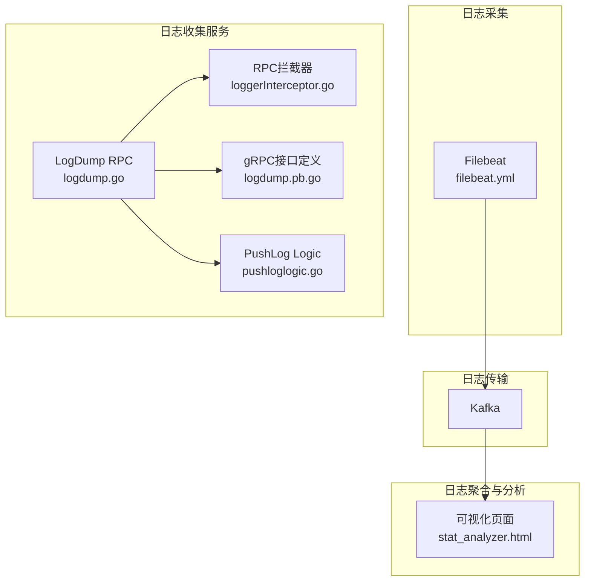
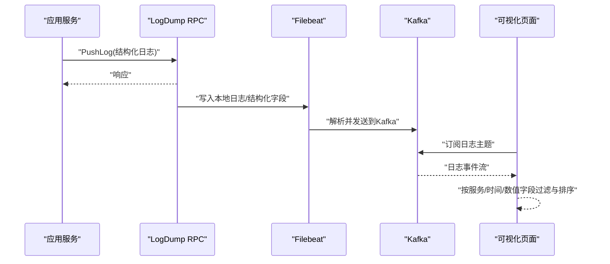

# 日志分析方法

<cite>
**本文引用的文件**
- [日志采集与转发配置](file://deploy/filebeat/conf/filebeat.yml)
- [日志聚合可视化页面](file://deploy/stat_analyzer.html)
- [日志收集服务配置](file://app/logdump/etc/logdump.yaml)
- [日志收集服务入口](file://app/logdump/logdump.go)
- [日志收集服务逻辑](file://app/logdump/internal/logic/pushloglogic.go)
- [日志收集服务gRPC接口定义](file://app/logdump/logdump/logdump.pb.go)
- [日志收集服务gRPC服务端实现](file://app/logdump/internal/server/logdumpserver.go)
- [RPC服务端日志拦截器](file://common/Interceptor/rpcserver/loggerInterceptor.go)
- [RPC客户端元数据拦截器](file://common/Interceptor/rpcclient/metadataInterceptor.go)
- [通用日志封装（IEC104）](file://common/iec104/log.go)
- [最佳实践与日志规范](file://.trae/skills/zero-skills/best-practices/overview.md)
- [常见问题排查指南](file://.trae/skills/zero-skills/troubleshooting/common-issues.md)
- [弹性与超时模式参考](file://.trae/skills/zero-skills/references/resilience-patterns.md)
- [错误码枚举定义](file://third_party/extproto/extproto.pb.go)
- [Kubernetes Pod日志查看脚本](file://util/dockeru/pod-log-app.sh)
- [Kubernetes Pod交互脚本](file://util/dockeru/pod-enter-app.sh)
</cite>

## 目录
1. [简介](#简介)
2. [项目结构](#项目结构)
3. [核心组件](#核心组件)
4. [架构总览](#架构总览)
5. [详细组件分析](#详细组件分析)
6. [依赖分析](#依赖分析)
7. [性能考量](#性能考量)
8. [故障排查指南](#故障排查指南)
9. [结论](#结论)
10. [附录](#附录)

## 简介
本指南面向Zero-Service项目的开发者与运维人员，系统化讲解如何基于项目内置的日志体系进行高效分析与定位。内容涵盖：
- 日志级别与模式配置（控制台/文件）
- 关键日志识别与错误堆栈分析
- 根因定位策略（服务启动失败、连接超时、数据库异常、RPC调用失败）
- 日志过滤与搜索技巧（时间范围、关键字、错误码统计）
- 日志聚合与分析工具使用（Filebeat、Kafka、可视化页面）

## 项目结构
围绕日志分析的关键文件分布如下：
- 日志采集与转发：deploy/filebeat/conf/filebeat.yml
- 日志聚合与可视化：deploy/stat_analyzer.html
- 日志收集服务（RPC）：app/logdump/*
- RPC拦截器：common/Interceptor/rpcserver/loggerInterceptor.go、common/Interceptor/rpcclient/metadataInterceptor.go
- 通用日志封装：common/iec104/log.go
- 最佳实践与日志规范：.trae/skills/zero-skills/best-practices/overview.md
- 常见问题排查：.trae/skills/zero-skills/troubleshooting/common-issues.md
- 弹性与超时模式：.trae/skills/zero-skills/references/resilience-patterns.md
- 错误码枚举：third_party/extproto/extproto.pb.go
- Kubernetes工具：util/dockeru/*

图表来源
- [日志采集与转发配置:1-122](file://deploy/filebeat/conf/filebeat.yml#L1-L122)
- [日志聚合可视化页面:1006-1036](file://deploy/stat_analyzer.html#L1006-L1036)
- [日志收集服务入口:27-70](file://app/logdump/logdump.go#L27-L70)
- [日志收集服务逻辑:28-67](file://app/logdump/internal/logic/pushloglogic.go#L28-L67)
- [日志收集服务gRPC接口定义:318-409](file://app/logdump/logdump/logdump.pb.go#L318-L409)
- [RPC服务端日志拦截器:12-44](file://common/Interceptor/rpcserver/loggerInterceptor.go#L12-L44)

章节来源
- [日志采集与转发配置:1-122](file://deploy/filebeat/conf/filebeat.yml#L1-L122)
- [日志聚合可视化页面:1006-1036](file://deploy/stat_analyzer.html#L1006-L1036)
- [日志收集服务入口:27-70](file://app/logdump/logdump.go#L27-L70)

## 核心组件
- 日志收集服务（LogDump RPC）
  - 提供Ping与PushLog两个gRPC方法，用于远端推送日志并落盘或转发。
  - 支持通过配置文件控制日志编码、输出模式、保留天数等。
- RPC拦截器
  - 服务端拦截器在发生错误时统一输出结构化错误日志，便于集中检索。
  - 客户端拦截器在请求上下文中注入用户、授权、追踪等元数据，增强日志可关联性。
- Filebeat/Kafka/可视化
  - Filebeat监听指定目录，解析桥接数据并发送至Kafka；可视化页面支持按服务、时间、数值字段排序与过滤。

章节来源
- [日志收集服务配置:1-26](file://app/logdump/etc/logdump.yaml#L1-L26)
- [日志收集服务入口:38-69](file://app/logdump/logdump.go#L38-L69)
- [日志收集服务逻辑:28-67](file://app/logdump/internal/logic/pushloglogic.go#L28-L67)
- [RPC服务端日志拦截器:12-44](file://common/Interceptor/rpcserver/loggerInterceptor.go#L12-L44)
- [RPC客户端元数据拦截器:11-32](file://common/Interceptor/rpcclient/metadataInterceptor.go#L11-L32)
- [日志采集与转发配置:1-122](file://deploy/filebeat/conf/filebeat.yml#L1-L122)
- [日志聚合可视化页面:1006-1036](file://deploy/stat_analyzer.html#L1006-L1036)

## 架构总览
下图展示从应用侧日志到可视化分析的完整链路。

图表来源
- [日志收集服务入口:38-69](file://app/logdump/logdump.go#L38-L69)
- [日志收集服务逻辑:28-67](file://app/logdump/internal/logic/pushloglogic.go#L28-L67)
- [日志采集与转发配置:1-122](file://deploy/filebeat/conf/filebeat.yml#L1-L122)
- [日志聚合可视化页面:1006-1036](file://deploy/stat_analyzer.html#L1006-L1036)

## 详细组件分析

### 日志级别与模式配置
- 日志级别
  - 服务端统一使用结构化日志库，支持info/error等级别；在PushLog中根据日志条目级别映射输出。
- 日志模式
  - 控制台输出与文件输出可通过配置切换；文件模式下支持路径、大小轮转、保留天数等。
- 编码格式
  - 支持plain/json两种编码，便于Filebeat解析与可视化。

章节来源
- [日志收集服务配置:7-12](file://app/logdump/etc/logdump.yaml#L7-L12)
- [日志收集服务逻辑:59-64](file://app/logdump/internal/logic/pushloglogic.go#L59-L64)
- [最佳实践与日志规范:248-260](file://.trae/skills/zero-skills/best-practices/overview.md#L248-L260)

### 日志模式配置（控制台 vs 文件）
- 控制台模式
  - 适用于开发/测试环境，便于实时观察。
- 文件模式
  - 生产环境推荐，配合Filebeat采集与Kafka传输，提升稳定性与可观测性。

章节来源
- [日志收集服务配置:7-12](file://app/logdump/etc/logdump.yaml#L7-L12)
- [日志采集与转发配置:1-122](file://deploy/filebeat/conf/filebeat.yml#L1-L122)

### 关键日志识别技巧
- 结构化字段
  - 通过额外字段（如orderId、userId、taskId、taskGuid、errorCode）进行过滤与聚合。
- 服务标识
  - 日志条目包含service字段，可用于按服务维度筛选。
- 错误标记
  - 服务端拦截器对RPC错误进行统一标记输出，便于快速定位。

章节来源
- [日志收集服务配置:21-25](file://app/logdump/etc/logdump.yaml#L21-L25)
- [日志收集服务逻辑:36-49](file://app/logdump/internal/logic/pushloglogic.go#L36-L49)
- [RPC服务端日志拦截器:40-42](file://common/Interceptor/rpcserver/loggerInterceptor.go#L40-L42)

### 错误堆栈分析方法
- RPC错误捕获
  - 服务端拦截器在handler返回err时统一记录错误，结合traceId、用户信息可快速回溯。
- gRPC状态码处理
  - 建议在客户端按status.Code分类处理，避免直接比较错误对象导致的误判。

章节来源
- [RPC服务端日志拦截器:40-42](file://common/Interceptor/rpcserver/loggerInterceptor.go#L40-L42)
- [常见问题排查指南:396-433](file://.trae/skills/zero-skills/troubleshooting/common-issues.md#L396-L433)

### 根因定位策略
- 服务启动失败
  - 查看启动日志与端口占用情况；必要时调整端口或释放被占用进程。
- 连接超时
  - 检查客户端超时配置与服务端负载；结合可视化页面观察QPS、延迟指标。
- 数据库异常
  - 关注SQL语法错误、连接字符串格式、主机名解析失败等典型症状。
- RPC调用失败
  - 检查注册中心配置一致性、服务发现可用性、gRPC状态码与错误处理。

章节来源
- [常见问题排查指南:113-131](file://.trae/skills/zero-skills/troubleshooting/common-issues.md#L113-L131)
- [常见问题排查指南:133-160](file://.trae/skills/zero-skills/troubleshooting/common-issues.md#L133-L160)
- [常见问题排查指南:320-360](file://.trae/skills/zero-skills/troubleshooting/common-issues.md#L320-L360)
- [常见问题排查指南:362-394](file://.trae/skills/zero-skills/troubleshooting/common-issues.md#L362-L394)

### 日志过滤与搜索技巧
- 时间范围筛选
  - 可视化页面支持按时间排序与过滤，便于聚焦异常时间段。
- 关键字匹配
  - 利用服务名、traceId、错误码等字段进行精确匹配。
- 错误码统计
  - 结合错误码枚举与额外字段，统计各类错误占比与趋势。

章节来源
- [日志聚合可视化页面:1006-1036](file://deploy/stat_analyzer.html#L1006-L1036)
- [错误码枚举定义:66-113](file://third_party/extproto/extproto.pb.go#L66-L113)

### 日志聚合与分析工具使用
- Filebeat
  - 监听桥接数据目录，多行解析、JSON解码、字段抽取后投递Kafka。
- Kafka
  - 作为日志传输通道，支持高吞吐与可靠性保障。
- 可视化页面
  - 支持服务过滤、排序、统计，辅助快速定位问题。

章节来源
- [日志采集与转发配置:4-72](file://deploy/filebeat/conf/filebeat.yml#L4-L72)
- [日志采集与转发配置:84-105](file://deploy/filebeat/conf/filebeat.yml#L84-L105)
- [日志采集与转发配置:110-118](file://deploy/filebeat/conf/filebeat.yml#L110-L118)
- [日志聚合可视化页面:1006-1036](file://deploy/stat_analyzer.html#L1006-L1036)

## 依赖分析
- 组件耦合
  - 日志收集服务通过gRPC提供能力，客户端通过拦截器注入上下文信息，降低耦合度。
- 外部依赖
  - Filebeat/Kafka用于日志采集与传输；Nacos可选注册服务（当前配置未启用）。
- 潜在风险
  - 日志过多可能导致存储压力，需合理设置轮转与保留策略。

图表来源
- [RPC客户端元数据拦截器:11-32](file://common/Interceptor/rpcclient/metadataInterceptor.go#L11-L32)
- [日志收集服务入口:38-69](file://app/logdump/logdump.go#L38-L69)
- [日志采集与转发配置:1-122](file://deploy/filebeat/conf/filebeat.yml#L1-L122)
- [日志聚合可视化页面:1006-1036](file://deploy/stat_analyzer.html#L1006-L1036)

章节来源
- [RPC客户端元数据拦截器:11-32](file://common/Interceptor/rpcclient/metadataInterceptor.go#L11-L32)
- [RPC服务端日志拦截器:12-44](file://common/Interceptor/rpcserver/loggerInterceptor.go#L12-L44)
- [日志收集服务入口:38-69](file://app/logdump/logdump.go#L38-L69)

## 性能考量
- 合理设置日志级别与编码，减少冗余字段与序列化开销。
- 在生产环境优先采用文件模式与Filebeat采集，避免控制台输出带来的性能损耗。
- 对高频日志进行节流或聚合，防止日志风暴影响系统稳定性。

## 故障排查指南
- 服务启动失败
  - 检查端口占用与配置文件；必要时变更端口或释放进程。
- 连接超时
  - 增大客户端超时配置；结合可视化页面观察服务端QPS与延迟。
- 数据库异常
  - 校验连接字符串格式、主机名解析、特殊字符编码；使用命令行工具验证连通性。
- RPC调用失败
  - 核对注册中心配置一致性；检查gRPC状态码并正确处理。

章节来源
- [常见问题排查指南:113-131](file://.trae/skills/zero-skills/troubleshooting/common-issues.md#L113-L131)
- [常见问题排查指南:133-160](file://.trae/skills/zero-skills/troubleshooting/common-issues.md#L133-L160)
- [常见问题排查指南:320-360](file://.trae/skills/zero-skills/troubleshooting/common-issues.md#L320-L360)
- [常见问题排查指南:362-394](file://.trae/skills/zero-skills/troubleshooting/common-issues.md#L362-L394)

## 结论
通过统一的日志级别与模式配置、结构化字段设计、RPC拦截器与Filebeat/Kafka链路，以及可视化页面的辅助，Zero-Service能够实现从“发现问题”到“定位根因”的闭环。建议在生产环境中：
- 固化日志级别与编码策略
- 启用文件模式与Filebeat采集
- 使用额外字段与错误码进行精细化分析
- 建立超时与弹性模式的统一实践

## 附录
- Kubernetes日志与交互
  - 使用提供的脚本快速查看Pod日志或进入容器交互，辅助本地调试与问题复现。

章节来源
- [Kubernetes Pod日志查看脚本:1-23](file://util/dockeru/pod-log-app.sh#L1-L23)
- [Kubernetes Pod交互脚本:1-17](file://util/dockeru/pod-enter-app.sh#L1-L17)