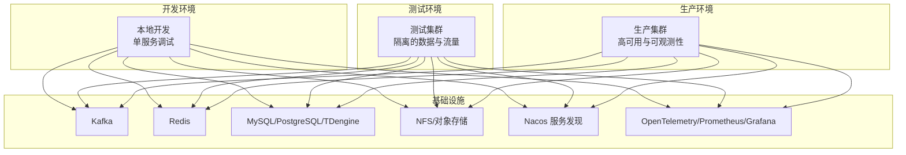
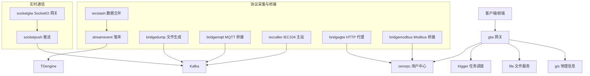
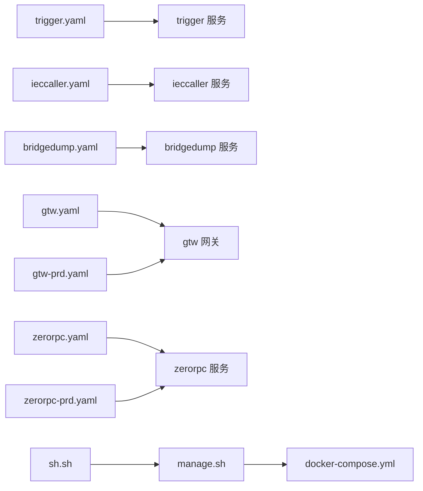

# 环境差异化排查

<cite>
**本文引用的文件**
- [README.md](file://README.md)
- [docker-compose.yml](file://deploy/docker-compose.yml)
- [trigger.yaml](file://app/trigger/etc/trigger.yaml)
- [ieccaller.yaml](file://app/ieccaller/etc/ieccaller.yaml)
- [bridgedump.yaml](file://app/bridgedump/etc/bridgedump.yaml)
- [gtw.yaml](file://gtw/etc/gtw.yaml)
- [gtw-prd.yaml](file://gtw/etc/gtw-prd.yaml)
- [zerorpc.yaml](file://zerorpc/etc/zerorpc.yaml)
- [zerorpc-prd.yaml](file://zerorpc/etc/zerorpc-prd.yaml)
- [manage.sh](file://util/manage.sh)
- [sh.sh](file://util/sh.sh)
</cite>

## 目录
1. [引言](#引言)
2. [项目结构](#项目结构)
3. [核心组件](#核心组件)
4. [架构总览](#架构总览)
5. [详细组件分析](#详细组件分析)
6. [依赖分析](#依赖分析)
7. [性能考虑](#性能考虑)
8. [故障排查指南](#故障排查指南)
9. [结论](#结论)
10. [附录](#附录)

## 引言
本指南面向 Zero-Service 在不同运行环境下的问题排查，聚焦开发、测试与生产三大环境的差异特征与应对策略。内容涵盖：
- 开发环境：快速定位本地依赖缺失、配置文件错误、端口冲突等常见问题
- 测试环境：关注环境隔离、数据一致性、性能基准测试
- 生产环境：强调最小化影响、灰度发布与回滚机制等安全策略
- 容器化环境：聚焦 Docker 网络、资源限制、日志收集等容器特有问题

## 项目结构
项目采用多服务微架构，核心服务通过 gRPC 聚合网关对外提供统一入口，并辅以 Kafka、Redis、数据库、对象存储等基础设施。容器化通过 Docker Compose 编排，便于在不同环境中快速部署与验证。

**章节来源**
- [README.md: 第59-108 行:59-108](file://README.md#L59-L108)

## 核心组件
- 网关层（gtw）：统一 HTTP/gRPC 入口，聚合下游 RPC 服务，提供 JWT 认证、文件上传下载、CORS 支持等
- 触发调度（trigger）：基于 asynq 的分布式任务队列与自研计划任务引擎
- 数采平台（ieccaller/iecstash/streamevent）：IEC 104 主站、数据合并与落库
- 实时通信（socketgtw/socketpush）：SocketIO 网关与推送服务
- 协议桥接（bridgemodbus/bridgemqtt/bridgegtw/bridgedump）：Modbus/MQTT/HTTP 协议桥接与文件生成
- 文件与地理（file/gis）：分片上传、OSS 集成、地理信息处理
- 容器管理（podengine）：Docker 容器生命周期管理
- 日志与监控（logdump/filebeat）：日志导出与集中收集

**章节来源**
- [README.md: 第110-188 行:110-188](file://README.md#L110-L188)

## 架构总览
下图展示服务间的调用关系与数据流，有助于在不同环境下定位问题：

**图表来源**
- [README.md: 第15-51 行:15-51](file://README.md#L15-L51)

**章节来源**
- [README.md: 第112-131 行:112-131](file://README.md#L112-L131)

## 详细组件分析

### 开发环境排查要点
- 本地依赖缺失
  - Go 版本与模块依赖：确保满足最低版本要求并完成依赖同步
  - 可选组件（Kafka/MySQL/PostgreSQL/TDengine/Docker）按需启用
- 配置文件错误
  - 服务监听地址与端口：检查各服务 etc/*.yaml 中 ListenOn/Host/Port
  - 数据源与缓存：Redis/Kafka/数据库连接串是否正确
  - 日志路径：确保日志目录存在且具备写权限
- 端口冲突
  - 常用端口：网关 11001、zerorpc 21001、trigger 21006、ieccaller 21004、bridgedump 25002 等
  - Docker 端口映射：host 模式下注意与宿主机端口冲突
- 快速启动
  - 单服务启动：进入 app/{service} 目录，使用 gen.sh 生成代码框架后运行
  - Docker Compose：在 deploy 目录启动默认编排

**章节来源**
- [README.md: 第226-252 行:226-252](file://README.md#L226-L252)
- [trigger.yaml: 第1-37 行:1-37](file://app/trigger/etc/trigger.yaml#L1-L37)
- [ieccaller.yaml: 第1-79 行:1-79](file://app/ieccaller/etc/ieccaller.yaml#L1-L79)
- [bridgedump.yaml: 第1-10 行:1-10](file://app/bridgedump/etc/bridgedump.yaml#L1-L10)
- [docker-compose.yml: 第1-110 行:1-110](file://deploy/docker-compose.yml#L1-L110)

### 测试环境排查要点
- 环境隔离
  - 使用独立的 Kafka 主题与 Redis 数据库，避免与开发/生产混淆
  - 不同测试环境使用独立的 Nacos 命名空间或服务名前缀
- 数据一致性
  - 通过 Kafka 消费者组与幂等策略保证重复消息不产生副作用
  - 数据库迁移脚本与模型生成保持一致，避免 schema 不匹配
- 性能基准测试
  - 使用触发器的定时/延时任务进行压力测试，记录响应时间与吞吐
  - 利用 Prometheus/Grafana 监控关键指标，识别瓶颈

**章节来源**
- [README.md: 第319-324 行:319-324](file://README.md#L319-L324)

### 生产环境排查要点
- 最小化影响
  - 采用灰度发布：先对部分实例进行更新，观察指标后再扩大范围
  - 限流与熔断：在网关与下游服务中配置合理的超时与重试策略
- 回滚机制
  - 通过容器镜像标签管理版本，回滚时切换到上一个稳定版本
  - 配置中心（Nacos）变更采用“先预热、再切换”的策略
- 高可用与灾备
  - Redis 集群、Kafka 集群、数据库主从复制
  - 服务注册与发现、健康检查与自动摘除

**章节来源**
- [README.md: 第319-324 行:319-324](file://README.md#L319-L324)
- [gtw-prd.yaml: 第1-24 行:1-24](file://gtw/etc/gtw-prd.yaml#L1-L24)
- [zerorpc-prd.yaml: 第1-39 行:1-39](file://zerorpc/etc/zerorpc-prd.yaml#L1-L39)

### 容器化环境排查要点
- Docker 网络问题
  - host 网络模式下，容器直接复用宿主机网络命名空间；若出现端口冲突或连通性问题，优先检查宿主机防火墙与端口占用
  - Kafka 广告地址与监听地址配置需与宿主机可达
- 资源限制
  - 通过 mem_limit 控制内存上限，结合 CPU 配额与 cgroup 限制，防止资源争用
- 日志收集
  - Filebeat 采集容器日志，确保宿主机日志目录挂载正确
  - 日志编码建议使用 JSON，便于集中分析

**章节来源**
- [docker-compose.yml: 第1-110 行:1-110](file://deploy/docker-compose.yml#L1-L110)

## 依赖分析
- 配置文件依赖
  - 各服务通过 etc/*.yaml 加载配置，包括监听地址、数据库连接、缓存、消息队列、服务发现等
- 运维脚本依赖
  - manage.sh 与 sh.sh 提供统一的服务启停与远程部署入口，依赖 Taskfile 任务编排与 SSH 远程执行

**图表来源**
- [trigger.yaml: 第1-37 行:1-37](file://app/trigger/etc/trigger.yaml#L1-L37)
- [ieccaller.yaml: 第1-79 行:1-79](file://app/ieccaller/etc/ieccaller.yaml#L1-L79)
- [bridgedump.yaml: 第1-10 行:1-10](file://app/bridgedump/etc/bridgedump.yaml#L1-L10)
- [gtw.yaml: 第1-61 行:1-61](file://gtw/etc/gtw.yaml#L1-L61)
- [gtw-prd.yaml: 第1-24 行:1-24](file://gtw/etc/gtw-prd.yaml#L1-L24)
- [zerorpc.yaml: 第1-39 行:1-39](file://zerorpc/etc/zerorpc.yaml#L1-L39)
- [zerorpc-prd.yaml: 第1-39 行:1-39](file://zerorpc/etc/zerorpc-prd.yaml#L1-L39)
- [docker-compose.yml: 第1-110 行:1-110](file://deploy/docker-compose.yml#L1-L110)
- [manage.sh: 第1-35 行:1-35](file://util/manage.sh#L1-L35)
- [sh.sh: 第1-159 行:1-159](file://util/sh.sh#L1-L159)

**章节来源**
- [README.md: 第300-318 行:300-318](file://README.md#L300-L318)

## 性能考虑
- 合理设置 Kafka 分区数与副本因子，平衡吞吐与容错
- Redis 使用集群模式提升并发能力，避免热点 Key
- 数据库连接池大小与超时参数需结合业务峰值调整
- 网关层开启必要的缓存与限流策略，降低下游压力

## 故障排查指南

### 开发环境常见问题
- 本地依赖缺失
  - 现象：编译失败或运行时报找不到模块
  - 排查：确认 Go 版本与 go.mod，执行依赖同步
- 配置文件错误
  - 现象：服务启动后立即退出或无法连接下游
  - 排查：核对 etc/*.yaml 中的监听地址、数据库/缓存/Kafka 连接串
- 端口冲突
  - 现象：服务无法绑定端口或容器启动失败
  - 排查：检查宿主机端口占用，必要时修改 etc/*.yaml 或 docker-compose.yml 中的端口映射

**章节来源**
- [README.md: 第226-252 行:226-252](file://README.md#L226-L252)
- [trigger.yaml: 第1-37 行:1-37](file://app/trigger/etc/trigger.yaml#L1-L37)
- [ieccaller.yaml: 第1-79 行:1-79](file://app/ieccaller/etc/ieccaller.yaml#L1-L79)
- [bridgedump.yaml: 第1-10 行:1-10](file://app/bridgedump/etc/bridgedump.yaml#L1-L10)
- [docker-compose.yml: 第1-110 行:1-110](file://deploy/docker-compose.yml#L1-L110)

### 测试环境问题排查
- 环境隔离
  - 现象：测试数据污染或相互干扰
  - 排查：为每个测试环境配置独立的 Kafka 主题、Redis 数据库与数据库 schema
- 数据一致性
  - 现象：重复消息导致数据异常
  - 排查：在消费者侧实现幂等处理，确保下游服务可重复消费不产生副作用
- 性能基准测试
  - 现象：压测时延迟飙升或吞吐不足
  - 排查：逐步增加并发与消息大小，结合监控指标定位瓶颈

**章节来源**
- [README.md: 第319-324 行:319-324](file://README.md#L319-L324)

### 生产环境安全策略
- 灰度发布
  - 步骤：先对少量实例升级，观察指标与日志，确认稳定后再扩大范围
- 回滚机制
  - 步骤：切换到上一个稳定镜像版本，必要时回滚配置中心变更
- 高可用
  - 步骤：确保 Redis/Kafka/数据库集群正常，配置健康检查与自动摘除

**章节来源**
- [README.md: 第319-324 行:319-324](file://README.md#L319-L324)
- [gtw-prd.yaml: 第1-24 行:1-24](file://gtw/etc/gtw-prd.yaml#L1-L24)
- [zerorpc-prd.yaml: 第1-39 行:1-39](file://zerorpc/etc/zerorpc-prd.yaml#L1-L39)

### 容器化环境特殊问题
- Docker 网络问题
  - 现象：容器无法访问宿主机或外部服务
  - 排查：确认 host 网络模式下的端口映射与防火墙规则
- 资源限制
  - 现象：容器频繁被 OOM 或 CPU 抢占
  - 排查：调整 mem_limit 与 CPU 配额，优化应用内存与并发
- 日志收集
  - 现象：日志缺失或格式不一致
  - 排查：检查 Filebeat 配置与挂载目录，统一日志编码为 JSON

**章节来源**
- [docker-compose.yml: 第1-110 行:1-110](file://deploy/docker-compose.yml#L1-L110)

## 结论
不同环境的差异主要体现在配置、隔离与安全策略上。开发环境强调快速迭代与易用性，测试环境强调隔离与一致性，生产环境强调高可用与最小化影响。容器化环境需要特别关注网络、资源与日志等特性。通过规范化的配置与运维脚本，可以显著提升问题定位与修复效率。

## 附录
- 快速启动命令参考
  - 单服务启动：进入 app/{service} 目录，执行生成脚本与运行命令
  - Docker Compose：在 deploy 目录执行编排启动
- 运维脚本参考
  - 本地批量启停：通过 manage.sh 指定操作与服务名
  - 远程批量启停：通过 sh.sh 选择服务器与服务集合，执行远程任务

**章节来源**
- [README.md: 第242-252 行:242-252](file://README.md#L242-L252)
- [manage.sh: 第1-35 行:1-35](file://util/manage.sh#L1-L35)
- [sh.sh: 第1-159 行:1-159](file://util/sh.sh#L1-L159)