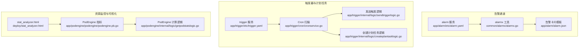
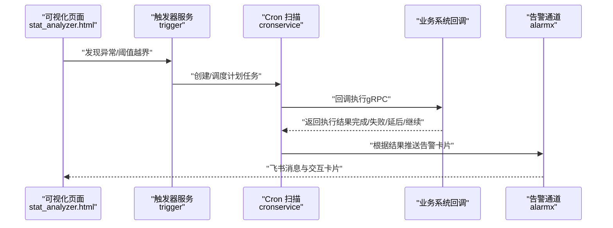
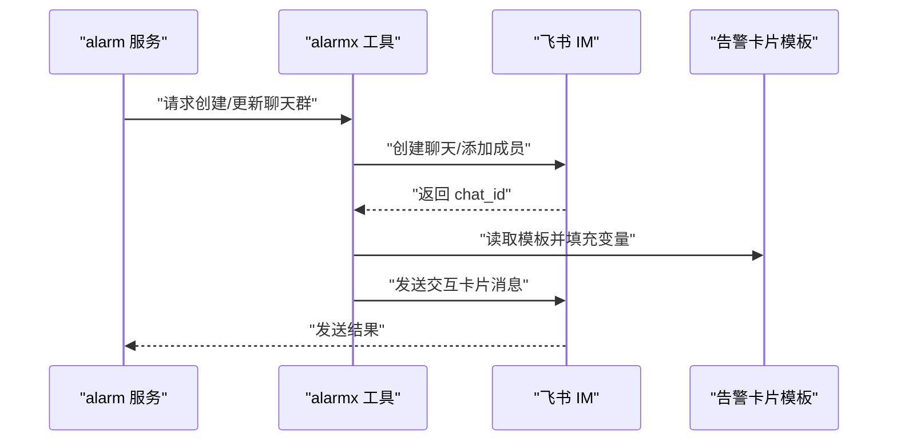
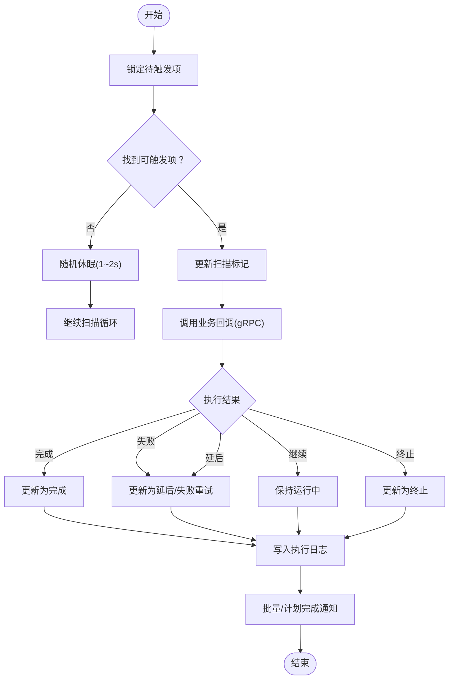
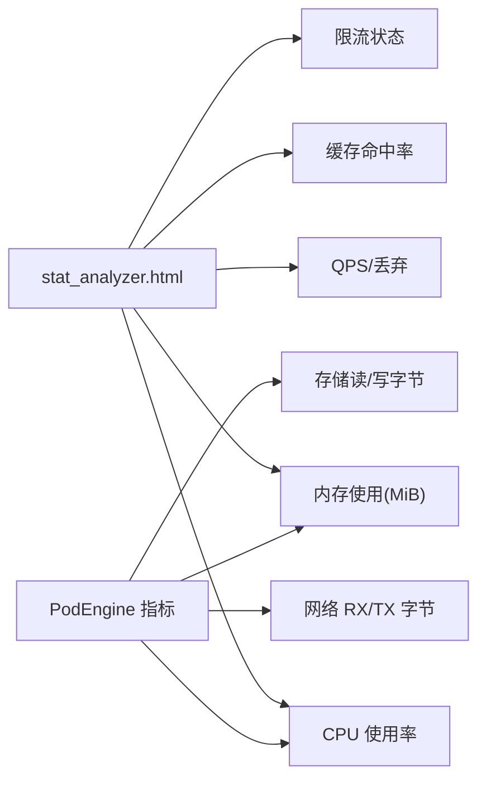
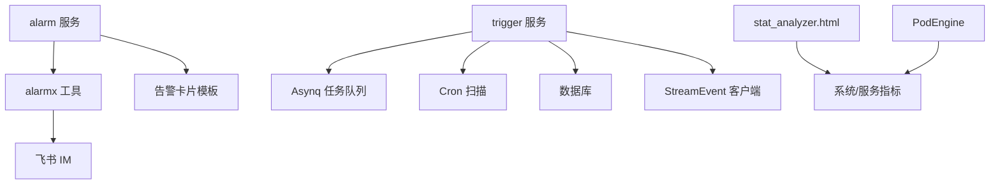

# 监控告警配置

<cite>
**本文档引用的文件**
- [app/alarm/etc/alarm.yaml](file://app/alarm/etc/alarm.yaml)
- [app/alarm/alarm.json](file://app/alarm/alarm.json)
- [common/alarmx/alarmx.go](file://common/alarmx/alarmx.go)
- [app/alarm/alarm.go](file://app/alarm/alarm.go)
- [app/trigger/etc/trigger.yaml](file://app/trigger/etc/trigger.yaml)
- [app/trigger/trigger.go](file://app/trigger/trigger.go)
- [app/trigger/cron/cronservice.go](file://app/trigger/cron/cronservice.go)
- [app/trigger/internal/logic/sendtriggerlogic.go](file://app/trigger/internal/logic/sendtriggerlogic.go)
- [app/trigger/internal/logic/createplantasklogic.go](file://app/trigger/internal/logic/createplantasklogic.go)
- [docs/trigger.md](file://docs/trigger.md)
- [deploy/stat_analyzer.html](file://deploy/stat_analyzer.html)
- [app/podengine/podengine/podengine.pb.go](file://app/podengine/podengine/podengine.pb.go)
- [app/podengine/internal/logic/getpodstatslogic.go](file://app/podengine/internal/logic/getpodstatslogic.go)
- [swagger/trigger.swagger.json](file://swagger/trigger.swagger.json)
- [swagger/alarm.swagger.json](file://swagger/alarm.swagger.json)
</cite>

## 目录
1. [简介](#简介)
2. [项目结构](#项目结构)
3. [核心组件](#核心组件)
4. [架构总览](#架构总览)
5. [详细组件分析](#详细组件分析)
6. [依赖分析](#依赖分析)
7. [性能考虑](#性能考虑)
8. [故障排查指南](#故障排查指南)
9. [结论](#结论)
10. [附录](#附录)

## 简介
本指南面向 Zero-Service 项目的监控与告警体系，围绕以下目标展开：
- 关键性能指标监控：服务可用性、响应时间、错误率、资源使用率等
- 异常检测机制：阈值设置、趋势分析、基线对比等智能告警
- 自动告警机制：规则配置、通知渠道、升级策略
- 触发器服务在监控告警中的应用：定时检查、事件驱动告警、批量告警处理
- 监控仪表板设计与告警处理流程最佳实践

本指南基于仓库中现有的告警通道、触发器与资源监控能力进行系统化梳理，并提供可落地的配置建议与流程图示。

## 项目结构
与监控告警直接相关的关键模块如下：
- 告警通道与通知：alarm 服务、alarmx 工具、告警卡片模板
- 触发器与计划任务：trigger 服务、Cron 扫描、计划任务创建与执行回调
- 资源监控与可视化：stat_analyzer.html、PodEngine 容器指标
- 文档与接口定义：trigger.md、Swagger 文档

**图表来源**
- [app/alarm/etc/alarm.yaml:1-26](file://app/alarm/etc/alarm.yaml#L1-L26)
- [common/alarmx/alarmx.go:1-223](file://common/alarmx/alarmx.go#L1-L223)
- [app/alarm/alarm.json:1-75](file://app/alarm/alarm.json#L1-L75)
- [app/trigger/etc/trigger.yaml:1-37](file://app/trigger/etc/trigger.yaml#L1-L37)
- [app/trigger/cron/cronservice.go:1-469](file://app/trigger/cron/cronservice.go#L1-L469)
- [app/trigger/internal/logic/sendtriggerlogic.go:1-105](file://app/trigger/internal/logic/sendtriggerlogic.go#L1-L105)
- [app/trigger/internal/logic/createplantasklogic.go:1-250](file://app/trigger/internal/logic/createplantasklogic.go#L1-L250)
- [deploy/stat_analyzer.html:862-1307](file://deploy/stat_analyzer.html#L862-L1307)
- [app/podengine/podengine/podengine.pb.go:1842-1924](file://app/podengine/podengine/podengine.pb.go#L1842-L1924)
- [app/podengine/internal/logic/getpodstatslogic.go:55-103](file://app/podengine/internal/logic/getpodstatslogic.go#L55-L103)

**章节来源**
- [app/alarm/etc/alarm.yaml:1-26](file://app/alarm/etc/alarm.yaml#L1-L26)
- [app/trigger/etc/trigger.yaml:1-37](file://app/trigger/etc/trigger.yaml#L1-L37)
- [deploy/stat_analyzer.html:862-1307](file://deploy/stat_analyzer.html#L862-L1307)

## 核心组件
- 告警服务（alarm）
  - 提供告警推送能力，对接飞书 IM，支持群组创建、成员管理与交互卡片消息发送
  - 配置项包含服务监听、日志、Redis 缓存键前缀、告警通道参数等
- 告警工具（alarmx）
  - 封装 Lark SDK 的聊天与消息发送能力，支持卡片构建与安全转义
  - 通过 Redis 缓存群组 ID，避免重复创建
- 触发器服务（trigger）
  - 支持定时触发、延迟触发、重试与队列管理；集成 Asynq 任务队列与 Cron 扫描
  - 提供计划任务创建、批量执行与回调结果处理
- 资源监控与可视化
  - 提供 HTML 可视化页面，聚合 CPU、内存、QPS、丢弃、限流等指标
  - PodEngine 提供容器 CPU/内存/网络/存储等指标字段

**章节来源**
- [app/alarm/etc/alarm.yaml:1-26](file://app/alarm/etc/alarm.yaml#L1-L26)
- [common/alarmx/alarmx.go:1-223](file://common/alarmx/alarmx.go#L1-L223)
- [app/trigger/etc/trigger.yaml:1-37](file://app/trigger/etc/trigger.yaml#L1-L37)
- [app/trigger/cron/cronservice.go:1-469](file://app/trigger/cron/cronservice.go#L1-L469)
- [deploy/stat_analyzer.html:862-1307](file://deploy/stat_analyzer.html#L862-L1307)
- [app/podengine/podengine/podengine.pb.go:1842-1924](file://app/podengine/podengine/podengine.pb.go#L1842-L1924)

## 架构总览
下图展示监控告警在 Zero-Service 中的整体交互路径：指标采集与可视化 → 触发器服务 → 业务回调 → 告警通道。

**图表来源**
- [deploy/stat_analyzer.html:862-1307](file://deploy/stat_analyzer.html#L862-L1307)
- [app/trigger/cron/cronservice.go:203-468](file://app/trigger/cron/cronservice.go#L203-L468)
- [common/alarmx/alarmx.go:119-140](file://common/alarmx/alarmx.go#L119-L140)

**章节来源**
- [docs/trigger.md:130-158](file://docs/trigger.md#L130-L158)
- [swagger/trigger.swagger.json](file://swagger/trigger.swagger.json)

## 详细组件分析

### 告警通道（alarm 与 alarmx）
- 配置要点
  - 监听端口、日志编码、Redis 缓存键前缀、告警通道参数（AppId/AppSecret/VerificationToken/UserId）、卡片模板路径
- 通知流程
  - 通过 Lark IM 创建/更新聊天群，拉取用户入群
  - 构建交互卡片并发送消息，卡片内容由模板与动态变量拼接
  - 使用 Redis 缓存群组 ID，降低重复创建成本
- 建议
  - 为不同项目/环境配置独立的 Redis Key 前缀
  - 对 UserId 列表进行权限校验与灰度控制
  - 在模板中预留“跟进处理”按钮，便于闭环流转

**图表来源**
- [app/alarm/etc/alarm.yaml:1-26](file://app/alarm/etc/alarm.yaml#L1-L26)
- [common/alarmx/alarmx.go:53-140](file://common/alarmx/alarmx.go#L53-L140)
- [app/alarm/alarm.json:1-75](file://app/alarm/alarm.json#L1-L75)

**章节来源**
- [app/alarm/etc/alarm.yaml:1-26](file://app/alarm/etc/alarm.yaml#L1-L26)
- [common/alarmx/alarmx.go:1-223](file://common/alarmx/alarmx.go#L1-L223)
- [app/alarm/alarm.json:1-75](file://app/alarm/alarm.json#L1-L75)

### 触发器服务（trigger）与 Cron 扫描
- 功能概述
  - Cron 扫描：周期性锁定待触发的计划执行项，更新扫描标记，调用业务回调，依据结果更新状态并记录日志
  - 发送触发：支持立即触发、延迟触发、重试次数与队列选择，注入链路追踪上下文
  - 计划任务：基于规则生成批量执行项，支持间隔类型与不稳定过期补偿
- 状态机与重试
  - 状态：WAITING → DELAYED → RUNNING → COMPLETED/TERMINATED
  - 重试：首次失败后 10 秒重试，指数退避最高 30 分钟，默认最多 25 次
  - 并发控制：使用分布式锁避免并发回调冲突

**图表来源**
- [app/trigger/cron/cronservice.go:81-184](file://app/trigger/cron/cronservice.go#L81-L184)
- [docs/trigger.md:130-158](file://docs/trigger.md#L130-L158)

**章节来源**
- [app/trigger/cron/cronservice.go:1-469](file://app/trigger/cron/cronservice.go#L1-L469)
- [docs/trigger.md:130-158](file://docs/trigger.md#L130-L158)
- [app/trigger/internal/logic/sendtriggerlogic.go:37-105](file://app/trigger/internal/logic/sendtriggerlogic.go#L37-L105)
- [app/trigger/internal/logic/createplantasklogic.go:38-250](file://app/trigger/internal/logic/createplantasklogic.go#L38-L250)

### 资源监控与可视化（stat_analyzer.html 与 PodEngine）
- 可视化页面
  - 聚合 CPU、内存、QPS、丢弃、限流、缓存命中率等指标，支持按分钟聚合与多系列展示
  - 提供内存趋势、QPS/丢弃趋势、服务分布、系统指标综合、限流状态分析、缓存命中率趋势等图表
- PodEngine 指标
  - 提供容器 CPU/内存/网络/存储等指标字段，便于在告警规则中直接引用
  - 计算逻辑包含 CPU 使用率百分比、内存使用率百分比、网络与存储字节统计

**图表来源**
- [deploy/stat_analyzer.html:862-1307](file://deploy/stat_analyzer.html#L862-L1307)
- [app/podengine/podengine/podengine.pb.go:1842-1924](file://app/podengine/podengine/podengine.pb.go#L1842-L1924)
- [app/podengine/internal/logic/getpodstatslogic.go:55-103](file://app/podengine/internal/logic/getpodstatslogic.go#L55-L103)

**章节来源**
- [deploy/stat_analyzer.html:862-1307](file://deploy/stat_analyzer.html#L862-L1307)
- [app/podengine/podengine/podengine.pb.go:1842-1924](file://app/podengine/podengine/podengine.pb.go#L1842-L1924)
- [app/podengine/internal/logic/getpodstatslogic.go:55-103](file://app/podengine/internal/logic/getpodstatslogic.go#L55-L103)

## 依赖分析
- alarm 服务依赖 alarmx 工具与 Lark IM，通过配置文件指定鉴权参数与卡片模板路径
- trigger 服务依赖 Asynq 任务队列、Cron 扫描、数据库与 StreamEvent 客户端，负责计划任务的创建、调度与回调
- 可视化页面与 PodEngine 指标为监控告警提供数据基础

**图表来源**
- [app/alarm/etc/alarm.yaml:1-26](file://app/alarm/etc/alarm.yaml#L1-L26)
- [common/alarmx/alarmx.go:1-223](file://common/alarmx/alarmx.go#L1-L223)
- [app/trigger/etc/trigger.yaml:1-37](file://app/trigger/etc/trigger.yaml#L1-L37)
- [app/trigger/cron/cronservice.go:1-469](file://app/trigger/cron/cronservice.go#L1-L469)
- [deploy/stat_analyzer.html:862-1307](file://deploy/stat_analyzer.html#L862-L1307)
- [app/podengine/podengine/podengine.pb.go:1842-1924](file://app/podengine/podengine/podengine.pb.go#L1842-L1924)

**章节来源**
- [app/alarm/etc/alarm.yaml:1-26](file://app/alarm/etc/alarm.yaml#L1-L26)
- [app/trigger/etc/trigger.yaml:1-37](file://app/trigger/etc/trigger.yaml#L1-L37)

## 性能考虑
- 触发器服务
  - Cron 扫描采用随机休眠（1~2 秒）避免忙轮询，提高吞吐稳定性
  - 任务执行采用分布式锁与状态机，减少并发冲突
  - Asynq 队列按优先级与保留时间配置，保障高优任务及时处理
- 可视化页面
  - 指标按分钟聚合，减少前端渲染压力；支持缩放与平滑曲线，提升可观测性
- 资源指标
  - PodEngine 提供精确的 CPU/内存/网络/存储指标，便于精细化阈值设定

**章节来源**
- [app/trigger/cron/cronservice.go:58-79](file://app/trigger/cron/cronservice.go#L58-L79)
- [deploy/stat_analyzer.html:1330-1352](file://deploy/stat_analyzer.html#L1330-L1352)
- [app/podengine/internal/logic/getpodstatslogic.go:55-103](file://app/podengine/internal/logic/getpodstatslogic.go#L55-L103)

## 故障排查指南
- 告警通道
  - 检查 alarm.yaml 中的 Lark 鉴权参数与 UserId 列表是否正确
  - 确认 Redis 缓存键前缀与群组 ID 是否存在
  - 校验 alarm.json 模板路径与变量替换是否完整
- 触发器服务
  - 查看 Cron 扫描日志，确认锁定与回调是否成功
  - 检查 Asynq 队列状态与重试次数，必要时调整 MaxRetry
  - 核对计划任务创建逻辑的时间范围与规则转换
- 可视化与指标
  - 检查 stat_analyzer.html 的数据聚合逻辑与图表初始化
  - 确认 PodEngine 指标字段与计算逻辑是否符合预期

**章节来源**
- [app/alarm/etc/alarm.yaml:1-26](file://app/alarm/etc/alarm.yaml#L1-L26)
- [common/alarmx/alarmx.go:53-140](file://common/alarmx/alarmx.go#L53-L140)
- [app/trigger/etc/trigger.yaml:1-37](file://app/trigger/etc/trigger.yaml#L1-L37)
- [app/trigger/cron/cronservice.go:203-468](file://app/trigger/cron/cronservice.go#L203-L468)
- [deploy/stat_analyzer.html:1330-1352](file://deploy/stat_analyzer.html#L1330-L1352)
- [app/podengine/internal/logic/getpodstatslogic.go:55-103](file://app/podengine/internal/logic/getpodstatslogic.go#L55-L103)

## 结论
通过 alarm 与 alarmx 的告警通道、trigger 的计划与触发能力，以及 stat_analyzer.html 与 PodEngine 的指标可视化，Zero-Service 已具备完善的监控告警基础。建议在生产环境中：
- 明确各指标阈值与基线，结合趋势分析与异常检测策略
- 完善通知渠道分级与升级策略，确保关键告警及时触达
- 优化触发器重试与队列配置，提升稳定性与可维护性
- 将告警与工单系统打通，形成闭环处理流程

## 附录
- 接口文档参考
  - [trigger.swagger.json](file://swagger/trigger.swagger.json)
  - [alarm.swagger.json](file://swagger/alarm.swagger.json)