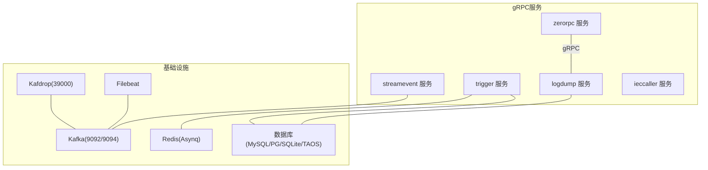
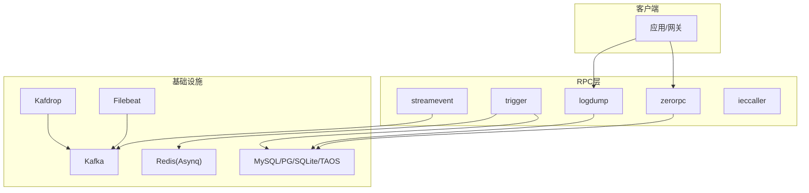
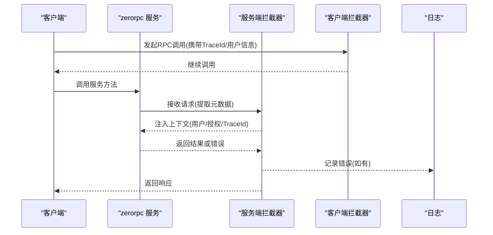
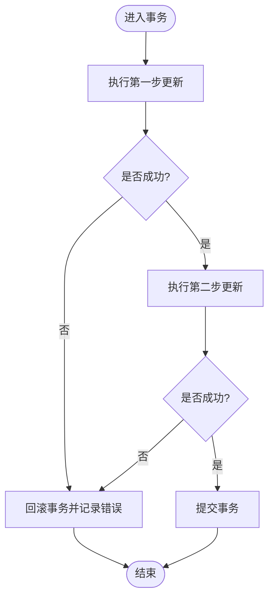
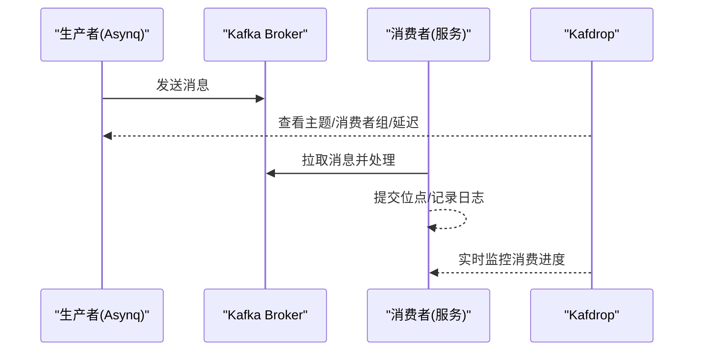
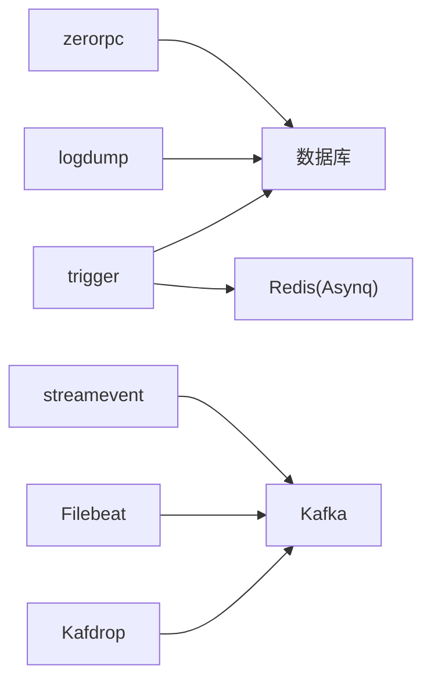

# 调试工具使用

<cite>
**本文引用的文件**   
- [loggerInterceptor.go](file://common/Interceptor/rpcserver/loggerInterceptor.go)
- [metadataInterceptor.go](file://common/Interceptor/rpcclient/metadataInterceptor.go)
- [dbx.go](file://common/dbx/dbx.go)
- [asynqClient.go](file://common/asynqx/asynqClient.go)
- [docker-compose.yml](file://deploy/docker-compose.yml)
- [trigger.yaml](file://app/trigger/etc/trigger.yaml)
- [logdump.yaml](file://app/logdump/etc/logdump.yaml)
- [logdump.pb.go](file://app/logdump/logdump/logdump.pb.go)
- [zerorpc.pb.go](file://zerorpc/zerorpc/zerorpc.pb.go)
- [streamevent.pb.validate.go](file://facade/streamevent/streamevent/streamevent.pb.validate.go)
- [trigger.pb.validate.go](file://app/trigger/trigger/trigger.pb.validate.go)
- [trigger.pb.go](file://app/trigger/trigger/trigger.pb.go)
- [ieccaller.pb.go](file://app/ieccaller/ieccaller/ieccaller.pb.go)
- [resilience-patterns.md](file://.trae/skills/zero-skills/references/resilience-patterns.md)
- [database-patterns.md](file://.trae/skills/zero-skills/references/database-patterns.md)
- [invoke_test.go](file://common/antsx/invoke_test.go)
- [antsx_test.go](file://common/antsx/antsx_test.go)
</cite>

## 目录
1. [简介](#简介)
2. [项目结构](#项目结构)
3. [核心组件](#核心组件)
4. [架构总览](#架构总览)
5. [详细组件分析](#详细组件分析)
6. [依赖关系分析](#依赖关系分析)
7. [性能考量](#性能考量)
8. [故障排查指南](#故障排查指南)
9. [结论](#结论)
10. [附录](#附录)

## 简介
本指南面向Zero-Service的调试与排障需求，围绕gRPC调试、Protocol Buffers调试、数据库调试、消息队列调试、网络连通性与抓包分析、以及IDE调试器配置与使用，提供系统化的方法论与实操建议。文档结合项目中实际存在的服务定义、拦截器、配置与部署脚本，给出可落地的调试策略与最佳实践。

## 项目结构
- gRPC服务与协议：各应用模块均通过proto文件定义服务接口，并生成pb.go代码；部分服务包含校验扩展（validate）。
- 中间件与拦截器：统一的gRPC客户端/服务端元数据与日志拦截器，便于链路追踪与上下文传递。
- 数据库层：dbx适配器根据数据源自动识别数据库类型并建立连接，支持MySQL、PostgreSQL、SQLite、TDengine等。
- 消息队列：Kafka在docker-compose中作为依赖服务运行，配套Kafdrop可视化管理界面；异步任务通过Redis+Asynq实现。
- 配置与日志：各服务通过etc/*.yaml进行启动参数、日志级别、中间件统计等配置；日志路径与保留天数可按需调整。

图表来源
- [docker-compose.yml:1-110](file://deploy/docker-compose.yml#L1-L110)
- [trigger.yaml:1-37](file://app/trigger/etc/trigger.yaml#L1-L37)
- [logdump.yaml:1-26](file://app/logdump/etc/logdump.yaml#L1-L26)

章节来源
- [docker-compose.yml:1-110](file://deploy/docker-compose.yml#L1-L110)
- [trigger.yaml:1-37](file://app/trigger/etc/trigger.yaml#L1-L37)
- [logdump.yaml:1-26](file://app/logdump/etc/logdump.yaml#L1-L26)

## 核心组件
- gRPC拦截器与链路上下文
  - 服务端拦截器从入站元数据提取用户、授权、TraceId等字段注入上下文，并在错误时记录日志。
  - 客户端拦截器将上下文中的用户、授权、TraceId等写入出站元数据，确保跨服务一致的追踪。
- 协议调试与验证
  - 各服务的pb.go定义了服务方法与消息体；部分服务包含validate扩展，用于字段级约束校验。
- 数据库连接与事务
  - dbx根据数据源自动识别数据库类型并建立连接；提供事务封装示例与日志控制开关。
- 消息队列与异步任务
  - Kafka作为事件通道；Kafdrop可视化；Asynq通过Redis实现生产者/消费者与可观测性埋点。
- 配置与日志
  - 各服务etc/*.yaml集中管理监听地址、超时、日志编码与路径、Nacos注册、Redis与DB连接等。

章节来源
- [loggerInterceptor.go:1-45](file://common/Interceptor/rpcserver/loggerInterceptor.go#L1-L45)
- [metadataInterceptor.go:1-56](file://common/Interceptor/rpcclient/metadataInterceptor.go#L1-L56)
- [dbx.go:1-155](file://common/dbx/dbx.go#L1-L155)
- [asynqClient.go:1-31](file://common/asynqx/asynqClient.go#L1-L31)
- [trigger.yaml:1-37](file://app/trigger/etc/trigger.yaml#L1-L37)
- [logdump.yaml:1-26](file://app/logdump/etc/logdump.yaml#L1-L26)

## 架构总览
下图展示Zero-Service中关键服务与基础设施之间的交互关系，以及调试关注点（日志、追踪、队列、数据库）：

图表来源
- [docker-compose.yml:1-110](file://deploy/docker-compose.yml#L1-L110)
- [trigger.yaml:1-37](file://app/trigger/etc/trigger.yaml#L1-L37)
- [logdump.yaml:1-26](file://app/logdump/etc/logdump.yaml#L1-L26)

## 详细组件分析

### gRPC调试与Protocol Buffers调试
- 使用grpcurl进行服务端点测试
  - 命令格式要点：指定目标地址、服务方法、请求JSON、认证头（如需要）、TLS参数等。
  - 对于启用了中间件统计的服务，PushLog等大体量方法可能被忽略统计，避免噪声干扰。
- Protocol Buffers调试
  - 通过pb.go查看服务方法签名与消息字段；对含validate扩展的服务，可在请求前进行字段级校验，减少无效调用。
  - 建议在本地生成与服务端一致的proto版本，确保字段顺序、枚举值与扩展一致。
- 链路追踪与上下文
  - 客户端拦截器会将TraceId、用户信息等写入元数据；服务端拦截器读取并注入上下文，便于日志关联。
  - 若使用分布式追踪系统，建议在元数据中透传标准头（如traceparent），并在服务端拦截器中同步到日志上下文。

图表来源
- [metadataInterceptor.go:1-56](file://common/Interceptor/rpcclient/metadataInterceptor.go#L1-L56)
- [loggerInterceptor.go:1-45](file://common/Interceptor/rpcserver/loggerInterceptor.go#L1-L45)
- [zerorpc.pb.go:1-1591](file://zerorpc/zerorpc/zerorpc.pb.go#L1-L1591)

章节来源
- [logdump.yaml:4-12](file://app/logdump/etc/logdump.yaml#L4-L12)
- [logdump.pb.go:316-358](file://app/logdump/logdump/logdump.pb.go#L316-L358)
- [zerorpc.pb.go:1-1591](file://zerorpc/zerorpc/zerorpc.pb.go#L1-L1591)
- [loggerInterceptor.go:1-45](file://common/Interceptor/rpcserver/loggerInterceptor.go#L1-L45)
- [metadataInterceptor.go:1-56](file://common/Interceptor/rpcclient/metadataInterceptor.go#L1-L56)

### 数据库调试技巧
- 连接状态与类型识别
  - dbx根据数据源URL自动识别数据库类型（MySQL/PostgreSQL/SQLite/TAOS），并建立连接；可据此快速定位连接问题。
- SQL查询分析与日志
  - 在etc/*.yaml中可启用/关闭语句日志开关；生产环境建议关闭以降低开销。
  - 使用Goqu查询构造器时，其日志会输出到统一日志系统，便于聚合分析。
- 事务跟踪与回滚
  - 使用事务封装执行多步更新；若出现异常，确保回滚并记录错误原因，避免脏数据。
  - 建议在事务边界打印关键步骤与受影响行数，辅助定位失败点。

图表来源
- [dbx.go:1-155](file://common/dbx/dbx.go#L1-L155)
- [trigger.yaml:25-28](file://app/trigger/etc/trigger.yaml#L25-L28)
- [database-patterns.md:271-365](file://.trae/skills/zero-skills/references/database-patterns.md#L271-L365)

章节来源
- [dbx.go:1-155](file://common/dbx/dbx.go#L1-L155)
- [trigger.yaml:25-28](file://app/trigger/etc/trigger.yaml#L25-L28)
- [database-patterns.md:271-365](file://.trae/skills/zero-skills/references/database-patterns.md#L271-L365)

### 消息队列调试方法
- Kafka消费者组监控
  - 使用Kafdrop可视化界面查看主题、分区、消费者组、偏移量与延迟；定位消费滞后与分区分布问题。
- 消息投递确认
  - 生产端通过Asynq Inspector或Kafka客户端确认消息已发送；消费端在处理完成后提交位点。
- 队列状态检查
  - Asynq队列信息包含Active/Scheduled/Retry/Failed等计数，结合服务端日志定位积压与失败原因。

图表来源
- [docker-compose.yml:101-109](file://deploy/docker-compose.yml#L101-L109)
- [asynqClient.go:1-31](file://common/asynqx/asynqClient.go#L1-L31)
- [trigger.pb.go:471-553](file://app/trigger/trigger/trigger.pb.go#L471-L553)

章节来源
- [docker-compose.yml:1-110](file://deploy/docker-compose.yml#L1-L110)
- [asynqClient.go:1-31](file://common/asynqx/asynqClient.go#L1-L31)
- [trigger.pb.validate.go:285-341](file://app/trigger/trigger/trigger.pb.validate.go#L285-L341)
- [trigger.pb.go:471-553](file://app/trigger/trigger/trigger.pb.go#L471-L553)

### 网络调试工具
- tcpdump抓包分析
  - 在宿主机或容器侧使用tcpdump捕获gRPC/Kafka/Redis流量，结合Wireshark或在线解析工具分析报文。
- 连通性测试
  - 使用telnet/nc测试端口可达性；在容器网络模式为host时，直接使用127.0.0.1:端口进行验证。
- 延迟测量
  - 使用ping/iperf3测量主机间延迟；对Kafka/Redis使用专用客户端的延迟探测功能。

章节来源
- [docker-compose.yml:63-87](file://deploy/docker-compose.yml#L63-L87)

### IDE调试器配置与使用
- 断点设置
  - 在gRPC拦截器、业务逻辑入口、事务包裹处设置断点，观察上下文与元数据传递。
- 变量检查
  - 检查TraceId、用户ID、授权令牌等是否正确注入；核对数据库连接字符串与日志路径。
- 调用栈分析
  - 结合日志与断点，定位异常抛出位置与上游调用链；对panic场景，参考异步任务的panic恢复测试用例。

章节来源
- [loggerInterceptor.go:1-45](file://common/Interceptor/rpcserver/loggerInterceptor.go#L1-L45)
- [metadataInterceptor.go:1-56](file://common/Interceptor/rpcclient/metadataInterceptor.go#L1-L56)
- [invoke_test.go:261-305](file://common/antsx/invoke_test.go#L261-L305)
- [antsx_test.go:410-458](file://common/antsx/antsx_test.go#L410-L458)

## 依赖关系分析
- 服务间依赖
  - trigger依赖Redis(Asynq)与数据库；streamevent依赖Kafka；logdump依赖数据库；zerorpc为通用RPC入口。
- 基础设施依赖
  - Kafka/Kafdrop/Filebeat构成事件采集与可视化闭环；dbx负责数据库连接抽象。
- 配置耦合
  - 各服务的etc/*.yaml集中管理监听、日志、注册中心、存储与队列参数，变更需统一评估影响面。

图表来源
- [trigger.yaml:1-37](file://app/trigger/etc/trigger.yaml#L1-L37)
- [logdump.yaml:1-26](file://app/logdump/etc/logdump.yaml#L1-L26)
- [docker-compose.yml:1-110](file://deploy/docker-compose.yml#L1-L110)

章节来源
- [trigger.yaml:1-37](file://app/trigger/etc/trigger.yaml#L1-L37)
- [logdump.yaml:1-26](file://app/logdump/etc/logdump.yaml#L1-L26)
- [docker-compose.yml:1-110](file://deploy/docker-compose.yml#L1-L110)

## 性能考量
- 日志与统计
  - PushLog等高吞吐接口建议忽略统计，避免日志风暴；生产环境建议使用plain编码并限制日志级别。
- 数据库负载
  - 合理设置连接池与超时；批量操作时使用事务，减少往返次数。
- 队列积压
  - 监控Active/Scheduled/Retry/Failed计数，及时扩容消费者或优化处理耗时。

章节来源
- [logdump.yaml:4-12](file://app/logdump/etc/logdump.yaml#L4-L12)
- [trigger.yaml:25-28](file://app/trigger/etc/trigger.yaml#L25-L28)
- [trigger.pb.validate.go:285-341](file://app/trigger/trigger/trigger.pb.validate.go#L285-L341)

## 故障排查指南
- gRPC相关
  - 检查拦截器是否正确注入TraceId/用户信息；若出现错误，服务端拦截器会记录错误日志，优先查看该日志。
  - 使用grpcurl验证服务方法签名与请求体；对含validate的服务，先做字段校验再发起调用。
- 数据库相关
  - 确认数据源URL与数据库类型匹配；开启语句日志定位慢查询；事务失败时检查受影响行数与回滚路径。
- 消息队列相关
  - 使用Kafdrop查看消费者组状态与延迟；对Asynq队列，关注Active/Scheduled/Retry/Failed变化趋势。
- 异常与panic
  - 参考异步任务的panic恢复测试用例，确保在开发与测试阶段暴露潜在问题。

章节来源
- [loggerInterceptor.go:1-45](file://common/Interceptor/rpcserver/loggerInterceptor.go#L1-L45)
- [metadataInterceptor.go:1-56](file://common/Interceptor/rpcclient/metadataInterceptor.go#L1-L56)
- [logdump.pb.go:316-358](file://app/logdump/logdump/logdump.pb.go#L316-L358)
- [trigger.pb.validate.go:285-341](file://app/trigger/trigger/trigger.pb.validate.go#L285-L341)
- [invoke_test.go:261-305](file://common/antsx/invoke_test.go#L261-L305)
- [antsx_test.go:410-458](file://common/antsx/antsx_test.go#L410-L458)

## 结论
通过统一的gRPC拦截器、规范化的proto定义与validate扩展、数据库连接适配器、Kafka/Asynq队列生态，以及完善的日志与配置体系，Zero-Service具备良好的可调试性与可观测性。建议在日常开发与运维中，结合本文提供的调试策略与最佳实践，形成标准化的排障流程与知识沉淀。

## 附录
- 关键服务端口与组件
  - Kafka: 9092/9094
  - Kafdrop: 39000
  - trigger.rpc: 21006
  - logdump.rpc: 25006
- 建议的调试清单
  - gRPC：拦截器上下文、grpcurl验证、proto字段校验
  - 数据库：连接字符串、事务日志、慢查询定位
  - 队列：Kafdrop监控、Asynq队列指标、消费者组状态
  - 网络：tcpdump抓包、连通性测试、延迟测量
  - IDE：断点、变量检查、调用栈、panic恢复测试