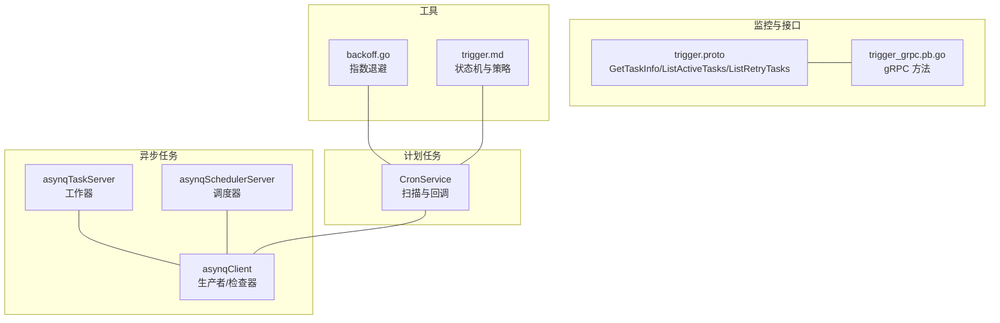
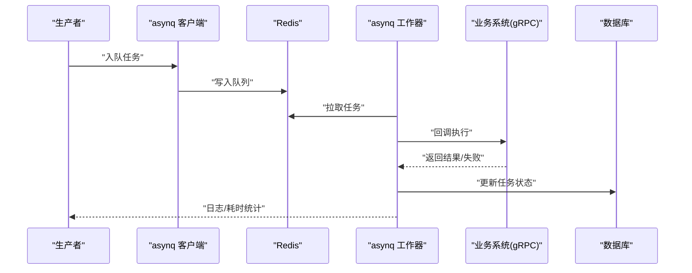
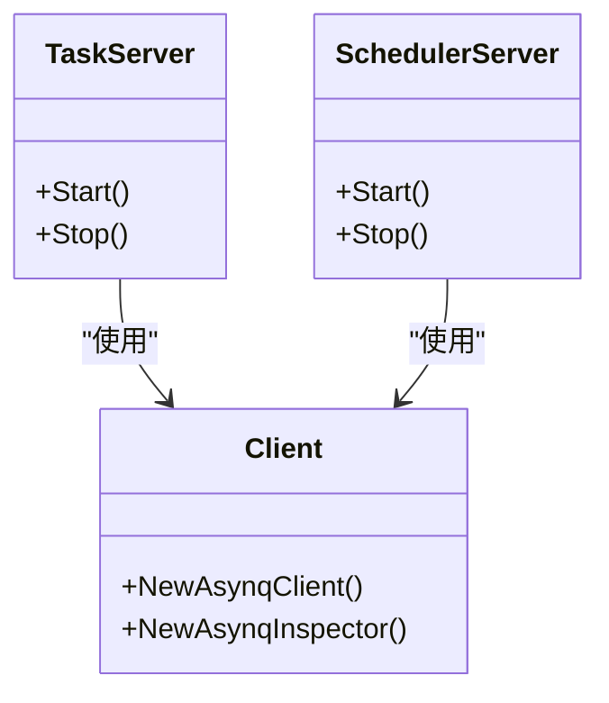
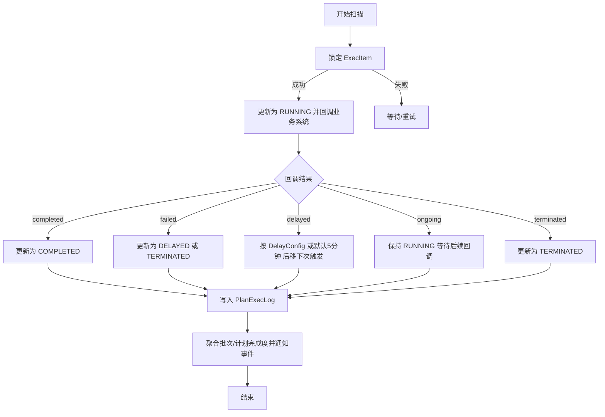
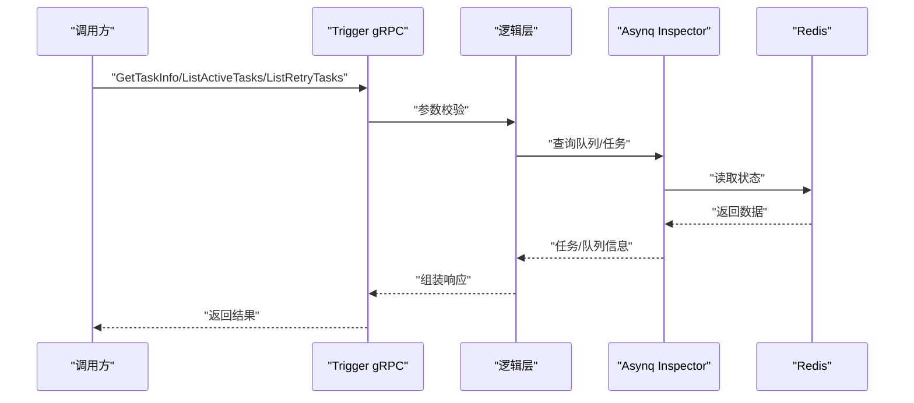
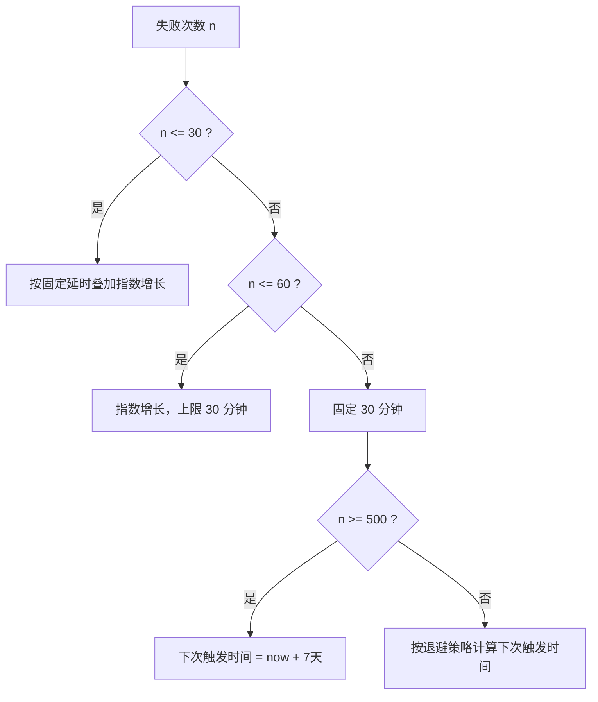
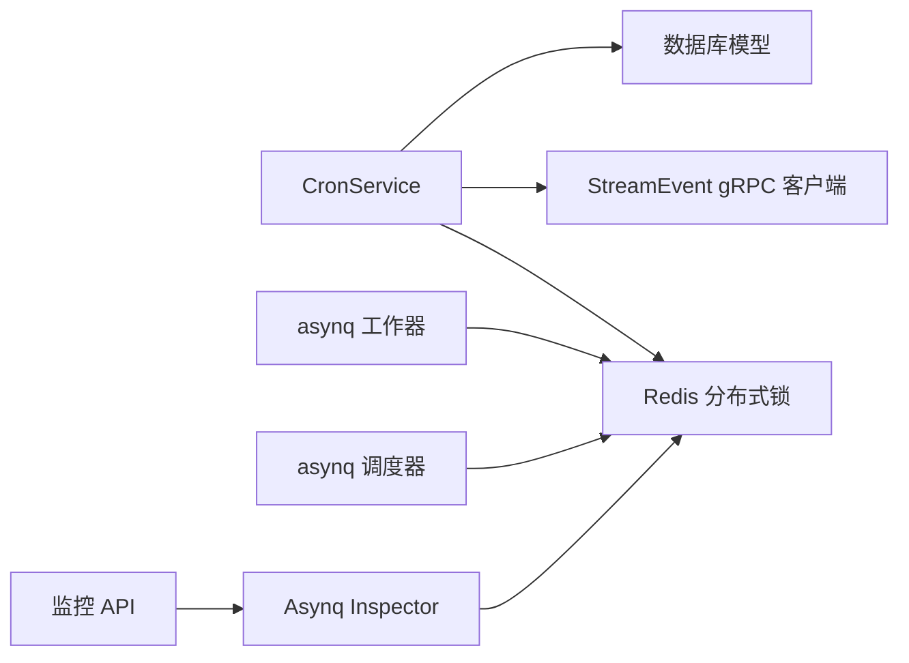

# 任务执行失败

<cite>
**本文引用的文件**
- [asynqTaskServer.go](file://common/asynqx/asynqTaskServer.go)
- [asynqSchedulerServer.go](file://common/asynqx/asynqSchedulerServer.go)
- [asynqClient.go](file://common/asynqx/asynqClient.go)
- [backoff.go](file://common/tool/backoff.go)
- [cronservice.go](file://app/trigger/cron/cronservice.go)
- [trigger.proto](file://app/trigger/trigger/trigger.proto)
- [trigger_grpc.pb.go](file://app/trigger/trigger/trigger_grpc.pb.go)
- [gettaskinfologic.go](file://app/trigger/internal/logic/gettaskinfologic.go)
- [listactivetaskslogic.go](file://app/trigger/internal/logic/listactivetaskslogic.go)
- [listretrytaskslogic.go](file://app/trigger/internal/logic/listretrytaskslogic.go)
- [extproto.pb.go](file://third_party/extproto/extproto.pb.go)
- [trigger.md](file://docs/trigger.md)
</cite>

## 目录
1. [简介](#简介)
2. [项目结构](#项目结构)
3. [核心组件](#核心组件)
4. [架构总览](#架构总览)
5. [详细组件分析](#详细组件分析)
6. [依赖分析](#依赖分析)
7. [性能考虑](#性能考虑)
8. [故障排除指南](#故障排除指南)
9. [结论](#结论)
10. [附录](#附录)

## 简介
本指南聚焦 zero-service 中“任务执行失败”的排查与修复，覆盖两类任务：
- 异步任务：基于 asynq 的工作器、Redis 队列与回调地址验证、重试与指数退避策略、任务状态监控 API。
- 计划任务：基于 CronService 的扫描与回调、数据库连接与状态查询、执行日志分析与状态机。

目标是帮助读者快速定位失败根因、理解重试与退避机制，并掌握监控与诊断工具的使用方法。

## 项目结构
围绕任务执行的关键目录与文件：
- 异步任务基础设施：common/asynqx 下的 asynqTaskServer、asynqSchedulerServer、asynqClient 提供工作器、调度器与客户端封装。
- 计划任务引擎：app/trigger/cron/cronservice.go 实现周期扫描、回调与状态迁移。
- 任务状态监控 API：app/trigger/trigger.proto 定义 GetTaskInfo、ListActiveTasks、ListRetryTasks 等接口，trigger_grpc.pb.go 提供 gRPC 方法签名。
- 重试与退避：common/tool/backoff.go 提供指数退避计算。
- 文档与状态机：docs/trigger.md 描述计划任务状态机与重试策略。
- 错误码：third_party/extproto.extproto 定义统一错误码体系。

**图表来源**
- [asynqTaskServer.go:1-87](file://common/asynqx/asynqTaskServer.go#L1-L87)
- [asynqSchedulerServer.go:1-61](file://common/asynqx/asynqSchedulerServer.go#L1-L61)
- [asynqClient.go:1-30](file://common/asynqx/asynqClient.go#L1-L30)
- [cronservice.go:1-469](file://app/trigger/cron/cronservice.go#L1-L469)
- [trigger.proto:328-420](file://app/trigger/trigger/trigger.proto#L328-L420)
- [trigger_grpc.pb.go:595-621](file://app/trigger/trigger/trigger_grpc.pb.go#L595-L621)
- [backoff.go:1-41](file://common/tool/backoff.go#L1-L41)
- [trigger.md:88-158](file://docs/trigger.md#L88-L158)

**章节来源**
- [asynqTaskServer.go:1-87](file://common/asynqx/asynqTaskServer.go#L1-L87)
- [asynqSchedulerServer.go:1-61](file://common/asynqx/asynqSchedulerServer.go#L1-L61)
- [asynqClient.go:1-30](file://common/asynqx/asynqClient.go#L1-L30)
- [cronservice.go:1-469](file://app/trigger/cron/cronservice.go#L1-L469)
- [trigger.proto:328-420](file://app/trigger/trigger/trigger.proto#L328-L420)
- [trigger_grpc.pb.go:595-621](file://app/trigger/trigger/trigger_grpc.pb.pb.go#L595-L621)
- [backoff.go:1-41](file://common/tool/backoff.go#L1-L41)
- [trigger.md:88-158](file://docs/trigger.md#L88-L158)

## 核心组件
- 异步任务工作器与调度器
  - 工作器：负责消费队列任务，内置日志与耗时统计，失败即返回错误。
  - 调度器：基于 Cron 表达式注册周期任务，输出入队日志。
  - 客户端：用于生产任务与 Inspector 查询队列/任务状态。
- 计划任务引擎
  - CronService：周期扫描待触发 ExecItem，加分布式锁回调业务系统，依据回调结果更新状态与下次触发时间。
- 重试与退避
  - 指数退避：按失败次数指数增长延迟，上限 30 分钟，超过阈值固定 30 分钟。
- 监控与接口
  - GetTaskInfo：按队列与任务 ID 查询任务详情。
  - ListActiveTasks：查询活跃任务与队列统计。
  - ListRetryTasks：查询重试任务与队列统计。

**章节来源**
- [asynqTaskServer.go:28-87](file://common/asynqx/asynqTaskServer.go#L28-L87)
- [asynqSchedulerServer.go:21-61](file://common/asynqx/asynqSchedulerServer.go#L21-L61)
- [asynqClient.go:17-30](file://common/asynqx/asynqClient.go#L17-L30)
- [cronservice.go:81-469](file://app/trigger/cron/cronservice.go#L81-L469)
- [backoff.go:9-40](file://common/tool/backoff.go#L9-L40)
- [trigger.proto:328-420](file://app/trigger/trigger/trigger.proto#L328-L420)
- [trigger_grpc.pb.go:595-621](file://app/trigger/trigger/trigger_grpc.pb.go#L595-L621)

## 架构总览
异步与计划两类任务在统一的基础设施之上协同工作：Redis 作为队列与锁存储，业务系统通过 gRPC 接收回调，状态变更由模型层持久化。

**图表来源**
- [asynqClient.go:17-30](file://common/asynqx/asynqClient.go#L17-L30)
- [asynqTaskServer.go:28-87](file://common/asynqx/asynqTaskServer.go#L28-L87)
- [cronservice.go:203-469](file://app/trigger/cron/cronservice.go#L203-L469)

## 详细组件分析

### 异步任务工作器与调度器
- 工作器
  - 配置并发与队列优先级，失败即判定为失败任务。
  - 包装日志中间件，记录任务类型、耗时与错误。
- 调度器
  - 注册 Cron 任务，记录入队错误。
- 客户端与 Inspector
  - 生产者/消费者 Span 上下文，便于链路追踪。
  - Inspector 用于查询队列与任务状态，支撑监控 API。

**图表来源**
- [asynqTaskServer.go:16-64](file://common/asynqx/asynqTaskServer.go#L16-L64)
- [asynqSchedulerServer.go:11-52](file://common/asynqx/asynqSchedulerServer.go#L11-L52)
- [asynqClient.go:17-30](file://common/asynqx/asynqClient.go#L17-L30)

**章节来源**
- [asynqTaskServer.go:28-87](file://common/asynqx/asynqTaskServer.go#L28-L87)
- [asynqSchedulerServer.go:21-61](file://common/asynqx/asynqSchedulerServer.go#L21-L61)
- [asynqClient.go:25-30](file://common/asynqx/asynqClient.go#L25-L30)

### 计划任务扫描与回调
- 扫描循环
  - 有可处理项时短周期轮询，无数据时随机 1~2 秒退避。
  - 通过乐观锁更新 ExecItem 状态并后移 next_trigger_time，避免重复触发。
- 回调与状态机
  - 通过 StreamEvent gRPC 调用业务系统，回调结果驱动状态迁移：
    - completed → COMPLETED
    - failed → DELAYED 或 TERMINATED
    - delayed → 依据 DelayConfig 或默认 5 分钟后移
    - ongoing → 保持 RUNNING，等待后续回调
    - terminated → TERMINATED
  - 写入 PlanExecLog，聚合批次与计划完成度并通知事件。

**图表来源**
- [cronservice.go:81-469](file://app/trigger/cron/cronservice.go#L81-L469)
- [trigger.md:109-158](file://docs/trigger.md#L109-L158)

**章节来源**
- [cronservice.go:58-184](file://app/trigger/cron/cronservice.go#L58-L184)
- [trigger.md:88-158](file://docs/trigger.md#L88-L158)

### 任务状态监控 API
- GetTaskInfo
  - 输入：queue、id
  - 输出：任务详情
- ListActiveTasks
  - 输入：queue、pageSize、pageNum
  - 输出：队列统计 + 活跃任务列表
- ListRetryTasks
  - 输入：queue、pageSize、pageNum
  - 输出：队列统计 + 重试任务列表

**图表来源**
- [trigger.proto:328-420](file://app/trigger/trigger/trigger.proto#L328-L420)
- [trigger_grpc.pb.go:595-621](file://app/trigger/trigger/trigger_grpc.pb.go#L595-L621)
- [gettaskinfologic.go:27-43](file://app/trigger/internal/logic/gettaskinfologic.go#L27-L43)
- [listactivetaskslogic.go:29-52](file://app/trigger/internal/logic/listactivetaskslogic.go#L29-L52)
- [listretrytaskslogic.go:29-52](file://app/trigger/internal/logic/listretrytaskslogic.go#L29-L52)

**章节来源**
- [trigger.proto:328-420](file://app/trigger/trigger/trigger.proto#L328-L420)
- [trigger_grpc.pb.go:595-621](file://app/trigger/trigger/trigger_grpc.pb.go#L595-L621)
- [gettaskinfologic.go:27-43](file://app/trigger/internal/logic/gettaskinfologic.go#L27-L43)
- [listactivetaskslogic.go:29-52](file://app/trigger/internal/logic/listactivetaskslogic.go#L29-L52)
- [listretrytaskslogic.go:29-52](file://app/trigger/internal/logic/listretrytaskslogic.go#L29-L52)

### 重试机制与指数退避
- 指数退避策略
  - 前 30 次：固定延时叠加指数增长
  - 31~60 次：指数增长，上限 30 分钟
  - 超过 60 次：固定 30 分钟
  - 超过 500 次：最大下次触发时间固定为 7 天后
- 计划任务中的应用
  - failed：进入 DELAYED，按退避策略计算下次触发时间
  - ongoing：保持 RUNNING，下次触发时间可由 DelayConfig 或默认 5 分钟

**图表来源**
- [backoff.go:9-40](file://common/tool/backoff.go#L9-L40)
- [cronservice.go:338-433](file://app/trigger/cron/cronservice.go#L338-L433)

**章节来源**
- [backoff.go:9-40](file://common/tool/backoff.go#L9-L40)
- [cronservice.go:338-433](file://app/trigger/cron/cronservice.go#L338-L433)

## 依赖分析
- 组件耦合
  - CronService 依赖数据库模型与 StreamEvent gRPC 客户端，依赖 Redis 分布式锁。
  - 异步任务依赖 Redis 作为队列与 Inspector 查询。
- 外部依赖
  - Redis：队列、锁、Inspector 查询
  - gRPC：业务系统回调
  - 数据库：计划任务状态持久化

**图表来源**
- [cronservice.go:203-469](file://app/trigger/cron/cronservice.go#L203-L469)
- [asynqTaskServer.go:28-87](file://common/asynqx/asynqTaskServer.go#L28-L87)
- [asynqSchedulerServer.go:21-61](file://common/asynqx/asynqSchedulerServer.go#L21-L61)
- [asynqClient.go:21-30](file://common/asynqx/asynqClient.go#L21-L30)

**章节来源**
- [cronservice.go:203-469](file://app/trigger/cron/cronservice.go#L203-L469)
- [asynqTaskServer.go:28-87](file://common/asynqx/asynqTaskServer.go#L28-L87)
- [asynqSchedulerServer.go:21-61](file://common/asynqx/asynqSchedulerServer.go#L21-L61)
- [asynqClient.go:21-30](file://common/asynqx/asynqClient.go#L21-L30)

## 性能考虑
- 异步任务
  - 并发度与队列优先级需结合业务峰值与 Redis 性能评估，避免队列积压。
  - 日志中间件会带来额外开销，建议在高负载场景下调低日志级别。
- 计划任务
  - 扫描循环采用短周期与随机退避，避免 CPU 空转；可根据待处理量动态调整。
  - 分布式锁粒度与超时需平衡吞吐与一致性。

[本节为通用指导，无需特定文件引用]

## 故障排除指南

### 一、异步任务失败诊断与修复
- 检查 asynq 工作器状态
  - 观察日志中间件输出，定位任务类型、耗时与错误堆栈。
  - 若工作器 panic，需检查 Redis 连接参数与队列配置。
- Redis 队列监控
  - 使用 Inspector 查询队列统计（pending/active/scheduled/retry/archived/completed 等）。
  - 关注队列内存使用与延迟，判断是否存在堆积或消费者不足。
- 回调地址验证
  - 确认业务系统 gRPC 地址可达、鉴权与超时配置合理。
  - 如回调失败，检查分布式锁获取与释放逻辑，避免并发冲突。
- 任务重试与指数退避
  - 结合 GetTaskInfo 与 ListRetryTasks 查看重试任务与队列统计。
  - 调整 asynq 配置（并发、队列优先级）与退避策略参数以适配业务。
- 监控 API 使用
  - GetTaskInfo：按 queue/id 查询任务详情，核对状态与错误信息。
  - ListActiveTasks：查看活跃任务与队列统计，定位积压与异常。
  - ListRetryTasks：查看重试任务与队列统计，评估退避效果。

**章节来源**
- [asynqTaskServer.go:73-87](file://common/asynqx/asynqTaskServer.go#L73-L87)
- [asynqClient.go:21-30](file://common/asynqx/asynqClient.go#L21-L30)
- [gettaskinfologic.go:27-43](file://app/trigger/internal/logic/gettaskinfologic.go#L27-L43)
- [listactivetaskslogic.go:29-52](file://app/trigger/internal/logic/listactivetaskslogic.go#L29-L52)
- [listretrytaskslogic.go:29-52](file://app/trigger/internal/logic/listretrytaskslogic.go#L29-L52)

### 二、计划任务失败诊断与修复
- CronService 运行状态检查
  - 确认扫描循环未被意外停止，关注 cancelChan 是否被关闭。
  - 检查扫描频率与随机退避是否符合预期。
- 数据库连接与状态查询
  - 确认数据库连接可用，查询 ExecItem 与 Plan/PlanBatch 状态是否一致。
  - 核对扫描标记（scan_flg）更新逻辑，避免重复触发。
- 回调与状态机
  - 根据回调结果执行状态迁移，失败则按退避策略重试。
  - 若 DelayConfig 不合法或过去时间，需修正业务系统回调参数。
- 执行日志分析
  - 通过 PlanExecLog 查看每次触发的时间、结果、消息与原因。
  - 结合状态机（WAITING/RUNNING/DELAYED/COMPLETED/TERMINATED/PAUSED）定位异常阶段。
- 重试机制与退避
  - 检查失败次数与退避时间计算，确认是否达到上限（500 次后固定 7 天）。
  - 超限后状态应转为 TERMINATED，需人工介入或调整策略。

**章节来源**
- [cronservice.go:38-79](file://app/trigger/cron/cronservice.go#L38-L79)
- [cronservice.go:129-184](file://app/trigger/cron/cronservice.go#L129-L184)
- [cronservice.go:203-469](file://app/trigger/cron/cronservice.go#L203-L469)
- [trigger.md:109-158](file://docs/trigger.md#L109-L158)
- [backoff.go:9-40](file://common/tool/backoff.go#L9-L40)

### 三、常见错误码与解决方案
- 通用系统错误
  - CODE__1_00_UNKNOWN / INTERNAL / TIMEOUT：检查服务健康与超时配置。
- 参数/校验错误
  - CODE__1_01_PARAM / PARAM_MISSING / PARAM_INVALID：修正请求参数（如 queue/id/page 等）。
- 数据相关错误
  - CODE__1_02_DB / RECORD_NOT_EXIST / RECORD_ALREADY_EXIST / DATA_CONFLICT：检查数据库连接与幂等逻辑。
- 缓存/中间件错误
  - CODE__1_03_CACHE / CACHE_MISS / MQ：检查 Redis 与消息队列可用性。
- 权限/认证错误
  - CODE__1_03_UNAUTHORIZED / FORBIDDEN：检查鉴权与权限配置。
- 业务通用错误
  - CODE__1_05_BIZ / BIZ_STATE / BIZ_REPEAT：修正业务状态流转与重复操作。
- 外部依赖错误
  - CODE__1_06_RPC / THIRD_PARTY：检查下游服务可用性与网络。

**章节来源**
- [extproto.pb.go:34-64](file://third_party/extproto/extproto.pb.go#L34-L64)

## 结论
- 异步任务：以 asynq 工作器与 Inspector 为核心，结合 Redis 与日志中间件实现可观测与可恢复。
- 计划任务：以 CronService 为驱动，配合分布式锁与回调状态机，保障幂等与一致性。
- 重试与退避：通过指数退避与上限控制，降低抖动并保护下游系统。
- 监控 API：GetTaskInfo、ListActiveTasks、ListRetryTasks 提供关键观测点，辅助快速定位问题。

[本节为总结，无需特定文件引用]

## 附录
- 相关文档
  - [docs/trigger.md:88-158](file://docs/trigger.md#L88-L158)
- 接口定义
  - [trigger.proto:328-420](file://app/trigger/trigger/trigger.proto#L328-L420)
  - [trigger_grpc.pb.go:595-621](file://app/trigger/trigger/trigger_grpc.pb.go#L595-L621)