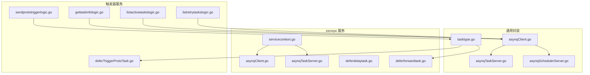
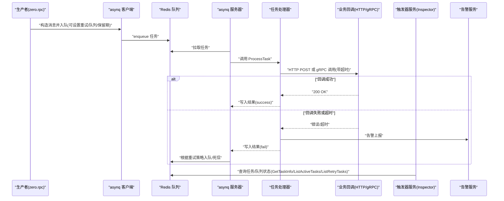
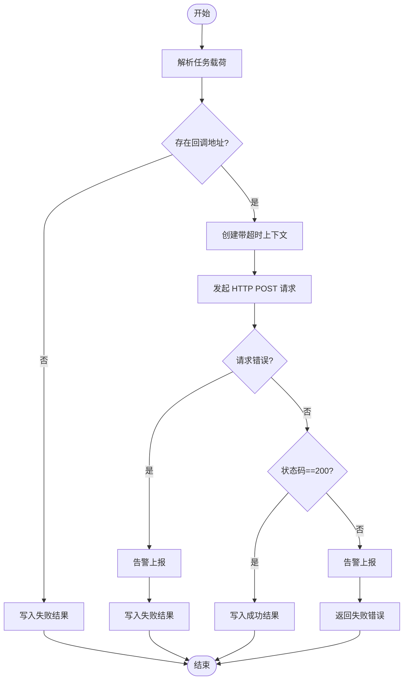
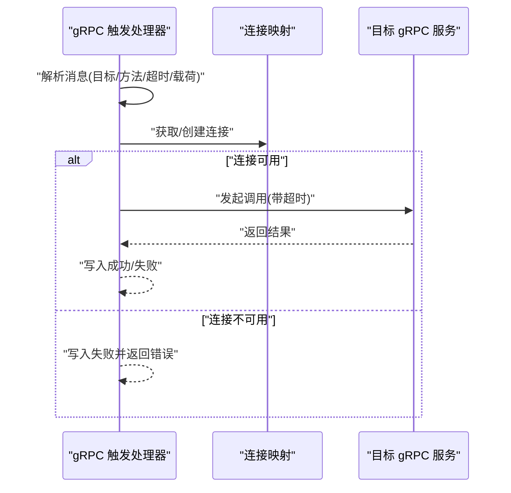
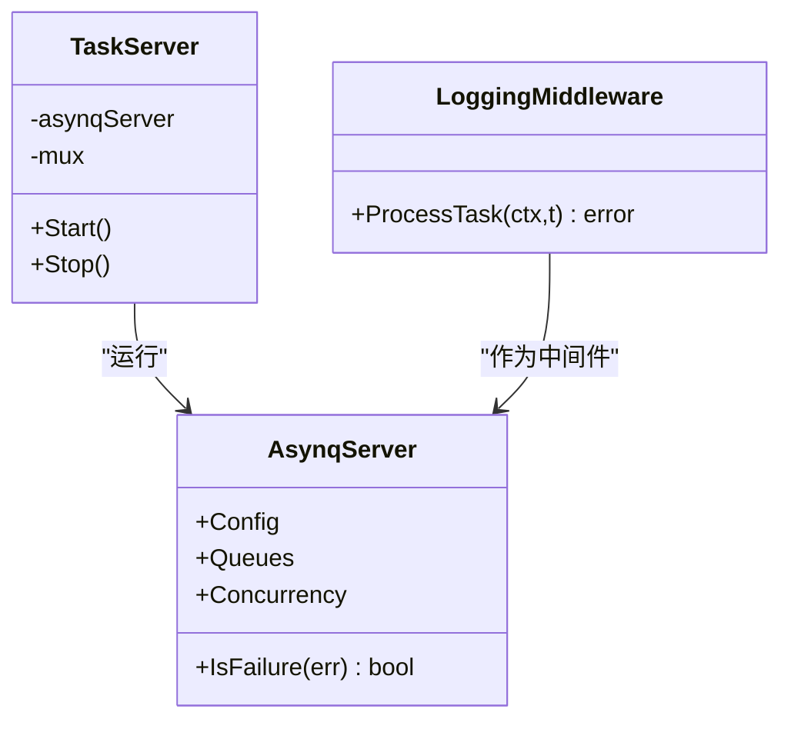
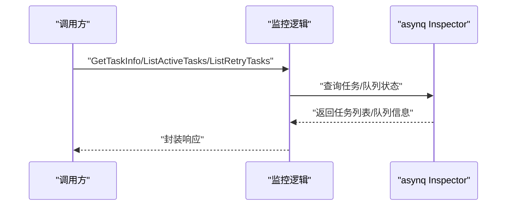
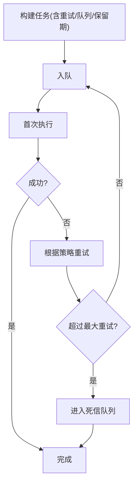
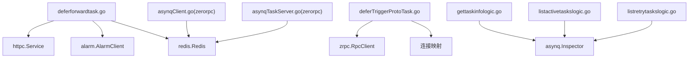

# 异步任务失败

<cite>
**本文引用的文件**
- [common/asynqx/asynqClient.go](file://common/asynqx/asynqClient.go)
- [common/asynqx/asynqTaskServer.go](file://common/asynqx/asynqTaskServer.go)
- [common/asynqx/asynqSchedulerServer.go](file://common/asynqx/asynqSchedulerServer.go)
- [common/asynqx/tasktype.go](file://common/asynqx/tasktype.go)
- [zerorpc/internal/svc/asynqClient.go](file://zerorpc/internal/svc/asynqClient.go)
- [zerorpc/internal/svc/asynqTaskServer.go](file://zerorpc/internal/svc/asynqTaskServer.go)
- [zerorpc/internal/svc/servicecontext.go](file://zerorpc/internal/svc/servicecontext.go)
- [zerorpc/internal/task/deferdelaytask.go](file://zerorpc/internal/task/deferdelaytask.go)
- [zerorpc/internal/task/deferforwardtask.go](file://zerorpc/internal/task/deferforwardtask.go)
- [app/trigger/internal/logic/gettaskinfologic.go](file://app/trigger/internal/logic/gettaskinfologic.go)
- [app/trigger/internal/logic/listactivetaskslogic.go](file://app/trigger/internal/logic/listactivetaskslogic.go)
- [app/trigger/internal/logic/listretrytaskslogic.go](file://app/trigger/internal/logic/listretrytaskslogic.go)
- [app/trigger/internal/logic/sendprototriggerlogic.go](file://app/trigger/internal/logic/sendprototriggerlogic.go)
- [app/trigger/internal/task/deferTriggerProtoTask.go](file://app/trigger/internal/task/deferTriggerProtoTask.go)
- [zerorpc/internal/config/config.go](file://zerorpc/internal/config/config.go)
</cite>

## 目录
1. [简介](#简介)
2. [项目结构](#项目结构)
3. [核心组件](#核心组件)
4. [架构总览](#架构总览)
5. [详细组件分析](#详细组件分析)
6. [依赖分析](#依赖分析)
7. [性能考量](#性能考量)
8. [故障排除指南](#故障排除指南)
9. [结论](#结论)
10. [附录](#附录)

## 简介
本指南聚焦于 zero-service 中基于 asynq 的异步任务失败问题排查与修复。内容覆盖：
- 回调失败的常见原因：HTTP/gRPC 回调地址不可达、业务系统响应超时、回调格式错误等
- asynq 工作器状态检查：进程健康、Redis 队列监控、任务重试机制
- 任务重试策略配置：最大重试次数、指数退避参数、死信队列
- 任务状态监控 API：GetTaskInfo、ListActiveTasks、ListRetryTasks 等
- 日志分析方法：错误码解读、执行时间统计、性能瓶颈定位

## 项目结构
围绕 asynq 的异步任务能力，代码主要分布在以下模块：
- 通用 asynq 客户端与服务器封装：common/asynqx
- 业务侧服务上下文与任务处理器：zerorpc/internal/svc 与 zerorpc/internal/task
- 触发器服务的任务查询与重试查看：app/trigger/internal/logic
- 触发器服务的 gRPC 协议与任务类型定义：app/trigger/trigger 与 common/asynqx/tasktype.go

**图表来源**
- [common/asynqx/asynqClient.go:1-31](file://common/asynqx/asynqClient.go#L1-L31)
- [common/asynqx/asynqTaskServer.go:1-87](file://common/asynqx/asynqTaskServer.go#L1-L87)
- [common/asynqx/asynqSchedulerServer.go:1-62](file://common/asynqx/asynqSchedulerServer.go#L1-L62)
- [common/asynqx/tasktype.go:1-10](file://common/asynqx/tasktype.go#L1-L10)
- [zerorpc/internal/svc/servicecontext.go:1-102](file://zerorpc/internal/svc/servicecontext.go#L1-L102)
- [zerorpc/internal/svc/asynqClient.go:1-28](file://zerorpc/internal/svc/asynqClient.go#L1-L28)
- [zerorpc/internal/svc/asynqTaskServer.go:1-74](file://zerorpc/internal/svc/asynqTaskServer.go#L1-L74)
- [zerorpc/internal/task/deferdelaytask.go:1-37](file://zerorpc/internal/task/deferdelaytask.go#L1-L37)
- [zerorpc/internal/task/deferforwardtask.go:1-97](file://zerorpc/internal/task/deferforwardtask.go#L1-L97)
- [app/trigger/internal/logic/gettaskinfologic.go:1-44](file://app/trigger/internal/logic/gettaskinfologic.go#L1-L44)
- [app/trigger/internal/logic/listactivetaskslogic.go:1-53](file://app/trigger/internal/logic/listactivetaskslogic.go#L1-L53)
- [app/trigger/internal/logic/listretrytaskslogic.go:1-52](file://app/trigger/internal/logic/listretrytaskslogic.go#L1-L52)
- [app/trigger/internal/logic/sendprototriggerlogic.go:1-81](file://app/trigger/internal/logic/sendprototriggerlogic.go#L1-L81)
- [app/trigger/internal/task/deferTriggerProtoTask.go:1-76](file://app/trigger/internal/task/deferTriggerProtoTask.go#L1-L76)

**章节来源**
- [common/asynqx/asynqClient.go:1-31](file://common/asynqx/asynqClient.go#L1-L31)
- [common/asynqx/asynqTaskServer.go:1-87](file://common/asynqx/asynqTaskServer.go#L1-L87)
- [common/asynqx/asynqSchedulerServer.go:1-62](file://common/asynqx/asynqSchedulerServer.go#L1-L62)
- [common/asynqx/tasktype.go:1-10](file://common/asynqx/tasktype.go#L1-L10)
- [zerorpc/internal/svc/servicecontext.go:1-102](file://zerorpc/internal/svc/servicecontext.go#L1-L102)
- [zerorpc/internal/svc/asynqClient.go:1-28](file://zerorpc/internal/svc/asynqClient.go#L1-L28)
- [zerorpc/internal/svc/asynqTaskServer.go:1-74](file://zerorpc/internal/svc/asynqTaskServer.go#L1-L74)
- [zerorpc/internal/task/deferdelaytask.go:1-37](file://zerorpc/internal/task/deferdelaytask.go#L1-L37)
- [zerorpc/internal/task/deferforwardtask.go:1-97](file://zerorpc/internal/task/deferforwardtask.go#L1-L97)
- [app/trigger/internal/logic/gettaskinfologic.go:1-44](file://app/trigger/internal/logic/gettaskinfologic.go#L1-L44)
- [app/trigger/internal/logic/listactivetaskslogic.go:1-53](file://app/trigger/internal/logic/listactivetaskslogic.go#L1-L53)
- [app/trigger/internal/logic/listretrytaskslogic.go:1-52](file://app/trigger/internal/logic/listretrytaskslogic.go#L1-L52)
- [app/trigger/internal/logic/sendprototriggerlogic.go:1-81](file://app/trigger/internal/logic/sendprototriggerlogic.go#L1-L81)
- [app/trigger/internal/task/deferTriggerProtoTask.go:1-76](file://app/trigger/internal/task/deferTriggerProtoTask.go#L1-L76)

## 核心组件
- asynq 客户端与 Inspector
  - 通用客户端与 Inspector 构造：用于生产任务与查询队列状态
  - 业务侧同样提供独立的客户端与服务器封装，便于在不同服务中复用
- asynq 服务器与调度器
  - 服务器配置包含并发度、队列优先级、失败判定回调、日志记录器
  - 调度器支持定时任务入队，并提供入队后的后置钩子记录异常
- 任务类型
  - 定义延迟任务、触发任务、定时任务等类型常量，统一命名规范
- 业务任务处理器
  - 延迟任务处理器：解包透传上下文，执行简单业务
  - HTTP 转发任务处理器：对回调地址进行超时控制与状态码校验，失败时告警并写入结果
  - gRPC 触发任务处理器：解析 gRPC 目标、超时、载荷，建立连接并发起调用
- 触发器服务监控逻辑
  - GetTaskInfo：按队列与任务 ID 查询任务详情
  - ListActiveTasks：分页列出活跃任务并返回队列信息
  - ListRetryTasks：分页列出重试任务并返回队列信息
  - SendProtoTrigger：发送 gRPC 触发任务，支持设置最大重试、队列与保留期

**章节来源**
- [common/asynqx/asynqClient.go:1-31](file://common/asynqx/asynqClient.go#L1-L31)
- [common/asynqx/asynqTaskServer.go:1-87](file://common/asynqx/asynqTaskServer.go#L1-L87)
- [common/asynqx/asynqSchedulerServer.go:1-62](file://common/asynqx/asynqSchedulerServer.go#L1-L62)
- [common/asynqx/tasktype.go:1-10](file://common/asynqx/tasktype.go#L1-L10)
- [zerorpc/internal/svc/asynqClient.go:1-28](file://zerorpc/internal/svc/asynqClient.go#L1-L28)
- [zerorpc/internal/svc/asynqTaskServer.go:1-74](file://zerorpc/internal/svc/asynqTaskServer.go#L1-L74)
- [zerorpc/internal/task/deferdelaytask.go:1-37](file://zerorpc/internal/task/deferdelaytask.go#L1-L37)
- [zerorpc/internal/task/deferforwardtask.go:1-97](file://zerorpc/internal/task/deferforwardtask.go#L1-L97)
- [app/trigger/internal/logic/gettaskinfologic.go:1-44](file://app/trigger/internal/logic/gettaskinfologic.go#L1-L44)
- [app/trigger/internal/logic/listactivetaskslogic.go:1-53](file://app/trigger/internal/logic/listactivetaskslogic.go#L1-L53)
- [app/trigger/internal/logic/listretrytaskslogic.go:1-52](file://app/trigger/internal/logic/listretrytaskslogic.go#L1-L52)
- [app/trigger/internal/logic/sendprototriggerlogic.go:1-81](file://app/trigger/internal/logic/sendprototriggerlogic.go#L1-L81)
- [app/trigger/internal/task/deferTriggerProtoTask.go:1-76](file://app/trigger/internal/task/deferTriggerProtoTask.go#L1-L76)

## 架构总览
下图展示从生产者到消费者、再到回调系统的整体流程，以及监控与告警的关键节点。

**图表来源**
- [zerorpc/internal/task/deferforwardtask.go:1-97](file://zerorpc/internal/task/deferforwardtask.go#L1-L97)
- [app/trigger/internal/task/deferTriggerProtoTask.go:1-76](file://app/trigger/internal/task/deferTriggerProtoTask.go#L1-L76)
- [app/trigger/internal/logic/gettaskinfologic.go:1-44](file://app/trigger/internal/logic/gettaskinfologic.go#L1-L44)
- [app/trigger/internal/logic/listactivetaskslogic.go:1-53](file://app/trigger/internal/logic/listactivetaskslogic.go#L1-L53)
- [app/trigger/internal/logic/listretrytaskslogic.go:1-52](file://app/trigger/internal/logic/listretrytaskslogic.go#L1-L52)
- [common/asynqx/asynqClient.go:1-31](file://common/asynqx/asynqClient.go#L1-L31)
- [common/asynqx/asynqTaskServer.go:1-87](file://common/asynqx/asynqTaskServer.go#L1-L87)

## 详细组件分析

### 组件一：HTTP 回调失败诊断（zerorpc/internal/task/deferforwardtask.go）
- 关键点
  - 使用带超时的上下文向回调地址发起 HTTP POST 请求
  - 对非 200 状态码进行告警并返回失败结果
  - 失败时通过告警客户端上报，便于快速定位
- 常见失败原因
  - 回调地址不可达或网络异常
  - 业务系统响应超时（当前超时固定为短时窗口）
  - 回调格式错误或业务系统内部异常
- 排查建议
  - 确认回调地址可达性与防火墙策略
  - 检查目标系统健康与限流策略
  - 校验请求体与鉴权头是否正确
  - 结合告警内容与日志定位具体 traceID

**图表来源**
- [zerorpc/internal/task/deferforwardtask.go:1-97](file://zerorpc/internal/task/deferforwardtask.go#L1-L97)

**章节来源**
- [zerorpc/internal/task/deferforwardtask.go:1-97](file://zerorpc/internal/task/deferforwardtask.go#L1-L97)

### 组件二：gRPC 回调失败诊断（app/trigger/internal/task/deferTriggerProtoTask.go）
- 关键点
  - 解析 gRPC 目标、方法、超时与载荷
  - 动态建立连接并发起调用，必要时注入元数据拦截器
  - 若连接初始化失败则直接写入失败结果
- 常见失败原因
  - gRPC 目标非法或不可达
  - 连接池未初始化或连接断开
  - 调用超时或业务方法内部异常
- 排查建议
  - 校验 gRPC 目标正则匹配与网络连通性
  - 检查连接池状态与超时配置
  - 结合日志与告警定位具体方法与错误

**图表来源**
- [app/trigger/internal/task/deferTriggerProtoTask.go:1-76](file://app/trigger/internal/task/deferTriggerProtoTask.go#L1-L76)

**章节来源**
- [app/trigger/internal/task/deferTriggerProtoTask.go:1-76](file://app/trigger/internal/task/deferTriggerProtoTask.go#L1-L76)

### 组件三：工作器状态检查与日志（common/asynqx/asynqTaskServer.go）
- 关键点
  - 服务器配置包含并发度、队列优先级、失败判定回调、日志记录器
  - 提供中间件记录处理耗时与错误
- 健康检查要点
  - 观察启动日志与 panic 记录
  - 通过日志统计处理耗时分布，识别慢任务
  - 检查队列堆积与重试任务数量

**图表来源**
- [common/asynqx/asynqTaskServer.go:1-87](file://common/asynqx/asynqTaskServer.go#L1-L87)

**章节来源**
- [common/asynqx/asynqTaskServer.go:1-87](file://common/asynqx/asynqTaskServer.go#L1-L87)

### 组件四：任务状态监控 API（app/trigger/internal/logic/*）
- GetTaskInfo：按队列与任务 ID 查询任务详情
- ListActiveTasks：分页列出活跃任务并返回队列信息
- ListRetryTasks：分页列出重试任务并返回队列信息
- 应用场景
  - 快速定位失败任务与重试次数
  - 分析队列负载与堆积情况
  - 辅助人工干预与清理

**图表来源**
- [app/trigger/internal/logic/gettaskinfologic.go:1-44](file://app/trigger/internal/logic/gettaskinfologic.go#L1-L44)
- [app/trigger/internal/logic/listactivetaskslogic.go:1-53](file://app/trigger/internal/logic/listactivetaskslogic.go#L1-L53)
- [app/trigger/internal/logic/listretrytaskslogic.go:1-52](file://app/trigger/internal/logic/listretrytaskslogic.go#L1-L52)

**章节来源**
- [app/trigger/internal/logic/gettaskinfologic.go:1-44](file://app/trigger/internal/logic/gettaskinfologic.go#L1-L44)
- [app/trigger/internal/logic/listactivetaskslogic.go:1-53](file://app/trigger/internal/logic/listactivetaskslogic.go#L1-L53)
- [app/trigger/internal/logic/listretrytaskslogic.go:1-52](file://app/trigger/internal/logic/listretrytaskslogic.go#L1-L52)

### 组件五：重试策略与死信队列配置（app/trigger/internal/logic/sendprototriggerlogic.go）
- 关键点
  - 支持设置最大重试次数、队列与保留期
  - 通过 asynq 选项传递给任务
- 参数说明
  - MaxRetry：最大重试次数
  - Queue：目标队列（如 critical/default/low）
  - Retention：任务保留期
- 注意事项
  - 合理设置重试间隔与退避策略（需结合 asynq 默认行为与业务需求）
  - 死信队列用于兜底，避免无限重试造成资源浪费

**图表来源**
- [app/trigger/internal/logic/sendprototriggerlogic.go:1-81](file://app/trigger/internal/logic/sendprototriggerlogic.go#L1-L81)

**章节来源**
- [app/trigger/internal/logic/sendprototriggerlogic.go:1-81](file://app/trigger/internal/logic/sendprototriggerlogic.go#L1-L81)

## 依赖分析
- 组件耦合
  - 业务任务处理器依赖服务上下文中的 HTTP 客户端、告警客户端与 Redis
  - 触发器服务通过 Inspector 依赖 Redis 查询任务状态
  - 通用封装与业务封装相互独立，便于跨服务复用
- 外部依赖
  - Redis：作为队列存储与任务持久化
  - OpenTelemetry：用于生产/消费 Span 注入与追踪
  - Go-Zero：日志、时间工具与 RPC 客户端/服务端集成

**图表来源**
- [zerorpc/internal/task/deferforwardtask.go:1-97](file://zerorpc/internal/task/deferforwardtask.go#L1-L97)
- [app/trigger/internal/task/deferTriggerProtoTask.go:1-76](file://app/trigger/internal/task/deferTriggerProtoTask.go#L1-L76)
- [app/trigger/internal/logic/gettaskinfologic.go:1-44](file://app/trigger/internal/logic/gettaskinfologic.go#L1-L44)
- [app/trigger/internal/logic/listactivetaskslogic.go:1-53](file://app/trigger/internal/logic/listactivetaskslogic.go#L1-L53)
- [app/trigger/internal/logic/listretrytaskslogic.go:1-52](file://app/trigger/internal/logic/listretrytaskslogic.go#L1-L52)
- [zerorpc/internal/svc/asynqClient.go:1-28](file://zerorpc/internal/svc/asynqClient.go#L1-L28)
- [zerorpc/internal/svc/asynqTaskServer.go:1-74](file://zerorpc/internal/svc/asynqTaskServer.go#L1-L74)

**章节来源**
- [zerorpc/internal/task/deferforwardtask.go:1-97](file://zerorpc/internal/task/deferforwardtask.go#L1-L97)
- [app/trigger/internal/task/deferTriggerProtoTask.go:1-76](file://app/trigger/internal/task/deferTriggerProtoTask.go#L1-L76)
- [app/trigger/internal/logic/gettaskinfologic.go:1-44](file://app/trigger/internal/logic/gettaskinfologic.go#L1-L44)
- [app/trigger/internal/logic/listactivetaskslogic.go:1-53](file://app/trigger/internal/logic/listactivetaskslogic.go#L1-L53)
- [app/trigger/internal/logic/listretrytaskslogic.go:1-52](file://app/trigger/internal/logic/listretrytaskslogic.go#L1-L52)
- [zerorpc/internal/svc/asynqClient.go:1-28](file://zerorpc/internal/svc/asynqClient.go#L1-L28)
- [zerorpc/internal/svc/asynqTaskServer.go:1-74](file://zerorpc/internal/svc/asynqTaskServer.go#L1-L74)

## 性能考量
- 并发与队列
  - 服务器并发度与队列优先级直接影响吞吐与公平性
  - 建议为高优先级任务分配更高并发与更优队列权重
- 超时与重试
  - 回调超时应与业务 SLA 匹配，避免过短导致误判
  - 重试策略需结合退避算法，防止雪崩效应
- 日志与追踪
  - 通过中间件记录处理耗时，辅助定位慢任务
  - 利用 OpenTelemetry 跨服务追踪，快速定位瓶颈

## 故障排除指南

### 一、HTTP 回调失败
- 现象
  - 任务写入失败结果，触发器服务告警
- 排查步骤
  1) 使用 GetTaskInfo 获取任务详情，确认队列与任务 ID
  2) 检查 ListActiveTasks 与 ListRetryTasks，确认是否堆积或重试过多
  3) 查看日志中错误码与耗时，定位超时或状态码异常
  4) 校验回调地址可达性与鉴权头
  5) 如为业务系统异常，配合对方系统日志定位

**章节来源**
- [zerorpc/internal/task/deferforwardtask.go:1-97](file://zerorpc/internal/task/deferforwardtask.go#L1-L97)
- [app/trigger/internal/logic/gettaskinfologic.go:1-44](file://app/trigger/internal/logic/gettaskinfologic.go#L1-L44)
- [app/trigger/internal/logic/listactivetaskslogic.go:1-53](file://app/trigger/internal/logic/listactivetaskslogic.go#L1-L53)
- [app/trigger/internal/logic/listretrytaskslogic.go:1-52](file://app/trigger/internal/logic/listretrytaskslogic.go#L1-L52)

### 二、gRPC 回调失败
- 现象
  - 连接初始化失败或调用超时，写入失败结果
- 排查步骤
  1) 校验 gRPC 目标正则匹配与网络连通性
  2) 检查连接池状态与超时配置
  3) 通过日志定位具体方法与错误码
  4) 必要时调整超时与重试策略

**章节来源**
- [app/trigger/internal/task/deferTriggerProtoTask.go:1-76](file://app/trigger/internal/task/deferTriggerProtoTask.go#L1-L76)

### 三、工作器状态检查
- 健康检查
  - 观察启动日志与 panic 记录
  - 通过日志统计处理耗时分布，识别慢任务
- Redis 队列监控
  - 使用 ListActiveTasks 与 ListRetryTasks 获取队列信息
  - 结合 GetTaskInfo 定位具体失败任务

**章节来源**
- [common/asynqx/asynqTaskServer.go:1-87](file://common/asynqx/asynqTaskServer.go#L1-L87)
- [app/trigger/internal/logic/listactivetaskslogic.go:1-53](file://app/trigger/internal/logic/listactivetaskslogic.go#L1-L53)
- [app/trigger/internal/logic/listretrytaskslogic.go:1-52](file://app/trigger/internal/logic/listretrytaskslogic.go#L1-L52)
- [app/trigger/internal/logic/gettaskinfologic.go:1-44](file://app/trigger/internal/logic/gettaskinfologic.go#L1-L44)

### 四、任务重试策略配置
- 最大重试次数
  - 在发送触发任务时设置 MaxRetry
- 指数退避参数
  - asynq 默认提供退避策略；如需自定义，可在服务器配置中结合 IsFailure 与队列策略
- 死信队列
  - 超过最大重试后进入死信队列，便于后续人工干预与审计

**章节来源**
- [app/trigger/internal/logic/sendprototriggerlogic.go:1-81](file://app/trigger/internal/logic/sendprototriggerlogic.go#L1-L81)
- [common/asynqx/asynqTaskServer.go:1-87](file://common/asynqx/asynqTaskServer.go#L1-L87)

### 五、任务状态监控 API 实战
- GetTaskInfo
  - 输入：队列名、任务 ID
  - 输出：任务详情（状态、重试次数、错误等）
- ListActiveTasks
  - 输入：队列名、分页参数
  - 输出：活跃任务列表与队列信息
- ListRetryTasks
  - 输入：队列名、分页参数
  - 输出：重试任务列表与队列信息

**章节来源**
- [app/trigger/internal/logic/gettaskinfologic.go:1-44](file://app/trigger/internal/logic/gettaskinfologic.go#L1-L44)
- [app/trigger/internal/logic/listactivetaskslogic.go:1-53](file://app/trigger/internal/logic/listactivetaskslogic.go#L1-L53)
- [app/trigger/internal/logic/listretrytaskslogic.go:1-52](file://app/trigger/internal/logic/listretrytaskslogic.go#L1-L52)

### 六、日志分析方法
- 错误码解读
  - HTTP 回调：关注状态码与错误信息
  - gRPC 回调：关注连接与调用错误
- 执行时间统计
  - 通过中间件记录处理耗时，定位慢任务
- 性能瓶颈定位
  - 结合队列堆积、重试次数与日志耗时，判断是网络、业务还是工作器瓶颈

**章节来源**
- [common/asynqx/asynqTaskServer.go:1-87](file://common/asynqx/asynqTaskServer.go#L1-L87)
- [zerorpc/internal/task/deferforwardtask.go:1-97](file://zerorpc/internal/task/deferforwardtask.go#L1-L97)
- [app/trigger/internal/task/deferTriggerProtoTask.go:1-76](file://app/trigger/internal/task/deferTriggerProtoTask.go#L1-L76)

## 结论
- 异步任务失败通常由回调不可达、超时或格式错误引起
- 通过 asynq 的 Inspector API 可快速定位失败任务与队列状态
- 合理配置重试策略与死信队列，结合日志与追踪，可有效提升稳定性与可观测性
- 建议在生产环境持续监控活跃与重试任务数量，及时发现并处理异常

## 附录
- 配置参考
  - Redis 连接与超时：参见 asynq 服务器与客户端构造
  - 日志与追踪：参见中间件与 Span 注入
  - 任务类型：参见任务类型常量定义

**章节来源**
- [zerorpc/internal/config/config.go:1-25](file://zerorpc/internal/config/config.go#L1-L25)
- [common/asynqx/asynqClient.go:1-31](file://common/asynqx/asynqClient.go#L1-L31)
- [common/asynqx/asynqTaskServer.go:1-87](file://common/asynqx/asynqTaskServer.go#L1-L87)
- [common/asynqx/tasktype.go:1-10](file://common/asynqx/tasktype.go#L1-L10)