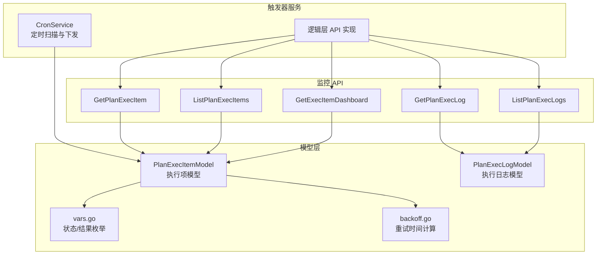
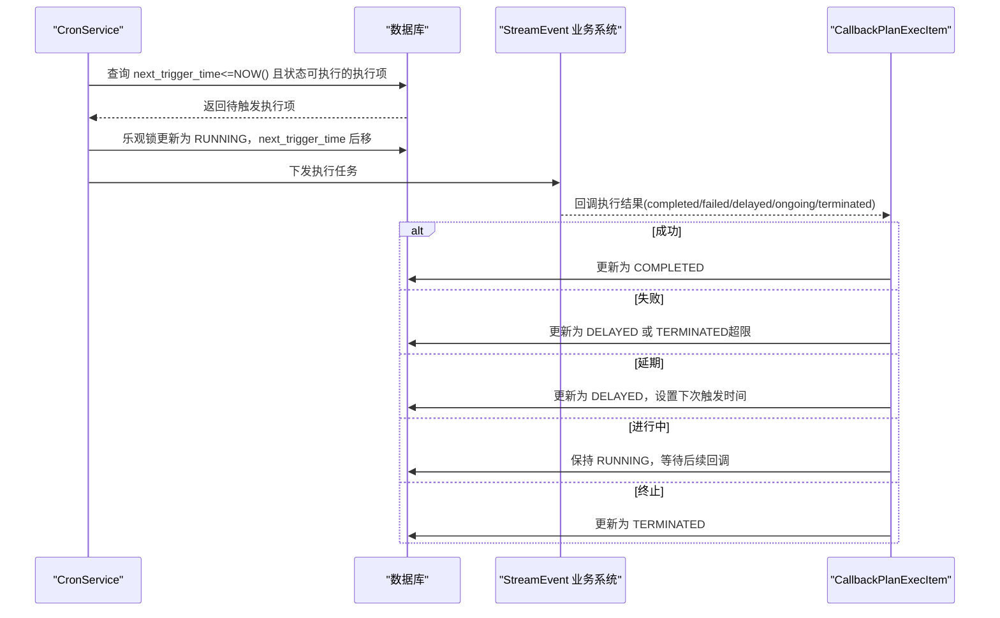
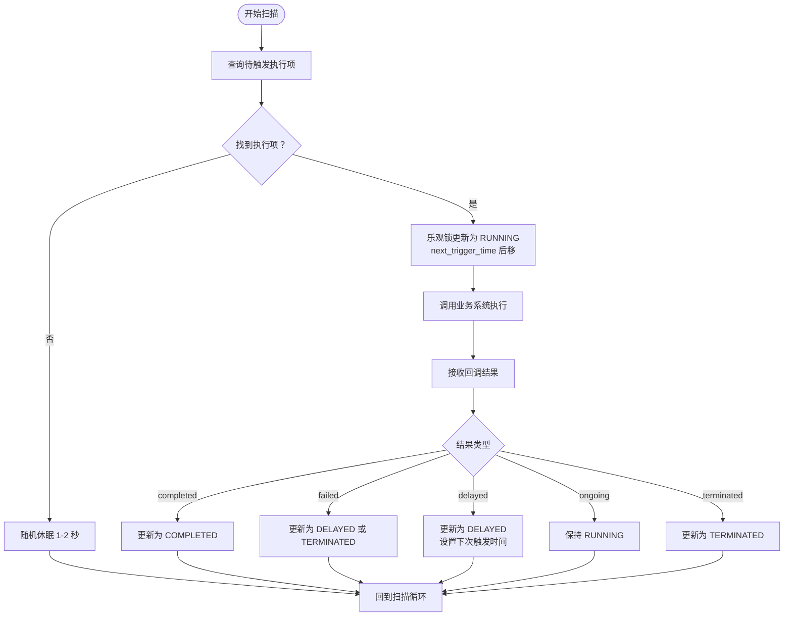
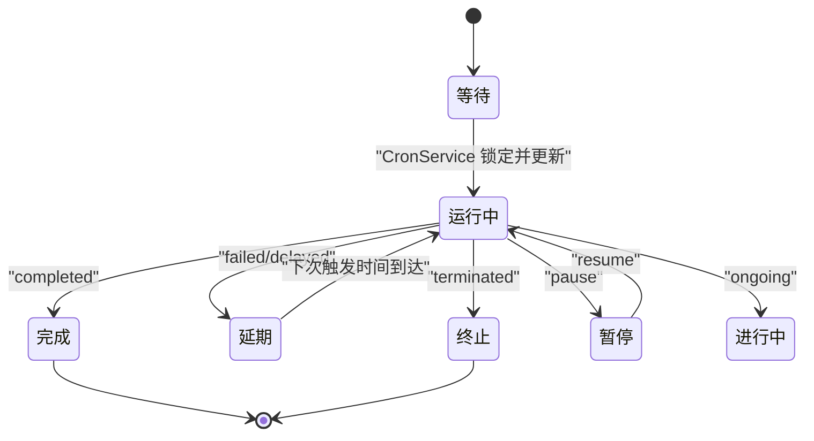
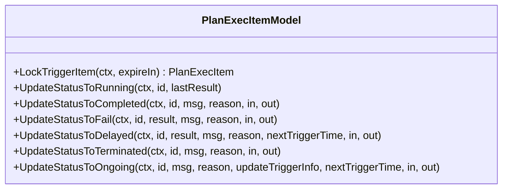
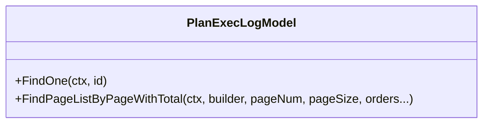
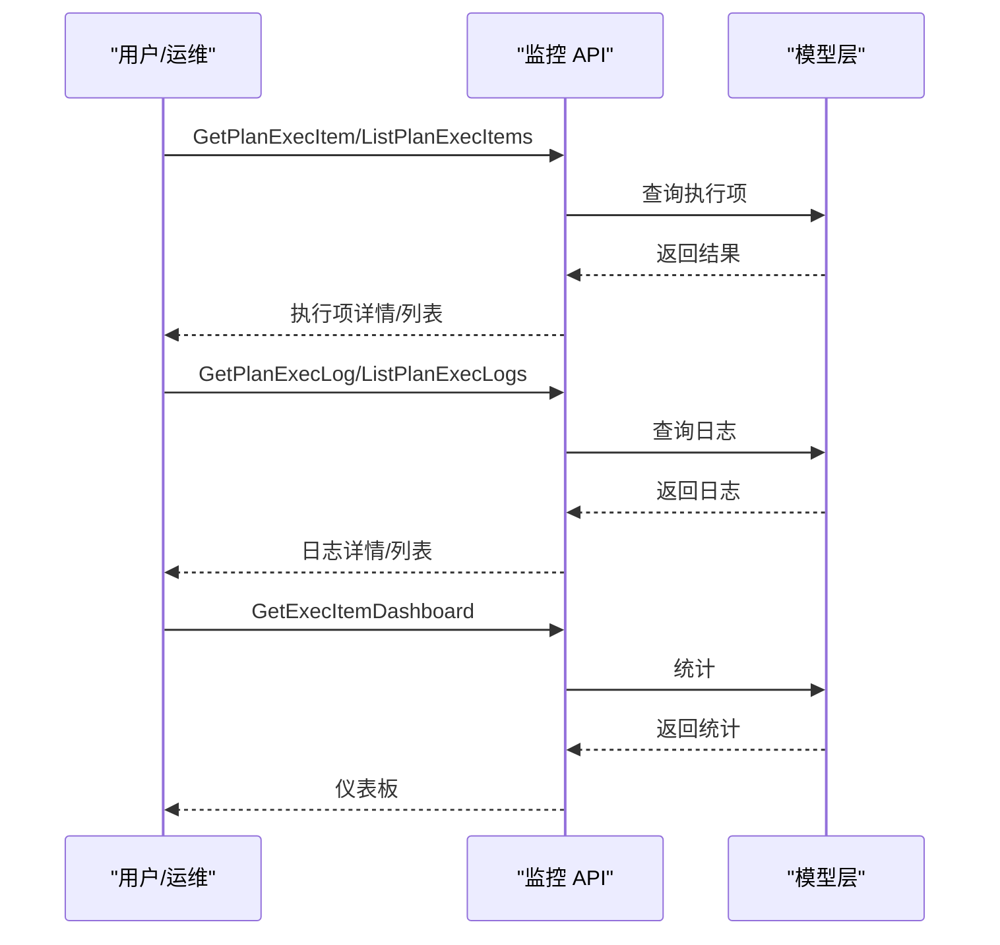
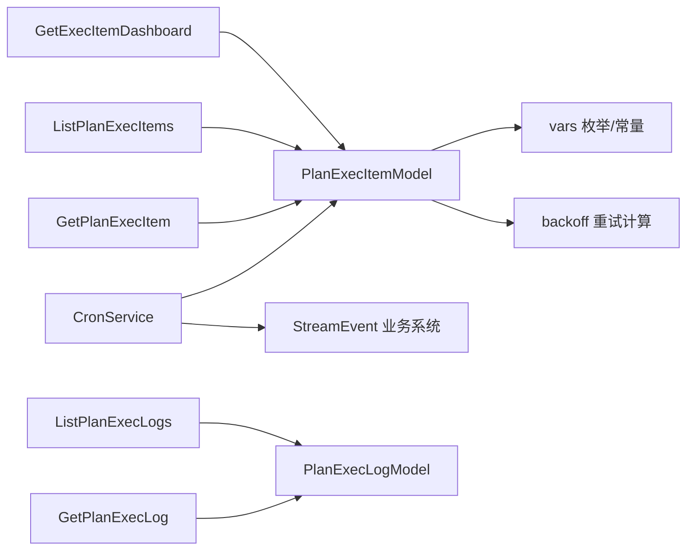

# 计划任务失败

<cite>
**本文引用的文件**
- [cronservice.go](file://app/trigger/cron/cronservice.go)
- [trigger.md](file://docs/trigger.md)
- [planexecitemmodel.go](file://model/planexecitemmodel.go)
- [planexeclogmodel.go](file://model/planexeclogmodel.go)
- [vars.go](file://model/vars.go)
- [getexecitemdashboardlogic.go](file://app/trigger/internal/logic/getexecitemdashboardlogic.go)
- [listplanexecitemslogic.go](file://app/trigger/internal/logic/listplanexecitemslogic.go)
- [getplanexecitemlogic.go](file://app/trigger/internal/logic/getplanexecitemlogic.go)
- [listplanexeclogslogic.go](file://app/trigger/internal/logic/listplanexeclogslogic.go)
- [getplanexecloglogic.go](file://app/trigger/internal/logic/getplanexecloglogic.go)
- [backoff.go](file://common/tool/backoff.go)
- [trigger.pb.go](file://app/trigger/trigger/trigger.pb.go)
- [trigger.pb.validate.go](file://app/trigger/trigger/trigger.pb.validate.go)
- [genSql.sql](file://model/sql/genSql.sql)
- [postgres.sql](file://model/sql/postgres.sql)
- [resilience-patterns.md](file://.trae/skills/zero-skills/references/resilience-patterns.md)
</cite>

## 目录
1. [简介](#简介)
2. [项目结构](#项目结构)
3. [核心组件](#核心组件)
4. [架构总览](#架构总览)
5. [详细组件分析](#详细组件分析)
6. [依赖分析](#依赖分析)
7. [性能考虑](#性能考虑)
8. [故障排除指南](#故障排除指南)
9. [结论](#结论)
10. [附录](#附录)

## 简介
本指南聚焦于 zero-service 中“计划任务失败”的诊断与修复，围绕基于数据库扫描的 CronService 运行状态、数据库连接与执行项状态查询，系统性梳理状态流转（EXEC_ITEM_STATUS_FAILED、EXEC_ITEM_STATUS_DELAYED 等）、执行日志分析（PlanExecLog）以及监控 API 的使用（GetPlanExecItem、ListPlanExecItems、GetExecItemDashboard）。同时给出常见失败原因与解决方案，覆盖数据库锁冲突、业务系统调用失败、时间规则配置错误等场景。

## 项目结构
与计划任务失败排查直接相关的模块分布如下：
- 触发器服务（Trigger）：负责计划、批次、执行项的管理与回调；CronService 定时扫描执行项并下发到业务系统。
- 模型层（Model）：提供执行项与执行日志的数据库访问能力，包含状态枚举与重试计算工具。
- 逻辑层（Logic）：封装监控 API 的实现，如获取执行项详情、分页查询执行项、查询执行日志、仪表板统计等。
- 文档与规范：状态机、执行流程、重试机制等在文档中有明确说明。

**图表来源**
- [cronservice.go:58-85](file://app/trigger/cron/cronservice.go#L58-L85)
- [planexecitemmodel.go:74-144](file://model/planexecitemmodel.go#L74-L144)
- [planexeclogmodel.go:1-31](file://model/planexeclogmodel.go#L1-L31)
- [vars.go:135-153](file://model/vars.go#L135-L153)
- [backoff.go:9-40](file://common/tool/backoff.go#L9-L40)
- [getplanexecitemlogic.go:34-104](file://app/trigger/internal/logic/getplanexecitemlogic.go#L34-L104)
- [listplanexecitemslogic.go:28-133](file://app/trigger/internal/logic/listplanexecitemslogic.go#L28-L133)
- [getplanexecloglogic.go:31-74](file://app/trigger/internal/logic/getplanexecloglogic.go#L31-L74)
- [listplanexeclogslogic.go:28-101](file://app/trigger/internal/logic/listplanexeclogslogic.go#L28-L101)
- [getexecitemdashboardlogic.go:27-142](file://app/trigger/internal/logic/getexecitemdashboardlogic.go#L27-L142)

**章节来源**
- [cronservice.go:58-85](file://app/trigger/cron/cronservice.go#L58-L85)
- [trigger.md:95-158](file://docs/trigger.md#L95-L158)

## 核心组件
- CronService：定时扫描数据库中“下次触发时间已到且状态可执行”的执行项，乐观锁更新为 RUNNING，并调用业务系统；根据回调结果更新状态。
- PlanExecItemModel：提供锁触发、状态更新（完成/失败/延期/终止/进行中）等方法，内置重试时间计算。
- PlanExecLogModel：提供执行日志的查询能力。
- 监控 API：GetPlanExecItem、ListPlanExecItems、GetPlanExecLog、ListPlanExecLogs、GetExecItemDashboard。
- 状态与结果枚举：WAITING、DELAYED、RUNNING、PAUSED、COMPLETED、TERMINATED；completed、failed、delayed、ongoing、terminated。

**章节来源**
- [cronservice.go:81-144](file://app/trigger/cron/cronservice.go#L81-L144)
- [planexecitemmodel.go:165-399](file://model/planexecitemmodel.go#L165-L399)
- [planexeclogmodel.go:1-31](file://model/planexeclogmodel.go#L1-L31)
- [vars.go:135-153](file://model/vars.go#L135-L153)
- [trigger.pb.go:44-62](file://app/trigger/trigger/trigger.pb.go#L44-L62)

## 架构总览
下图展示从 CronService 扫描到业务回调的整体流程，以及状态机与重试机制：

**图表来源**
- [trigger.md:95-158](file://docs/trigger.md#L95-L158)
- [cronservice.go:338-413](file://app/trigger/cron/cronservice.go#L338-L413)
- [planexecitemmodel.go:202-271](file://model/planexecitemmodel.go#L202-L271)

## 详细组件分析

### CronService 扫描与状态更新
- 扫描循环：有待处理项时以 10ms 间隔轮询，无待处理项时以 1–2 秒随机间隔退避。
- 锁定与更新：先查询符合条件的执行项，再通过乐观锁将状态置为 RUNNING，并将 next_trigger_time 后移，避免重复触发。
- 回调处理：根据回调结果分别更新为完成、失败（进入 DELAYED 或 TERMINATED）、延期（设置下次触发时间）、进行中或终止。

**图表来源**
- [cronservice.go:58-85](file://app/trigger/cron/cronservice.go#L58-L85)
- [cronservice.go:213-246](file://app/trigger/cron/cronservice.go#L213-L246)
- [cronservice.go:338-413](file://app/trigger/cron/cronservice.go#L338-L413)
- [planexecitemmodel.go:202-271](file://model/planexecitemmodel.go#L202-L271)

**章节来源**
- [cronservice.go:58-85](file://app/trigger/cron/cronservice.go#L58-L85)
- [cronservice.go:213-246](file://app/trigger/cron/cronservice.go#L213-L246)
- [cronservice.go:338-413](file://app/trigger/cron/cronservice.go#L338-L413)

### 执行项状态机与重试机制
- 状态机：WAITING → RUNNING → COMPLETED/DELAYED/TERMINATED/PAUSED/ONGOING。
- 重试策略：首次失败后 10 秒重试，指数退避（最高 30 分钟），默认最多 25 次重试；超过上限自动终止。
- 重试上限保护：当失败次数达到阈值时，将 next_trigger_time 设为最大值（约 7 天），避免无限重试。

**图表来源**
- [trigger.md:108-158](file://docs/trigger.md#L108-L158)
- [vars.go:135-153](file://model/vars.go#L135-L153)
- [backoff.go:9-40](file://common/tool/backoff.go#L9-L40)

**章节来源**
- [trigger.md:108-158](file://docs/trigger.md#L108-L158)
- [vars.go:135-153](file://model/vars.go#L135-L153)
- [backoff.go:9-40](file://common/tool/backoff.go#L9-L40)

### 执行项模型与状态更新方法
- 锁触发：查询并乐观锁更新状态为 RUNNING，同时更新 next_trigger_time、last_trigger_time、version。
- 状态更新：提供 UpdateStatusToCompleted、UpdateStatusToFail、UpdateStatusToDelayed、UpdateStatusToTerminated、UpdateStatusToOngoing 等方法，均支持状态白/黑名单校验，确保原子性。
- 重试时间计算：根据失败次数与指数退避策略计算下次触发时间，必要时返回“超过上限”。

**图表来源**
- [planexecitemmodel.go:19-42](file://model/planexecitemmodel.go#L19-L42)
- [planexecitemmodel.go:74-144](file://model/planexecitemmodel.go#L74-L144)
- [planexecitemmodel.go:165-399](file://model/planexecitemmodel.go#L165-L399)

**章节来源**
- [planexecitemmodel.go:74-144](file://model/planexecitemmodel.go#L74-L144)
- [planexecitemmodel.go:165-399](file://model/planexecitemmodel.go#L165-L399)

### 执行日志模型与查询
- PlanExecLogModel 提供基础查询接口，逻辑层封装了 GetPlanExecLog 与 ListPlanExecLogs，支持按计划/执行项/执行 ID、时间范围、执行结果等条件分页查询。

**图表来源**
- [planexeclogmodel.go:10-13](file://model/planexeclogmodel.go#L10-L13)

**章节来源**
- [getplanexecloglogic.go:31-74](file://app/trigger/internal/logic/getplanexecloglogic.go#L31-L74)
- [listplanexeclogslogic.go:28-101](file://app/trigger/internal/logic/listplanexeclogslogic.go#L28-L101)

### 监控 API 使用
- GetPlanExecItem：按执行项主键或执行 ID 查询详情，返回完整字段与状态。
- ListPlanExecItems：支持按计划/批次/执行项 ID/名称、状态等条件分页查询，按下次触发时间排序。
- GetPlanExecLog / ListPlanExecLogs：查询单条日志或按条件分页查询日志，便于定位失败原因与重试次数。
- GetExecItemDashboard：按计划类型统计执行项总数、已完成、已终止、待完成、延期等指标。

**图表来源**
- [getplanexecitemlogic.go:34-104](file://app/trigger/internal/logic/getplanexecitemlogic.go#L34-L104)
- [listplanexecitemslogic.go:28-133](file://app/trigger/internal/logic/listplanexecitemslogic.go#L28-L133)
- [getplanexecloglogic.go:31-74](file://app/trigger/internal/logic/getplanexecloglogic.go#L31-L74)
- [listplanexeclogslogic.go:28-101](file://app/trigger/internal/logic/listplanexeclogslogic.go#L28-L101)
- [getexecitemdashboardlogic.go:27-142](file://app/trigger/internal/logic/getexecitemdashboardlogic.go#L27-L142)

**章节来源**
- [getplanexecitemlogic.go:34-104](file://app/trigger/internal/logic/getplanexecitemlogic.go#L34-L104)
- [listplanexecitemslogic.go:28-133](file://app/trigger/internal/logic/listplanexecitemslogic.go#L28-L133)
- [getplanexecloglogic.go:31-74](file://app/trigger/internal/logic/getplanexecloglogic.go#L31-L74)
- [listplanexeclogslogic.go:28-101](file://app/trigger/internal/logic/listplanexeclogslogic.go#L28-L101)
- [getexecitemdashboardlogic.go:27-142](file://app/trigger/internal/logic/getexecitemdashboardlogic.go#L27-L142)

## 依赖分析
- CronService 依赖 PlanExecItemModel 的锁触发与状态更新方法，依赖 StreamEvent 业务系统进行任务执行。
- 逻辑层 API 依赖模型层提供的查询与分页能力，依赖 Carbon 时间格式化。
- 重试时间计算由 backoff 工具函数提供，受 vars 中的枚举与常量影响。
- 监控 API 的输入参数具备 proto 校验，保证请求合法性。

**图表来源**
- [cronservice.go:213-246](file://app/trigger/cron/cronservice.go#L213-L246)
- [planexecitemmodel.go:165-399](file://model/planexecitemmodel.go#L165-L399)
- [getplanexecitemlogic.go:34-104](file://app/trigger/internal/logic/getplanexecitemlogic.go#L34-L104)
- [listplanexecitemslogic.go:28-133](file://app/trigger/internal/logic/listplanexecitemslogic.go#L28-L133)
- [getplanexecloglogic.go:31-74](file://app/trigger/internal/logic/getplanexecloglogic.go#L31-L74)
- [listplanexeclogslogic.go:28-101](file://app/trigger/internal/logic/listplanexeclogslogic.go#L28-L101)
- [getexecitemdashboardlogic.go:27-142](file://app/trigger/internal/logic/getexecitemdashboardlogic.go#L27-L142)
- [vars.go:135-153](file://model/vars.go#L135-L153)
- [backoff.go:9-40](file://common/tool/backoff.go#L9-L40)

**章节来源**
- [trigger.pb.validate.go:11104-11156](file://app/trigger/trigger/trigger.pb.validate.go#L11104-L11156)
- [trigger.pb.validate.go:11362-11452](file://app/trigger/trigger/trigger.pb.validate.go#L11362-L11452)

## 性能考虑
- 扫描频率：有任务时 10ms，空闲时 1–2 秒随机退避，降低数据库压力。
- 随机化：Postgres/MySQL 使用不同随机函数，避免热点集中。
- 乐观锁：通过 version 与状态白名单更新，减少并发冲突。
- 分页查询：监控 API 支持分页与多字段过滤，避免一次性拉取大量数据。
- 重试上限：超过上限后将 next_trigger_time 设为最大值，避免无限重试导致的资源消耗。

[本节为通用建议，无需特定文件引用]

## 故障排除指南

### 一、CronService 运行状态检查
- 确认 CronService 是否启动：查看启动/停止逻辑与 goroutine 生命周期。
- 观察扫描循环：是否有持续 10ms 扫描或长时间休眠，判断是否存在待处理项。
- 关注异常日志：状态更新失败、锁冲突、回调异常等情况的日志输出。

**章节来源**
- [cronservice.go:38-56](file://app/trigger/cron/cronservice.go#L38-L56)
- [cronservice.go:58-85](file://app/trigger/cron/cronservice.go#L58-L85)

### 二、数据库连接与执行项状态查询
- 执行项锁触发：确认 LockTriggerItem 查询条件（状态 IN(WAITING, DELAYED, RUNNING)，next_trigger_time ≤ NOW()，计划/批次有效）是否命中。
- 状态更新：核对 UpdateStatusToFail/UpdateStatusToDelayed/UpdateStatusToTerminated 的 in/out 白/黑名单是否正确。
- 数据库注释与字段：参考表结构注释，确保字段含义与业务一致。

**章节来源**
- [planexecitemmodel.go:74-144](file://model/planexecitemmodel.go#L74-L144)
- [planexecitemmodel.go:202-271](file://model/planexecitemmodel.go#L202-L271)
- [genSql.sql:69-87](file://model/sql/genSql.sql#L69-L87)
- [postgres.sql:225-246](file://model/sql/postgres.sql#L225-L246)

### 三、状态流转问题诊断
- EXEC_ITEM_STATUS_FAILED 对应业务回调 failed：检查 UpdateStatusToFail 是否被调用，失败次数与重试时间是否符合预期。
- EXEC_ITEM_STATUS_DELAYED 对应业务回调 delayed 或 failed：检查 UpdateStatusToDelayed 是否被调用，nextTriggerTime 是否合理。
- 重试上限：当失败次数超过阈值时，系统会自动终止（TERMINATED），需检查回调节流与业务系统稳定性。

**章节来源**
- [trigger.md:141-158](file://docs/trigger.md#L141-L158)
- [planexecitemmodel.go:202-271](file://model/planexecitemmodel.go#L202-L271)
- [backoff.go:9-40](file://common/tool/backoff.go#L9-L40)

### 四、执行日志分析（PlanExecLog）
- 查询维度：按计划 ID、执行项 ID、执行 ID、时间范围、执行结果等条件筛选。
- 关键字段：触发时间、执行结果、消息、重试次数等，用于定位失败原因与重试行为。
- 建议流程：先按执行 ID/时间范围缩小范围，再结合执行项状态与重试上限判断是业务失败还是系统策略终止。

**章节来源**
- [listplanexeclogslogic.go:28-101](file://app/trigger/internal/logic/listplanexeclogslogic.go#L28-L101)
- [getplanexecloglogic.go:31-74](file://app/trigger/internal/logic/getplanexecloglogic.go#L31-L74)

### 五、监控 API 实战
- GetPlanExecItem：快速定位单个执行项的当前状态、最近触发时间、重试次数、终止原因等。
- ListPlanExecItems：批量筛选与排序，定位异常执行项集合。
- GetExecItemDashboard：按计划类型统计总体情况，识别是否存在大面积延期或终止。

**章节来源**
- [getplanexecitemlogic.go:34-104](file://app/trigger/internal/logic/getplanexecitemlogic.go#L34-L104)
- [listplanexecitemslogic.go:28-133](file://app/trigger/internal/logic/listplanexecitemslogic.go#L28-L133)
- [getexecitemdashboardlogic.go:27-142](file://app/trigger/internal/logic/getexecitemdashboardlogic.go#L27-L142)

### 六、常见失败原因与解决方案
- 数据库锁冲突
  - 现象：乐观锁更新失败，状态未变更。
  - 排查：检查并发更新、网络抖动、事务未提交。
  - 解决：优化业务处理时长、缩短事务、增加重试与幂等。
- 业务系统调用失败
  - 现象：回调 failed，进入 DELAYED；若多次失败，最终 TERMINATED。
  - 排查：查看 PlanExecLog 的消息与重试次数，确认业务系统可用性与超时设置。
  - 解决：提升业务系统稳定性、增加超时与重试、隔离故障节点。
- 时间规则配置错误
  - 现象：nextTriggerTime 不合理或过去时间，导致延迟或无法触发。
  - 排查：核对回调中的 nextTriggerTime 格式与有效性。
  - 解决：修正时间规则、确保回调时间在未来。
- 重试上限导致终止
  - 现象：超过默认重试次数后自动终止。
  - 排查：确认失败次数与重试上限策略。
  - 解决：优化业务逻辑、调整重试策略或人工干预恢复。

**章节来源**
- [trigger.md:153-158](file://docs/trigger.md#L153-L158)
- [backoff.go:9-40](file://common/tool/backoff.go#L9-L40)
- [planexecitemmodel.go:202-271](file://model/planexecitemmodel.go#L202-L271)

## 结论
计划任务失败的诊断应从 CronService 扫描与状态更新入手，结合执行项与日志模型进行数据库层面的交叉验证，并利用监控 API 快速定位异常。通过理解状态机与重试机制，可以有针对性地解决数据库锁冲突、业务系统调用失败、时间规则配置错误等典型问题，从而提升系统的可靠性与可观测性。

[本节为总结，无需特定文件引用]

## 附录

### A. 关键字段与状态对照
- 执行项状态（PB 枚举）：WAITING、DELAYED、RUNNING、PAUSED、COMPLETED、TERMINATED。
- 业务结果（回调）：completed、failed、delayed、ongoing、terminated。
- 重试策略：指数退避，最高 30 分钟，默认最多 25 次，超限自动终止。

**章节来源**
- [trigger.pb.go:44-62](file://app/trigger/trigger/trigger.pb.go#L44-L62)
- [vars.go:135-153](file://model/vars.go#L135-L153)
- [trigger.md:153-158](file://docs/trigger.md#L153-L158)

### B. 请求参数校验（示例）
- GetPlanExecLogReq：Id ≥ 1。
- ListPlanExecLogsReq：无强制字段校验，建议按业务需求自行校验。

**章节来源**
- [trigger.pb.validate.go:11104-11156](file://app/trigger/trigger/trigger.pb.validate.go#L11104-L11156)
- [trigger.pb.validate.go:11362-11452](file://app/trigger/trigger/trigger.pb.validate.go#L11362-L11452)