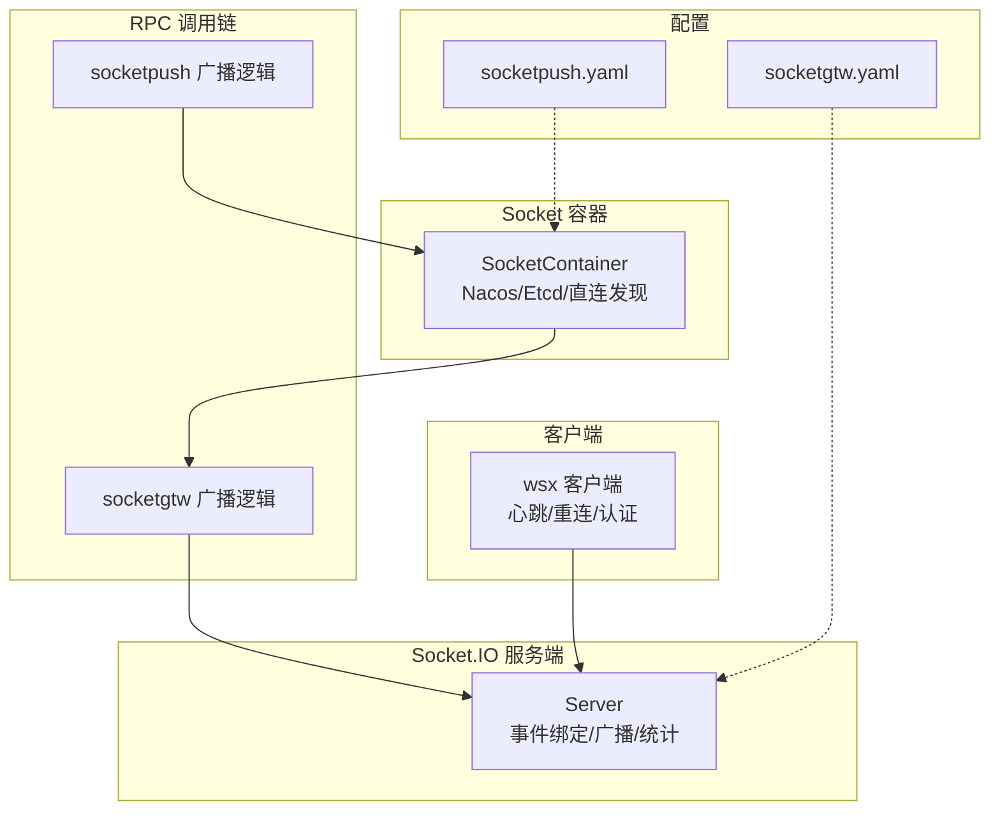
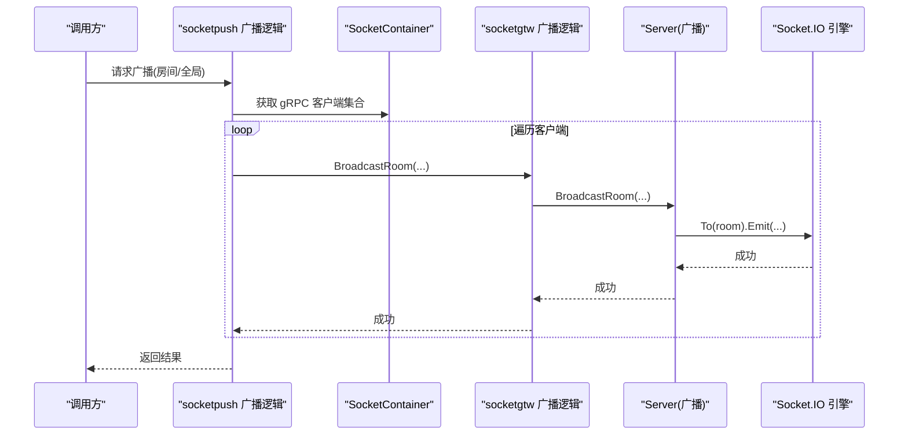
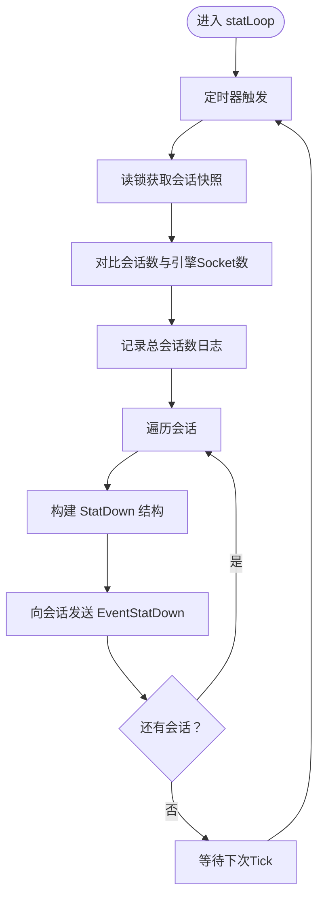
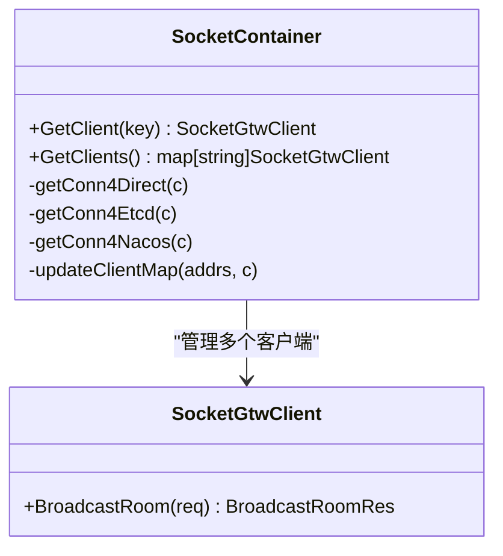
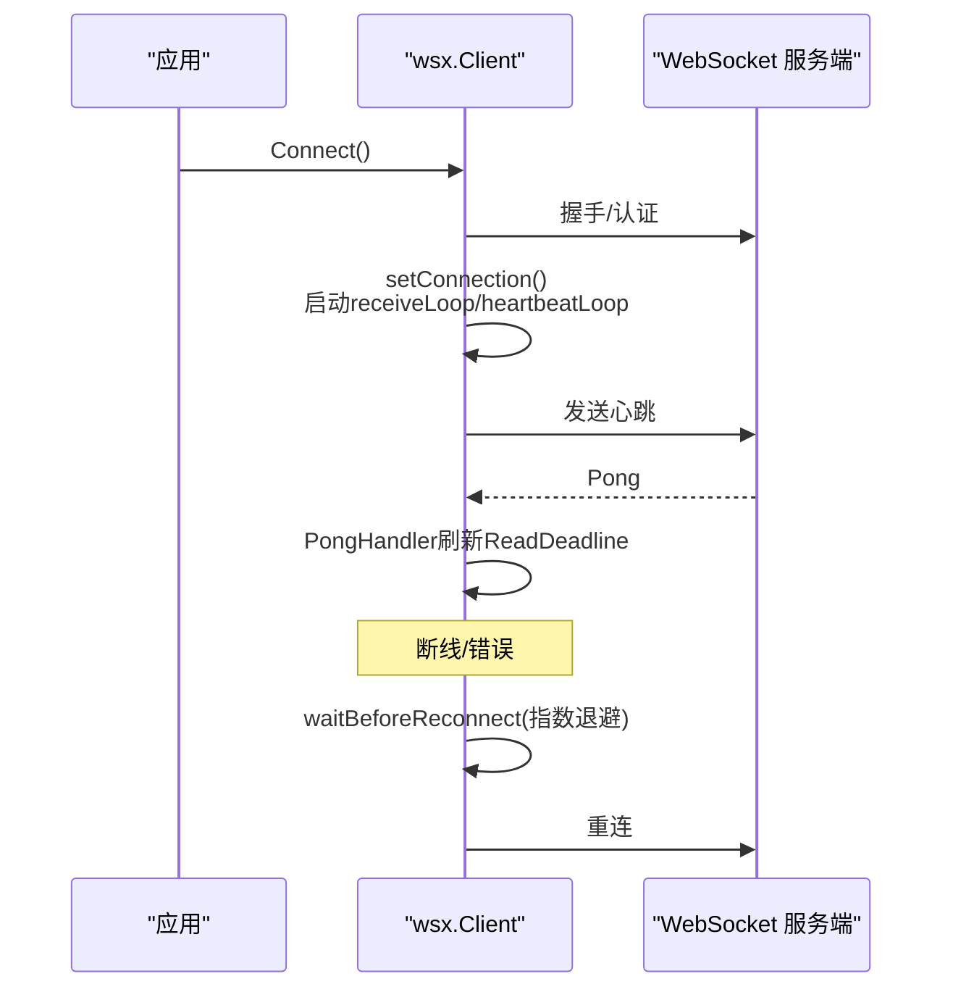
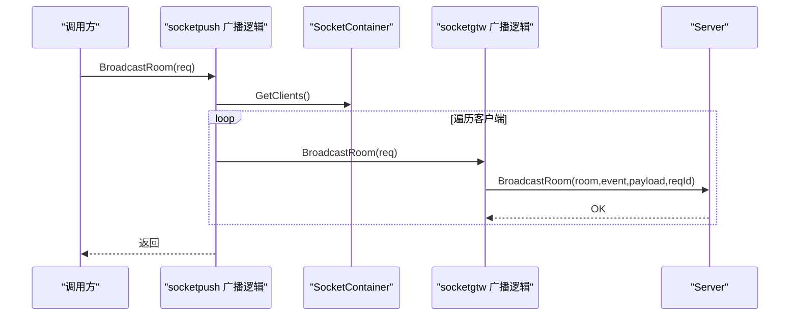

# WebSocket 性能问题

<cite>
**本文引用的文件**
- [common/socketiox/server.go](file://common/socketiox/server.go)
- [common/socketiox/container.go](file://common/socketiox/container.go)
- [common/wsx/client.go](file://common/wsx/client.go)
- [socketapp/socketgtw/internal/logic/broadcastroomlogic.go](file://socketapp/socketgtw/internal/logic/broadcastroomlogic.go)
- [socketapp/socketpush/internal/logic/broadcastroomlogic.go](file://socketapp/socketpush/internal/logic/broadcastroomlogic.go)
- [socketapp/socketgtw/etc/socketgtw.yaml](file://socketapp/socketgtw/etc/socketgtw.yaml)
- [socketapp/socketpush/etc/socketpush.yaml](file://socketapp/socketpush/etc/socketpush.yaml)
- [deploy/stat_analyzer.html](file://deploy/stat_analyzer.html)
</cite>

## 目录
1. [简介](#简介)
2. [项目结构](#项目结构)
3. [核心组件](#核心组件)
4. [架构总览](#架构总览)
5. [详细组件分析](#详细组件分析)
6. [依赖分析](#依赖分析)
7. [性能考量](#性能考量)
8. [故障排除指南](#故障排除指南)
9. [结论](#结论)
10. [附录](#附录)

## 简介
本指南聚焦 zero-service 中基于 Socket.IO 的 WebSocket 实时通信子系统，围绕以下目标展开：连接数监控与管理、连接生命周期与泄漏检测、消息吞吐优化（大小、批量、压缩）、SocketIO 服务端性能调优（房间管理、广播效率、内存占用）、客户端性能优化（重连策略、心跳、错误恢复）、实时通信监控指标（连接数、消息延迟、丢包率、带宽利用率），以及高并发场景下的优化策略（负载均衡、集群部署、资源限制）。

## 项目结构
与 WebSocket/SocketIO 相关的关键模块与文件：
- 服务端 Socket.IO 封装与事件处理：common/socketiox/server.go
- Socket 容器与多实例 RPC 客户端管理：common/socketiox/container.go
- WebSocket 客户端（含心跳、重连、认证、上下文回调等）：common/wsx/client.go
- 广播房间逻辑（socketgtw 与 socketpush）：socketapp/socketgtw/internal/logic/broadcastroomlogic.go、socketapp/socketpush/internal/logic/broadcastroomlogic.go
- 配置示例：socketapp/socketgtw/etc/socketgtw.yaml、socketapp/socketpush/etc/socketpush.yaml
- 性能监控可视化样例：deploy/stat_analyzer.html

**图表来源**
- [common/socketiox/server.go:337-676](file://common/socketiox/server.go#L337-L676)
- [common/socketiox/container.go:30-61](file://common/socketiox/container.go#L30-L61)
- [socketapp/socketpush/internal/logic/broadcastroomlogic.go:29-44](file://socketapp/socketpush/internal/logic/broadcastroomlogic.go#L29-L44)
- [socketapp/socketgtw/internal/logic/broadcastroomlogic.go:29-46](file://socketapp/socketgtw/internal/logic/broadcastroomlogic.go#L29-L46)
- [socketapp/socketgtw/etc/socketgtw.yaml:1-37](file://socketapp/socketgtw/etc/socketgtw.yaml#L1-L37)
- [socketapp/socketpush/etc/socketpush.yaml:1-28](file://socketapp/socketpush/etc/socketpush.yaml#L1-L28)

**章节来源**
- [common/socketiox/server.go:1-814](file://common/socketiox/server.go#L1-L814)
- [common/socketiox/container.go:1-426](file://common/socketiox/container.go#L1-L426)
- [common/wsx/client.go:1-895](file://common/wsx/client.go#L1-L895)
- [socketapp/socketgtw/internal/logic/broadcastroomlogic.go:1-47](file://socketapp/socketgtw/internal/logic/broadcastroomlogic.go#L1-L47)
- [socketapp/socketpush/internal/logic/broadcastroomlogic.go:1-45](file://socketapp/socketpush/internal/logic/broadcastroomlogic.go#L1-L45)
- [socketapp/socketgtw/etc/socketgtw.yaml:1-37](file://socketapp/socketgtw/etc/socketgtw.yaml#L1-L37)
- [socketapp/socketpush/etc/socketpush.yaml:1-28](file://socketapp/socketpush/etc/socketpush.yaml#L1-L28)

## 核心组件
- Socket.IO 服务端封装（Server）
  - 事件绑定：连接、断开、加入/离开房间、上行事件、房间/全局广播
  - 房间管理：按会话 Join/Lave 房间，广播至房间或全局
  - 统计上报：周期性向每个会话发送统计下行事件，包含房间列表、每秒消息数、元数据等
  - 会话管理：维护会话映射、清理无效会话、按元数据键检索会话
- Socket 容器（SocketContainer）
  - 支持直连、Etcd、Nacos 三种服务发现方式，动态维护 gRPC 客户端集合
  - 限制订阅子集大小，避免广播风暴
  - 配置 gRPC 最大消息尺寸，保障大包传输
- WebSocket 客户端（wsx.Client）
  - 连接生命周期：连接、认证、心跳、重连、关闭
  - 回调注入：消息回调、状态变更回调、心跳内容回调、Token 刷新回调
  - 重连策略：指数退避、最大重连间隔、认证失败/过期重连开关
  - 上下文支持：所有回调均携带 context，便于链路追踪与取消
- 广播逻辑
  - socketpush：遍历容器中的所有 gRPC 客户端，异步广播到 socketgtw
  - socketgtw：直接调用 Server 的广播接口

**章节来源**
- [common/socketiox/server.go:299-335](file://common/socketiox/server.go#L299-L335)
- [common/socketiox/server.go:337-676](file://common/socketiox/server.go#L337-L676)
- [common/socketiox/server.go:702-740](file://common/socketiox/server.go#L702-L740)
- [common/socketiox/container.go:30-61](file://common/socketiox/container.go#L30-L61)
- [common/socketiox/container.go:83-130](file://common/socketiox/container.go#L83-L130)
- [common/socketiox/container.go:156-242](file://common/socketiox/container.go#L156-L242)
- [common/socketiox/container.go:267-316](file://common/socketiox/container.go#L267-L316)
- [common/wsx/client.go:83-142](file://common/wsx/client.go#L83-L142)
- [common/wsx/client.go:302-325](file://common/wsx/client.go#L302-L325)
- [common/wsx/client.go:489-508](file://common/wsx/client.go#L489-L508)
- [common/wsx/client.go:641-668](file://common/wsx/client.go#L641-L668)
- [common/wsx/client.go:598-633](file://common/wsx/client.go#L598-L633)
- [socketapp/socketpush/internal/logic/broadcastroomlogic.go:29-44](file://socketapp/socketpush/internal/logic/broadcastroomlogic.go#L29-L44)
- [socketapp/socketgtw/internal/logic/broadcastroomlogic.go:29-46](file://socketapp/socketgtw/internal/logic/broadcastroomlogic.go#L29-L46)

## 架构总览
Socket.IO 服务端负责会话与房间管理；socketpush 通过 SocketContainer 动态发现 socketgtw 实例，并以异步方式逐个调用其广播接口；socketgtw 再调用 Server 的广播方法，最终由 Socket.IO 引擎向房间/全局成员推送消息。

**图表来源**
- [socketapp/socketpush/internal/logic/broadcastroomlogic.go:29-44](file://socketapp/socketpush/internal/logic/broadcastroomlogic.go#L29-L44)
- [common/socketiox/container.go:63-77](file://common/socketiox/container.go#L63-L77)
- [socketapp/socketgtw/internal/logic/broadcastroomlogic.go:29-46](file://socketapp/socketgtw/internal/logic/broadcastroomlogic.go#L29-L46)
- [common/socketiox/server.go:678-688](file://common/socketiox/server.go#L678-L688)

## 详细组件分析

### Socket.IO 服务端（Server）
- 事件绑定与处理
  - OnConnection：建立会话、可选从 Token 中提取元数据并填充到 Session
  - __up__：通用上行事件，校验 reqId/payload，分发给注册的处理器
  - __room_broadcast_up__/__global_broadcast_up__：房间/全局广播入口
  - __join_room_up__/__leave_room_up__：房间加入/离开
  - disconnect：断开钩子与会话清理
- 广播实现
  - BroadcastRoom/BroadcastGlobal：构建下行消息，进行事件名合法性检查后 Emit
- 统计循环
  - statLoop：周期性向每个会话发送 StatDown，包含房间列表、每秒消息数、元数据、房间加载错误等
- 会话管理
  - GetSessionByKey：按元数据键检索会话集合，用于按设备/用户维度定位
  - cleanInvalidSession：清理无效会话

**图表来源**
- [common/socketiox/server.go:702-740](file://common/socketiox/server.go#L702-L740)

**章节来源**
- [common/socketiox/server.go:337-676](file://common/socketiox/server.go#L337-L676)
- [common/socketiox/server.go:678-700](file://common/socketiox/server.go#L678-L700)
- [common/socketiox/server.go:702-740](file://common/socketiox/server.go#L702-L740)
- [common/socketiox/server.go:742-800](file://common/socketiox/server.go#L742-L800)

### Socket 容器（SocketContainer）
- 服务发现
  - 直连：直接根据 Endpoints 创建客户端
  - Etcd：订阅 Key，监听实例变化，动态增删客户端
  - Nacos：解析 nacos://URL，订阅服务，拉取健康实例列表，动态维护客户端集合
- 客户端集合管理
  - 限制订阅子集大小，避免广播风暴
  - gRPC 最大消息尺寸配置（发送侧 50MB）
- 更新流程
  - Etcd/Nacos：计算新增/移除，创建/删除对应 gRPC 客户端
  - Nacos：定期轮询实例列表，保持最新

**图表来源**
- [common/socketiox/container.go:30-61](file://common/socketiox/container.go#L30-L61)
- [common/socketiox/container.go:83-130](file://common/socketiox/container.go#L83-L130)
- [common/socketiox/container.go:156-242](file://common/socketiox/container.go#L156-L242)
- [common/socketiox/container.go:267-316](file://common/socketiox/container.go#L267-L316)

**章节来源**
- [common/socketiox/container.go:30-61](file://common/socketiox/container.go#L30-L61)
- [common/socketiox/container.go:83-130](file://common/socketiox/container.go#L83-L130)
- [common/socketiox/container.go:156-242](file://common/socketiox/container.go#L156-L242)
- [common/socketiox/container.go:267-316](file://common/socketiox/container.go#L267-L316)

### WebSocket 客户端（wsx.Client）
- 生命周期
  - Connect：初始化运行状态，启动连接管理器 goroutine
  - setConnection：设置 PongHandler（刷新 ReadDeadline）、启动 receiveLoop 与 heartbeatLoop
  - Close：发送关闭帧、关闭连接、停止定时器、等待 goroutine 退出、状态回调
- 心跳
  - heartbeatLoop：按心跳间隔发送自定义心跳或 Ping
  - PongHandler：收到 Pong 后刷新 ReadDeadline
- 重连
  - waitBeforeReconnect：支持指数退避与最大间隔
  - 支持认证失败/Token 过期是否重连的开关
- 回调与上下文
  - OnMessage、OnStatusChange、OnHeartbeat、OnRefreshToken 均支持 context

**图表来源**
- [common/wsx/client.go:302-325](file://common/wsx/client.go#L302-L325)
- [common/wsx/client.go:489-508](file://common/wsx/client.go#L489-L508)
- [common/wsx/client.go:641-668](file://common/wsx/client.go#L641-L668)
- [common/wsx/client.go:598-633](file://common/wsx/client.go#L598-L633)

**章节来源**
- [common/wsx/client.go:83-142](file://common/wsx/client.go#L83-L142)
- [common/wsx/client.go:302-325](file://common/wsx/client.go#L302-L325)
- [common/wsx/client.go:489-508](file://common/wsx/client.go#L489-L508)
- [common/wsx/client.go:641-668](file://common/wsx/client.go#L641-L668)
- [common/wsx/client.go:598-633](file://common/wsx/client.go#L598-L633)
- [common/wsx/client.go:834-866](file://common/wsx/client.go#L834-L866)

### 广播逻辑（socketpush 与 socketgtw）
- socketpush
  - 从 SocketContainer 获取所有 gRPC 客户端，使用 GoSafe 异步逐个调用 BroadcastRoom
- socketgtw
  - 解析请求载荷，调用 Server 的 BroadcastRoom，支持 JSON/raw 字段透传

**图表来源**
- [socketapp/socketpush/internal/logic/broadcastroomlogic.go:29-44](file://socketapp/socketpush/internal/logic/broadcastroomlogic.go#L29-L44)
- [socketapp/socketgtw/internal/logic/broadcastroomlogic.go:29-46](file://socketapp/socketgtw/internal/logic/broadcastroomlogic.go#L29-L46)
- [common/socketiox/server.go:678-688](file://common/socketiox/server.go#L678-L688)

**章节来源**
- [socketapp/socketpush/internal/logic/broadcastroomlogic.go:29-44](file://socketapp/socketpush/internal/logic/broadcastroomlogic.go#L29-L44)
- [socketapp/socketgtw/internal/logic/broadcastroomlogic.go:29-46](file://socketapp/socketgtw/internal/logic/broadcastroomlogic.go#L29-L46)
- [common/socketiox/server.go:678-688](file://common/socketiox/server.go#L678-L688)

## 依赖分析
- 组件耦合
  - Server 对外暴露广播接口，socketgtw/socketpush 仅作为调用方，耦合度低
  - SocketContainer 与 gRPC 客户端解耦于具体业务逻辑，通过接口抽象
- 外部依赖
  - Socket.IO 引擎、Nacos/Etcd、gRPC
- 潜在风险
  - 广播风暴：需控制订阅子集大小与并发度
  - 会话不一致：statLoop 会对比会话数与引擎 Socket 数，发现不一致时记录错误日志

**图表来源**
- [common/socketiox/server.go:337-676](file://common/socketiox/server.go#L337-L676)
- [common/socketiox/container.go:30-61](file://common/socketiox/container.go#L30-L61)
- [socketapp/socketpush/internal/logic/broadcastroomlogic.go:29-44](file://socketapp/socketpush/internal/logic/broadcastroomlogic.go#L29-L44)
- [socketapp/socketgtw/internal/logic/broadcastroomlogic.go:29-46](file://socketapp/socketgtw/internal/logic/broadcastroomlogic.go#L29-L46)

**章节来源**
- [common/socketiox/server.go:718-721](file://common/socketiox/server.go#L718-L721)
- [common/socketiox/container.go:348-356](file://common/socketiox/container.go#L348-L356)

## 性能考量
- 连接数与内存
  - 服务端统计：statLoop 每分钟统计会话总数、房间列表、每秒消息数、元数据，可用于观察连接与负载趋势
  - 会话清理：断开连接时清理无效会话，避免内存泄漏
- 广播效率
  - 广播前对事件名进行合法性检查，避免非法事件名导致的异常
  - 广播采用异步方式（GoSafe），减少阻塞
- 服务发现与广播风暴
  - 订阅子集大小限制，避免一次性广播到过多实例
  - gRPC 最大消息尺寸配置（发送侧 50MB），满足大包场景
- 心跳与重连
  - 心跳间隔与 PongHandler 刷新 ReadDeadline，降低网络波动影响
  - 指数退避与最大重连间隔，防止雪崩式重连
- 客户端上下文与回调
  - 所有回调支持 context，便于取消与链路追踪

**章节来源**
- [common/socketiox/server.go:702-740](file://common/socketiox/server.go#L702-L740)
- [common/socketiox/server.go:742-747](file://common/socketiox/server.go#L742-L747)
- [common/socketiox/container.go:79-81](file://common/socketiox/container.go#L79-L81)
- [common/socketiox/container.go:113-118](file://common/socketiox/container.go#L113-L118)
- [common/socketiox/container.go:301-308](file://common/socketiox/container.go#L301-L308)
- [common/wsx/client.go:641-668](file://common/wsx/client.go#L641-L668)
- [common/wsx/client.go:598-633](file://common/wsx/client.go#L598-L633)

## 故障排除指南

### 一、连接数监控与管理
- 观察指标
  - 服务端每分钟统计会话总数、房间列表、每秒消息数、元数据
  - 若会话数与引擎 Socket 数不一致，记录错误日志，需排查会话泄漏或断开异常
- 管理建议
  - 合理设置心跳间隔与超时，避免误判断线
  - 在断开钩子中记录原因，辅助定位问题
  - 使用 GetSessionByKey 按设备/用户维度快速定位会话

**章节来源**
- [common/socketiox/server.go:702-740](file://common/socketiox/server.go#L702-L740)
- [common/socketiox/server.go:718-721](file://common/socketiox/server.go#L718-L721)
- [common/socketiox/server.go:761-782](file://common/socketiox/server.go#L761-L782)

### 二、连接生命周期与连接泄漏检测
- 生命周期要点
  - setConnection：设置 PongHandler、启动 receiveLoop 与 heartbeatLoop
  - Close：发送关闭帧、关闭连接、停止定时器、等待 goroutine 退出、状态回调
- 泄漏检测
  - statLoop 对比会话数与引擎 Socket 数，不一致时记录错误日志
  - 断开钩子中清理会话，确保内存释放

**章节来源**
- [common/socketiox/server.go:489-508](file://common/socketiox/server.go#L489-L508)
- [common/socketiox/server.go:802-809](file://common/socketiox/server.go#L802-L809)
- [common/socketiox/server.go:742-747](file://common/socketiox/server.go#L742-L747)

### 三、消息吞吐优化
- 消息大小优化
  - gRPC 最大消息尺寸配置（发送侧 50MB），避免小包浪费与大包失败
- 批量消息处理
  - 广播采用异步 GoSafe，减少阻塞；如需进一步批处理，可在上游聚合后再调用广播
- 压缩策略
  - 可在业务层对载荷进行压缩后再传输，结合 gRPC 的压缩能力（如启用 gzip）

**章节来源**
- [common/socketiox/container.go:113-118](file://common/socketiox/container.go#L113-L118)
- [common/socketiox/container.go:301-308](file://common/socketiox/container.go#L301-L308)
- [socketapp/socketpush/internal/logic/broadcastroomlogic.go:32-39](file://socketapp/socketpush/internal/logic/broadcastroomlogic.go#L32-L39)

### 四、SocketIO 服务器性能调优
- 房间管理优化
  - 使用 Join/Lave 房间接口，避免手动维护房间列表
  - 通过元数据键检索会话，按设备/用户维度精准推送
- 广播效率提升
  - 广播前进行事件名合法性检查，避免非法事件名
  - 广播采用异步方式，减少阻塞
- 内存占用控制
  - statLoop 定期清理无效会话，避免会话表膨胀
  - 控制订阅子集大小，避免广播风暴

**章节来源**
- [common/socketiox/server.go:204-232](file://common/socketiox/server.go#L204-L232)
- [common/socketiox/server.go:761-782](file://common/socketiox/server.go#L761-L782)
- [common/socketiox/server.go:678-688](file://common/socketiox/server.go#L678-L688)
- [common/socketiox/server.go:702-740](file://common/socketiox/server.go#L702-L740)
- [common/socketiox/container.go:348-356](file://common/socketiox/container.go#L348-L356)

### 五、WebSocket 客户端性能优化
- 连接重连策略
  - 指数退避与最大重连间隔，避免雪崩式重连
  - 认证失败/Token 过期是否重连的开关
- 心跳机制调优
  - 心跳间隔与 PongHandler 刷新 ReadDeadline，降低网络波动影响
  - 支持自定义心跳内容回调
- 错误恢复机制
  - Close 流程：发送关闭帧、关闭连接、停止定时器、等待 goroutine 退出、状态回调
  - safeClose 避免重复关闭通道

**章节来源**
- [common/wsx/client.go:598-633](file://common/wsx/client.go#L598-L633)
- [common/wsx/client.go:641-668](file://common/wsx/client.go#L641-L668)
- [common/wsx/client.go:489-508](file://common/wsx/client.go#L489-L508)
- [common/wsx/client.go:834-866](file://common/wsx/client.go#L834-L866)
- [common/wsx/client.go:887-894](file://common/wsx/client.go#L887-L894)

### 六、实时通信性能监控指标
- 连接数：statLoop 输出总会话数
- 消息延迟：可通过客户端心跳与服务端统计（每秒消息数）间接评估
- 丢包率：可通过客户端重连次数与服务端断开原因统计推断
- 带宽利用率：结合 gRPC 最大消息尺寸与实际载荷大小估算

**章节来源**
- [common/socketiox/server.go:722-722](file://common/socketiox/server.go#L722-L722)
- [common/socketiox/server.go:728-728](file://common/socketiox/server.go#L728-L728)
- [common/socketiox/container.go:113-118](file://common/socketiox/container.go#L113-L118)

### 七、高并发场景优化策略
- 负载均衡配置
  - 使用 Nacos/Etcd 进行服务发现，自动扩缩容
  - 订阅子集大小限制，避免广播风暴
- 集群部署
  - 多实例 socketgtw，socketpush 通过 SocketContainer 动态发现并广播
- 资源限制设置
  - gRPC 最大消息尺寸配置（发送侧 50MB）
  - 客户端重连间隔与最大重连间隔合理设置，避免资源耗尽

**章节来源**
- [common/socketiox/container.go:79-81](file://common/socketiox/container.go#L79-L81)
- [common/socketiox/container.go:113-118](file://common/socketiox/container.go#L113-L118)
- [common/socketiox/container.go:301-308](file://common/socketiox/container.go#L301-L308)
- [socketapp/socketpush/etc/socketpush.yaml:22-27](file://socketapp/socketpush/etc/socketpush.yaml#L22-L27)
- [socketapp/socketgtw/etc/socketgtw.yaml:21-29](file://socketapp/socketgtw/etc/socketgtw.yaml#L21-L29)

## 结论
通过上述组件与策略，zero-service 的 WebSocket/SocketIO 子系统在连接管理、广播效率、内存控制与高并发扩展方面具备良好基础。建议在生产环境中结合 statLoop 输出与客户端日志，持续监控连接数、消息延迟与重连情况，按需调整心跳、重连与广播策略，并利用服务发现与资源限制保障稳定性与性能。

## 附录
- 配置参考
  - socketgtw.yaml：日志、HTTP 端口、Nacos 注册、Socket 元数据键、StreamEventConf
  - socketpush.yaml：日志、JWT、Nacos 注册、SocketGtwConf（Endpoints/Timeout）

**章节来源**
- [socketapp/socketgtw/etc/socketgtw.yaml:1-37](file://socketapp/socketgtw/etc/socketgtw.yaml#L1-L37)
- [socketapp/socketpush/etc/socketpush.yaml:1-28](file://socketapp/socketpush/etc/socketpush.yaml#L1-L28)