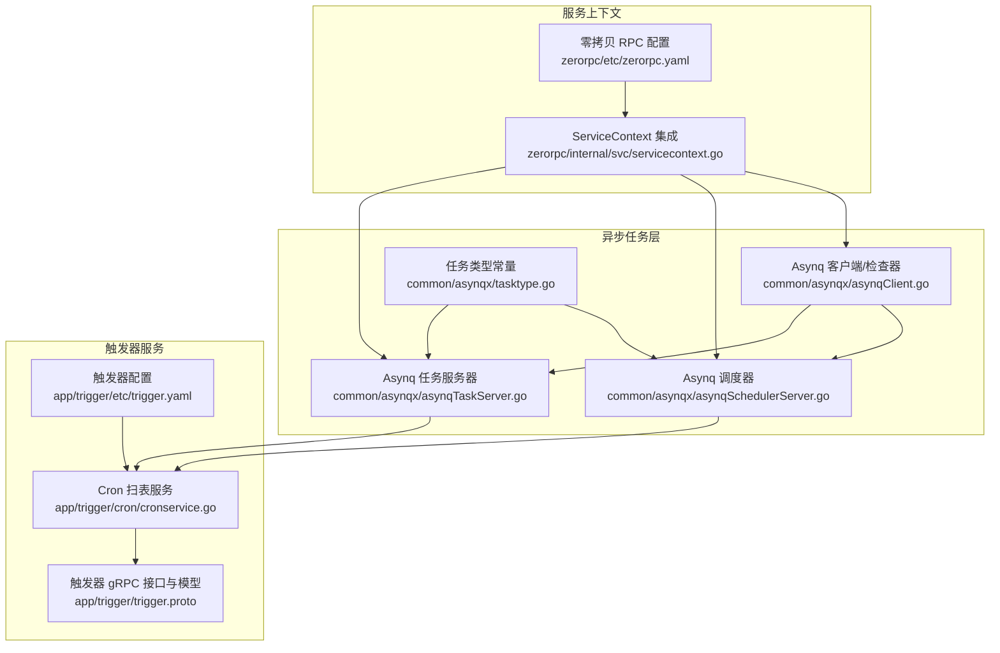
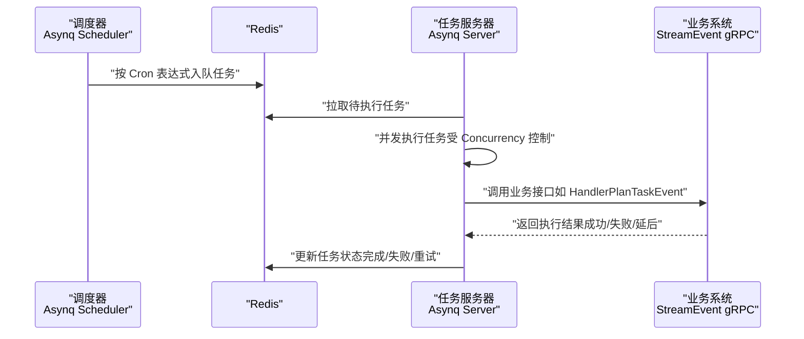
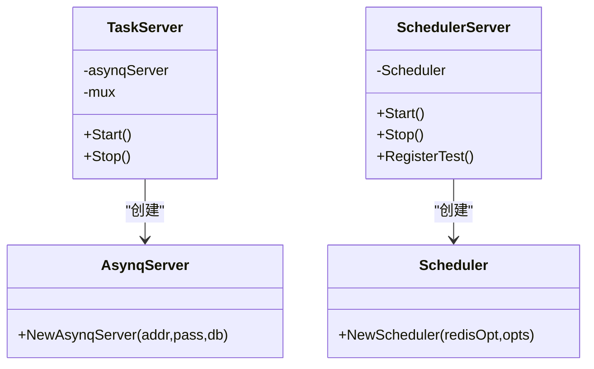
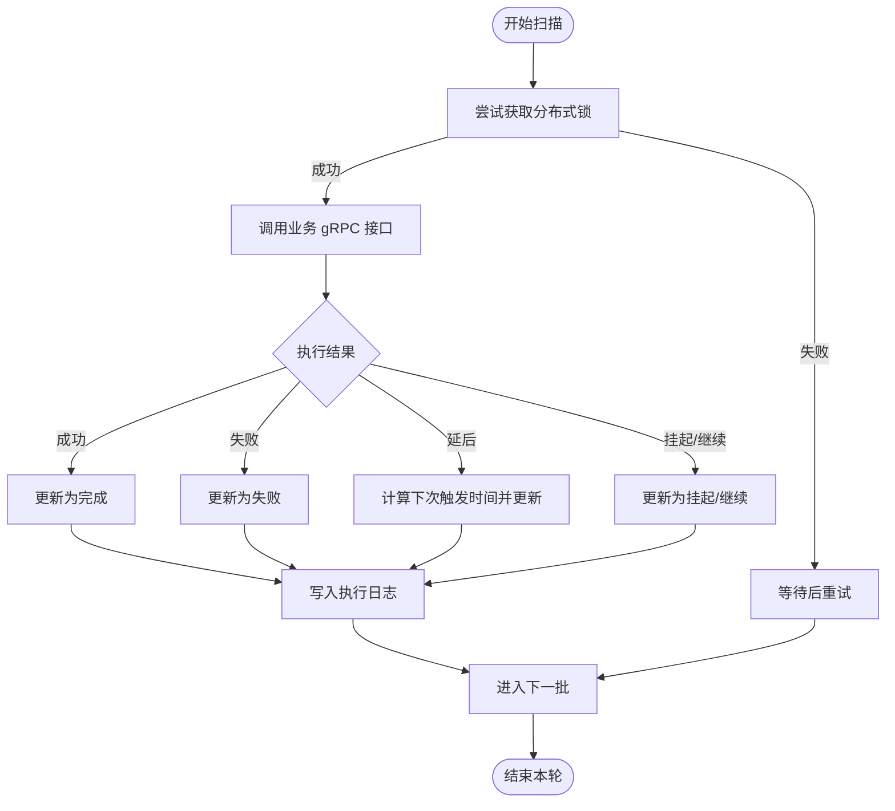
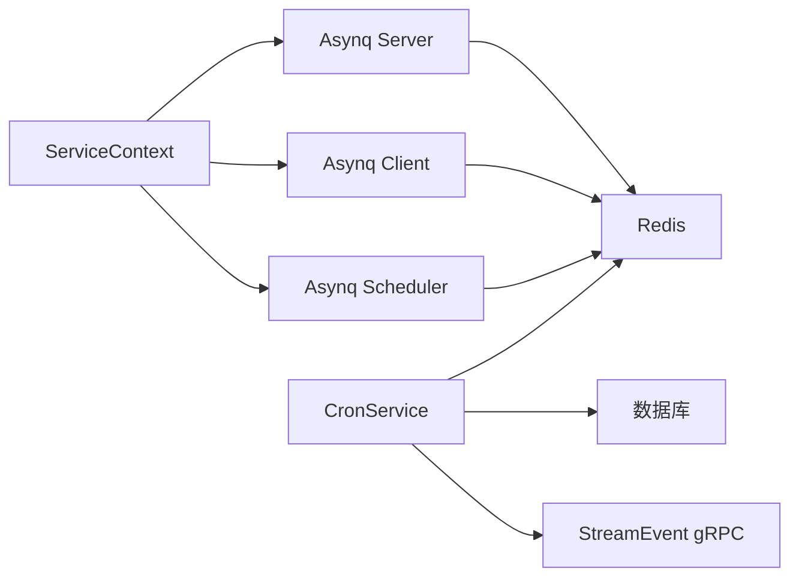

# 异步任务性能优化

<cite>
**本文引用的文件**   
- [asynqTaskServer.go](file://common/asynqx/asynqTaskServer.go)
- [asynqSchedulerServer.go](file://common/asynqx/asynqSchedulerServer.go)
- [asynqClient.go](file://common/asynqx/asynqClient.go)
- [tasktype.go](file://common/asynqx/tasktype.go)
- [servicecontext.go](file://zerorpc/internal/svc/servicecontext.go)
- [trigger.yaml](file://app/trigger/etc/trigger.yaml)
- [zerorpc.yaml](file://zerorpc/etc/zerorpc.yaml)
- [cronservice.go](file://app/trigger/cron/cronservice.go)
- [trigger.proto](file://app/trigger/trigger.proto)
- [trigger.md](file://docs/trigger.md)
- [backoff.go](file://common/tool/backoff.go)
- [resilience-patterns.md](file://.trae/skills/zero-skills/references/resilience-patterns.md)
- [database-patterns.md](file://.trae/skills/zero-skills/references/database-patterns.md)
</cite>

## 目录
1. [简介](#简介)
2. [项目结构](#项目结构)
3. [核心组件](#核心组件)
4. [架构总览](#架构总览)
5. [详细组件分析](#详细组件分析)
6. [依赖分析](#依赖分析)
7. [性能考量](#性能考量)
8. [故障排除指南](#故障排除指南)
9. [结论](#结论)
10. [附录](#附录)

## 简介
本指南面向 zero-service 中的异步任务体系，聚焦于 Asynq 任务队列与计划任务的性能优化与故障排除。内容覆盖工作线程数量配置、队列长度控制、任务优先级设置、任务执行性能监控、Redis 性能优化、调度器调优、任务积压诊断与解决、以及性能测试方法。目标是帮助读者在生产环境中稳定、高效地运行异步任务。

## 项目结构
围绕异步任务的关键模块与配置如下：
- Asynq 任务服务器与调度器封装：位于 common/asynqx
- 触发器服务（计划任务）：位于 app/trigger，包含 Cron 扫表与 gRPC 接口
- 服务上下文集成：zerorpc/internal/svc/servicecontext.go
- 配置文件：app/trigger/etc/trigger.yaml、zerorpc/etc/zerorpc.yaml
- 监控与统计模型：app/trigger/trigger.proto
- 背压与退避策略：common/tool/backoff.go
- 参考模式：resilience-patterns.md（重试与舱壁模式）、database-patterns.md（连接池）

图表来源
- [asynqTaskServer.go:1-64](file://common/asynqx/asynqTaskServer.go#L1-L64)
- [asynqSchedulerServer.go:1-62](file://common/asynqx/asynqSchedulerServer.go#L1-L62)
- [asynqClient.go:1-30](file://common/asynqx/asynqClient.go#L1-L30)
- [tasktype.go:1-9](file://common/asynqx/tasktype.go#L1-L9)
- [cronservice.go:1-469](file://app/trigger/cron/cronservice.go#L1-L469)
- [trigger.proto:161-207](file://app/trigger/trigger.proto#L161-L207)
- [trigger.yaml:1-37](file://app/trigger/etc/trigger.yaml#L1-L37)
- [servicecontext.go:1-102](file://zerorpc/internal/svc/servicecontext.go#L1-L102)
- [zerorpc.yaml:1-39](file://zerorpc/etc/zerorpc.yaml#L1-L39)

章节来源
- [asynqTaskServer.go:1-64](file://common/asynqx/asynqTaskServer.go#L1-L64)
- [asynqSchedulerServer.go:1-62](file://common/asynqx/asynqSchedulerServer.go#L1-L62)
- [asynqClient.go:1-30](file://common/asynqx/asynqClient.go#L1-L30)
- [tasktype.go:1-9](file://common/asynqx/tasktype.go#L1-L9)
- [cronservice.go:1-469](file://app/trigger/cron/cronservice.go#L1-L469)
- [trigger.proto:161-207](file://app/trigger/trigger.proto#L161-L207)
- [trigger.yaml:1-37](file://app/trigger/etc/trigger.yaml#L1-L37)
- [servicecontext.go:1-102](file://zerorpc/internal/svc/servicecontext.go#L1-L102)
- [zerorpc.yaml:1-39](file://zerorpc/etc/zerorpc.yaml#L1-L39)

## 核心组件
- Asynq 任务服务器：负责消费队列、并发执行任务、日志与停止控制
- Asynq 调度器：基于 Cron 表达式周期性入队任务
- Asynq 客户端/检查器：生产者与队列状态检查
- 触发器 Cron 扫表：定时扫描待触发的任务项并调用业务系统
- ServiceContext：统一注入 Asynq 客户端、服务器、调度器与 Redis 客户端

章节来源
- [asynqTaskServer.go:16-64](file://common/asynqx/asynqTaskServer.go#L16-L64)
- [asynqSchedulerServer.go:11-52](file://common/asynqx/asynqSchedulerServer.go#L11-L52)
- [asynqClient.go:17-30](file://common/asynqx/asynqClient.go#L17-L30)
- [servicecontext.go:19-33](file://zerorpc/internal/svc/servicecontext.go#L19-L33)

## 架构总览
异步任务由“调度器”和“任务服务器”协同完成。调度器周期性将任务入队；任务服务器从 Redis 读取任务并并发执行；触发器服务通过 Cron 扫表驱动计划任务执行，并通过 gRPC 与业务系统交互。

图表来源
- [asynqSchedulerServer.go:32-51](file://common/asynqx/asynqSchedulerServer.go#L32-L51)
- [asynqTaskServer.go:28-37](file://common/asynqx/asynqTaskServer.go#L28-L37)
- [cronservice.go:203-468](file://app/trigger/cron/cronservice.go#L203-L468)

章节来源
- [asynqSchedulerServer.go:32-51](file://common/asynqx/asynqSchedulerServer.go#L32-L51)
- [asynqTaskServer.go:28-37](file://common/asynqx/asynqTaskServer.go#L28-L37)
- [cronservice.go:203-468](file://app/trigger/cron/cronservice.go#L203-L468)

## 详细组件分析

### Asynq 任务服务器与调度器
- 服务器配置要点
  - Redis 连接池大小：固定为 50
  - 并发度：20（同时处理的任务数）
  - 队列优先级：critical/default/low，权重分别为 6/3/1
- 调度器配置要点
  - Redis 连接池大小：固定为 50
  - 位置与时区：Asia/Shanghai
  - 入队后回调：记录错误日志

图表来源
- [asynqTaskServer.go:16-64](file://common/asynqx/asynqTaskServer.go#L16-L64)
- [asynqSchedulerServer.go:11-52](file://common/asynqx/asynqSchedulerServer.go#L11-L52)

章节来源
- [asynqTaskServer.go:39-64](file://common/asynqx/asynqTaskServer.go#L39-L64)
- [asynqSchedulerServer.go:32-52](file://common/asynqx/asynqSchedulerServer.go#L32-L52)

### Asynq 客户端与任务类型
- 客户端/检查器：统一使用 Redis 连接选项创建
- 任务类型：延迟任务、触发任务、调度器任务等

章节来源
- [asynqClient.go:17-30](file://common/asynqx/asynqClient.go#L17-L30)
- [tasktype.go:3-9](file://common/asynqx/tasktype.go#L3-L9)

### 触发器 Cron 扫表与执行
- 扫表循环：有任务时以 10ms 间隔，无任务时 1~2 秒随机间隔
- 执行并发：使用 TaskRunner 限制并发
- gRPC 调用：对业务系统进行回调，依据返回结果更新状态
- 锁机制：使用 Redis 分布式锁避免重复执行

图表来源
- [cronservice.go:262-437](file://app/trigger/cron/cronservice.go#L262-L437)

章节来源
- [cronservice.go:38-79](file://app/trigger/cron/cronservice.go#L38-L79)
- [cronservice.go:203-468](file://app/trigger/cron/cronservice.go#L203-L468)

### 队列监控与统计模型
- 队列信息字段：队列名、内存占用、延迟、大小、分组数、Pending/Active/Scheduled/Retry/Archived/Completed/Aggregating、当日/累计处理与失败计数、暂停状态、快照时间戳
- 用于监控任务积压、处理速率与失败趋势

章节来源
- [trigger.proto:173-207](file://app/trigger/trigger.proto#L173-L207)

### 服务上下文与配置集成
- ServiceContext 注入 Asynq 客户端、服务器、调度器与 Redis 客户端
- 触发器服务配置包含 Redis 主机、密码、DB、超时与 gRPC 目标

章节来源
- [servicecontext.go:19-33](file://zerorpc/internal/svc/servicecontext.go#L19-L33)
- [trigger.yaml:19-37](file://app/trigger/etc/trigger.yaml#L19-L37)

## 依赖分析
- 组件耦合
  - Asynq 服务器依赖 Redis 作为存储与队列介质
  - 触发器 Cron 依赖数据库与 Redis 锁，调用 StreamEvent gRPC
  - ServiceContext 将 Asynq 与业务服务解耦，便于集中配置与生命周期管理
- 外部依赖
  - Redis：连接池、内存、持久化策略影响整体性能
  - gRPC：业务系统可用性与响应时间直接影响任务执行时延

图表来源
- [servicecontext.go:87-100](file://zerorpc/internal/svc/servicecontext.go#L87-L100)
- [asynqTaskServer.go:39-64](file://common/asynqx/asynqTaskServer.go#L39-L64)
- [asynqSchedulerServer.go:32-52](file://common/asynqx/asynqSchedulerServer.go#L32-L52)
- [cronservice.go:203-468](file://app/trigger/cron/cronservice.go#L203-L468)

章节来源
- [servicecontext.go:87-100](file://zerorpc/internal/svc/servicecontext.go#L87-L100)
- [asynqTaskServer.go:39-64](file://common/asynqx/asynqTaskServer.go#L39-L64)
- [asynqSchedulerServer.go:32-52](file://common/asynqx/asynqSchedulerServer.go#L32-L52)
- [cronservice.go:203-468](file://app/trigger/cron/cronservice.go#L203-L468)

## 性能考量
- Asynq 并发与队列优先级
  - 当前并发度为 20，队列权重 critical/default/low 为 6/3/1。建议结合任务类型占比与 SLA 调整权重与并发度
- Redis 连接池
  - Asynq 默认连接池为 50。若存在大量高并发任务或长耗时任务，可评估提升池大小并结合持久化策略优化
- Cron 扫表频率
  - 有任务时 10ms，无任务时 1~2s 随机。该策略降低空转 CPU 占用，建议根据实际积压情况动态调整
- gRPC 超时与重试
  - 触发器服务对业务系统调用设置了超时与重试策略，需结合下游稳定性调整超时与退避参数

章节来源
- [asynqTaskServer.go:50-61](file://common/asynqx/asynqTaskServer.go#L50-L61)
- [cronservice.go:208-209](file://app/trigger/cron/cronservice.go#L208-L209)
- [trigger.md:95-106](file://docs/trigger.md#L95-L106)

## 故障排除指南

### 一、Asynq 任务队列性能调优
- 工作线程数量（并发度）
  - 现状：并发度为 20
  - 建议：CPU 密集型任务适当下调，IO 密集型任务可适度上调；结合 CPU 使用率与任务耗时曲线微调
  - 参考路径：[asynqTaskServer.go:55-55](file://common/asynqx/asynqTaskServer.go#L55-L55)
- 队列长度控制
  - 建议：为不同优先级队列设置上限阈值，超过阈值触发告警或降级策略
  - 参考路径：[trigger.proto:173-207](file://app/trigger/trigger.proto#L173-L207)
- 任务优先级设置
  - 现状：critical/default/low 权重 6/3/1
  - 建议：根据业务 SLA 与紧急程度动态调整权重，避免低优先级任务饿死
  - 参考路径：[asynqTaskServer.go:56-60](file://common/asynqx/asynqTaskServer.go#L56-L60)

章节来源
- [asynqTaskServer.go:50-61](file://common/asynqx/asynqTaskServer.go#L50-L61)
- [trigger.proto:173-207](file://app/trigger/trigger.proto#L173-L207)

### 二、任务执行性能监控
- 监控指标
  - 处理时间：任务从入队到完成的耗时分布（P50/P90/P99）
  - 失败率：每日/累计失败任务占比
  - 延迟：队列中最老任务的延迟
  - 内存占用：队列与任务的近似内存使用
- 指标采集与展示
  - 使用队列信息模型中的字段进行统计与可视化
  - 参考路径：[trigger.proto:173-207](file://app/trigger/trigger.proto#L173-L207)

章节来源
- [trigger.proto:173-207](file://app/trigger/trigger.proto#L173-L207)

### 三、Redis 性能优化策略
- 连接池配置
  - Asynq 默认池大小为 50；可根据任务并发与网络 RTT 调整
  - 参考路径：[asynqTaskServer.go:48-48](file://common/asynqx/asynqTaskServer.go#L48-L48)、[asynqSchedulerServer.go:42-42](file://common/asynqx/asynqSchedulerServer.go#L42-L42)
- 内存使用优化
  - 合理设置过期时间与压缩策略，避免任务堆积导致内存膨胀
  - 参考路径：[trigger.md:95-106](file://docs/trigger.md#L95-L106)
- 持久化策略调整
  - 生产环境建议开启 RDB/AOF 并评估快照窗口与 fsync 策略，平衡一致性与性能
  - 参考路径：[trigger.yaml:19-24](file://app/trigger/etc/trigger.yaml#L19-L24)

章节来源
- [asynqTaskServer.go:40-50](file://common/asynqx/asynqTaskServer.go#L40-L50)
- [asynqSchedulerServer.go:34-43](file://common/asynqx/asynqSchedulerServer.go#L34-L43)
- [trigger.md:95-106](file://docs/trigger.md#L95-L106)
- [trigger.yaml:19-24](file://app/trigger/etc/trigger.yaml#L19-L24)

### 四、任务调度器性能调优
- 调度频率控制
  - Cron 表达式粒度与入队任务量匹配，避免过于频繁的入队造成瞬时压力
  - 参考路径：[asynqSchedulerServer.go:54-61](file://common/asynqx/asynqSchedulerServer.go#L54-L61)
- 批处理优化
  - 对批量任务采用批处理与分片策略，减少入队次数与上下文切换
  - 参考路径：[resilience-patterns.md:491-517](file://.trae/skills/zero-skills/references/resilience-patterns.md#L491-L517)
- 资源竞争避免
  - 使用分布式锁与幂等设计，避免重复执行与资源争用
  - 参考路径：[cronservice.go:264-277](file://app/trigger/cron/cronservice.go#L264-L277)

章节来源
- [asynqSchedulerServer.go:54-61](file://common/asynqx/asynqSchedulerServer.go#L54-L61)
- [resilience-patterns.md:491-517](file://.trae/skills/zero-skills/references/resilience-patterns.md#L491-L517)
- [cronservice.go:264-277](file://app/trigger/cron/cronservice.go#L264-L277)

### 五、任务积压问题诊断与解决
- 队列监控
  - 关注 Pending/Active/Scheduled/Retry/Aggregating/Archived 等字段，识别积压来源
  - 参考路径：[trigger.proto:173-207](file://app/trigger/trigger.proto#L173-L207)
- 任务重试策略
  - 使用指数退避与最大重试次数，防止无限重试导致雪崩
  - 参考路径：[backoff.go:9-40](file://common/tool/backoff.go#L9-L40)
- 死信队列处理
  - 对超过最大重试次数的任务转入死信队列并人工介入
  - 参考路径：[trigger.md:95-106](file://docs/trigger.md#L95-L106)

章节来源
- [trigger.proto:173-207](file://app/trigger/trigger.proto#L173-L207)
- [backoff.go:9-40](file://common/tool/backoff.go#L9-L40)
- [trigger.md:95-106](file://docs/trigger.md#L95-L106)

### 六、异步任务性能测试
- 吞吐量测试
  - 使用压测工具对 Asynq 入队与消费路径进行压力测试，观察 P99 延迟与失败率
- 延迟测试
  - 测量从入队到完成的端到端延迟，定位瓶颈（Redis、业务系统、网络）
- 压力测试
  - 逐步提升并发与任务量，观察系统在峰值下的稳定性与恢复能力
- 参考路径
  - [trigger.yaml:19-37](file://app/trigger/etc/trigger.yaml#L19-L37)
  - [zerorpc.yaml:13-21](file://zerorpc/etc/zerorpc.yaml#L13-L21)

章节来源
- [trigger.yaml:19-37](file://app/trigger/etc/trigger.yaml#L19-L37)
- [zerorpc.yaml:13-21](file://zerorpc/etc/zerorpc.yaml#L13-L21)

## 结论
通过合理配置 Asynq 并发与队列优先级、优化 Redis 连接池与持久化策略、控制调度频率与批处理规模、完善监控与重试退避机制，可以显著提升异步任务系统的稳定性与性能。结合本文提供的监控指标与测试方法，可在生产环境中持续观测与迭代优化。

## 附录
- 相关参考模式与最佳实践
  - 重试与舱壁模式：[resilience-patterns.md:423-489](file://.trae/skills/zero-skills/references/resilience-patterns.md#L423-L489)
  - 数据库连接池模式：[database-patterns.md:448-480](file://.trae/skills/zero-skills/references/database-patterns.md#L448-L480)