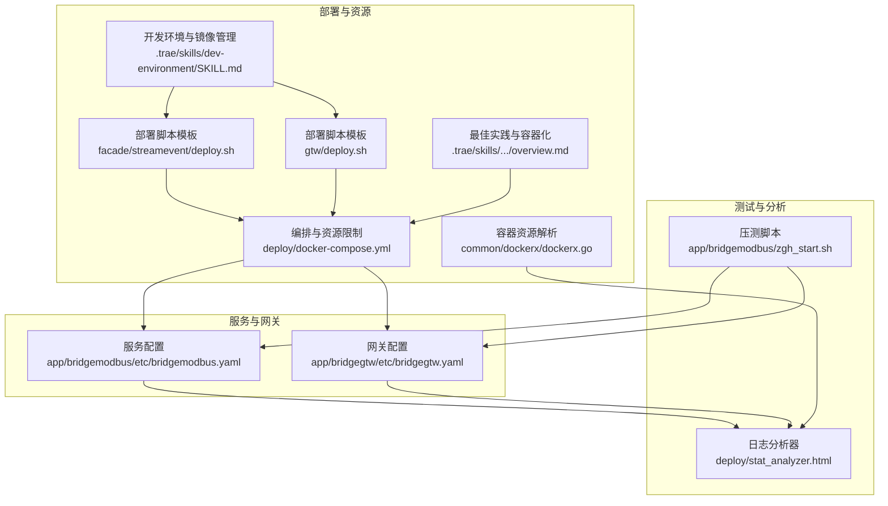
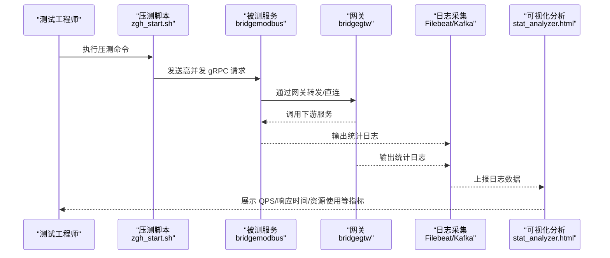
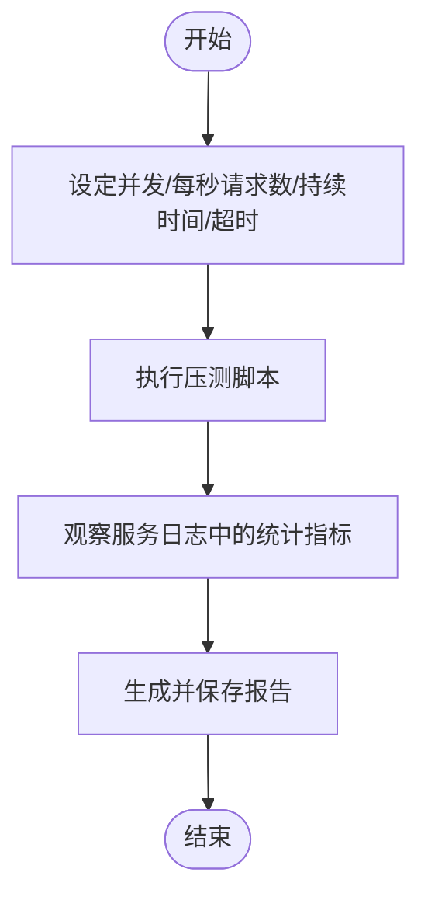
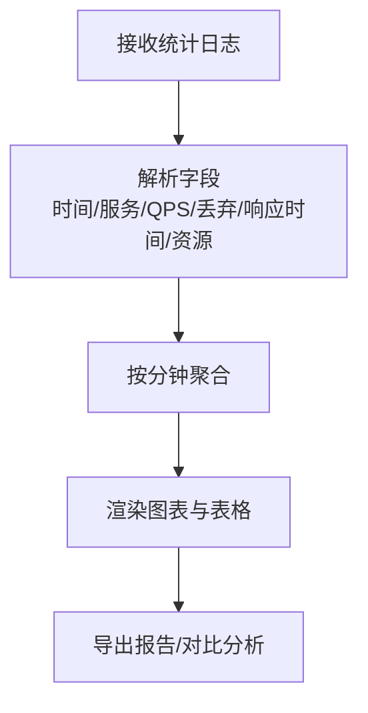
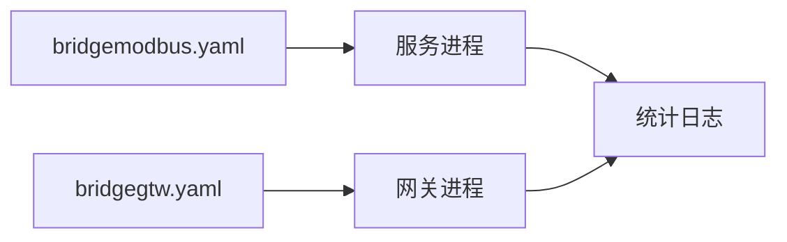
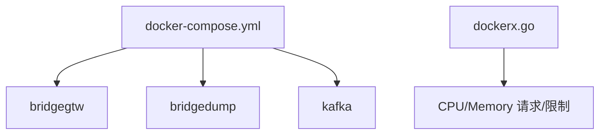
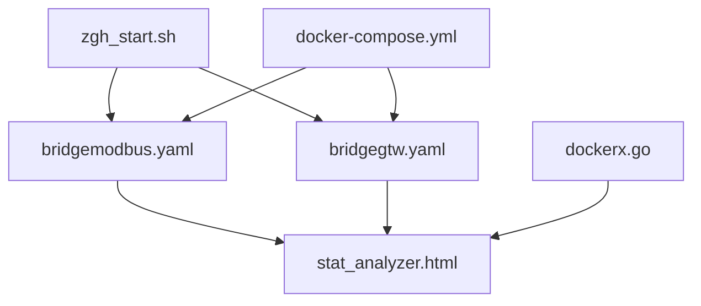

# 性能测试与基准

<cite>
**本文档引用的文件**
- [deploy/stat_analyzer.html](file://deploy/stat_analyzer.html)
- [app/bridgemodbus/zgh_start.sh](file://app/bridgemodbus/zgh_start.sh)
- [app/bridgemodbus/etc/bridgemodbus.yaml](file://app/bridgemodbus/etc/bridgemodbus.yaml)
- [app/bridgegtw/etc/bridgegtw.yaml](file://app/bridgegtw/etc/bridgegtw.yaml)
- [deploy/docker-compose.yml](file://deploy/docker-compose.yml)
- [facade/streamevent/deploy.sh](file://facade/streamevent/deploy.sh)
- [gtw/deploy.sh](file://gtw/deploy.sh)
- [.trae/skills/zero-skills/best-practices/overview.md](file://.trae/skills/zero-skills/best-practices/overview.md)
- [.trae/skills/dev-environment/SKILL.md](file://.trae/skills/dev-environment/SKILL.md)
- [common/dockerx/dockerx.go](file://common/dockerx/dockerx.go)
</cite>

## 目录
1. [引言](#引言)
2. [项目结构](#项目结构)
3. [核心组件](#核心组件)
4. [架构总览](#架构总览)
5. [详细组件分析](#详细组件分析)
6. [依赖关系分析](#依赖关系分析)
7. [性能考量](#性能考量)
8. [故障排查指南](#故障排查指南)
9. [结论](#结论)
10. [附录](#附录)

## 引言
本指南面向 zero-service 的性能测试与基准实践，围绕压力测试、负载测试与稳定性测试的方法论，结合仓库内已有的压测脚本、日志采集与可视化分析工具，给出可落地的实施步骤。内容涵盖：
- 测试设计与执行流程
- 压力与负载生成策略
- 指标采集与分析（响应时间、吞吐量、错误率、资源使用）
- 基准测试与回归测试（含持续集成思路）

## 项目结构
从性能测试视角，仓库中与之直接相关的关键部分包括：
- 压测脚本与示例：app/bridgemodbus/zgh_start.sh
- 服务配置：app/bridgemodbus/etc/bridgemodbus.yaml、app/bridgegtw/etc/bridgegtw.yaml
- 日志分析与可视化：deploy/stat_analyzer.html
- 部署与容器资源：deploy/docker-compose.yml、common/dockerx/dockerx.go
- 部署脚本模板：facade/streamevent/deploy.sh、gtw/deploy.sh
- 最佳实践与容器化建议：.trae/skills/zero-skills/best-practices/overview.md、.trae/skills/dev-environment/SKILL.md

**图表来源**
- [app/bridgemodbus/zgh_start.sh:1-23](file://app/bridgemodbus/zgh_start.sh#L1-L23)
- [deploy/stat_analyzer.html:1-120](file://deploy/stat_analyzer.html#L1-L120)
- [app/bridgemodbus/etc/bridgemodbus.yaml:1-26](file://app/bridgemodbus/etc/bridgemodbus.yaml#L1-L26)
- [app/bridgegtw/etc/bridgegtw.yaml:1-40](file://app/bridgegtw/etc/bridgegtw.yaml#L1-L40)
- [deploy/docker-compose.yml:1-110](file://deploy/docker-compose.yml#L1-L110)
- [common/dockerx/dockerx.go:58-94](file://common/dockerx/dockerx.go#L58-L94)
- [facade/streamevent/deploy.sh:1-50](file://facade/streamevent/deploy.sh#L1-L50)
- [gtw/deploy.sh:1-50](file://gtw/deploy.sh#L1-L50)
- [.trae/skills/zero-skills/best-practices/overview.md:671-754](file://.trae/skills/zero-skills/best-practices/overview.md#L671-L754)
- [.trae/skills/dev-environment/SKILL.md:142-200](file://.trae/skills/dev-environment/SKILL.md#L142-L200)

**章节来源**
- [deploy/stat_analyzer.html:1-120](file://deploy/stat_analyzer.html#L1-L120)
- [app/bridgemodbus/zgh_start.sh:1-23](file://app/bridgemodbus/zgh_start.sh#L1-L23)
- [app/bridgemodbus/etc/bridgemodbus.yaml:1-26](file://app/bridgemodbus/etc/bridgemodbus.yaml#L1-L26)
- [app/bridgegtw/etc/bridgegtw.yaml:1-40](file://app/bridgegtw/etc/bridgegtw.yaml#L1-L40)
- [deploy/docker-compose.yml:1-110](file://deploy/docker-compose.yml#L1-L110)
- [common/dockerx/dockerx.go:58-94](file://common/dockerx/dockerx.go#L58-L94)
- [facade/streamevent/deploy.sh:1-50](file://facade/streamevent/deploy.sh#L1-L50)
- [gtw/deploy.sh:1-50](file://gtw/deploy.sh#L1-L50)
- [.trae/skills/zero-skills/best-practices/overview.md:671-754](file://.trae/skills/zero-skills/best-practices/overview.md#L671-L754)
- [.trae/skills/dev-environment/SKILL.md:142-200](file://.trae/skills/dev-environment/SKILL.md#L142-L200)

## 核心组件
- 压测脚本与命令行工具
  - 使用 ghz 对 gRPC 接口进行高并发压测，示例脚本包含调用方法、并发连接数、每秒请求数、持续时间、超时与输出报告等参数。
  - 示例路径：[app/bridgemodbus/zgh_start.sh:1-23](file://app/bridgemodbus/zgh_start.sh#L1-L23)

- 日志分析与可视化
  - HTML 工具可解析 Go-Zero 统计日志，提取 CPU、内存、QPS、丢弃数、响应时间分位等指标，并按分钟聚合，支持图表与表格展示。
  - 示例路径：[deploy/stat_analyzer.html:862-1174](file://deploy/stat_analyzer.html#L862-L1174)

- 服务与网关配置
  - 服务侧配置包含监听地址、超时、日志级别、数据库连接等；网关侧配置包含上游 gRPC 端点、映射规则等。
  - 示例路径：
    - [app/bridgemodbus/etc/bridgemodbus.yaml:1-26](file://app/bridgemodbus/etc/bridgemodbus.yaml#L1-L26)
    - [app/bridgegtw/etc/bridgegtw.yaml:1-40](file://app/bridgegtw/etc/bridgegtw.yaml#L1-L40)

- 部署与容器资源
  - docker-compose 用于本地/测试环境快速拉起服务与依赖（如 Kafka），并设置内存限制与网络模式。
  - 示例路径：[deploy/docker-compose.yml:1-110](file://deploy/docker-compose.yml#L1-L110)
  - 容器资源解析工具可用于从容器资源对象中提取 CPU/Memory 请求与限制。
  - 示例路径：[common/dockerx/dockerx.go:58-94](file://common/dockerx/dockerx.go#L58-L94)

- 部署脚本模板
  - 提供统一的构建、打包、镜像标签与远程部署流程模板，便于在 CI 中复用。
  - 示例路径：
    - [facade/streamevent/deploy.sh:1-50](file://facade/streamevent/deploy.sh#L1-L50)
    - [gtw/deploy.sh:1-50](file://gtw/deploy.sh#L1-L50)

**章节来源**
- [app/bridgemodbus/zgh_start.sh:1-23](file://app/bridgemodbus/zgh_start.sh#L1-L23)
- [deploy/stat_analyzer.html:862-1174](file://deploy/stat_analyzer.html#L862-L1174)
- [app/bridgemodbus/etc/bridgemodbus.yaml:1-26](file://app/bridgemodbus/etc/bridgemodbus.yaml#L1-L26)
- [app/bridgegtw/etc/bridgegtw.yaml:1-40](file://app/bridgegtw/etc/bridgegtw.yaml#L1-L40)
- [deploy/docker-compose.yml:1-110](file://deploy/docker-compose.yml#L1-L110)
- [common/dockerx/dockerx.go:58-94](file://common/dockerx/dockerx.go#L58-L94)
- [facade/streamevent/deploy.sh:1-50](file://facade/streamevent/deploy.sh#L1-L50)
- [gtw/deploy.sh:1-50](file://gtw/deploy.sh#L1-L50)

## 架构总览
下图展示了性能测试从“压测发起”到“日志采集与分析”的端到端流程。

**图表来源**
- [app/bridgemodbus/zgh_start.sh:1-23](file://app/bridgemodbus/zgh_start.sh#L1-L23)
- [app/bridgemodbus/etc/bridgemodbus.yaml:1-26](file://app/bridgemodbus/etc/bridgemodbus.yaml#L1-L26)
- [app/bridgegtw/etc/bridgegtw.yaml:1-40](file://app/bridgegtw/etc/bridgegtw.yaml#L1-L40)
- [deploy/docker-compose.yml:1-110](file://deploy/docker-compose.yml#L1-L110)
- [deploy/stat_analyzer.html:862-1174](file://deploy/stat_analyzer.html#L862-L1174)

## 详细组件分析

### 压测脚本与命令行工具
- 设计要点
  - 并发连接数与每秒请求数共同决定负载强度；持续时间用于评估稳定性。
  - 超时参数避免压测放大效应导致的资源耗尽。
  - 输出报告便于后续对比与归档。
- 实施建议
  - 先以小并发验证接口可用性，再逐步提升至目标 RPS。
  - 针对不同 RPC 方法分别压测，记录差异化表现。
  - 结合网关与直连两种路径，评估网关层开销。

**图表来源**
- [app/bridgemodbus/zgh_start.sh:1-23](file://app/bridgemodbus/zgh_start.sh#L1-L23)

**章节来源**
- [app/bridgemodbus/zgh_start.sh:1-23](file://app/bridgemodbus/zgh_start.sh#L1-L23)

### 日志采集与可视化分析
- 指标提取
  - 时间、服务名、CPU、内存、GC 次数、QPS、丢弃数、响应时间分位（avg/med/p90/p99/p999）等。
- 数据聚合
  - 按分钟粒度聚合，缺失分钟使用上一分钟数据填充，保证趋势连续性。
- 可视化
  - 提供 QPS 趋势、内存趋势、系统指标综合图、限流状态分析、缓存命中率趋势以及服务性能明细表。

**图表来源**
- [deploy/stat_analyzer.html:862-1174](file://deploy/stat_analyzer.html#L862-L1174)
- [deploy/stat_analyzer.html:1113-1307](file://deploy/stat_analyzer.html#L1113-L1307)
- [deploy/stat_analyzer.html:1329-1352](file://deploy/stat_analyzer.html#L1329-L1352)

**章节来源**
- [deploy/stat_analyzer.html:862-1174](file://deploy/stat_analyzer.html#L862-L1174)
- [deploy/stat_analyzer.html:1113-1307](file://deploy/stat_analyzer.html#L1113-L1307)
- [deploy/stat_analyzer.html:1329-1352](file://deploy/stat_analyzer.html#L1329-L1352)

### 服务与网关配置
- 服务配置要点
  - 监听地址与端口、超时、日志级别与路径、数据库连接、Modbus 客户端参数等。
- 网关配置要点
  - 上游 gRPC 端点、非阻塞转发、协议集与路由映射。

**图表来源**
- [app/bridgemodbus/etc/bridgemodbus.yaml:1-26](file://app/bridgemodbus/etc/bridgemodbus.yaml#L1-L26)
- [app/bridgegtw/etc/bridgegtw.yaml:1-40](file://app/bridgegtw/etc/bridgegtw.yaml#L1-L40)

**章节来源**
- [app/bridgemodbus/etc/bridgemodbus.yaml:1-26](file://app/bridgemodbus/etc/bridgemodbus.yaml#L1-L26)
- [app/bridgegtw/etc/bridgegtw.yaml:1-40](file://app/bridgegtw/etc/bridgegtw.yaml#L1-L40)

### 部署与容器资源
- 编排与资源限制
  - docker-compose 设置服务内存上限、网络模式（host）、依赖关系与挂载卷。
- 容器资源解析
  - 将容器资源对象转换为 CPU/Memory 请求与限制的键值对，便于监控与告警。

**图表来源**
- [deploy/docker-compose.yml:1-110](file://deploy/docker-compose.yml#L1-L110)
- [common/dockerx/dockerx.go:58-94](file://common/dockerx/dockerx.go#L58-L94)

**章节来源**
- [deploy/docker-compose.yml:1-110](file://deploy/docker-compose.yml#L1-L110)
- [common/dockerx/dockerx.go:58-94](file://common/dockerx/dockerx.go#L58-L94)

### 部署脚本模板与最佳实践
- 部署脚本模板
  - 统一的构建、镜像标签、远程部署流程，便于在 CI 中复用。
- 容器化与资源建议
  - 提供 Dockerfile 与 Kubernetes 部署样例，包含探针与资源配额建议。

**章节来源**
- [facade/streamevent/deploy.sh:1-50](file://facade/streamevent/deploy.sh#L1-L50)
- [gtw/deploy.sh:1-50](file://gtw/deploy.sh#L1-L50)
- [.trae/skills/zero-skills/best-practices/overview.md:671-754](file://.trae/skills/zero-skills/best-practices/overview.md#L671-L754)
- [.trae/skills/dev-environment/SKILL.md:142-200](file://.trae/skills/dev-environment/SKILL.md#L142-L200)

## 依赖关系分析
- 组件耦合
  - 压测脚本依赖服务与网关的监听端口与协议；服务与网关配置影响压测路径与可观测性。
  - 日志分析器依赖日志格式与字段命名规范；容器资源解析为资源监控提供基础。
- 外部依赖
  - Kafka/Filebeat 用于日志采集与传输；浏览器端 ECharts 用于可视化。

**图表来源**
- [app/bridgemodbus/zgh_start.sh:1-23](file://app/bridgemodbus/zgh_start.sh#L1-L23)
- [app/bridgemodbus/etc/bridgemodbus.yaml:1-26](file://app/bridgemodbus/etc/bridgemodbus.yaml#L1-L26)
- [app/bridgegtw/etc/bridgegtw.yaml:1-40](file://app/bridgegtw/etc/bridgegtw.yaml#L1-L40)
- [deploy/stat_analyzer.html:862-1174](file://deploy/stat_analyzer.html#L862-L1174)
- [deploy/docker-compose.yml:1-110](file://deploy/docker-compose.yml#L1-L110)
- [common/dockerx/dockerx.go:58-94](file://common/dockerx/dockerx.go#L58-L94)

**章节来源**
- [app/bridgemodbus/zgh_start.sh:1-23](file://app/bridgemodbus/zgh_start.sh#L1-L23)
- [app/bridgemodbus/etc/bridgemodbus.yaml:1-26](file://app/bridgemodbus/etc/bridgemodbus.yaml#L1-L26)
- [app/bridgegtw/etc/bridgegtw.yaml:1-40](file://app/bridgegtw/etc/bridgegtw.yaml#L1-L40)
- [deploy/stat_analyzer.html:862-1174](file://deploy/stat_analyzer.html#L862-L1174)
- [deploy/docker-compose.yml:1-110](file://deploy/docker-compose.yml#L1-L110)
- [common/dockerx/dockerx.go:58-94](file://common/dockerx/dockerx.go#L58-L94)

## 性能考量
- 压测设计
  - 压力测试：逐步提升并发与 RPS，直至出现明显延迟或错误率上升，定位瓶颈。
  - 负载测试：在目标负载下运行较长时间，观察系统稳定性与资源使用。
  - 稳定性测试：长时间维持稳定负载，检查内存泄漏、GC 压力与限流触发情况。
- 指标关注
  - 响应时间：avg/med/p90/p99/p999；关注尾延迟变化。
  - 吞吐量：QPS；观察是否达到硬件/网络上限。
  - 错误率：丢弃数与错误日志；定位限流与异常。
  - 资源使用：CPU、内存、GC 次数；评估容器资源配额与调度策略。
- 环境与数据
  - 使用 docker-compose 搭建一致环境；确保数据库、消息队列等依赖可用。
  - 准备足够规模的测试数据，避免冷启动与缓存干扰。

[本节为通用指导，不直接分析具体文件]

## 故障排查指南
- 日志分析器使用
  - 支持拖拽上传、按分钟聚合、图表缩放与全屏查看；可筛选服务与排序表格列。
- 常见问题定位
  - 若图表为空或数据缺失，检查日志格式与字段匹配；确认按分钟聚合逻辑是否正确填充。
  - 若 QPS 波动大，检查压测脚本并发与 RPS 设置，以及服务端限流策略。
- 容器资源
  - 使用容器资源解析工具核对 CPU/Memory 请求与限制，避免资源不足导致抖动。

**章节来源**
- [deploy/stat_analyzer.html:1-120](file://deploy/stat_analyzer.html#L1-L120)
- [deploy/stat_analyzer.html:1113-1307](file://deploy/stat_analyzer.html#L1113-L1307)
- [common/dockerx/dockerx.go:58-94](file://common/dockerx/dockerx.go#L58-L94)

## 结论
本指南基于仓库内现有压测脚本、日志分析工具与部署配置，给出了可操作的性能测试与基准实施路径。建议在实际工程中：
- 将压测纳入 CI，设置性能门禁；
- 建立基线与回归报告模板；
- 持续监控关键指标，结合容器资源与限流策略优化系统。

[本节为总结，不直接分析具体文件]

## 附录

### A. 压力测试、负载测试与稳定性测试设计清单
- 压力测试
  - 目标：发现瓶颈与阈值
  - 步骤：从小并发起步，逐步倍增 RPS，记录响应时间与错误率
- 负载测试
  - 目标：验证在目标负载下的稳定性
  - 步骤：在目标 RPS 下运行数小时，观察资源与指标
- 稳定性测试
  - 目标：长时间运行下的健壮性
  - 步骤：固定负载运行数天，检查内存、GC、限流与日志

[本节为通用指导，不直接分析具体文件]

### B. 性能指标采集与分析要点
- 指标来源：服务统计日志（QPS、丢弃、响应时间、CPU、内存、GC）
- 聚合方式：按分钟聚合，缺失分钟用上一分钟数据填充
- 可视化：趋势图、分位图、服务分布、限流状态、缓存命中率

**章节来源**
- [deploy/stat_analyzer.html:862-1174](file://deploy/stat_analyzer.html#L862-L1174)
- [deploy/stat_analyzer.html:1113-1307](file://deploy/stat_analyzer.html#L1113-L1307)
- [deploy/stat_analyzer.html:1329-1352](file://deploy/stat_analyzer.html#L1329-L1352)

### C. 基准测试实施流程
- 环境准备
  - 使用 docker-compose 拉起服务与依赖
  - 配置服务与网关参数，确保日志输出规范
- 测试执行
  - 使用压测脚本在不同并发与 RPS 下运行
  - 记录每次测试的 QPS、响应时间分位、错误数与资源使用
- 结果分析
  - 使用日志分析器生成报告，对比不同场景
  - 形成基线与回归报告模板

**章节来源**
- [deploy/docker-compose.yml:1-110](file://deploy/docker-compose.yml#L1-L110)
- [app/bridgemodbus/zgh_start.sh:1-23](file://app/bridgemodbus/zgh_start.sh#L1-L23)
- [deploy/stat_analyzer.html:862-1174](file://deploy/stat_analyzer.html#L862-L1174)

### D. 性能回归测试与持续集成
- 在 CI 中复用部署脚本模板，统一构建与部署流程
- 将压测脚本与日志分析器集成到流水线，产出报告
- 设置性能门禁（如 P99 延迟阈值、错误率上限、资源使用上限）

**章节来源**
- [facade/streamevent/deploy.sh:1-50](file://facade/streamevent/deploy.sh#L1-L50)
- [gtw/deploy.sh:1-50](file://gtw/deploy.sh#L1-L50)
- [.trae/skills/zero-skills/best-practices/overview.md:671-754](file://.trae/skills/zero-skills/best-practices/overview.md#L671-L754)
- [.trae/skills/dev-environment/SKILL.md:142-200](file://.trae/skills/dev-environment/SKILL.md#L142-L200)