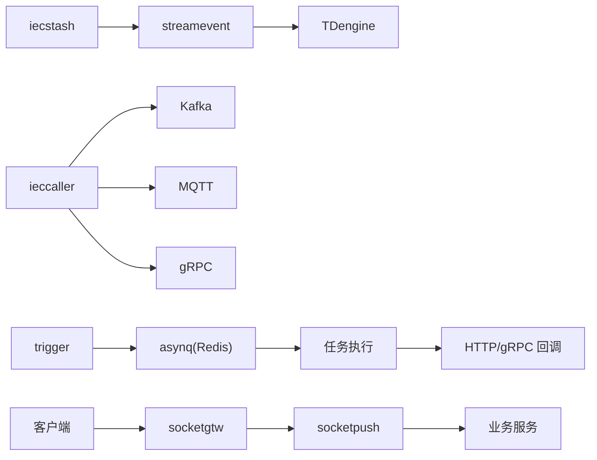
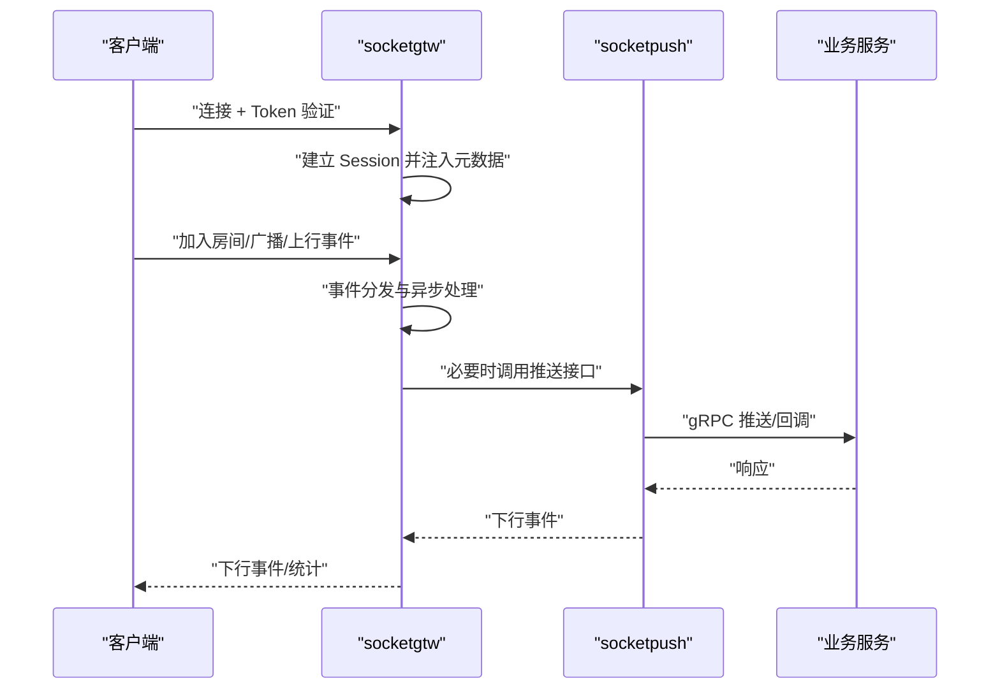
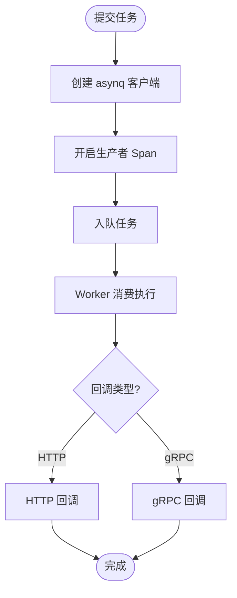
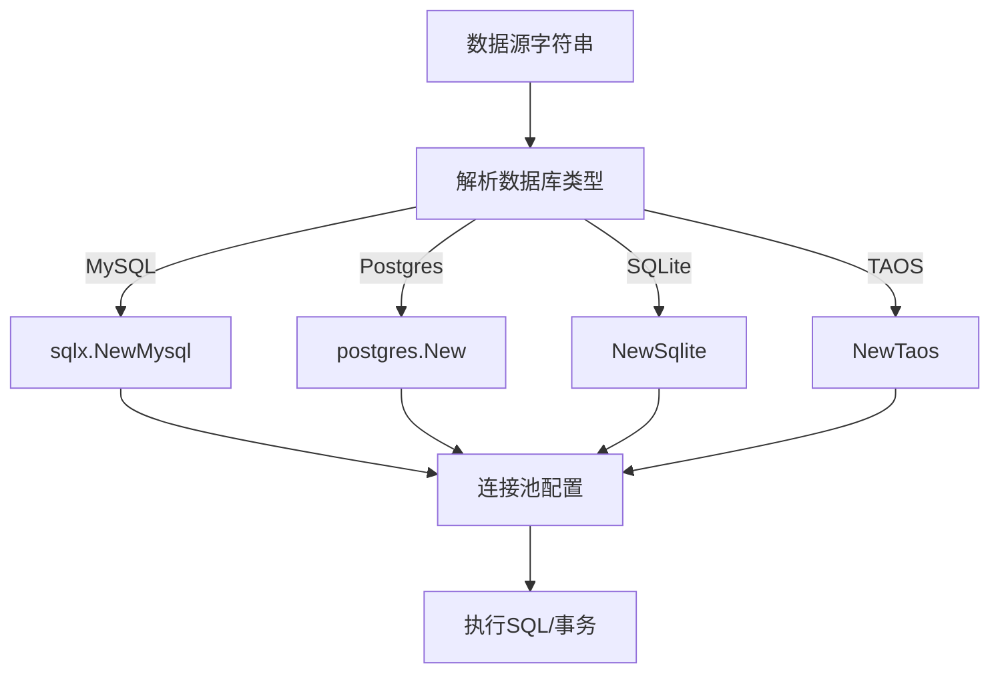
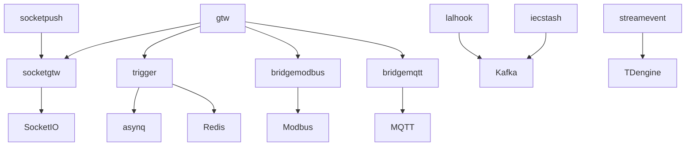

# 性能问题

<cite>
**本文引用的文件**
- [go.mod](file://go.mod)
- [README.md](file://README.md)
- [deploy/docker-compose.yml](file://deploy/docker-compose.yml)
- [deploy/stat_analyzer.html](file://deploy/stat_analyzer.html)
- [common/socketiox/server.go](file://common/socketiox/server.go)
- [common/asynqx/asynqClient.go](file://common/asynqx/asynqClient.go)
- [common/dbx/dbx.go](file://common/dbx/dbx.go)
- [.trae/skills/zero-skills/references/database-patterns.md](file://.trae/skills/zero-skills/references/database-patterns.md)
- [app/trigger/etc/trigger.yaml](file://app/trigger/etc/trigger.yaml)
- [app/trigger/internal/config/config.go](file://app/trigger/internal/config/config.go)
- [socketapp/socketpush/socketpush/socketpush.pb.go](file://socketapp/socketpush/socketpush/socketpush.pb.go)
- [facade/streamevent/streamevent/streamevent.pb.go](file://facade/streamevent/streamevent/streamevent.pb.go)
- [common/modbusx/config.go](file://common/modbusx/config.go)
- [model/modbusslaveconfigmodel_gen.go](file://model/modbusslaveconfigmodel_gen.go)
</cite>

## 目录
1. [简介](#简介)
2. [项目结构](#项目结构)
3. [核心组件](#核心组件)
4. [架构总览](#架构总览)
5. [详细组件分析](#详细组件分析)
6. [依赖分析](#依赖分析)
7. [性能考量](#性能考量)
8. [故障排除指南](#故障排除指南)
9. [结论](#结论)
10. [附录](#附录)

## 简介
本指南聚焦 zero-service 在工业物联网与实时通信场景下的性能问题排查与优化。围绕 CPU 使用率过高、内存泄漏、磁盘 I/O 问题、数据库性能、WebSocket 连接性能、异步任务性能以及系统资源监控与性能测试方法，给出可操作的定位步骤、优化策略与最佳实践。

## 项目结构
- 微服务采用 go-zero 架构，涵盖 IEC 104 数采、异步任务调度、实时通信、文件服务、地理信息、容器管理、协议桥接、对外接口层等模块。
- 关键技术栈：gRPC + grpc-gateway、Kafka、asynq + Redis、SocketIO、IEC 104/Modbus/MQTT、MySQL/PostgreSQL/SQLite/TDengine、Nacos、OpenTelemetry/Prometheus、Docker Compose。

```mermaid
graph TB
subgraph "网关与接口"
GTW["gtw(BFF)"]
FACADE["facade/streamevent"]
end
subgraph "实时通信"
SGTW["socketgtw"]
SPUSH["socketpush"]
end
subgraph "核心服务"
TRIG["trigger(异步任务)"]
FILE["file(文件)"]
GIS["gis(地理)"]
ALARM["alarm(告警)"]
POD["podengine(容器)"]
BRMODBUS["bridgemodbus(Modbus)"]
BRMQTT["bridgemqtt(MQTT)"]
BRG["bridgegtw(HTTP)"]
BRDUMP["bridgedump(文件)"]
LALHOOK["lalhook(流媒体)"]
LALPROXY["lalproxy(流代理)"]
LOGDUMP["logdump(日志)"]
XFM["xfusionmock(模拟)"]
MCP["mcpserver"]
end
subgraph "基础设施"
KAFKA["Kafka"]
REDIS["Redis(asynq)"]
DB["MySQL/PG/SQLite/TDengine"]
NACOS["Nacos"]
OTLP["OpenTelemetry"]
end
GTW --> TRIG
GTW --> FILE
GTW --> GIS
GTW --> ALARM
GTW --> POD
GTW --> BRMODBUS
GTW --> BRMQTT
GTW --> BRG
GTW --> BRDUMP
GTW --> LALHOOK
GTW --> LALPROXY
GTW --> LOGDUMP
GTW --> XFM
GTW --> MCP
FACADE --> TRIG
SGTW --> SPUSH
TRIG --> REDIS
TRIG --> DB
BRMODBUS --> DB
BRMQTT --> KAFKA
LALHOOK --> KAFKA
BRDUMP --> KAFKA
LALPROXY --> KAFKA
POD --> DB
FILE --> DB
GIS --> DB
ALARM --> DB
MCP --> DB
NACOS --> TRIG
NACOS --> SGTW
NACOS --> SPUSH
OTLP --> TRIG
OTLP --> SGTW
OTLP --> SPUSH
```

**图表来源**
- [README.md:15-51](file://README.md#L15-L51)
- [go.mod:5-62](file://go.mod#L5-L62)

**章节来源**
- [README.md:59-108](file://README.md#L59-L108)
- [go.mod:5-62](file://go.mod#L5-L62)

## 核心组件
- 异步任务调度（asynq + Redis）：分布式任务队列，支持定时/延时任务、回调、重试与生命周期管理。
- 实时通信（SocketIO）：SocketIO 网关与推送服务，支持房间管理、广播、MQTT 桥接与统计推送。
- 数据库访问（go-zero sqlx + goqu）：多数据库类型适配与连接池默认配置。
- 协议桥接（IEC 104/Modbus/MQTT）：多协议接入与数据汇聚，涉及 Kafka/MQTT/gRPC 推送。
- 对外接口层（streamevent）：统一跨语言流数据事件协议，接收多协议消息并落库。

**章节来源**
- [README.md:110-225](file://README.md#L110-L225)
- [common/asynqx/asynqClient.go:17-23](file://common/asynqx/asynqClient.go#L17-L23)
- [common/socketiox/server.go:299-335](file://common/socketiox/server.go#L299-L335)
- [common/dbx/dbx.go:46-64](file://common/dbx/dbx.go#L46-L64)

## 架构总览
- IEC 104 数采链路：ieccaller -> Kafka -> iecstash -> streamevent -> TDengine；同时支持 MQTT/gRPC 三通道推送。
- 异步任务链路：业务触发 -> asynq 队列 -> 任务执行 -> 回调（HTTP/gRPC）。
- 实时通信链路：客户端 -> socketgtw -> socketpush -> 业务服务或下游系统。

**图表来源**
- [README.md:112-127](file://README.md#L112-L127)
- [README.md:133-154](file://README.md#L133-L154)
- [README.md:156-173](file://README.md#L156-L173)

## 详细组件分析

### WebSocket 连接性能（SocketIO）
- 连接管理与事件处理：服务端在连接、加入/离开房间、全局/房间广播、上行事件等均采用协程安全处理与异步 ACK。
- 统计推送：周期性推送连接统计（会话数、房间数、NPS、元数据、房间加载错误）。
- 并发与内存：大量并发事件处理与会话表维护，需关注 goroutine 泄漏与会话清理。

**图表来源**
- [common/socketiox/server.go:337-676](file://common/socketiox/server.go#L337-L676)
- [common/socketiox/server.go:702-740](file://common/socketiox/server.go#L702-L740)

**章节来源**
- [common/socketiox/server.go:119-203](file://common/socketiox/server.go#L119-L203)
- [common/socketiox/server.go:337-676](file://common/socketiox/server.go#L337-L676)
- [common/socketiox/server.go:702-740](file://common/socketiox/server.go#L702-L740)

### 异步任务性能（asynq + Redis）
- 客户端与追踪：提供 asynq 客户端与 Inspector 创建，以及生产者 Span 注入，便于端到端追踪。
- 配置要点：Redis 地址、密码、DB；任务类型属性记录；GracePeriod、超时、非阻塞回调等。

**图表来源**
- [common/asynqx/asynqClient.go:17-30](file://common/asynqx/asynqClient.go#L17-L30)
- [app/trigger/etc/trigger.yaml:19-37](file://app/trigger/etc/trigger.yaml#L19-L37)
- [app/trigger/internal/config/config.go:9-27](file://app/trigger/internal/config/config.go#L9-L27)

**章节来源**
- [common/asynqx/asynqClient.go:17-30](file://common/asynqx/asynqClient.go#L17-L30)
- [app/trigger/etc/trigger.yaml:19-37](file://app/trigger/etc/trigger.yaml#L19-L37)
- [app/trigger/internal/config/config.go:9-27](file://app/trigger/internal/config/config.go#L9-L27)

### 数据库性能（连接池与慢查询）
- 多数据库类型适配：根据数据源自动识别 MySQL/PostgreSQL/SQLite/TAOS 并创建连接。
- 连接池默认配置：go-zero 默认 MaxIdleConns、MaxOpenConns、ConnMaxLifetime。
- 慢查询与索引：结合业务 SQL 与索引设计，配合连接池参数调优；使用 goqu 日志辅助定位。

**图表来源**
- [common/dbx/dbx.go:31-64](file://common/dbx/dbx.go#L31-L64)
- [common/dbx/dbx.go:106-138](file://common/dbx/dbx.go#L106-L138)
- [.trae/skills/zero-skills/references/database-patterns.md:448-480](file://.trae/skills/zero-skills/references/database-patterns.md#L448-L480)

**章节来源**
- [common/dbx/dbx.go:31-64](file://common/dbx/dbx.go#L31-L64)
- [common/dbx/dbx.go:106-138](file://common/dbx/dbx.go#L106-L138)
- [.trae/skills/zero-skills/references/database-patterns.md:448-480](file://.trae/skills/zero-skills/references/database-patterns.md#L448-L480)

### 协议桥接与 I/O（Modbus/IEC 104/MQTT）
- Modbus 连接池：按 modbusCode 维护连接池，支持动态新增与复用，避免重复创建导致的资源泄漏。
- IEC 104 数据链路：Kafka/MQTT/gRPC 三通道推送，注意消息堆积与消费者组平衡。
- MQTT：消息发布/订阅与带追踪推送，关注 broker 压力与队列积压。

**章节来源**
- [common/modbusx/config.go:78-124](file://common/modbusx/config.go#L78-L124)
- [model/modbusslaveconfigmodel_gen.go:71-81](file://model/modbusslaveconfigmodel_gen.go#L71-L81)
- [README.md:112-127](file://README.md#L112-L127)

## 依赖分析
- 外部依赖：asynq、Redis、Kafka、MySQL、PostgreSQL、SQLite、TDengine、Nacos、OpenTelemetry、Prometheus、SocketIO、IEC 104/Modbus/MQTT 等。
- 组件耦合：异步任务依赖 Redis；实时通信依赖 SocketIO；协议桥接依赖 Kafka/MQTT；对外接口层聚合多协议输入。

**图表来源**
- [go.mod:5-62](file://go.mod#L5-L62)
- [README.md:112-173](file://README.md#L112-L173)

**章节来源**
- [go.mod:5-62](file://go.mod#L5-L62)

## 性能考量
- CPU 使用率过高
  - 观察热点：异步任务 Worker 并发、SocketIO 事件处理、Kafka 消费速率、IEC 104 主站并发。
  - 优化方向：合理设置 asynq Worker 数量与队列长度；SocketIO 事件处理拆分与限流；Kafka 消费分区与批大小；IEC 104 并发与心跳间隔。
- 内存泄漏
  - 关注点：会话表清理、事件处理 goroutine、连接池复用、缓存命中与过期。
  - 优化方向：确保断开连接钩子清理会话；限制事件处理耗时；定期检查连接池状态；合理设置缓存 TTL。
- 磁盘 I/O
  - 关注点：Kafka 日志、TDengine 写入、文件服务分片上传、日志滚动。
  - 优化方向：Kafka 分区与副本、段大小与保留策略；TDengine 写入批大小与压缩；文件分片大小与并发；日志切割与保留天数。

[本节为通用指导，无需具体文件分析]

## 故障排除指南

### 一、CPU 使用率过高
- 识别瓶颈
  - 通过系统监控查看 CPU 占用峰值与进程分布，确认是否集中在某服务（如 trigger、socketgtw、ieccaller）。
  - 结合 OpenTelemetry/Prometheus 指标，定位慢请求与高并发事件。
- 优化策略
  - 异步任务
    - 调整 asynq Worker 数量与队列长度，避免过度并发导致上下文切换开销。
    - 合理设置任务优先级与批处理大小，减少频繁唤醒。
  - 实时通信
    - 控制事件处理耗时，避免阻塞在单个事件上；对高频事件进行限流或降采样。
    - 检查统计推送频率，避免过多小包推送造成 CPU 压力。
  - 协议桥接
    - 调整 IEC 104 主站并发与心跳间隔；优化 Modbus 连接池大小与超时。
- 验证手段
  - 压测工具（如 wrk、k6）模拟峰值流量，观察 CPU/内存/网络指标变化。

**章节来源**
- [common/asynqx/asynqClient.go:17-30](file://common/asynqx/asynqClient.go#L17-L30)
- [common/socketiox/server.go:702-740](file://common/socketiox/server.go#L702-L740)
- [README.md:112-127](file://README.md#L112-L127)

### 二、内存泄漏排查
- 现象
  - 进程内存持续增长，GC 次数增多，最终 OOM。
- 诊断步骤
  - 使用内置内存趋势可视化页面（deploy/stat_analyzer.html）观察 alloc/sys/numGC 指标。
  - 检查 SocketIO 会话表清理逻辑，确认断开连接钩子是否执行。
  - 核查 asynq 任务执行是否长时间持有大对象或未释放的上下文。
- 优化措施
  - 确保会话清理与元数据清理及时执行。
  - 限制事件载荷大小，避免一次性处理超大数据。
  - 合理设置缓存 TTL 与淘汰策略，避免缓存膨胀。
- 验证手段
  - 长时间运行基准测试，观察内存曲线与 GC 次数。

**章节来源**
- [deploy/stat_analyzer.html:297-1072](file://deploy/stat_analyzer.html#L297-L1072)
- [common/socketiox/server.go:742-747](file://common/socketiox/server.go#L742-L747)

### 三、磁盘 I/O 问题
- 现象
  - Kafka 日志膨胀、TDengine 写入延迟、文件上传卡顿、日志文件过大。
- 诊断步骤
  - 查看 Kafka 分区与段大小、保留策略；检查消费者组 lag。
  - 检查 TDengine 写入批大小、压缩与分区策略。
  - 文件服务分片大小与并发，日志切割与保留天数。
- 优化措施
  - 调整 Kafka 段大小与保留周期，增加分区与副本。
  - 优化 TDengine 写入批大小与压缩，合理分区。
  - 调整文件分片大小与并发，启用日志滚动与保留。
- 验证手段
  - 压测对比优化前后磁盘 I/O 与写入延迟。

**章节来源**
- [README.md:112-127](file://README.md#L112-L127)
- [deploy/docker-compose.yml:4-30](file://deploy/docker-compose.yml#L4-L30)

### 四、数据库性能优化
- 慢查询分析
  - 使用 goqu 日志输出 SQL，结合数据库慢查询日志定位慢语句。
  - 分析执行计划，确认索引使用情况。
- 索引优化
  - 针对高频查询字段建立合适索引，避免全表扫描。
  - 合理设计复合索引，考虑查询选择性与更新成本。
- 连接池配置调优
  - 参考 go-zero 默认连接池参数，结合业务并发与查询复杂度调整 MaxOpenConns/MaxIdleConns/ConnMaxLifetime。
- 验证手段
  - 基准测试对比优化前后 QPS、P95/P99 延迟与数据库 CPU 使用率。

**章节来源**
- [common/dbx/dbx.go:106-138](file://common/dbx/dbx.go#L106-L138)
- [.trae/skills/zero-skills/references/database-patterns.md:448-480](file://.trae/skills/zero-skills/references/database-patterns.md#L448-L480)

### 五、WebSocket 连接性能问题
- 连接数监控
  - 通过统计推送接口（StatDown）获取会话数、房间数、NPS、元数据与房间加载错误。
- 消息吞吐量分析
  - 观察事件处理耗时与 ACK 响应时间，识别慢事件。
  - 对高频事件进行限流或降采样，避免拥塞。
- 内存占用检查
  - 检查会话表大小与元数据占用，确保断开连接钩子清理有效。
- 优化策略
  - 合理设置统计推送间隔，避免过多小包。
  - 优化事件处理逻辑，避免阻塞。
  - 对长连接进行健康检查与超时控制。

**章节来源**
- [common/socketiox/server.go:66-72](file://common/socketiox/server.go#L66-L72)
- [common/socketiox/server.go:702-740](file://common/socketiox/server.go#L702-L740)
- [socketapp/socketpush/socketpush/socketpush.pb.go:1408-1425](file://socketapp/socketpush/socketpush/socketpush.pb.go#L1408-L1425)

### 六、异步任务性能优化
- 工作线程数量调整
  - 根据 CPU 核心数与任务类型（CPU 密集/IO 密集）设置 asynq Worker 数量。
- 队列长度控制
  - 设置合理的队列长度与任务批大小，避免队列过长导致延迟放大。
- Redis 性能调优
  - 调整 Redis 内存上限与持久化策略，避免阻塞。
  - 使用连接池与管道命令提升吞吐。
- 回调与重试
  - 合理设置回调超时与重试次数，避免堆积。
- 验证手段
  - 压测不同并发与队列长度下的延迟与吞吐，观察 Redis 内存与 CPU 使用。

**章节来源**
- [common/asynqx/asynqClient.go:17-30](file://common/asynqx/asynqClient.go#L17-L30)
- [app/trigger/etc/trigger.yaml:19-37](file://app/trigger/etc/trigger.yaml#L19-L37)
- [app/trigger/internal/config/config.go:9-27](file://app/trigger/internal/config/config.go#L9-L27)

### 七、系统资源监控与指标解读
- 监控工具
  - 使用内置内存趋势可视化页面（deploy/stat_analyzer.html）查看 CPU、内存、GC 次数等指标。
  - 结合 Prometheus + Grafana 展示系统与应用指标。
- 指标解读
  - CPU：峰值与平均占比，识别热点服务。
  - 内存：alloc/sys/numGC，关注 GC 频率与内存峰值。
  - 磁盘：I/O Wait 与队列长度，识别瓶颈盘符。
  - 网络：连接数、吞吐量与错误率。
- 验证手段
  - 压测与基线对比，观察指标变化趋势。

**章节来源**
- [deploy/stat_analyzer.html:297-1072](file://deploy/stat_analyzer.html#L297-L1072)
- [README.md:223-224](file://README.md#L223-L224)

### 八、性能测试方法与工具
- 压力测试
  - 使用 k6/wrk 模拟高并发请求，观察系统在极限条件下的表现。
- 负载测试
  - 逐步提升负载，记录 QPS、P95/P99 延迟、错误率与资源指标。
- 容量规划
  - 基于压测结果估算最大承载能力，预留安全余量。
- 验证手段
  - 对比优化前后的指标，评估优化效果。

[本节为通用指导，无需具体文件分析]

## 结论
- 性能问题通常由热点服务、资源争用与配置不当共同引发。应以监控为先导，以压测为依据，逐项定位并优化。
- 针对 zero-service 的关键路径（异步任务、实时通信、协议桥接、数据库访问），建议建立标准化的调优流程与回归验证机制。

[本节为总结，无需具体文件分析]

## 附录
- 关键配置参考
  - trigger 服务：Redis、DB、回调与 GracePeriod。
  - SocketIO：统计推送间隔、事件处理与会话清理。
  - 数据库：连接池默认参数与自定义配置。

**章节来源**
- [app/trigger/etc/trigger.yaml:1-37](file://app/trigger/etc/trigger.yaml#L1-L37)
- [app/trigger/internal/config/config.go:9-27](file://app/trigger/internal/config/config.go#L9-L27)
- [common/socketiox/server.go:38-39](file://common/socketiox/server.go#L38-L39)
- [.trae/skills/zero-skills/references/database-patterns.md:448-480](file://.trae/skills/zero-skills/references/database-patterns.md#L448-L480)