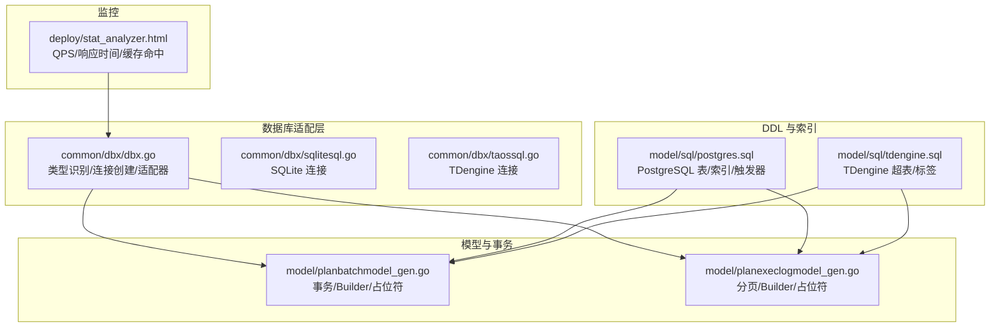
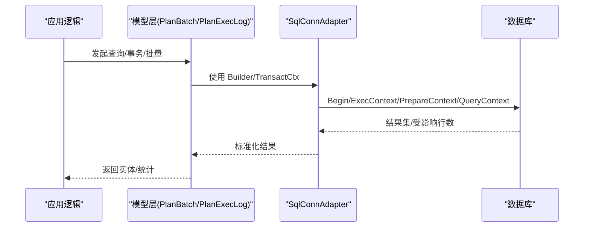
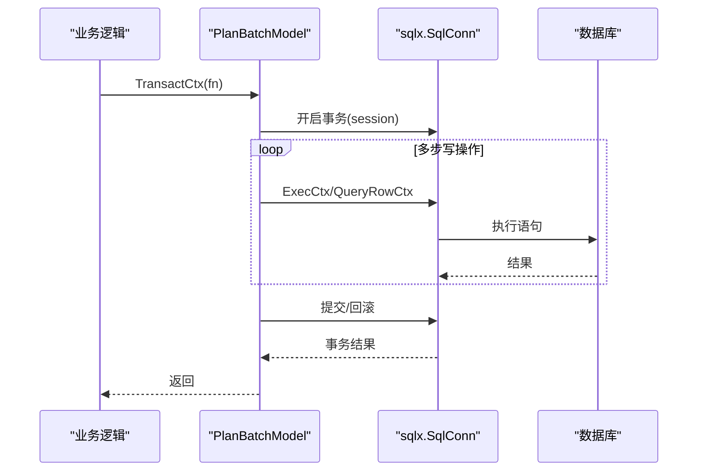
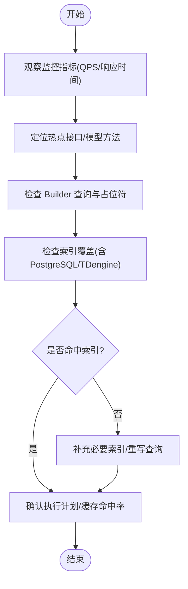
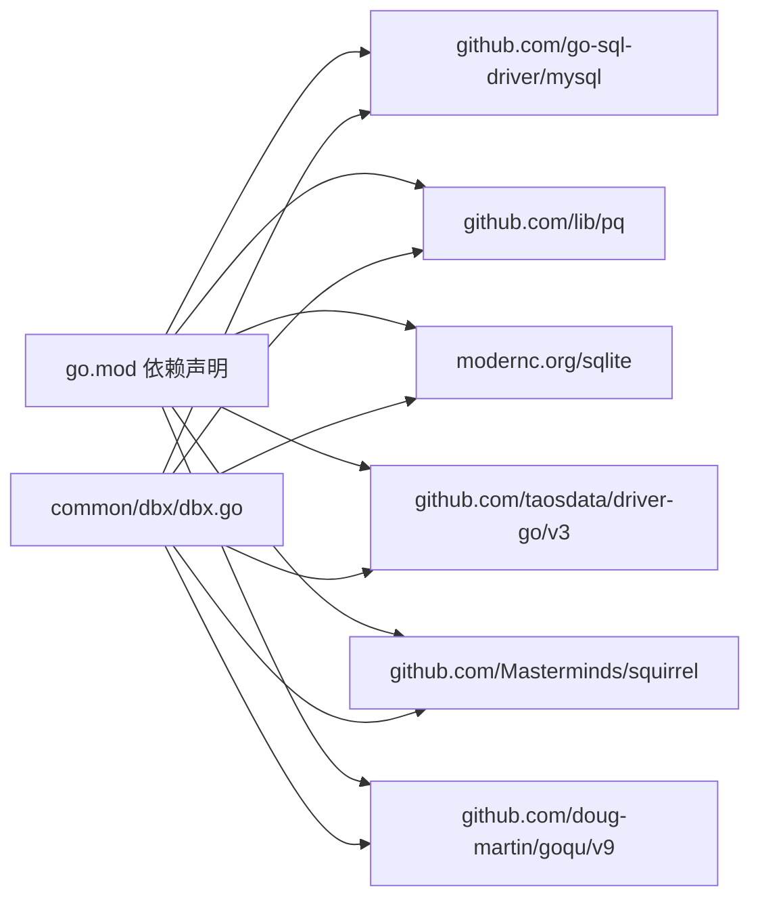

# 数据库性能优化

<cite>
**本文引用的文件**
- [common/dbx/dbx.go](file://common/dbx/dbx.go)
- [.trae/skills/zero-skills/references/database-patterns.md](file://.trae/skills/zero-skills/references/database-patterns.md)
- [.trae/skills/zero-skills/references/resilience-patterns.md](file://.trae/skills/zero-skills/references/resilience-patterns.md)
- [common/dbx/sqlitesql.go](file://common/dbx/sqlitesql.go)
- [common/dbx/taossql.go](file://common/dbx/taossql.go)
- [model/sql/postgres.sql](file://model/sql/postgres.sql)
- [model/sql/tdengine.sql](file://model/sql/tdengine.sql)
- [model/planbatchmodel_gen.go](file://model/planbatchmodel_gen.go)
- [model/planexeclogmodel_gen.go](file://model/planexeclogmodel_gen.go)
- [deploy/stat_analyzer.html](file://deploy/stat_analyzer.html)
- [go.mod](file://go.mod)
</cite>

## 目录
1. [简介](#简介)
2. [项目结构](#项目结构)
3. [核心组件](#核心组件)
4. [架构总览](#架构总览)
5. [详细组件分析](#详细组件分析)
6. [依赖分析](#依赖分析)
7. [性能考量](#性能考量)
8. [故障排除指南](#故障排除指南)
9. [结论](#结论)
10. [附录](#附录)

## 简介
本指南面向 zero-service 项目的数据库性能优化与故障排除，聚焦以下目标：
- 数据库连接池配置优化：连接数设置、超时参数调整、连接复用策略
- 慢查询分析：执行计划、性能监控、索引使用检查
- 多数据库类型优化：MySQL、PostgreSQL、SQLite、TDengine 的差异化策略
- 连接适配器性能调优：事务、批量、预编译语句
- 监控指标解读：连接数、响应时间、锁等待、缓存命中率
- 备份与恢复对性能影响及性能基准测试建议

## 项目结构
围绕数据库相关的关键位置与职责如下：
- 连接与适配：common/dbx 提供统一数据库类型识别、连接创建与适配器封装
- 模型与事务：model 下的生成模型支持事务、批量与 Builder 查询
- PostgreSQL/TDengine DDL：model/sql 提供表结构与索引定义
- 监控可视化：deploy/stat_analyzer.html 展示 QPS、响应时间、缓存命中率等指标
- 依赖声明：go.mod 显示数据库驱动与 ORM/SQL 工具依赖



**图表来源**
- [common/dbx/dbx.go:31-64](file://common/dbx/dbx.go#L31-L64)
- [common/dbx/sqlitesql.go:10-12](file://common/dbx/sqlitesql.go#L10-L12)
- [common/dbx/taossql.go:11-13](file://common/dbx/taossql.go#L11-L13)
- [model/planbatchmodel_gen.go:450-551](file://model/planbatchmodel_gen.go#L450-L551)
- [model/planexeclogmodel_gen.go:451-457](file://model/planexeclogmodel_gen.go#L451-L457)
- [model/sql/postgres.sql:1-526](file://model/sql/postgres.sql#L1-L526)
- [model/sql/tdengine.sql:1-34](file://model/sql/tdengine.sql#L1-L34)
- [deploy/stat_analyzer.html:278-1253](file://deploy/stat_analyzer.html#L278-L1253)

**章节来源**
- [common/dbx/dbx.go:31-64](file://common/dbx/dbx.go#L31-L64)
- [model/sql/postgres.sql:1-526](file://model/sql/postgres.sql#L1-L526)
- [model/sql/tdengine.sql:1-34](file://model/sql/tdengine.sql#L1-L34)
- [model/planbatchmodel_gen.go:450-551](file://model/planbatchmodel_gen.go#L450-L551)
- [model/planexeclogmodel_gen.go:451-457](file://model/planexeclogmodel_gen.go#L451-L457)
- [deploy/stat_analyzer.html:278-1253](file://deploy/stat_analyzer.html#L278-L1253)
- [go.mod:1-245](file://go.mod#L1-L245)

## 核心组件
- 数据库类型识别与连接工厂：根据数据源自动识别类型并创建连接
- 通用连接适配器：将 sqlx.SqlConn 适配为标准 sql.DB 接口，便于使用原生 sql 包能力
- 事务与批量：模型层提供 TransactCtx、SelectBuilder/InsertBuilder/UpdateBuilder/DeleteBuilder，支持跨数据库占位符与返回值差异
- 监控与可视化：前端页面聚合 QPS、响应时间、缓存命中率等指标，辅助定位瓶颈

**章节来源**
- [common/dbx/dbx.go:31-64](file://common/dbx/dbx.go#L31-L64)
- [common/dbx/dbx.go:66-104](file://common/dbx/dbx.go#L66-L104)
- [model/planbatchmodel_gen.go:450-551](file://model/planbatchmodel_gen.go#L450-L551)
- [model/planexeclogmodel_gen.go:451-457](file://model/planexeclogmodel_gen.go#L451-L457)
- [deploy/stat_analyzer.html:278-1253](file://deploy/stat_analyzer.html#L278-L1253)

## 架构总览
下图展示数据库访问链路：应用通过模型层发起查询，模型层基于 sqlx/Builder 与数据库交互；当需要原生 sql 能力时，使用适配器包装连接。



**图表来源**
- [common/dbx/dbx.go:66-104](file://common/dbx/dbx.go#L66-L104)
- [model/planbatchmodel_gen.go:450-551](file://model/planbatchmodel_gen.go#L450-L551)
- [model/planexeclogmodel_gen.go:451-457](file://model/planexeclogmodel_gen.go#L451-L457)

## 详细组件分析

### 组件A：数据库连接与适配器
- 功能要点
  - 自动识别数据库类型（MySQL、PostgreSQL、SQLite、TDengine）
  - 统一连接创建与适配器封装，暴露 Begin/BeginTx、ExecContext、PrepareContext、QueryContext、QueryRowContext
  - 为 goqu 提供适配器，支持多数据库方言

```mermaid
classDiagram
class SqlConnAdapter {
-conn : "sqlx.SqlConn"
-db : "*sql.DB"
+Begin() (*sql.Tx, error)
+BeginTx(ctx, opts) (*sql.Tx, error)
+ExecContext(ctx, query, args...) (sql.Result, error)
+PrepareContext(ctx, query) (*sql.Stmt, error)
+QueryContext(ctx, query, args...) (*sql.Rows, error)
+QueryRowContext(ctx, query, args...) *sql.Row
}
class DBX {
+ParseDatabaseType(datasource) DatabaseType
+New(datasource, opts...) sqlx.SqlConn
+NewQoqu(datasource, opts...) *goqu.Database
}
DBX --> SqlConnAdapter : "创建适配器"
SqlConnAdapter --> "标准 sql 包" : "委托实现"
```

**图表来源**
- [common/dbx/dbx.go:66-104](file://common/dbx/dbx.go#L66-L104)
- [common/dbx/dbx.go:106-138](file://common/dbx/dbx.go#L106-L138)

**章节来源**
- [common/dbx/dbx.go:31-64](file://common/dbx/dbx.go#L31-L64)
- [common/dbx/dbx.go:66-104](file://common/dbx/dbx.go#L66-L104)
- [common/dbx/dbx.go:106-138](file://common/dbx/dbx.go#L106-L138)

### 组件B：事务与批量操作
- 事务模式：模型层提供 TransactCtx，确保跨操作原子性
- 批量模式：使用 Builder 生成 SQL，结合占位符格式适配 PostgreSQL（$n）与 MySQL（?）
- 返回值差异：PostgreSQL 插入后使用 RETURNING id，兼容封装返回



**图表来源**
- [model/planbatchmodel_gen.go:450-461](file://model/planbatchmodel_gen.go#L450-L461)

**章节来源**
- [.trae/skills/zero-skills/references/database-patterns.md:271-365](file://.trae/skills/zero-skills/references/database-patterns.md#L271-L365)
- [model/planbatchmodel_gen.go:450-551](file://model/planbatchmodel_gen.go#L450-L551)

### 组件C：慢查询与索引检查流程
- 慢查询定位步骤
  - 在监控界面观察 QPS 与响应时间分布，识别异常时段与类型
  - 定位热点接口，结合日志与追踪 ID 定位到具体模型方法
  - 分析模型使用的 Builder 查询与占位符格式，确认是否命中索引
  - 对关键扫描表（如 plan_exec_item 的核心扫描字段）检查索引覆盖
- 索引检查要点
  - PostgreSQL：参考 postgres.sql 中的索引定义，确认查询条件是否能利用索引
  - TDengine：关注超表标签与时间序列扫描，避免全表扫描



**图表来源**
- [deploy/stat_analyzer.html:278-1253](file://deploy/stat_analyzer.html#L278-L1253)
- [model/sql/postgres.sql:160-167](file://model/sql/postgres.sql#L160-L167)
- [model/sql/postgres.sql:264-272](file://model/sql/postgres.sql#L264-L272)
- [model/sql/tdengine.sql:1-34](file://model/sql/tdengine.sql#L1-L34)

**章节来源**
- [deploy/stat_analyzer.html:278-1253](file://deploy/stat_analyzer.html#L278-L1253)
- [model/sql/postgres.sql:160-167](file://model/sql/postgres.sql#L160-L167)
- [model/sql/postgres.sql:264-272](file://model/sql/postgres.sql#L264-L272)
- [model/sql/tdengine.sql:1-34](file://model/sql/tdengine.sql#L1-L34)

### 组件D：多数据库类型优化策略
- MySQL
  - 使用 go-zero 默认连接池参数（最大空闲连接、最大打开连接、连接生命周期）
  - 参考连接池配置示例，按需调整
- PostgreSQL
  - 利用占位符格式适配（$n），配合索引与触发器维护 create/update 时间
  - 注意 RETURNING id 的返回值封装
- SQLite
  - 通过 sqlite 驱动连接，适合轻量场景与本地开发
- TDengine
  - 使用 taosRestful 驱动，结合超表与标签设计，优化时间序列扫描

**章节来源**
- [.trae/skills/zero-skills/references/database-patterns.md:448-480](file://.trae/skills/zero-skills/references/database-patterns.md#L448-L480)
- [common/dbx/dbx.go:31-64](file://common/dbx/dbx.go#L31-L64)
- [common/dbx/sqlitesql.go:10-12](file://common/dbx/sqlitesql.go#L10-L12)
- [common/dbx/taossql.go:11-13](file://common/dbx/taossql.go#L11-L13)
- [model/sql/postgres.sql:1-526](file://model/sql/postgres.sql#L1-L526)
- [model/sql/tdengine.sql:1-34](file://model/sql/tdengine.sql#L1-L34)

## 依赖分析
- go.mod 中声明了 MySQL、PostgreSQL、SQLite、TDengine 等驱动与工具库，支撑本项目的多数据库能力
- dbx 层通过类型识别与连接工厂解耦上层逻辑与底层驱动差异



**图表来源**
- [go.mod:20-61](file://go.mod#L20-L61)
- [common/dbx/dbx.go:8-20](file://common/dbx/dbx.go#L8-L20)

**章节来源**
- [go.mod:20-61](file://go.mod#L20-L61)
- [common/dbx/dbx.go:8-20](file://common/dbx/dbx.go#L8-L20)

## 性能考量
- 连接池参数
  - 默认值与自定义配置参考数据库模式文档中的示例
  - 根据并发与资源限制调整 MaxOpenConns、MaxIdleConns、ConnMaxLifetime
- 事务与批量
  - 使用 TransactCtx 将相关写操作放入同一事务，减少锁竞争
  - 批量写入优先使用 Builder 与占位符，避免 N+1 查询
- 预编译语句
  - 通过 PrepareContext 提升重复执行语句的性能
- 监控指标
  - QPS、P90/P99 响应时间、缓存命中率、限流丢弃数，用于快速定位异常

[本节为通用指导，无需列出具体文件来源]

## 故障排除指南

### 1. 连接池配置问题
- 症状
  - 连接耗尽、超时频繁、连接泄漏
- 排查步骤
  - 检查连接池参数是否合理（最大打开连接、空闲连接、生命周期）
  - 观察监控中的连接数与响应时间趋势
  - 确认业务是否存在长事务或未释放的连接
- 优化建议
  - 参考默认与自定义连接池配置示例，按环境压力调整
  - 控制单请求事务时长，避免长时间占用连接

**章节来源**
- [.trae/skills/zero-skills/references/database-patterns.md:448-480](file://.trae/skills/zero-skills/references/database-patterns.md#L448-L480)
- [deploy/stat_analyzer.html:278-1253](file://deploy/stat_analyzer.html#L278-L1253)

### 2. 慢查询与锁等待
- 症状
  - 响应时间 P99 显著升高，CPU 使用率高
- 排查步骤
  - 在监控中定位异常时段与接口类型
  - 定位到模型方法，检查 Builder 查询与占位符
  - 检查索引是否覆盖查询条件（PostgreSQL/TDengine）
- 优化建议
  - 为热点查询补充索引或改写查询
  - 对核心扫描字段（如 plan_exec_item 的 next_trigger_time/status）确保索引有效

**章节来源**
- [deploy/stat_analyzer.html:278-1253](file://deploy/stat_analyzer.html#L278-L1253)
- [model/sql/postgres.sql:264-272](file://model/sql/postgres.sql#L264-L272)
- [model/sql/tdengine.sql:1-34](file://model/sql/tdengine.sql#L1-L34)

### 3. 事务与批量性能
- 症状
  - 写入吞吐低、偶发死锁
- 排查步骤
  - 检查是否将多步写入放入同一事务
  - 确认批量写入是否使用 Builder 与占位符
- 优化建议
  - 使用 TransactCtx 将强一致写入合并
  - 使用 PrepareContext 预编译重复执行语句

**章节来源**
- [.trae/skills/zero-skills/references/database-patterns.md:271-365](file://.trae/skills/zero-skills/references/database-patterns.md#L271-L365)
- [model/planbatchmodel_gen.go:450-551](file://model/planbatchmodel_gen.go#L450-L551)

### 4. 不同数据库类型的特定优化
- MySQL
  - 使用默认连接池参数，按需增大 MaxOpenConns 与 MaxIdleConns
- PostgreSQL
  - 利用 $n 占位符与索引，注意 RETURNING id 的返回值封装
- SQLite
  - 适合本地开发与小规模数据，注意并发限制
- TDengine
  - 使用 taosRestful 驱动，结合超表标签优化时间序列查询

**章节来源**
- [.trae/skills/zero-skills/references/database-patterns.md:448-480](file://.trae/skills/zero-skills/references/database-patterns.md#L448-L480)
- [common/dbx/dbx.go:31-64](file://common/dbx/dbx.go#L31-L64)
- [common/dbx/sqlitesql.go:10-12](file://common/dbx/sqlitesql.go#L10-L12)
- [common/dbx/taossql.go:11-13](file://common/dbx/taossql.go#L11-L13)
- [model/sql/postgres.sql:1-526](file://model/sql/postgres.sql#L1-L526)
- [model/sql/tdengine.sql:1-34](file://model/sql/tdengine.sql#L1-L34)

### 5. 监控指标解读
- QPS 与响应时间
  - 识别异常时段与接口类型，定位热点
- 缓存命中率
  - 关注命中率下降导致的数据库压力上升
- 限流丢弃
  - 当 CPU 抖动或队列积压时，观察丢弃数变化

**章节来源**
- [deploy/stat_analyzer.html:278-1253](file://deploy/stat_analyzer.html#L278-L1253)

### 6. 备份与恢复对性能的影响
- 影响
  - 备份期间可能产生额外 IO 与锁等待，导致查询延迟上升
- 建议
  - 在低峰期执行备份
  - 使用只读副本或冷备方案降低对主库影响

[本节为通用指导，无需列出具体文件来源]

### 7. 性能基准测试
- 建议
  - 使用监控页面的历史数据对比不同配置下的 QPS、P99 响应时间与缓存命中率
  - 针对关键路径（事务/批量/慢查询）进行回归测试

**章节来源**
- [deploy/stat_analyzer.html:278-1253](file://deploy/stat_analyzer.html#L278-L1253)

## 结论
通过统一的数据库类型识别与连接适配器、规范化的事务与批量操作、完善的索引与监控体系，zero-service 能够在多数据库环境下稳定运行并持续优化性能。建议在生产环境中：
- 基于监控指标持续迭代连接池参数
- 强化索引覆盖与查询重写
- 使用事务与批量提升吞吐
- 在低峰期执行备份，保障主库性能

[本节为总结性内容，无需列出具体文件来源]

## 附录
- 相关配置与示例可参考数据库模式文档中的连接池与事务示例
- 多数据库驱动与工具库在 go.mod 中集中声明

**章节来源**
- [.trae/skills/zero-skills/references/database-patterns.md:448-480](file://.trae/skills/zero-skills/references/database-patterns.md#L448-L480)
- [.trae/skills/zero-skills/references/database-patterns.md:271-365](file://.trae/skills/zero-skills/references/database-patterns.md#L271-L365)
- [go.mod:20-61](file://go.mod#L20-L61)