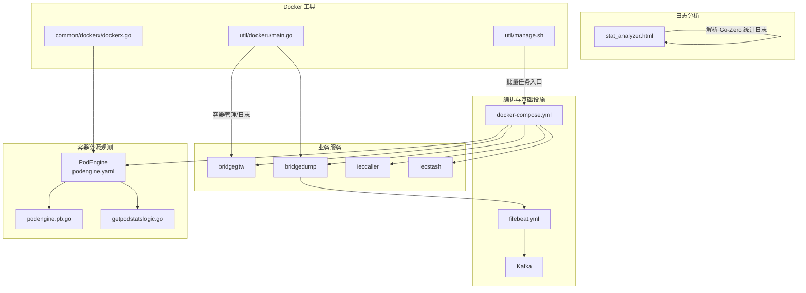
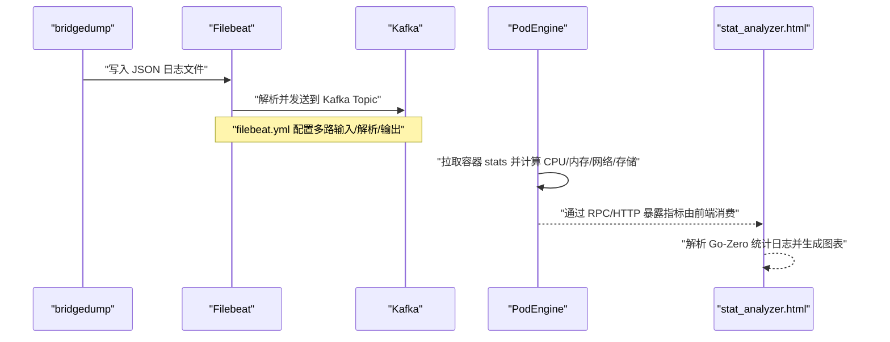
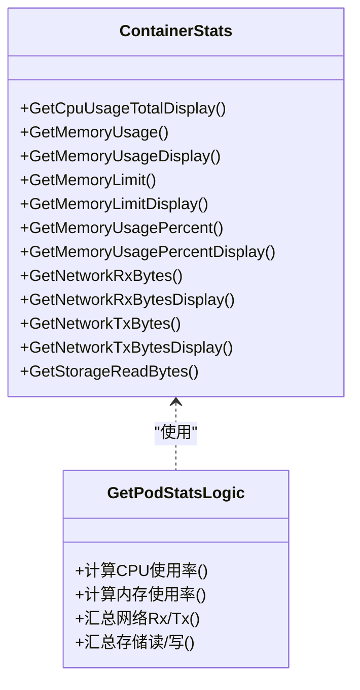
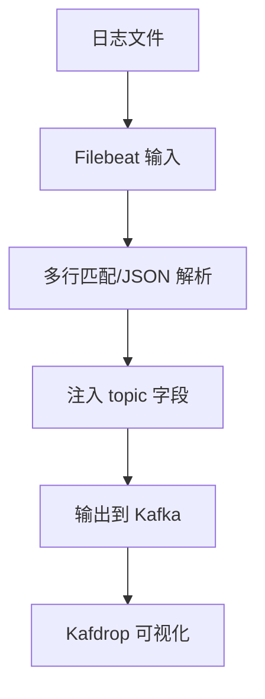
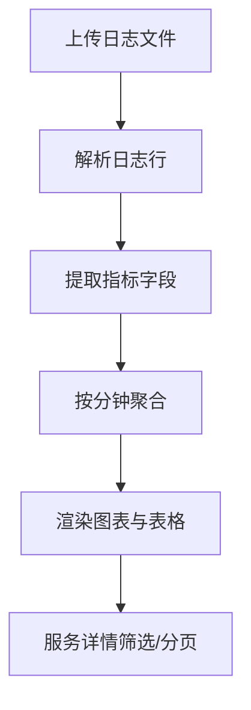
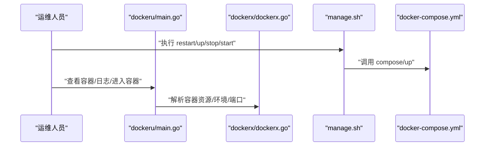
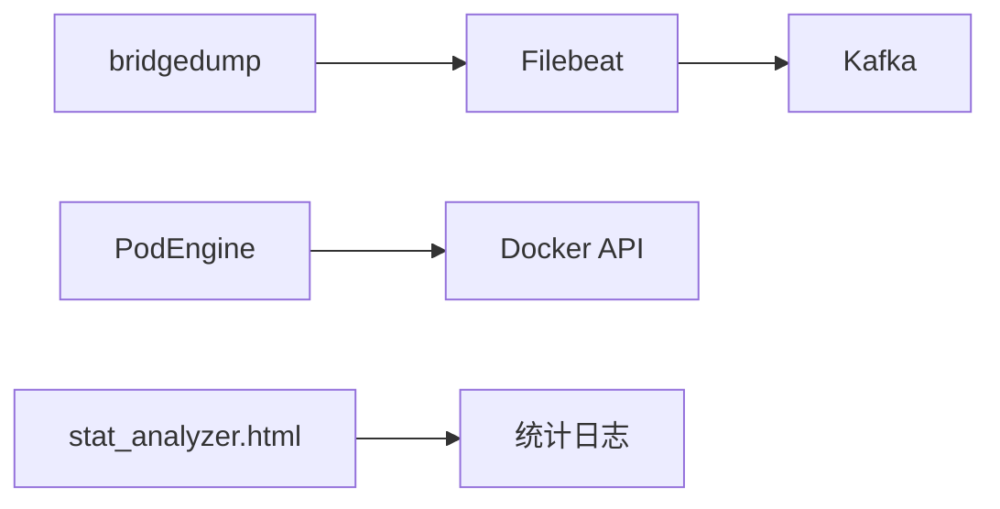

# 系统资源监控

<cite>
**本文引用的文件**
- [docker-compose.yml](file://deploy/docker-compose.yml)
- [filebeat.yml](file://deploy/filebeat/conf/filebeat.yml)
- [stat_analyzer.html](file://deploy/stat_analyzer.html)
- [podengine.yaml](file://app/podengine/etc/podengine.yaml)
- [podengine.pb.go](file://app/podengine/podengine/podengine.pb.go)
- [getpodstatslogic.go](file://app/podengine/internal/logic/getpodstatslogic.go)
- [dockerx.go](file://common/dockerx/dockerx.go)
- [main.go](file://util/dockeru/main.go)
- [manage.sh](file://util/manage.sh)
</cite>

## 目录
1. [简介](#简介)
2. [项目结构](#项目结构)
3. [核心组件](#核心组件)
4. [架构总览](#架构总览)
5. [详细组件分析](#详细组件分析)
6. [依赖关系分析](#依赖关系分析)
7. [性能考虑](#性能考虑)
8. [故障排查指南](#故障排查指南)
9. [结论](#结论)
10. [附录](#附录)

## 简介
本指南面向 zero-service 的系统资源监控与性能诊断，围绕 CPU 使用率、内存、磁盘 I/O、网络性能等关键指标，结合仓库中的容器编排、日志采集与分析工具、容器资源统计能力，提供从数据采集、处理、可视化到告警与基线建立的完整实践路径。文档同时给出 Docker 监控、Kafka/Beats 流水线、以及基于 Go-Zero 统计日志的可视化分析方法，帮助快速定位性能瓶颈并建立异常检测与告警体系。

## 项目结构
本项目的监控与资源观测主要分布在以下区域：
- 容器编排与基础设施：docker-compose.yml 定义了 Kafka、Filebeat、各业务服务的容器与网络模式
- 日志采集与传输：filebeat.yml 配置了对桥接 dump 业务日志的采集、解析与投递至 Kafka
- 容器资源观测：PodEngine 提供容器 CPU/内存/网络/存储统计接口与数据模型
- 统计日志分析：stat_analyzer.html 可解析 Go-Zero 统计日志，生成内存、CPU、QPS、限流等可视化图表
- Docker 工具链：util/dockeru/main.go 提供容器管理与日志查看；common/dockerx/dockerx.go 提供 Docker 客户端与资源解析；util/manage.sh 提供批量任务入口

**图表来源**
- [docker-compose.yml:1-110](file://deploy/docker-compose.yml#L1-L110)
- [filebeat.yml:1-122](file://deploy/filebeat/conf/filebeat.yml#L1-L122)
- [podengine.yaml:1-20](file://app/podengine/etc/podengine.yaml#L1-L20)
- [podengine.pb.go:1842-1924](file://app/podengine/podengine/podengine.pb.go#L1842-L1924)
- [getpodstatslogic.go:55-103](file://app/podengine/internal/logic/getpodstatslogic.go#L55-L103)
- [stat_analyzer.html:278-377](file://deploy/stat_analyzer.html#L278-L377)
- [main.go:35-272](file://util/dockeru/main.go#L35-L272)
- [dockerx.go:1-95](file://common/dockerx/dockerx.go#L1-L95)
- [manage.sh:1-35](file://util/manage.sh#L1-L35)

**章节来源**
- [docker-compose.yml:1-110](file://deploy/docker-compose.yml#L1-L110)
- [filebeat.yml:1-122](file://deploy/filebeat/conf/filebeat.yml#L1-L122)
- [podengine.yaml:1-20](file://app/podengine/etc/podengine.yaml#L1-L20)
- [stat_analyzer.html:278-377](file://deploy/stat_analyzer.html#L278-L377)
- [main.go:35-272](file://util/dockeru/main.go#L35-L272)
- [dockerx.go:1-95](file://common/dockerx/dockerx.go#L1-L95)
- [manage.sh:1-35](file://util/manage.sh#L1-L35)

## 核心组件
- 容器编排与网络
  - docker-compose.yml 定义了 Kafka、Filebeat、bridgegtw、bridgedump、ieccaller、iecstash 等服务，统一使用 host 网络模式，便于直连与低开销通信
  - 通过环境变量、卷挂载与资源限制（如 mem_limit）实现服务隔离与资源约束
- 日志采集与传输
  - filebeat.yml 针对桥接 dump 的多类 JSON 日志进行多行匹配、JSON 解析、字段注入与 Kafka 输出，形成稳定的数据入湖通道
- 容器资源观测
  - PodEngine 提供容器统计接口与 protobuf 数据模型，getpodstatslogic.go 中实现了 CPU/内存/网络/存储的计算逻辑
  - podengine.yaml 配置了日志路径、注册中心与 Docker API 地址
- 统计日志分析
  - stat_analyzer.html 支持解析 Go-Zero 统计日志，提取 CPU、内存、QPS、丢弃、限流等指标，生成趋势图与服务分布
- Docker 工具链
  - util/dockeru/main.go 提供容器/镜像管理、日志查看、交互式进入容器等能力
  - common/dockerx/dockerx.go 提供 Docker 客户端初始化与资源解析（CPU/Memory 请求/限制）
  - util/manage.sh 提供统一的任务入口，按命令与服务名批量执行

**章节来源**
- [docker-compose.yml:54-110](file://deploy/docker-compose.yml#L54-L110)
- [filebeat.yml:4-122](file://deploy/filebeat/conf/filebeat.yml#L4-L122)
- [podengine.yaml:1-20](file://app/podengine/etc/podengine.yaml#L1-L20)
- [podengine.pb.go:1842-1924](file://app/podengine/podengine/podengine.pb.go#L1842-L1924)
- [getpodstatslogic.go:55-103](file://app/podengine/internal/logic/getpodstatslogic.go#L55-L103)
- [stat_analyzer.html:278-377](file://deploy/stat_analyzer.html#L278-L377)
- [main.go:35-272](file://util/dockeru/main.go#L35-L272)
- [dockerx.go:1-95](file://common/dockerx/dockerx.go#L1-L95)
- [manage.sh:1-35](file://util/manage.sh#L1-L35)

## 架构总览
下图展示了从日志采集、消息传输到资源观测与可视化分析的整体流程：

**图表来源**
- [filebeat.yml:4-122](file://deploy/filebeat/conf/filebeat.yml#L4-L122)
- [podengine.pb.go:1842-1924](file://app/podengine/podengine/podengine.pb.go#L1842-L1924)
- [getpodstatslogic.go:55-103](file://app/podengine/internal/logic/getpodstatslogic.go#L55-L103)
- [stat_analyzer.html:278-377](file://deploy/stat_analyzer.html#L278-L377)

## 详细组件分析

### 容器资源观测（CPU/内存/网络/磁盘 I/O）
- 数据模型与字段
  - ContainerStats 包含 CPU/内存/网络/存储等字段，提供数值与显示字符串、百分比等便捷访问器
- 计算逻辑
  - CPU 使用率：基于两次采样差值与系统时间差计算，必要时回退到绝对值
  - 内存使用率：基于当前使用量与内存上限
  - 网络 I/O：汇总各网卡 Rx/Tx 字节数
  - 存储 I/O：汇总读/写字节数
- 配置与集成
  - podengine.yaml 指定日志路径、注册中心与 Docker API 地址，确保 PodEngine 能正确访问 Docker daemon

**图表来源**
- [podengine.pb.go:1842-1924](file://app/podengine/podengine/podengine.pb.go#L1842-L1924)
- [getpodstatslogic.go:55-103](file://app/podengine/internal/logic/getpodstatslogic.go#L55-L103)

**章节来源**
- [podengine.pb.go:1842-1924](file://app/podengine/podengine/podengine.pb.go#L1842-L1924)
- [getpodstatslogic.go:55-103](file://app/podengine/internal/logic/getpodstatslogic.go#L55-L103)
- [podengine.yaml:1-20](file://app/podengine/etc/podengine.yaml#L1-L20)

### 日志采集与传输（Filebeat → Kafka）
- 输入与解析
  - 针对 cable_work_list、cable_fault、cable_fault_wave 三类目录，采用多行匹配与 JSON 解析
  - 注入 topic 字段，便于后续路由
- 输出与可靠性
  - 输出到 Kafka，设置压缩、消息大小与 ack 策略
- 运维要点
  - scan_frequency、close_inactive、ignore_older、clean_inactive 等参数平衡实时性与资源消耗

**图表来源**
- [filebeat.yml:4-122](file://deploy/filebeat/conf/filebeat.yml#L4-L122)
- [docker-compose.yml:101-110](file://deploy/docker-compose.yml#L101-L110)

**章节来源**
- [filebeat.yml:4-122](file://deploy/filebeat/conf/filebeat.yml#L4-L122)
- [docker-compose.yml:101-110](file://deploy/docker-compose.yml#L101-L110)

### 统计日志分析（Go-Zero Stats）
- 支持的指标类型
  - 内存使用统计（CPU、Alloc、Sys）、限流状态（shedding_stat）、性能指标（QPS、drops、avg_time）
- 功能特性
  - 时间聚合（按分钟）、服务分布、QPS/丢弃趋势、内存趋势、系统指标综合、缓存命中率趋势、服务详情表格与分页
- 使用建议
  - 上传 .txt/.log 文件，自动解析并生成图表；支持全屏查看与图表重置/展开

**图表来源**
- [stat_analyzer.html:774-882](file://deploy/stat_analyzer.html#L774-L882)
- [stat_analyzer.html:1329-1352](file://deploy/stat_analyzer.html#L1329-L1352)

**章节来源**
- [stat_analyzer.html:278-377](file://deploy/stat_analyzer.html#L278-L377)
- [stat_analyzer.html:774-882](file://deploy/stat_analyzer.html#L774-L882)
- [stat_analyzer.html:1329-1352](file://deploy/stat_analyzer.html#L1329-L1352)

### Docker 监控与运维工具
- 容器管理
  - util/dockeru/main.go 提供 ps、start、stop、restart、exec、log、images、image-save、image-prune 等子命令
- 资源解析
  - common/dockerx/dockerx.go 提供 Docker 客户端初始化、环境变量解析、端口/卷挂载提取、CPU/Memory 请求/限制解析
- 批量任务
  - util/manage.sh 接收命令与服务名，调用 Taskfile 任务执行批量操作

**图表来源**
- [main.go:35-272](file://util/dockeru/main.go#L35-L272)
- [dockerx.go:1-95](file://common/dockerx/dockerx.go#L1-L95)
- [manage.sh:1-35](file://util/manage.sh#L1-L35)
- [docker-compose.yml:54-110](file://deploy/docker-compose.yml#L54-L110)

**章节来源**
- [main.go:35-272](file://util/dockeru/main.go#L35-L272)
- [dockerx.go:1-95](file://common/dockerx/dockerx.go#L1-L95)
- [manage.sh:1-35](file://util/manage.sh#L1-L35)
- [docker-compose.yml:54-110](file://deploy/docker-compose.yml#L54-L110)

## 依赖关系分析
- 组件耦合
  - bridgedump 与 Filebeat：日志采集依赖
  - Filebeat 与 Kafka：消息传输依赖
  - PodEngine 与 Docker API：容器资源观测依赖
  - stat_analyzer.html 与日志数据：可视化分析依赖
- 外部依赖
  - Docker Engine、Kafka、Filebeat、ECharts（前端可视化）

**图表来源**
- [filebeat.yml:110-122](file://deploy/filebeat/conf/filebeat.yml#L110-L122)
- [docker-compose.yml:54-110](file://deploy/docker-compose.yml#L54-L110)
- [podengine.yaml:19-20](file://app/podengine/etc/podengine.yaml#L19-L20)
- [stat_analyzer.html:278-377](file://deploy/stat_analyzer.html#L278-L377)

**章节来源**
- [filebeat.yml:110-122](file://deploy/filebeat/conf/filebeat.yml#L110-L122)
- [docker-compose.yml:54-110](file://deploy/docker-compose.yml#L54-L110)
- [podengine.yaml:19-20](file://app/podengine/etc/podengine.yaml#L19-L20)
- [stat_analyzer.html:278-377](file://deploy/stat_analyzer.html#L278-L377)

## 性能考虑
- CPU 使用率监控与分析
  - 基于容器 stats 的 delta 计算，关注峰值与持续高占用时段；结合 stat_analyzer 的 QPS/丢弃趋势定位热点接口
- 内存使用监控
  - 关注 Alloc/Sys 与 GC 次数，结合内存趋势图识别泄漏与碎片；利用 PodEngine 的内存使用百分比与 limit 辨识资源紧张
- 磁盘 I/O 性能
  - 通过存储读写字节统计观察队列深度与吞吐变化；结合日志写入路径与 Kafka 消费速率评估瓶颈
- 网络性能
  - Rx/Tx 字节统计可用于带宽利用率与连接数推断；结合服务间直连（host 网络）降低额外开销
- 日志与采集
  - filebeat 的 scan_frequency、close_inactive 等参数影响采集延迟与资源占用；合理设置以平衡实时性与成本

[本节为通用指导，无需特定文件引用]

## 故障排查指南
- 容器状态与日志
  - 使用 util/dockeru/main.go 的 log 子命令查看最近日志；若容器异常退出，检查 status 与日志尾部
- 资源限制与超限
  - 通过 common/dockerx/dockerx.go 解析 CPU/Memory 请求/限制，核对 mem_limit 与容器实际使用
- 日志采集异常
  - 检查 filebeat.yml 的输入路径、多行匹配与 JSON 解析规则；确认 Kafka 可达性与分区状态
- 统计日志缺失
  - 在 stat_analyzer.html 中确认文件上传与解析进度；检查日志格式是否符合预期字段

**章节来源**
- [main.go:394-421](file://util/dockeru/main.go#L394-L421)
- [dockerx.go:58-86](file://common/dockerx/dockerx.go#L58-L86)
- [filebeat.yml:4-122](file://deploy/filebeat/conf/filebeat.yml#L4-L122)
- [stat_analyzer.html:774-882](file://deploy/stat_analyzer.html#L774-L882)

## 结论
通过 docker-compose 的统一编排、Filebeat 的稳定采集、PodEngine 的容器资源观测与 stat_analyzer 的可视化分析，zero-service 形成了从数据采集、传输到可观测性的闭环。结合 Docker 工具链与批量任务入口，可高效开展性能诊断、异常定位与容量规划。建议在生产环境中进一步完善 Prometheus/Grafana 集成与告警策略，以实现自动化与智能化的监控运维。

[本节为总结性内容，无需特定文件引用]

## 附录
- 快速操作清单
  - 查看容器：docker ps -a
  - 查看日志：docker logs --tail 1000 -f <容器ID>
  - 进入容器：docker exec -it <容器ID> /bin/bash
  - 批量重启：./util/manage.sh restart "bridgegtw,bridgedump"
  - 导出镜像：docker save -o <文件名> <镜像名:标签>
- 建议的监控指标
  - CPU：使用率、上下文切换（结合系统层面 perf/blktrace）
  - 内存：分配速率、GC 次数、堆外内存、分页缺页
  - 磁盘：IOPS、队列深度、缓存命中率、写放大
  - 网络：带宽、连接数、RTT、丢包率

[本节为补充性内容，无需特定文件引用]