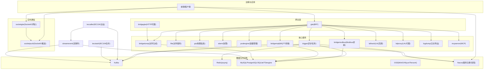
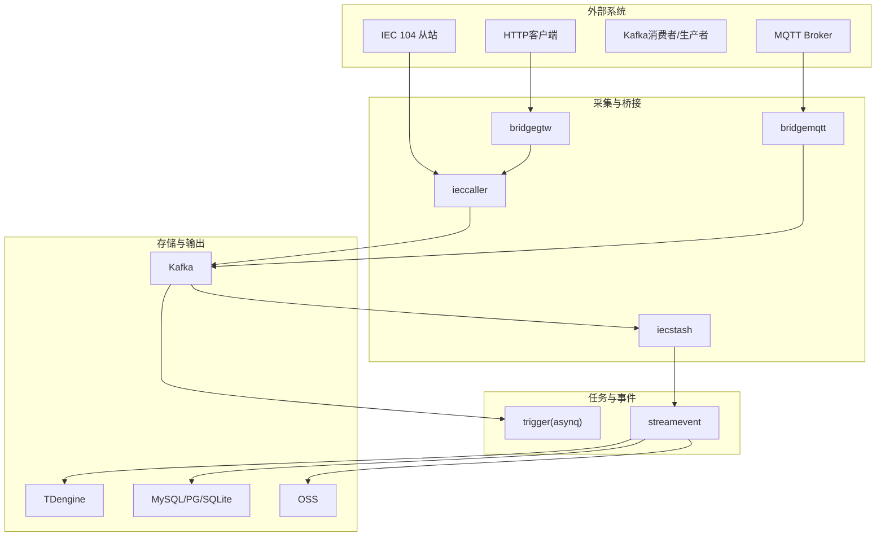
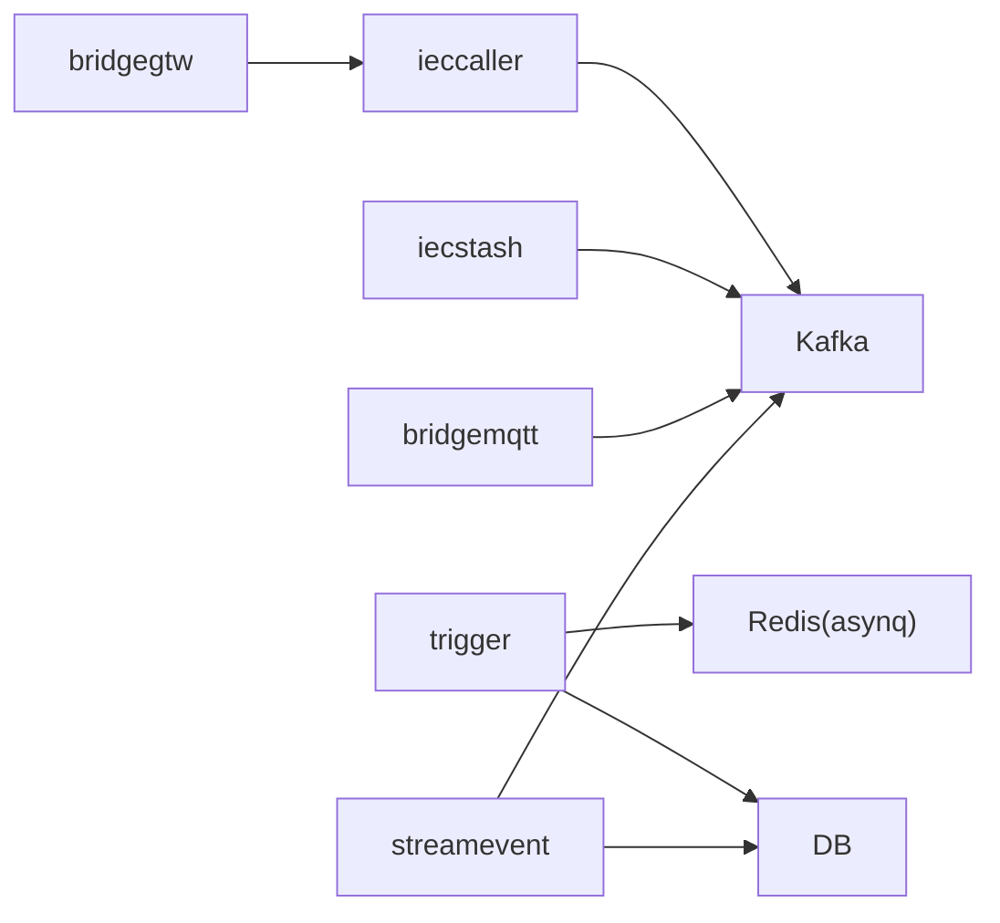
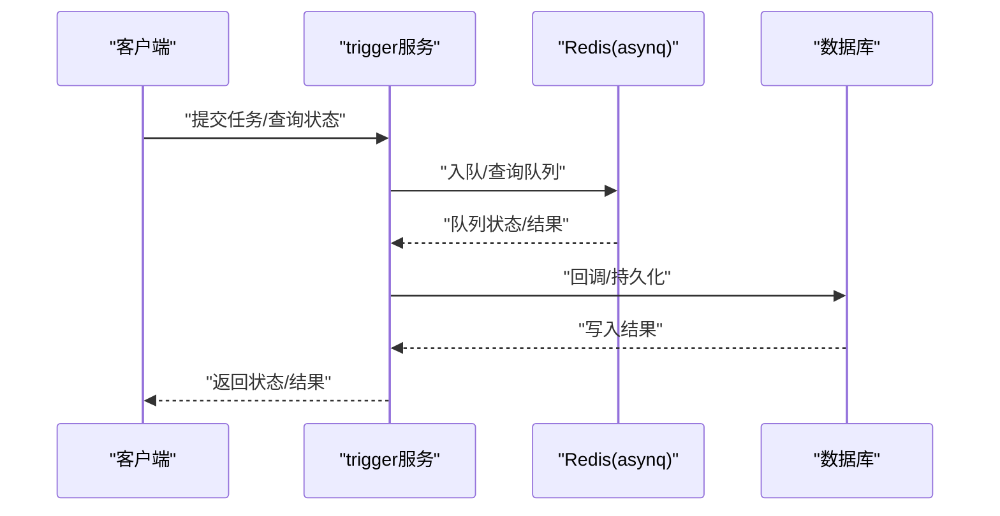

# 故障排除

<cite>
**本文引用的文件**
- [README.md](file://README.md)
- [docker-compose.yml](file://deploy/docker-compose.yml)
- [trigger.yaml](file://app/trigger/etc/trigger.yaml)
- [ieccaller.yaml](file://app/ieccaller/etc/ieccaller.yaml)
- [bridgemqtt.yaml](file://app/bridgemqtt/etc/bridgemqtt.yaml)
- [bridgegtw.yaml](file://app/bridgegtw/etc/bridgegtw.yaml)
- [loggerInterceptor.go](file://common/Interceptor/rpcserver/loggerInterceptor.go)
- [errorutil.go](file://common/tool/errorutil.go)
- [sendcommandlogic.go](file://app/ieccaller/internal/logic/sendcommandlogic.go)
- [errors.go](file://common/iec104/client/errors.go)
- [queueslogic.go](file://app/trigger/internal/logic/queueslogic.go)
</cite>

## 目录
1. [简介](#简介)
2. [项目结构](#项目结构)
3. [核心组件](#核心组件)
4. [架构总览](#架构总览)
5. [详细组件分析](#详细组件分析)
6. [依赖分析](#依赖分析)
7. [性能考虑](#性能考虑)
8. [故障排除指南](#故障排除指南)
9. [结论](#结论)
10. [附录](#附录)

## 简介
本指南面向 zero-service 的运维与开发人员，聚焦以下目标：
- 服务启动失败的排查清单：配置文件检查、依赖服务验证、端口冲突检测
- 任务执行失败的分析方法：日志查看、状态查询、重试机制
- 消息传递延迟的排查流程：Kafka 集群状态、分区分配、消费者组管理
- 性能问题的分析工具与优化建议：资源使用监控、瓶颈识别、容量规划
- 网络连接问题的诊断：防火墙、DNS、TLS 证书
- 日志分析技巧、错误码含义、系统监控指标解读

## 项目结构
zero-service 是基于 go-zero 的工业级微服务脚手架，涵盖 IEC 104 数采、异步任务调度、实时通信、容器管理、地理信息、MQTT/Modbus 桥接、BFF 网关等模块。核心服务通过 gRPC、Kafka、Redis、数据库等基础设施协同工作。

图表来源
- [README.md:15-51](file://README.md#L15-L51)
- [README.md:112-131](file://README.md#L112-L131)
- [README.md:133-154](file://README.md#L133-L154)
- [README.md:156-173](file://README.md#L156-L173)

章节来源
- [README.md:15-51](file://README.md#L15-L51)
- [README.md:112-131](file://README.md#L112-L131)
- [README.md:133-154](file://README.md#L133-L154)
- [README.md:156-173](file://README.md#L156-L173)

## 核心组件
- IEC 104 数采平台：ieccaller（主站）、iecstash（合并）、streamevent（落库），数据经 Kafka/MQTT/gRPC 推送至下游。
- 异步任务调度：基于 asynq 的 Redis 队列，支持定时/延时任务、回调、重试与生命周期管理。
- 实时通信：socketgtw + socketpush，支持房间、广播、MQTT 桥接与 Token 鉴权。
- 网关与桥接：gtw 聚合 gRPC/HTTP；bridgegtw 提供 HTTP 到 gRPC 的代理；bridgemqtt/bridgemodbus 提供协议桥接。
- 中间件：Kafka、Redis、数据库（MySQL/PostgreSQL/SQLite/TDengine）、对象存储（MinIO/Aliyun/Tencent）、Nacos。

章节来源
- [README.md:112-131](file://README.md#L112-L131)
- [README.md:133-154](file://README.md#L133-L154)
- [README.md:156-173](file://README.md#L156-L173)
- [README.md:174-188](file://README.md#L174-L188)

## 架构总览
下图展示零信任与多协议接入下的系统交互路径，强调 Kafka 作为中枢的消息通道与 Redis 作为任务队列的作用。

图表来源
- [README.md:112-131](file://README.md#L112-L131)
- [README.md:133-154](file://README.md#L133-L154)

## 详细组件分析

### IEC 104 主站（ieccaller）与合并（iecstash）
- 关键职责：多从站并发通信、Kafka/MQTT/gRPC 推送、ASDU 压缩合并、下游 RPC 转发。
- 配置要点：监听地址、部署模式、日志级别、Nacos 注册、Kafka 主题与消费者组、MQTT Broker/Topic、数据库开关、批大小与宽限期。
- 常见问题：从站不可达、Kafka 连接失败、MQTT 认证错误、推送阻塞、ASDU 批量超时。

章节来源
- [README.md:112-131](file://README.md#L112-L131)
- [ieccaller.yaml:1-79](file://app/ieccaller/etc/ieccaller.yaml#L1-L79)

### 异步任务调度（trigger）
- 关键职责：基于 asynq 的分布式任务队列，Redis 存储；支持定时/延时任务、HTTP/gRPC 回调、自动重试、归档与删除。
- 配置要点：监听地址、日志、Nacos 注册、Redis 连接、数据库连接、下游 streamevent 端点。
- 常见问题：Redis 不可达、队列状态异常、回调失败、任务堆积。

章节来源
- [README.md:133-154](file://README.md#L133-L154)
- [trigger.yaml:1-38](file://app/trigger/etc/trigger.yaml#L1-L38)

### MQTT 桥接（bridgemqtt）
- 关键职责：订阅指定 Topic，将消息桥接至 Socket 推送或下游 streamevent。
- 配置要点：Broker 地址、认证、QoS、订阅 Topic、SocketPush 端点。
- 常见问题：Broker 不可达、认证失败、订阅缺失、推送阻塞。

章节来源
- [bridgemqtt.yaml:1-48](file://app/bridgemqtt/etc/bridgemqtt.yaml#L1-L48)

### HTTP 代理网关（bridgegtw）
- 关键职责：将 HTTP 请求映射到 gRPC 方法，支持上游 gRPC 服务与路由配置。
- 配置要点：监听端口、上游 gRPC 端点、Proto 映射。
- 常见问题：上游不可达、路由不匹配、超时。

章节来源
- [bridgegtw.yaml:1-40](file://app/bridgegtw/etc/bridgegtw.yaml#L1-L40)

### gRPC 日志拦截器与错误码映射
- 日志拦截器：在服务端拦截请求，注入用户上下文并记录错误日志。
- 错误码映射：依据第三方扩展枚举将业务错误映射为 gRPC/HTTP 错误码，便于统一处理与告警。

章节来源
- [loggerInterceptor.go:1-45](file://common/Interceptor/rpcserver/loggerInterceptor.go#L1-L45)
- [errorutil.go:1-91](file://common/tool/errorutil.go#L1-L91)

### IEC 104 客户端错误
- 连接状态：未连接时禁止执行请求，应先建立连接再发送命令。
- 诊断要点：检查客户端管理器状态、连接参数、对端可达性。

章节来源
- [errors.go:1-8](file://common/iec104/client/errors.go#L1-L8)

### 任务队列状态查询（示例）
- 通过 Inspector 查询队列列表，辅助定位任务堆积与队列异常。

章节来源
- [queueslogic.go:1-35](file://app/trigger/internal/logic/queueslogic.go#L1-L35)

## 依赖分析
- 服务发现：Nacos（可选启用）
- 消息中间件：Kafka（生产/消费）、Redis（asynq 任务队列）
- 存储：MySQL/PostgreSQL/SQLite（关系库）、TDengine（时序库）、OSS（对象存储）
- 协议：IEC 104、Modbus、MQTT、gRPC、HTTP
- 容器：Docker（容器管理）

图表来源
- [README.md:112-131](file://README.md#L112-L131)
- [README.md:133-154](file://README.md#L133-L154)

章节来源
- [README.md:207-225](file://README.md#L207-L225)

## 性能考虑
- 资源监控：结合 Prometheus/Grafana 采集 CPU、内存、磁盘、网络与 Kafka/Redis 指标。
- 瓶颈识别：关注 Kafka 消费滞后、Redis 队列堆积、数据库慢查询、gRPC 调用耗时。
- 容量规划：根据消息吞吐、任务并发、连接数与存储增长趋势进行扩容。

## 故障排除指南

### 一、服务启动失败排查清单
- 配置文件检查
  - 确认各服务配置文件路径与权限正确，监听地址与端口未被占用。
  - 核对 Kafka/Redis/数据库/Nacos 等依赖连接串与认证信息。
  - 核对部署模式（如 ieccaller 的 standalone/cluster）与日志路径存在且可写。
- 依赖服务验证
  - 使用本地连通性测试：telnet/nc 检查 Kafka/Redis/DB 端口；curl 测试 HTTP 网关。
  - 若使用 Nacos，确认注册中心可达且命名空间/凭证正确。
- 端口冲突检测
  - 使用 netstat/ss/ lsof 检查 9092/9094（Kafka）、21004/21006/25004 等服务端口是否被占用。
  - Docker 环境下注意 host 网络模式与端口映射。
- 容器编排参考
  - 可参考部署编排文件中的 Kafka/bridgegtw/ieccaller/iecstash 等服务配置与端口映射。

章节来源
- [docker-compose.yml:1-110](file://deploy/docker-compose.yml#L1-L110)
- [ieccaller.yaml:1-79](file://app/ieccaller/etc/ieccaller.yaml#L1-L79)
- [trigger.yaml:1-38](file://app/trigger/etc/trigger.yaml#L1-L38)
- [bridgemqtt.yaml:1-48](file://app/bridgemqtt/etc/bridgemqtt.yaml#L1-L48)
- [bridgegtw.yaml:1-40](file://app/bridgegtw/etc/bridgegtw.yaml#L1-L40)

### 二、任务执行失败分析方法
- 日志查看
  - 观察服务端日志拦截器输出，定位 gRPC 错误与上下文信息。
  - 检查 Redis 连接状态与队列长度，确认任务未被卡住。
- 状态查询
  - 使用队列状态查询接口获取当前队列列表，判断是否存在异常队列。
- 重试机制
  - 确认任务回调失败后的重试策略与退避参数；检查归档/删除策略是否过早清理。
- IEC 命令发送失败
  - 若出现“未连接”错误，优先建立连接后再发送命令；检查客户端管理器状态与对端可达性。

图表来源
- [README.md:133-154](file://README.md#L133-L154)
- [queueslogic.go:26-34](file://app/trigger/internal/logic/queueslogic.go#L26-L34)

章节来源
- [loggerInterceptor.go:40-42](file://common/Interceptor/rpcserver/loggerInterceptor.go#L40-L42)
- [queueslogic.go:1-35](file://app/trigger/internal/logic/queueslogic.go#L1-L35)
- [errors.go:6-7](file://common/iec104/client/errors.go#L6-L7)

### 三、消息传递延迟排查流程
- Kafka 集群状态检查
  - 确认 Broker 连接、副本与 ISR 状态、分区数量与 Leader 分布。
  - 使用管理界面或命令行查看主题分区、消费者组偏移与滞后情况。
- 分区分配与消费者组
  - 检查消费者组是否正常 Rebalance、是否出现重复消费或遗漏。
  - 调整分区数与消费者并行度，避免热点分区。
- 生产/消费链路
  - 从 ieccaller/bridgemqtt 的生产端到 iecstash/streamevent 的消费端逐段验证，定位瓶颈环节。

章节来源
- [docker-compose.yml:4-30](file://deploy/docker-compose.yml#L4-L30)
- [ieccaller.yaml:35-41](file://app/ieccaller/etc/ieccaller.yaml#L35-L41)
- [README.md:112-131](file://README.md#L112-L131)

### 四、网络连接问题诊断
- 防火墙与安全组
  - 确认 Kafka/Redis/DB/Nacos 端口放行；容器环境注意 host 模式与宿主机策略。
- DNS 解析
  - 使用 nslookup/dig 检查域名解析；若使用内网地址，确保 hosts 或 DNS 配置正确。
- TLS 证书
  - 若涉及 HTTPS/TLS，检查证书链、有效期与客户端信任库；确保证书与域名匹配。

### 五、日志分析技巧与错误码
- 日志分析
  - 使用日志拦截器输出的错误上下文，结合 TraceId 追踪请求链路。
  - 关注 gRPC 错误与 HTTP 映射，快速定位业务错误类别。
- 错误码含义
  - 依据扩展枚举将业务错误映射为标准 HTTP/gRPC 错误码，便于统一告警与处理。
- 监控指标
  - 关注 Kafka lag、Redis 队列长度、数据库连接池、gRPC 调用耗时与错误率。

章节来源
- [loggerInterceptor.go:12-42](file://common/Interceptor/rpcserver/loggerInterceptor.go#L12-L42)
- [errorutil.go:61-81](file://common/tool/errorutil.go#L61-L81)

## 结论
通过系统化的配置核对、依赖验证、日志与指标分析，以及针对 Kafka/Redis/数据库的专项排查，可高效定位并解决 zero-service 的启动与运行问题。建议在生产环境中启用 Nacos、完善监控告警，并制定标准化的变更与回滚流程。

## 附录
- 快速启动与配置参考
  - 各服务配置位于 app/{service}/etc/ 下，典型项包括监听地址、Redis/Kafka/数据库连接、Nacos 与协议特定配置。
- 常用命令提示
  - Docker Compose 启动：在 deploy 目录执行 docker-compose up -d。
  - Kafka 管理：可使用 Kafdrop 界面或命令行工具检查主题与消费者组。