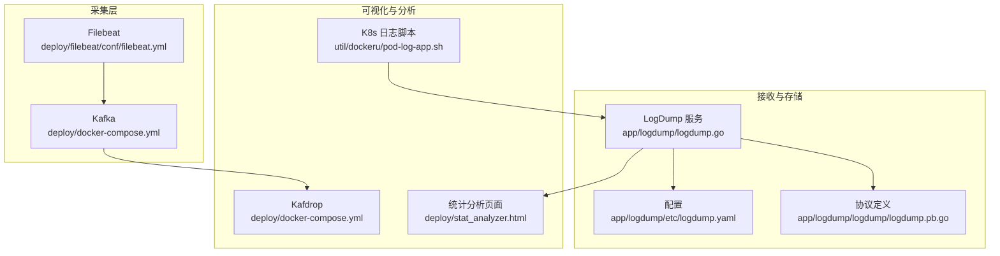
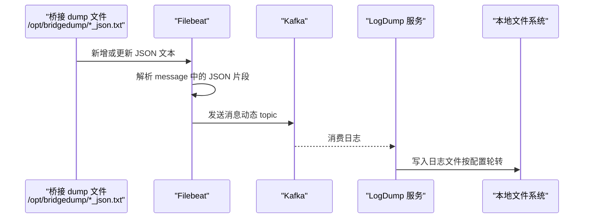
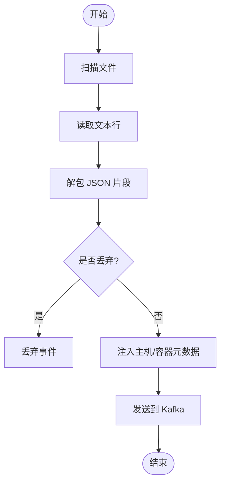
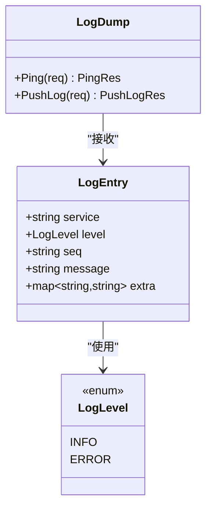
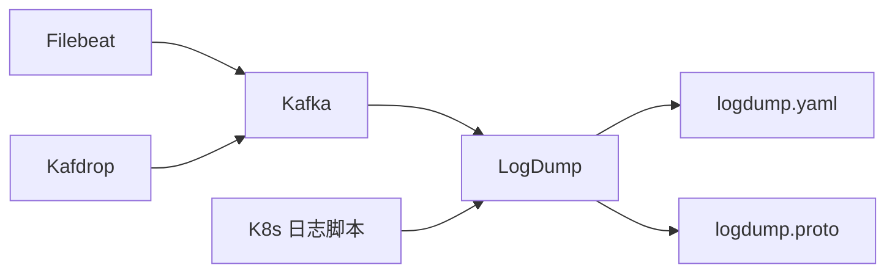

# 日志分析

<cite>
**本文引用的文件**
- [deploy/filebeat/conf/filebeat.yml](file://deploy/filebeat/conf/filebeat.yml)
- [deploy/docker-compose.yml](file://deploy/docker-compose.yml)
- [app/logdump/etc/logdump.yaml](file://app/logdump/etc/logdump.yaml)
- [app/logdump/logdump/logdump.pb.go](file://app/logdump/logdump/logdump.pb.go)
- [app/logdump/logdump/logdump_grpc.pb.go](file://app/logdump/logdump/logdump_grpc.pb.go)
- [app/logdump/logdump.go](file://app/logdump/logdump.go)
- [.trae/skills/zero-skills/best-practices/overview.md](file://.trae/skills/zero-skills/best-practices/overview.md)
- [common/Interceptor/rpcserver/loggerInterceptor.go](file://common/Interceptor/rpcserver/loggerInterceptor.go)
- [common/Interceptor/rpcclient/metadataInterceptor.go](file://common/Interceptor/rpcclient/metadataInterceptor.go)
- [deploy/stat_analyzer.html](file://deploy/stat_analyzer.html)
- [util/dockeru/pod-log-app.sh](file://util/dockeru/pod-log-app.sh)
- [util/dockeru/pod-enter-app.sh](file://util/dockeru/pod-enter-app.sh)
</cite>

## 目录
1. [简介](#简介)
2. [项目结构](#项目结构)
3. [核心组件](#核心组件)
4. [架构总览](#架构总览)
5. [详细组件分析](#详细组件分析)
6. [依赖关系分析](#依赖关系分析)
7. [性能考量](#性能考量)
8. [故障排除指南](#故障排除指南)
9. [结论](#结论)
10. [附录](#附录)

## 简介
本指南面向 zero-service 的日志分析与故障排除，围绕日志采集、传输、存储与可视化进行系统化说明。内容涵盖：
- Filebeat 配置、日志轮转与存储策略
- 日志格式与结构（时间戳、级别、服务名、上下文等）
- 关键字段解读（错误码、堆栈跟踪、性能指标）
- 日志搜索与过滤技巧（关键词、正则、时间范围）
- 常见错误模式识别（重复错误、级联失败、资源耗尽）
- 日志监控与告警（阈值、规则、通知）
- 工具使用（Kibana/ELK、Kafdrop、Kubernetes 日志、自定义分析脚本）

## 项目结构
与日志分析相关的关键位置：
- 日志采集与传输：Filebeat 配置位于 deploy/filebeat/conf/filebeat.yml；Kafka 在 docker-compose.yml 中定义
- 日志接收与存储：logdump 服务负责接收 gRPC 推送的日志并落盘，配置位于 app/logdump/etc/logdump.yaml
- 结构化日志规范与最佳实践：参考 .trae/skills/zero-skills/best-practices/overview.md
- RPC 日志拦截与上下文注入：common/Interceptor/rpcserver/loggerInterceptor.go、common/Interceptor/rpcclient/metadataInterceptor.go
- 自定义分析与可视化：deploy/stat_analyzer.html
- Kubernetes 日志与调试脚本：util/dockeru/pod-log-app.sh、util/dockeru/pod-enter-app.sh

**图表来源**
- [deploy/filebeat/conf/filebeat.yml:1-122](file://deploy/filebeat/conf/filebeat.yml#L1-L122)
- [deploy/docker-compose.yml:1-110](file://deploy/docker-compose.yml#L1-L110)
- [app/logdump/logdump.go:1-71](file://app/logdump/logdump.go#L1-L71)
- [app/logdump/etc/logdump.yaml:1-26](file://app/logdump/etc/logdump.yaml#L1-L26)
- [app/logdump/logdump/logdump.pb.go:318-347](file://app/logdump/logdump/logdump.pb.go#L318-L347)
- [deploy/stat_analyzer.html:862-1253](file://deploy/stat_analyzer.html#L862-L1253)
- [util/dockeru/pod-log-app.sh:1-23](file://util/dockeru/pod-log-app.sh#L1-L23)

**章节来源**
- [deploy/filebeat/conf/filebeat.yml:1-122](file://deploy/filebeat/conf/filebeat.yml#L1-L122)
- [deploy/docker-compose.yml:1-110](file://deploy/docker-compose.yml#L1-L110)
- [app/logdump/etc/logdump.yaml:1-26](file://app/logdump/etc/logdump.yaml#L1-L26)
- [.trae/skills/zero-skills/best-practices/overview.md:214-281](file://.trae/skills/zero-skills/best-practices/overview.md#L214-L281)

## 核心组件
- Filebeat：从桥接 dump 目录读取 JSON 文本，解析包裹的 JSON 片段，按 topic 发送到 Kafka
- Kafka：作为消息中间件承载日志流
- LogDump 服务：接收 gRPC 推送的日志，写入本地文件，支持额外字段透传
- 结构化日志：统一采用 JSON/Plain 编码，包含服务名、级别、序列号、消息与额外上下文
- RPC 拦截器：在服务端捕获错误并在客户端注入上下文头（如用户、授权、追踪 ID）

**章节来源**
- [deploy/filebeat/conf/filebeat.yml:4-72](file://deploy/filebeat/conf/filebeat.yml#L4-L72)
- [deploy/docker-compose.yml:5-30](file://deploy/docker-compose.yml#L5-L30)
- [app/logdump/etc/logdump.yaml:7-26](file://app/logdump/etc/logdump.yaml#L7-L26)
- [app/logdump/logdump/logdump.pb.go:318-347](file://app/logdump/logdump/logdump.pb.go#L318-L347)
- [common/Interceptor/rpcserver/loggerInterceptor.go:12-44](file://common/Interceptor/rpcserver/loggerInterceptor.go#L12-L44)
- [common/Interceptor/rpcclient/metadataInterceptor.go:11-32](file://common/Interceptor/rpcclient/metadataInterceptor.go#L11-L32)

## 架构总览
下图展示从文件到 Kafka，再到 LogDump 存储与可视化的完整链路。

**图表来源**
- [deploy/filebeat/conf/filebeat.yml:8-105](file://deploy/filebeat/conf/filebeat.yml#L8-L105)
- [deploy/docker-compose.yml:32-53](file://deploy/docker-compose.yml#L32-L53)
- [app/logdump/etc/logdump.yaml:7-26](file://app/logdump/etc/logdump.yaml#L7-L26)

## 详细组件分析

### Filebeat 配置与日志轮转
- 输入源：监听多个桥接 dump 目录，读取 *_json.txt 文本
- 解析流程：使用解包 tokenizer 提取包裹的 JSON 片段，再解析为结构化字段
- 主机与容器元数据：自动注入主机、云、Docker 元信息
- 过滤与清洗：丢弃解析失败事件与特定前缀行
- 输出：发送至 Kafka，topic 由输入字段动态决定
- 轮转与清理：通过 close_inactive、ignore_older、clean_inactive 控制文件生命周期

**图表来源**
- [deploy/filebeat/conf/filebeat.yml:86-105](file://deploy/filebeat/conf/filebeat.yml#L86-L105)

**章节来源**
- [deploy/filebeat/conf/filebeat.yml:4-122](file://deploy/filebeat/conf/filebeat.yml#L4-L122)

### LogDump 服务与日志存储
- gRPC 接口：提供 Ping 与 PushLog，消息体包含服务名、级别、序列号、消息与额外字段映射
- 配置项：编码、输出路径、日志级别、保留天数、额外字段白名单
- 启动流程：加载配置、注册服务、注册拦截器、可选注册到 Nacos
- 日志落盘：根据配置进行轮转与压缩

**图表来源**
- [app/logdump/logdump/logdump.pb.go:318-347](file://app/logdump/logdump/logdump.pb.go#L318-L347)

**章节来源**
- [app/logdump/etc/logdump.yaml:7-26](file://app/logdump/etc/logdump.yaml#L7-L26)
- [app/logdump/logdump.go:38-66](file://app/logdump/logdump.go#L38-L66)
- [app/logdump/logdump/logdump.pb.go:318-347](file://app/logdump/logdump/logdump.pb.go#L318-L347)
- [app/logdump/logdump/logdump_grpc.pb.go:143-161](file://app/logdump/logdump/logdump_grpc.pb.go#L143-L161)

### 结构化日志与上下文
- 结构化日志：建议使用 JSON/Plain 编码，避免敏感信息泄露，控制日志密度
- 上下文字段：用户 ID、用户名、部门代码、授权令牌、追踪 ID 等通过 gRPC 元数据传递
- 错误拦截：服务端拦截器在发生错误时统一记录，便于全局定位问题

**章节来源**
- [.trae/skills/zero-skills/best-practices/overview.md:214-281](file://.trae/skills/zero-skills/best-practices/overview.md#L214-L281)
- [common/Interceptor/rpcserver/loggerInterceptor.go:12-44](file://common/Interceptor/rpcserver/loggerInterceptor.go#L12-L44)
- [common/Interceptor/rpcclient/metadataInterceptor.go:11-32](file://common/Interceptor/rpcclient/metadataInterceptor.go#L11-L32)

### 自定义分析与可视化
- 统计分析页面：解析包含系统指标与性能指标的日志片段，计算平均内存、总丢弃、响应时间分位等
- Kafka 可视化：Kafdrop 提供 Web 界面查看主题与消息
- Kubernetes 日志：提供一键查看 Pod 最近日志的脚本

**章节来源**
- [deploy/stat_analyzer.html:862-1253](file://deploy/stat_analyzer.html#L862-L1253)
- [deploy/docker-compose.yml:101-109](file://deploy/docker-compose.yml#L101-L109)
- [util/dockeru/pod-log-app.sh:1-23](file://util/dockeru/pod-log-app.sh#L1-L23)

## 依赖关系分析
- Filebeat 依赖 Kafka 集群；LogDump 依赖 Kafka 消费；Kafdrop 依赖 Kafka
- LogDump 服务依赖配置文件与协议定义
- RPC 拦截器贯穿客户端与服务端，确保上下文一致与错误统一记录

**图表来源**
- [deploy/filebeat/conf/filebeat.yml:110-119](file://deploy/filebeat/conf/filebeat.yml#L110-L119)
- [deploy/docker-compose.yml:5-30](file://deploy/docker-compose.yml#L5-L30)
- [app/logdump/etc/logdump.yaml:1-26](file://app/logdump/etc/logdump.yaml#L1-L26)
- [app/logdump/logdump/logdump.pb.go:318-347](file://app/logdump/logdump/logdump.pb.go#L318-L347)

**章节来源**
- [deploy/docker-compose.yml:1-110](file://deploy/docker-compose.yml#L1-L110)
- [app/logdump/logdump.go:38-66](file://app/logdump/logdump.go#L38-L66)

## 性能考量
- Filebeat 扫描频率与文件关闭时间：平衡实时性与 IO 开销
- Kafka 生产者参数：压缩、消息大小限制、ack 策略影响吞吐与可靠性
- LogDump 落盘策略：合理设置保留天数与轮转，避免磁盘压力
- 自定义分析页面：对大量日志进行聚合计算时注意前端渲染性能

[本节为通用指导，不直接分析具体文件]

## 故障排除指南

### 一、日志收集与存储配置
- Filebeat 无法读取新文件
  - 检查 paths 是否正确映射到宿主机目录
  - 确认容器挂载权限与路径一致性
  - 查看日志等级与选择器以获取更详细输出
  - 参考：[deploy/filebeat/conf/filebeat.yml:8-26](file://deploy/filebeat/conf/filebeat.yml#L8-L26)
- Filebeat 解析失败
  - 确认 message 中包裹的 JSON 片段格式正确
  - 检查解包 tokenizer 与 JSON 字段解析处理器
  - 参考：[deploy/filebeat/conf/filebeat.yml:94-105](file://deploy/filebeat/conf/filebeat.yml#L94-L105)
- LogDump 无法写入或轮转异常
  - 检查日志路径、编码、级别与保留天数
  - 确认磁盘空间与权限
  - 参考：[app/logdump/etc/logdump.yaml:7-26](file://app/logdump/etc/logdump.yaml#L7-L26)

**章节来源**
- [deploy/filebeat/conf/filebeat.yml:8-26](file://deploy/filebeat/conf/filebeat.yml#L8-L26)
- [deploy/filebeat/conf/filebeat.yml:94-105](file://deploy/filebeat/conf/filebeat.yml#L94-L105)
- [app/logdump/etc/logdump.yaml:7-26](file://app/logdump/etc/logdump.yaml#L7-L26)

### 二、日志格式与字段理解
- 时间戳：由采集端注入，通常为标准时间格式
- 日志级别：INFO/ERROR 等枚举值，用于快速过滤
- 服务名：标识产生日志的服务实例
- 序列号：用于顺序与去重
- 消息体：结构化 JSON，包含业务上下文
- 额外字段：如订单号、用户 ID、任务 ID、错误码等
- 参考协议定义：[app/logdump/logdump/logdump.pb.go:318-347](file://app/logdump/logdump/logdump.pb.go#L318-L347)

**章节来源**
- [app/logdump/logdump/logdump.pb.go:318-347](file://app/logdump/logdump/logdump.pb.go#L318-L347)

### 三、关键字段解读与分析
- 错误码：来自额外字段白名单，便于按业务维度聚合
- 堆栈跟踪：建议在客户端/服务端拦截器中统一记录，避免散落在不同日志
- 性能指标：CPU、内存、GC 次数、QPS、丢弃数、响应时间分位等
  - 参考：[deploy/stat_analyzer.html:862-1253](file://deploy/stat_analyzer.html#L862-L1253)

**章节来源**
- [deploy/stat_analyzer.html:862-1253](file://deploy/stat_analyzer.html#L862-L1253)
- [app/logdump/etc/logdump.yaml:21-26](file://app/logdump/etc/logdump.yaml#L21-L26)

### 四、日志搜索与过滤技巧
- 关键词搜索：在 Kibana/Kafdrop 中按服务名、消息体关键字检索
- 正则表达式：用于提取复杂字段（如 app 名称、错误码）
- 时间范围筛选：结合采集端时间戳进行区间过滤
- 参考实现：[deploy/stat_analyzer.html:862-1253](file://deploy/stat_analyzer.html#L862-L1253)

**章节来源**
- [deploy/stat_analyzer.html:862-1253](file://deploy/stat_analyzer.html#L862-L1253)

### 五、常见错误模式识别
- 重复错误：同一错误在短时间内高频出现，优先检查重试与幂等设计
- 级联失败：上游错误导致下游批量失败，需关注熔断与降级
- 资源耗尽：CPU/内存/GC 异常升高，结合自定义分析页面定位热点
- 参考：[deploy/stat_analyzer.html:1033-1253](file://deploy/stat_analyzer.html#L1033-L1253)

**章节来源**
- [deploy/stat_analyzer.html:1033-1253](file://deploy/stat_analyzer.html#L1033-L1253)

### 六、日志监控与告警
- 阈值设置：基于 QPS、丢弃数、响应时间分位、内存与 GC 次数
- 告警规则：针对错误码分布、异常波动、资源上限触发
- 通知机制：集成企业微信/钉钉/邮件（可在现有服务基础上扩展）
- 参考：[deploy/stat_analyzer.html:1033-1253](file://deploy/stat_analyzer.html#L1033-L1253)

**章节来源**
- [deploy/stat_analyzer.html:1033-1253](file://deploy/stat_analyzer.html#L1033-L1253)

### 七、工具使用
- Kibana/ELK：用于全文检索、聚合分析与仪表盘
- Kafdrop：Web 查看 Kafka 主题与消息，便于快速验证采集链路
- Kubernetes 日志：使用脚本快速查看 Pod 最近日志
  - 参考：[util/dockeru/pod-log-app.sh:1-23](file://util/dockeru/pod-log-app.sh#L1-L23)
- 自定义分析脚本：HTML 页面解析并统计系统与性能指标
  - 参考：[deploy/stat_analyzer.html:862-1253](file://deploy/stat_analyzer.html#L862-L1253)

**章节来源**
- [deploy/docker-compose.yml:101-109](file://deploy/docker-compose.yml#L101-L109)
- [util/dockeru/pod-log-app.sh:1-23](file://util/dockeru/pod-log-app.sh#L1-L23)
- [deploy/stat_analyzer.html:862-1253](file://deploy/stat_analyzer.html#L862-L1253)

## 结论
通过 Filebeat + Kafka + LogDump 的组合，zero-service 实现了从桥接 dump 到结构化日志的可靠采集与存储。配合 Kafdrop、Kibana 与自定义分析页面，可高效完成日志检索、性能分析与告警联动。建议持续完善上下文字段与错误拦截策略，提升问题定位效率与稳定性。

[本节为总结性内容，不直接分析具体文件]

## 附录

### A. Filebeat 关键配置要点
- 输入路径与扫描频率
- 多行合并与解包解析
- 主机/容器元数据注入
- 输出到 Kafka 的 topic 动态选择
- 参考：[deploy/filebeat/conf/filebeat.yml:4-122](file://deploy/filebeat/conf/filebeat.yml#L4-L122)

**章节来源**
- [deploy/filebeat/conf/filebeat.yml:4-122](file://deploy/filebeat/conf/filebeat.yml#L4-L122)

### B. LogDump 配置要点
- 编码、输出路径、日志级别、保留天数
- 额外字段白名单
- 参考：[app/logdump/etc/logdump.yaml:7-26](file://app/logdump/etc/logdump.yaml#L7-L26)

**章节来源**
- [app/logdump/etc/logdump.yaml:7-26](file://app/logdump/etc/logdump.yaml#L7-L26)

### C. RPC 日志与上下文
- 服务端错误拦截
- 客户端元数据注入（用户、授权、追踪 ID）
- 参考：
  - [common/Interceptor/rpcserver/loggerInterceptor.go:12-44](file://common/Interceptor/rpcserver/loggerInterceptor.go#L12-L44)
  - [common/Interceptor/rpcclient/metadataInterceptor.go:11-32](file://common/Interceptor/rpcclient/metadataInterceptor.go#L11-L32)

**章节来源**
- [common/Interceptor/rpcserver/loggerInterceptor.go:12-44](file://common/Interceptor/rpcserver/loggerInterceptor.go#L12-L44)
- [common/Interceptor/rpcclient/metadataInterceptor.go:11-32](file://common/Interceptor/rpcclient/metadataInterceptor.go#L11-L32)