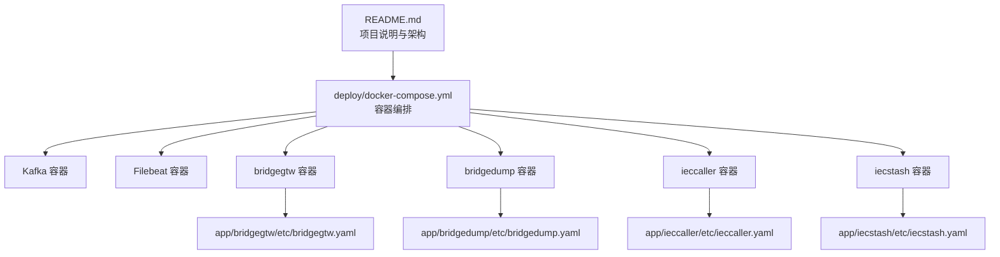
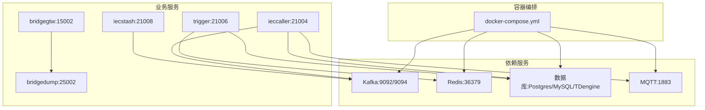
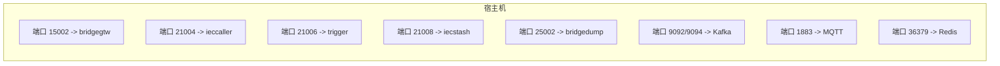

# 服务启动问题

<cite>
**本文引用的文件**   
- [README.md](file://README.md)
- [go.mod](file://go.mod)
- [deploy/docker-compose.yml](file://deploy/docker-compose.yml)
- [util/manage.sh](file://util/manage.sh)
- [util/main.go](file://util/main.go)
- [app/trigger/etc/trigger.yaml](file://app/trigger/etc/trigger.yaml)
- [app/bridgegtw/etc/bridgegtw.yaml](file://app/bridgegtw/etc/bridgegtw.yaml)
- [app/bridgedump/etc/bridgedump.yaml](file://app/bridgedump/etc/bridgedump.yaml)
- [app/ieccaller/etc/ieccaller.yaml](file://app/ieccaller/etc/ieccaller.yaml)
- [app/iecstash/etc/iecstash.yaml](file://app/iecstash/etc/iecstash.yaml)
</cite>

## 目录
1. [简介](#简介)
2. [项目结构](#项目结构)
3. [核心组件](#核心组件)
4. [架构总览](#架构总览)
5. [详细组件分析](#详细组件分析)
6. [依赖分析](#依赖分析)
7. [性能考虑](#性能考虑)
8. [故障排除指南](#故障排除指南)
9. [结论](#结论)
10. [附录](#附录)

## 简介
本指南聚焦 zero-service 在本地或容器环境中“服务无法启动”的常见问题与系统化排查方法。内容覆盖：
- 配置文件错误检查（YAML 语法与参数有效性）
- 依赖服务验证（Kafka、Redis、数据库、MQTT 等）
- 端口冲突检测与常用端口（如 8080、9090、15002、21004/6/8/9、25002 等）的冲突处理
- 环境变量与容器编排（Docker Compose）问题定位
- 健康检查与监控指标解读，辅助快速定位启动失败的根本原因

## 项目结构
- 服务以“微服务”形式组织在 app/ 下，每个服务包含 etc/ 配置、internal/ 逻辑与 server/ 入口等。
- 顶层 README 提供了整体架构、技术栈与启动方式概览。
- deploy/docker-compose.yml 定义了 Kafka、Filebeat、以及多个业务服务的容器编排与网络模式。

图表来源
- [README.md:15-51](file://README.md#L15-L51)
- [deploy/docker-compose.yml:54-109](file://deploy/docker-compose.yml#L54-L109)

章节来源
- [README.md:15-51](file://README.md#L15-L51)
- [deploy/docker-compose.yml:1-110](file://deploy/docker-compose.yml#L1-110)

## 核心组件
- 触发服务（trigger）：负责异步任务调度与计划任务管理，依赖 Redis 与数据库。
- 网关服务（bridgegtw）：HTTP + gRPC 网关，将上游请求映射到下游 gRPC 服务。
- 桥接服务（bridgedump）：提供 gRPC 接口，监听固定端口。
- IEC 主站（ieccaller）：IEC 104 主站，依赖 Kafka、MQTT、数据库。
- IEC 合并（iecstash）：Kafka 消费者，将数据转发至流事件服务。

章节来源
- [app/trigger/etc/trigger.yaml:1-38](file://app/trigger/etc/trigger.yaml#L1-L38)
- [app/bridgegtw/etc/bridgegtw.yaml:1-40](file://app/bridgegtw/etc/bridgegtw.yaml#L1-L40)
- [app/bridgedump/etc/bridgedump.yaml:1-10](file://app/bridgedump/etc/bridgedump.yaml#L1-L10)
- [app/ieccaller/etc/ieccaller.yaml:1-79](file://app/ieccaller/etc/ieccaller.yaml#L1-L79)
- [app/iecstash/etc/iecstash.yaml:1-46](file://app/iecstash/etc/iecstash.yaml#L1-L46)

## 架构总览
下图展示与启动相关的组件与依赖关系，便于定位启动失败的根因。

图表来源
- [deploy/docker-compose.yml:5-30](file://deploy/docker-compose.yml#L5-L30)
- [app/trigger/etc/trigger.yaml:19-29](file://app/trigger/etc/trigger.yaml#L19-L29)
- [app/bridgegtw/etc/bridgegtw.yaml:25-28](file://app/bridgegtw/etc/bridgegtw.yaml#L25-L28)
- [app/bridgedump/etc/bridgedump.yaml:2](file://app/bridgedump/etc/bridgedump.yaml#L2)
- [app/ieccaller/etc/ieccaller.yaml:35-57](file://app/ieccaller/etc/ieccaller.yaml#L35-L57)
- [app/iecstash/etc/iecstash.yaml:18-35](file://app/iecstash/etc/iecstash.yaml#L18-L35)

## 详细组件分析

### 触发服务（trigger）
- 监听端口：21006
- 依赖：Redis（36379）、数据库（Postgres 示例）
- 关键配置项：日志、超时、Nacos 注册开关、Redis 连接、数据库连接串、流事件 gRPC 地址

章节来源
- [app/trigger/etc/trigger.yaml:1-38](file://app/trigger/etc/trigger.yaml#L1-L38)

### 网关服务（bridgegtw）
- 监听端口：15002
- 依赖：下游 gRPC 服务（如 bridgedump:25002）
- 关键配置项：上游 gRPC 端点、Proto 映射、超时

章节来源
- [app/bridgegtw/etc/bridgegtw.yaml:1-40](file://app/bridgegtw/etc/bridgegtw.yaml#L1-L40)

### 桥接服务（bridgedump）
- 监听端口：25002
- 关键配置项：日志、监听地址、文件转储路径

章节来源
- [app/bridgedump/etc/bridgedump.yaml:1-10](file://app/bridgedump/etc/bridgedump.yaml#L1-L10)

### IEC 主站（ieccaller）
- 监听端口：21004
- 依赖：Kafka（9094）、MQTT（1883）、数据库（可选）
- 关键配置项：IEC 从站、Kafka Topic、MQTT Topic、推送批大小、优雅退出宽限期

章节来源
- [app/ieccaller/etc/ieccaller.yaml:1-79](file://app/ieccaller/etc/ieccaller.yaml#L1-L79)

### IEC 合并（iecstash）
- 监听端口：21008
- 依赖：Kafka（9094）
- 关键配置项：Kafka 消费组、并发消费者、批大小、优雅退出宽限期

章节来源
- [app/iecstash/etc/iecstash.yaml:1-46](file://app/iecstash/etc/iecstash.yaml#L1-L46)

## 依赖分析
- 容器编排依赖
  - Kafka：容器暴露 9092/9094，Filebeat 依赖其日志采集；IEC 主站与合并服务均依赖 Kafka。
  - Redis：触发服务使用 36379。
  - MQTT：IEC 主站配置了本地 1883。
  - 数据库：触发服务示例使用 Postgres。
- 网络模式
  - 多个服务采用 host 网络模式，端口直接映射到宿主机，便于调试但易引发端口冲突。

图表来源
- [deploy/docker-compose.yml:54-109](file://deploy/docker-compose.yml#L54-L109)
- [app/bridgegtw/etc/bridgegtw.yaml:2](file://app/bridgegtw/etc/bridgegtw.yaml#L2)
- [app/bridgedump/etc/bridgedump.yaml:2](file://app/bridgedump/etc/bridgedump.yaml#L2)
- [app/ieccaller/etc/ieccaller.yaml:2,35-40](file://app/ieccaller/etc/ieccaller.yaml#L2,L35-L40)
- [app/trigger/etc/trigger.yaml:19-21](file://app/trigger/etc/trigger.yaml#L19-L21)

章节来源
- [deploy/docker-compose.yml:54-109](file://deploy/docker-compose.yml#L54-L109)

## 性能考虑
- Kafka 并发与批大小：合理设置 Conns/Consumers/Processors 与 MinBytes/MaxBytes，避免 IO 与网络瓶颈。
- Redis 连接池与超时：确保连接复用与合理的超时策略，避免阻塞。
- gRPC 超时与优雅退出：GracePeriod 与 Timeout 需结合下游服务能力调整。
- 宿主机直连（host 网络）：便于调试，但需严格避免端口冲突。

## 故障排除指南

### 一、配置文件错误检查（YAML 语法与参数有效性）
- YAML 语法
  - 使用在线 YAML 校验工具或编辑器插件进行语法检查，确保缩进与冒号正确。
  - 常见问题：混合缩进、非法字符、类型不匹配。
- 参数有效性
  - 端口范围：0–65535，避免与已占用端口冲突。
  - 数据库连接串：检查主机、端口、用户名、密码、数据库名、时区参数是否正确。
  - Redis 连接：确认 Host、Type、Key、Pass、DB Index。
  - Kafka/MQTT 地址：确保 Broker/Host/Port 可达且认证信息正确。
  - gRPC 地址：下游服务监听地址与端口一致。
- 逐项对照
  - 触发服务：参考 [app/trigger/etc/trigger.yaml:1-38](file://app/trigger/etc/trigger.yaml#L1-L38)
  - 网关服务：参考 [app/bridgegtw/etc/bridgegtw.yaml:1-40](file://app/bridgegtw/etc/bridgegtw.yaml#L1-L40)
  - 桥接服务：参考 [app/bridgedump/etc/bridgedump.yaml:1-10](file://app/bridgedump/etc/bridgedump.yaml#L1-L10)
  - IEC 主站：参考 [app/ieccaller/etc/ieccaller.yaml:1-79](file://app/ieccaller/etc/ieccaller.yaml#L1-L79)
  - IEC 合并：参考 [app/iecstash/etc/iecstash.yaml:1-46](file://app/iecstash/etc/iecstash.yaml#L1-L46)

章节来源
- [app/trigger/etc/trigger.yaml:1-38](file://app/trigger/etc/trigger.yaml#L1-L38)
- [app/bridgegtw/etc/bridgegtw.yaml:1-40](file://app/bridgegtw/etc/bridgegtw.yaml#L1-L40)
- [app/bridgedump/etc/bridgedump.yaml:1-10](file://app/bridgedump/etc/bridgedump.yaml#L1-L10)
- [app/ieccaller/etc/ieccaller.yaml:1-79](file://app/ieccaller/etc/ieccaller.yaml#L1-L79)
- [app/iecstash/etc/iecstash.yaml:1-46](file://app/iecstash/etc/iecstash.yaml#L1-L46)

### 二、依赖服务验证
- Kafka
  - 端口：9092/9094（容器映射），确认宿主机可达。
  - 命令示例：查看 Kafka 容器状态与日志。
  - 端口占用：若宿主机已有 Kafka，需变更容器映射或停止冲突进程。
- Redis
  - 端口：36379（容器映射），确认连接串 Host:Port 正确。
- 数据库
  - 触发服务示例使用 Postgres，确认连接串中的主机、端口、库名、用户、密码与时区。
- MQTT
  - 端口：1883，IEC 主站配置了本地 Broker，确认服务可用。
- 容器编排
  - 使用 docker-compose 查看服务状态与日志，定位依赖缺失或启动顺序问题。

章节来源
- [deploy/docker-compose.yml:5-30](file://deploy/docker-compose.yml#L5-L30)
- [app/trigger/etc/trigger.yaml:25-29](file://app/trigger/etc/trigger.yaml#L25-L29)
- [app/ieccaller/etc/ieccaller.yaml:35-57](file://app/ieccaller/etc/ieccaller.yaml#L35-L57)

### 三、端口冲突检测与解决
- 常见冲突端口
  - 8080：Web 控制台或应用常用端口，优先检查宿主机占用。
  - 9090：Prometheus/Grafana 常用端口，注意与 Kafka UI（Kafdrop）端口区分。
  - 9092/9094：Kafka 容器端口，若宿主机占用需修改映射或释放。
  - 15002：bridgegtw 监听端口，host 网络模式下直接映射宿主机。
  - 21004/6/8/9：IEC 与触发服务端口，host 网络模式下直接映射宿主机。
  - 25002：bridgedump 监听端口。
  - 36379：Redis 容器端口。
  - 1883：MQTT 容器端口。
- 检测命令（Linux/macOS）
  - 查看占用：lsof -i :<端口号> 或 netstat -tulpn | grep :<端口号>
  - 结束占用进程：kill -9 <PID>
- 解决方案
  - 修改 docker-compose.yml 中 ports 映射，避免与宿主机冲突。
  - 若必须使用相同端口，请停止宿主机占用服务或调整其端口。
  - host 网络模式下，同一宿主机上仅允许一个服务绑定相同端口。

章节来源
- [deploy/docker-compose.yml:54-109](file://deploy/docker-compose.yml#L54-L109)
- [app/bridgegtw/etc/bridgegtw.yaml:2](file://app/bridgegtw/etc/bridgegtw.yaml#L2)
- [app/bridgedump/etc/bridgedump.yaml:2](file://app/bridgedump/etc/bridgedump.yaml#L2)
- [app/ieccaller/etc/ieccaller.yaml:2](file://app/ieccaller/etc/ieccaller.yaml#L2)
- [app/trigger/etc/trigger.yaml:2](file://app/trigger/etc/trigger.yaml#L2)
- [app/iecstash/etc/iecstash.yaml:2](file://app/iecstash/etc/iecstash.yaml#L2)

### 四、Docker 容器启动失败排查
- 镜像拉取
  - 确认镜像名称与标签正确，网络可访问仓库。
  - 使用 docker images 查看是否存在镜像，必要时手动 docker pull。
- 卷挂载
  - 检查宿主机路径是否存在且权限足够，如 /home/root/app/etc、/home/root/bridgedump/ 等。
- 网络配置
  - host 网络模式下，端口冲突是常见原因；若非必需，可改为自定义网络并显式映射端口。
- 健康检查与日志
  - docker compose ps -a 查看容器状态与退出原因。
  - docker compose logs -f -n 500 <服务名> 查看最近日志。
- 一键操作脚本
  - util/manage.sh：支持 restart/up/stop/start 与服务选择。
  - util/main.go：远程管理工具，支持 SSH 登录、日志查看、进入容器、镜像保存等。

章节来源
- [deploy/docker-compose.yml:54-109](file://deploy/docker-compose.yml#L54-L109)
- [util/manage.sh:1-35](file://util/manage.sh#L1-L35)
- [util/main.go:353-401](file://util/main.go#L353-L401)

### 五、服务健康检查与监控指标
- 健康检查
  - gRPC 健康探针：使用 grpcurl 或服务内置健康接口（如存在）。
  - HTTP 健康端点：若服务提供 /health 或 /ready，可通过 curl 访问。
- 监控指标
  - Prometheus 指标：确认服务导出指标端口与抓取配置。
  - 日志指标：结合 Filebeat 将容器日志输出到集中式日志系统。
- 常见异常信号
  - “listen tcp x.x.x.x:y: bind: address already in use” → 端口冲突。
  - “connection refused” → 依赖服务未启动或网络不通。
  - “invalid connection string” → 数据库连接串格式错误。
  - “no such host” → DNS 或主机名解析失败。

章节来源
- [README.md:226-252](file://README.md#L226-L252)

## 结论
- 启动失败通常由“配置错误、依赖未就绪、端口冲突、容器编排问题”四类原因导致。
- 建议按“配置校验 → 依赖验证 → 端口排查 → 容器日志”的顺序逐步定位。
- 利用 docker-compose 与工具脚本（manage.sh、main.go）可显著提升排查效率。

## 附录

### A. 常用命令速查
- 启动/停止/重启
  - docker compose up -d / stop / restart
- 查看状态与日志
  - docker compose ps -a
  - docker compose logs -f -n 500 <服务名>
- 远程管理（SSH）
  - sshpass + ssh 执行 docker compose 命令
- 端口占用检查
  - lsof -i :<端口> 或 netstat -tulpn | grep :<端口>

章节来源
- [util/manage.sh:1-35](file://util/manage.sh#L1-L35)
- [util/main.go:224-241](file://util/main.go#L224-L241)