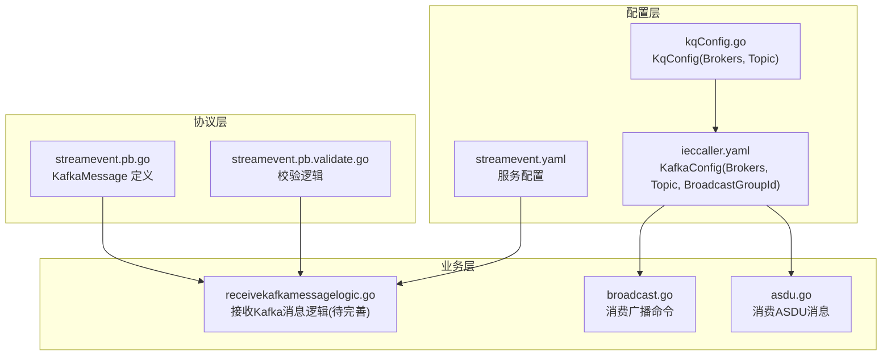
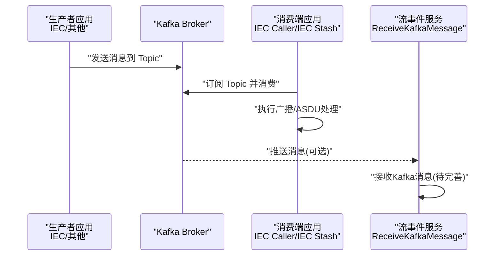
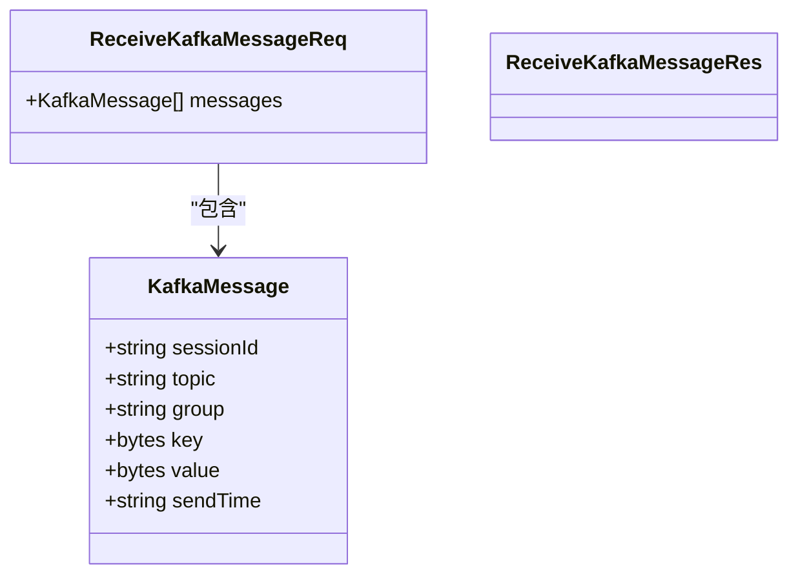
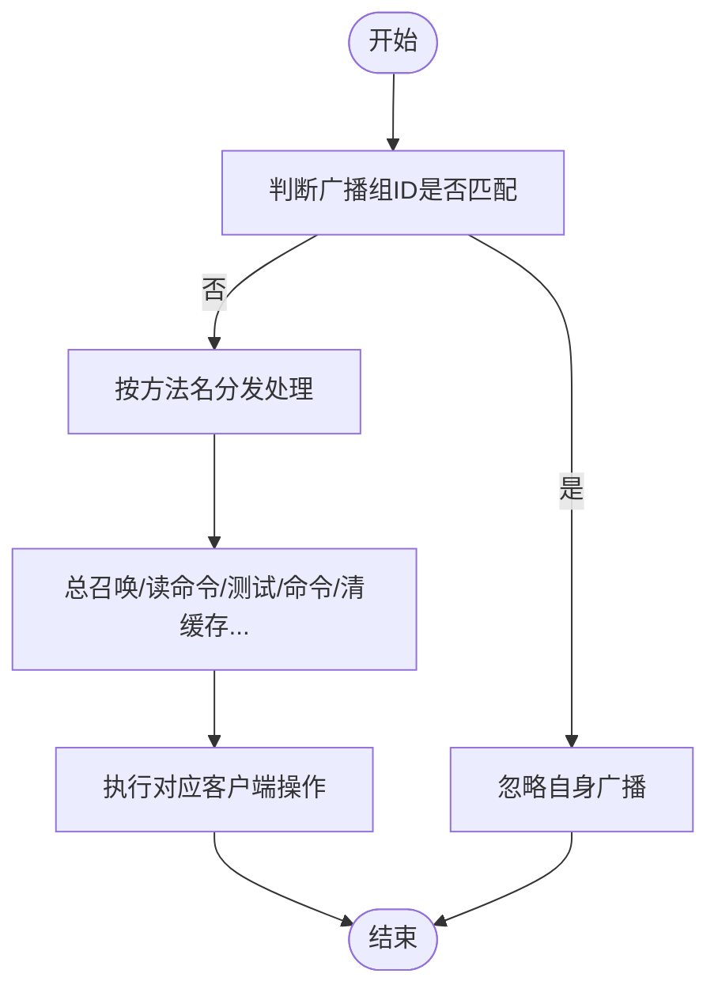
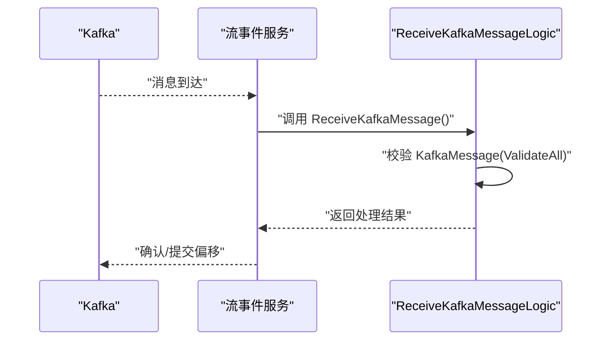
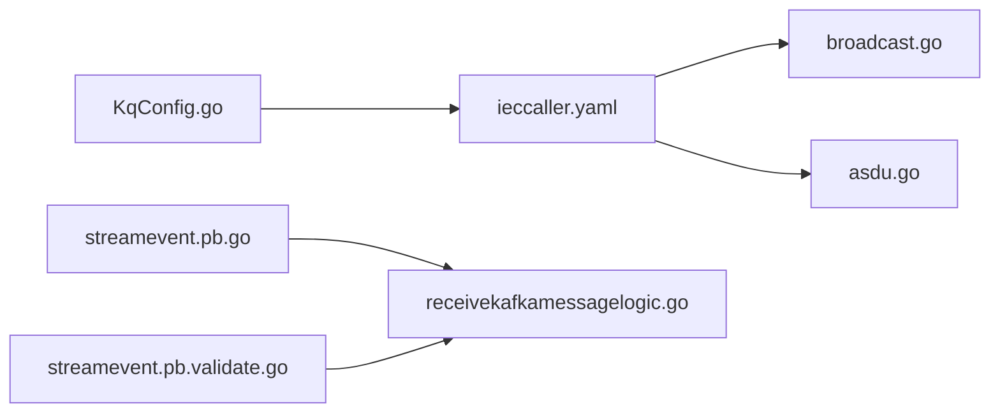

# Kafka 消息队列问题

<cite>
**本文引用的文件**
- [receivekafkamessagelogic.go](file://facade/streamevent/internal/logic/receivekafkamessagelogic.go)
- [streamevent.pb.go](file://facade/streamevent/streamevent/streamevent.pb.go)
- [streamevent.pb.validate.go](file://facade/streamevent/streamevent/streamevent.pb.validate.go)
- [kqConfig.go](file://common/configx/kqConfig.go)
- [streamevent.yaml](file://facade/streamevent/etc/streamevent.yaml)
- [ieccaller.yaml](file://app/ieccaller/etc/ieccaller.yaml)
- [broadcast.go](file://app/ieccaller/kafka/broadcast.go)
- [asdu.go](file://app/iecstash/kafka/asdu.go)
</cite>

## 目录
1. [简介](#简介)
2. [项目结构](#项目结构)
3. [核心组件](#核心组件)
4. [架构总览](#架构总览)
5. [详细组件分析](#详细组件分析)
6. [依赖分析](#依赖分析)
7. [性能考虑](#性能考虑)
8. [故障排除指南](#故障排除指南)
9. [结论](#结论)
10. [附录](#附录)

## 简介
本指南聚焦于 Kafka 消息队列在本仓库中的使用与问题排查，覆盖以下关键场景：
- 集群状态检查：Broker 连接状态、主题分区分布、副本同步状态
- 消费者组管理：偏移量检查、再平衡诊断、消费者 lag 监控
- 分区分配异常：重新分配、ISR 副本检查、磁盘空间监控
- 消息积压诊断：消费速率分析、批处理大小优化、背压处理
- 生产者发送失败：网络连接、分区选择策略、压缩配置
- Kafka 配置参数调优：日志保留、清理策略、性能优化参数

本仓库中与 Kafka 直接相关的关键模块包括：
- IEC 侧应用通过配置文件声明 Kafka Broker 列表与 Topic，并在运行时消费/广播命令
- 流事件服务定义了用于接收 Kafka 消息的协议结构（KafkaMessage），但当前逻辑尚未实现具体消费处理
- 配置层提供通用的 Broker/Topic 结构体，便于跨模块复用

## 项目结构
与 Kafka 相关的文件主要分布在以下位置：
- 应用配置：app/*/etc/*.yaml（包含 KafkaConfig/Brokers/Topic 等）
- 协议定义：facade/streamevent/streamevent.proto（生成的 pb.go/pb.validate.go）
- 业务逻辑：facade/streamevent/internal/logic/receivekafkamessagelogic.go
- 通用配置模型：common/configx/kqConfig.go
- IEC 广播与消费示例：app/ieccaller/kafka/broadcast.go、app/iecstash/kafka/asdu.go

**图表来源**
- [kqConfig.go:1-7](file://common/configx/kqConfig.go#L1-L7)
- [ieccaller.yaml:35-41](file://app/ieccaller/etc/ieccaller.yaml#L35-L41)
- [streamevent.yaml:1-28](file://facade/streamevent/etc/streamevent.yaml#L1-L28)
- [streamevent.pb.go:435-470](file://facade/streamevent/streamevent/streamevent.pb.go#L435-L470)
- [streamevent.pb.validate.go:606-892](file://facade/streamevent/streamevent/streamevent.pb.validate.go#L606-L892)
- [receivekafkamessagelogic.go:1-32](file://facade/streamevent/internal/logic/receivekafkamessagelogic.go#L1-L32)
- [broadcast.go:1-149](file://app/ieccaller/kafka/broadcast.go#L1-L149)
- [asdu.go:1-25](file://app/iecstash/kafka/asdu.go#L1-L25)

**章节来源**
- [kqConfig.go:1-7](file://common/configx/kqConfig.go#L1-L7)
- [ieccaller.yaml:35-41](file://app/ieccaller/etc/ieccaller.yaml#L35-L41)
- [streamevent.yaml:1-28](file://facade/streamevent/etc/streamevent.yaml#L1-L28)
- [streamevent.pb.go:435-470](file://facade/streamevent/streamevent/streamevent.pb.go#L435-L470)
- [streamevent.pb.validate.go:606-892](file://facade/streamevent/streamevent/streamevent.pb.validate.go#L606-L892)
- [receivekafkamessagelogic.go:1-32](file://facade/streamevent/internal/logic/receivekafkamessagelogic.go#L1-L32)
- [broadcast.go:1-149](file://app/ieccaller/kafka/broadcast.go#L1-L149)
- [asdu.go:1-25](file://app/iecstash/kafka/asdu.go#L1-L25)

## 核心组件
- KafkaMessage 协议结构：包含会话标识、主题、消费者组、键、值、发送时间等字段，用于承载从 Kafka 读取的消息内容
- 通用配置模型 KqConfig：统一描述 Broker 列表与 Topic，便于跨模块共享
- IEC 应用配置：ieccaller.yaml 中声明 KafkaConfig.Brokers、Topic、广播 Topic 与广播组 ID，支撑跨节点广播控制命令
- 流事件服务：streamevent.yaml 提供服务监听、日志级别、中间件统计等配置；receivekafkamessagelogic.go 作为接收 Kafka 消息的入口逻辑（当前仅占位）

**章节来源**
- [streamevent.pb.go:435-470](file://facade/streamevent/streamevent/streamevent.pb.go#L435-L470)
- [kqConfig.go:1-7](file://common/configx/kqConfig.go#L1-L7)
- [ieccaller.yaml:35-41](file://app/ieccaller/etc/ieccaller.yaml#L35-L41)
- [streamevent.yaml:1-28](file://facade/streamevent/etc/streamevent.yaml#L1-L28)
- [receivekafkamessagelogic.go:1-32](file://facade/streamevent/internal/logic/receivekafkamessagelogic.go#L1-L32)

## 架构总览
下图展示了 Kafka 在本仓库中的典型交互路径：IEC 应用通过 Kafka 发布/订阅命令，流事件服务接收 Kafka 消息并进行处理。

**图表来源**
- [ieccaller.yaml:35-41](file://app/ieccaller/etc/ieccaller.yaml#L35-L41)
- [broadcast.go:1-149](file://app/ieccaller/kafka/broadcast.go#L1-L149)
- [asdu.go:1-25](file://app/iecstash/kafka/asdu.go#L1-L25)
- [receivekafkamessagelogic.go:1-32](file://facade/streamevent/internal/logic/receivekafkamessagelogic.go#L1-L32)

## 详细组件分析

### 组件一：KafkaMessage 协议与校验
- KafkaMessage 字段包含主题、消费者组、键、值、发送时间等，用于承载消息元信息
- 生成的校验文件提供对嵌入消息的批量校验能力，便于在接收端快速发现格式问题

**图表来源**
- [streamevent.pb.go:392-470](file://facade/streamevent/streamevent/streamevent.pb.go#L392-L470)
- [streamevent.pb.validate.go:606-892](file://facade/streamevent/streamevent/streamevent.pb.validate.go#L606-L892)

**章节来源**
- [streamevent.pb.go:392-470](file://facade/streamevent/streamevent/streamevent.pb.go#L392-L470)
- [streamevent.pb.validate.go:606-892](file://facade/streamevent/streamevent/streamevent.pb.validate.go#L606-L892)

### 组件二：IEC 广播与 ASDU 消费
- 广播消费：根据广播组 ID 过滤自身广播，按方法名分发执行对应命令（如总召唤、读命令、测试命令等）
- ASDU 消费：将收到的 ASDU 内容写入推送器，供后续处理

**图表来源**
- [broadcast.go:24-146](file://app/ieccaller/kafka/broadcast.go#L24-L146)

**章节来源**
- [broadcast.go:1-149](file://app/ieccaller/kafka/broadcast.go#L1-L149)
- [asdu.go:1-25](file://app/iecstash/kafka/asdu.go#L1-L25)

### 组件三：流事件服务接收 Kafka 消息
- 当前逻辑为占位实现，实际消费处理需在此处完善
- 可结合 KafkaMessage 协议与校验逻辑，确保输入消息格式正确

**图表来源**
- [receivekafkamessagelogic.go:27-31](file://facade/streamevent/internal/logic/receivekafkamessagelogic.go#L27-L31)
- [streamevent.pb.validate.go:606-892](file://facade/streamevent/streamevent/streamevent.pb.validate.go#L606-L892)

**章节来源**
- [receivekafkamessagelogic.go:1-32](file://facade/streamevent/internal/logic/receivekafkamessagelogic.go#L1-L32)
- [streamevent.pb.validate.go:606-892](file://facade/streamevent/streamevent/streamevent.pb.validate.go#L606-L892)

## 依赖分析
- 配置依赖：IEC 应用通过 ieccaller.yaml 的 KafkaConfig.Brokers/Topic/BroadcastGroupId 与 Kafka 交互；通用配置模型 KqConfig 为跨模块提供 Broker/Topic 抽象
- 协议依赖：流事件服务通过 KafkaMessage 协议接收消息，validate 文件提供格式校验
- 业务依赖：IEC Caller 广播消费与 ASDU 消费分别处理不同消息类型

**图表来源**
- [kqConfig.go:1-7](file://common/configx/kqConfig.go#L1-L7)
- [ieccaller.yaml:35-41](file://app/ieccaller/etc/ieccaller.yaml#L35-L41)
- [broadcast.go:1-149](file://app/ieccaller/kafka/broadcast.go#L1-L149)
- [asdu.go:1-25](file://app/iecstash/kafka/asdu.go#L1-L25)
- [streamevent.pb.go:435-470](file://facade/streamevent/streamevent/streamevent.pb.go#L435-L470)
- [streamevent.pb.validate.go:606-892](file://facade/streamevent/streamevent/streamevent.pb.validate.go#L606-L892)
- [receivekafkamessagelogic.go:1-32](file://facade/streamevent/internal/logic/receivekafkamessagelogic.go#L1-L32)

**章节来源**
- [kqConfig.go:1-7](file://common/configx/kqConfig.go#L1-L7)
- [ieccaller.yaml:35-41](file://app/ieccaller/etc/ieccaller.yaml#L35-L41)
- [streamevent.pb.go:435-470](file://facade/streamevent/streamevent/streamevent.pb.go#L435-L470)
- [streamevent.pb.validate.go:606-892](file://facade/streamevent/streamevent/streamevent.pb.validate.go#L606-L892)
- [receivekafkamessagelogic.go:1-32](file://facade/streamevent/internal/logic/receivekafkamessagelogic.go#L1-L32)
- [broadcast.go:1-149](file://app/ieccaller/kafka/broadcast.go#L1-L149)
- [asdu.go:1-25](file://app/iecstash/kafka/asdu.go#L1-L25)

## 性能考虑
- 批处理大小：IEC 应用配置中存在 PushAsduChunkBytes（1MB）参数，可用于控制批处理大小以提升吞吐
- 日志与中间件：流事件服务启用了中间件统计与日志级别，有助于定位性能瓶颈
- 资源隔离：IEC Caller 配置了任务并发度，合理设置可避免过载

**章节来源**
- [ieccaller.yaml:77-79](file://app/ieccaller/etc/ieccaller.yaml#L77-L79)
- [streamevent.yaml:11-13](file://facade/streamevent/etc/streamevent.yaml#L11-L13)

## 故障排除指南

### 一、集群状态检查
- Broker 连接状态
  - 检查 IEC 应用配置中的 KafkaConfig.Brokers 是否可达
  - 使用 Kafka 自带工具或运维脚本验证 Broker 端口连通性
- 主题分区分布
  - 使用命令行工具查看主题分区数量与 leader 副本分布
  - 关注是否存在分区不均衡或 leader 不足的情况
- 副本同步状态（ISR）
  - 查看 ISR 列表变化，确认是否有副本落后导致 ISR 缩小
  - 若 ISR 异常，优先恢复落后副本或调整副本数

### 二、消费者组管理问题
- 偏移量检查
  - 使用工具查询消费者组当前位点与高水位差值，识别 lag
  - 对异常 lag 的分区进行逐个核对，定位慢消费者或阻塞点
- 再平衡诊断
  - 观察消费者组频繁再平衡的日志与次数
  - 检查消费者实例数量、会话超时、心跳间隔等参数是否合理
- 消费者 lag 监控
  - 建立 lag 指标监控，结合批处理大小与消费速率评估系统负载
  - 针对热点分区或慢消费者，考虑扩容消费者实例或优化处理逻辑

### 三、分区分配异常
- 分区重新分配
  - 使用 Kafka 分区重分配工具，确保分区均匀分布
  - 重新分配后观察 ISR 与 lag 变化，确认恢复稳定
- ISR 副本检查
  - 持续监控 ISR 列表，避免因磁盘 IO 或网络抖动导致副本掉出 ISR
- 磁盘空间监控
  - 定期检查 Broker 磁盘使用率，预留足够空间以避免分区不可用

### 四、消息积压诊断
- 消费速率分析
  - 对比生产速率与消费速率，计算 lag 增长趋势
  - 识别是否存在突发流量或处理瓶颈
- 批处理大小优化
  - 结合 PushAsduChunkBytes 等参数，适当增大批处理以提高吞吐
  - 同步评估内存占用与延迟目标，避免过度放大导致尾延迟上升
- 背压处理
  - 在上游增加限流或降级策略，保护下游系统
  - 对慢消费者实施隔离或降级，保障整体稳定性

### 五、生产者发送失败
- 网络连接问题
  - 校验 KafkaConfig.Brokers 地址与端口是否正确
  - 检查网络策略、防火墙与 DNS 解析
- 分区选择策略
  - 确认消息键与分区函数是否合理，避免热点分区
  - 必要时采用自定义分区器，均衡分区负载
- 压缩配置
  - 合理启用压缩（如 gzip/snappy/lz4），权衡 CPU 与带宽
  - 避免对已高度压缩的数据再次压缩造成额外开销

### 六、Kafka 配置参数调优
- 日志保留策略
  - 设置合适的保留周期与大小上限，避免磁盘爆满
- 清理策略
  - 启用删除或紧凑（compact）策略，满足业务需求
- 性能优化参数
  - 调整批处理大小、请求超时、压缩类型与副本同步策略
  - 结合实际硬件与业务特征，逐步迭代优化

## 结论
本仓库中 Kafka 的使用围绕 IEC 应用与流事件服务展开，具备清晰的配置抽象与协议结构。针对常见问题，建议从“连接状态—消费者组—分区分配—积压—生产者—配置调优”六个维度系统排查，并结合现有配置与协议结构进行针对性优化。后续可在流事件服务中完善 Kafka 消息接收逻辑，以更好地支撑上层业务。

## 附录
- 关键配置参考
  - IEC 应用 Kafka 配置：Brokers、Topic、广播组 ID
  - 流事件服务：日志级别、中间件统计
- 协议字段参考
  - KafkaMessage：主题、消费者组、键、值、发送时间等

**章节来源**
- [ieccaller.yaml:35-41](file://app/ieccaller/etc/ieccaller.yaml#L35-L41)
- [streamevent.yaml:1-28](file://facade/streamevent/etc/streamevent.yaml#L1-L28)
- [streamevent.pb.go:435-470](file://facade/streamevent/streamevent/streamevent.pb.go#L435-L470)