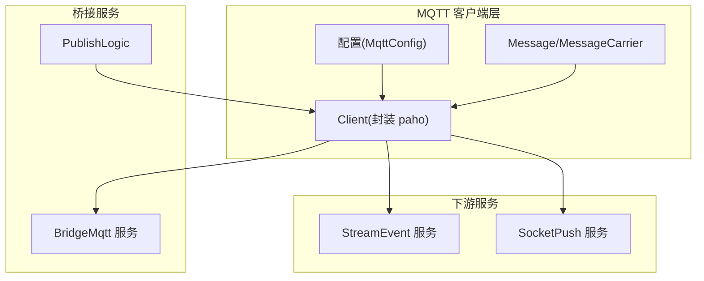
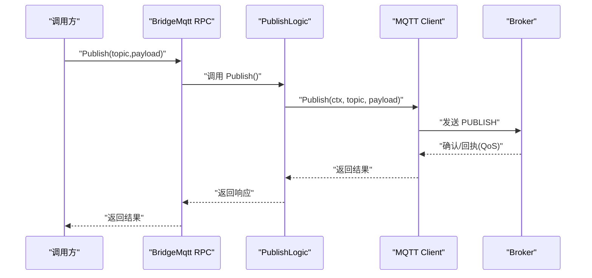
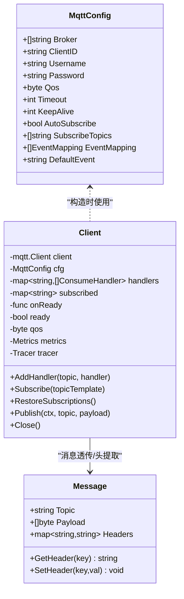
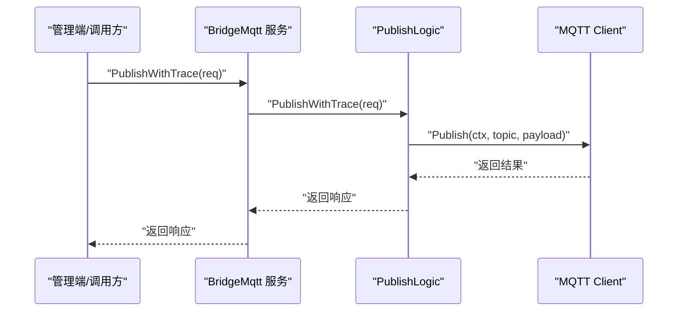
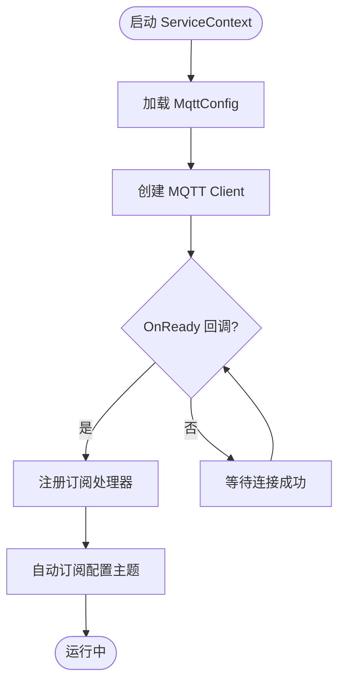
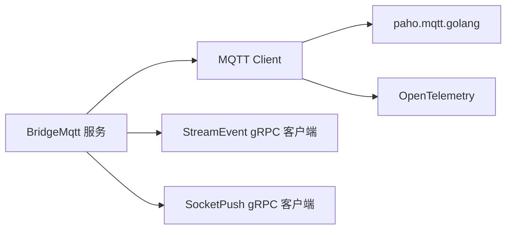
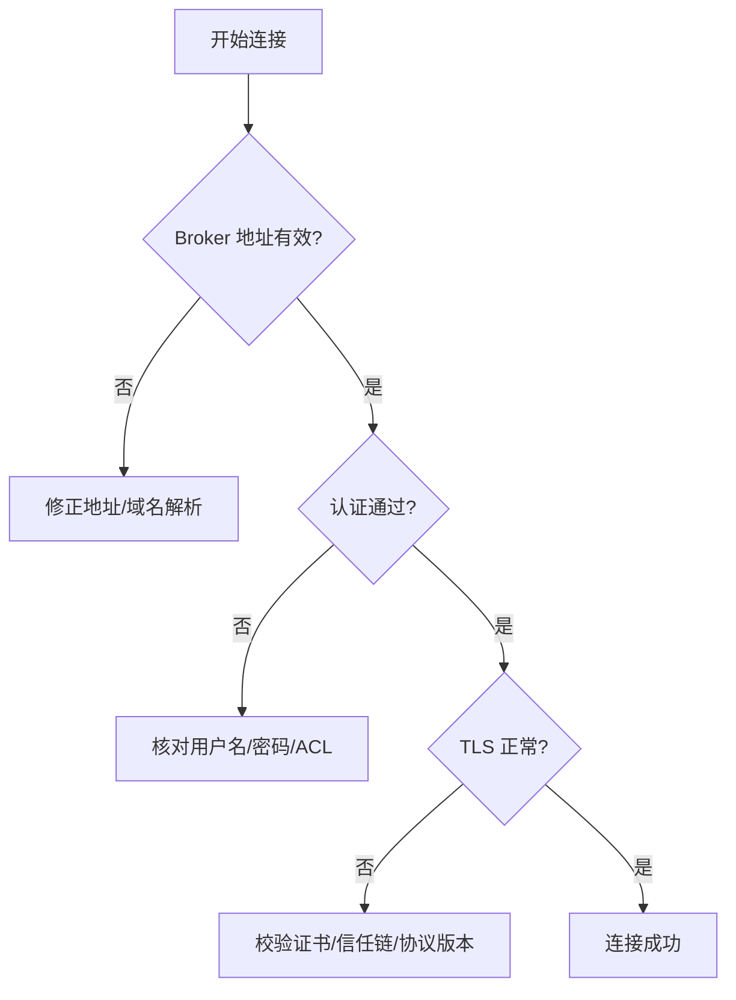
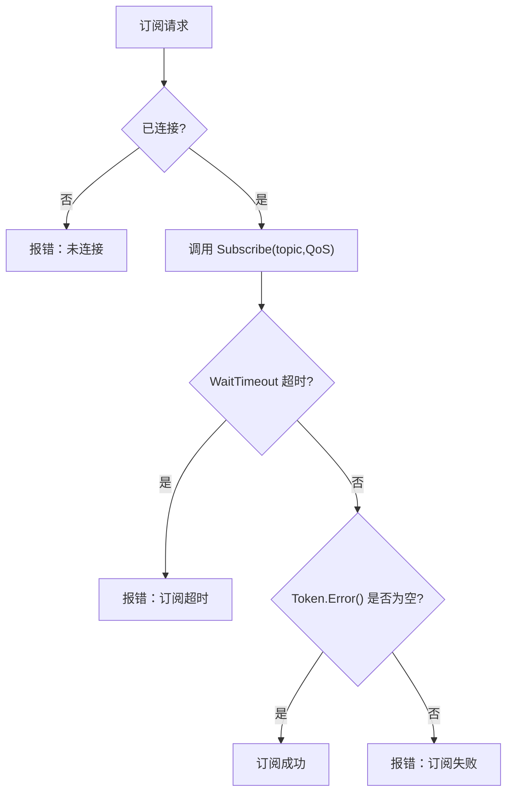
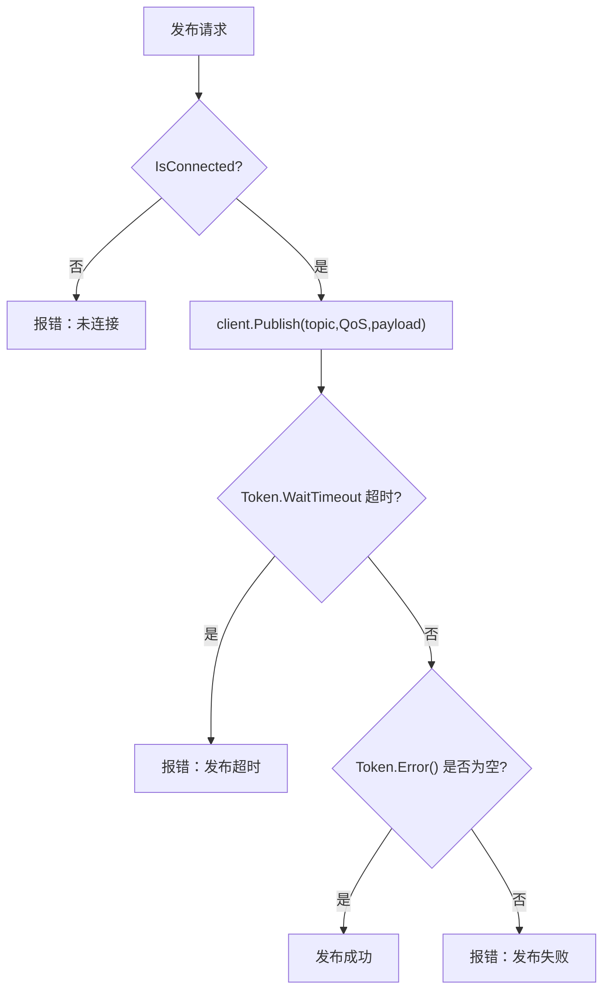

# MQTT 消息传递问题

<cite>
**本文引用的文件**
- [common/mqttx/mqttx.go](file://common/mqttx/mqttx.go)
- [common/mqttx/message.go](file://common/mqttx/message.go)
- [common/mqttx/trace.go](file://common/mqttx/trace.go)
- [app/bridgemqtt/etc/bridgemqtt.yaml](file://app/bridgemqtt/etc/bridgemqtt.yaml)
- [app/bridgemqtt/internal/svc/servicecontext.go](file://app/bridgemqtt/internal/svc/servicecontext.go)
- [app/bridgemqtt/internal/logic/publishlogic.go](file://app/bridgemqtt/internal/logic/publishlogic.go)
- [app/bridgemqtt/bridgemqtt/bridgemqtt.pb.go](file://app/bridgemqtt/bridgemqtt/bridgemqtt.pb.go)
- [app/bridgemqtt/bridgemqtt/bridgemqtt_grpc.pb.go](file://app/bridgemqtt/bridgemqtt/bridgemqtt_grpc.pb.go)
- [facade/streamevent/internal/logic/receivemqttmessagelogic.go](file://facade/streamevent/internal/logic/receivemqttmessagelogic.go)
- [facade/streamevent/etc/streamevent.yaml](file://facade/streamevent/etc/streamevent.yaml)
</cite>

## 目录
1. [简介](#简介)
2. [项目结构](#项目结构)
3. [核心组件](#核心组件)
4. [架构总览](#架构总览)
5. [详细组件分析](#详细组件分析)
6. [依赖分析](#依赖分析)
7. [性能考量](#性能考量)
8. [故障排除指南](#故障排除指南)
9. [结论](#结论)
10. [附录](#附录)

## 简介
本指南聚焦于 MQTT 消息传递中的常见问题与系统性排查方法，覆盖客户端连接、认证与 TLS 验证、主题订阅、QoS 与订阅确认、发布失败、消息丢失与重复、服务端配置（会话保持、遗嘱消息、最大连接）、以及客户端性能优化（连接池、批处理、网络参数）。文档基于仓库中现有的 MQTT 客户端封装、桥接服务与相关配置进行分析，并提供可操作的诊断步骤与可视化图示。

## 项目结构
本仓库包含以下与 MQTT 相关的关键模块：
- 通用 MQTT 客户端封装：提供连接、订阅、发布、默认处理器、指标与链路追踪能力
- 桥接服务：通过 gRPC 提供发布接口，内部委托通用客户端完成实际发布
- 配置文件：定义 broker 地址、认证、QoS、订阅主题等
- 事件接收逻辑：预留接收 MQTT 消息的处理入口

**图表来源**
- [common/mqttx/mqttx.go:51-87](file://common/mqttx/mqttx.go#L51-L87)
- [app/bridgemqtt/etc/bridgemqtt.yaml:19-34](file://app/bridgemqtt/etc/bridgemqtt.yaml#L19-L34)
- [app/bridgemqtt/internal/svc/servicecontext.go:47-55](file://app/bridgemqtt/internal/svc/servicecontext.go#L47-L55)
- [app/bridgemqtt/internal/logic/publishlogic.go:27-33](file://app/bridgemqtt/internal/logic/publishlogic.go#L27-L33)

**章节来源**
- [common/mqttx/mqttx.go:51-87](file://common/mqttx/mqttx.go#L51-L87)
- [app/bridgemqtt/etc/bridgemqtt.yaml:19-34](file://app/bridgemqtt/etc/bridgemqtt.yaml#L19-L34)
- [app/bridgemqtt/internal/svc/servicecontext.go:47-55](file://app/bridgemqtt/internal/svc/servicecontext.go#L47-L55)

## 核心组件
- 通用 MQTT 客户端封装
  - 支持 broker 列表、用户名密码、QoS、超时、心跳、自动重连、自动订阅
  - 订阅恢复、消息处理包装器、默认处理器、指标统计、OpenTelemetry 链路追踪
- 桥接服务
  - gRPC 服务暴露 Ping/Publish/PublishWithTrace 方法
  - 业务逻辑层直接调用通用客户端进行发布
- 配置
  - YAML 中定义 broker、认证、QoS、初始订阅主题等
- 事件接收
  - 预留接收 MQTT 消息的逻辑入口，便于扩展

**章节来源**
- [common/mqttx/mqttx.go:98-178](file://common/mqttx/mqttx.go#L98-L178)
- [app/bridgemqtt/bridgemqtt/bridgemqtt_grpc.pb.go:48-76](file://app/bridgemqtt/bridgemqtt/bridgemqtt_grpc.pb.go#L48-L76)
- [app/bridgemqtt/etc/bridgemqtt.yaml:19-34](file://app/bridgemqtt/etc/bridgemqtt.yaml#L19-L34)

## 架构总览
MQTT 客户端在桥接服务启动时初始化，连接 broker 并按配置自动订阅主题；发布请求由桥接服务的逻辑层调用客户端完成；消息消费时支持默认处理器与链路追踪；同时桥接服务可将消息转发至下游服务（如 StreamEvent、SocketPush）。

**图表来源**
- [app/bridgemqtt/internal/logic/publishlogic.go:27-33](file://app/bridgemqtt/internal/logic/publishlogic.go#L27-L33)
- [common/mqttx/mqttx.go:309-333](file://common/mqttx/mqttx.go#L309-L333)

## 详细组件分析

### 组件一：通用 MQTT 客户端封装
- 配置项与默认值
  - broker 地址列表必填；clientID 可自动生成；超时与心跳有默认值；QoS 限定范围并在越界时修正
- 连接与重连
  - 启用自动重连；连接成功触发恢复订阅；断开时清空已订阅缓存以确保重连后重新订阅
- 订阅与消息处理
  - 支持手动订阅与自动订阅；订阅超时与错误处理；消息处理包装器负责指标、默认处理器、panic 捕获与链路追踪
- 发布
  - 发布超时与错误记录；QoS 使用客户端配置
- 指标与追踪
  - 统计处理耗时；生产/消费 Span 带入 topic、client_id、message_id、qos 等属性

**图表来源**
- [common/mqttx/mqttx.go:51-87](file://common/mqttx/mqttx.go#L51-L87)
- [common/mqttx/message.go:3-15](file://common/mqttx/message.go#L3-L15)
- [common/mqttx/trace.go:8-30](file://common/mqttx/trace.go#L8-L30)

**章节来源**
- [common/mqttx/mqttx.go:98-178](file://common/mqttx/mqttx.go#L98-L178)
- [common/mqttx/mqttx.go:204-255](file://common/mqttx/mqttx.go#L204-L255)
- [common/mqttx/mqttx.go:309-333](file://common/mqttx/mqttx.go#L309-L333)
- [common/mqttx/message.go:3-15](file://common/mqttx/message.go#L3-L15)
- [common/mqttx/trace.go:8-30](file://common/mqttx/trace.go#L8-L30)

### 组件二：桥接服务与 gRPC 接口
- 服务定义
  - 提供 Ping、Publish、PublishWithTrace 三个方法
- 业务逻辑
  - Publish 直接委托 MQTT 客户端完成发布
- 服务上下文
  - 初始化日志、下游客户端（StreamEvent、SocketPush），并在 MQTT 客户端就绪时注册订阅处理器

**图表来源**
- [app/bridgemqtt/bridgemqtt/bridgemqtt_grpc.pb.go:48-76](file://app/bridgemqtt/bridgemqtt/bridgemqtt_grpc.pb.go#L48-L76)
- [app/bridgemqtt/bridgemqtt/bridgemqtt.pb.go:203-300](file://app/bridgemqtt/bridgemqtt/bridgemqtt.pb.go#L203-L300)
- [app/bridgemqtt/internal/logic/publishlogic.go:27-33](file://app/bridgemqtt/internal/logic/publishlogic.go#L27-L33)

**章节来源**
- [app/bridgemqtt/bridgemqtt/bridgemqtt_grpc.pb.go:48-76](file://app/bridgemqtt/bridgemqtt/bridgemqtt_grpc.pb.go#L48-L76)
- [app/bridgemqtt/bridgemqtt/bridgemqtt.pb.go:203-300](file://app/bridgemqtt/bridgemqtt/bridgemqtt.pb.go#L203-L300)
- [app/bridgemqtt/internal/logic/publishlogic.go:27-33](file://app/bridgemqtt/internal/logic/publishlogic.go#L27-L33)

### 组件三：配置与初始化流程
- 配置要点
  - broker 地址、认证、QoS、初始订阅主题、事件映射、默认事件名
- 初始化流程
  - 服务上下文创建 MQTT 客户端；OnReady 回调中注册订阅处理器；根据配置自动订阅

**图表来源**
- [app/bridgemqtt/etc/bridgemqtt.yaml:19-34](file://app/bridgemqtt/etc/bridgemqtt.yaml#L19-L34)
- [app/bridgemqtt/internal/svc/servicecontext.go:47-55](file://app/bridgemqtt/internal/svc/servicecontext.go#L47-L55)

**章节来源**
- [app/bridgemqtt/etc/bridgemqtt.yaml:19-34](file://app/bridgemqtt/etc/bridgemqtt.yaml#L19-L34)
- [app/bridgemqtt/internal/svc/servicecontext.go:47-55](file://app/bridgemqtt/internal/svc/servicecontext.go#L47-L55)

## 依赖分析
- 组件耦合
  - 桥接服务依赖通用 MQTT 客户端；服务上下文负责初始化与回调注册
  - 下游服务（StreamEvent、SocketPush）通过 gRPC 客户端接入
- 外部依赖
  - paho.mqtt.golang 用于底层协议交互
  - OpenTelemetry 用于链路追踪
  - go-zero 日志、指标与 RPC 框架

**图表来源**
- [app/bridgemqtt/internal/svc/servicecontext.go:26-45](file://app/bridgemqtt/internal/svc/servicecontext.go#L26-L45)
- [common/mqttx/mqttx.go:137-146](file://common/mqttx/mqttx.go#L137-L146)

**章节来源**
- [app/bridgemqtt/internal/svc/servicecontext.go:26-45](file://app/bridgemqtt/internal/svc/servicecontext.go#L26-L45)
- [common/mqttx/mqttx.go:137-146](file://common/mqttx/mqttx.go#L137-L146)

## 性能考量
- 连接与订阅
  - 合理设置 KeepAlive 与 ConnectTimeout，避免频繁抖动
  - 自动订阅在 OnConnect 成功后恢复，减少重复订阅开销
- 发布与处理
  - 发布与订阅均带超时控制；消息处理包装器内含指标统计，便于定位慢处理器
- 网络与消息大小
  - gRPC 客户端设置了最大消息大小（发送侧 50MB），避免大包导致的传输失败或内存压力

**章节来源**
- [common/mqttx/mqttx.go:144-146](file://common/mqttx/mqttx.go#L144-L146)
- [common/mqttx/mqttx.go:318-325](file://common/mqttx/mqttx.go#L318-L325)
- [app/bridgemqtt/internal/svc/servicecontext.go:29-44](file://app/bridgemqtt/internal/svc/servicecontext.go#L29-L44)

## 故障排除指南

### 一、客户端连接问题诊断
- broker 地址配置验证
  - 确认配置文件中 broker 地址列表非空且格式正确
  - 检查网络连通性与防火墙策略
- 认证信息检查
  - 校验用户名与密码是否正确；确认 broker 端用户存在且具备订阅/发布权限
- TLS 证书验证
  - 若使用 TLS（如 ssl:// 或 wss://），需确保客户端信任链与证书匹配；当前通用客户端封装未显式设置 TLS 选项，若需要请在上层按 paho 的方式补充

**章节来源**
- [app/bridgemqtt/etc/bridgemqtt.yaml:20-24](file://app/bridgemqtt/etc/bridgemqtt.yaml#L20-L24)
- [common/mqttx/mqttx.go:100-102](file://common/mqttx/mqttx.go#L100-L102)
- [common/mqttx/mqttx.go:170-175](file://common/mqttx/mqttx.go#L170-L175)

### 二、主题订阅问题排查
- 主题通配符匹配
  - 使用多级通配符（#）与单级通配符（+）时，注意 broker 的匹配规则与权限
- QoS 级别设置
  - 客户端默认 QoS 由配置决定；若越界会被修正；发布与订阅的 QoS 需与 broker 策略一致
- 订阅确认机制
  - 订阅调用带超时；若超时或错误，检查 broker 可用性与 ACL 权限

**章节来源**
- [common/mqttx/mqttx.go:204-233](file://common/mqttx/mqttx.go#L204-L233)
- [common/mqttx/mqttx.go:132-135](file://common/mqttx/mqttx.go#L132-L135)

### 三、消息发布失败排查
- 网络连接状态检查
  - 发布前检查客户端是否已连接；若断开，等待自动重连或主动重建
- 消息大小限制
  - gRPC 发送侧最大 50MB；若超过此限制，需拆包或调整上游数据结构
- broker 负载与权限
  - 检查 broker 的连接数、消息速率与磁盘/内存占用；确认发布主题的 ACL

**章节来源**
- [common/mqttx/mqttx.go:310-333](file://common/mqttx/mqttx.go#L310-L333)
- [app/bridgemqtt/internal/svc/servicecontext.go:29-44](file://app/bridgemqtt/internal/svc/servicecontext.go#L29-L44)

### 四、消息丢失与重复诊断
- 消息确认机制
  - 当前发布未显式等待 PUBACK/PUBREC/PUBREL（QoS>0）的完整确认流程；如需强一致，可在上层增加重试与幂等校验
- 持久化与会话
  - 客户端未设置 cleansession 与会话保持策略；若需要会话保持，请在上层按 paho 的方式补充
- 客户端重连策略
  - 已启用自动重连；断开时清空本地订阅缓存，待重连后恢复订阅

**章节来源**
- [common/mqttx/mqttx.go:144-146](file://common/mqttx/mqttx.go#L144-L146)
- [common/mqttx/mqttx.go:161-166](file://common/mqttx/mqttx.go#L161-L166)

### 五、服务端配置问题
- 会话保持
  - 当前客户端未设置 cleansession；如需会话保持，应在上层配置 paho 的会话参数
- 遗嘱消息
  - 若需要，可在上层配置 Will 参数（遗嘱主题、消息、QoS、保留标志）
- 最大连接数限制
  - 检查 broker 的 max_connections、max_inflight_messages 等参数；结合客户端并发与订阅规模评估

**章节来源**
- [common/mqttx/mqttx.go:137-146](file://common/mqttx/mqttx.go#L137-L146)

### 六、客户端性能优化建议
- 连接池与复用
  - 在同一进程内复用单个 MQTT 客户端实例；避免频繁创建/销毁
- 消息批处理
  - 对高频小消息进行合并发送，降低网络与 broker 压力
- 网络参数调优
  - 合理设置 KeepAlive 与 ConnectTimeout；根据网络 RTT 调整超时阈值
- 指标与追踪
  - 利用内置指标统计与链路追踪定位慢点与异常路径

**章节来源**
- [common/mqttx/mqttx.go:124-126](file://common/mqttx/mqttx.go#L124-L126)
- [common/mqttx/mqttx.go:361-388](file://common/mqttx/mqttx.go#L361-L388)

## 结论
本仓库提供了完整的 MQTT 客户端封装与桥接服务，覆盖连接、订阅、发布、默认处理器与可观测性。针对常见问题，建议优先从配置与网络入手，逐步深入到订阅确认、发布超时与 broker 侧限制。对于强一致与高可靠场景，可在上层补充会话保持、重试与幂等策略。

## 附录

### A. 关键配置清单
- broker 地址列表、用户名、密码、QoS、初始订阅主题、事件映射、默认事件名
- gRPC 最大消息大小（发送侧 50MB）

**章节来源**
- [app/bridgemqtt/etc/bridgemqtt.yaml:19-34](file://app/bridgemqtt/etc/bridgemqtt.yaml#L19-L34)
- [app/bridgemqtt/internal/svc/servicecontext.go:29-44](file://app/bridgemqtt/internal/svc/servicecontext.go#L29-L44)

### B. 事件接收逻辑现状
- 当前预留接收 MQTT 消息的逻辑入口，便于后续扩展为事件汇聚或转发

**章节来源**
- [facade/streamevent/internal/logic/receivemqttmessagelogic.go:27-31](file://facade/streamevent/internal/logic/receivemqttmessagelogic.go#L27-L31)
- [facade/streamevent/etc/streamevent.yaml:1-28](file://facade/streamevent/etc/streamevent.yaml#L1-L28)