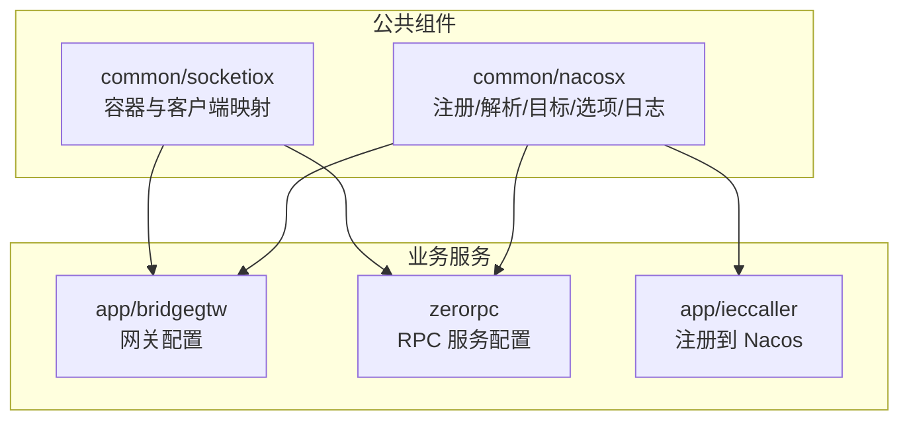
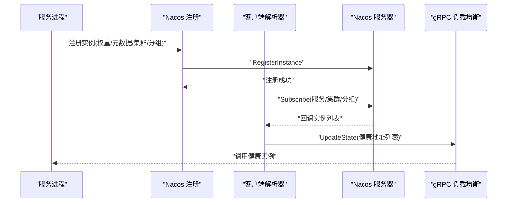
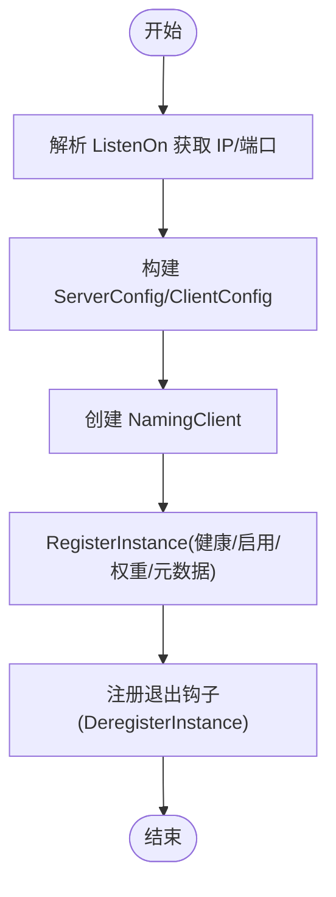
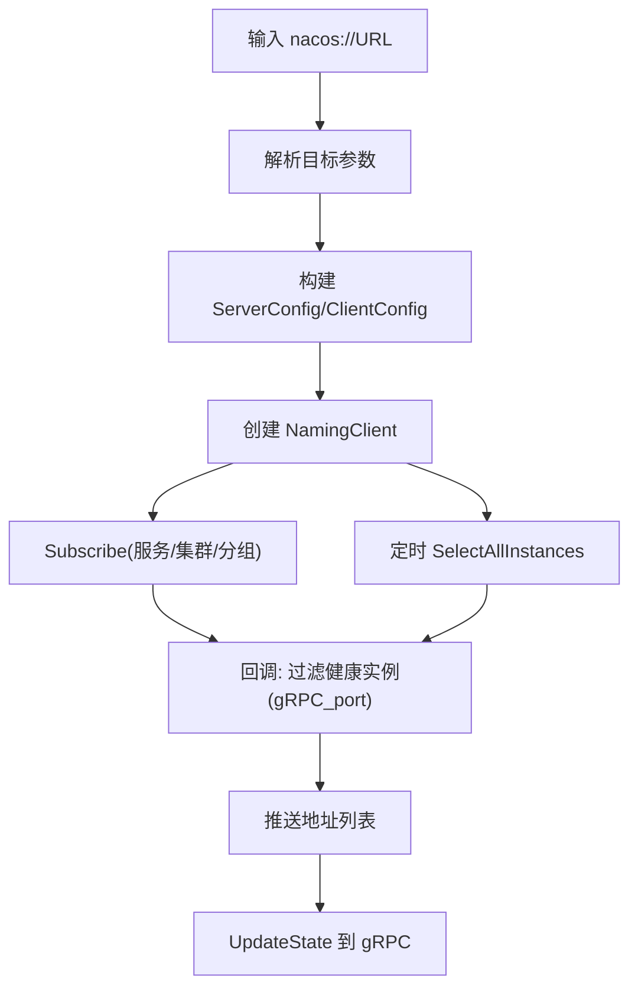
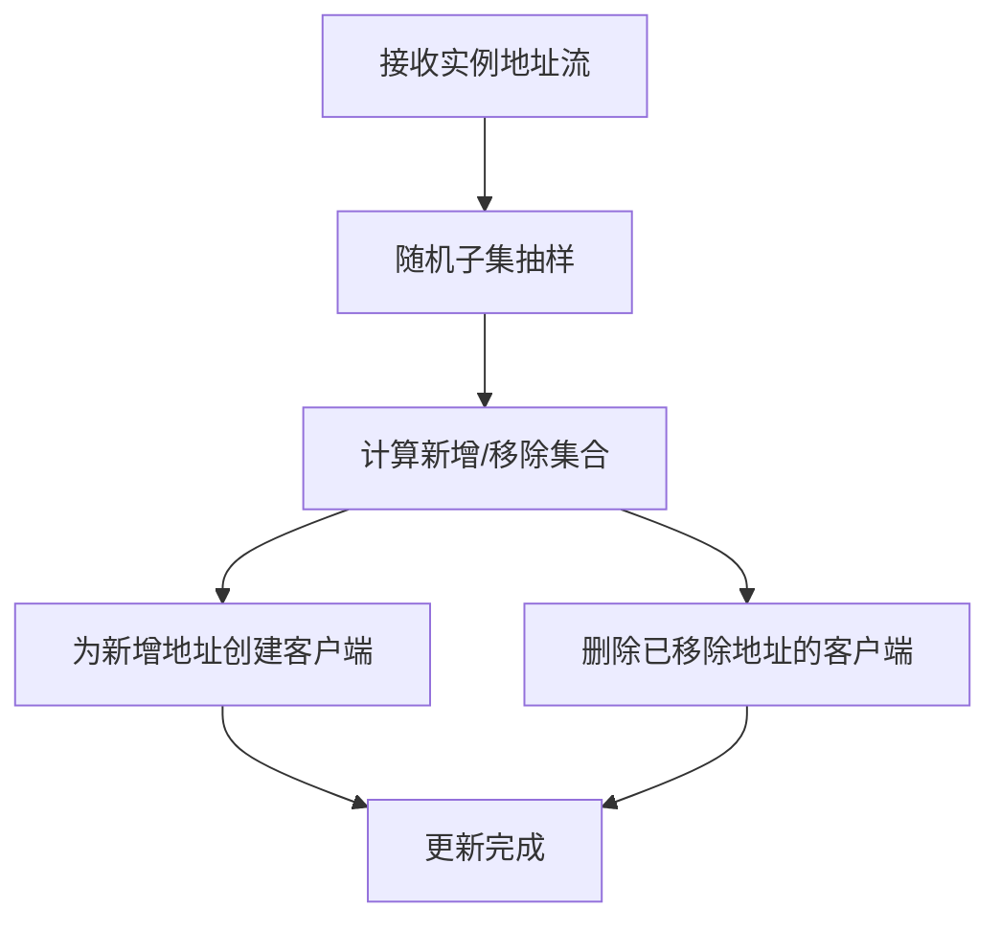
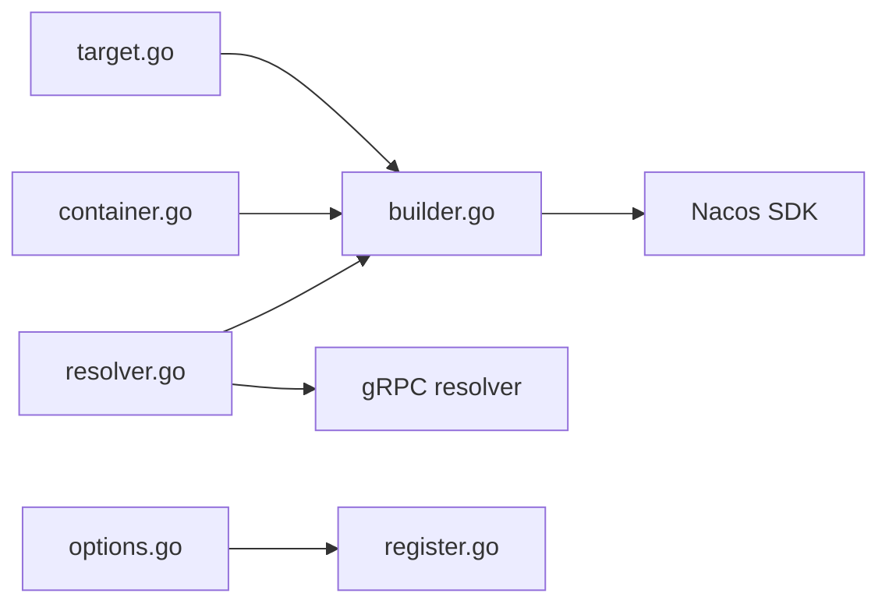
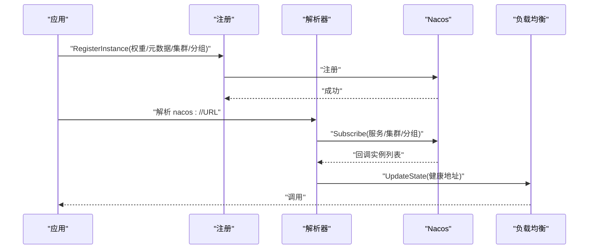

# 服务注册发现问题

<cite>
**本文引用的文件**
- [register.go](file://common/nacosx/register.go)
- [builder.go](file://common/nacosx/builder.go)
- [resolver.go](file://common/nacosx/resolver.go)
- [options.go](file://common/nacosx/options.go)
- [target.go](file://common/nacosx/target.go)
- [config.go](file://common/nacosx/config.go)
- [README.md](file://common/nacosx/README.md)
- [container.go](file://common/socketiox/container.go)
- [resilience-patterns.md](file://.trae/skills/zero-skills/references/resilience-patterns.md)
- [bridgegtw.yaml](file://app/bridgegtw/etc/bridgegtw.yaml)
- [zerorpc.yaml](file://zerorpc/etc/zerorpc.yaml)
- [config.go](file://zerorpc/internal/config/config.go)
- [config.go](file://app/bridgegtw/internal/config/config.go)
- [ieccaller.go](file://app/ieccaller/ieccaller.go)
</cite>

## 目录
1. [简介](#简介)
2. [项目结构](#项目结构)
3. [核心组件](#核心组件)
4. [架构总览](#架构总览)
5. [详细组件分析](#详细组件分析)
6. [依赖分析](#依赖分析)
7. [性能考虑](#性能考虑)
8. [故障排除指南](#故障排除指南)
9. [结论](#结论)
10. [附录](#附录)

## 简介
本指南聚焦于基于 Nacos 的服务注册与发现问题的系统化故障排除，覆盖以下关键场景：
- 服务实例健康检查与注册中心连接状态验证
- 命名空间、集群与分组配置校验
- 服务发现异常排查（服务列表查询、实例权重与负载均衡）
- 服务调用失败定位（路由配置、超时与熔断）
- 注册中心高可用（集群节点状态、数据一致性、故障转移）
- 元数据管理（标签过滤、版本控制、动态配置）
- 服务治理最佳实践（分组策略、流量控制、监控告警）

## 项目结构
本仓库采用多模块组织，与 Nacos 相关的关键实现集中在 common/nacosx 与 socketiox 中，并在多个业务服务中通过配置启用注册与发现。

图表来源
- [register.go:21-76](file://common/nacosx/register.go#L21-L76)
- [builder.go:29-111](file://common/nacosx/builder.go#L29-L111)
- [container.go:267-316](file://common/socketiox/container.go#L267-L316)
- [bridgegtw.yaml:12-40](file://app/bridgegtw/etc/bridgegtw.yaml#L12-L40)
- [zerorpc.yaml:1-39](file://zerorpc/etc/zerorpc.yaml#L1-L39)
- [ieccaller.go:60-82](file://app/ieccaller/ieccaller.go#L60-L82)

章节来源
- [register.go:1-99](file://common/nacosx/register.go#L1-L99)
- [builder.go:1-139](file://common/nacosx/builder.go#L1-L139)
- [resolver.go:1-74](file://common/nacosx/resolver.go#L1-L74)
- [options.go:1-72](file://common/nacosx/options.go#L1-L72)
- [target.go:1-80](file://common/nacosx/target.go#L1-L80)
- [config.go:1-38](file://common/nacosx/config.go#L1-L38)
- [README.md:1-65](file://common/nacosx/README.md#L1-L65)
- [container.go:267-356](file://common/socketiox/container.go#L267-L356)
- [bridgegtw.yaml:1-40](file://app/bridgegtw/etc/bridgegtw.yaml#L1-L40)
- [zerorpc.yaml:1-39](file://zerorpc/etc/zerorpc.yaml#L1-L39)
- [config.go:1-25](file://zerorpc/internal/config/config.go#L1-L25)
- [config.go:1-8](file://app/bridgegtw/internal/config/config.go#L1-L8)
- [ieccaller.go:60-82](file://app/ieccaller/ieccaller.go#L60-L82)

## 核心组件
- 服务注册与反注册：负责将服务实例注册到 Nacos，并在进程退出时自动反注册。
- 解析器与订阅：基于 gRPC resolver 扩展，监听服务变更并推送地址列表给客户端负载均衡器。
- 目标参数解析：从 nacos:// URL 中解析命名空间、服务名、集群、分组、超时等参数。
- 选项与元数据：支持权重、集群、分组、自定义元数据等注册参数。
- 日志与配置：统一初始化 Nacos 客户端日志级别与目录。
- Socket 容器：在 socket 场景下按健康实例动态维护客户端连接集合。

章节来源
- [register.go:21-76](file://common/nacosx/register.go#L21-L76)
- [builder.go:29-138](file://common/nacosx/builder.go#L29-L138)
- [resolver.go:13-74](file://common/nacosx/resolver.go#L13-L74)
- [target.go:13-79](file://common/nacosx/target.go#L13-L79)
- [options.go:11-72](file://common/nacosx/options.go#L11-L72)
- [config.go:15-37](file://common/nacosx/config.go#L15-L37)
- [container.go:267-356](file://common/socketiox/container.go#L267-L356)

## 架构总览
下图展示服务注册与发现的整体流程：服务侧注册实例，客户端侧通过 Nacos 解析器订阅实例变化，最终由 gRPC 负载均衡器选择目标地址。

图表来源
- [register.go:41-56](file://common/nacosx/register.go#L41-L56)
- [builder.go:78-109](file://common/nacosx/builder.go#L78-L109)
- [resolver.go:38-65](file://common/nacosx/resolver.go#L38-L65)

## 详细组件分析

### 服务注册组件
- 关键点
  - 解析 ListenOn 并推断 IP（优先 POD_IP，其次内网 IP）。
  - 注册时启用健康与启用标志，确保被发现。
  - 使用元数据携带 gRPC 端口与部署信息。
  - 进程退出时自动反注册，避免悬挂实例。

图表来源
- [register.go:22-76](file://common/nacosx/register.go#L22-L76)
- [options.go:26-41](file://common/nacosx/options.go#L26-L41)

章节来源
- [register.go:21-76](file://common/nacosx/register.go#L21-L76)
- [options.go:11-72](file://common/nacosx/options.go#L11-L72)

### Nacos 解析器与订阅
- 关键点
  - 从 nacos:// URL 解析服务名、命名空间、用户名密码、超时、日志与缓存目录。
  - 订阅服务实例变更，回调中提取健康且启用的实例，仅保留带 gRPC_port 的实例。
  - 定期全量拉取实例列表，保证缓存一致性。
  - 将地址列表排序后更新至 gRPC 客户端连接状态。

图表来源
- [builder.go:29-111](file://common/nacosx/builder.go#L29-L111)
- [target.go:31-79](file://common/nacosx/target.go#L31-L79)
- [resolver.go:38-65](file://common/nacosx/resolver.go#L38-L65)

章节来源
- [builder.go:29-138](file://common/nacosx/builder.go#L29-L138)
- [resolver.go:13-74](file://common/nacosx/resolver.go#L13-L74)
- [target.go:13-79](file://common/nacosx/target.go#L13-L79)

### Socket 容器中的实例管理
- 关键点
  - 基于订阅结果动态增删客户端连接，维持健康实例集合。
  - 对实例集合做随机子集抽样，限制并发连接数量。
  - 严格过滤 gRPC_port 与健康/启用状态。

图表来源
- [container.go:267-316](file://common/socketiox/container.go#L267-L316)
- [container.go:318-356](file://common/socketiox/container.go#L318-L356)

章节来源
- [container.go:267-356](file://common/socketiox/container.go#L267-L356)

### 服务调用链与超时/熔断
- 关键点
  - 服务端通过配置设置请求超时，避免阻塞。
  - 客户端侧建议结合熔断与重试策略，参考通用韧性模式。
  - 网关层可配置上游超时与非阻塞转发。

章节来源
- [resilience-patterns.md:591-641](file://.trae/skills/zero-skills/references/resilience-patterns.md#L591-L641)
- [bridgegtw.yaml:11-40](file://app/bridgegtw/etc/bridgegtw.yaml#L11-L40)
- [zerorpc.yaml:2-3](file://zerorpc/etc/zerorpc.yaml#L2-L3)

## 依赖分析
- 组件耦合
  - nacosx.builder 依赖 nacosx.target 与 nacosx.resolver，形成“URL 解析 → 客户端 → 订阅 → 地址推送”的闭环。
  - nacosx.register 与 nacosx.options 协同，提供注册入口与参数装配。
  - socketiox.container 在订阅基础上扩展客户端连接管理。
- 外部依赖
  - Nacos SDK v2（客户端、命名服务、常量配置）。
  - gRPC resolver 接口，用于地址更新。
  - go-zero 配置与日志框架。

图表来源
- [target.go:31-79](file://common/nacosx/target.go#L31-L79)
- [builder.go:29-111](file://common/nacosx/builder.go#L29-L111)
- [resolver.go:13-22](file://common/nacosx/resolver.go#L13-L22)
- [options.go:26-41](file://common/nacosx/options.go#L26-L41)
- [register.go:31-38](file://common/nacosx/register.go#L31-L38)
- [container.go:267-316](file://common/socketiox/container.go#L267-L316)

## 性能考虑
- 实例过滤与去重：解析阶段仅保留健康、启用且包含 gRPC_port 的实例，减少无效连接。
- 地址排序与幂等更新：对地址列表排序后更新，避免负载均衡器重复替换相同列表。
- 定时拉取：定期全量拉取实例，保障缓存与注册中心一致。
- 抽样与限流：Socket 容器对实例集合进行随机抽样，控制连接规模。

章节来源
- [builder.go:120-138](file://common/nacosx/builder.go#L120-L138)
- [resolver.go:47-65](file://common/nacosx/resolver.go#L47-L65)
- [container.go:348-356](file://common/socketiox/container.go#L348-L356)

## 故障排除指南

### 一、服务实例健康检查与注册状态
- 现象
  - 服务已启动但未出现在服务列表或无法被调用。
- 排查步骤
  - 检查注册入口是否正确传入 ListenOn、权重、集群、分组与元数据。
  - 确认元数据包含 gRPC_port，且健康/启用标志为 true。
  - 查看注册日志与反注册日志，确认注册成功并在进程退出时清理。
- 关联实现
  - 注册参数与健康标志、元数据字段。
  - 监听地址解析逻辑（支持 POD_IP 环境变量）。

章节来源
- [register.go:22-76](file://common/nacosx/register.go#L22-L76)
- [options.go:26-72](file://common/nacosx/options.go#L26-L72)
- [ieccaller.go:72-81](file://app/ieccaller/ieccaller.go#L72-L81)

### 二、注册中心连接状态与命名空间配置
- 现象
  - 客户端无法连接 Nacos 或订阅失败。
- 排查步骤
  - 校验 nacos:// URL 是否包含主机、服务名、命名空间 ID、超时等必要参数。
  - 检查环境变量 NACOS_LOG_LEVEL/NACOS_LOG_DIR/NACOS_CACHE_DIR 是否影响日志与缓存行为。
  - 确认 NotLoadCacheAtStart 与 UpdateCacheWhenEmpty 的配置是否符合预期。
- 关联实现
  - URL 参数解析与默认命名空间。
  - 客户端配置项（超时、日志、缓存目录、日志级别）。

章节来源
- [target.go:31-79](file://common/nacosx/target.go#L31-L79)
- [builder.go:45-73](file://common/nacosx/builder.go#L45-L73)
- [config.go:24-37](file://common/nacosx/config.go#L24-L37)

### 三、服务发现异常：服务列表查询、权重与负载均衡
- 现象
  - 客户端看到的实例列表不完整或不更新。
- 排查步骤
  - 检查订阅回调是否收到实例列表，关注 gRPC_port 缺失或健康/启用状态异常的日志。
  - 确认定时全量拉取任务正常运行，避免缓存过期导致的不一致。
  - 校验负载均衡器是否收到排序后的地址列表。
- 关联实现
  - 回调过滤逻辑（仅健康且启用且含 gRPC_port）。
  - 定时拉取与地址推送。
  - 地址排序与幂等更新。

章节来源
- [builder.go:78-109](file://common/nacosx/builder.go#L78-L109)
- [builder.go:120-138](file://common/nacosx/builder.go#L120-L138)
- [resolver.go:47-65](file://common/nacosx/resolver.go#L47-L65)

### 四、服务调用失败：路由、超时与熔断
- 现象
  - 调用超时、频繁失败或不稳定。
- 排查步骤
  - 校验服务端配置的 Timeout 是否合理，避免过短导致超时。
  - 网关层 Upstreams 的超时与非阻塞配置是否匹配下游能力。
  - 引入熔断与重试策略，结合韧性模式最佳实践。
- 关联实现
  - 服务端配置示例（Timeout）。
  - 网关配置示例（Upstreams.Timeout）。
  - 通用韧性配置与指标监控建议。

章节来源
- [zerorpc.yaml:2-3](file://zerorpc/etc/zerorpc.yaml#L2-L3)
- [bridgegtw.yaml:11-40](file://app/bridgegtw/etc/bridgegtw.yaml#L11-L40)
- [resilience-patterns.md:591-641](file://.trae/skills/zero-skills/references/resilience-patterns.md#L591-L641)

### 五、注册中心高可用：集群节点、一致性与故障转移
- 现象
  - 部分节点不可用或数据不一致。
- 排查步骤
  - 确认客户端配置了多个 Nacos 节点（ServerConfigs），以提升可用性。
  - 观察订阅回调与定时拉取是否在节点切换后仍能持续工作。
  - 校验命名空间、集群、分组是否一致，避免跨域访问。
- 关联实现
  - 客户端配置项（NamespaceId、Username/Password、TimeoutMs）。
  - URL 参数（namespaceid、timeout、appName、clusters、groupName）。

章节来源
- [builder.go:45-73](file://common/nacosx/builder.go#L45-L73)
- [target.go:13-28](file://common/nacosx/target.go#L13-L28)
- [README.md:61-65](file://common/nacosx/README.md#L61-L65)

### 六、元数据管理：标签过滤、版本控制与动态配置
- 现象
  - 期望按标签/版本筛选实例但未生效。
- 排查步骤
  - 确认注册时的 Metadata 字段包含 gRPC_port 与业务标签（如版本、区域、部署模式）。
  - 客户端订阅回调会严格过滤 gRPC_port 与健康/启用状态；其他标签需在上层逻辑中二次过滤。
  - 动态配置更新应通过 Nacos 配置管理页面或 API，确保客户端热更新生效。
- 关联实现
  - 注册时 Metadata 的装配。
  - 回调过滤逻辑（gRPC_port、健康、启用）。

章节来源
- [register.go:49-50](file://common/nacosx/register.go#L49-L50)
- [ieccaller.go:72-79](file://app/ieccaller/ieccaller.go#L72-L79)
- [builder.go:120-138](file://common/nacosx/builder.go#L120-L138)

### 七、服务治理最佳实践
- 分组策略
  - 使用 Group 与 Cluster 将不同环境/区域/版本的服务隔离，避免互相干扰。
- 流量控制
  - 结合权重与负载均衡，按实例权重分配流量；必要时引入限流与熔断。
- 监控告警
  - 关注注册/反注册事件、订阅回调错误、定时拉取失败、实例健康度变化等指标。

章节来源
- [options.go:48-71](file://common/nacosx/options.go#L48-L71)
- [builder.go:120-138](file://common/nacosx/builder.go#L120-L138)
- [resilience-patterns.md:621-659](file://.trae/skills/zero-skills/references/resilience-patterns.md#L621-L659)

## 结论
通过上述组件与流程的系统化排查，可快速定位并解决 Nacos 服务注册与发现中的常见问题。建议在生产环境中：
- 明确命名空间、集群、分组与元数据规范；
- 严格健康检查与启用标志；
- 合理设置超时与熔断；
- 建立完善的监控与告警体系。

## 附录

### A. 关键流程图：注册与订阅序列

图表来源
- [register.go:41-56](file://common/nacosx/register.go#L41-L56)
- [builder.go:78-109](file://common/nacosx/builder.go#L78-L109)
- [resolver.go:38-65](file://common/nacosx/resolver.go#L38-L65)