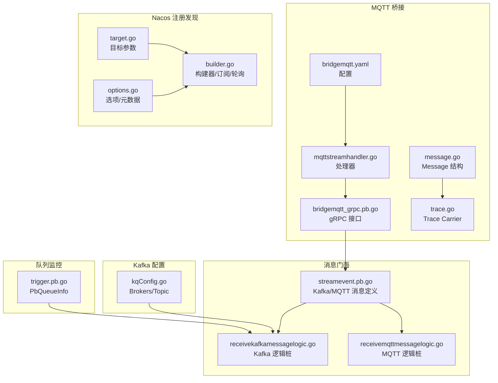
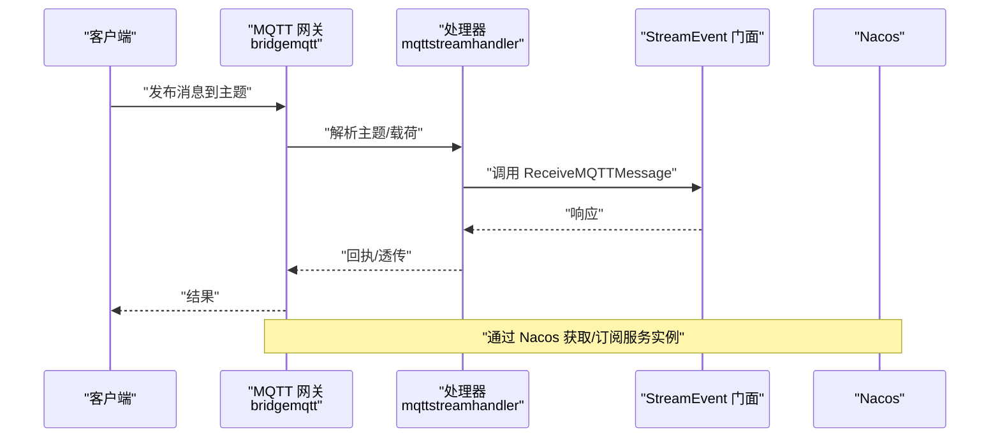
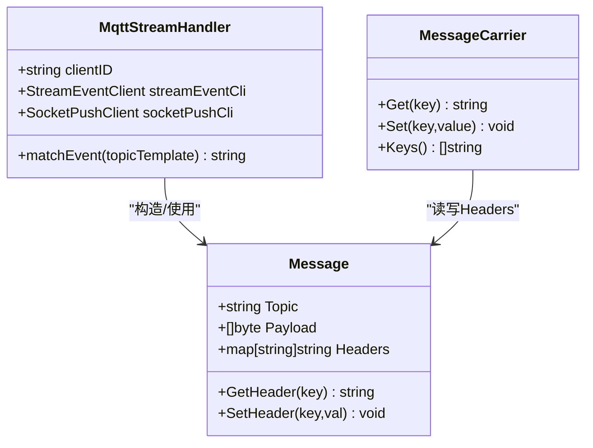
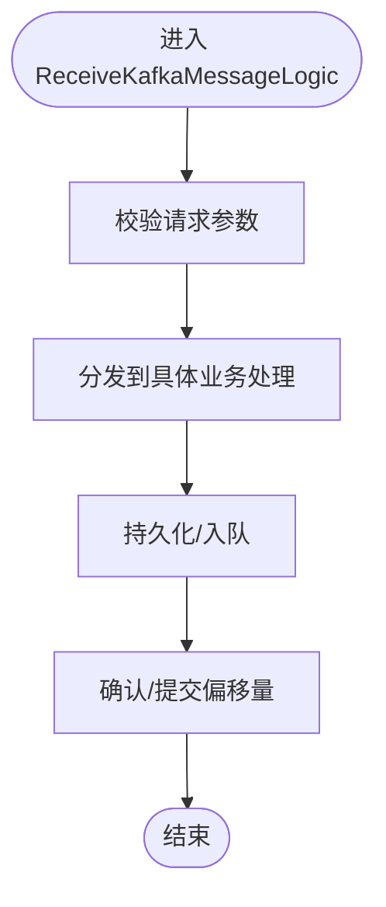
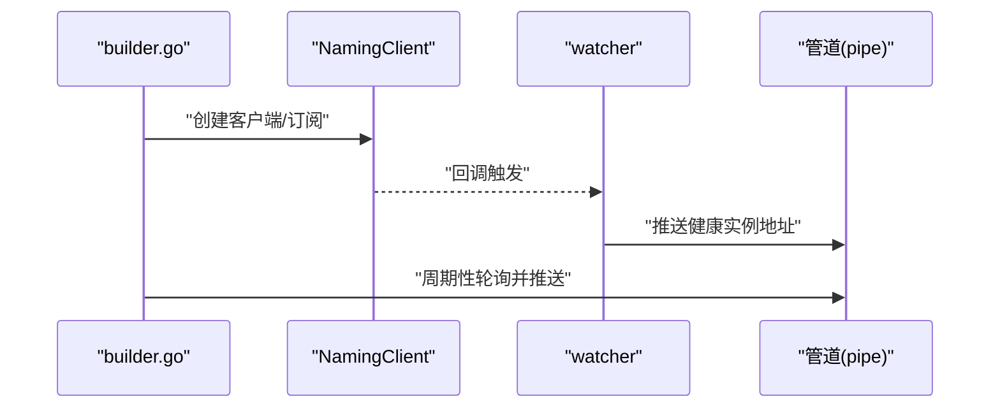
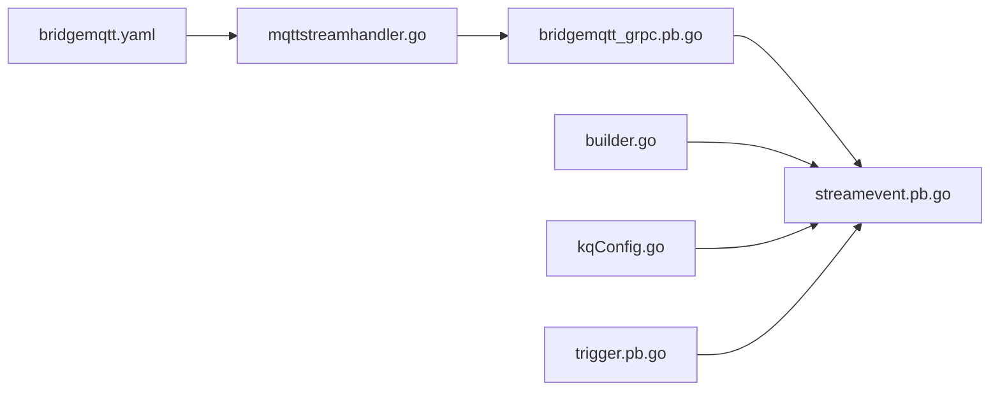
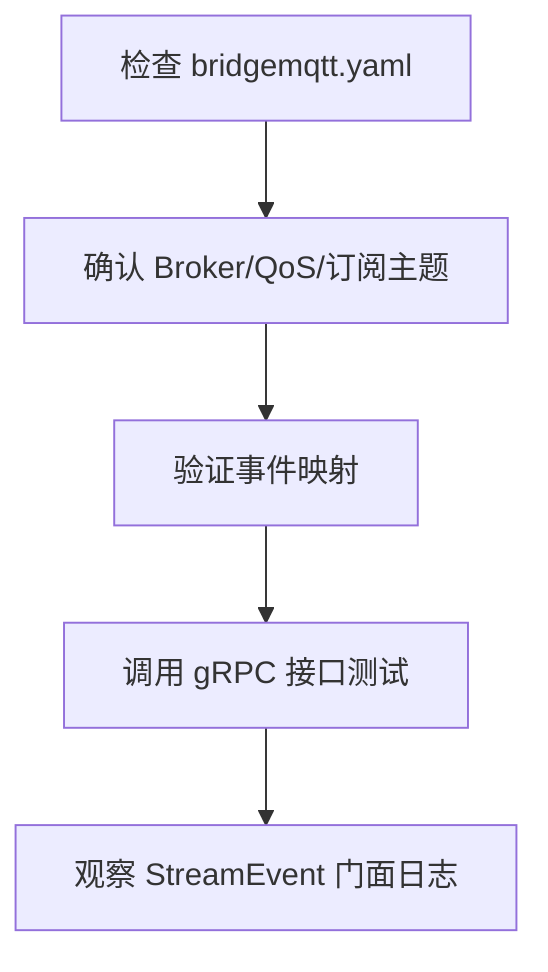
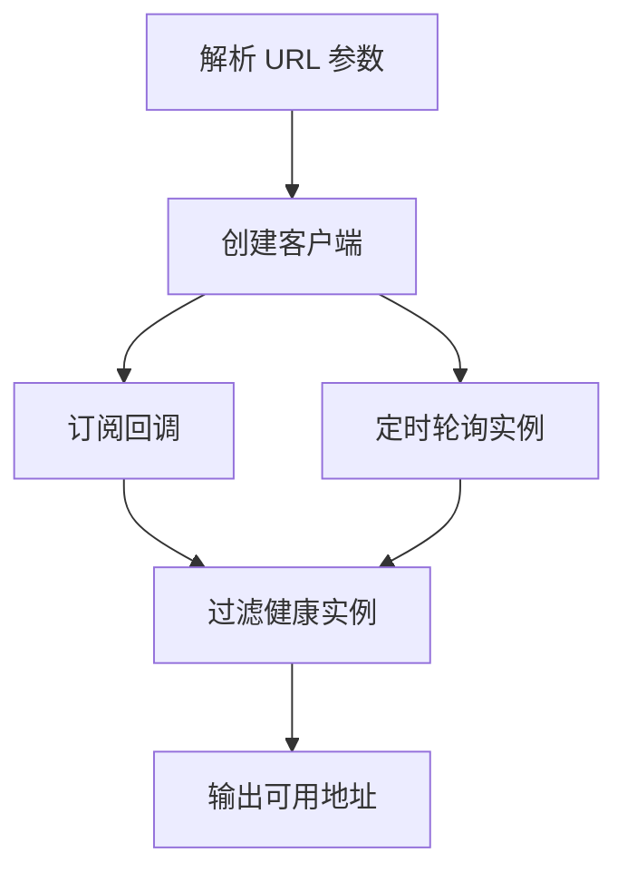

# 消息传递问题

<cite>
**本文引用的文件**
- [bridgemqtt.yaml](file://app/bridgemqtt/etc/bridgemqtt.yaml)
- [mqttstreamhandler.go](file://app/bridgemqtt/internal/handler/mqttstreamhandler.go)
- [bridgemqtt_grpc.pb.go](file://app/bridgemqtt/bridgemqtt/bridgemqtt_grpc.pb.go)
- [bridgemqtt.pb.go](file://app/bridgemqtt/bridgemqtt/bridgemqtt.pb.go)
- [message.go](file://common/mqttx/message.go)
- [trace.go](file://common/mqttx/trace.go)
- [target.go](file://common/nacosx/target.go)
- [builder.go](file://common/nacosx/builder.go)
- [options.go](file://common/nacosx/options.go)
- [streamevent.pb.go](file://facade/streamevent/streamevent/streamevent.pb.go)
- [receivekafkamessagelogic.go](file://facade/streamevent/internal/logic/receivekafkamessagelogic.go)
- [receivemqttmessagelogic.go](file://facade/streamevent/internal/logic/receivemqttmessagelogic.go)
- [kqConfig.go](file://common/configx/kqConfig.go)
- [trigger.pb.go](file://app/trigger/trigger/trigger.pb.go)
- [trigger.pb.validate.go](file://app/trigger/trigger/trigger.pb.validate.go)
- [errorutil.go](file://common/tool/errorutil.go)
- [overview.md](file://.trae/skills/zero-skills/best-practices/overview.md)
</cite>

## 目录
1. [简介](#简介)
2. [项目结构](#项目结构)
3. [核心组件](#核心组件)
4. [架构总览](#架构总览)
5. [详细组件分析](#详细组件分析)
6. [依赖分析](#依赖分析)
7. [性能考量](#性能考量)
8. [故障排除指南](#故障排除指南)
9. [结论](#结论)
10. [附录](#附录)

## 简介
本指南聚焦 zero-service 的消息传递问题排查，覆盖以下方面：
- Kafka 消息队列：集群状态检查、分区分配验证、消费者组管理
- MQTT 消息传递：Broker 连接状态、主题订阅验证、消息路由检查
- Nacos 服务注册与发现：服务实例状态、注册中心连通性、负载均衡配置
- 消息积压监控与处理：队列长度监控、消费速率分析、批量处理优化
- 消息丢失与重复：偏移量管理、幂等性设计
- 网络连接问题：防火墙、DNS、TLS 证书验证

## 项目结构
与消息传递相关的关键模块与文件：
- MQTT 网关与桥接
  - 配置：app/bridgemqtt/etc/bridgemqtt.yaml
  - 处理器：app/bridgemqtt/internal/handler/mqttstreamhandler.go
  - gRPC 接口：app/bridgemqtt/bridgemqtt/bridgemqtt_grpc.pb.go、bridgemqtt.pb.go
  - MQTT 数据模型与链路追踪：common/mqttx/message.go、common/mqttx/trace.go
- StreamEvent 门面（接收 Kafka/MQTT 消息）
  - protobuf 定义：facade/streamevent/streamevent/streamevent.pb.go
  - 逻辑桩：facade/streamevent/internal/logic/receivekafkamessagelogic.go、receivemqttmessagelogic.go
- Nacos 注册与发现
  - 目标解析：common/nacosx/target.go
  - 构建器与轮询：common/nacosx/builder.go
  - 选项与元数据：common/nacosx/options.go
- Kafka 配置
  - common/configx/kqConfig.go
- 触发与队列监控
  - protobuf 队列信息：app/trigger/trigger/trigger.pb.go、trigger.pb.validate.go
- 错误映射工具
  - common/tool/errorutil.go
- 最佳实践与日志
  - .trae/skills/zero-skills/best-practices/overview.md

**图表来源**
- [bridgemqtt.yaml:1-48](file://app/bridgemqtt/etc/bridgemqtt.yaml#L1-L48)
- [mqttstreamhandler.go:109-128](file://app/bridgemqtt/internal/handler/mqttstreamhandler.go#L109-L128)
- [bridgemqtt_grpc.pb.go:40-181](file://app/bridgemqtt/bridgemqtt/bridgemqtt_grpc.pb.go#L40-L181)
- [bridgemqtt.pb.go:160-387](file://app/bridgemqtt/bridgemqtt/bridgemqtt.pb.go#L160-L387)
- [message.go:1-30](file://common/mqttx/message.go#L1-L30)
- [trace.go:1-31](file://common/mqttx/trace.go#L1-L31)
- [streamevent.pb.go:174-2537](file://facade/streamevent/streamevent/streamevent.pb.go#L174-L2537)
- [receivekafkamessagelogic.go:1-32](file://facade/streamevent/internal/logic/receivekafkamessagelogic.go#L1-L32)
- [receivemqttmessagelogic.go:1-32](file://facade/streamevent/internal/logic/receivemqttmessagelogic.go#L1-L32)
- [target.go:1-42](file://common/nacosx/target.go#L1-L42)
- [builder.go:41-138](file://common/nacosx/builder.go#L41-L138)
- [options.go:1-71](file://common/nacosx/options.go#L1-L71)
- [kqConfig.go:1-6](file://common/configx/kqConfig.go#L1-L6)
- [trigger.pb.go:471-7107](file://app/trigger/trigger/trigger.pb.go#L471-L7107)

**章节来源**
- [bridgemqtt.yaml:1-48](file://app/bridgemqtt/etc/bridgemqtt.yaml#L1-L48)
- [mqttstreamhandler.go:109-128](file://app/bridgemqtt/internal/handler/mqttstreamhandler.go#L109-L128)
- [bridgemqtt_grpc.pb.go:40-181](file://app/bridgemqtt/bridgemqtt/bridgemqtt_grpc.pb.go#L40-L181)
- [bridgemqtt.pb.go:160-387](file://app/bridgemqtt/bridgemqtt/bridgemqtt.pb.go#L160-L387)
- [message.go:1-30](file://common/mqttx/message.go#L1-L30)
- [trace.go:1-31](file://common/mqttx/trace.go#L1-L31)
- [streamevent.pb.go:174-2537](file://facade/streamevent/streamevent/streamevent.pb.go#L174-L2537)
- [receivekafkamessagelogic.go:1-32](file://facade/streamevent/internal/logic/receivekafkamessagelogic.go#L1-L32)
- [receivemqttmessagelogic.go:1-32](file://facade/streamevent/internal/logic/receivemqttmessagelogic.go#L1-L32)
- [target.go:1-42](file://common/nacosx/target.go#L1-L42)
- [builder.go:41-138](file://common/nacosx/builder.go#L41-L138)
- [options.go:1-71](file://common/nacosx/options.go#L1-L71)
- [kqConfig.go:1-6](file://common/configx/kqConfig.go#L1-L6)
- [trigger.pb.go:471-7107](file://app/trigger/trigger/trigger.pb.go#L471-L7107)

## 核心组件
- MQTT 桥接网关
  - 配置项包含 Broker 地址、认证、QoS、订阅主题、事件映射、SocketPush 目标等
  - 处理器负责匹配主题模板到事件名，并将消息转发至 StreamEvent 或 SocketPush
- StreamEvent 门面
  - 提供接收 Kafka/MQTT 消息的 protobuf 定义与逻辑桩，便于统一接入与扩展
- Nacos 注册与发现
  - 支持通过 URL 参数解析目标服务、分组、集群、命名空间、超时等
  - 订阅回调与定时拉取健康实例，提取 gRPC 端口并输出可用地址
- Kafka 配置
  - KqConfig 定义 Brokers 与 Topic，用于 Kafka 客户端初始化
- 队列监控
  - PbQueueInfo 提供队列大小、分组数、Pending/Active/Scheduled/Retry/Archived/Completed/Failed、ProcessedTotal/FailedTotal、Paused、时间戳等指标

**章节来源**
- [bridgemqtt.yaml:19-48](file://app/bridgemqtt/etc/bridgemqtt.yaml#L19-L48)
- [mqttstreamhandler.go:109-128](file://app/bridgemqtt/internal/handler/mqttstreamhandler.go#L109-L128)
- [streamevent.pb.go:174-2537](file://facade/streamevent/streamevent/streamevent.pb.go#L174-L2537)
- [target.go:30-42](file://common/nacosx/target.go#L30-L42)
- [builder.go:41-138](file://common/nacosx/builder.go#L41-L138)
- [kqConfig.go:3-6](file://common/configx/kqConfig.go#L3-L6)
- [trigger.pb.go:471-547](file://app/trigger/trigger/trigger.pb.go#L471-L547)

## 架构总览
下图展示消息从 MQTT 到 StreamEvent 的典型路径，以及 Nacos 在服务发现中的作用。

**图表来源**
- [mqttstreamhandler.go:109-128](file://app/bridgemqtt/internal/handler/mqttstreamhandler.go#L109-L128)
- [bridgemqtt_grpc.pb.go:147-181](file://app/bridgemqtt/bridgemqtt/bridgemqtt_grpc.pb.go#L147-L181)
- [streamevent.pb.go:174-2537](file://facade/streamevent/streamevent/streamevent.pb.go#L174-L2537)
- [builder.go:75-111](file://common/nacosx/builder.go#L75-L111)

## 详细组件分析

### 组件一：MQTT 桥接与消息处理
- 主题匹配与事件映射
  - 处理器根据配置中的事件映射表，将主题模板匹配到事件名；若未匹配则使用默认事件
- 消息结构与链路追踪
  - Message 结构包含 Topic、Payload、Headers；MessageCarrier 实现 OpenTelemetry 文本传播接口，便于在消息头中携带 Trace 上下文
- gRPC 接口
  - 提供 Ping/Publish/PublishWithTrace 方法，支持带 Trace 的发布

**图表来源**
- [mqttstreamhandler.go:109-128](file://app/bridgemqtt/internal/handler/mqttstreamhandler.go#L109-L128)
- [message.go:1-30](file://common/mqttx/message.go#L1-L30)
- [trace.go:1-31](file://common/mqttx/trace.go#L1-L31)

**章节来源**
- [mqttstreamhandler.go:109-128](file://app/bridgemqtt/internal/handler/mqttstreamhandler.go#L109-L128)
- [message.go:1-30](file://common/mqttx/message.go#L1-L30)
- [trace.go:1-31](file://common/mqttx/trace.go#L1-L31)
- [bridgemqtt_grpc.pb.go:40-181](file://app/bridgemqtt/bridgemqtt/bridgemqtt_grpc.pb.go#L40-L181)
- [bridgemqtt.pb.go:160-387](file://app/bridgemqtt/bridgemqtt/bridgemqtt.pb.go#L160-L387)

### 组件二：StreamEvent 门面（Kafka/MQTT）
- Kafka 消息接收逻辑桩
  - ReceiveKafkaMessageLogic 作为入口，后续可接入 Kafka 消费者并处理消息
- MQTT 消息接收逻辑桩
  - ReceiveMQTTMessageLogic 作为入口，后续可接入 MQTT 消费者并处理消息
- protobuf 定义
  - MqttMessage/KafkaMessage 等消息体字段清晰，便于日志与监控

**图表来源**
- [receivekafkamessagelogic.go:26-31](file://facade/streamevent/internal/logic/receivekafkamessagelogic.go#L26-L31)
- [receivemqttmessagelogic.go:26-31](file://facade/streamevent/internal/logic/receivemqttmessagelogic.go#L26-L31)
- [streamevent.pb.go:174-2537](file://facade/streamevent/streamevent/streamevent.pb.go#L174-L2537)

**章节来源**
- [receivekafkamessagelogic.go:1-32](file://facade/streamevent/internal/logic/receivekafkamessagelogic.go#L1-L32)
- [receivemqttmessagelogic.go:1-32](file://facade/streamevent/internal/logic/receivemqttmessagelogic.go#L1-L32)
- [streamevent.pb.go:174-2537](file://facade/streamevent/streamevent/streamevent.pb.go#L174-L2537)

### 组件三：Nacos 服务注册与发现
- 目标解析
  - 从 URL 中解析 host、service、参数（如 namespaceid、timeout、clusters、group 等），并进行格式校验
- 构建器
  - 创建 NamingClient，订阅服务变更回调；周期性轮询健康实例，提取 gRPC 端口并输出可用地址
- 选项
  - 支持设置前缀、权重、集群、分组、元数据等

**图表来源**
- [target.go:30-42](file://common/nacosx/target.go#L30-L42)
- [builder.go:41-138](file://common/nacosx/builder.go#L41-L138)
- [options.go:1-71](file://common/nacosx/options.go#L1-L71)

**章节来源**
- [target.go:1-42](file://common/nacosx/target.go#L1-L42)
- [builder.go:41-138](file://common/nacosx/builder.go#L41-L138)
- [options.go:1-71](file://common/nacosx/options.go#L1-L71)

### 组件四：Kafka 配置与消费者组
- KqConfig
  - 定义 Brokers 与 Topic，用于初始化 Kafka 客户端
- 建议
  - 消费者组管理：确保同一业务使用相同 Group ID；合理设置分区数与副本；监控 lag 与再均衡频率

**章节来源**
- [kqConfig.go:1-6](file://common/configx/kqConfig.go#L1-L6)

### 组件五：队列监控与批量处理
- PbQueueInfo
  - 提供 Pending/Active/Scheduled/Retry/Archived/Completed/Failed、ProcessedTotal/FailedTotal、Paused、Timestamp 等指标
- 建议
  - 将队列长度与处理速率纳入告警阈值；对批量任务采用批处理优化吞吐

**章节来源**
- [trigger.pb.go:471-547](file://app/trigger/trigger/trigger.pb.go#L471-L547)
- [trigger.pb.validate.go:285-345](file://app/trigger/trigger/trigger.pb.validate.go#L285-L345)

## 依赖分析
- 组件耦合
  - MQTT 网关依赖 StreamEvent 门面；StreamEvent 门面依赖 Kafka/MQTT 消息定义
  - Nacos 作为服务发现组件被网关与下游服务共同依赖
- 外部依赖
  - gRPC、OpenTelemetry 文本传播、Nacos SDK、Kafka 客户端

**图表来源**
- [bridgemqtt.yaml:1-48](file://app/bridgemqtt/etc/bridgemqtt.yaml#L1-L48)
- [mqttstreamhandler.go:109-128](file://app/bridgemqtt/internal/handler/mqttstreamhandler.go#L109-L128)
- [bridgemqtt_grpc.pb.go:40-181](file://app/bridgemqtt/bridgemqtt/bridgemqtt_grpc.pb.go#L40-L181)
- [streamevent.pb.go:174-2537](file://facade/streamevent/streamevent/streamevent.pb.go#L174-L2537)
- [builder.go:41-138](file://common/nacosx/builder.go#L41-L138)
- [kqConfig.go:1-6](file://common/configx/kqConfig.go#L1-L6)
- [trigger.pb.go:471-547](file://app/trigger/trigger/trigger.pb.go#L471-L547)

**章节来源**
- [bridgemqtt.yaml:1-48](file://app/bridgemqtt/etc/bridgemqtt.yaml#L1-L48)
- [mqttstreamhandler.go:109-128](file://app/bridgemqtt/internal/handler/mqttstreamhandler.go#L109-L128)
- [bridgemqtt_grpc.pb.go:40-181](file://app/bridgemqtt/bridgemqtt/bridgemqtt_grpc.pb.go#L40-L181)
- [streamevent.pb.go:174-2537](file://facade/streamevent/streamevent/streamevent.pb.go#L174-L2537)
- [builder.go:41-138](file://common/nacosx/builder.go#L41-L138)
- [kqConfig.go:1-6](file://common/configx/kqConfig.go#L1-L6)
- [trigger.pb.go:471-547](file://app/trigger/trigger/trigger.pb.go#L471-L547)

## 性能考量
- 批处理优化
  - 对批量任务采用批处理以提升吞吐，降低系统开销
- 队列监控
  - 使用 PbQueueInfo 指标评估队列长度与处理速率，及时扩容或限流
- 日志与可观测性
  - 采用结构化日志记录上下文信息，避免敏感信息泄露

**章节来源**
- [trigger.pb.go:471-547](file://app/trigger/trigger/trigger.pb.go#L471-L547)
- [overview.md:214-281](file://.trae/skills/zero-skills/best-practices/overview.md#L214-L281)

## 故障排除指南

### Kafka 消息队列排查
- 集群状态检查
  - 确认 Brokers 可达性与 Topic 存在；核对消费者组是否正确加入分区
- 分区分配验证
  - 查看消费者组 lag、再均衡频率；确保分区数与消费者数量匹配
- 消费者组管理
  - 合理设置 Group ID；监控消费速率与延迟；必要时调整并发度

**章节来源**
- [kqConfig.go:1-6](file://common/configx/kqConfig.go#L1-L6)
- [trigger.pb.go:471-547](file://app/trigger/trigger/trigger.pb.go#L471-L547)

### MQTT 消息传递诊断
- Broker 连接状态
  - 检查 bridgemqtt.yaml 中 Broker 地址、认证信息与 QoS 设置
- 主题订阅验证
  - 确认 SubscribeTopics 与事件映射表；验证主题通配符匹配
- 消息路由检查
  - 通过 StreamEvent 门面查看 MQTT 消息字段（Topic、Payload、SendTime）是否正确

**图表来源**
- [bridgemqtt.yaml:19-48](file://app/bridgemqtt/etc/bridgemqtt.yaml#L19-L48)
- [mqttstreamhandler.go:109-128](file://app/bridgemqtt/internal/handler/mqttstreamhandler.go#L109-L128)
- [bridgemqtt_grpc.pb.go:147-181](file://app/bridgemqtt/bridgemqtt/bridgemqtt_grpc.pb.go#L147-L181)
- [streamevent.pb.go:174-2537](file://facade/streamevent/streamevent/streamevent.pb.go#L174-L2537)

**章节来源**
- [bridgemqtt.yaml:19-48](file://app/bridgemqtt/etc/bridgemqtt.yaml#L19-L48)
- [mqttstreamhandler.go:109-128](file://app/bridgemqtt/internal/handler/mqttstreamhandler.go#L109-L128)
- [bridgemqtt_grpc.pb.go:147-181](file://app/bridgemqtt/bridgemqtt/bridgemqtt_grpc.pb.go#L147-L181)
- [streamevent.pb.go:174-2537](file://facade/streamevent/streamevent/streamevent.pb.go#L174-L2537)

### Nacos 服务注册发现排查
- 服务实例状态
  - 检查健康实例列表与 gRPC 端口；确认实例启用且权重合理
- 注册中心连通性
  - 校验 URL 格式与参数（namespaceid、timeout、clusters、group）；验证用户名/密码
- 负载均衡配置
  - 通过 Options 设置前缀、权重、集群、分组与元数据；结合 PbQueueInfo 评估流量

**图表来源**
- [target.go:30-42](file://common/nacosx/target.go#L30-L42)
- [builder.go:41-138](file://common/nacosx/builder.go#L41-L138)
- [options.go:1-71](file://common/nacosx/options.go#L1-L71)

**章节来源**
- [target.go:1-42](file://common/nacosx/target.go#L1-L42)
- [builder.go:41-138](file://common/nacosx/builder.go#L41-L138)
- [options.go:1-71](file://common/nacosx/options.go#L1-L71)

### 消息积压监控与处理
- 队列长度监控
  - 使用 PbQueueInfo 的 size、groups、Pending、Active、Retry 等字段
- 消费速率分析
  - 关注 Processed/Failed、ProcessedTotal/FailedTotal、Paused、Timestamp
- 批量处理优化
  - 对批量任务采用批处理策略，提升吞吐并降低延迟

**章节来源**
- [trigger.pb.go:471-547](file://app/trigger/trigger/trigger.pb.go#L471-L547)
- [trigger.pb.validate.go:285-345](file://app/trigger/trigger/trigger.pb.validate.go#L285-L345)

### 消息丢失与重复排查
- 偏移量管理
  - Kafka：确保正确提交偏移量；消费者组再均衡后重新定位
  - MQTT：确认 QoS 与确认机制；消息去重键设计
- 幂等性设计
  - 基于唯一键（如消息 ID、业务主键）实现幂等处理
- 错误映射与告警
  - 使用 errorutil 将 PB 错误码映射为 HTTP 状态码，便于统一告警

**章节来源**
- [errorutil.go:12-59](file://common/tool/errorutil.go#L12-L59)

### 网络连接问题诊断
- 防火墙配置
  - 确认 Broker/Nacos/下游服务端口放行
- DNS 解析
  - 校验主机名解析；必要时使用 IP 直连验证
- TLS 证书验证
  - 若启用 TLS，检查证书链、域名匹配与过期时间

[本节为通用指导，无需特定文件引用]

## 结论
通过以上组件与流程的梳理，可以系统地定位与解决消息传递问题。建议在生产环境中：
- 强化日志与监控（结构化日志、PbQueueInfo 指标）
- 明确消费者组与分区策略，避免积压
- 使用 Nacos 稳定的服务发现与负载均衡
- 重视幂等与偏移量管理，降低消息丢失与重复风险

[本节为总结，无需特定文件引用]

## 附录
- 最佳实践参考：结构化日志、错误处理、输入校验、连接池与缓存等

**章节来源**
- [overview.md:214-281](file://.trae/skills/zero-skills/best-practices/overview.md#L214-L281)