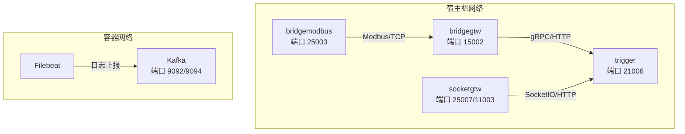
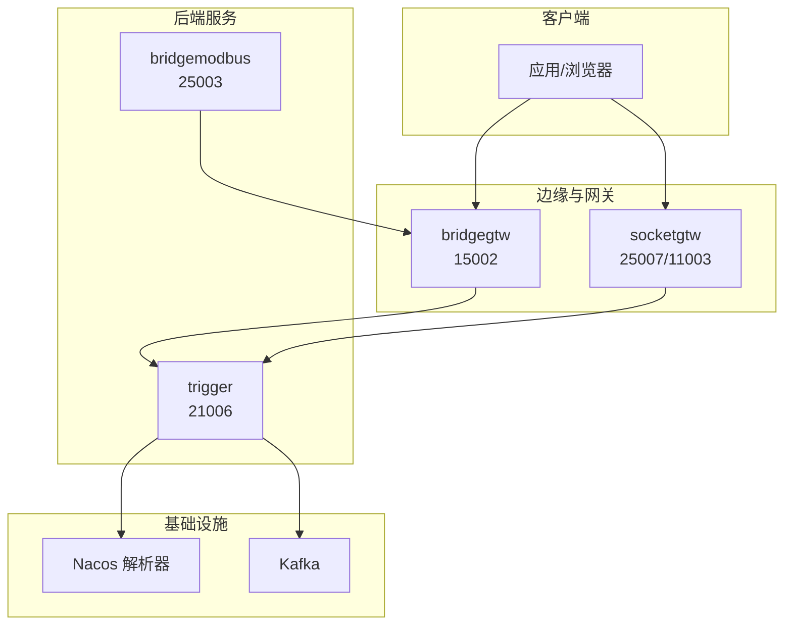
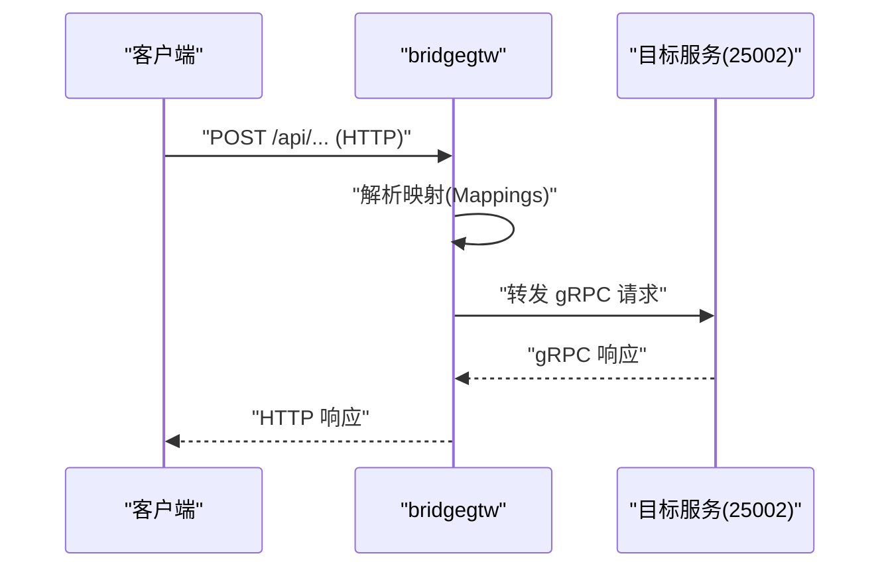
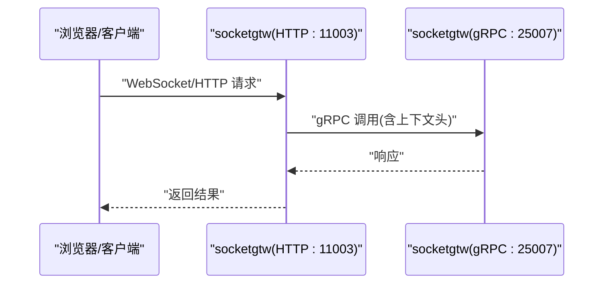
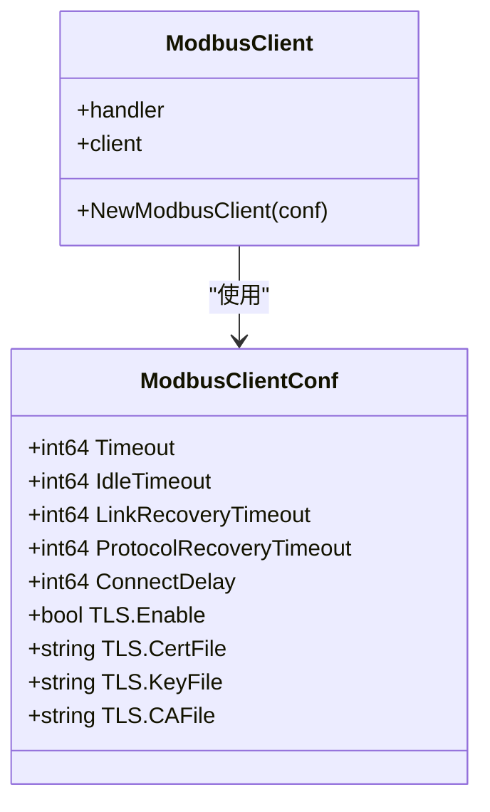
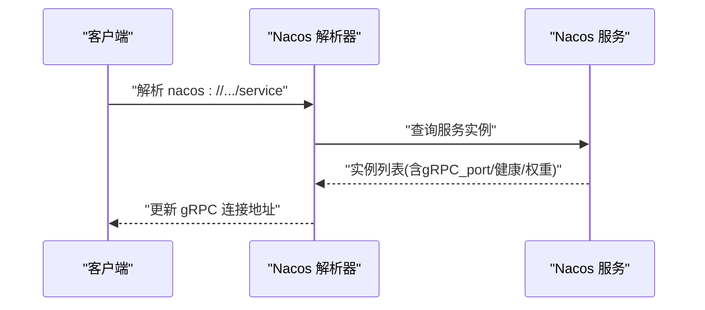
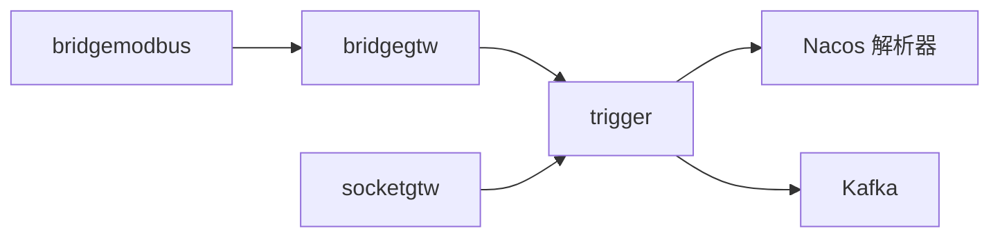
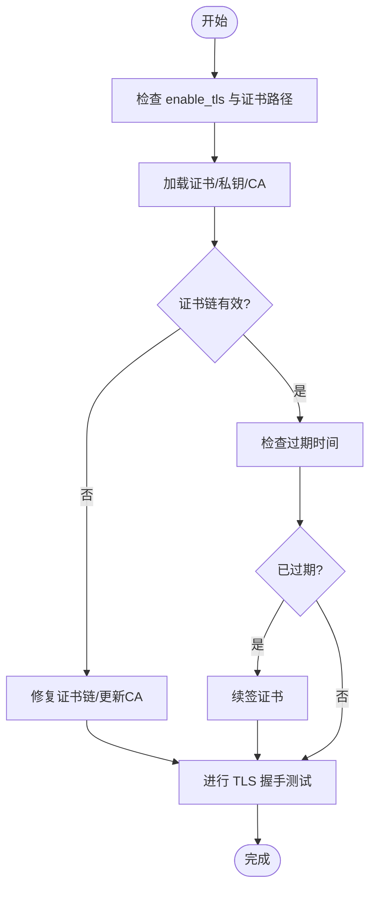

# 网络连接问题

<cite>
**本文引用的文件**
- [README.md](file://README.md)
- [docker-compose.yml](file://deploy/docker-compose.yml)
- [bridgemodbus.yaml](file://app/bridgemodbus/etc/bridgemodbus.yaml)
- [bridgegtw.yaml](file://app/bridgegtw/etc/bridgegtw.yaml)
- [socketgtw.yaml](file://socketapp/socketgtw/etc/socketgtw.yaml)
- [trigger.yaml](file://app/trigger/etc/trigger.yaml)
- [metadataInterceptor.go](file://common/Interceptor/rpcclient/metadataInterceptor.go)
- [loggerInterceptor.go](file://common/Interceptor/rpcserver/loggerInterceptor.go)
- [config.go](file://common/modbusx/config.go)
- [client.go](file://common/modbusx/client.go)
- [modbusslaveconfigmodel_gen.go](file://model/modbusslaveconfigmodel_gen.go)
- [builder.go](file://common/nacosx/builder.go)
- [resolver.go](file://common/nacosx/resolver.go)
- [lalproxy_grpc.pb.go](file://app/lalproxy/lalproxy/lalproxy_grpc.pb.go)
- [streamevent.pb.validate.go](file://facade/streamevent/streamevent/streamevent.pb.validate.go)
</cite>

## 目录
1. [简介](#简介)
2. [项目结构](#项目结构)
3. [核心组件](#核心组件)
4. [架构总览](#架构总览)
5. [详细组件分析](#详细组件分析)
6. [依赖分析](#依赖分析)
7. [性能考虑](#性能考虑)
8. [故障排除指南](#故障排除指南)
9. [结论](#结论)
10. [附录](#附录)

## 简介
本指南聚焦于网络连接问题的系统化故障排除，结合仓库中的实际服务与配置，围绕以下主题展开：
- 防火墙与端口配置：端口连通性测试、安全组与网络 ACL 的验证方法
- DNS 解析问题：域名解析测试、DNS 服务器配置与缓存清理
- TLS 证书问题：证书链验证、过期时间检查与证书格式验证
- 网络延迟与丢包：路径跟踪、带宽监控与 MTU 检查
- 代理与负载均衡：代理配置验证、健康检查与故障转移测试
- 网络性能优化：连接池、超时参数与网络参数调优

## 项目结构
本项目采用 go-zero 微服务架构，包含多种协议接入与服务治理能力。网络相关的关键位置包括：
- 服务监听与端口：各服务配置文件中定义 ListenOn/Host:Port
- 代理与网关：bridgegtw 提供 gRPC/HTTP 聚合与上游路由
- 实时通信：socketgtw 提供 SocketIO 网关与 HTTP 端口
- 协议桥接：bridgemodbus 支持 Modbus/TCP 并内置 TLS 配置
- 服务发现：Nacos 解析器负责 gRPC 实例解析与健康检查
- Docker 编排：docker-compose 使用 host 网络模式简化容器间通信

**图表来源**
- [docker-compose.yml:54-109](file://deploy/docker-compose.yml#L54-L109)
- [bridgegtw.yaml:1-40](file://app/bridgegtw/etc/bridgegtw.yaml#L1-L40)
- [socketgtw.yaml:1-37](file://socketapp/socketgtw/etc/socketgtw.yaml#L1-L37)
- [bridgemodbus.yaml:1-26](file://app/bridgemodbus/etc/bridgemodbus.yaml#L1-L26)
- [trigger.yaml:1-37](file://app/trigger/etc/trigger.yaml#L1-L37)

**章节来源**
- [README.md:15-51](file://README.md#L15-L51)
- [docker-compose.yml:1-110](file://deploy/docker-compose.yml#L1-L110)

## 核心组件
- 代理与网关（bridgegtw）
  - 提供 gRPC/HTTP 聚合与上游映射，配置包含 Upstreams、Mappings、Timeout 等
  - 适合用于验证端口可达性与路由正确性
- 实时通信（socketgtw）
  - 提供 SocketIO 服务与 HTTP 端口，便于测试连接与消息收发
- 协议桥接（bridgemodbus）
  - 支持 Modbus/TCP，内置 TLS 配置字段，便于验证证书链与握手
- 服务发现（Nacos）
  - 通过 nacos://scheme 解析 gRPC 实例，包含健康检查与权重过滤
- Docker 编排（host 网络）
  - 容器直接使用宿主机网络，简化端口暴露与连通性验证

**章节来源**
- [bridgegtw.yaml:1-40](file://app/bridgegtw/etc/bridgegtw.yaml#L1-L40)
- [socketgtw.yaml:1-37](file://socketapp/socketgtw/etc/socketgtw.yaml#L1-L37)
- [bridgemodbus.yaml:1-26](file://app/bridgemodbus/etc/bridgemodbus.yaml#L1-L26)
- [builder.go:18-118](file://common/nacosx/builder.go#L18-L118)
- [resolver.go:47-66](file://common/nacosx/resolver.go#L47-L66)

## 架构总览

**图表来源**
- [bridgegtw.yaml:1-40](file://app/bridgegtw/etc/bridgegtw.yaml#L1-L40)
- [socketgtw.yaml:1-37](file://socketapp/socketgtw/etc/socketgtw.yaml#L1-L37)
- [trigger.yaml:1-37](file://app/trigger/etc/trigger.yaml#L1-L37)
- [docker-compose.yml:54-109](file://deploy/docker-compose.yml#L54-L109)

## 详细组件分析

### 组件A：代理与网关（bridgegtw）
- 端口与路由
  - 监听端口：15002（HTTP/gRPC）
  - Upstreams 指向本地 25002（目标服务端口）
  - Mappings 将 HTTP 路径映射到 gRPC 方法
- 故障排除要点
  - 使用 telnet/nc/nmap 验证 15002/25002 端口连通性
  - 检查 Mappings 中的 Method/Path/RpcPath 是否匹配
  - 关注 Timeout 配置对请求耗时的影响

**图表来源**
- [bridgegtw.yaml:25-40](file://app/bridgegtw/etc/bridgegtw.yaml#L25-L40)

**章节来源**
- [bridgegtw.yaml:1-40](file://app/bridgegtw/etc/bridgegtw.yaml#L1-L40)

### 组件B：实时通信（socketgtw）
- 端口与功能
  - gRPC 监听：25007
  - HTTP 监听：11003（用于 SocketIO/HTTP）
- 故障排除要点
  - 验证 25007/11003 端口连通性
  - 检查 SocketMetaData 与 StreamEventConf 配置
  - 结合拦截器验证上下文头传递

**图表来源**
- [socketgtw.yaml:1-37](file://socketapp/socketgtw/etc/socketgtw.yaml#L1-L37)
- [metadataInterceptor.go:11-32](file://common/Interceptor/rpcclient/metadataInterceptor.go#L11-L32)
- [loggerInterceptor.go:12-44](file://common/Interceptor/rpcserver/loggerInterceptor.go#L12-L44)

**章节来源**
- [socketgtw.yaml:1-37](file://socketapp/socketgtw/etc/socketgtw.yaml#L1-L37)
- [metadataInterceptor.go:1-56](file://common/Interceptor/rpcclient/metadataInterceptor.go#L1-L56)
- [loggerInterceptor.go:1-45](file://common/Interceptor/rpcserver/loggerInterceptor.go#L1-L45)

### 组件C：协议桥接（bridgemodbus）
- TLS 配置
  - 支持 enable_tls、tls_cert_file、tls_key_file、tls_ca_file
  - 客户端在建立 TCP 连接后可选择启用 TLS 握手
- 故障排除要点
  - 验证证书链完整性与有效期
  - 检查证书/密钥文件路径与权限
  - 对比配置模型与数据库字段一致性

**图表来源**
- [config.go:45-61](file://common/modbusx/config.go#L45-L61)
- [client.go:106-143](file://common/modbusx/client.go#L106-L143)
- [modbusslaveconfigmodel_gen.go:71-81](file://model/modbusslaveconfigmodel_gen.go#L71-L81)

**章节来源**
- [config.go:45-61](file://common/modbusx/config.go#L45-L61)
- [client.go:106-143](file://common/modbusx/client.go#L106-L143)
- [modbusslaveconfigmodel_gen.go:71-81](file://model/modbusslaveconfigmodel_gen.go#L71-L81)

### 组件D：服务发现与负载均衡（Nacos）
- 解析机制
  - 通过 nacos://schema 解析 gRPC 实例
  - 过滤健康且启用的服务实例，并按权重排序
- 故障排除要点
  - 确认 Nacos 地址与命名空间配置
  - 检查服务元数据中 gRPC_port 字段
  - 观察实例健康状态与权重变化

**图表来源**
- [builder.go:29-118](file://common/nacosx/builder.go#L29-L118)
- [resolver.go:47-66](file://common/nacosx/resolver.go#L47-L66)

**章节来源**
- [builder.go:1-138](file://common/nacosx/builder.go#L1-L138)
- [resolver.go:47-66](file://common/nacosx/resolver.go#L47-L66)

## 依赖分析
- 组件耦合
  - bridgegtw 依赖目标后端服务（如 trigger）的 gRPC 端口
  - socketgtw 与 trigger 通过 gRPC 交互，受 Nacos 解析影响
  - bridgemodbus 作为上游服务被 bridgegtw 转发
- 外部依赖
  - Kafka/Redis/数据库等基础设施通过 docker-compose 编排
  - Nacos 用于服务发现与健康检查

**图表来源**
- [bridgegtw.yaml:25-40](file://app/bridgegtw/etc/bridgegtw.yaml#L25-L40)
- [socketgtw.yaml:30-37](file://socketapp/socketgtw/etc/socketgtw.yaml#L30-L37)
- [trigger.yaml:29-37](file://app/trigger/etc/trigger.yaml#L29-L37)
- [docker-compose.yml:54-109](file://deploy/docker-compose.yml#L54-L109)

**章节来源**
- [bridgegtw.yaml:1-40](file://app/bridgegtw/etc/bridgegtw.yaml#L1-L40)
- [socketgtw.yaml:1-37](file://socketapp/socketgtw/etc/socketgtw.yaml#L1-L37)
- [trigger.yaml:1-37](file://app/trigger/etc/trigger.yaml#L1-L37)
- [docker-compose.yml:1-110](file://deploy/docker-compose.yml#L1-L110)

## 性能考虑
- 连接池与超时
  - bridgemodbus 的 ModbusPool 控制连接池大小
  - 各服务的 Timeout 配置影响请求耗时与资源占用
- 负载均衡与健康检查
  - Nacos 解析器过滤健康实例，提升可用性
- 网络参数
  - Docker 使用 host 网络减少 NAT/转发开销
  - 建议在生产环境评估 MTU、TCP 窗口与拥塞控制参数

[本节为通用指导，无需列出章节来源]

## 故障排除指南

### 一、防火墙与端口配置
- 端口连通性测试
  - 在客户端使用 telnet/nc/nmap 测试 15002、25002、25003、21006、25007、11003
  - 若宿主机防火墙开启，确保放行上述端口
- 安全组与网络 ACL
  - 在云环境中检查安全组/ACL 规则，允许来自客户端源地址的入站访问
  - 确保出站规则允许访问下游服务（如 Kafka/Redis/Nacos）
- Docker 编排
  - docker-compose 使用 host 网络，避免容器间网络叠加导致的连通性问题

**章节来源**
- [bridgegtw.yaml:1-40](file://app/bridgegtw/etc/bridgegtw.yaml#L1-L40)
- [socketgtw.yaml:1-37](file://socketapp/socketgtw/etc/socketgtw.yaml#L1-L37)
- [bridgemodbus.yaml:1-26](file://app/bridgemodbus/etc/bridgemodbus.yaml#L1-L26)
- [trigger.yaml:1-37](file://app/trigger/etc/trigger.yaml#L1-L37)
- [docker-compose.yml:54-109](file://deploy/docker-compose.yml#L54-L109)

### 二、DNS 解析问题
- 域名解析测试
  - 使用 nslookup/dig/host 检查域名到 IP 的解析
  - 验证解析结果与预期一致
- DNS 服务器配置
  - 检查 /etc/resolv.conf 或 systemd-resolved 配置
  - 在容器内确认 /etc/hosts 或 CoreDNS 配置
- 缓存清理
  - 清理本地 DNS 缓存（如 systemd-resolve cache flush）
  - 在容器内重启相关服务或重建容器以清除缓存

[本节为通用指导，无需列出章节来源]

### 三、TLS 证书问题
- 证书链验证
  - 使用 openssl s_client 检查 bridgemodbus 的 TLS 握手与证书链
  - 确认中间证书与根证书完整
- 过期时间检查
  - 检查证书有效期，提前续签
- 证书格式验证
  - 确保证书/私钥 PEM 格式正确，权限设置合理
  - 对照配置模型字段与数据库记录的一致性

**图表来源**
- [client.go:106-143](file://common/modbusx/client.go#L106-L143)
- [config.go:55-60](file://common/modbusx/config.go#L55-L60)
- [modbusslaveconfigmodel_gen.go:71-81](file://model/modbusslaveconfigmodel_gen.go#L71-L81)

**章节来源**
- [client.go:106-143](file://common/modbusx/client.go#L106-L143)
- [config.go:45-61](file://common/modbusx/config.go#L45-L61)
- [modbusslaveconfigmodel_gen.go:71-81](file://model/modbusslaveconfigmodel_gen.go#L71-L81)

### 四、网络延迟与丢包
- 路径跟踪
  - 使用 traceroute/mtr 追踪到下游服务（如 Kafka/Redis/Nacos）的路径
- 带宽监控
  - 结合系统监控工具观察 CPU/内存/网络 I/O
- MTU 检查
  - 确认 MTU 与网络路径一致，避免分片与重组开销

[本节为通用指导，无需列出章节来源]

### 五、代理与负载均衡
- 代理配置验证
  - 检查 bridgegtw 的 Upstreams 与 Mappings，确保路径与方法匹配
  - 验证 Timeout 设置是否合理
- 健康检查机制
  - 依赖 Nacos 解析器过滤健康实例，关注 gRPC_port 与健康状态
- 故障转移测试
  - 模拟实例下线，验证解析器能否切换到其他健康实例

**章节来源**
- [bridgegtw.yaml:1-40](file://app/bridgegtw/etc/bridgegtw.yaml#L1-L40)
- [builder.go:120-138](file://common/nacosx/builder.go#L120-L138)
- [resolver.go:47-66](file://common/nacosx/resolver.go#L47-L66)

### 六、网络性能优化
- 连接池配置
  - 根据并发与下游服务能力调整 bridgemodbus 的 ModbusPool
- 超时参数调整
  - 合理设置各服务的 Timeout，避免过短导致频繁超时，过长导致资源占用
- 网络参数调优
  - 在宿主机层面调整 TCP 参数（如窗口、拥塞控制），结合监控指标评估效果

[本节为通用指导，无需列出章节来源]

## 结论
本指南基于仓库中的服务配置与实现，提供了从端口连通性、DNS 解析、TLS 证书到代理与负载均衡的系统化故障排除方法。建议在生产环境中结合监控与日志，持续验证服务发现与网络参数，确保稳定与高性能。

[本节为总结性内容，无需列出章节来源]

## 附录
- gRPC 接口参考
  - lalproxy 提供 KickSession、StartRtpPub、AddIpBlacklist 等接口
  - streamevent 的验证逻辑可用于接口契约一致性检查

**章节来源**
- [lalproxy_grpc.pb.go:174-189](file://app/lalproxy/lalproxy/lalproxy_grpc.pb.go#L174-L189)
- [streamevent.pb.validate.go:3298-3346](file://facade/streamevent/streamevent/streamevent.pb.validate.go#L3298-L3346)