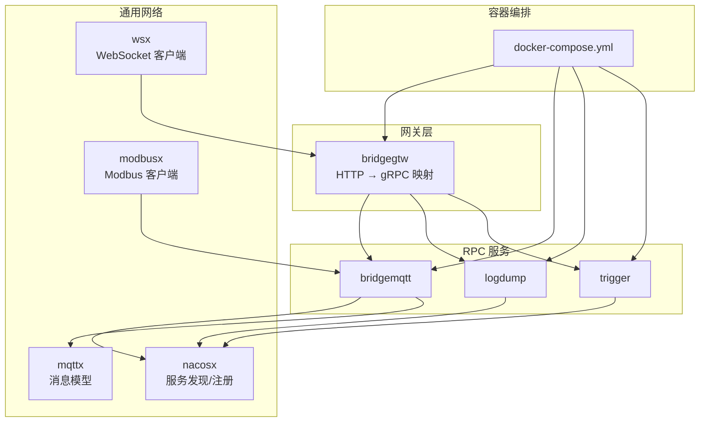
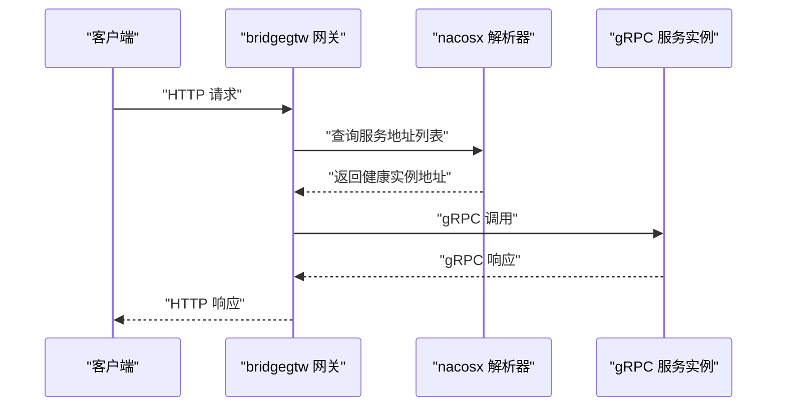
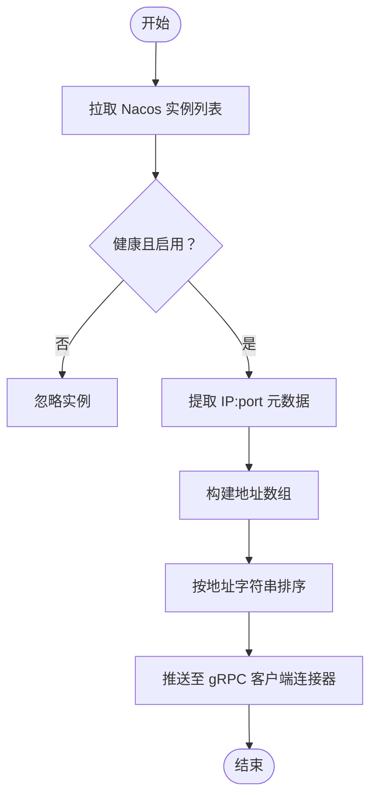
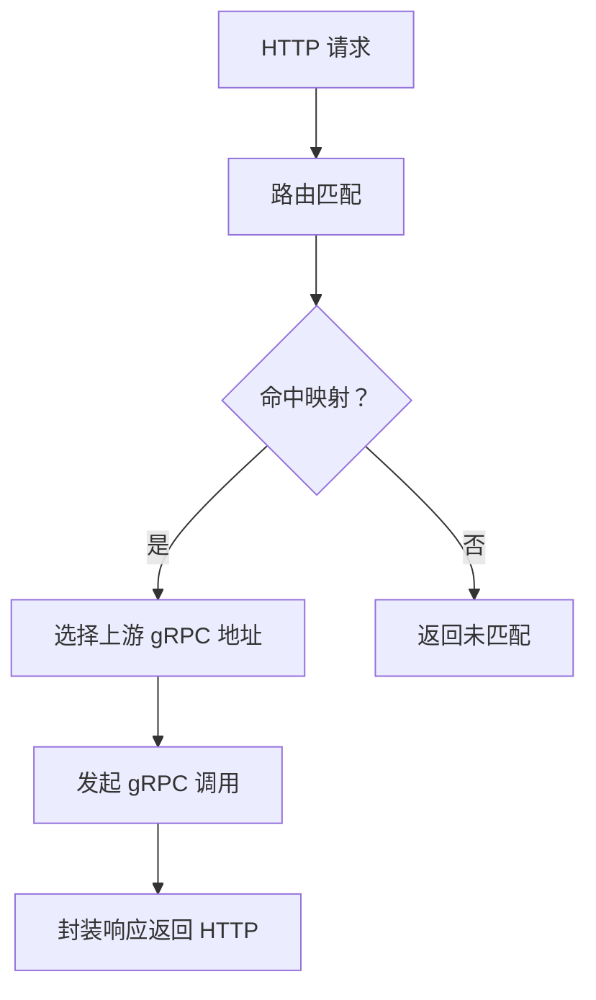
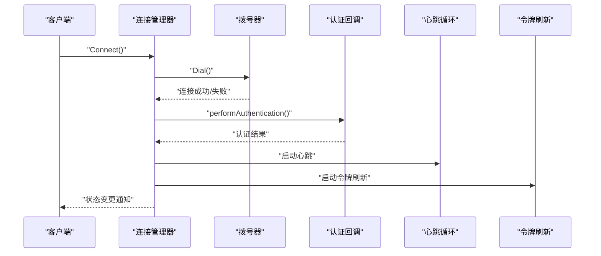
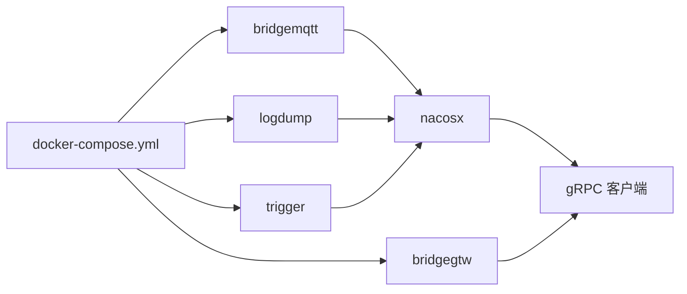

# 网络连接问题

<cite>
**本文引用的文件**   
- [common/nacosx/resolver.go](file://common/nacosx/resolver.go)
- [common/nacosx/register.go](file://common/nacosx/register.go)
- [common/nacosx/options.go](file://common/nacosx/options.go)
- [common/nacosx/target.go](file://common/nacosx/target.go)
- [common/wsx/client.go](file://common/wsx/client.go)
- [common/mqttx/message.go](file://common/mqttx/message.go)
- [common/modbusx/client.go](file://common/modbusx/client.go)
- [app/bridgegtw/etc/bridgegtw.yaml](file://app/bridgegtw/etc/bridgegtw.yaml)
- [app/bridgemqtt/etc/bridgemqtt.yaml](file://app/bridgemqtt/etc/bridgemqtt.yaml)
- [deploy/docker-compose.yml](file://deploy/docker-compose.yml)
- [zerorpc/etc/zerorpc.yaml](file://zerorpc/etc/zerorpc.yaml)
- [zerorpc/internal/config/config.go](file://zerorpc/internal/config/config.go)
</cite>

## 目录
1. [简介](#简介)
2. [项目结构](#项目结构)
3. [核心组件](#核心组件)
4. [架构总览](#架构总览)
5. [详细组件分析](#详细组件分析)
6. [依赖分析](#依赖分析)
7. [性能考量](#性能考量)
8. [故障排除指南](#故障排除指南)
9. [结论](#结论)
10. [附录](#附录)

## 简介
本指南聚焦 zero-service 中的服务间网络连接问题，围绕以下场景提供系统化的诊断与修复路径：
- gRPC 连接问题（含服务发现与地址解析）
- HTTP 请求超时（含网关与上游映射）
- WebSocket 断开连接（含心跳、认证与重连）
- DNS 解析问题（含域名解析测试、DNS 服务器配置与缓存清理）
- 防火墙与安全组配置（端口开放、IP 白名单、协议限制）
- TLS 证书问题（证书链验证、过期检查与更新）
- 代理与负载均衡问题（代理配置验证、健康检查与故障转移）
- 网络延迟与丢包（ping、traceroute 与网络分析）
- 容器网络问题（Docker 网络模式、端口映射与网络策略）

## 项目结构
本项目采用多模块微服务架构，包含：
- 网关层：如 bridgegtw，负责 HTTP 到 gRPC 的映射与转发
- RPC 服务：如 bridgemqtt、logdump、trigger 等，提供具体业务能力
- 通用网络与中间件：nacosx（服务注册与发现）、wsx（WebSocket 客户端）、mqttx（MQTT 消息模型）、modbusx（Modbus 客户端）
- 容器编排：docker-compose 使用 host 网络模式部署各服务
- 配置中心：各服务通过 etc 下的 YAML 文件进行网络参数配置

**图表来源**
- [deploy/docker-compose.yml:54-109](file://deploy/docker-compose.yml#L54-L109)
- [app/bridgegtw/etc/bridgegtw.yaml:12-40](file://app/bridgegtw/etc/bridgegtw.yaml#L12-L40)
- [app/bridgemqtt/etc/bridgemqtt.yaml:11-48](file://app/bridgemqtt/etc/bridgemqtt.yaml#L11-L48)

**章节来源**
- [deploy/docker-compose.yml:1-110](file://deploy/docker-compose.yml#L1-110)
- [app/bridgegtw/etc/bridgegtw.yaml:1-40](file://app/bridgegtw/etc/bridgegtw.yaml#L1-L40)
- [app/bridgemqtt/etc/bridgemqtt.yaml:1-48](file://app/bridgemqtt/etc/bridgemqtt.yaml#L1-L48)

## 核心组件
- 服务发现与地址解析：nacosx 提供服务注册、实例过滤与地址推送，支撑 gRPC 客户端的动态地址列表
- gRPC 网关：bridgegtw 将 HTTP 请求映射到 gRPC 方法，配置中包含上游 gRPC 地址与映射规则
- WebSocket 客户端：wsx 提供心跳、认证、重连、令牌刷新等机制，适配长连接场景
- MQTT 消息模型：mqttx 定义消息结构，便于跨模块传递消息头与载荷
- Modbus 客户端：modbusx 支持 TLS 连接与超时控制，适用于工业协议场景
- 容器网络：docker-compose 使用 host 网络模式，简化端口暴露与服务互联

**章节来源**
- [common/nacosx/resolver.go:38-66](file://common/nacosx/resolver.go#L38-L66)
- [common/nacosx/register.go:21-76](file://common/nacosx/register.go#L21-L76)
- [app/bridgegtw/etc/bridgegtw.yaml:25-40](file://app/bridgegtw/etc/bridgegtw.yaml#L25-L40)
- [common/wsx/client.go:302-445](file://common/wsx/client.go#L302-L445)
- [common/mqttx/message.go:1-30](file://common/mqttx/message.go#L1-L30)
- [common/modbusx/client.go:106-143](file://common/modbusx/client.go#L106-L143)
- [deploy/docker-compose.yml:63-75](file://deploy/docker-compose.yml#L63-L75)

## 架构总览
下图展示从客户端到网关、再到 gRPC 服务的典型调用链，以及服务发现与地址推送的关键节点。

**图表来源**
- [common/nacosx/resolver.go:47-66](file://common/nacosx/resolver.go#L47-L66)
- [app/bridgegtw/etc/bridgegtw.yaml:25-40](file://app/bridgegtw/etc/bridgegtw.yaml#L25-L40)

## 详细组件分析

### 组件一：服务发现与地址解析（nacosx）
- 功能要点
  - 监听 Nacos 实例变更，过滤健康且启用的实例，并提取 gRPC 端口元数据
  - 将实例地址排序后推送到 gRPC 客户端连接器，避免重复地址
  - 提供回调处理与上下文取消，保证资源释放

**图表来源**
- [common/nacosx/resolver.go:38-66](file://common/nacosx/resolver.go#L38-L66)

**章节来源**
- [common/nacosx/resolver.go:13-74](file://common/nacosx/resolver.go#L13-L74)
- [common/nacosx/register.go:21-76](file://common/nacosx/register.go#L21-L76)
- [common/nacosx/options.go:10-72](file://common/nacosx/options.go#L10-L72)
- [common/nacosx/target.go:30-79](file://common/nacosx/target.go#L30-L79)

### 组件二：gRPC 网关（bridgegtw）
- 功能要点
  - 配置上游 gRPC 地址集合与映射规则，将 HTTP 路径映射到 gRPC 方法
  - 支持非阻塞调用与超时控制，便于跨服务转发

**图表来源**
- [app/bridgegtw/etc/bridgegtw.yaml:25-40](file://app/bridgegtw/etc/bridgegtw.yaml#L25-L40)

**章节来源**
- [app/bridgegtw/etc/bridgegtw.yaml:1-40](file://app/bridgegtw/etc/bridgegtw.yaml#L1-L40)

### 组件三：WebSocket 客户端（wsx）
- 功能要点
  - 连接生命周期管理：拨号、认证、心跳、重连、令牌刷新
  - 超时与背压：写入/读取超时、指数退避重连、最大重连间隔
  - 回调扩展：消息处理、状态变更、心跳内容、令牌刷新

**图表来源**
- [common/wsx/client.go:386-445](file://common/wsx/client.go#L386-L445)
- [common/wsx/client.go:538-571](file://common/wsx/client.go#L538-L571)
- [common/wsx/client.go:640-697](file://common/wsx/client.go#L640-L697)
- [common/wsx/client.go:699-763](file://common/wsx/client.go#L699-L763)

**章节来源**
- [common/wsx/client.go:208-275](file://common/wsx/client.go#L208-L275)
- [common/wsx/client.go:302-445](file://common/wsx/client.go#L302-L445)
- [common/wsx/client.go:447-535](file://common/wsx/client.go#L447-L535)
- [common/wsx/client.go:579-633](file://common/wsx/client.go#L579-L633)
- [common/wsx/client.go:640-763](file://common/wsx/client.go#L640-L763)

### 组件四：MQTT 消息模型（mqttx）
- 功能要点
  - 定义消息结构与头部容器，支持在不同模块间传递消息与元数据

**章节来源**
- [common/mqttx/message.go:1-30](file://common/mqttx/message.go#L1-L30)

### 组件五：Modbus 客户端（modbusx）
- 功能要点
  - 支持 TLS 连接、超时与恢复策略配置
  - 提供连接池与日志记录，便于运维观测

**章节来源**
- [common/modbusx/client.go:106-143](file://common/modbusx/client.go#L106-L143)
- [common/modbusx/client.go:145-191](file://common/modbusx/client.go#L145-L191)
- [common/modbusx/client.go:193-218](file://common/modbusx/client.go#L193-L218)

## 依赖分析
- 服务发现依赖
  - nacosx 依赖 go-zero 日志与 grpc resolver 接口，负责将 Nacos 实例转换为 gRPC 地址列表
- 网关依赖
  - bridgegtw 依赖 gRPC 客户端配置与 Proto 映射，实现 HTTP → gRPC 转发
- 容器网络依赖
  - docker-compose 使用 host 网络模式，要求宿主机防火墙与端口策略与服务配置一致

**图表来源**
- [common/nacosx/resolver.go:47-66](file://common/nacosx/resolver.go#L47-L66)
- [app/bridgegtw/etc/bridgegtw.yaml:25-40](file://app/bridgegtw/etc/bridgegtw.yaml#L25-L40)
- [deploy/docker-compose.yml:63-75](file://deploy/docker-compose.yml#L63-L75)

**章节来源**
- [common/nacosx/resolver.go:13-74](file://common/nacosx/resolver.go#L13-L74)
- [app/bridgegtw/etc/bridgegtw.yaml:1-40](file://app/bridgegtw/etc/bridgegtw.yaml#L1-L40)
- [deploy/docker-compose.yml:1-110](file://deploy/docker-compose.yml#L1-L110)

## 性能考量
- gRPC 连接抖动与地址频繁变更可能导致客户端重连开销增大，建议优化服务实例健康检查频率与权重策略
- WebSocket 心跳间隔与认证超时应与网络质量匹配，避免频繁误判断开
- Modbus/TLS 连接超时与恢复策略需结合设备响应特性调整
- 网关上游并发与超时配置应与下游服务能力匹配，防止级联阻塞

## 故障排除指南

### 一、gRPC 连接问题
- 症状
  - 客户端连接失败、超时或连接后立即断开
- 诊断步骤
  - 检查服务发现配置：确认 Nacos 地址、命名空间、服务名与元数据键（如 gRPC 端口）正确
  - 查看地址推送：确认解析器是否推送了健康实例地址
  - 核对网关映射：确认 bridgegtw 的上游地址与映射规则
  - 观察容器网络：确认 docker-compose 使用 host 模式且端口未冲突
- 修复建议
  - 在服务端配置正确的 ListenOn 与 Metadata（含 gRPC 端口）
  - 在客户端启用健康实例过滤与地址排序，避免重复地址
  - 在网关侧开启非阻塞调用与合理超时，避免阻塞传播

**章节来源**
- [common/nacosx/resolver.go:38-66](file://common/nacosx/resolver.go#L38-L66)
- [common/nacosx/register.go:21-76](file://common/nacosx/register.go#L21-L76)
- [app/bridgegtw/etc/bridgegtw.yaml:25-40](file://app/bridgegtw/etc/bridgegtw.yaml#L25-L40)
- [deploy/docker-compose.yml:63-75](file://deploy/docker-compose.yml#L63-L75)

### 二、HTTP 请求超时
- 症状
  - 网关到上游 gRPC 调用超时
- 诊断步骤
  - 检查 bridgegtw 的 Upstreams 与映射配置
  - 确认上游 gRPC 服务监听端口与可达性
  - 核对超时参数（请求超时、连接超时、读写超时）
- 修复建议
  - 调整 bridgegtw 的超时配置以匹配下游处理耗时
  - 优化上游服务性能或增加副本数

**章节来源**
- [app/bridgegtw/etc/bridgegtw.yaml:11-40](file://app/bridgegtw/etc/bridgegtw.yaml#L11-L40)

### 三、WebSocket 断开连接
- 症状
  - 连接短暂可用后断开；认证失败；重连频繁
- 诊断步骤
  - 检查握手超时、心跳间隔与认证超时配置
  - 观察状态回调与日志，定位断开原因（认证失败、令牌过期、网络抖动）
  - 确认服务端 WebSocket 服务可用与端口开放
- 修复建议
  - 调整握手与认证超时，启用指数退避与最大重连间隔
  - 在认证失败时决定是否重连，必要时触发令牌刷新

**章节来源**
- [common/wsx/client.go:208-275](file://common/wsx/client.go#L208-L275)
- [common/wsx/client.go:302-445](file://common/wsx/client.go#L302-L445)
- [common/wsx/client.go:538-571](file://common/wsx/client.go#L538-L571)
- [common/wsx/client.go:640-697](file://common/wsx/client.go#L640-L697)
- [common/wsx/client.go:699-763](file://common/wsx/client.go#L699-L763)

### 四、DNS 解析问题
- 症状
  - 服务名无法解析、解析缓慢或解析结果不一致
- 诊断步骤
  - 使用 nslookup/dig 测试域名解析
  - 检查本地 DNS 服务器配置与缓存
  - 在容器内使用 nslookup/dig 验证解析行为
- 修复建议
  - 更换可靠 DNS 服务器或使用内网 DNS 缓存
  - 清理系统与容器 DNS 缓存
  - 在服务配置中固定 IP 或使用服务发现替代 DNS

**章节来源**
- [common/nacosx/target.go:30-79](file://common/nacosx/target.go#L30-L79)

### 五、防火墙与安全组配置
- 检查清单
  - 开放端口：确认宿主机与容器暴露端口均开放
  - IP 白名单：仅允许必要的源地址访问
  - 协议限制：区分 TCP/UDP 与应用协议（gRPC/HTTP/WebSocket）
  - 网络隔离：host 网络模式下无需 Docker 网络策略，但需关注宿主机策略
- 修复建议
  - 与运维核对防火墙规则与安全组策略
  - 使用 telnet/nc 验证端口连通性

**章节来源**
- [deploy/docker-compose.yml:63-75](file://deploy/docker-compose.yml#L63-L75)

### 六、TLS 证书问题
- 症状
  - 握手失败、证书链验证错误、证书过期
- 诊断步骤
  - 使用 openssl s_client 验证证书链与过期时间
  - 检查客户端 CA 与服务端证书一致性
- 修复建议
  - 更新过期证书与中间证书
  - 确保客户端 RootCAs 与服务端证书链匹配

**章节来源**
- [common/modbusx/client.go:106-143](file://common/modbusx/client.go#L106-L143)

### 七、代理与负载均衡问题
- 症状
  - 请求转发失败、健康检查异常、故障转移无效
- 诊断步骤
  - 核对代理配置（上游地址、超时、重试）
  - 检查健康检查端点与阈值
  - 执行故障转移测试，验证备用节点
- 修复建议
  - 调整健康检查与超时参数
  - 在网关侧启用非阻塞调用与熔断策略

**章节来源**
- [app/bridgegtw/etc/bridgegtw.yaml:25-40](file://app/bridgegtw/etc/bridgegtw.yaml#L25-L40)

### 八、网络延迟与丢包
- 方法
  - 使用 ping/iperf3 测量往返时延与吞吐
  - 使用 traceroute/ip route 追踪路径
  - 结合系统监控（CPU/内存/网络队列）定位瓶颈
- 建议
  - 优化网络拓扑与路由策略
  - 减少跨机房传输距离

**章节来源**
- [deploy/docker-compose.yml:63-75](file://deploy/docker-compose.yml#L63-L75)

### 九、容器网络问题
- 症状
  - 容器间无法互通、端口映射冲突、host 网络模式下端口占用
- 诊断步骤
  - 检查 docker-compose 的 network_mode 与端口映射
  - 使用 netstat/ss/iptables 检查端口占用与策略
- 修复建议
  - 统一端口规划，避免冲突
  - 使用 host 网络时确保宿主机防火墙策略与服务端口一致

**章节来源**
- [deploy/docker-compose.yml:1-110](file://deploy/docker-compose.yml#L1-L110)

## 结论
通过服务发现、网关映射、WebSocket 生命周期管理与容器网络协同，zero-service 在复杂网络环境中提供了可诊断、可修复的连接保障。建议在生产环境持续完善健康检查、超时与重试策略，并配合监控与告警体系，提升整体稳定性与可观测性。

## 附录
- 配置参考
  - bridgegtw：上游 gRPC 地址与映射
  - bridgemqtt：Nacos 注册与 MQTT 连接配置
  - zerorpc：服务监听与缓存配置

**章节来源**
- [app/bridgegtw/etc/bridgegtw.yaml:1-40](file://app/bridgegtw/etc/bridgegtw.yaml#L1-L40)
- [app/bridgemqtt/etc/bridgemqtt.yaml:1-48](file://app/bridgemqtt/etc/bridgemqtt.yaml#L1-L48)
- [zerorpc/etc/zerorpc.yaml:1-39](file://zerorpc/etc/zerorpc.yaml#L1-L39)
- [zerorpc/internal/config/config.go:1-25](file://zerorpc/internal/config/config.go#L1-L25)