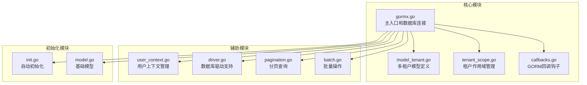
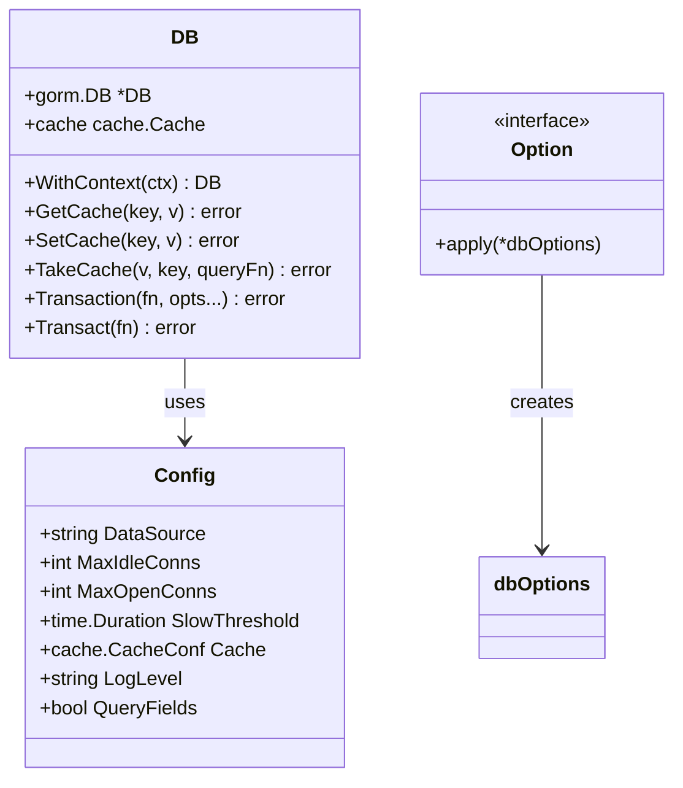
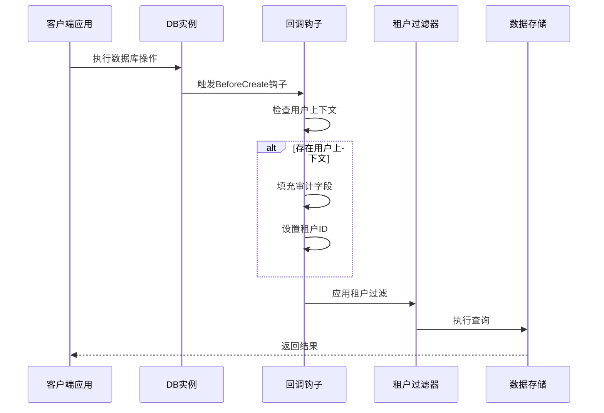
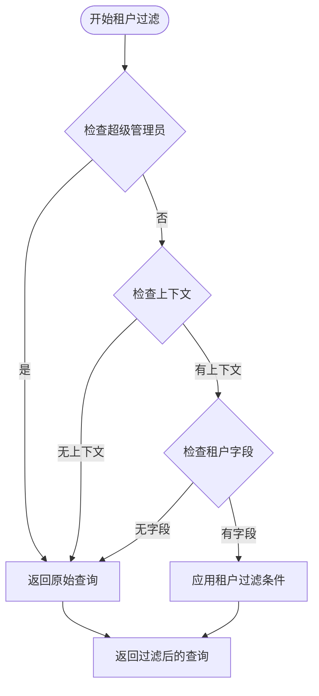
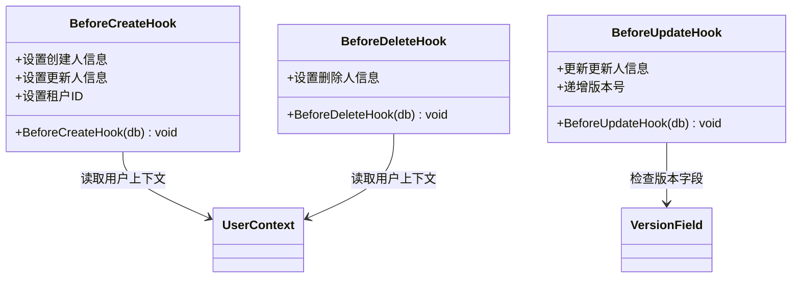
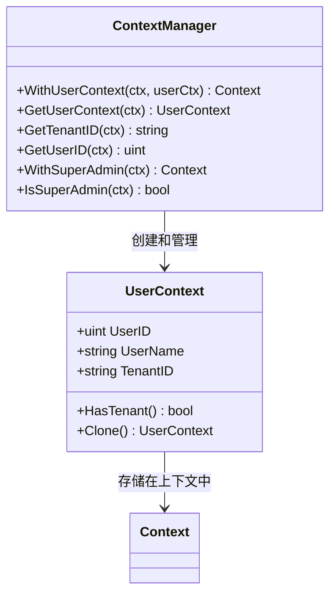
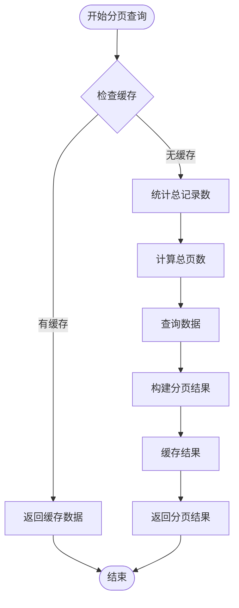
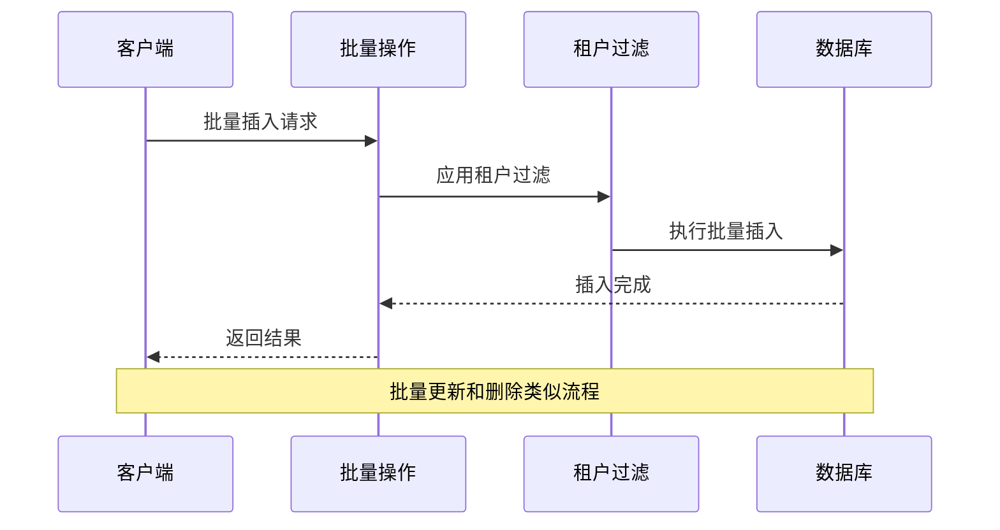
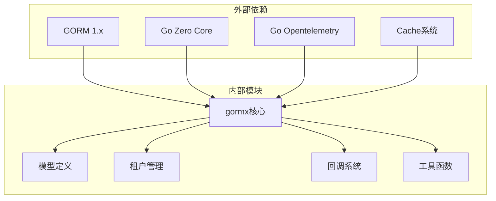

# GORM多租户扩展

<cite>
**本文档引用的文件**
- [gormx.go](file://common/gormx/gormx.go)
- [model_tenant.go](file://common/gormx/model_tenant.go)
- [tenant_scope.go](file://common/gormx/tenant_scope.go)
- [callbacks.go](file://common/gormx/callbacks.go)
- [user_context.go](file://common/gormx/user_context.go)
- [driver.go](file://common/gormx/driver.go)
- [pagination.go](file://common/gormx/pagination.go)
- [batch.go](file://common/gormx/batch.go)
- [init.go](file://common/gormx/init.go)
- [model.go](file://common/gormx/model.go)
</cite>

## 目录
1. [简介](#简介)
2. [项目结构](#项目结构)
3. [核心组件](#核心组件)
4. [架构概览](#架构概览)
5. [详细组件分析](#详细组件分析)
6. [依赖关系分析](#依赖关系分析)
7. [性能考虑](#性能考虑)
8. [故障排除指南](#故障排除指南)
9. [结论](#结论)

## 简介

GORM多租户扩展是基于Go Zero框架开发的一个增强型数据库ORM工具包，专门针对多租户SaaS应用的需求进行了深度优化。该扩展在保持与GORM原生API完全兼容的基础上，提供了丰富的多租户、审计、软删除、分页、批量操作等通用能力。

该项目的核心目标是在不改变现有业务逻辑的前提下，为多租户应用提供透明的数据隔离和管理能力，同时确保与Go Zero生态系统的无缝集成。

## 项目结构

GORM多租户扩展采用模块化设计，主要包含以下核心模块：

**图表来源**
- [gormx.go:1-733](file://common/gormx/gormx.go#L1-L733)
- [model_tenant.go:1-485](file://common/gormx/model_tenant.go#L1-L485)
- [tenant_scope.go:1-224](file://common/gormx/tenant_scope.go#L1-L224)

**章节来源**
- [gormx.go:1-733](file://common/gormx/gormx.go#L1-L733)
- [model_tenant.go:1-485](file://common/gormx/model_tenant.go#L1-L485)

## 核心组件

### 数据库连接管理

GORM多租户扩展提供了灵活的数据库连接管理机制，支持多种数据库类型和连接配置选项。

**图表来源**
- [gormx.go:20-123](file://common/gormx/gormx.go#L20-L123)

### 多租户模型体系

系统提供了完整的多租户模型定义，支持不同的主键类型和功能组合：

| 模型类型 | 主键类型 | 软删除 | 审计字段 | 适用场景 |
|---------|---------|--------|----------|----------|
| TenantModel | uint | ✅ | ✅ | 标准多租户应用 |
| TenantIntIDModel | int | ✅ | ✅ | 需要int主键的系统 |
| TenantStringIDModel | string | ✅ | ✅ | 需要UUID主键的应用 |
| TenantTimeModel | string | ❌ | ✅ | 不需要软删除的场景 |
| TenantOnlyModel | uint | ❌ | ❌ | 轻量级多租户 |

**章节来源**
- [model_tenant.go:12-174](file://common/gormx/model_tenant.go#L12-L174)

## 架构概览

GORM多租户扩展采用分层架构设计，通过GORM回调机制实现透明的数据隔离和管理：

**图表来源**
- [callbacks.go:15-33](file://common/gormx/callbacks.go#L15-L33)
- [tenant_scope.go:21-40](file://common/gormx/tenant_scope.go#L21-L40)

## 详细组件分析

### 租户作用域管理

租户作用域是多租户扩展的核心功能，提供了多种过滤模式以适应不同的业务需求：

**图表来源**
- [tenant_scope.go:21-40](file://common/gormx/tenant_scope.go#L21-L40)

系统提供了以下几种租户过滤模式：

1. **标准模式** (`TenantScope`): 普通用户按租户过滤，超级管理员无限制
2. **严格模式** (`TenantScopeStrict`): 强制要求租户ID存在，不存在时返回空结果
3. **包含删除模式** (`TenantScopeWithDelete`): 查看已软删除记录
4. **指定租户模式** (`TenantEq`): 直接指定租户ID进行过滤

**章节来源**
- [tenant_scope.go:42-187](file://common/gormx/tenant_scope.go#L42-L187)

### GORM回调钩子

回调钩子机制实现了数据的自动填充和管理：

**图表来源**
- [callbacks.go:15-57](file://common/gormx/callbacks.go#L15-L57)

回调钩子自动处理以下功能：
- **审计字段填充**: 自动设置创建人、更新人、删除人的ID和姓名
- **租户ID设置**: 自动填充当前用户的租户ID
- **版本控制**: 支持乐观锁的版本号递增
- **软删除支持**: 与GORM原生软删除机制无缝集成

**章节来源**
- [callbacks.go:9-98](file://common/gormx/callbacks.go#L9-L98)

### 用户上下文管理

用户上下文是多租户功能的基础，提供了统一的用户和租户信息管理：

**图表来源**
- [user_context.go:13-135](file://common/gormx/user_context.go#L13-L135)

**章节来源**
- [user_context.go:1-135](file://common/gormx/user_context.go#L1-L135)

### 分页查询功能

系统提供了完整的分页查询解决方案，包括传统分页和游标分页两种模式：

**图表来源**
- [pagination.go:21-46](file://common/gormx/pagination.go#L21-L46)

**章节来源**
- [pagination.go:12-270](file://common/gormx/pagination.go#L12-L270)

### 批量操作支持

多租户环境下的批量操作提供了完整的租户过滤和审计支持：

**图表来源**
- [batch.go:127-210](file://common/gormx/batch.go#L127-L210)

**章节来源**
- [batch.go:1-267](file://common/gormx/batch.go#L1-L267)

## 依赖关系分析

GORM多租户扩展的依赖关系相对简单，主要依赖于GORM和Go Zero框架：

**图表来源**
- [gormx.go:3-18](file://common/gormx/gormx.go#L3-L18)

**章节来源**
- [gormx.go:1-733](file://common/gormx/gormx.go#L1-L733)

## 性能考虑

### 缓存策略

系统内置了智能缓存机制，通过`TakeCache`方法实现缓存穿透防护：

- **缓存键设计**: 使用`buildPageCacheKey`生成标准化的缓存键
- **过期时间**: 默认5分钟缓存过期时间
- **并发安全**: 使用`syncx.NewSingleFlight`避免缓存击穿

### 连接池优化

- **默认连接数**: 最大空闲连接10，最大活跃连接100
- **连接生命周期**: 默认1小时
- **慢查询监控**: 可配置的慢查询阈值（默认200ms）

### 查询优化

- **索引建议**: 租户ID字段自动建立索引
- **条件过滤**: 租户过滤条件自动添加WHERE子句
- **批量操作**: 支持批量插入、更新、删除操作

## 故障排除指南

### 常见问题及解决方案

1. **租户数据隔离失效**
   - 检查是否正确设置了用户上下文
   - 确认模型包含租户字段
   - 验证租户过滤器是否正确应用

2. **审计字段未填充**
   - 确认回调钩子已注册
   - 检查用户上下文中的用户信息
   - 验证模型是否包含相应的审计字段

3. **分页查询性能问题**
   - 检查相关字段是否建立索引
   - 优化查询条件
   - 调整缓存配置

**章节来源**
- [callbacks.go:9-13](file://common/gormx/callbacks.go#L9-L13)
- [tenant_scope.go:21-40](file://common/gormx/tenant_scope.go#L21-L40)

## 结论

GORM多租户扩展通过精心设计的架构和丰富的功能特性，为多租户SaaS应用提供了完整的数据库管理解决方案。其主要优势包括：

- **完全兼容**: 保持与GORM原生API的完全兼容性
- **透明隔离**: 通过回调机制实现透明的数据隔离
- **功能丰富**: 提供多租户、审计、软删除、分页、批量操作等完整功能
- **性能优化**: 内置缓存、连接池优化等性能提升措施
- **易于使用**: 简洁的API设计和完善的错误处理机制

该扩展特别适合需要快速构建多租户应用的开发团队，能够在保证功能完整性的同时，最大程度减少开发成本和维护复杂度。