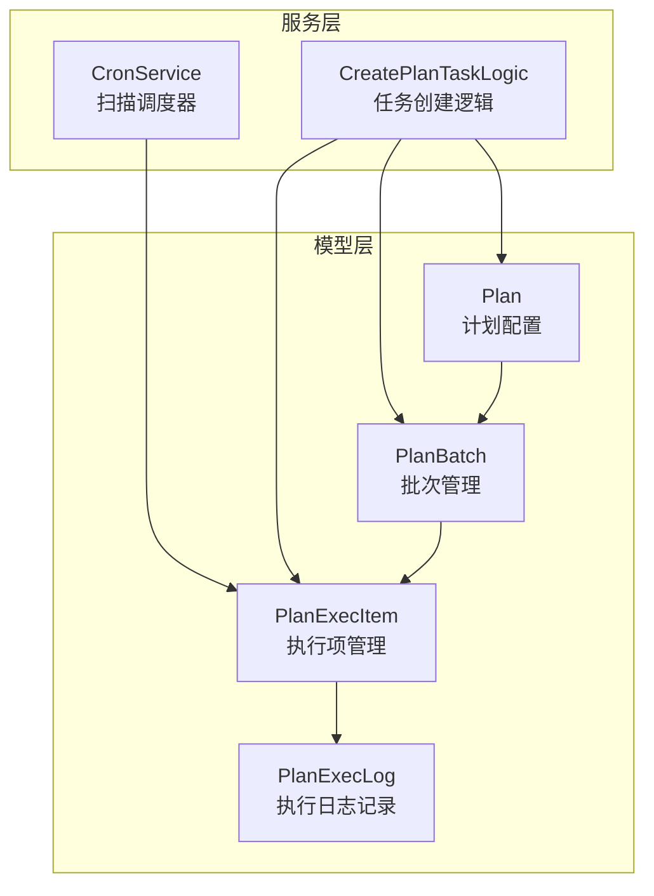
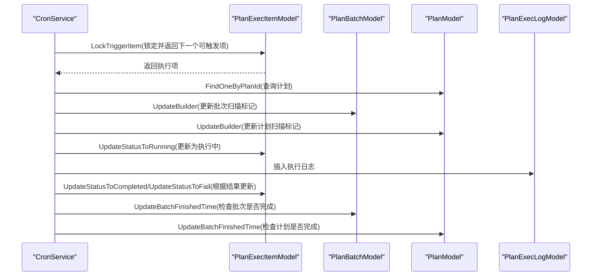
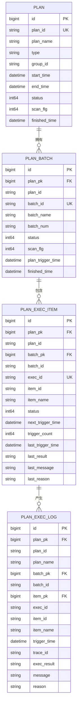
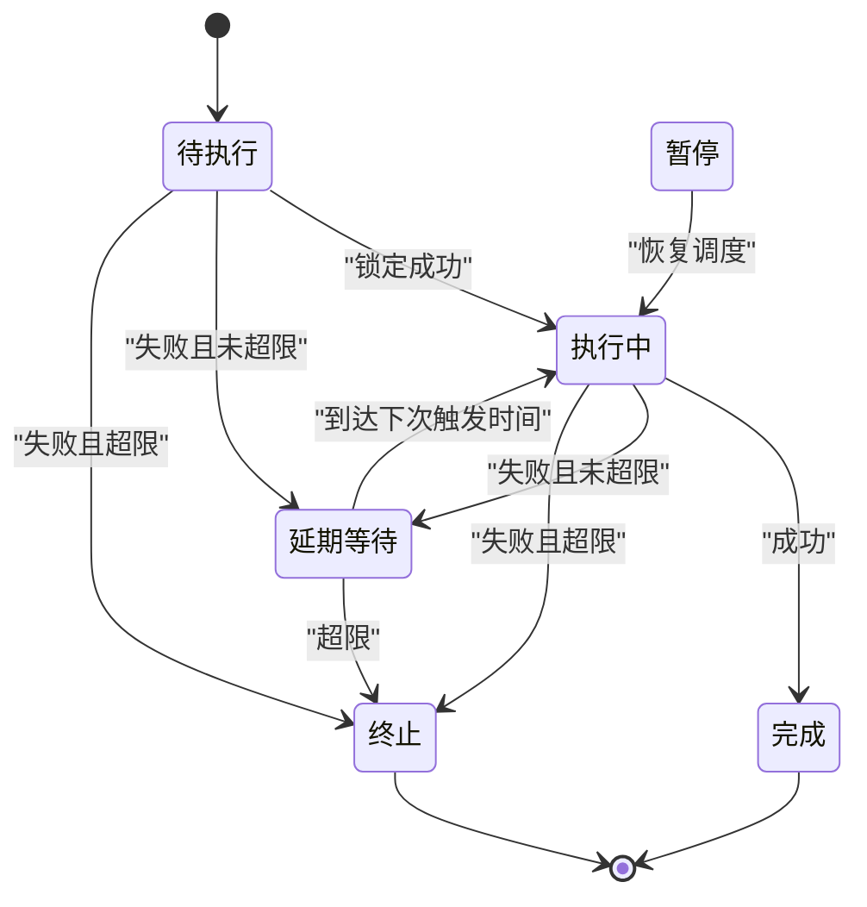
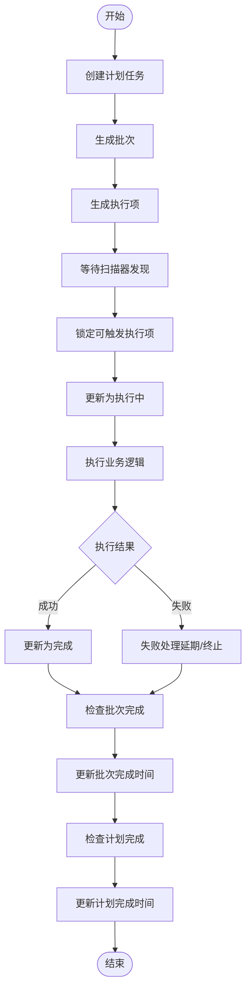
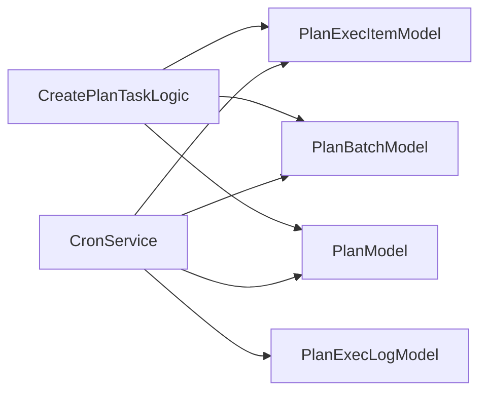

# 任务调度数据模型

<cite>
**本文档引用的文件**
- [planmodel.go](file://model/planmodel.go)
- [planmodel_gen.go](file://model/planmodel_gen.go)
- [planbatchmodel.go](file://model/planbatchmodel.go)
- [planbatchmodel_gen.go](file://model/planbatchmodel_gen.go)
- [planexecitemmodel.go](file://model/planexecitemmodel.go)
- [planexecitemmodel_gen.go](file://model/planexecitemmodel_gen.go)
- [planexeclogmodel.go](file://model/planexeclogmodel.go)
- [planexeclogmodel_gen.go](file://model/planexeclogmodel_gen.go)
- [cronservice.go](file://app/trigger/cron/cronservice.go)
- [createplantasklogic.go](file://app/trigger/internal/logic/createplantasklogic.go)
</cite>

## 目录
1. [简介](#简介)
2. [项目结构](#项目结构)
3. [核心组件](#核心组件)
4. [架构概览](#架构概览)
5. [详细组件分析](#详细组件分析)
6. [依赖关系分析](#依赖关系分析)
7. [性能考虑](#性能考虑)
8. [故障排查指南](#故障排查指南)
9. [结论](#结论)
10. [附录](#附录)

## 简介
本技术文档聚焦 Zero-Service 的任务调度数据模型，系统性阐述计划任务相关的数据模型设计与业务流程，包括：
- 计划配置模型 Plan
- 批次管理模型 PlanBatch
- 执行项管理模型 PlanExecItem
- 执行日志模型 PlanExecLog
- 任务调度的业务流程与数据流转
- 任务状态机设计与转换规则
- 并发控制机制与冲突处理策略
- 性能优化设计与使用示例

通过数据模型关系图与任务调度流程图，帮助开发者快速理解并高效使用 Zero-Service 的任务调度能力。

## 项目结构
任务调度数据模型位于 model 目录，采用 goctl 自动生成的 ORM 模型与自定义扩展相结合的方式：
- 自动生成的模型文件（_gen.go）：提供标准的 CRUD、分页、聚合查询等基础能力
- 自定义模型文件（非_gen.go）：在默认模型基础上扩展业务方法，如状态更新、进度计算、锁调度等

图表来源
- [planmodel.go:1-65](file://model/planmodel.go#L1-L65)
- [planbatchmodel.go:1-94](file://model/planbatchmodel.go#L1-L94)
- [planexecitemmodel.go:1-435](file://model/planexecitemmodel.go#L1-L435)
- [planexeclogmodel.go:1-31](file://model/planexeclogmodel.go#L1-L31)
- [cronservice.go:1-200](file://app/trigger/cron/cronservice.go#L1-L200)
- [createplantasklogic.go:1-200](file://app/trigger/internal/logic/createplantasklogic.go#L1-L200)

章节来源
- [planmodel.go:1-65](file://model/planmodel.go#L1-L65)
- [planbatchmodel.go:1-94](file://model/planbatchmodel.go#L1-L94)
- [planexecitemmodel.go:1-435](file://model/planexecitemmodel.go#L1-L435)
- [planexeclogmodel.go:1-31](file://model/planexeclogmodel.go#L1-L31)
- [cronservice.go:1-200](file://app/trigger/cron/cronservice.go#L1-L200)
- [createplantasklogic.go:1-200](file://app/trigger/internal/logic/createplantasklogic.go#L1-L200)

## 核心组件
本节对四个核心数据模型进行深入解析，涵盖字段含义、业务职责与关键方法。

- Plan（计划配置）
  - 职责：保存计划任务的基础配置，包括唯一标识、名称、类型、分组、重复规则、生效时间范围、状态与扩展字段
  - 关键方法：自定义扩展 UpdateBatchFinishedTime，用于在批次全部完成后回填计划结束时间
  - 字段要点：状态字段用于启用/禁用/终止/暂停；扫描标记用于调度扫描优化

- PlanBatch（批次管理）
  - 职责：按触发时间生成批次，承载同一时间窗口内的多个执行项
  - 关键方法：UpdateBatchFinishedTime 用于在执行项全部完成时设置批次结束时间；CalculatePlanProgress 计算计划执行进度
  - 字段要点：批次编号与名称便于识别；扫描标记用于调度扫描优化

- PlanExecItem（执行项管理）
  - 职责：具体可调度的执行单元，包含业务负载、触发时间、状态、重试计数与结果记录
  - 关键方法：LockTriggerItem 实现“锁定并返回下一个可触发的执行项”的原子操作；多种状态更新方法（完成、失败延期、终止、进行中等）
  - 字段要点：状态枚举覆盖等待、延期、执行中、暂停、完成、终止；下次触发时间是扫表核心字段

- PlanExecLog（执行日志记录）
  - 职责：记录每次触发的执行结果、消息与原因，支持后续审计与问题定位
  - 关键方法：自定义扩展接口（当前为空实现），便于后续增强

章节来源
- [planmodel_gen.go:55-84](file://model/planmodel_gen.go#L55-L84)
- [planbatchmodel_gen.go:57-84](file://model/planbatchmodel_gen.go#L57-L84)
- [planexecitemmodel_gen.go:55-93](file://model/planexecitemmodel_gen.go#L55-L93)
- [planexeclogmodel_gen.go:54-80](file://model/planexeclogmodel_gen.go#L54-L80)
- [planmodel.go:39-64](file://model/planmodel.go#L39-L64)
- [planbatchmodel.go:41-93](file://model/planbatchmodel.go#L41-L93)
- [planexecitemmodel.go:74-430](file://model/planexecitemmodel.go#L74-L430)
- [planexeclogmodel.go:20-30](file://model/planexeclogmodel.go#L20-L30)

## 架构概览
任务调度的整体架构由“模型层 + 服务层 + 扫描器”构成：
- 模型层：提供数据持久化与业务方法扩展
- 服务层：封装业务逻辑，如任务创建、状态更新、进度统计
- 扫描器：定时扫描可触发的执行项，协调执行与状态更新

图表来源
- [cronservice.go:81-184](file://app/trigger/cron/cronservice.go#L81-L184)
- [planexecitemmodel.go:74-144](file://model/planexecitemmodel.go#L74-L144)
- [planbatchmodel.go:41-66](file://model/planbatchmodel.go#L41-L66)
- [planmodel.go:39-64](file://model/planmodel.go#L39-L64)

## 详细组件分析

### 数据模型关系图
四个模型之间存在明确的关联关系：Plan 生成 PlanBatch，PlanBatch 生成 PlanExecItem，PlanExecItem 执行后产生 PlanExecLog。

图表来源
- [planmodel_gen.go:55-84](file://model/planmodel_gen.go#L55-L84)
- [planbatchmodel_gen.go:57-84](file://model/planbatchmodel_gen.go#L57-L84)
- [planexecitemmodel_gen.go:55-93](file://model/planexecitemmodel_gen.go#L55-L93)
- [planexeclogmodel_gen.go:54-80](file://model/planexeclogmodel_gen.go#L54-L80)

章节来源
- [planmodel_gen.go:55-84](file://model/planmodel_gen.go#L55-L84)
- [planbatchmodel_gen.go:57-84](file://model/planbatchmodel_gen.go#L57-L84)
- [planexecitemmodel_gen.go:55-93](file://model/planexecitemmodel_gen.go#L55-L93)
- [planexeclogmodel_gen.go:54-80](file://model/planexeclogmodel_gen.go#L54-L80)

### 任务状态机设计
PlanExecItem 的状态机覆盖了调度过程中的主要状态与转换路径：

状态定义（来源于字段说明与业务方法）：
- 待执行：0
- 延期等待：10
- 执行中：100
- 暂停：150
- 完成：200
- 终止：300

状态转换规则与约束：
- 锁定机制：LockTriggerItem 使用原子更新确保“仅一个消费者获得执行权”
- 失败重试：UpdateStatusToFail 根据触发次数与退避策略决定延期或终止
- 进度统计：CalculatePlanProgress 基于执行项状态统计计划完成百分比
- 扫表标记：扫描器在发现可触发项后更新计划与批次的 scan_flg，避免重复扫描

章节来源
- [planexecitemmodel.go:74-144](file://model/planexecitemmodel.go#L74-L144)
- [planexecitemmodel.go:202-271](file://model/planexecitemmodel.go#L202-L271)
- [planexecitemmodel.go:353-399](file://model/planexecitemmodel.go#L353-L399)
- [planbatchmodel.go:68-93](file://model/planbatchmodel.go#L68-L93)
- [cronservice.go:169-182](file://app/trigger/cron/cronservice.go#L169-L182)

### 任务调度流程（创建 → 扫描 → 执行 → 记录 → 完成）

图表来源
- [createplantasklogic.go:119-200](file://app/trigger/internal/logic/createplantasklogic.go#L119-L200)
- [cronservice.go:81-184](file://app/trigger/cron/cronservice.go#L81-L184)
- [planexecitemmodel.go:146-200](file://model/planexecitemmodel.go#L146-L200)
- [planexecitemmodel.go:202-271](file://model/planexecitemmodel.go#L202-L271)
- [planbatchmodel.go:41-66](file://model/planbatchmodel.go#L41-L66)
- [planmodel.go:39-64](file://model/planmodel.go#L39-L64)

章节来源
- [createplantasklogic.go:119-200](file://app/trigger/internal/logic/createplantasklogic.go#L119-L200)
- [cronservice.go:81-184](file://app/trigger/cron/cronservice.go#L81-L184)

### 并发控制机制
- 任务去重与互斥
  - LockTriggerItem 通过原子更新将“待执行/延期/执行中”状态的执行项锁定为“执行中”，并更新版本号与下次触发时间，避免重复执行
  - 该方法同时校验版本号，防止并发写入导致的状态错乱
- 并发限制
  - 扫描器使用固定大小的并发任务池（TaskRunner），限制同时处理的执行项数量
  - 扫描循环根据处理结果动态调整休眠时间，平衡吞吐与延迟
- 冲突处理策略
  - 版本号递增与乐观锁：UpdateWithVersion 在更新时校验版本号，若为 0 则判定为“无更新”，避免覆盖其他并发修改
  - 扫表标记 scan_flg：扫描器在发现可触发项后立即更新计划与批次的扫描标记，避免重复扫描

章节来源
- [planexecitemmodel.go:74-144](file://model/planexecitemmodel.go#L74-L144)
- [planexecitemmodel.go:212-229](file://model/planexecitemmodel.go#L212-L229)
- [cronservice.go:34-36](file://app/trigger/cron/cronservice.go#L34-L36)
- [cronservice.go:62-77](file://app/trigger/cron/cronservice.go#L62-L77)

### 性能优化设计
- 批量处理
  - 计划创建阶段按触发时间批量生成批次与执行项，减少多次事务开销
  - 扫描器单次处理后根据结果调整休眠时间，降低空转成本
- 异步执行
  - 扫描器与执行逻辑解耦，扫描器仅负责发现与状态更新，实际业务执行由外部回调或下游系统处理
- 资源管理
  - 使用连接池与事务封装，保证数据库访问的稳定性
  - 通过 scan_flg 标记减少无效扫描，提升整体吞吐

章节来源
- [createplantasklogic.go:143-183](file://app/trigger/internal/logic/createplantasklogic.go#L143-L183)
- [cronservice.go:58-79](file://app/trigger/cron/cronservice.go#L58-L79)

## 依赖关系分析
- 模型间依赖
  - Plan 与 PlanBatch：一对多关系，Plan 生成多个批次
  - PlanBatch 与 PlanExecItem：一对多关系，批次包含多个执行项
  - PlanExecItem 与 PlanExecLog：一对多关系，执行项产生日志
- 服务层依赖
  - CronService 依赖 PlanExecItemModel、PlanBatchModel、PlanModel 与 PlanExecLogModel
  - CreatePlanTaskLogic 依赖 PlanModel、PlanBatchModel、PlanExecItemModel 与 ID 生成工具

图表来源
- [cronservice.go:1-200](file://app/trigger/cron/cronservice.go#L1-L200)
- [createplantasklogic.go:1-200](file://app/trigger/internal/logic/createplantasklogic.go#L1-L200)

章节来源
- [cronservice.go:1-200](file://app/trigger/cron/cronservice.go#L1-L200)
- [createplantasklogic.go:1-200](file://app/trigger/internal/logic/createplantasklogic.go#L1-L200)

## 性能考虑
- 扫描频率与休眠策略：根据处理结果动态调整休眠时间，避免过度轮询
- 原子锁定与版本控制：通过原子更新与版本号校验，减少锁竞争与回滚成本
- 扫表标记：scan_flg 避免重复扫描，显著降低查询压力
- 批量插入：创建阶段批量生成批次与执行项，减少事务次数

## 故障排查指南
- 常见问题
  - 执行项长时间处于“待执行”状态：检查下次触发时间与计划/批次状态
  - 执行项频繁“延期等待”：确认失败重试策略与触发次数上限
  - 执行项“终止”：检查终止原因字段与重试上限
- 排查步骤
  - 查询执行项状态与触发计数：使用 PlanExecItemModel 的查询方法
  - 校验计划与批次扫描标记：确认 scan_flg 是否被正确更新
  - 查看执行日志：通过 PlanExecLogModel 定位异常原因

章节来源
- [planexecitemmodel.go:146-200](file://model/planexecitemmodel.go#L146-L200)
- [planexecitemmodel.go:202-271](file://model/planexecitemmodel.go#L202-L271)
- [planexeclogmodel.go:1-31](file://model/planexeclogmodel.go#L1-L31)

## 结论
Zero-Service 的任务调度数据模型以清晰的层次化设计与完善的业务方法扩展，实现了高可靠、高性能的任务调度能力。通过状态机、原子锁定、版本控制与扫描标记等机制，有效保障了并发安全与执行效率。建议在生产环境中结合监控与日志体系，持续优化扫描策略与重试策略，以满足不同场景下的性能与可靠性需求。

## 附录

### 使用示例（路径指引）
- 任务创建
  - 创建计划：参考 [createplantasklogic.go:119-200](file://app/trigger/internal/logic/createplantasklogic.go#L119-L200)
  - 生成批次与执行项：参考 [createplantasklogic.go:143-183](file://app/trigger/internal/logic/createplantasklogic.go#L143-L183)
- 状态查询
  - 查询执行项：参考 [planexecitemmodel_gen.go:124-164](file://model/planexecitemmodel_gen.go#L124-L164)
  - 查询批次进度：参考 [planbatchmodel.go:68-93](file://model/planbatchmodel.go#L68-L93)
- 统计分析
  - 计划完成率：参考 [planbatchmodel.go:68-93](file://model/planbatchmodel.go#L68-L93)
  - 执行项状态分布：参考 [planexecitemmodel.go:401-415](file://model/planexecitemmodel.go#L401-L415)