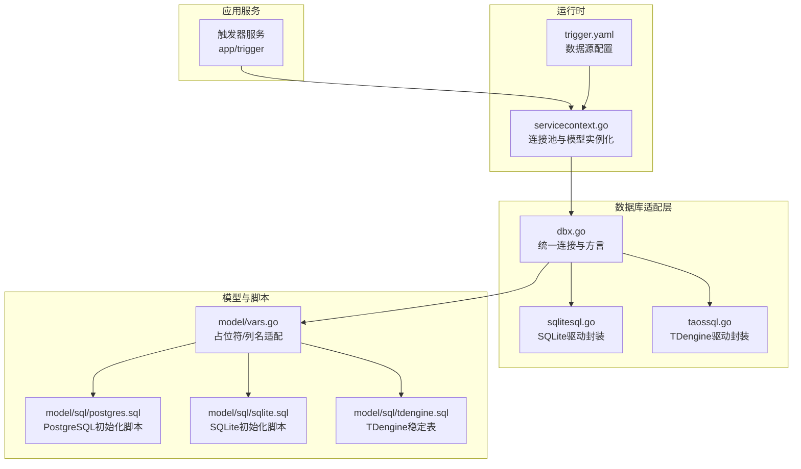
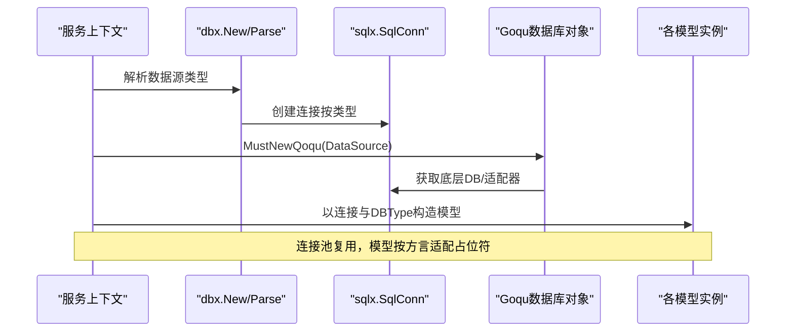
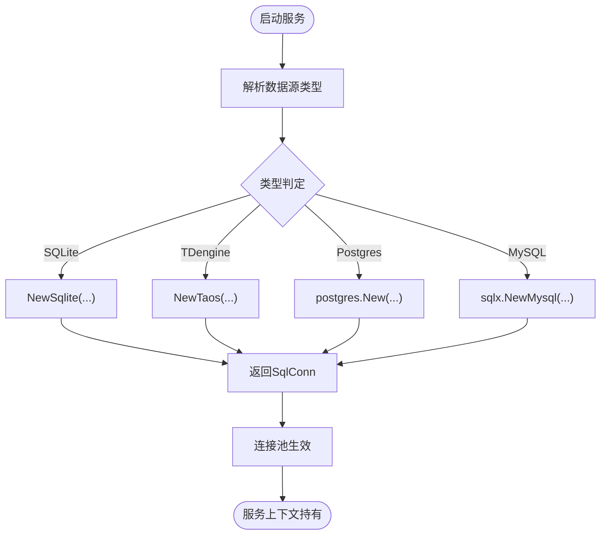
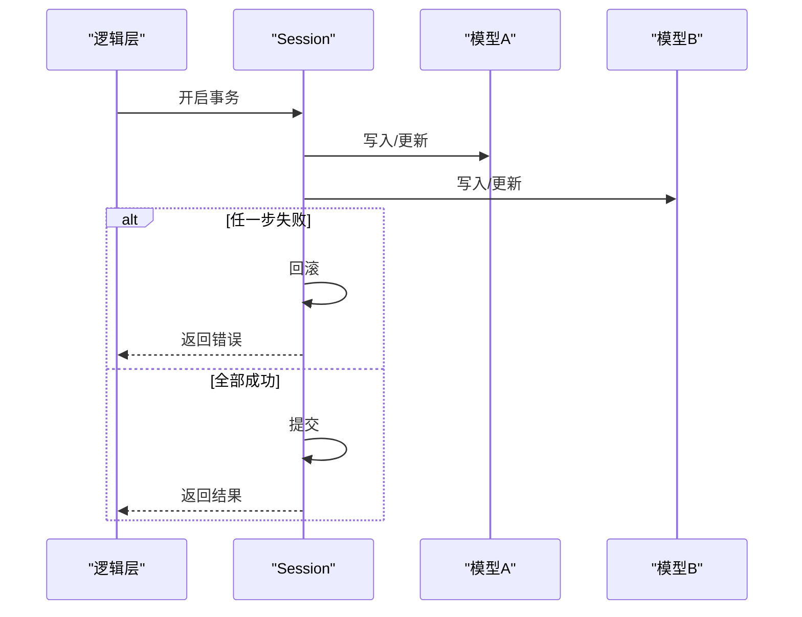
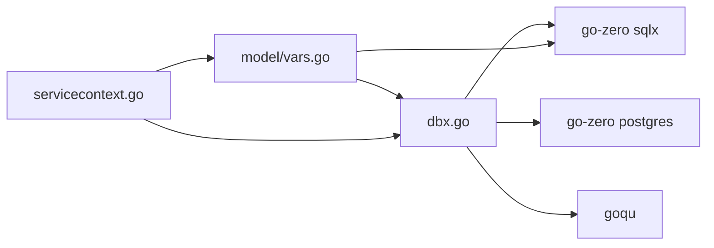

# 数据库概览

<cite>
**本文引用的文件**
- [common/dbx/dbx.go](file://common/dbx/dbx.go)
- [common/dbx/sqlitesql.go](file://common/dbx/sqlitesql.go)
- [common/dbx/taossql.go](file://common/dbx/taossql.go)
- [model/vars.go](file://model/vars.go)
- [model/sql/postgres.sql](file://model/sql/postgres.sql)
- [model/sql/sqlite.sql](file://model/sql/sqlite.sql)
- [model/sql/tdengine.sql](file://model/sql/tdengine.sql)
- [.trae/skills/zero-skills/references/database-patterns.md](file://.trae/skills/zero-skills/references/database-patterns.md)
- [app/trigger/etc/trigger.yaml](file://app/trigger/etc/trigger.yaml)
- [app/trigger/internal/svc/servicecontext.go](file://app/trigger/internal/svc/servicecontext.go)
</cite>

## 目录
1. [简介](#简介)
2. [项目结构](#项目结构)
3. [核心组件](#核心组件)
4. [架构总览](#架构总览)
5. [详细组件分析](#详细组件分析)
6. [依赖分析](#依赖分析)
7. [性能考虑](#性能考虑)
8. [故障排查指南](#故障排查指南)
9. [结论](#结论)
10. [附录](#附录)

## 简介
本文件面向 zero-service 的数据库子系统，提供从架构设计、连接与事务、数据存储与索引、查询优化、初始化与迁移、性能监控、备份恢复到安全与审计的全景式说明。项目通过统一的数据库适配层支持 MySQL、PostgreSQL、SQLite 与 TDengine（通过 TAOS 驱动），并结合 go-zero 的连接池与缓存能力，实现高可用与高性能的数据访问。

## 项目结构
数据库相关的关键位置如下：
- 适配与连接层：common/dbx
- 数据模型与占位符适配：model/vars.go
- 初始化与迁移脚本：model/sql/*.sql
- 使用示例与最佳实践：.trae/skills/zero-skills/references/database-patterns.md
- 服务配置与上下文：app/*/etc/*.yaml、app/*/internal/svc/servicecontext.go

图表来源
- [common/dbx/dbx.go:1-155](file://common/dbx/dbx.go#L1-L155)
- [common/dbx/sqlitesql.go:1-13](file://common/dbx/sqlitesql.go#L1-L13)
- [common/dbx/taossql.go:1-14](file://common/dbx/taossql.go#L1-L14)
- [model/vars.go:1-318](file://model/vars.go#L1-L318)
- [model/sql/postgres.sql:1-526](file://model/sql/postgres.sql#L1-L526)
- [model/sql/sqlite.sql:1-53](file://model/sql/sqlite.sql#L1-L53)
- [model/sql/tdengine.sql:1-34](file://model/sql/tdengine.sql#L1-L34)
- [app/trigger/etc/trigger.yaml:1-38](file://app/trigger/etc/trigger.yaml#L1-L38)
- [app/trigger/internal/svc/servicecontext.go:1-91](file://app/trigger/internal/svc/servicecontext.go#L1-L91)

章节来源
- [common/dbx/dbx.go:1-155](file://common/dbx/dbx.go#L1-L155)
- [model/vars.go:1-318](file://model/vars.go#L1-L318)
- [model/sql/postgres.sql:1-526](file://model/sql/postgres.sql#L1-L526)
- [model/sql/sqlite.sql:1-53](file://model/sql/sqlite.sql#L1-L53)
- [model/sql/tdengine.sql:1-34](file://model/sql/tdengine.sql#L1-L34)
- [app/trigger/etc/trigger.yaml:1-38](file://app/trigger/etc/trigger.yaml#L1-L38)
- [app/trigger/internal/svc/servicecontext.go:1-91](file://app/trigger/internal/svc/servicecontext.go#L1-L91)

## 核心组件
- 统一数据库适配层：根据数据源自动识别类型并创建连接，支持 SQLite、TDengine（taosRestful）、PostgreSQL、MySQL，并提供 Goqu 方言注册与日志桥接。
- 模型与占位符适配：在不同数据库间统一对占位符（? 与 $n）与列名包装（反引号/双引号）进行适配，确保 SQL 在多方言下一致。
- 初始化与迁移：提供 PostgreSQL、SQLite、TDengine 的建表与索引脚本；PostgreSQL 脚本包含触发器自动维护时间戳。
- 连接池与事务：基于 go-zero 的连接池默认配置与自定义扩缩容；提供复杂事务示例与多模型一致性写入模式。
- 缓存与性能：内置缓存操作模式与连接池复用建议，降低热点读取压力。

章节来源
- [common/dbx/dbx.go:31-154](file://common/dbx/dbx.go#L31-L154)
- [model/vars.go:69-206](file://model/vars.go#L69-L206)
- [.trae/skills/zero-skills/references/database-patterns.md:448-480](file://.trae/skills/zero-skills/references/database-patterns.md#L448-L480)
- [.trae/skills/zero-skills/references/database-patterns.md:311-365](file://.trae/skills/zero-skills/references/database-patterns.md#L311-L365)

## 架构总览
数据库子系统围绕“适配层 + 模型层 + 脚本层 + 运行时配置”展开，服务启动时解析数据源，创建连接池与模型实例，使用统一的占位符与列名包装策略，按需执行初始化脚本。

图表来源
- [app/trigger/internal/svc/servicecontext.go:50-91](file://app/trigger/internal/svc/servicecontext.go#L50-L91)
- [common/dbx/dbx.go:52-138](file://common/dbx/dbx.go#L52-L138)
- [model/vars.go:69-206](file://model/vars.go#L69-L206)

## 详细组件分析

### 数据库类型与选择依据
- 支持类型
  - SQLite：轻量嵌入式场景，文件型数据源或 .db 后缀。
  - TDengine：时序/物联网场景，HTTP(S) 接口。
  - PostgreSQL：企业级功能丰富，触发器、JSONB、索引完善。
  - MySQL：广泛生态与兼容性。
- 选择依据
  - 时序/物联：优先 TDengine（脚本中定义了稳定表与标签）。
  - 通用业务：PostgreSQL（触发器与索引完备，便于维护时间戳）。
  - 轻量/单机：SQLite（适合开发测试或边缘场景）。
  - 生态兼容：MySQL（传统项目与工具链成熟）。

章节来源
- [common/dbx/dbx.go:31-64](file://common/dbx/dbx.go#L31-L64)
- [model/sql/tdengine.sql:1-34](file://model/sql/tdengine.sql#L1-L34)
- [model/sql/postgres.sql:1-526](file://model/sql/postgres.sql#L1-L526)

### 连接配置与连接池管理
- 数据源解析：根据前缀/关键字自动识别类型（file:、.db、http/https、@tcp(、postgres://）。
- 连接创建：按类型调用对应 New 函数；Goqu 通过适配器或底层 DB 实例化。
- 连接池默认与自定义：go-zero 默认池配置；可在服务上下文中获取底层 DB 并设置 MaxIdleConns、MaxOpenConns、ConnMaxLifetime。
- 连接复用：服务上下文一次性初始化，避免在处理器中重复创建连接。

图表来源
- [common/dbx/dbx.go:31-64](file://common/dbx/dbx.go#L31-L64)
- [common/dbx/sqlitesql.go:10-12](file://common/dbx/sqlitesql.go#L10-L12)
- [common/dbx/taossql.go:11-13](file://common/dbx/taossql.go#L11-L13)
- [.trae/skills/zero-skills/references/database-patterns.md:450-480](file://.trae/skills/zero-skills/references/database-patterns.md#L450-L480)

章节来源
- [app/trigger/etc/trigger.yaml:25-29](file://app/trigger/etc/trigger.yaml#L25-L29)
- [app/trigger/internal/svc/servicecontext.go:50-91](file://app/trigger/internal/svc/servicecontext.go#L50-L91)
- [.trae/skills/zero-skills/references/database-patterns.md:448-480](file://.trae/skills/zero-skills/references/database-patterns.md#L448-L480)

### 事务处理机制
- 单模型事务：使用模型提供的 TransactCtx 或 Session 接口。
- 多模型/多表事务：在会话内顺序执行插入/更新/删除，任一步失败回滚。
- 乐观锁与版本控制：模型层对版本字段进行自增与条件更新，避免并发覆盖。

图表来源
- [.trae/skills/zero-skills/references/database-patterns.md:311-365](file://.trae/skills/zero-skills/references/database-patterns.md#L311-L365)
- [model/planmodel_gen.go:503-509](file://model/planmodel_gen.go#L503-L509)

章节来源
- [.trae/skills/zero-skills/references/database-patterns.md:311-365](file://.trae/skills/zero-skills/references/database-patterns.md#L311-L365)
- [model/planmodel_gen.go:503-509](file://model/planmodel_gen.go#L503-L509)

### 数据存储策略与索引设计原则
- PostgreSQL 脚本
  - 触发器：insert_modified_time、update_modified_update_time，统一维护 create_time/update_time。
  - 主键与唯一约束：如 device_point_mapping 的唯一索引（tag_station, coa, ioa）。
  - 辅助索引：按查询热点建立（如 plan/exec_item 的状态、时间、组合索引）。
  - JSONB：recurrence_rule 存储周期规则，便于灵活扩展。
- SQLite 脚本
  - 触发器：自动更新 update_time。
  - 唯一索引：保证点位唯一性。
- TDengine 脚本
  - 稳定表（STABLE）：raw_point_data、tele_signal_data、telemetry_data，按标签组织时序数据。

章节来源
- [model/sql/postgres.sql:1-526](file://model/sql/postgres.sql#L1-L526)
- [model/sql/sqlite.sql:1-53](file://model/sql/sqlite.sql#L1-L53)
- [model/sql/tdengine.sql:1-34](file://model/sql/tdengine.sql#L1-L34)

### 查询优化方案
- 占位符适配：非 PostgreSQL 将 $n 替换为 ?，避免方言差异导致的绑定错误。
- 列名包装：MySQL 使用反引号，PostgreSQL 使用双引号，避免关键字冲突。
- Builder 适配：squirrel 在 PostgreSQL 下使用 PlaceholderFormat(squirrel.Dollar)，确保正确绑定。
- 索引策略：遵循“查询谓词”建立复合索引；对高并发写入场景，注意写放大与触发器成本。

章节来源
- [model/vars.go:187-206](file://model/vars.go#L187-L206)
- [model/planmodel_gen.go:503-509](file://model/planmodel_gen.go#L503-L509)

### 初始化脚本与迁移策略
- 初始化脚本
  - PostgreSQL：创建触发器、表、索引、注释与初始数据。
  - SQLite：创建表、触发器与示例数据。
  - TDengine：创建稳定表与标签，支撑时序数据写入。
- 迁移策略
  - 建表与索引变更：在新版本中新增脚本，逐步演进。
  - 触发器与注释：保持与表结构同步，确保时间戳一致性。
  - 版本管理：建议在脚本中加入版本号注释或迁移记录，配合发布流程执行。

章节来源
- [model/sql/postgres.sql:1-526](file://model/sql/postgres.sql#L1-L526)
- [model/sql/sqlite.sql:1-53](file://model/sql/sqlite.sql#L1-L53)
- [model/sql/tdengine.sql:1-34](file://model/sql/tdengine.sql#L1-L34)

### 性能监控指标
- 连接池指标：活跃连接数、空闲连接数、等待排队时长、连接生命周期。
- 查询指标：慢查询阈值、执行耗时分布、命中率（结合缓存）。
- 事务指标：提交/回滚次数、平均持续时间、死锁/超时统计。
- 建议：结合服务端监控（如 Prometheus/Grafana）与日志埋点，定期评估与调优。

[本节为通用指导，无需特定文件引用]

### 备份恢复与灾难恢复
- 备份策略
  - 关系型数据库：逻辑备份（SQL/Dump）+ 增量备份（WAL/binlog）。
  - SQLite：文件级备份（原子替换）。
  - TDengine：稳定表与标签备份，结合集群快照。
- 恢复流程
  - 快速验证：小样本导入与查询校验。
  - 分阶段回切：灰度验证后全量切换。
- 灾难恢复
  - 多地冗余：跨机房/跨区域部署。
  - RPO/RTO：明确目标并配套演练。
  - 自动化：结合 CI/CD 与编排工具，缩短恢复时间。

[本节为通用指导，无需特定文件引用]

### 安全配置、访问控制与审计日志
- 安全配置
  - 最小权限：为不同环境（dev/test/prod）分配最小必要权限。
  - 加密传输：启用 SSL/TLS（PostgreSQL 示例使用 sslmode=disable 仅为演示，生产请开启）。
  - 密码管理：敏感信息通过配置中心或密钥管理服务注入。
- 访问控制
  - 用户隔离：按租户/项目划分用户与库。
  - 网络隔离：数据库置于内网或专用子网，限制外网访问。
- 审计日志
  - SQL 审计：开启 DDL/DML 审计（如 MySQL audit plugin、PostgreSQL pgAudit）。
  - 操作审计：记录关键操作（DDL、权限变更、备份/恢复）。
  - 日志留存：合规要求的留存周期与加密归档。

章节来源
- [app/trigger/etc/trigger.yaml:25-29](file://app/trigger/etc/trigger.yaml#L25-L29)

## 依赖分析
- 适配层依赖 go-zero 的 sqlx 与 postgres 包，以及 goqu 的方言注册。
- 模型层依赖占位符与列名适配函数，确保在不同数据库上行为一致。
- 运行时依赖服务上下文统一创建连接与模型实例，避免分散初始化。

图表来源
- [common/dbx/dbx.go:3-20](file://common/dbx/dbx.go#L3-L20)
- [model/vars.go:1-13](file://model/vars.go#L1-L13)
- [app/trigger/internal/svc/servicecontext.go:1-48](file://app/trigger/internal/svc/servicecontext.go#L1-L48)

章节来源
- [common/dbx/dbx.go:1-155](file://common/dbx/dbx.go#L1-L155)
- [model/vars.go:1-318](file://model/vars.go#L1-L318)
- [app/trigger/internal/svc/servicecontext.go:1-91](file://app/trigger/internal/svc/servicecontext.go#L1-L91)

## 性能考虑
- 连接池复用：服务上下文一次性初始化，避免在处理器中频繁创建连接。
- 缓存策略：热点读取走缓存，写入后失效或更新缓存键。
- 事务批量：批量写入合并为单事务，减少往返与锁竞争。
- 索引优化：针对高频查询建立复合索引，避免全表扫描。
- 占位符与方言：统一适配避免因方言差异导致的执行计划抖动。

章节来源
- [.trae/skills/zero-skills/references/database-patterns.md:426-488](file://.trae/skills/zero-skills/references/database-patterns.md#L426-L488)
- [model/vars.go:187-206](file://model/vars.go#L187-L206)

## 故障排查指南
- 连接失败
  - 检查数据源字符串是否符合类型判定规则（file:/ .db / http(s) / @tcp( / postgres://）。
  - 确认网络与认证信息（主机、端口、用户名、密码）。
- 事务异常
  - 使用 TransactCtx 包裹多模型写入，捕获错误并回滚。
  - 检查版本字段与条件更新，避免并发覆盖。
- 查询异常
  - 校验占位符与列名包装是否匹配目标数据库方言。
  - 查看索引是否被正确使用，必要时重建或调整。
- 性能问题
  - 监控连接池饱和与等待队列，按需扩容 MaxOpenConns 与 MaxIdleConns。
  - 结合慢查询日志定位热点 SQL，优化索引与语句。

章节来源
- [common/dbx/dbx.go:31-64](file://common/dbx/dbx.go#L31-L64)
- [.trae/skills/zero-skills/references/database-patterns.md:311-365](file://.trae/skills/zero-skills/references/database-patterns.md#L311-L365)
- [model/vars.go:187-206](file://model/vars.go#L187-L206)

## 结论
zero-service 的数据库子系统通过统一适配层与模型层的方言适配，实现了对 MySQL、PostgreSQL、SQLite、TDengine 的一致化访问；配合完善的初始化脚本、事务与缓存模式，满足从开发测试到生产的多样化需求。建议在生产环境中强化安全与审计、完善监控与备份演练，并持续优化索引与连接池配置以获得更佳性能。

## 附录
- 数据源示例与配置参考：见触发器服务配置文件中的 DataSource 字段。
- 代码级适配参考：dbx 与 model/vars 中的类型识别、占位符与列名包装。

章节来源
- [app/trigger/etc/trigger.yaml:25-29](file://app/trigger/etc/trigger.yaml#L25-L29)
- [common/dbx/dbx.go:31-154](file://common/dbx/dbx.go#L31-L154)
- [model/vars.go:69-206](file://model/vars.go#L69-L206)