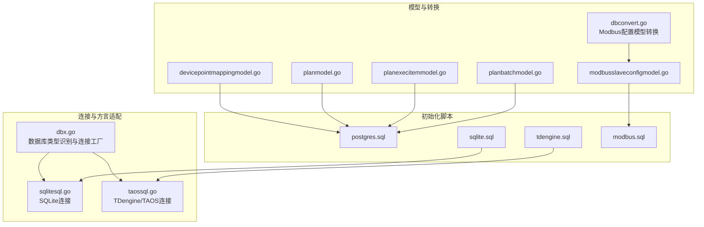
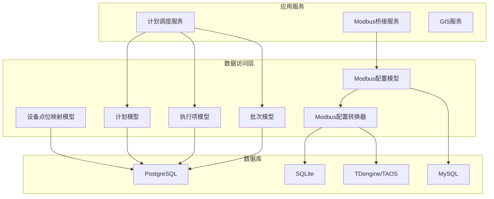
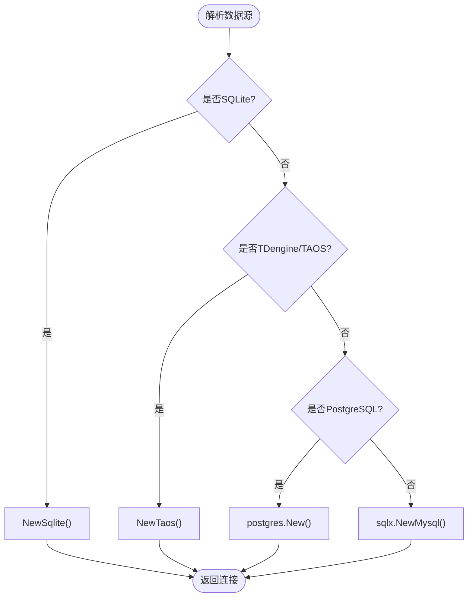
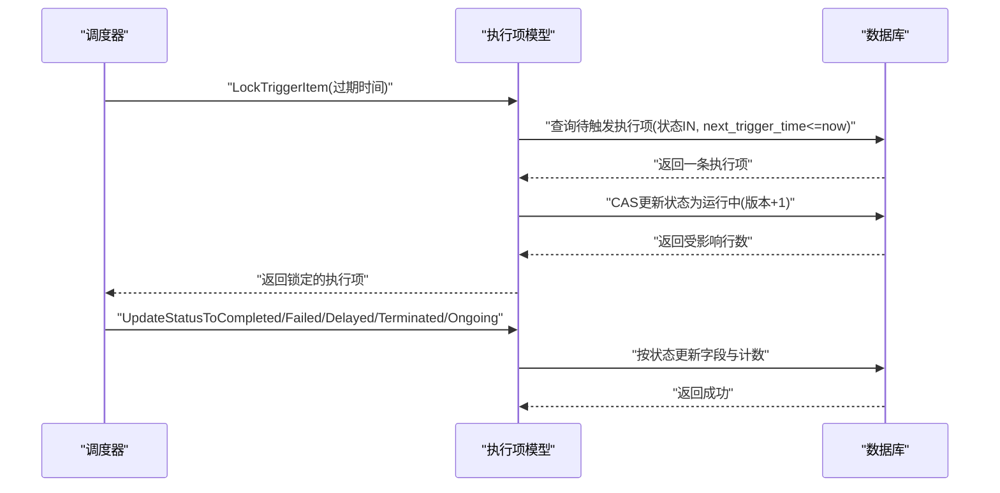
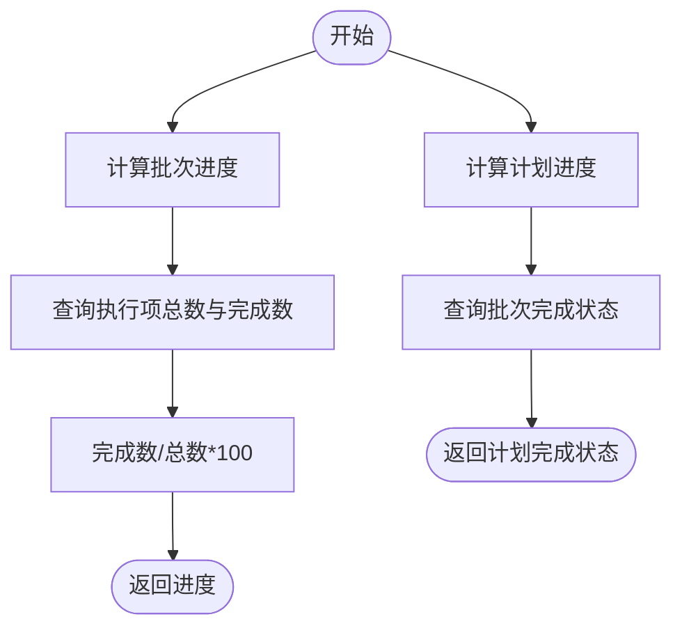
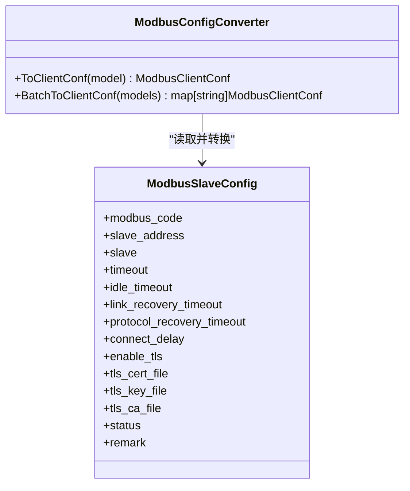
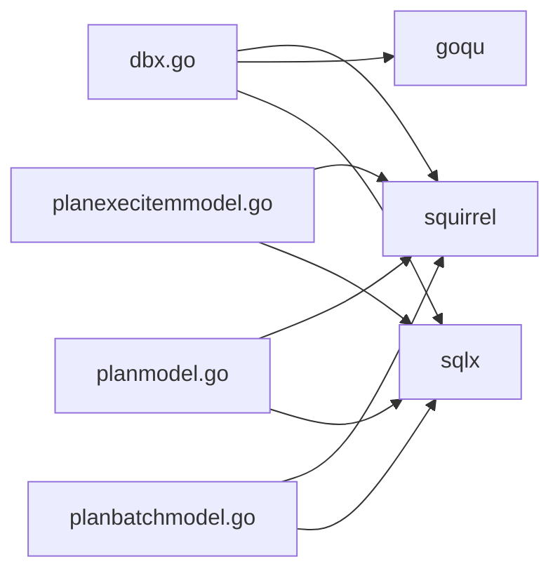

# 数据库设计

<cite>
**本文引用的文件**
- [common/dbx/dbx.go](file://common/dbx/dbx.go)
- [common/dbx/sqlitesql.go](file://common/dbx/sqlitesql.go)
- [common/dbx/taossql.go](file://common/dbx/taossql.go)
- [model/dbconvert.go](file://model/dbconvert.go)
- [model/sql/postgres.sql](file://model/sql/postgres.sql)
- [model/sql/sqlite.sql](file://model/sql/sqlite.sql)
- [model/sql/tdengine.sql](file://model/sql/tdengine.sql)
- [model/sql/modbus.sql](file://model/sql/modbus.sql)
- [model/devicepointmappingmodel.go](file://model/devicepointmappingmodel.go)
- [model/modbusslaveconfigmodel.go](file://model/modbusslaveconfigmodel.go)
- [model/planmodel.go](file://model/planmodel.go)
- [model/planexecitemmodel.go](file://model/planexecitemmodel.go)
- [model/planbatchmodel.go](file://model/planbatchmodel.go)
</cite>

## 目录
1. [简介](#简介)
2. [项目结构](#项目结构)
3. [核心组件](#核心组件)
4. [架构总览](#架构总览)
5. [详细组件分析](#详细组件分析)
6. [依赖分析](#依赖分析)
7. [性能考虑](#性能考虑)
8. [故障排查指南](#故障排查指南)
9. [结论](#结论)
10. [附录](#附录)

## 简介
本文件面向 Zero-Service 的数据库设计，系统化阐述表结构设计原则、索引策略、约束设计、多数据库适配、版本与迁移策略、性能优化建议，并提供完整 ER 图与数据模型说明，帮助开发者快速理解数据结构与关系。

## 项目结构
数据库相关代码与资源分布于以下位置：
- 连接与方言适配：common/dbx
- 模型与转换：model
- 初始化与兼容脚本：model/sql

**图表来源**
- [common/dbx/dbx.go:1-155](file://common/dbx/dbx.go#L1-L155)
- [common/dbx/sqlitesql.go:1-13](file://common/dbx/sqlitesql.go#L1-L13)
- [common/dbx/taossql.go:1-14](file://common/dbx/taossql.go#L1-L14)
- [model/dbconvert.go:1-56](file://model/dbconvert.go#L1-L56)
- [model/sql/postgres.sql:1-526](file://model/sql/postgres.sql#L1-L526)
- [model/sql/sqlite.sql:1-53](file://model/sql/sqlite.sql#L1-L53)
- [model/sql/tdengine.sql:1-34](file://model/sql/tdengine.sql#L1-L34)
- [model/sql/modbus.sql:1-32](file://model/sql/modbus.sql#L1-L32)

**章节来源**
- [common/dbx/dbx.go:1-155](file://common/dbx/dbx.go#L1-L155)
- [model/sql/postgres.sql:1-526](file://model/sql/postgres.sql#L1-L526)
- [model/sql/sqlite.sql:1-53](file://model/sql/sqlite.sql#L1-L53)
- [model/sql/tdengine.sql:1-34](file://model/sql/tdengine.sql#L1-L34)
- [model/sql/modbus.sql:1-32](file://model/sql/modbus.sql#L1-L32)

## 核心组件
- 数据库类型识别与连接工厂：根据数据源 URL 自动识别数据库类型（MySQL、PostgreSQL、SQLite、TDengine/TAOS），并创建相应连接与 GoQu dialect。
- 模型层：围绕计划调度与设备点位映射等核心业务，提供 CRUD 与状态机更新能力；同时对 PostgreSQL 使用 Dollar 占位符与随机排序等差异化处理。
- 转换器：将数据库中的 Modbus 从站配置转换为运行时客户端配置，支持批量映射。

**章节来源**
- [common/dbx/dbx.go:31-64](file://common/dbx/dbx.go#L31-L64)
- [model/planmodel.go:39-64](file://model/planmodel.go#L39-L64)
- [model/planexecitemmodel.go:74-144](file://model/planexecitemmodel.go#L74-L144)
- [model/planbatchmodel.go:41-66](file://model/planbatchmodel.go#L41-L66)
- [model/dbconvert.go:16-55](file://model/dbconvert.go#L16-L55)

## 架构总览
下图展示数据库层在系统中的角色与交互：

**图表来源**
- [model/devicepointmappingmodel.go:1-108](file://model/devicepointmappingmodel.go#L1-L108)
- [model/planmodel.go:1-65](file://model/planmodel.go#L1-L65)
- [model/planexecitemmodel.go:1-435](file://model/planexecitemmodel.go#L1-L435)
- [model/planbatchmodel.go:1-94](file://model/planbatchmodel.go#L1-L94)
- [model/modbusslaveconfigmodel.go:1-32](file://model/modbusslaveconfigmodel.go#L1-L32)
- [model/dbconvert.go:1-56](file://model/dbconvert.go#L1-L56)
- [common/dbx/dbx.go:46-64](file://common/dbx/dbx.go#L46-L64)

## 详细组件分析

### 表结构设计原则
- 表命名规范
  - 使用小写、单词间以下划线分隔，语义清晰，如 device_point_mapping、plan、plan_exec_item、plan_exec_log、plan_batch、modbus_slave_config。
- 字段设计规范
  - 统一采用 create_time、update_time、delete_time、del_state、version 等字段，支持软删除与乐观锁。
  - 字段长度与精度依据业务需求设定，如 JSONB 存储周期规则、VARCHAR 容量满足扩展字段。
- 数据类型选择策略
  - PostgreSQL：BIGSERIAL 主键、TIMESTAMP、JSONB、SMALLINT 枚举、VARCHAR(n)。
  - MySQL：DATETIME(6)、TINYINT、varchar(n)、自增主键。
  - SQLite：INTEGER 主键、TIMESTAMP、VARCHAR、AUTOINCREMENT。
  - TDengine/TAOS：STABLE 与 TAGS 结构，支持时间序列高效写入与标签过滤。

**章节来源**
- [model/sql/postgres.sql:24-526](file://model/sql/postgres.sql#L24-L526)
- [model/sql/modbus.sql:1-32](file://model/sql/modbus.sql#L1-L32)
- [model/sql/sqlite.sql:1-53](file://model/sql/sqlite.sql#L1-L53)
- [model/sql/tdengine.sql:1-34](file://model/sql/tdengine.sql#L1-L34)

### 索引设计策略
- 主键索引：所有表均具备主键，确保行级唯一性与快速定位。
- 唯一索引：设备点位映射表对 (tag_station, coa, ioa) 建唯一索引；计划批次表对 batch_num 建唯一索引；Modbus 配置表对 modbus_code 建唯一索引。
- 复合索引：
  - 计划表：type、group_id、status、start_time、end_time、paused_time。
  - 执行项表：exec_id、batch_pk、batch_id、plan_pk+item_id、plan_id+item_id、point_id、status、核心扫描索引 del_state+next_trigger_time+status。
  - 日志表：plan_pk、plan_id、batch_pk、batch_id、item_pk、exec_id、item_id、trigger_time、trace_id、exec_result。
  - 批次表：plan_id、plan_pk、status、batch_id（唯一）。
- 全文索引：当前未使用全文索引，若存在大文本检索需求，可评估数据库支持情况。

**章节来源**
- [model/sql/postgres.sql:78-92](file://model/sql/postgres.sql#L78-L92)
- [model/sql/postgres.sql:160-180](file://model/sql/postgres.sql#L160-L180)
- [model/sql/postgres.sql:264-286](file://model/sql/postgres.sql#L264-L286)
- [model/sql/postgres.sql:346-370](file://model/sql/postgres.sql#L346-L370)
- [model/sql/postgres.sql:433-451](file://model/sql/postgres.sql#L433-L451)
- [model/sql/modbus.sql:23-25](file://model/sql/modbus.sql#L23-L25)

### 约束设计
- 主外键约束：模型层通过业务逻辑与应用层约束保障关系完整性，未见显式的外键声明。
- 唯一性约束：多处唯一索引作为唯一性约束替代。
- 检查约束：未使用显式 CHECK 约束，通过枚举字段与业务校验实现。
- 默认值设置：广泛使用 DEFAULT，如 del_state、version、enable_push、enable_raw_insert、status 等。

**章节来源**
- [model/sql/postgres.sql:124](file://model/sql/postgres.sql#L124)
- [model/sql/postgres.sql:399](file://model/sql/postgres.sql#L399)
- [model/sql/postgres.sql:474](file://model/sql/postgres.sql#L474)
- [model/sql/modbus.sql:23-25](file://model/sql/modbus.sql#L23-L25)

### 多数据库支持与适配
- 类型识别
  - SQLite：以 file: 或 .db 判定。
  - TDengine/TAOS：以 http/https 判定。
  - MySQL：以 @tcp( 判定。
  - PostgreSQL：以 postgres:// 判定。
- 连接工厂
  - New：按类型创建连接。
  - NewQoqu：按类型创建 GoQu dialect 并注入日志。
- 差异化处理
  - PostgreSQL 使用 Dollar 占位符与 RANDOM() 排序。
  - 其他数据库使用占位符与 RAND() 排序。
- 驱动注册
  - GoQu 注册 mysql 与 postgres dialect。
  - SQLite 使用 modernc.org/sqlite 驱动。
  - TDengine 使用 taosRestful 驱动。

**图表来源**
- [common/dbx/dbx.go:31-64](file://common/dbx/dbx.go#L31-L64)
- [common/dbx/dbx.go:106-138](file://common/dbx/dbx.go#L106-L138)
- [common/dbx/sqlitesql.go:10-12](file://common/dbx/sqlitesql.go#L10-L12)
- [common/dbx/taossql.go:11-13](file://common/dbx/taossql.go#L11-L13)

**章节来源**
- [common/dbx/dbx.go:22-64](file://common/dbx/dbx.go#L22-L64)
- [common/dbx/dbx.go:106-155](file://common/dbx/dbx.go#L106-L155)
- [common/dbx/sqlitesql.go:1-13](file://common/dbx/sqlitesql.go#L1-L13)
- [common/dbx/taossql.go:1-14](file://common/dbx/taossql.go#L1-L14)

### 版本管理与迁移策略
- DDL 变更管理
  - 通过独立 SQL 脚本维护各数据库的建表与索引，便于版本化管理与回滚。
  - PostgreSQL 脚本包含触发器函数与注释，确保一致性与可维护性。
- 数据迁移脚本
  - 提供初始数据插入示例（如 Modbus 配置）。
- 回滚机制
  - 建议在生产环境采用“向前变更”策略，保留旧脚本；对可逆操作可在应用层增加回滚步骤（如软删除、版本号回退）。

**章节来源**
- [model/sql/postgres.sql:1-526](file://model/sql/postgres.sql#L1-L526)
- [model/sql/modbus.sql:27-32](file://model/sql/modbus.sql#L27-L32)
- [model/sql/sqlite.sql:34-45](file://model/sql/sqlite.sql#L34-L45)

### 数据模型与 ER 图
- 实体关系
  - device_point_mapping：设备点位映射，支撑计划调度与消息推送。
  - plan：计划任务，包含周期规则与状态。
  - plan_batch：批次，承载计划的批量执行。
  - plan_exec_item：执行项，记录每次触发的上下文与状态。
  - plan_exec_log：执行日志，记录每次执行结果与追踪信息。
  - modbus_slave_config：Modbus 从站配置，支撑设备采集。

```mermaid
erDiagram
DEVICE_POINT_MAPPING {
bigint id PK
timestamp create_time
timestamp update_time
timestamp delete_time
smallint del_state
int version
varchar create_user
varchar update_user
varchar dept_code
varchar tag_station
int coa
int ioa
varchar device_id
varchar device_name
varchar td_table_type
smallint enable_push
smallint enable_raw_insert
varchar description
varchar ext_1
varchar ext_2
varchar ext_3
varchar ext_4
varchar ext_5
}
PLAN {
bigint id PK
timestamp create_time
timestamp update_time
timestamp delete_time
smallint del_state
int version
varchar create_user
varchar update_user
varchar dept_code
varchar plan_id UK
varchar plan_name
varchar type
varchar group_id
jsonb recurrence_rule
timestamp start_time
timestamp end_time
smallint status
smallint scan_flg
varchar terminated_reason
timestamp paused_time
varchar paused_reason
timestamp finished_time
varchar description
varchar ext_1
varchar ext_2
varchar ext_3
varchar ext_4
varchar ext_5
}
PLAN_BATCH {
bigint id PK
timestamp create_time
timestamp update_time
timestamp delete_time
smallint del_state
int version
varchar create_user
varchar update_user
varchar dept_code
bigint plan_pk
varchar plan_id
varchar batch_id UK
varchar batch_name
varchar batch_num
smallint status
smallint scan_flg
timestamp plan_trigger_time
varchar terminated_reason
timestamp paused_time
varchar paused_reason
timestamp finished_time
varchar ext_1
varchar ext_2
varchar ext_3
varchar ext_4
varchar ext_5
}
PLAN_EXEC_ITEM {
bigint id PK
timestamp create_time
timestamp update_time
timestamp delete_time
smallint del_state
int version
varchar create_user
varchar update_user
varchar dept_code
bigint plan_pk
varchar plan_id
bigint batch_pk
varchar batch_id
varchar exec_id UK
varchar item_id
varchar item_type
varchar item_name
bigint item_row_id
varchar point_id
text payload
int request_timeout
timestamp plan_trigger_time
timestamp next_trigger_time
timestamp last_trigger_time
int trigger_count
smallint status
varchar last_result
varchar last_message
text last_reason
varchar terminated_reason
timestamp paused_time
varchar paused_reason
varchar ext_1
varchar ext_2
varchar ext_3
varchar ext_4
varchar ext_5
}
PLAN_EXEC_LOG {
bigint id PK
timestamp create_time
timestamp update_time
timestamp delete_time
smallint del_state
int version
varchar create_user
varchar update_user
varchar dept_code
bigint plan_pk
varchar plan_id
varchar plan_name
bigint batch_pk
varchar batch_id
bigint item_pk
varchar exec_id
varchar item_id
varchar item_type
varchar item_name
varchar point_id
timestamp trigger_time
varchar trace_id
varchar exec_result
varchar message
text reason
}
MODBUS_SLAVE_CONFIG {
bigint id PK
timestamp create_time
timestamp update_time
timestamp delete_time
smallint del_state
int version
varchar modbus_code UK
varchar slave_address
int slave
int timeout
int idle_timeout
int link_recovery_timeout
int protocol_recovery_timeout
int connect_delay
smallint enable_tls
varchar tls_cert_file
varchar tls_key_file
varchar tls_ca_file
smallint status
varchar remark
}
DEVICE_POINT_MAPPING ||--o{ PLAN_EXEC_ITEM : "被执行项引用"
PLAN ||--o{ PLAN_BATCH : "包含"
PLAN_BATCH ||--o{ PLAN_EXEC_ITEM : "包含"
PLAN_EXEC_ITEM ||--o{ PLAN_EXEC_LOG : "产生日志"
MODBUS_SLAVE_CONFIG ||--o{ PLAN_EXEC_ITEM : "配置来源"
```

**图表来源**
- [model/sql/postgres.sql:24-526](file://model/sql/postgres.sql#L24-L526)
- [model/sql/modbus.sql:1-32](file://model/sql/modbus.sql#L1-L32)

**章节来源**
- [model/sql/postgres.sql:24-526](file://model/sql/postgres.sql#L24-L526)
- [model/sql/modbus.sql:1-32](file://model/sql/modbus.sql#L1-L32)

### 关键流程与状态机

#### 计划执行项锁定与状态流转

**图表来源**
- [model/planexecitemmodel.go:74-144](file://model/planexecitemmodel.go#L74-L144)
- [model/planexecitemmodel.go:146-351](file://model/planexecitemmodel.go#L146-L351)

**章节来源**
- [model/planexecitemmodel.go:74-351](file://model/planexecitemmodel.go#L74-L351)

#### 计划与批次进度计算

**图表来源**
- [model/planbatchmodel.go:68-93](file://model/planbatchmodel.go#L68-L93)

**章节来源**
- [model/planbatchmodel.go:68-93](file://model/planbatchmodel.go#L68-L93)

### 数据库适配与转换

#### Modbus 配置转换

**图表来源**
- [model/dbconvert.go:16-55](file://model/dbconvert.go#L16-L55)

**章节来源**
- [model/dbconvert.go:16-55](file://model/dbconvert.go#L16-L55)

## 依赖分析
- 组件耦合
  - 模型层依赖 sqlx 与 squirrel，实现跨数据库的 SQL 构造与执行。
  - dbx 作为统一入口，屏蔽具体驱动差异。
- 外部依赖
  - GoQu：提供跨数据库方言与日志。
  - TDengine/TAOS 驱动：taosRestful。
  - SQLite 驱动：modernc.org/sqlite。

**图表来源**
- [common/dbx/dbx.go:1-155](file://common/dbx/dbx.go#L1-L155)
- [model/planexecitemmodel.go:1-435](file://model/planexecitemmodel.go#L1-L435)
- [model/planmodel.go:1-65](file://model/planmodel.go#L1-L65)
- [model/planbatchmodel.go:1-94](file://model/planbatchmodel.go#L1-L94)

**章节来源**
- [common/dbx/dbx.go:1-155](file://common/dbx/dbx.go#L1-L155)
- [model/planexecitemmodel.go:1-435](file://model/planexecitemmodel.go#L1-L435)
- [model/planmodel.go:1-65](file://model/planmodel.go#L1-L65)
- [model/planbatchmodel.go:1-94](file://model/planbatchmodel.go#L1-L94)

## 性能考虑
- 查询优化
  - 使用复合索引覆盖高频查询条件，如执行项扫描 del_state+next_trigger_time+status。
  - PostgreSQL 使用 RANDOM() 随机选择执行项，避免热点集中。
- 索引优化
  - 为计划与批次的状态、时间字段建立索引，提升筛选效率。
  - 对唯一字段（如 plan_id、batch_id、modbus_code）建立唯一索引。
- 分区策略
  - 计划执行日志按时间分区可显著降低冷数据扫描成本（建议结合数据库分区能力）。
- 其他
  - 使用软删除与版本号减少全表扫描。
  - 控制 TEXT/JSONB 字段长度，避免过大行影响 IO。

[本节为通用指导，无需列出具体文件来源]

## 故障排查指南
- 连接问题
  - 确认数据源 URL 符合类型判定规则（file:/、@tcp(、postgres://、http/https）。
  - 检查驱动是否正确导入与注册。
- SQL 差异
  - PostgreSQL 使用 Dollar 占位符与 RANDOM()，其他数据库使用占位符与 RAND()。
  - 若出现语法错误，优先检查占位符格式与排序函数。
- 触发器与时间戳
  - 确认触发器函数存在且注释完整，避免 create_time/update_time 异常。
- 状态机异常
  - 执行项状态更新需配合版本号 CAS，若失败需重试或检查状态集合。

**章节来源**
- [common/dbx/dbx.go:106-138](file://common/dbx/dbx.go#L106-L138)
- [model/sql/postgres.sql:3-21](file://model/sql/postgres.sql#L3-L21)
- [model/planexecitemmodel.go:116-140](file://model/planexecitemmodel.go#L116-L140)

## 结论
本设计以 PostgreSQL 为主，兼顾 MySQL、SQLite、TDengine/TAOS 的适配，通过统一的连接工厂与方言处理，实现跨数据库的一致性访问。表结构遵循软删除与乐观锁设计，索引覆盖核心查询路径，模型层提供完善的计划调度状态机与转换器，满足工业场景下的高可用与高性能需求。

## 附录
- 初始化脚本
  - PostgreSQL：创建触发器函数、设备点位映射、计划、批次、执行项、日志、Modbus 配置表及索引。
  - SQLite：设备点位映射表与触发器示例。
  - TDengine/TAOS：原始数据与遥信/遥测稳定表。
  - MySQL：Modbus 配置表与初始数据。
- 模型与转换
  - 设备点位映射、计划、批次、执行项、日志与 Modbus 配置模型。
  - Modbus 配置转换器，将数据库配置转为运行时客户端配置。

**章节来源**
- [model/sql/postgres.sql:1-526](file://model/sql/postgres.sql#L1-L526)
- [model/sql/sqlite.sql:1-53](file://model/sql/sqlite.sql#L1-L53)
- [model/sql/tdengine.sql:1-34](file://model/sql/tdengine.sql#L1-L34)
- [model/sql/modbus.sql:1-32](file://model/sql/modbus.sql#L1-L32)
- [model/devicepointmappingmodel.go:1-108](file://model/devicepointmappingmodel.go#L1-L108)
- [model/modbusslaveconfigmodel.go:1-32](file://model/modbusslaveconfigmodel.go#L1-L32)
- [model/planmodel.go:1-65](file://model/planmodel.go#L1-L65)
- [model/planexecitemmodel.go:1-435](file://model/planexecitemmodel.go#L1-L435)
- [model/planbatchmodel.go:1-94](file://model/planbatchmodel.go#L1-L94)
- [model/dbconvert.go:1-56](file://model/dbconvert.go#L1-L56)