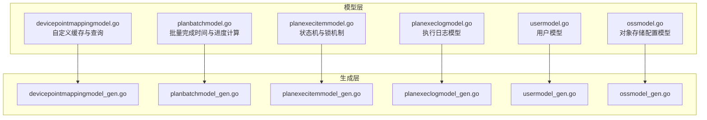
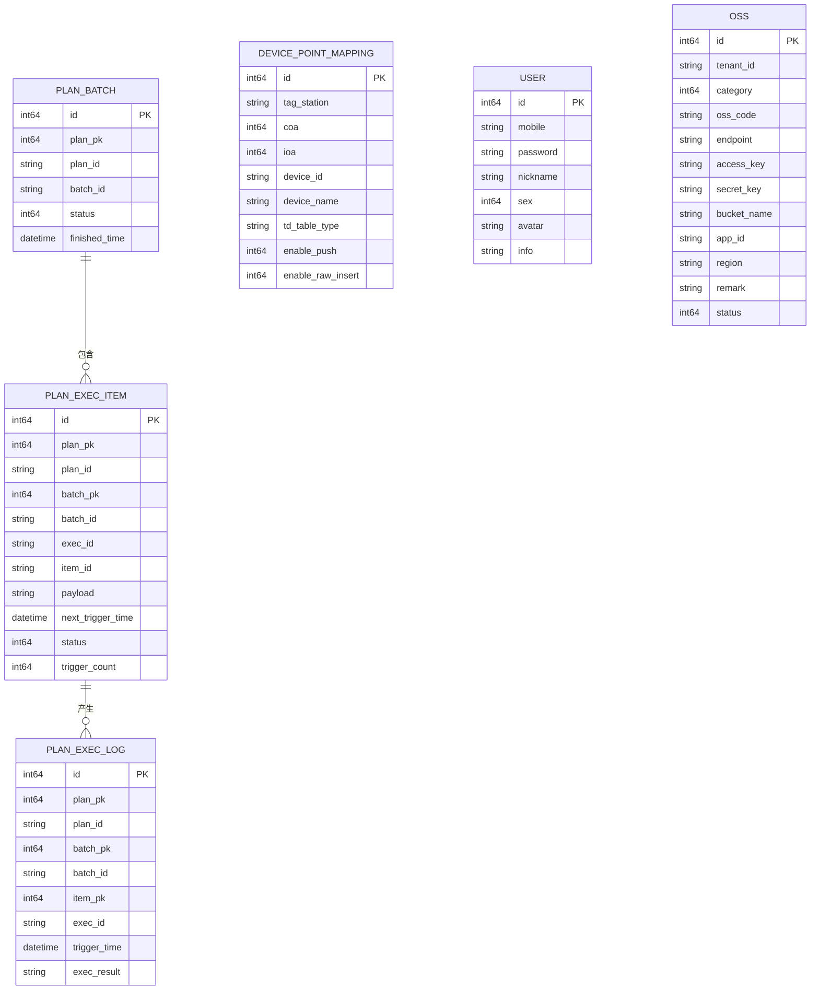
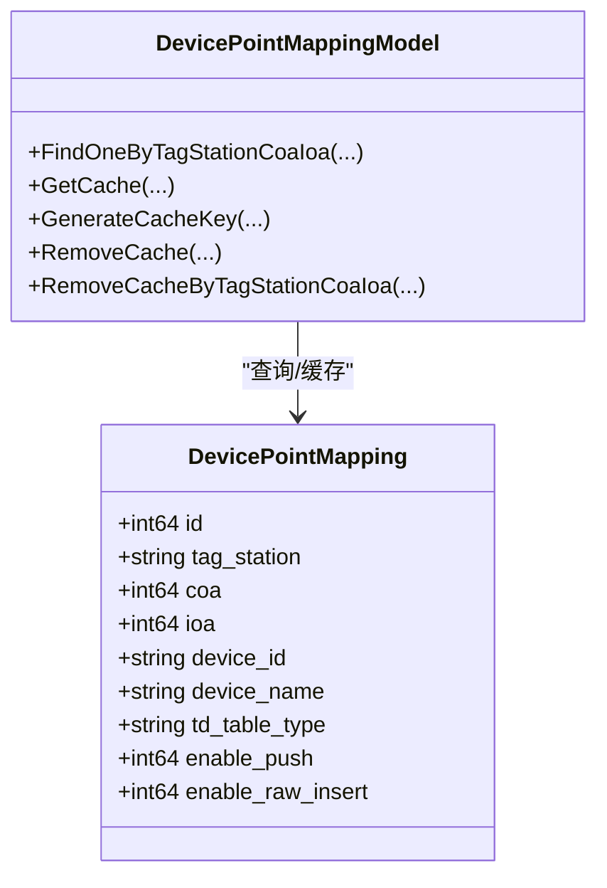
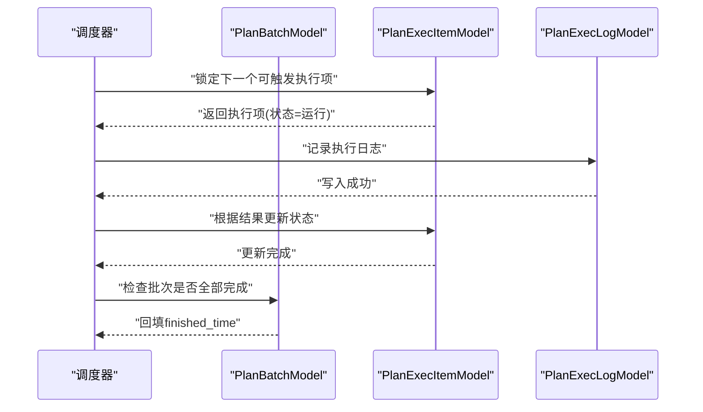
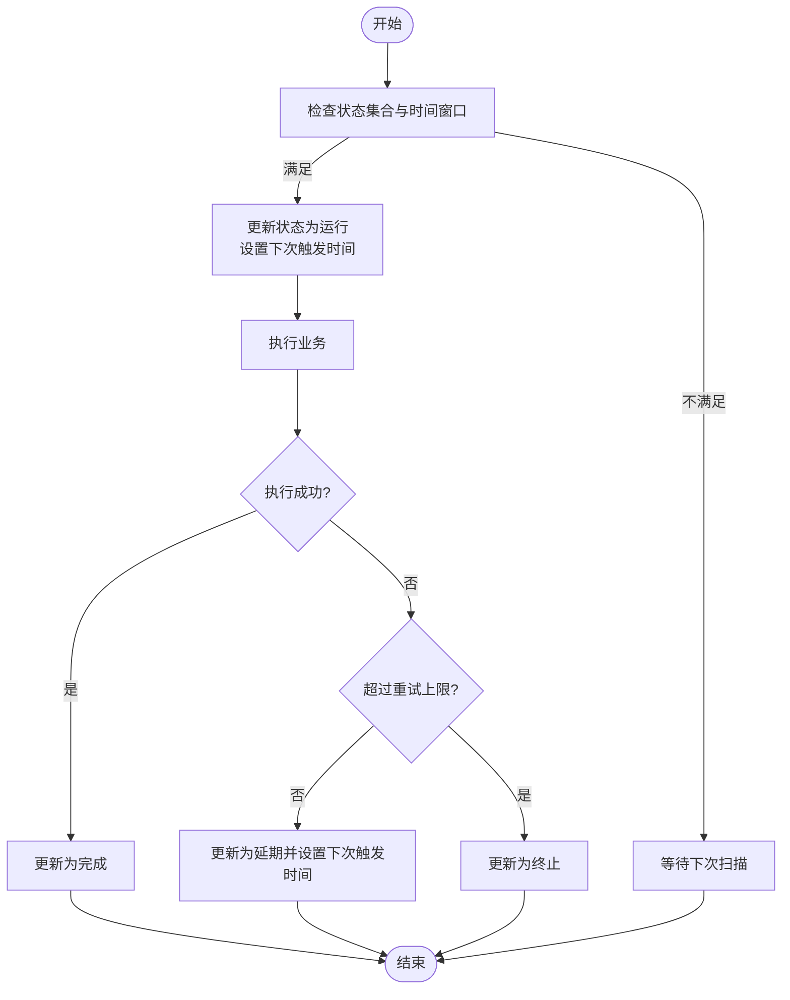
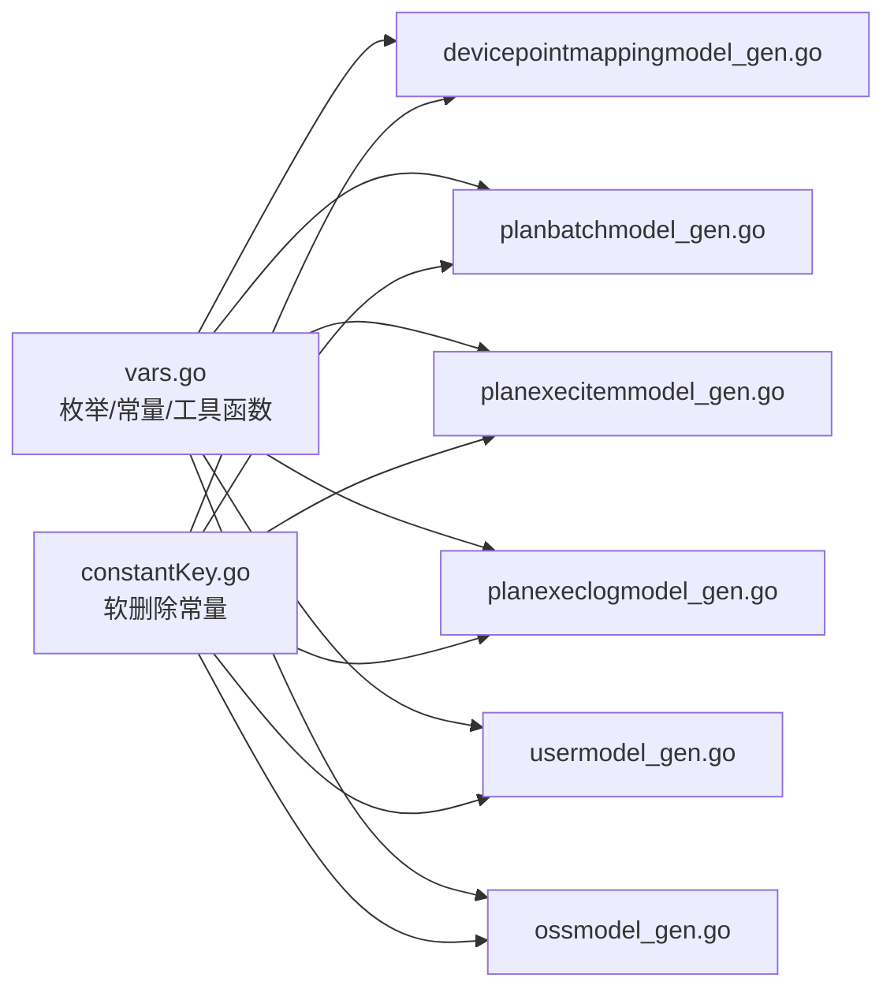

# 数据模型设计

<cite>
**本文引用的文件**
- [devicepointmappingmodel.go](file://model/devicepointmappingmodel.go)
- [devicepointmappingmodel_gen.go](file://model/devicepointmappingmodel_gen.go)
- [planbatchmodel.go](file://model/planbatchmodel.go)
- [planbatchmodel_gen.go](file://model/planbatchmodel_gen.go)
- [planexecitemmodel.go](file://model/planexecitemmodel.go)
- [planexecitemmodel_gen.go](file://model/planexecitemmodel_gen.go)
- [planexeclogmodel.go](file://model/planexeclogmodel.go)
- [planexeclogmodel_gen.go](file://model/planexeclogmodel_gen.go)
- [usermodel.go](file://model/usermodel.go)
- [usermodel_gen.go](file://model/usermodel_gen.go)
- [ossmodel.go](file://model/ossmodel.go)
- [ossmodel_gen.go](file://model/ossmodel_gen.go)
- [vars.go](file://model/vars.go)
- [constantKey.go](file://model/constantKey.go)
</cite>

## 目录
1. [简介](#简介)
2. [项目结构](#项目结构)
3. [核心组件](#核心组件)
4. [架构总览](#架构总览)
5. [详细组件分析](#详细组件分析)
6. [依赖分析](#依赖分析)
7. [性能考虑](#性能考虑)
8. [故障排查指南](#故障排查指南)
9. [结论](#结论)
10. [附录](#附录)

## 简介
本文件系统性梳理 zero-service 的数据模型设计，覆盖以下关键主题：
- 整体设计思路与实体关系
- 设备点映射模型（DevicePointMapping）的设计目的、字段定义与业务规则
- 计划任务相关模型（PlanBatch、PlanExecItem、PlanExecLog）的生命周期与数据流转
- 用户模型（User）的权限与安全设计
- 文件模型（OssFile）的对象存储集成与元数据管理
- 数据库 Schema 图、字段类型与约束
- 数据访问模式、缓存策略与性能优化
- 数据迁移路径、版本管理与数据安全措施

## 项目结构
模型层采用 goctl 自动生成的默认模型与自定义扩展相结合的方式：
- 自动生成层：提供基础 CRUD、分页、Builder 查询、软删除、乐观锁等能力
- 自定义扩展层：在默认模型之上增加业务方法、缓存、跨表统计与复杂状态机逻辑

图表来源
- [devicepointmappingmodel.go:1-108](file://model/devicepointmappingmodel.go#L1-L108)
- [planbatchmodel.go:1-94](file://model/planbatchmodel.go#L1-L94)
- [planexecitemmodel.go:1-435](file://model/planexecitemmodel.go#L1-L435)
- [planexeclogmodel.go:1-31](file://model/planexeclogmodel.go#L1-L31)
- [usermodel.go:1-32](file://model/usermodel.go#L1-L32)
- [ossmodel.go:1-32](file://model/ossmodel.go#L1-L32)
- [devicepointmappingmodel_gen.go:1-549](file://model/devicepointmappingmodel_gen.go#L1-L549)
- [planbatchmodel_gen.go:1-556](file://model/planbatchmodel_gen.go#L1-L556)
- [planexecitemmodel_gen.go:1-512](file://model/planexecitemmodel_gen.go#L1-L512)
- [planexeclogmodel_gen.go:1-486](file://model/planexeclogmodel_gen.go#L1-L486)
- [usermodel_gen.go:1-386](file://model/usermodel_gen.go#L1-L386)
- [ossmodel_gen.go:1-485](file://model/ossmodel_gen.go#L1-L485)

章节来源
- [devicepointmappingmodel.go:1-108](file://model/devicepointmappingmodel.go#L1-L108)
- [planbatchmodel.go:1-94](file://model/planbatchmodel.go#L1-L94)
- [planexecitemmodel.go:1-435](file://model/planexecitemmodel.go#L1-L435)
- [planexeclogmodel.go:1-31](file://model/planexeclogmodel.go#L1-L31)
- [usermodel.go:1-32](file://model/usermodel.go#L1-L32)
- [ossmodel.go:1-32](file://model/ossmodel.go#L1-L32)
- [devicepointmappingmodel_gen.go:1-549](file://model/devicepointmappingmodel_gen.go#L1-L549)
- [planbatchmodel_gen.go:1-556](file://model/planbatchmodel_gen.go#L1-L556)
- [planexecitemmodel_gen.go:1-512](file://model/planexecitemmodel_gen.go#L1-L512)
- [planexeclogmodel_gen.go:1-486](file://model/planexeclogmodel_gen.go#L1-L486)
- [usermodel_gen.go:1-386](file://model/usermodel_gen.go#L1-L386)
- [ossmodel_gen.go:1-485](file://model/ossmodel_gen.go#L1-L485)

## 核心组件
- 设备点映射模型（DevicePointMapping）
  - 设计目的：将 TDengine 的 tag_station/coa/ioa 与业务设备/点位进行映射，支撑上层读写与推送控制
  - 关键字段：主键、软删除、版本号、创建/更新用户、机构编码、TDengine 映射键、设备标识与名称、推送/原始写入开关、扩展字段
  - 业务规则：支持按 tag_station/coa/ioa 唯一定位；提供缓存封装，避免频繁查询数据库
- 计划任务模型族（PlanBatch、PlanExecItem、PlanExecLog）
  - 生命周期：计划（Plan） -> 批次（PlanBatch） -> 执行项（PlanExecItem） -> 日志（PlanExecLog）
  - 状态机：执行项具备等待、延期、运行、暂停、完成、终止等状态，支持锁机制与重试策略
  - 进度与统计：按批次统计状态分布与完成率
- 用户模型（User）
  - 字段：手机号、密码、昵称、性别、头像、扩展信息
  - 安全：软删除、乐观锁；密码等敏感字段不在模型中直接展示
- 对象存储模型（Oss）
  - 字段：租户ID、分类（MinIO/七牛/阿里/腾讯）、资源编号、Endpoint、AK/SK、Bucket、AppId、地域、备注、状态
  - 集成：为文件上传/下载签名、桶级操作提供统一配置入口

章节来源
- [devicepointmappingmodel_gen.go:59-83](file://model/devicepointmappingmodel_gen.go#L59-L83)
- [planbatchmodel_gen.go:57-84](file://model/planbatchmodel_gen.go#L57-L84)
- [planexecitemmodel_gen.go:55-93](file://model/planexecitemmodel_gen.go#L55-L93)
- [planexeclogmodel_gen.go:54-80](file://model/planexeclogmodel_gen.go#L54-L80)
- [usermodel_gen.go:54-67](file://model/usermodel_gen.go#L54-L67)
- [ossmodel_gen.go:63-81](file://model/ossmodel_gen.go#L63-L81)

## 架构总览
下图展示各模型之间的关系与典型交互：

图表来源
- [devicepointmappingmodel_gen.go:59-83](file://model/devicepointmappingmodel_gen.go#L59-L83)
- [planbatchmodel_gen.go:57-84](file://model/planbatchmodel_gen.go#L57-L84)
- [planexecitemmodel_gen.go:55-93](file://model/planexecitemmodel_gen.go#L55-L93)
- [planexeclogmodel_gen.go:54-80](file://model/planexeclogmodel_gen.go#L54-L80)
- [usermodel_gen.go:54-67](file://model/usermodel_gen.go#L54-L67)
- [ossmodel_gen.go:63-81](file://model/ossmodel_gen.go#L63-L81)

## 详细组件分析

### 设备点映射模型（DevicePointMapping）
- 设计目的
  - 将底层 TDengine 的 tag_station/coa/ioa 与上层业务设备/点位建立稳定映射
  - 支持 caller 推送与 raw 原始数据写入的开关控制
- 字段与约束
  - 主键、软删除、版本号、创建/更新用户、机构编码
  - tag_station/coa/ioa 作为联合定位键，配合 del_state=0
  - enable_push/enable_raw_insert 控制行为
- 业务规则
  - 提供按 tag_station/coa/ioa 的唯一查询
  - 内置缓存封装，支持生成缓存键、批量删除、命中复制
- 缓存策略
  - 使用内存缓存，键格式为“pm:{tag_station}:{coa}:{ioa}”
  - 命中后深拷贝返回，避免外部修改影响缓存一致性

图表来源
- [devicepointmappingmodel.go:17-108](file://model/devicepointmappingmodel.go#L17-L108)
- [devicepointmappingmodel_gen.go:59-83](file://model/devicepointmappingmodel_gen.go#L59-L83)

章节来源
- [devicepointmappingmodel.go:1-108](file://model/devicepointmappingmodel.go#L1-L108)
- [devicepointmappingmodel_gen.go:1-549](file://model/devicepointmappingmodel_gen.go#L1-L549)

### 计划任务模型族（PlanBatch、PlanExecItem、PlanExecLog）

#### 生命周期与数据流转
- 计划（Plan）生成批次（PlanBatch），批次内包含多个执行项（PlanExecItem）
- 执行项按 next_trigger_time 扫描触发，执行完成后写入执行日志（PlanExecLog）
- 批次在无未完成项时自动回填 finished_time，并计算完成进度

图表来源
- [planbatchmodel.go:41-66](file://model/planbatchmodel.go#L41-L66)
- [planexecitemmodel.go:74-144](file://model/planexecitemmodel.go#L74-L144)
- [planexeclogmodel.go:1-31](file://model/planexeclogmodel.go#L1-L31)

#### 状态机与锁机制
- 执行项状态：等待、延期、运行、暂停、完成、终止
- 锁机制：使用“时间窗口 + 版本号 + 状态集合”保证并发安全地抢占执行权
- 重试策略：失败后按指数退避计算下次触发时间，超过上限自动终止

图表来源
- [planexecitemmodel.go:74-144](file://model/planexecitemmodel.go#L74-L144)
- [planexecitemmodel.go:202-271](file://model/planexecitemmodel.go#L202-L271)
- [planexecitemmodel.go:315-351](file://model/planexecitemmodel.go#L315-L351)

#### 进度与统计
- 批次完成时间：当不存在未完成的执行项时，回填 finished_time
- 完成进度：按完成项数量/总数量计算百分比

章节来源
- [planbatchmodel.go:1-94](file://model/planbatchmodel.go#L1-L94)
- [planexecitemmodel.go:1-435](file://model/planexecitemmodel.go#L1-L435)
- [planexeclogmodel.go:1-31](file://model/planexeclogmodel.go#L1-L31)

### 用户模型（User）
- 字段与约束
  - 主键、软删除、乐观锁、创建/更新时间
  - 手机号唯一索引（由查询方法体现）
- 安全设计
  - 密码等敏感字段不在模型中直接展示
  - 软删除与乐观锁保障数据一致性与审计

章节来源
- [usermodel_gen.go:54-67](file://model/usermodel_gen.go#L54-L67)
- [usermodel.go:1-32](file://model/usermodel.go#L1-L32)

### 对象存储模型（Oss）
- 字段与约束
  - 主键、软删除、乐观锁
  - 租户ID + 资源编号唯一组合（查询方法体现）
- 集成要点
  - 通过分类字段区分 MinIO/七牛/阿里/腾讯等厂商
  - Endpoint、AK/SK、Bucket、Region 等构成完整连接信息

章节来源
- [ossmodel_gen.go:63-81](file://model/ossmodel_gen.go#L63-L81)
- [ossmodel.go:1-32](file://model/ossmodel.go#L1-L32)

## 依赖分析
- 数据库类型适配：通过 ModelOption 注入 DatabaseType，生成层自动切换占位符与列名包装
- 通用工具：生成列名/值、占位符适配、反射缓存、枚举常量（计划状态、执行状态、结果枚举）
- 软删除与乐观锁：所有生成模型均支持软删除与版本号递增更新

图表来源
- [vars.go:1-318](file://model/vars.go#L1-L318)
- [constantKey.go:1-15](file://model/constantKey.go#L1-L15)
- [devicepointmappingmodel_gen.go:1-549](file://model/devicepointmappingmodel_gen.go#L1-L549)
- [planbatchmodel_gen.go:1-556](file://model/planbatchmodel_gen.go#L1-L556)
- [planexecitemmodel_gen.go:1-512](file://model/planexecitemmodel_gen.go#L1-L512)
- [planexeclogmodel_gen.go:1-486](file://model/planexeclogmodel_gen.go#L1-L486)
- [usermodel_gen.go:1-386](file://model/usermodel_gen.go#L1-L386)
- [ossmodel_gen.go:1-485](file://model/ossmodel_gen.go#L1-L485)

章节来源
- [vars.go:1-318](file://model/vars.go#L1-L318)
- [constantKey.go:1-15](file://model/constantKey.go#L1-L15)

## 性能考虑
- 查询优化
  - 合理使用索引字段（如 tag_station/coa/ioa、batch_id、exec_id、next_trigger_time）
  - 分页查询统一按 id 倒序，减少随机 IO
- 并发与锁
  - 执行项锁定使用“状态集合 + 版本号 + 时间窗口”，避免惊群与死锁
  - 批次完成时间回填使用子查询与存在性判断，确保幂等
- 缓存策略
  - 设备点映射使用内存缓存，键空间明确，命中后深拷贝避免共享状态
- 数据库适配
  - MySQL 使用 “`字段`” 包裹，Postgres 使用 “"字段"”，自动占位符适配

## 故障排查指南
- 常见错误
  - ErrNotFound：查询不到记录
  - ErrNoRowsUpdate：乐观锁更新失败（版本号不匹配）
- 排查步骤
  - 检查软删除标志 del_state=0
  - 核对版本号与状态集合条件
  - 确认 next_trigger_time 与当前时间的关系
  - 查看批次是否存在未完成项导致 finished_time 未回填

章节来源
- [vars.go:18-21](file://model/vars.go#L18-L21)
- [planexecitemmodel.go:74-144](file://model/planexecitemmodel.go#L74-L144)
- [planbatchmodel.go:41-66](file://model/planbatchmodel.go#L41-L66)

## 结论
该数据模型以“生成层 + 自定义扩展”的方式实现高内聚、低耦合的数据访问层：
- 生成层提供一致的 CRUD、分页、Builder 查询与软删除/乐观锁能力
- 自定义扩展针对业务场景（设备点映射缓存、计划任务状态机、批次完成与进度统计）进行增强
- 通过枚举常量、占位符适配与缓存策略，兼顾可维护性与性能

## 附录

### 数据库 Schema 与字段类型说明
- 设备点映射（device_point_mapping）
  - 字段：id、create_time、update_time、delete_time、del_state、version、create_user、update_user、dept_code、tag_station、coa、ioa、device_id、device_name、td_table_type、enable_push、enable_raw_insert、description、ext_1~ext_5
  - 约束：del_state=0 且联合键（tag_station, coa, ioa）唯一
- 计划批次（plan_batch）
  - 字段：id、create_time、update_time、delete_time、del_state、version、create_user、update_user、dept_code、plan_pk、plan_id、batch_id、batch_name、batch_num、status、scan_flg、plan_trigger_time、terminated_reason、paused_time、paused_reason、finished_time、ext_1~ext_5
  - 约束：del_state=0
- 计划执行项（plan_exec_item）
  - 字段：id、create_time、update_time、delete_time、del_state、version、create_user、update_user、dept_code、plan_pk、plan_id、batch_pk、batch_id、exec_id、item_id、item_type、item_name、item_row_id、point_id、payload、request_timeout、plan_trigger_time、next_trigger_time、last_trigger_time、trigger_count、status、last_result、last_message、last_reason、terminated_reason、paused_time、paused_reason、ext_1~ext_5
  - 约束：del_state=0
- 计划执行日志（plan_exec_log）
  - 字段：id、create_time、update_time、delete_time、del_state、version、create_user、update_user、dept_code、plan_pk、plan_id、plan_name、batch_pk、batch_id、item_pk、exec_id、item_id、item_type、item_name、point_id、trigger_time、trace_id、exec_result、message、reason
  - 约束：del_state=0
- 用户（user）
  - 字段：id、create_time、update_time、delete_time、del_state、version、mobile、password、nickname、sex、avatar、info
  - 约束：del_state=0，mobile 唯一
- 对象存储（oss）
  - 字段：id、create_time、update_time、delete_time、del_state、version、tenant_id、category、oss_code、endpoint、access_key、secret_key、bucket_name、app_id、region、remark、status
  - 约束：del_state=0，tenant_id + oss_code 唯一

章节来源
- [devicepointmappingmodel_gen.go:59-83](file://model/devicepointmappingmodel_gen.go#L59-L83)
- [planbatchmodel_gen.go:57-84](file://model/planbatchmodel_gen.go#L57-L84)
- [planexecitemmodel_gen.go:55-93](file://model/planexecitemmodel_gen.go#L55-L93)
- [planexeclogmodel_gen.go:54-80](file://model/planexeclogmodel_gen.go#L54-L80)
- [usermodel_gen.go:54-67](file://model/usermodel_gen.go#L54-L67)
- [ossmodel_gen.go:63-81](file://model/ossmodel_gen.go#L63-L81)

### 数据访问模式与缓存策略
- 访问模式
  - Builder 查询：统一 SelectBuilder/InsertBuilder/UpdateBuilder/DeleteBuilder
  - 分页：FindPageListByPage / FindPageListByPageWithTotal
  - 软删除：DeleteSoft 将 del_state 置 1 并写入 delete_time
  - 乐观锁：UpdateWithVersion 在 where 中携带旧 version
- 缓存策略
  - 设备点映射：内存缓存 + 命中深拷贝，键空间“pm:{tag_station}:{coa}:{ioa}”
  - 批次完成时间：基于子查询的存在性判断，避免重复更新

章节来源
- [devicepointmappingmodel.go:66-107](file://model/devicepointmappingmodel.go#L66-L107)
- [planbatchmodel.go:41-66](file://model/planbatchmodel.go#L41-L66)
- [vars.go:155-182](file://model/vars.go#L155-L182)

### 数据迁移路径、版本管理与安全措施
- 迁移路径
  - 生成层提供 Insert/Update/Delete/FindAll/FindPageList 等通用方法，便于脚本化迁移
  - 软删除字段统一，便于历史数据保留与审计
- 版本管理
  - 乐观锁字段 version，每次更新 version+1
  - ModelOption 支持多数据库类型，便于灰度与迁移
- 安全措施
  - 用户模型不暴露敏感字段内容
  - 执行项状态机严格控制状态转换与重试上限
  - 对象存储配置集中管理，避免硬编码

章节来源
- [vars.go:61-88](file://model/vars.go#L61-L88)
- [usermodel_gen.go:137-164](file://model/usermodel_gen.go#L137-L164)
- [planexecitemmodel.go:202-271](file://model/planexecitemmodel.go#L202-L271)