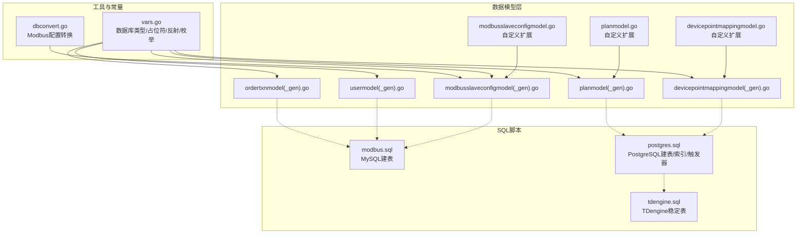
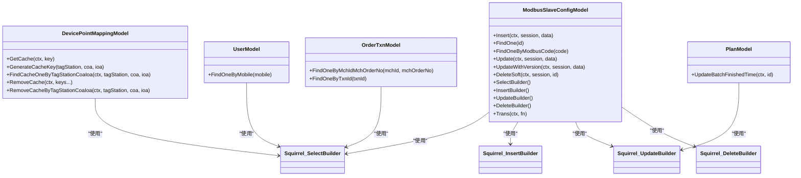
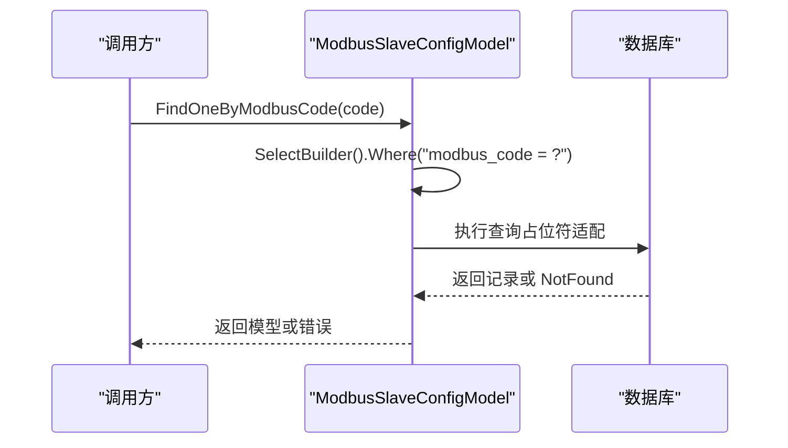
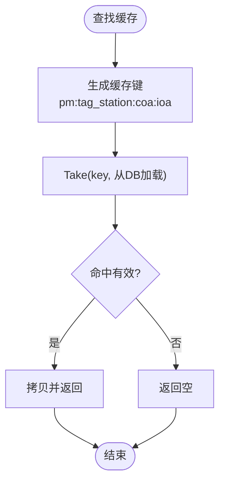
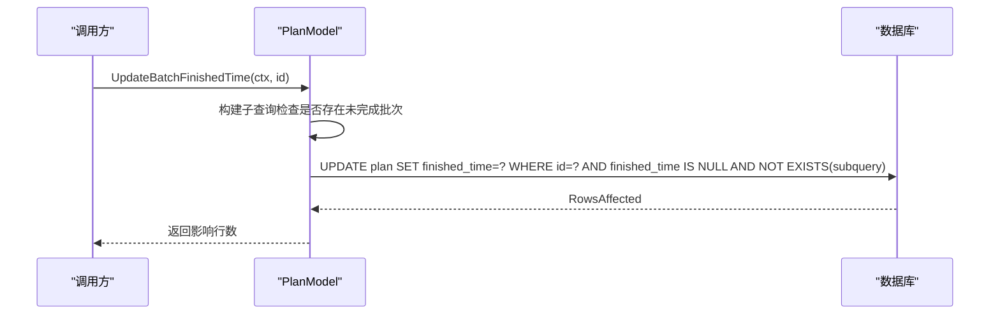
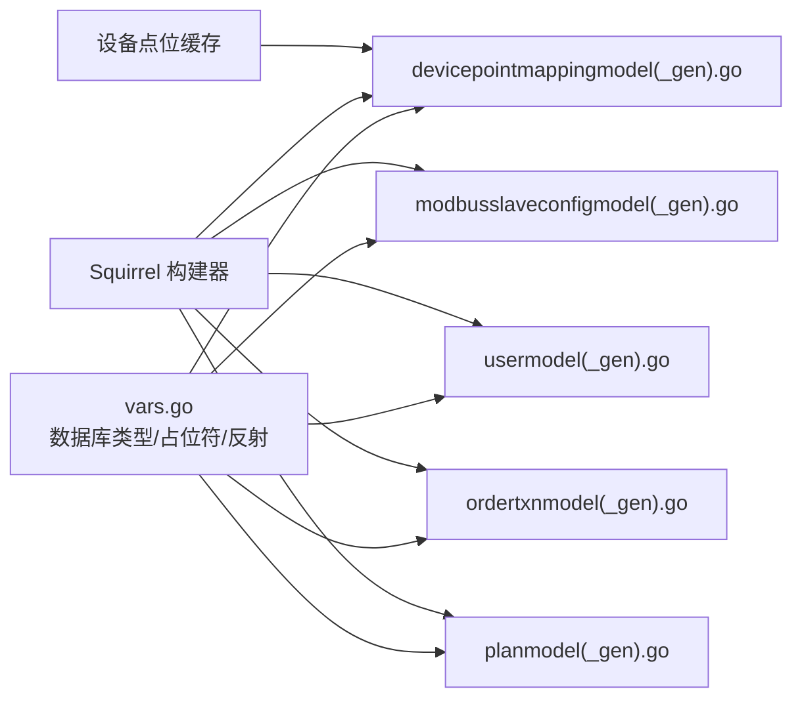

# 数据模型设计

<cite>
**本文引用的文件**
- [model/modbusslaveconfigmodel.go](file://model/modbusslaveconfigmodel.go)
- [model/modbusslaveconfigmodel_gen.go](file://model/modbusslaveconfigmodel_gen.go)
- [model/devicepointmappingmodel.go](file://model/devicepointmappingmodel.go)
- [model/devicepointmappingmodel_gen.go](file://model/devicepointmappingmodel_gen.go)
- [model/usermodel.go](file://model/usermodel.go)
- [model/usermodel_gen.go](file://model/usermodel_gen.go)
- [model/ordertxnmodel.go](file://model/ordertxnmodel.go)
- [model/ordertxnmodel_gen.go](file://model/ordertxnmodel_gen.go)
- [model/planmodel.go](file://model/planmodel.go)
- [model/planmodel_gen.go](file://model/planmodel_gen.go)
- [model/dbconvert.go](file://model/dbconvert.go)
- [model/vars.go](file://model/vars.go)
- [model/sql/modbus.sql](file://model/sql/modbus.sql)
- [model/sql/postgres.sql](file://model/sql/postgres.sql)
- [model/sql/tdengine.sql](file://model/sql/tdengine.sql)
</cite>

## 目录
1. [简介](#简介)
2. [项目结构](#项目结构)
3. [核心组件](#核心组件)
4. [架构总览](#架构总览)
5. [详细组件分析](#详细组件分析)
6. [依赖分析](#依赖分析)
7. [性能考量](#性能考量)
8. [故障排查指南](#故障排查指南)
9. [结论](#结论)
10. [附录](#附录)

## 简介
本文件系统化梳理 Zero-Service 的数据模型设计，覆盖数据库设计原则、表结构与索引策略、数据访问层实现（含 Model 生成工具、SQL Builder 集成与事务管理）、核心模型的业务语义与关系约束、多数据库适配（MySQL、PostgreSQL、TDengine）以及迁移与版本管理方法。同时提供查询优化、缓存策略与性能调优建议，并给出完整数据字典与 ER 图，帮助开发者快速理解与高效使用。

## 项目结构
数据模型相关代码主要位于 model 目录，包含：
- 自动生成的模型文件（_gen.go）：基于 goctl 生成，封装了 CRUD、分页、Builder 查询、软删除、乐观锁等通用能力
- 自定义扩展模型（不含 _gen.go）：在默认模型基础上增加会话级 withSession、缓存、特定业务方法等
- 通用工具与常量：数据库类型、占位符适配、反射元信息、错误常量、缓存条目等
- SQL 脚本：MySQL/PostgreSQL/TSIM/TDengine 的建表与索引定义



图表来源
- [model/modbusslaveconfigmodel.go:1-32](file://model/modbusslaveconfigmodel.go#L1-L32)
- [model/modbusslaveconfigmodel_gen.go:1-565](file://model/modbusslaveconfigmodel_gen.go#L1-L565)
- [model/devicepointmappingmodel.go:1-108](file://model/devicepointmappingmodel.go#L1-L108)
- [model/devicepointmappingmodel_gen.go:1-549](file://model/devicepointmappingmodel_gen.go#L1-L549)
- [model/usermodel.go:1-32](file://model/usermodel.go#L1-L32)
- [model/usermodel_gen.go:1-386](file://model/usermodel_gen.go#L1-L386)
- [model/ordertxnmodel.go:1-32](file://model/ordertxnmodel.go#L1-L32)
- [model/ordertxnmodel_gen.go:1-421](file://model/ordertxnmodel_gen.go#L1-L421)
- [model/planmodel.go:1-65](file://model/planmodel.go#L1-L65)
- [model/planmodel_gen.go:1-530](file://model/planmodel_gen.go#L1-L530)
- [model/vars.go:1-318](file://model/vars.go#L1-L318)
- [model/dbconvert.go:1-56](file://model/dbconvert.go#L1-L56)
- [model/sql/modbus.sql:1-32](file://model/sql/modbus.sql#L1-L32)
- [model/sql/postgres.sql:1-526](file://model/sql/postgres.sql#L1-L526)
- [model/sql/tdengine.sql:1-34](file://model/sql/tdengine.sql#L1-L34)

章节来源
- [model/modbusslaveconfigmodel.go:1-32](file://model/modbusslaveconfigmodel.go#L1-L32)
- [model/devicepointmappingmodel.go:1-108](file://model/devicepointmappingmodel.go#L1-L108)
- [model/usermodel.go:1-32](file://model/usermodel.go#L1-L32)
- [model/ordertxnmodel.go:1-32](file://model/ordertxnmodel.go#L1-L32)
- [model/planmodel.go:1-65](file://model/planmodel.go#L1-L65)
- [model/vars.go:1-318](file://model/vars.go#L1-L318)

## 核心组件
本节聚焦数据访问层的通用能力与多数据库适配机制：
- 数据库类型与占位符适配：统一通过 WithDBType 注入数据库类型，自动切换占位符与列名包装
- 通用 CRUD 与分页：SelectBuilder/InsertBuilder/UpdateBuilder/DeleteBuilder 统一封装
- 软删除与乐观锁：统一的 del_state/version 字段与 UpdateWithVersion 逻辑
- 事务与会话：Trans(ctx, fn) 在会话内执行；自定义模型支持 withSession(session) 传递会话
- 缓存：设备点位映射模型内置缓存，支持按 key 获取、批量移除、按 TDengine 标识生成缓存键
- SQL Builder 集成：Squirrel 的 Select/Insert/Update/Delete 构建器，PostgreSQL 使用 Dollar 占位符

章节来源
- [model/vars.go:47-88](file://model/vars.go#L47-L88)
- [model/modbusslaveconfigmodel_gen.go:530-560](file://model/modbusslaveconfigmodel_gen.go#L530-L560)
- [model/devicepointmappingmodel_gen.go:514-544](file://model/devicepointmappingmodel_gen.go#L514-L544)
- [model/usermodel_gen.go:379-385](file://model/usermodel_gen.go#L379-L385)
- [model/ordertxnmodel_gen.go:414-420](file://model/ordertxnmodel_gen.go#L414-L420)
- [model/planmodel_gen.go:495-525](file://model/planmodel_gen.go#L495-L525)
- [model/devicepointmappingmodel.go:36-108](file://model/devicepointmappingmodel.go#L36-L108)

## 架构总览
下图展示数据访问层与核心模型的关系，以及与 SQL Builder 和数据库类型的交互：



图表来源
- [model/modbusslaveconfigmodel_gen.go:24-50](file://model/modbusslaveconfigmodel_gen.go#L24-L50)
- [model/devicepointmappingmodel_gen.go:24-50](file://model/devicepointmappingmodel_gen.go#L24-L50)
- [model/usermodel_gen.go:29-46](file://model/usermodel_gen.go#L29-L46)
- [model/ordertxnmodel_gen.go:29-47](file://model/ordertxnmodel_gen.go#L29-L47)
- [model/planmodel_gen.go:20-46](file://model/planmodel_gen.go#L20-L46)

## 详细组件分析

### ModbusSlaveConfig 模型
- 业务含义：记录 Modbus 从站连接配置，支持超时、空闲、TLS 等参数，唯一编码保证去重
- 关键字段：modbus_code（唯一）、slave_address、slave、timeout、idle_timeout、enable_tls、status 等
- 通用能力：FindOneByModbusCode、软删除、乐观锁、Builder 查询、分页
- 适配策略：PostgreSQL 下使用 Dollar 占位符，返回 id 通过 RETURNING 兼容
- 事务与会话：Trans 与 withSession 支持跨操作一致性



图表来源
- [model/modbusslaveconfigmodel_gen.go:131-150](file://model/modbusslaveconfigmodel_gen.go#L131-L150)
- [model/modbusslaveconfigmodel_gen.go:530-560](file://model/modbusslaveconfigmodel_gen.go#L530-L560)

章节来源
- [model/modbusslaveconfigmodel.go:1-32](file://model/modbusslaveconfigmodel.go#L1-L32)
- [model/modbusslaveconfigmodel_gen.go:1-565](file://model/modbusslaveconfigmodel_gen.go#L1-L565)
- [model/sql/modbus.sql:1-32](file://model/sql/modbus.sql#L1-L32)

### 设备点位映射模型
- 业务含义：将 TDengine 的 tag_station/coa/ioa 映射到设备与表类型，支持推送与原始数据写入控制
- 关键字段：tag_station、coa、ioa（联合唯一）、device_id、td_table_type、enable_push、enable_raw_insert
- 缓存策略：基于 collection.Cache 的本地缓存，按 key 生成规则命中，支持批量移除
- 事务与会话：与 Modbus 模型一致



图表来源
- [model/devicepointmappingmodel.go:70-107](file://model/devicepointmappingmodel.go#L70-L107)
- [model/devicepointmappingmodel_gen.go:134-153](file://model/devicepointmappingmodel_gen.go#L134-L153)

章节来源
- [model/devicepointmappingmodel.go:1-108](file://model/devicepointmappingmodel.go#L1-L108)
- [model/devicepointmappingmodel_gen.go:1-549](file://model/devicepointmappingmodel_gen.go#L1-L549)

### 用户模型
- 业务含义：用户基本信息与登录凭证，支持手机号唯一
- 关键字段：mobile（唯一）、password、nickname、sex、avatar、info
- 通用能力：FindOneByMobile、软删除、乐观锁、分页

章节来源
- [model/usermodel.go:1-32](file://model/usermodel.go#L1-L32)
- [model/usermodel_gen.go:1-386](file://model/usermodel_gen.go#L1-L386)

### 订单事务模型
- 业务含义：支付订单流水，支持商户订单号与平台订单号双索引
- 关键字段：txn_id、mch_id/mch_order_no、txn_type、txn_amt、result、user_id 等
- 通用能力：FindOneByTxnId、FindOneByMchIdMchOrderNo、软删除、乐观锁

章节来源
- [model/ordertxnmodel.go:1-32](file://model/ordertxnmodel.go#L1-L32)
- [model/ordertxnmodel_gen.go:1-421](file://model/ordertxnmodel_gen.go#L1-L421)

### 计划任务模型
- 业务含义：计划任务与执行项、批次、日志的完整生命周期管理
- 关键字段：plan_id（唯一）、recurrence_rule、status、scan_flg、next_trigger_time 等
- 业务方法：UpdateBatchFinishedTime 基于子查询原子更新计划完成时间
- 通用能力：软删除、乐观锁、Builder 查询、分页



图表来源
- [model/planmodel.go:39-64](file://model/planmodel.go#L39-L64)
- [model/planmodel_gen.go:424-430](file://model/planmodel_gen.go#L424-L430)

章节来源
- [model/planmodel.go:1-65](file://model/planmodel.go#L1-L65)
- [model/planmodel_gen.go:1-530](file://model/planmodel_gen.go#L1-L530)

### 数据库类型与占位符适配
- 数据库类型：MySQL、Postgres、SQLite、TAOS
- 占位符适配：PostgreSQL 使用 $n，其他使用 ?
- 列名包装：MySQL 使用反引号，PostgreSQL 使用双引号
- 反射缓存：Struct 字段元信息缓存，提升列名提取性能

章节来源
- [model/vars.go:47-88](file://model/vars.go#L47-L88)
- [model/vars.go:155-182](file://model/vars.go#L155-L182)
- [model/vars.go:187-206](file://model/vars.go#L187-L206)

### Modbus 配置转换器
- 作用：将数据库中的 ModbusSlaveConfig 转换为运行时客户端配置，支持 TLS 参数
- 批量转换：按 modbus_code 生成映射表，便于连接池初始化

章节来源
- [model/dbconvert.go:1-56](file://model/dbconvert.go#L1-L56)

## 依赖分析
- 模型间无直接耦合：各模型独立封装 CRUD 与业务方法
- 与 SQL Builder 的依赖：所有查询通过 Select/Insert/Update/Delete 构建器生成 SQL
- 与数据库类型的依赖：通过 WithDBType 注入，自动切换占位符与列名包装
- 与缓存的依赖：设备点位映射模型内嵌缓存，降低高频查询开销



图表来源
- [model/vars.go:47-88](file://model/vars.go#L47-L88)
- [model/modbusslaveconfigmodel_gen.go:530-560](file://model/modbusslaveconfigmodel_gen.go#L530-L560)
- [model/devicepointmappingmodel_gen.go:514-544](file://model/devicepointmappingmodel_gen.go#L514-L544)
- [model/usermodel_gen.go:379-385](file://model/usermodel_gen.go#L379-L385)
- [model/ordertxnmodel_gen.go:414-420](file://model/ordertxnmodel_gen.go#L414-L420)
- [model/planmodel_gen.go:495-525](file://model/planmodel_gen.go#L495-L525)
- [model/devicepointmappingmodel.go:36-108](file://model/devicepointmappingmodel.go#L36-L108)

## 性能考量
- 查询优化
  - 优先使用带索引的过滤条件（如 modbus_code、plan_id、exec_id 等）
  - 分页查询使用 id DESC 或 id ASC 边界扫描，避免深度分页
  - 使用 SelectBuilder 指定列，减少不必要的字段传输
- 缓存策略
  - 设备点位映射模型对高频查询进行本地缓存，缓存键由 tag_station/coa/ioa 组成
  - 提供批量移除接口，确保缓存一致性
- 事务与并发
  - 使用 Trans 在单次业务流程内复用会话，减少连接开销
  - 乐观锁通过 version 字段防止并发覆盖
- 数据库适配
  - PostgreSQL 使用 RETURNING 获取自增 id，减少一次查询
  - 占位符与列名包装自动适配，避免手写 SQL 的兼容成本

[本节为通用指导，无需列出具体文件来源]

## 故障排查指南
- 常见错误
  - ErrNotFound：查询不到记录时返回
  - ErrNoRowsUpdate：乐观锁更新无行变更
- 排查步骤
  - 确认唯一索引是否满足业务需求（如 modbus_code、plan_id、exec_id）
  - 检查 del_state=0 的软删除过滤是否正确
  - 核对数据库类型配置与占位符是否匹配
  - 对高频查询开启缓存并验证缓存键生成逻辑

章节来源
- [model/vars.go:18-21](file://model/vars.go#L18-L21)

## 结论
本数据模型体系以 goctl 自动生成为基础，结合自定义扩展与通用工具，实现了多数据库适配、事务与会话管理、缓存与 Builder 查询等关键能力。通过明确的业务模型与索引策略，既保证了开发效率，也兼顾了运行时性能与可维护性。建议在新增模型时遵循现有模式，统一使用 Builder、软删除与乐观锁，并为热点字段建立合适索引。

[本节为总结性内容，无需列出具体文件来源]

## 附录

### 数据库设计原则
- 软删除：统一使用 del_state 与 delete_time，避免物理删除
- 乐观锁：统一使用 version 字段，配合 UpdateWithVersion 防并发
- 唯一性：对业务唯一键建立唯一索引（如 modbus_code、plan_id、exec_id）
- 时间戳：统一 create_time/update_time，PostgreSQL 使用触发器或应用侧设置
- 索引策略：围绕高频过滤与排序字段建立索引，避免全表扫描

章节来源
- [model/modbusslaveconfigmodel_gen.go:258-272](file://model/modbusslaveconfigmodel_gen.go#L258-L272)
- [model/devicepointmappingmodel_gen.go:261-275](file://model/devicepointmappingmodel_gen.go#L261-L275)
- [model/usermodel_gen.go:166-173](file://model/usermodel_gen.go#L166-L173)
- [model/ordertxnmodel_gen.go:201-208](file://model/ordertxnmodel_gen.go#L201-L208)
- [model/planmodel_gen.go:256-270](file://model/planmodel_gen.go#L256-L270)

### 表结构与索引策略
- MySQL/PostgreSQL 建表与索引
  - modbus_slave_config：唯一索引 modbus_code
  - device_point_mapping：联合唯一索引 (tag_station, coa, ioa)
  - plan/exec_item/batch/log：围绕 plan_id、batch_id、exec_id、status、next_trigger_time 等建立复合索引
- TDengine 稳定表
  - raw_point_data、tele_signal_data、telemetry_data 三类稳定表，按站点与点位打标签

章节来源
- [model/sql/modbus.sql:1-32](file://model/sql/modbus.sql#L1-L32)
- [model/sql/postgres.sql:24-93](file://model/sql/postgres.sql#L24-L93)
- [model/sql/postgres.sql:94-180](file://model/sql/postgres.sql#L94-L180)
- [model/sql/postgres.sql:181-286](file://model/sql/postgres.sql#L181-L286)
- [model/sql/postgres.sql:287-357](file://model/sql/postgres.sql#L287-L357)
- [model/sql/postgres.sql:371-451](file://model/sql/postgres.sql#L371-L451)
- [model/sql/postgres.sql:452-526](file://model/sql/postgres.sql#L452-L526)
- [model/sql/tdengine.sql:1-34](file://model/sql/tdengine.sql#L1-L34)

### 多数据库支持与适配
- 数据库类型注入：WithDBType 支持 mysql/postgres/sqlite/taos
- 占位符适配：PostgreSQL 使用 $n，其他使用 ?
- 列名包装：MySQL 反引号，PostgreSQL 双引号
- 结果集适配：PostgreSQL 插入后使用 RETURNING 兼容 LastInsertId

章节来源
- [model/vars.go:68-88](file://model/vars.go#L68-L88)
- [model/vars.go:187-206](file://model/vars.go#L187-L206)
- [model/modbusslaveconfigmodel_gen.go:160-195](file://model/modbusslaveconfigmodel_gen.go#L160-L195)
- [model/planmodel_gen.go:164-195](file://model/planmodel_gen.go#L164-L195)

### 数据迁移与版本管理
- 建表脚本分离：MySQL 与 PostgreSQL 各自维护建表与索引
- 触发器与函数：PostgreSQL 使用触发器自动维护时间戳
- 版本字段：所有模型均包含 version 字段，配合 UpdateWithVersion 实现乐观锁
- 建议流程
  - 新增字段：先加字段与索引，再回填数据，最后放开业务使用
  - 修改索引：评估影响范围与查询计划，必要时分批重建
  - 跨库迁移：先在目标库创建结构，再导出导入数据，最后切换流量

章节来源
- [model/sql/postgres.sql:1-22](file://model/sql/postgres.sql#L1-L22)
- [model/modbusslaveconfigmodel_gen.go:223-255](file://model/modbusslaveconfigmodel_gen.go#L223-L255)
- [model/devicepointmappingmodel_gen.go:223-259](file://model/devicepointmappingmodel_gen.go#L223-L259)
- [model/usermodel_gen.go:137-164](file://model/usermodel_gen.go#L137-L164)
- [model/ordertxnmodel_gen.go:172-199](file://model/ordertxnmodel_gen.go#L172-L199)
- [model/planmodel_gen.go:223-254](file://model/planmodel_gen.go#L223-L254)

### 使用示例与最佳实践
- 使用示例（路径参考）
  - 查询唯一配置：[FindOneByModbusCode:131-150](file://model/modbusslaveconfigmodel_gen.go#L131-L150)
  - 分页查询计划：[FindPageListByPage:332-355](file://model/planmodel_gen.go#L332-L355)
  - 批量转换 Modbus 配置：[BatchToClientConf:43-55](file://model/dbconvert.go#L43-L55)
- 最佳实践
  - 优先使用 Builder 查询，避免手写 SQL
  - 对热点字段建立索引，定期分析慢查询
  - 使用缓存降低高频读取压力，注意缓存失效策略
  - 事务内尽量合并多次写入，减少往返

章节来源
- [model/modbusslaveconfigmodel_gen.go:131-150](file://model/modbusslaveconfigmodel_gen.go#L131-L150)
- [model/planmodel_gen.go:332-355](file://model/planmodel_gen.go#L332-L355)
- [model/dbconvert.go:43-55](file://model/dbconvert.go#L43-L55)

### 数据字典与 ER 图

#### 数据字典
- modbus_slave_config
  - 字段：id、create_time、update_time、delete_time、del_state、version、modbus_code、slave_address、slave、timeout、idle_timeout、link_recovery_timeout、protocol_recovery_timeout、connect_delay、enable_tls、tls_cert_file、tls_key_file、tls_ca_file、status、remark
  - 约束：PRIMARY KEY(id)，UNIQUE(modbus_code)
- device_point_mapping
  - 字段：id、create_time、update_time、delete_time、del_state、version、create_user、update_user、dept_code、tag_station、coa、ioa、device_id、device_name、td_table_type、enable_push、enable_raw_insert、description、ext_1..ext_5
  - 约束：PRIMARY KEY(id)，UNIQUE(tag_station, coa, ioa)
- plan
  - 字段：id、create_time、update_time、delete_time、del_state、version、create_user、update_user、dept_code、plan_id、plan_name、type、group_id、recurrence_rule、start_time、end_time、status、scan_flg、terminated_reason、paused_time、paused_reason、finished_time、description、ext_1..ext_5
  - 约束：PRIMARY KEY(id)，UNIQUE(plan_id)
- plan_exec_item
  - 字段：id、create_time、update_time、delete_time、del_state、version、create_user、update_user、dept_code、plan_pk、plan_id、batch_pk、batch_id、exec_id、item_id、item_type、item_name、item_row_id、point_id、payload、request_timeout、plan_trigger_time、next_trigger_time、last_trigger_time、trigger_count、status、last_result、last_message、last_reason、terminated_reason、paused_time、paused_reason、ext_1..ext_5
  - 约束：PRIMARY KEY(id)，UNIQUE(exec_id)
- plan_batch
  - 字段：id、create_time、update_time、delete_time、del_state、version、create_user、update_user、dept_code、plan_pk、plan_id、batch_id、batch_name、batch_num、status、scan_flg、plan_trigger_time、terminated_reason、paused_time、paused_reason、finished_time、ext_1..ext_5
  - 约束：PRIMARY KEY(id)，UNIQUE(batch_id)
- plan_exec_log
  - 字段：id、create_time、update_time、delete_time、del_state、version、create_user、update_user、dept_code、plan_pk、plan_id、plan_name、batch_pk、batch_id、item_pk、exec_id、item_id、item_type、item_name、point_id、trigger_time、trace_id、exec_result、message、reason
  - 约束：PRIMARY KEY(id)
- order_txn
  - 字段：id、create_time、update_time、delete_time、del_state、version、txn_id、ori_txn_id、txn_time、txn_date、mch_id、mch_order_no、pay_type、txn_type、txn_channel、txn_amt、real_amt、result、body、extra、userId、channel_user、channel_pay_time、channel_order_no、payer_acct、payer_acct_name、payer_acct_bank_name、payee_acct、payee_acct_name、payee_acct_bank_name、qr_code、expire_time
  - 约束：PRIMARY KEY(id)
- user
  - 字段：id、create_time、update_time、delete_time、del_state、version、mobile、password、nickname、sex、avatar、info
  - 约束：PRIMARY KEY(id)

章节来源
- [model/sql/modbus.sql:1-32](file://model/sql/modbus.sql#L1-L32)
- [model/sql/postgres.sql:24-93](file://model/sql/postgres.sql#L24-L93)
- [model/sql/postgres.sql:94-180](file://model/sql/postgres.sql#L94-L180)
- [model/sql/postgres.sql:181-286](file://model/sql/postgres.sql#L181-L286)
- [model/sql/postgres.sql:287-357](file://model/sql/postgres.sql#L287-L357)
- [model/sql/postgres.sql:371-451](file://model/sql/postgres.sql#L371-L451)
- [model/sql/postgres.sql:452-526](file://model/sql/postgres.sql#L452-L526)
- [model/ordertxnmodel_gen.go:55-88](file://model/ordertxnmodel_gen.go#L55-L88)
- [model/usermodel_gen.go:54-67](file://model/usermodel_gen.go#L54-L67)

#### ER 图
```mermaid
erDiagram
MODBUS_SLAVE_CONFIG {
bigint id PK
datetime create_time
datetime update_time
datetime delete_time
tinyint del_state
int version
varchar modbus_code UK
varchar slave_address
int slave
int timeout
int idle_timeout
int link_recovery_timeout
int protocol_recovery_timeout
int connect_delay
tinyint enable_tls
varchar tls_cert_file
varchar tls_key_file
varchar tls_ca_file
tinyint status
varchar remark
}
DEVICE_POINT_MAPPING {
bigint id PK
datetime create_time
datetime update_time
datetime delete_time
smallint del_state
int version
varchar create_user
varchar update_user
varchar dept_code
varchar tag_station
int coa
int ioa
varchar device_id
varchar device_name
varchar td_table_type
smallint enable_push
smallint enable_raw_insert
varchar description
varchar ext_1..ext_5
}
PLAN {
bigint id PK
timestamp create_time
timestamp update_time
timestamp delete_time
smallint del_state
int version
varchar create_user
varchar update_user
varchar dept_code
varchar plan_id UK
varchar plan_name
varchar type
varchar group_id
jsonb recurrence_rule
timestamp start_time
timestamp end_time
smallint status
smallint scan_flg
varchar terminated_reason
timestamp paused_time
varchar paused_reason
timestamp finished_time
varchar description
varchar ext_1..ext_5
}
PLAN_EXEC_ITEM {
bigint id PK
timestamp create_time
timestamp update_time
timestamp delete_time
smallint del_state
int version
varchar create_user
varchar update_user
varchar dept_code
bigint plan_pk
varchar plan_id
bigint batch_pk
varchar batch_id
varchar exec_id UK
varchar item_id
varchar item_type
varchar item_name
bigint item_row_id
varchar point_id
text payload
int request_timeout
timestamp plan_trigger_time
timestamp next_trigger_time
timestamp last_trigger_time
int trigger_count
smallint status
varchar last_result
varchar last_message
varchar last_reason
varchar terminated_reason
timestamp paused_time
varchar paused_reason
varchar ext_1..ext_5
}
PLAN_BATCH {
bigint id PK
timestamp create_time
timestamp update_time
timestamp delete_time
smallint del_state
int version
varchar create_user
varchar update_user
varchar dept_code
bigint plan_pk
varchar plan_id
varchar batch_id UK
varchar batch_name
varchar batch_num
smallint status
smallint scan_flg
timestamp plan_trigger_time
varchar terminated_reason
timestamp paused_time
varchar paused_reason
timestamp finished_time
varchar ext_1..ext_5
}
PLAN_EXEC_LOG {
bigint id PK
timestamp create_time
timestamp update_time
timestamp delete_time
smallint del_state
int version
varchar create_user
varchar update_user
varchar dept_code
bigint plan_pk
varchar plan_id
varchar plan_name
bigint batch_pk
varchar batch_id
bigint item_pk
varchar exec_id
varchar item_id
varchar item_type
varchar item_name
varchar point_id
timestamp trigger_time
varchar trace_id
varchar exec_result
varchar message
varchar reason
}
ORDER_TXN {
bigint id PK
datetime create_time
datetime update_time
datetime delete_time
tinyint del_state
int version
varchar txn_id
varchar ori_txn_id
datetime txn_time
datetime txn_date
varchar mch_id
varchar mch_order_no
varchar pay_type
int txn_type
varchar txn_channel
int txn_amt
int real_amt
varchar result
varchar body
varchar extra
bigint userId
varchar channel_user
datetime channel_pay_time
varchar channel_order_no
varchar payer_acct
varchar payer_acct_name
varchar payer_acct_bank_name
varchar payee_acct
varchar payee_acct_name
varchar payee_acct_bank_name
varchar qr_code
int expire_time
}
USER {
bigint id PK
datetime create_time
datetime update_time
datetime delete_time
tinyint del_state
int version
varchar mobile
varchar password
varchar nickname
tinyint sex
varchar avatar
varchar info
}
PLAN ||--o{ PLAN_EXEC_ITEM : "包含"
PLAN ||--o{ PLAN_BATCH : "包含"
PLAN_BATCH ||--o{ PLAN_EXEC_ITEM : "包含"
PLAN_EXEC_ITEM ||--o{ PLAN_EXEC_LOG : "产生"
PLAN_EXEC_ITEM }o--|| PLAN : "属于"
PLAN_EXEC_ITEM }o--|| PLAN_BATCH : "属于"
```

图表来源
- [model/sql/modbus.sql:1-32](file://model/sql/modbus.sql#L1-L32)
- [model/sql/postgres.sql:24-93](file://model/sql/postgres.sql#L24-L93)
- [model/sql/postgres.sql:94-180](file://model/sql/postgres.sql#L94-L180)
- [model/sql/postgres.sql:181-286](file://model/sql/postgres.sql#L181-L286)
- [model/sql/postgres.sql:287-357](file://model/sql/postgres.sql#L287-L357)
- [model/sql/postgres.sql:371-451](file://model/sql/postgres.sql#L371-L451)
- [model/sql/postgres.sql:452-526](file://model/sql/postgres.sql#L452-L526)
- [model/ordertxnmodel_gen.go:55-88](file://model/ordertxnmodel_gen.go#L55-L88)
- [model/usermodel_gen.go:54-67](file://model/usermodel_gen.go#L54-L67)